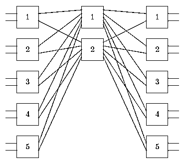
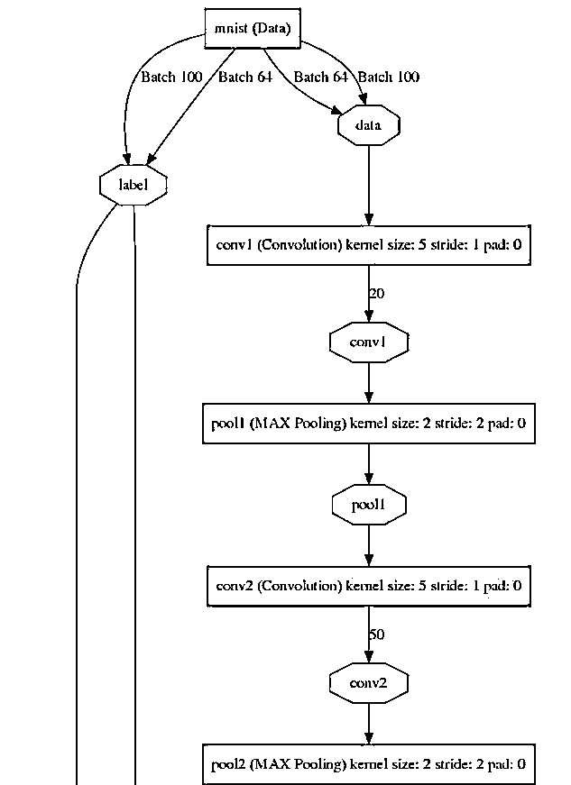

# 【精编干货】史上最全神经网络结构图画图工具介绍，没有之一！

> 原文：[`mp.weixin.qq.com/s?__biz=MzAxNTc0Mjg0Mg==&mid=2653284913&idx=1&sn=9673d5d7a8f0a6fb06f03c93ef137096&chksm=802e2824b759a132598fdfb12421145e0fc80e20bd1470515cc45337be5610a3e2d74bebaeb3&scene=27#wechat_redirect`](http://mp.weixin.qq.com/s?__biz=MzAxNTc0Mjg0Mg==&mid=2653284913&idx=1&sn=9673d5d7a8f0a6fb06f03c93ef137096&chksm=802e2824b759a132598fdfb12421145e0fc80e20bd1470515cc45337be5610a3e2d74bebaeb3&scene=27#wechat_redirect)


**编辑部**

微信公众号

**关键字**全网搜索最新排名

**『量化投资』：排名第一**

**『量       化』：排名第一**

**『机器学习』：排名第四**

我们会再接再厉

成为全网**优质的**金融、技术类公众号

**NN**PNG**前言**最近看到知乎上有人提问，关于神经网络结构图的问题，编辑部决定给大家做一期比较全面详细的介绍，希望对大家在这方面的空缺和疑惑有所帮助。**所有文档在文末下载。**

**LaTeX**

我们给出了部分内容，全部文章，请在文末获取

# **绘制网络结点图的 tikz 库**

> 在控制论或者是智能领域，神经网络是经常接触到的，另外，研究网络时，也经常需要绘制网络结点图，下面介绍一个 tikz 库可以非常方便地绘制这类图。

The following example shows a Rearrangeable Clos Network.





Kalman Filter System Model


**神经网络绘图包**

> 包的整体设计非常不错，使用也很方便，作者使用该包写了一个版面不错的文档。

Linear regression may be visualised as a graph. The output is simply the weighted sum of the inputs:


Logistic regression is a powerful tool but it can only form simple hypotheses, since it operates on a linear combination of the input values (albeit applying a non-linear function as soon as possible). Neural networks are constructed from layers of such non-linear mixing elements, allowing development of more complex hypotheses. This is achieved by stacking4 logistic regression networks to produce more complex behaviour. The inclusion of extra non-linear mixing stages between the input and the output nodes can increase the complexity of the network, allowing it to develop more advanced hypotheses. This is relatively simple:


The presence of multiple layers can be used to construct all the elementary logic gates. This in turn allows construction of advanced digital processing logic in neural networks – and this construction occurs automatically during the learning stage. Some examples are shown below, which take inputs of 0/1 and which return a positive output for true and a non-positive output for false:


From these, it becomes trivial to construct other gates. Negating the  values produces the inverted gates, and these can be used to construct more complex gates. Thus, neural networks may be understood as “self-designing microchips”, capable of both digital and analogue processing.


**Omnigraffle**

我们给出了部分内容，全部文章，请在文末获取

> OmniGraffle 是由 The Omni Group 制作的一款绘图软件，其只能于运行在 Mac OS X 和 iPad 平台之上，添加公式可以配合 latexit 使用。可以用来绘制图表，流程图，组织结构图以及插图，也可以用来组织头脑中思考的信息，组织头脑风暴的结果，绘制心智图，作为样式管理器，或设计网页或 PDF 文档的原型。嵌入在论文里导出成 pdf，嵌入在网页里导出成 svg。十分方便。


**Python**

我们给出了部分内容，全部文章，请在文末获取

# **draw_convnet**

Python script for illustrating Convolutional Neural Network (ConvNet)


部分代码：


**DSL**

我们给出了部分内容，全部文章，请在文末获取

> DSL 深度神经网络，支持 Torch 和 Caffe

# **DNNGraph - A deep neural network model generation DSL in Haskell**

**It consists of several parts:**

*   A DSL for specifying the model. This uses the lens library for elegant, composable constructions, and the fgl graph library for specifying the network layout.

*   A set of optimization passes that run over the graph representation to improve the performance of the model. For example, we can take advantage of the fact that several layers types (ReLU, Dropout) can operate in-place.

*   A set of backends to generate code for the platform. Currently, we generate

*   Caffe (by generating model prototxt files)

*   Torch (by generating Lua scripts)

*   A set of useful CLI tools for exporting, visualizing and understanding a model (visualization of network structure, parameter density)

**DSL Examples**

****

****

**（部分）**

****Joseph Paul Cohen Ph.D****

*** Postdoctoral Fellow at Montreal Institute for Learning Algorithms at University of Montreal**

*** Friend of the Farlow Fellow at Harvard University**

*** National Science Foundation Graduate Fellow**

# ****Visualizing CNN architectures side by side with mxnet****

**Convolutional Neural Networks can be visualized as computation graphs with input nodes where the computation starts and output nodes where the result can be read. Here the models that are provided with mxnet are compared using the mx.viz.plot_network method. The output node is at the top and the input node is at the bottom.**

****

****

**（部分）**

****Python + Graphviz****

**我们给出了部分内容，全部文章，请在文末获取**

> **针对节点较多的网络，不可避免需要投入大量尽量来写重复的脚本代码。用 python 编写了一个简单的 dot 脚本生成工具（MakeNN），可以很方便的输入参数生成 nn 结构图。**

**部分代码** 

****

****

******Graphviz - **dot****

**我们给出了部分内容，全部文章，请在文末获取**

**在 dot 里面 label 的玩法比较多，在上面看到的每个节点都是简单的一段文字，如果想要比较复杂的结构怎么办？如下图：**

****

**对应的代码如下：**

****

**这个还不算厉害的，label 还支持 HTML 格式的，这样你能想得到的大部分样子的节点都可以被定义出来了：**

****

**对应的代码如下：**

****

**接着来看 cluster 的概念，在 dot 中以 cluster 开头的子图会被当做是一个新的布局来处理，而不是在原图的基础上继续操作。比如：** 

****

**对应的代码如下：**

****

**如果没有 cluster 的话我们大概能想象的出来最后的结果是什么样子的。可能会想能不能将一个节点直接指向 cluster？答案是不能！对于这种需求可以用 lhead 来搞定：**

****

**生成图片如下：**

****

****Keras****

**我们给出了部分内容，全部文章，请在文末获取**

> **使用 Keras 框架（后端可选 tensorflow 或者 theano），可以画出卷积神经网络的结构图。**

```py
`from keras.layers import Input, Convolution2D, Flatten, Dense, Activationfrom keras.models import Sequentialfrom keras.optimizers import SGD , Adamfrom keras.initializations import normalfrom keras.utils.visualize_util import plot# apply a 3x3 convolution with 64 output filters on a 256x256 image:model = Sequential()
model.add(Convolution2D(64, 3, 3, border_mode='same', dim_ordering='th',input_shape=(3, 256, 256)))# now model.output_shape == (None, 64, 256, 256)# add a 3x3 convolution on top, with 32 output filters:model.add(Convolution2D(32, 3, 3, border_mode='same', dim_ordering='th'))# now model.output_shape == (None, 32, 256, 256)adam = Adam(lr=1e-6)
model.compile(loss='mse',optimizer=adam)
print("We finish building the model")

plot(model, to_file='model1.png', show_shapes=True)`
```

****

```py
`from keras.layers import Input, Convolution2D, MaxPooling2D, Flatten, Dense
from keras.models import Model
from keras.utils.visualize_util import plotinputs = Input(shape=(229, 229, 3))x = Convolution2D(32, 3, 3, subsample=(2, 2), border_mode='valid', dim_ordering='tf')(inputs)x = Flatten()(x)loss = Dense(32, activation='relu', name='loss')(x)model = Model(input=inputs, output=loss)model.compile(optimizer='rmsprop', loss='binary_crossentropy')# visualize model layout with pydot_ngplot(model, to_file='model2.png', show_shapes=True)`
```

****

```py
`from keras.layers import Input, Convolution2D, Flatten, Dense, Activationfrom keras.models import Sequentialfrom keras.optimizers import SGD , Adamfrom keras.initializations import normalfrom keras.utils.visualize_util import plot

print("Now we build the model")
model = Sequential()
img_channels = 4 #output dimenson nothing with channelsimg_rows = 80img_cols = 80model.add(Convolution2D(32, 8, 8, subsample=(4,4),init=lambda shape, name: normal(shape, scale=0.01, name=name), border_mode='same', dim_ordering='th',input_shape=(img_channels,img_rows,img_cols)))
model.add(Activation('relu'))
model.add(Convolution2D(64, 4, 4, subsample=(2,2),init=lambda shape, name: normal(shape, scale=0.01, name=name), border_mode='same', dim_ordering='th'))
model.add(Activation('relu'))
model.add(Convolution2D(64, 3, 3, subsample=(1,1),init=lambda shape, name: normal(shape, scale=0.01, name=name), border_mode='same', dim_ordering='th'))
model.add(Activation('relu'))
model.add(Flatten())
model.add(Dense(512, init=lambda shape, name: normal(shape, scale=0.01, name=name)))
model.add(Activation('relu'))
model.add(Dense(2,init=lambda shape, name: normal(shape, scale=0.01, name=name)))

adam = Adam(lr=1e-6)
model.compile(loss='mse',optimizer=adam)
print("We finish building the model")

plot(model, to_file='model3.png', show_shapes=True)`
```

****

****Netscope****

**Netscope 是个支持 prototxt 格式描述的神经网络结构的在线可视工具，地址：http://ethereon.github.io/netscope/quickstart.html **

****

**它可以用来可视化 Caffe 结构里 prototxt 格式的网络结构。地址：http://ethereon.github.io/netscope/#/editor** 

****

**点击**Launch Editor**，把你的描述神经网络结构的 prototxt 文件复制到该编辑框里，按**shift＋enter**，就可以直接以图形方式显示网络的结构。 **

**比如,以 mnist 的 LeNet 网络结构为例，把 Caffe 中 example/mnist/lenet_train_test.prototxt 文件的内容复制到编译框，按 shift + enter,立即就可以得到可视化的结构图。 **

****

****Caffe****

**我们给出了部分内容，全部文章，请在文末获取**

**Python/draw_net.py, 这个文件，就是用来绘制网络模型的。也就是将网络模型由 prototxt 变成一张图片。**

****绘制 Lenet 模型****

**# sudo python python/draw_net.py examples/mnist/lenet_train_test.prototxt netImage/lenet.png --rankdir=TB**

****

**（部分）**

****Draw Freely | Inkscape****

****

****

****投稿、商业合作****

****请发邮件到：lhtzjqxx@163.com****

****关注者****

****从****1 到 10000+****

****我们每天都在进步****

**听说，置顶关注我们的人都不一般**

****

********

**后台回复**

****神经网络图****

**即可获取**