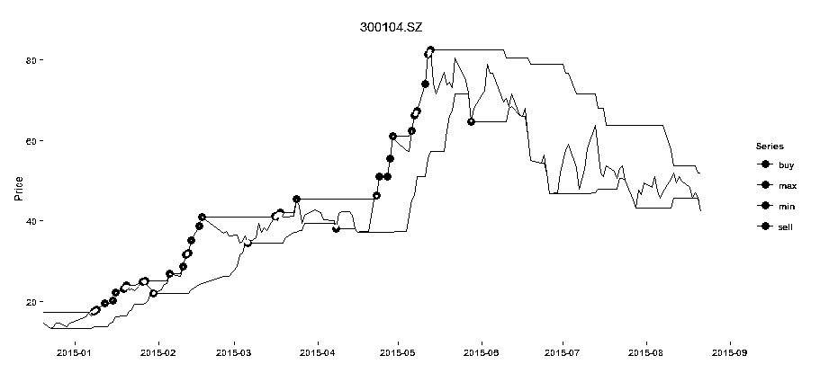

# R 语言构建追涨杀跌量化交易模型（附源代码）

> 原文：[`mp.weixin.qq.com/s?__biz=MzAxNTc0Mjg0Mg==&mid=2653284868&idx=1&sn=5b0e8f26957783e8dad4ab7e74fb5208&chksm=802e2811b759a1070c869e430aed820e8296e9d9d97a9cd6bddfdf2bae88d6e836db3a668200&scene=27#wechat_redirect`](http://mp.weixin.qq.com/s?__biz=MzAxNTc0Mjg0Mg==&mid=2653284868&idx=1&sn=5b0e8f26957783e8dad4ab7e74fb5208&chksm=802e2811b759a1070c869e430aed820e8296e9d9d97a9cd6bddfdf2bae88d6e836db3a668200&scene=27#wechat_redirect)


**编辑部**

微信公众号

**关键字**全网搜索最新排名

**『量化投资』：排名第一**

**『量       化』：排名第一**

**『机器学习』：排名第四**

我们会再接再厉

成为全网**优质的**金融、技术类公众号

**作者**

**张丹（Conan）**

**来源**

**http://blog.fens.me**

**R**quant**前言**最近有读者要求公众号推送几篇关于 R 语言量化投资的内容。今天推送第一篇。后续我们会推出公众号编辑部更好的原创作品，关于 R 语言量化投资。

久经股市的老股民，通常都会使用一种常见的交易策略，追涨杀跌交易法。追涨杀跌法，是股市操作的一个重要技巧，就是在股市上涨时买入股票，股市下跌时卖出股票。如果操作得当是很好的赢利手段，在中国股市 2015 年上半年的牛市中，追涨杀跌交易法就是交易神器法门。

## **1\. 什么是追涨杀跌？**

追涨杀跌是金融市场的专业术语，是金融技术派操盘的一种方式，与抄底摸顶的操作方式刚好相反。追涨杀跌的操作方法是，金融市场中在金融产品(股票，期货，外汇等)价格上涨的时候买入，以期待涨得更多，并以更高的价格卖出获利；在价格下跌的时候卖出进行止损，不管之前金融产品买入的价格是多少，都立刻卖出，以避免更大的损失。

下面以平安银行(000001)股票日 K 线图为例，截取 2005 年到 2015 年 7 月的股票数据，股价为向前复权的价格。


上图中有 3 条曲线，黑色线是平安银行向前复权后的每日股价，红色线为 20 日均线，蓝色线为 60 日均线。图中还有一条红色的水平线虚线，是这 10 年的股价平均值等于 7.14 元。这 10 年间，平安银行股价起起落落，每次上涨都会持续一段时间，那么在我们可以上涨中段追入买进，在大幅下跌之前卖出，就是追涨杀跌法。

**追涨**

追涨通常有 2 种情况，短线追涨和中线追涨。以股票交易为例。

*   **短线追涨**：当天股价已经涨了 5 个点或更多，这时追进去买入，期待当天收盘涨停，等下一个交易日高价卖出，这就是短线追涨。

*   **中线追涨**：某只股票的股价已经上涨了一段时间，走势很强，底部上涨已经有 30%或更多，这个时追进去买入，期待后势持续上涨，是中线追涨。

不论短线追涨还是中线追涨，我们追涨的理由和判断的标准都是一样的，“涨得好的股票说明走势很强，那么追强势股期待股票持续上涨”。但从另一个角度看，追涨的风险也是很大的，关键在于我们不知道它能涨到什么时候，到什么位置可能会回调，什么时候是庄家出货。所以说追涨技巧性很强，什么情况下能追，什么情况下不能追，都是很有讲究的。

**杀跌**

杀跌也是一门较深的操作技巧，杀得好的话既可以回避风险。如果不能进行杀跌的准确判断，则很可能会发生硬性止损，导致严重的亏损。

采取杀跌战术，必须掌握以下操作要点：

*   杀跌的重要前提是知变，就是对消息、对量能、对周边各种因素的影响有一个准确的、快速的知变过程。

*   杀跌要善于观察盘面、形态、消息、舆论等方面的细微变化，在对大盘作出准确估量的基础上，迅速作出反应就是确定卖出哪支股票，卖出多少等。

*   杀跌要善于思考大盘与目标股之问的正向、反向的相关性，及目标股的能量能等方向的关系，从中找出变动的规律。

*   当市场利好消息接踵而至时，应随时准备卖出股票。当利好出尽就会转向利空，往往消息明朗时，股价早已下跌大半，导致措手不及。

杀跌的后续操作就比较简单了，只需保持良好的心态，耐心等待见底信号后再抄底。一般只有在底部成功接回股票或换股才算成功的杀跌，否则杀跌会失去意义。应保持耐心，千万不要在股价反弹时贸然介入，否则屡买屡跌、会加大损失，应待股价反转时再介入。

**追涨杀跌的技巧**

要观大势，看清整个市场多空对决的优势一方是谁。

追涨杀跌的假设条件：

*   市场处于强势交易格局。强势格局赋予个股良好的运作基础；相反，如果市场处于平衡状态，就不适合进行追涨杀跌，更适合高抛低吸。

*   市场形成了鲜明并有持续性上涨能力的热点或板块效应。

追涨操作的对象：

*   市场形成鲜明的可持续性的热点时，可追涨这个热点。从理论上讲，只要把握热点板块就能获利，追涨时应重点关注龙头企业。比如：沪深 300 指数的成分股，就是不错的选择。

*   形成明显的上涨趋势的个股可以考虑追涨。个股突破重要的压力线，如头肩底形态的颈线位、整理箱体的箱顶位、三角形的上边眼、长期下降趋势线等，待回抽确认其突破的有效性后，可考虑追涨。

追涨杀跌的注意事项:

*   追涨时应设好止盈位和止损位，确定自己的大致盈利目标。

*   追涨杀跌应该注意频率的减少，过于频繁的操作，一旦失误增多会严重影响情绪。

*   追涨杀跌中要多一分平和的心态，少一些侥幸；多一分理性,少一分感性。

**追涨杀跌的市场操作**

在弱市中，短线追涨往往容易被套，因为弱市里大部分股票的行情只有一天，当天追得高了，第二天多半没有获利逃出的机会。相反，弱市中，中线追涨比较可取，能够在弱市中保持强势的股票不多，但这种强势反而可以持续。但很多时候，弱市中这样的股票反倒不敢追了。

有些人专门追涨停板，追新股开板，追次新股开板等，对于 2015 年上半年 IPO 的新股来说收获颇丰，如暴风科技，中超电缆等，其他的时候可能用这套追涨停策略就行不通了。


我自己操作并不会盲目追涨，安全第一，虽然还没有吃过追涨的亏，但由于本人目前还不具备基本面的分析能力，也没有消息的渠道，仅仅从技术指标入手，投机性太重，很容易被庄家玩死的。道理很简单，因为如果追涨了，下跌的空间自然就大了，尤其中线追涨，庄家获利后随时可能出货。这时候就必须要做好杀跌的策略。庄股出货跌个 50%太普遍了，而且跌下去就很难再起来，这种时候不杀跌就等于自杀。所以，追涨之前一定要想清楚，务必先设好止损位，不能只憧憬获利的美妙。

杀跌也有讲究，不是一跌就杀，震荡、洗盘是很常见的，问题在于正确地区别震仓与出货是很难的，所以很多人是硬性止损，即预先设定价位或百分比，到这个位置就坚决出局，不管它是震仓还是庄家出货。这个时候如果没有基本面的判断或第一手消息的来源，就容易被震荡出局。当然，和不确定的风险相比，我其实更愿意早点出来。

## **2\. 追涨杀跌的建型和实现**

既然我们要进行追涨杀跌的操作，就要定义什么是追涨，什么又是杀跌，需要把追涨杀跌的概念量化出来，从而进行建模和实现。对于短线追涨策略可以简单粗暴地选择当日涨幅超过 5%的股票进行买入，第二日开盘卖出或到止损位卖出，并没有太多的技术细节，再计算一下胜率概率，就能知道我们要不要短线追涨。

下文我们将以中线追涨为例，进行建模和程序实现。

那么对于中线追涨的情况，我们核心的策略思路就可以转化为，当股价(成交量)向上突破最近 20 日最高价格(量)时买入，当股价向下突破最近 10 日最低价格卖出，并以沪深 300 成分股做为股票交易的标的。其中，为什么是 20 日最高和 10 日最低都是经验值，可以做为模型参数进行训练和优化。选择沪深 300 成分股为标的，是考虑到这些股票都是各个板块的强势股或龙头股，要符合追涨杀跌的假设条件。

计算公式:

```py
20 日最高价 = max(T 日股价,T-1 日股价 ... , T-19 日股价)
20 日最高量 = max(T 日成交量,T-1 日成交量 ... , T-19 日成交量)
10 日最低价 = min(T 日股价,T-1 日股价 ... , T-9 日股价)
```

当股价大于等于 20 日最高价时作为买入信号点，当股价小于等于 10 日最低价时作为卖出信号点。这样我们就把追涨杀跌的投资理论，变成了一个数学模型。

接下来，我们利用 R 语言对股票数据的进行操作，来实现一个追涨杀跌模型的实例，从而验证我的们投资理论，是否能发现赚钱的机会。

**2.1 数据准备**

R 语言本身提供了丰富的金融函数工具包，时间序列包 zoo 和 xts，指标计算包 TTR，数据处理包 plyr，可视包 ggplot2 等，我们会一起使用这些工具包来完成建模、计算和可视化的工作。本文用到的数据，包括 A 股日 K 线(向前复权)数据，从 2014 年 7 月到 2015 年日 8 月，以 CSV 格式保存到本地文件 stock.csv。

数据格式如下：

```py
000001.SZ,2014-07-02,8.14,8.18,8.10,8.17,28604171
000002.SZ,2014-07-02,8.09,8.13,8.05,8.12,40633122
000004.SZ,2014-07-02,13.9,13.99,13.82,13.95,1081139
000005.SZ,2014-07-02,2.27,2.29,2.26,2.28,4157537
000006.SZ,2014-07-02,4.57,4.57,4.50,4.55,5137384
000010.SZ,2014-07-02,6.6,6.82,6.5,6.73,9909143
```

一共 7 列：

*   第 1 列，股票代码，code，000001.SZ

*   第 2 列，交易日期，date，2014-07-02

*   第 3 列，开盘价，Open，8.14

*   第 4 列，最高价，High，8.18

*   第 5 列，最低价，Low，8.10

*   第 6 列，收盘价，Close，8.17

*   第 7 列，交易量，Volume，28604171

通过 R 语言加载股票数据，由于数据所有股票都是混合在一起的，而进行计算时又需要按每支票股计算，所以在数据加载时我就进行了转换，按股票代码进行分组，生成 R 语言的 list 对象，同时把每支股票的 data.frame 类型对象转成 XTS 时间序列类型对象，方便后续的数据处理。

```py
#加载工具包
> library(plyr)
> library(xts)
> library(TTR)
> library(ggplot2)
> library(scales)
中间代码省略··························
# 查看股票 000001.SZ
> head(data[['000001.SZ']])
               Open     High      Low    Close   Volume
2014-07-02 8.146949 8.180000 8.105636 8.171737 28604171
2014-07-03 8.171737 8.254364 8.122162 8.229576 44690486
2014-07-04 8.237838 8.270889 8.146949 8.188263 34231126
2014-07-07 8.188263 8.204788 8.097374 8.146949 34306164
2014-07-08 8.130424 8.204788 8.072586 8.204788 34608702
2014-07-09 8.196525 8.196525 7.915596 7.973434 58789114
```

把数据准备好了，我们就可以来建立模型了。

**2.2 追涨杀跌模型**

为了能拉近我们对市场的了解，我们取从 2015 年 1 月 1 日开始的数据，来创建追涨杀跌的模型。以乐视网(300104)的为例，画出乐视网自 2015 年以来的每日收盘价，20 日最高价和 10 日最低价。乐视网作为创业板标杆的上市公司，在 2015 年 7 月首次被纳入沪深 300 指数。

```py
# 日 K 线数据
> title<-'300104.SZ'
> stock<-data[[title]]                                # 获得股票数据
> sDate<-as.Date("2015-01-01")                        # 开始日期
> eDate<-as.Date("2015-08-24")                        # 结束日期
> cdata<-stock[dateArea(sDate,eDate,360)]$Close       # 获得收盘价
> vdata<-stock[dateArea(sDate,eDate,360)]$Volume      # 获得交易量

# 收盘价
> names(cdata)<-"Value"   # 重置列名
> tail(cdata)
           Value
2015-08-14 49.81
2015-08-17 48.30
2015-08-18 45.57
2015-08-19 46.98
2015-08-20 45.79
2015-08-21 42.14

# 交易量
> tail(vdata)
             Volume
2015-08-14 42108324
2015-08-17 35939096
2015-08-18 52745702
2015-08-19 43447844
2015-08-20 32916746
2015-08-21 34802494
```

定义画图函数 drawLine()，支持画出多条曲线，包括收盘价，最高价，最低价。

```py
# 画图函数
> drawLine<-function(cdata,titie="Stock",sDate=min(index(cdata)),eDate=max(index(cdata)),breaks="1 year"){
+     if(sDate<min(index(cdata))) sDate=min(index(cdata))
+     if(eDate>max(index(cdata))) eDate=max(index(cdata))  
+     cdata<-na.omit(cdata)
+     
+     g<-ggplot(aes(x=Index, y=Value),data=fortify(cdata[,1],melt=TRUE))
+     g<-g+geom_line()
+     
+     if(ncol(cdata)>1){ # 多条线
+         g<-g+geom_line(aes(colour=Series),data=fortify(cdata[,-1],melt=TRUE))  
+     }
+     
+     g<-g+scale_x_date(labels=date_format("%Y-%m"),breaks=date_breaks(breaks),limits = c(sDate,eDate))
+     g<-g+ylim(min(cdata$Value), max(cdata$Value))
+     g<-g+xlab("") + ylab("Price")+ggtitle(title)
+     g
+ }

# 画出收盘价
# drawLine(cdata,title,sDate,eDate,'1 month')    # 画图

# 计算最近 20 日的最高价和 10 日的最低价
> minmax<-function(data,max=20,min=10){
+   d1<-na.locf(data,fromLast=TRUE)
+   d2<-merge(d1,min=runMin(d1,min),max=runMax(d1,max))
+   return(d2[,-1])
+ }

# 画出股价，最高价和最低价
> ldata<-cbind(cdata,minmax(cdata))
> drawLine(ldata,title,sDate,eDate,'1 month')    # 画图
```


上图中有 3 条线，黑色线为乐视网的每日收盘价，蓝色线为最近 20 日最高价，红色线为最近 10 日最低价。

根据模型的计算公式，我们计算买入信号，当股价向上突破最近 20 日最高价格时买入。

```py
# 买入信号函数
> buyPoint<-function(ldata){   
+  idx<-which(ldata$Value == ldata$max)
+  return(ldata[idx,])                                  
+ }

# 计算买入的点
> buydata<-buyPoint(ldata)
> buydata
              Value      min      max
2015-01-08 17.43721 13.70164 17.43721
省略······················
```

画出买入的信号图，让我们可以直观的看到效果。

```py
# 画图函数
> drawPoint<-function(ldata,pdata,titie,sDate,eDate,breaks="1 year"){
+     ldata<-na.omit(ldata)
+     g<-ggplot(aes(x=Index, y=Value),data=fortify(ldata[,1],melt=TRUE))
+     g<-g+geom_line()
+     g<-g+geom_line(aes(colour=Series),data=fortify(ldata[,-1],melt=TRUE))
+     
+     if(is.data.frame(pdata)){
+         g<-g+geom_point(aes(x=Index,y=Value,colour=op),data=pdata,size=4)
+     }else{
+         g<-g+geom_point(aes(x=Index,y=Value,colour=Series),data=na.omit(fortify(pdata,melt=TRUE)),size=4)  
+     }
+     g<-g+scale_x_date(labels=date_format("%Y-%m"),breaks=date_breaks(breaks),limits = c(sDate,eDate))
+     g<-g+xlab("") + ylab("Price")+ggtitle(title)
+     g
+ }

> drawPoint(ldata,buydata$Value,title,sDate,eDate,'1 month')  # 画图
```


如上图所示，蓝色的点为股价大于等于最近 20 日最高价的点，作为买入信号。所有买入信号点，都是出现在单边上行的牛势中，对于 2015 年上半年以来的行情来说，追涨的信号会被大量触发。

接下来，我们继续计算卖出信号点，当股价小于等于最近 10 日最低价时作为卖出信号点。

```py
> # 计算卖出的信号点
> stopPoint<-function(ldata,buydata){  
+     idx<-which(ldata$Value == ldata$min)
+     idx<-idx[which(c(0,diff(idx))!=1)]   # 第一点用 0 表示
+     
+     selldata<-ldata[idx,]               # 所有低于最小值的点  
+     idx2<-sapply(index(buydata),function(e){  # 买后的卖点
+         head(which(index(selldata)>e),1)
+     })
+     
+     return(selldata[unique(idx2),])
+ } 

# 卖出信号
> selldata<-stopPoint(ldata,buydata)
> selldata
              Value      min      max
2015-01-30 21.99533 21.99533 25.16284
2015-03-06 34.32453 34.32453 40.99130
2015-04-08 38.01011 38.01011 45.34946
2015-05-28 64.68000 64.68000 82.49000
```

一共有 4 笔卖出信号，为了让数据更加直观，我们合并买入信号和卖出信号，进行画图可视化。

```py
# 买卖信号，画图
> bsdata<-merge(buydata$Value,selldata$Value)
> names(bsdata)<-c("buy","sell")
> drawPoint(ldata,bsdata,title,sDate,eDate,'1 month') #画图
```



上图中，紫色点为卖出信号点，红色点为买入信号点。我们可以很明显的看出，如果根据交易信号在红色点买入，紫色点卖出，我们是应该赚钱的。那么具体赚了多少呢，我需要计算出来？

```py
> # 合并交易信号
> signal<-function(buy, sell){
+     selldf<-data.frame(sell,op=as.character(rep("S",nrow(sell))))
+     buydf<-data.frame(buy,op=as.character(rep("B",nrow(buy))))
+     sdata<-rbind(buydf,selldf)                                       # 交易信号数据
+     sdata[order(as.Date(row.names(sdata))),]
+ }

# 合并交易信号
> sdata<-signal(buydata,selldata)                                   
> sdata
              Value      min      max op
2015-01-08 17.43721 13.70164 17.43721  B
省略···················
```

接下来，我们利用交易信号数据，进行模拟交易。我们设定交易参数和规则：

*   以 10 万元人民币为本金。

*   买入信号出现时，以收盘价买入，每次买入价值 1 万元的股票。如果连续出现买入信号，则一直买入。若现金不足 1 万元时，则跳过买入信号。

*   卖出信号出现时，以收盘价卖出，一次性平仓信号对应的股票。

*   手续费为 0 元

下面我们进行模拟交易。

```py
> # 模拟交易
> trade<-function(sdata,capital=100000,fixMoney=10000){ # 交易信号，总资金，每次定投资金
+     amount<-0
+     cash<-capital
+     
+     ticks<-data.frame()
+     for(i in 1:nrow(sdata)){
+         row<-sdata[i,]
+         if(row$op=='B'){
+             if(cash<fixMoney){
+                 print(paste(row.names(row),"No enough cash"))
+                 next
+             }
+             amount0<-floor(fixMoney/row$Value) # 本次交易量
+             amount<-amount+amount0
+             cash<-cash-amount0*row$Value
+         }
+         
+         if(row$op=='S'){
+             cash<-cash+amount*row$Value
+             amount<-0
+         }
+         
+         row$cash<-round(cash,2)
+         row$amount<-amount
+         row$asset<-round(cash+amount*row$Value,2)
+         ticks<-rbind(ticks,row)
+     }
+     
+     
+     ticks$diff<-c(0,round(diff(ticks$asset),2))
+     
+     rise<-ticks[intersect(which(ticks$diff>0),which(ticks$op=='S')),]   # 赚钱的交易
+     fall<-ticks[intersect(which(ticks$diff<0),which(ticks$op=='S')),]   # 赔钱的交易
+     
+     return(list(
+         ticks=ticks,
+         rise=rise,
+         fall=fall
+     ))
+ }

# 交易结果
> result<-trade(sdata,100000,10000)  
```

来看一下，每笔交易的明细。

```py
> result$ticks
              Value      min      max op      cash amount    asset      diff
2015-01-08 17.43721 13.70164 17.43721  B  90008.48    573 100000.0      0.00
省略·····················
```

一共发生了 34 笔交易，其中 30 笔买入，4 笔卖出。最后，资金剩余 111495.9 元，赚了 11495 元，收益率 11.5%。

## **3\. 模型优化**

我们看到在强势格局的大牛市中，通过追涨能让我们获利颇丰。其实我们可以把模型再进一步优化的，在构建卖出信号时，是以最近 10 日最低价为卖出点来看，应该还有更好的卖出点可以选择。那么我们就要优化一下模型，比如按下面的优化条件。当股价低于前一个买入点价格的时进行卖出，把小于等于最近 10 日最低价设为止损点。按照这样的优化策略，我们是不是可以有更大的收益呢？

这样的优化思路，会让我们策略对波动更敏感，更容易被震荡出局；当然好外在于，可以更快的触发止盈和止损条件，牛市中收益更大。

```py
# 优化条件，当股价低于前一个买入点价格时进行卖出，小于 10 日最低价为止损点。
> # 计算卖出的信号点
> sellPoint<-function(ldata,buydata){
+     
+     arr<-c()
+     for(i in 1:nrow(buydata)){
+         
+         if(i>1){ # 跳转第一个点
+             date<-index(buydata[i,])#;print(date)      
+             
+             # 价格 小于 上一次的买入的价格就卖出
+             last<-as.vector(buydata[i-1,]$Value) # 上一次买入的价格
+             lst<-ldata[paste(date,"/",sep="")]$Value      
+             idx<-head(which(lst < last),1)
+             
+             if(length(idx)>0){        
+                 arr<-rbind(arr,index(lst[idx]))
+             }
+         }
+     }
+     selldata<-ldata[as.Date(unique(arr)),]
+     
+     # 过滤多余的卖出点
+     bsdata<-merge(buydata$Value,selldata$Value)
+     names(bsdata)<-c("buy","Value")
+     idx1<-which(!is.na(bsdata$Value))
+     idx2<-idx1[which(c(0,diff(idx1))==1)]
+     bsdata$Value[idx2]<-NA
+     return(bsdata$Value[which(!is.na(bsdata$Value))])
+     
+ }

# 卖出信号
> selldata<-sellPoint(ldata,buydata)
> selldata
              Value
2015-01-21 22.81788
2015-01-28 23.60408
2015-02-25 36.89217
2015-03-17 39.97333
2015-03-19 40.96858
2015-03-26 39.25985
2015-05-14 74.24000
```

我们重新生成了，卖出的信号点有 7 个，比上次多出 3 个点，画出交易信号的图形。


合并买卖的交易信号。

```py
> sdata<-signal(buydata$Value,selldata$Value)                                   # 合并交易信号
> sdata
              Value op
2015-01-08 17.43721  B
2015-01-09 17.98709  B
2015-01-12 19.53222  B
2015-01-15 20.21389  B
2015-01-16 22.23619  B
2015-01-19 23.04056  B
2015-01-20 23.89947  B
2015-01-21 22.81788  S
省略·························
```

一共发生了 37 笔交易，其中 30 笔买入，7 笔卖出。最后，资金剩余 137483.8 元，赚了 37483 元，收益率 37.5%。

我们把卖号信号和止损信号，合并画到一张图上。

```py
# 止损信号
> stopdata<-stopPoint(ldata,buydata)

# 合并买卖信号，止损信号
> bsdata<-merge(buydata$Value,selldata$Value,stopdata$Value)
> names(bsdata)<-c("buy","sell","stop")
> drawPoint(ldata,bsdata,title,sDate,eDate,'1 month') #画图
```


图中红色点为买点，蓝色点为优化的卖点，紫色点为止损点。从图中可以非常清楚的看到，蓝色卖出点要优于紫色的止损点。这样就达到了，模型优化的目的了。虽然只是一个很小的优化，就可以给我们带来不错的收益。

追涨杀跌策略在牛市中会让我们赚取非常大的利润，那么对于 2015 年下半年行情，牛市已经不复存在，震荡市会一直持续，那么我们可以使用均值回归策略，发现逆市中的投资机会。

最后总结，本文从 追涨杀跌 的思路开始，到市场特征检验，再到数学公式，R 语言建模，再到历史数据回测。通过 R 语言，很简单地就实现了一个我们脑子中的投资想法。

**投稿、商业合作**

**请发邮件到：lhtzjqxx@163.com**

**关注者**

**从****1 到 10000+**

**我们每天都在进步**

听说，置顶关注我们的人都不一般


****