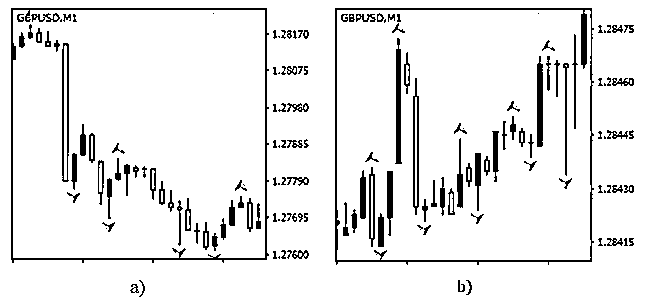
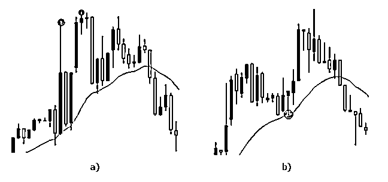
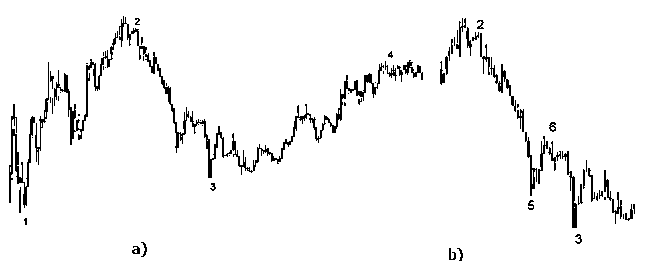
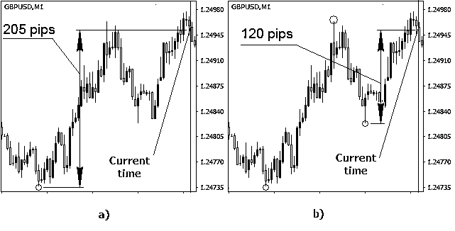
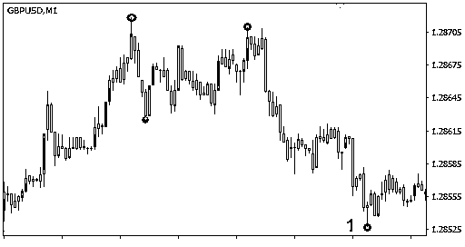
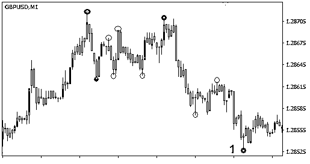
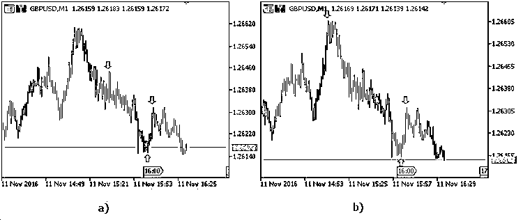
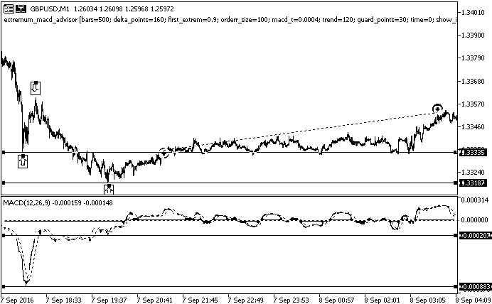
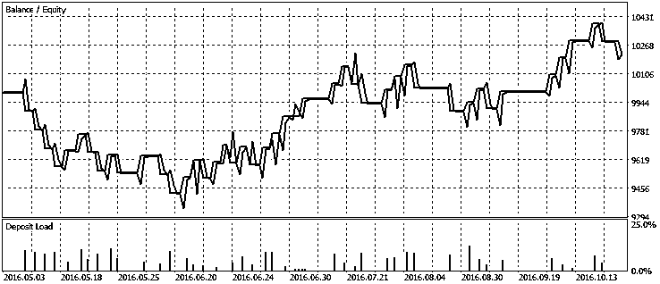

# 根据价格变化自动识别极值点策略

> 原文：[`mp.weixin.qq.com/s?__biz=MzAxNTc0Mjg0Mg==&mid=2653284866&idx=1&sn=3e05663c5c6c1b9f223080253fd651d5&chksm=802e2817b759a1010ee770ccbbef179c5c667c507c901df92475a9ca84dadbfacb9173ac3002&scene=27#wechat_redirect`](http://mp.weixin.qq.com/s?__biz=MzAxNTc0Mjg0Mg==&mid=2653284866&idx=1&sn=3e05663c5c6c1b9f223080253fd651d5&chksm=802e2817b759a1010ee770ccbbef179c5c667c507c901df92475a9ca84dadbfacb9173ac3002&scene=27#wechat_redirect)

**编辑部**

微信公众号

**关键字**全网搜索最新排名

**『量化投资』：排名第一**

**『量       化』：排名第一**

**『机器学习』：排名第四**

我们会再接再厉

成为全网**优质的**金融、技术类公众号

### **简介**

很多流行的交易策略是基于对不同图形化模式的使用: 头肩，双顶/双底，等等。有些策略还会分析图表上极值点的背离。当自动化这样的交易系统时，就会有需要找到、处理和解释图表上的峰谷值，现有的工具不能使我们总是根据建立的标准来找到极值点，本文展示了根据价格变化，在价格图表上找到和处理极值点的有效算法和程序方案。 

### **1\. 已有的搜索极值点的工具**

**1.1\. 分形和类似的工具**

分形(Fractals)是用于找到极值点的流行工具，它们可以在 5 个柱的序列中找到价格的高点和低点(图 1)。极值点在价格变化强弱的情况下都可以定义，如果正确选择了时段，分形可能会显示很好的结果，尽管它们被市场条件的影响很大。 

图 1\. 使用分形的结果: 当存在趋势时，极值点的相对距离大小是从 140 到 420 个点值（pips） (a), 在平盘时期，相对的大小不大于 50 个点值 (b)

在第二种情况下，极值点的相对大小 (从一个极值点到另一个的价格变化) 可能只有几个点值，这样较小的峰谷值通常在人工交易时不做考虑。在时段之间切换并不会改变这些较小的极值点 — 它们在长期平盘时依然出现。 

也可能会出现相反的情况: 没有找到所有的极值点。如果出现了剧烈的市场波动，在短期之内出现了很多峰谷值，它们也不能被发现，分形只能在当前时段由 5 个柱定义的时间段之内侦测到两个极值点。所以，我们无法推荐在自动交易中使用分形指标来侦测所有或者主要关键的极值点。 

如果我们选择了一个大的范围来搜索极值点，它们中的很多都会被忽略掉。如果范围太小，又会找到一些微小的极值点。在任何情况下，当处理结果时，我们或者必须总是人工优化参数来消除那些微小的高价和低价，或者开发一个特别的算法来做这件事。 

**1.2\. 当搜索极值点时使用移动平均**

使用平均线，例如移动平均，作为自动化搜索极值点的基础看起来是可行的。搜索是在指定数量的柱上进行的，看价格偏离平均线是否大于预先定义的距离点数。该工具可以排除掉微小的峰谷值，看起来比分形更好。但是，它还是没有解决在高低价格距离很近时侦测的问题 (图 2, a). 

 

图 2\. 当搜索极值点时使用移动平均: 两个极值点定义为一个 (a), 距离移动平均很近的极值点就被忽略了 (b)

我们可以一起使用移动平均和分形，移动平均用于排除掉微小的极值点，而分形用于在指定的区段中进行搜索。但是，这种方法还是不能解决所有的问题，我们还是需要不断选择最佳的范围参数，否则，两个很近的极值点将只能发现一个 (图 2, a). 

使用这种方法还有另一个问题，在强烈波动中，移动平均根据时段可能会忽略掉信号，在这种情况下(图 2, b), 接近两个峰值的谷值和接近移动平均的部分没有被侦测出来，这样的情形在市场上很罕见，但是它们确实提出了正确选择移动平均范围的问题。 

所以，这种搜索极值点的方法以及它们上面所述的修改方案都是有缺点的，需要进一步的编程方案。让我们详细探讨当搜索极值点时出现的问题，以及来解决它们的算法。

### **2\. 搜索极值点时遇到的问题和乱局**

**2.1\. 选择用于搜索峰值和谷值的变化范围**

已有的策略和技巧可能显式或者隐式地使用了极值点。寻找极值点常常是一项必须的任务：不同的人可能会在同一张图表上找到不同的峰值和谷值。让我们看看一个著名的图形模式 – 双顶。

 图 3\. 双顶模式

两个图表 (图 3) 中包含了相同的模式，但是，我们可能会根据极值点范围的不同侦测到或者未能找到它。在第一个图表上，第一个峰值之后是底部，其后又是第二个峰值。对应地，如果峰值之间没有底部，我们就不能侦测到双顶模式了，该模式会被定义为一个普通的极值点。当底部不明显时，也会发生同样的事情，它会影响到双顶模式而使它难以侦测。当然，在第一个图表上侦测模式与第二个图表相比要容易，而它们之间的仅有区别就是它们相邻极值点的区别。 

让我们讨论另一个例子: 有些策略会在一系列极值点(包括高点和低点)的位置高于前面的点时定义向上的趋势，下行趋势的定义也类似。在图 4 中, 我们可以使用极值点来定义趋势的方向。

图 4\. 相同图表上价格的相反方向走势: 向上趋势 (a), 向下趋势 (b)

同一个图表上同时包含了向上趋势和向下趋势，在第一种情况中(图 4, a), 极值点 1, 2, 3 和 4 明显显示了牛市趋势，然而，如果我们使用极值点 2, 5, 6 和 3 (图 4, b), 我们将看到一个熊势趋势。所以，有可能使用不同的极值点来取得其中一个可能的结果，考虑到这个，我们可以得出结论，变化范围对极值点的位置有最大影响。

**2.2\. 有效分离临近的顶部或者底部**

当定义极值点时还会产生另一个问题，为了有效定义和分离两个或者更多的顶部，它们之间应该有底部，这在第一个例子(寻找顶部和底部)和第二个例子都是对的，尽管这里的例子更有趣一些，根据所描述的策略，我们可以在下面的图表中(图 5, 6) 在找到极值点后侦测到趋势。 

 图 5\. 在长线投资中侦测顶部和底部 

 图 6\. 侦测小的顶部和底部 

如果没有底部把顶部分开(或者相反), 策略就无法根据指定的标准来工作，即使可以在图表上看到向上的趋势。让我们探讨一个典型例子，在向上的趋势中，每个顶部都比之前的一个更高，如果它们之间没有底部或者不能清楚看到，就只有最高的顶点定义为一个极值点，如果相对平均线(例如移动平均线)来定义极值点, 还是需要有分离相邻两个顶部或者底部的任务，为了分出两个顶部，我们应该使用它们之间的一个极值点。

所以，我们可以在显式或者隐式使用极值点的所有策略中使用以下假定: 无论是向前(向将来)还是向后，价格都会从顶部移动到底部，再由底部移动到顶部。如果我们不使用这个假定，那么根据观察的角度，价格图表上的两个顶部：

*   或者被侦测出来，

*   或者只有最高的顶部被侦测到，

*   或者它们中的哪个都没有侦测到。

对于底部也是同样。这个假定使我们可以使用选定的变化范围来开发准确的搜索极值点的算法。

**2.3\. 定义第一个极值点**

第三个问题也是与价格变化相关的，并且发生于定义第一个极值点的时候。对于任何交易技巧或者策略，最近的极值点比更早的极值点更加重要，我们已经发现，定义一个极值点就会影响邻近顶部和底部的位置，所以，如果我们在离当前时间一定距离选择一个极值点，取得的结果比距离更远的历史数据影响更大，并且被最近价格波动的影响会最小。这个问题在使用之字转向指标(ZigZag)的时候也会出现，最近极值点的位置不很依赖于最近的价格波动。  

然而，这种情形在从图表末端搜索极值点时就完全不同了，在这种情况下，我们应该首先在距离图表末端最近的地方找到一个顶部或者底部，然后所有其他的极值点就能清晰定义了。根据使用的策略和选择的变化范围，可以使用三个选项:

*   找到最近的顶部,

*   找到最近的底部,

*   找到最近的极值点(顶部或者底部)

让我们讨论找到最近的极值点，在选择了某个变化范围之后，我们就能准确定义最近的第一个极值点了。然而，这会出现一定的延迟，可能对策略的运行有负面的影响。为了 "看到" 一个极值点，我们需要根据相对那个点的变化范围定义价格的改变，价格的变化需要花费一些时间，所以就有了延迟。我们也可以使用最后的已知价格作为一个极值点，尽管不太可能它真的会变成顶部或者底部。 

在这种情况下，看起来使用另外的比例作为变化范围的一部分来寻找其它的极值点比较合理，例如，让我们选择 0.5 的数值，选择的另外的比例值定义了从当前值到最近底部的最小价格 (对于最近的顶部就是最高价格)，这使我们可以把这个底部 (顶部) 定义为一个极值点，如果当前的价格和最近顶部(底部)的差距小于指定的数值，这样的极值点就不成立。在这种情况下，侦测到的第一个极值点可能就是顶部或者底部。同时，我们也解决了过早检测到极值点的问题，以及随后对它们的分析和(如有必要)开展交易。

让我们探讨一个例子，变化范围设为 140 个点值(pips),将要使用一个另外的比例来侦测极值点。在第一个例子中，它等于 0.9 (图 7, a), 在第二个例子中, 它是 0.7 (图 7, b)。在此，另外的比例值定义了使我们侦测第一个极值点的最小的价格变化点数，在第一个例子中，变化是 126 个点值，而在第二个例子中，它是 98 个点值，在两个例子中使用的是同一张图表。垂直线指出了进行计算时当前的时段。时段内侦测到的极值点以点状显示。 

图 7\. 额外比例在定义极值点中的影响: 对于值等于 0.9 (126 个点值), 第一个极值点是在变化 205 个点值找到的 (a), 对于值等于 0.7 (98 个点值), 第一个极值点是在变化 120 个点值找到的, 而其余的两个点是根据指定范围找到的 (b)

对于第一种情况，选择的额外比例值定义的第一个底部范围是 205 个点值, 而最小的价格变化是点值，对于第二种情况，如果额外的比例值等于 0.7 (98 个点值), 第一个底部定义在距离当前价格 120 个点值的位置。随后的两个极值点事根据指定的变化范围等于 140 个点值来侦测到的。相应地，第一个底部和随后的顶部的差距略微超过 140 个点值。第二个底部也是根据价格相对侦测到的顶部超过 140 个点值来定义的。

我们可以看到，额外比例会明显影响第一个侦测到的极值点的位置，它也可能会影响到它的类型。对于不同的数值(从 0 到 1), 在相同的图表上可能侦测到顶部或者底部，第二个例子中侦测到的前两个极值点 (图 7 b), 就没有在第一个例子中侦测到。

对于更低的比例值，第一个极值点会更快找到。在第二个例子中 (图 7 b), 是用额外比例等于 0.4, 第一个侦测到的极值点可以提前 5 个柱定义 (在当前的时段下是提前 5 分钟)

### **3\. 搜索极值点任务的算法方案和它们的实现**

**3.1 根据变化范围来寻找极值点的算法**

让我们从选择价格范围来构建极值点开始，显然，柱的大小和极值点的参数非常依赖于时段而有很大变化，存在以及没有顶部/底部也会被趋势、一天中的时间以及其它一些因素所影响。已有的指标，例如分形和类似的工具，使我们可以在任何时段中不论趋势存在与否而找到极值点。如果我们在搜索顶部和底部值的时候使用了移动平均，极值点相对移动平均也许只差两点，也可能差 100 点。我们在日内交易中应该注意两个点的极值吗？也许不应该。对于一个长线投资，我们同样不会关心小于 20 个点的极值，不论时段如何，这就是为什么我们需要“变化范围(variation range)”一词，意思是最小值。移动平均可以作为参考点，使得我们可以定义极值点的距离以限制它的最小值。然而，移动平均的周期数会明显地影响所侦测的顶部和底部的位置，使得难以选择某个周期数作为参考。

所以，让我们现在假定价格从顶部跌到底部然后再回来，这个变化范围就用来定义两个相邻极值点的最小价格变化 - 顶部和底部的距离。如果一些极值点已经被定义，其邻近点的距离应该不小于指定的变化范围，这使得我们可以不管时段和趋势来定义极值点。该工具对于日内交易和长线投资都非常适合，让我们探讨它的运行算法。首先，让我们使用相同的图表显式地定义极值点，只是在第一个图表上，变化范围是 60 个点值 (图 8), 而在第二个图表上是 30 个点值(图 9)。让我们假定第一个极值点已经被侦测到 (点 1) 儿我们正搜索前面的极值点。 

 

图 8\. 使用 60 个点值的变化范围

图 9\. 使用 30 个点值的变化范围

对极值点的搜索是从图表的末端开始进行的 (从点 1)。在第一种情况下，在显示的范围内找到了 4 个极值点，在第二种情况下，在同样的时间间隔内找到了 10 个极值点。当在图表的指定部分加大变化范围时，极值点根本没有侦测出来，所以，在选择极值点的搜索范围时我们应该现实些，要考虑到市场的波动和时段。这里，范围是进行搜索的柱的数量。 

记住以上我们所说过的，让我们介绍搜索极值点的迭代算法。为什么要迭代?第一个顶部后面总应该有个底部，然后是第二个顶部，等等。如果没有找到第二个顶部 (图表没有向上方移动), 就重新定义底部的位置，然后再转向时间序列中更远的地方。第一个顶部的位置 (其它极值点也一样) 也可以使用同样的方法修改。我们也应该去掉同一个柱被定义为同时是顶部和底部的情况。

当然，这种方法需要大量的计算，我建议在搜索几个极值点的时候使用它，点的数量越少，程序运行就越快，计算速度也受到搜索范围的影响。这种搜索是要验证的，因为它使您在最近的价格波动中找到影响最大的某些顶部和底部，如果您需要找到多个极值点，我推荐使用之字转向指标(ZigZag)。

**3.2 指标的实现（代码太多省去，只展示结果）**

提供的算法已经用于开发自定义指标来搜索极值点并且在图表上突出显示它们 (图 10).

 图 10\. 指标的运行结果: 变化范围为 120 点值 (a), 变化范围为 160 点值 (b)

取得的结果是根据变化范围定义的，对于 120 点值 或者更少的数值 (图 10, a), 极值点相互之间很接近，而范围的大小不是很关键了，对于 160 点值 和更多的 (图 10, b), 极值点之间的距离就比较远了。这在选择搜索范围的时候应该注意。对于平盘市场，最优选择的范围使我们可以在较小价格变化时自动找到顶部和底部，并且去除(跳过)时间间隔非常大的极值点。

**3.3 实现 MACD 柱形图与价格背离策略的 EA 交易 **

提供的算法可以用于实现各种策略，scale_factor 指标的运行结果很适合用于构造图形模式，例如头肩，双底，等等。它们可以用于使用图表上顶部和底部的价格差异的策略的指标。

根据这个策略，如果价格上升形成新的顶部，高于前一格顶部，但是 MACD 的顶部低于前一个，我们就有了卖出信号。 

如果价格下跌形成新的底部，低于前一个底部，但是 MACD 的底部高于前一个，我们就有了买入信号。signal. 

EA 准确实现了算法，根据变化范围侦测到了顶部和底部，集中于图表上的最近变化。 

传入的参数 — 用于搜索极值点的范围和变化范围。还有必要来设置在价格上涨时最近两个顶部的最小价格差异(对于价格下跌就是最近两个底部)，MACD 柱形图在极值点的最小背离。每次交易的风险以及额外比例是在存款货币中设置的。guard_points 参数定义了止损的偏移，如果是买入仓位就是距离最近底部的偏移，相应地，对于卖出仓位就是顶部上方的偏移。还可以选择在进行交易时显示侦测到的极值点的参数 (show_info=1).

当建立卖出仓位时，止损是根据最近的顶部位置设置的，而当建立买入仓位时，止损是根据最近的底部设置的，这使我们可以在价格强烈波动和平盘市场的时候都能够建立合理的目标。在两种情况下，获利是根据止损距离当前价格的值而对称设置的。在日内交易中，选择的是较小的变化范围，而在长线投资中，建议把变化范围设置到几倍大。 

让我们探讨下面 EA 运作的实例 (图 11). 主要使用的参数: 变化范围  — 160 点值, 最小 MACD 柱形图差距 – 0,0004; 两个最近的顶部/底部的最小价格差距 – 120 点值 以及额外比例 – 0.9. 

图 11\. EA 的运行结果

首先，EA 搜索最近的三个极值点，在决心买入的时候，EA 侦测到了一个顶部和两个底部(使用箭头做了标记)，和指标不同，EA 没有突出显示这些极值点。但是，我们可以在开始交易时通过把 show_info 设为 1 来取得极值点的位置数据。

两个最近的底部的价格差距为 148 个点值，超过了指定的数值。MACD 柱形图在极值点的差距是 0.00062，也超过了指定的数值，考虑到最近的两个底部有反向的价格移动和指标的移动，在根据额外比例 (150 点值)定义的点位建立买入仓位，如果使用较小的额外比例，仓位可能会更早建立，而利润可能会更早得到。

下面是 EA 测试结果 (图 12). 在测试中，我们发现 macd_t 和 trend 参数的值对获利能力的影响最大，这些参数的值越大，获利交易的百分比就越大，然而，获利可能增加的同时也会导致交易总数的下降。

例如，如果 macd_t = 0.0006 并且 trend=160 (图 12), 56% 的交易是获利的，总交易是 44 个，如果 macd_t = 0.0004 并且 trend=120, 进行了 84 个交易，而它们中的 51% 是获利的。

 图 12\. EA 的测试结果

当优化策略时，正确设置 macd_t 和 trend 参数值是很关键的，变化范围和另外的数值也会影响交易参数。变化范围定义了侦测到的极值点的数量和交易的数量，另外的参数定义了当建立仓位时获利和止损的数值。 

本策略，以及其它一些策略，只有在使用了以上提出的工具时才可能尽可能正确地工作，否则，可能会遇到收到的信号是使用 5 个点或者更小的极值点，而指定的获利和止损却是距离当前价格 200 个点。在这种情况下，极值点的重要性很低。在这些和其他许多情况下，传统的乖哦那句或者定义了过多微小的极值点，或者干脆没有侦测到顶部或者底部。另外，这些工具还经常在时间序列结束前定义极值点中有问题。

### **结论**  

本文中描述的算法和方案可以使得可以根据价格变化在价格图表上正确定义极值点，取得的结果在定义图形模式和使用图形模式及指标来实现交易策略都是适合的。

**投稿、商业合作**

**请发邮件到：lhtzjqxx@163.com**

**关注者**

**从****1 到 10000+**

**我们每天都在进步**

听说，置顶关注我们的人都不一般

****