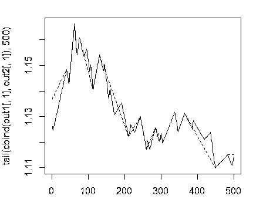
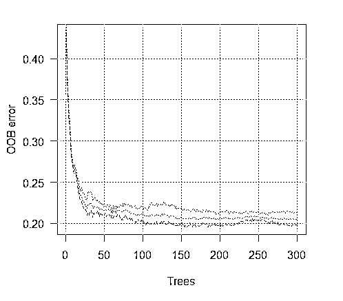
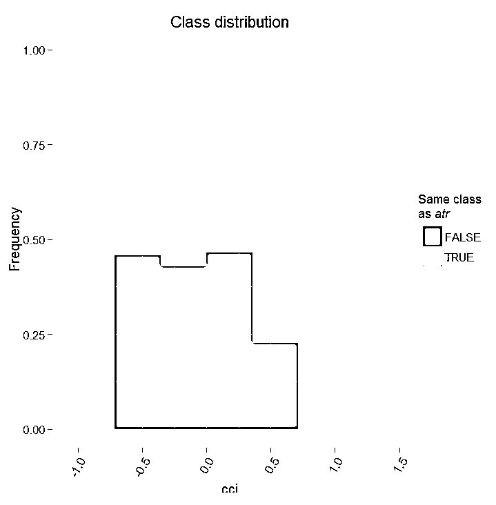

# 机器学习模型的变量评估和选择基于技术指标『深度解析』

> 原文：[`mp.weixin.qq.com/s?__biz=MzAxNTc0Mjg0Mg==&mid=2653284861&idx=1&sn=5c277b32615588758b192f5964dc5afa&chksm=802e2be8b759a2fe6c5237f29d7e0b1bb98c93b20bef23430db3418f4ee68a070abbb034c745&scene=27#wechat_redirect`](http://mp.weixin.qq.com/s?__biz=MzAxNTc0Mjg0Mg==&mid=2653284861&idx=1&sn=5c277b32615588758b192f5964dc5afa&chksm=802e2be8b759a2fe6c5237f29d7e0b1bb98c93b20bef23430db3418f4ee68a070abbb034c745&scene=27#wechat_redirect)


**编辑部**

微信公众号

**关键字**全网搜索

**『量化投资』：排名第一**

**『量       化』：排名第二**

**『机器学习』：排名第三**

我们会再接再厉

成为全网**优质的**金融、技术类公众号

### **简介**

本文重点介绍机器学习模型中输入变量（预测因子）的选择，预处理以及评估的相关细节。所有的计算和实验将用 R 语言来实现。

### **输入数据**

我们将采用 11 个指标（振荡器），在输入设置中不设优先级。我们将从某些指标中抽取多个变量。然后我们将写一个函数形成 17 个变量的输入集。

最近 4000 个 TF = M30 / EURUSD 柱形的报价将被采用。

```py
In <- function(p = 16){
  require(TTR)
  require(dplyr)
  require(magrittr)
  adx <- ADX(price, n = p) %>% as.data.frame %>% 
          mutate(.,oscDX = DIp -DIn) %>% 
          transmute(.,DX, ADX, oscDX) %>% as.matrix()
  ar <- aroon(price[ ,c('High', 'Low')], n = p)%>% 
          extract(,3)
  atr <- ATR(price, n = p, maType = "EMA") %>%
          extract(,1:2)
  cci <- CCI(price[ ,2:4], n = p)
  chv <- chaikinVolatility(price[ ,2:4], n = p)
  cmo <- CMO(price[ ,'Med'], n = p)
  macd <- MACD(price[ ,'Med'], 12, 26, 9) %>% 
          as.data.frame() %>% 
          mutate(., vsig = signal %>% 
          diff %>% c(NA,.) %>% multiply_by(10)) %>% 
          transmute(., sign = signal, vsig) %>% 
          as.matrix()
  rsi <- RSI(price[ ,'Med'], n = p)
  stoh <- stoch(price[ ,2:4], nFastK = p, nFastD =3, nSlowD = 3, maType = "EMA")%>%
      as.data.frame() %>% mutate(., oscK = fastK - fastD)%>%
      transmute(.,slowD, oscK)%>% as.matrix()
  smi <- SMI(price[ ,2:4],n = p, nFast = 2, nSlow = 25, nSig = 9)
  vol <- volatility(price[ ,1:4], n = p, calc = "yang.zhang", N = 144)
  In <- cbind(adx, ar, atr, cci, chv, cmo, macd, rsi, stoh, smi, vol)
  return(In)
}
```

### **输出数据（目标）**

作为目标变量，我们将使用 ZigZag 信号。下面就是计算 zigzag 和其信号的公式：

```py
ZZ <- function(pr = price, ch = ch , mode="m") {
  require(TTR)
  if(ch > 1) ch <- ch/(10 ^ (Dig - 1))
  if(mode == "m"){pr <- pr[ ,'Med']}
  if(mode == "hl") {pr <- pr[ ,c("High", "Low")]}
  if(mode == "cl") {pr <- pr[ ,c("Close")]}
  zz <- ZigZag(pr, change = ch, percent = F, retrace = F, lastExtreme = T)
  n <- 1:length(zz)
  for(i in n) { if(is.na(zz[i])) zz[i] = zz[i-1]}
  dz <- zz %>% diff %>% c(0,.)
  sig <- sign(dz)
  return(cbind(zz, sig))
}
```

函数参数：

*   pr = price — OHLCMed 报价的矩阵；

*   ch — zigzag 折线的最小长度，以点数计(4 signs)；

*   mode — 应用的价格（m — 均价，hl — 最高最低价，cl — 收盘价）。默认使用均价。



折线最小长度 25/75 p 的 Zigzags

接下来我们将使用第一个 ZZ 并采用更短的 leg。我们打算将输入和目标变量组合到一般数据帧中，移除 condition = "0"的未定义数据并且从目标变量中移除“0”类型。

查看目标的类型分布：

```py
> table(data$Class)

  -1    1 1980 1985 
```

从中可见，分类数量很均衡。既然我们已经准备好了输入和输出数据集，我们就能开始评估预测因子的重要性了。

首先我们检查输入数据的相关性：

```py
> descCor <- cor(data[ ,-ncol(data)])
> summary(descCor[upper.tri(descCor)])
    Min.  1st Qu.   Median     Mean  3rd Qu.     Max. 
-0.20170  0.03803  0.26310  0.31750  0.57240  0.95730 
```

那两个输入变量的相关性超过了 90%？

```py
> highCor <- caret::findCorrelation(descCor, cutoff = .90)
> highCor
[1] 12 15
```

答案是 — rsi 和 SMI。我们将这连个排除后形成一个而数据集并观察剩余因子的相关性。

```py
> data.f <- data[ ,-highCor]
> descCor <- cor(data.f[ ,-ncol(data.f)])
> summary(descCor[upper.tri(descCor)])
    Min.  1st Qu.   Median     Mean  3rd Qu.     Max. 
-0.20170  0.03219  0.21610  0.27060  0.47820  0.89880 
```

我们将按 2：3 的比例，把数据集 data.f[]分成训练集和测试集，并且将数据规范化到-1：1 范围内同时进行模型测试。我们使用 rminer::holdout() 函数进行数据分组，将数据集一分为二。使用 caret::preProcess() 函数和 method = c("spatialSign")做数据规范化。当进行模型训练时，使用"doParallel"包将在可用的处理器内核间自动采用并行计算模式。你可以使用 threads" 选项来指定要用于计算的特定内核数量"。

我们将简单解释下这些内容的含义：

*   训练误差为（内部误差）1% ，方差 = 21.26%。

*   Breiman's bounds — 由 Breiman (2001)提出的理论边界值。因为 Random Uniform Forests 继承了 Random Forest 的属性，在此他们都是适用的。对于分类来说给出 2 个预测误差边界，树之间的平均相关性，强度及强度标准差。

*   预期预测误差 = 18.42%。误差上限 = 27.76%。

*   测试误差 = 19.97% (外部误差)。（如果外部误差小于等于内部误差，并且比 Breiman 边界的上限值小， 那么很可能无需重新训练。）

让我们看下训练误差图表：



现在我们考察预测因子的**全局重要度**。

```py
> summary(ruf)全局变量重要度：
注意：最具预测性的特征根据'score'排序并绘制。 
通过查看 'class'以及'class.frequency'，也必须把把最具判别能力的变量 考虑在内。

   variables score class class.frequency percent1        cci  2568     1            0.50  100.002     signal  2438     1            0.51   94.923      slowD  2437     1            0.51   94.904       oscK  2410     1            0.50   93.855        ADX  2400    -1            0.51   93.446        vol  2395     1            0.51   93.247        atr  2392    -1            0.51   93.158       sign  2388     1            0.50   92.979       vsig  2383     1            0.50   92.8110        ar  2363    -1            0.51   92.0111       chv  2327    -1            0.50   90.6212       cmo  2318    -1            0.51   90.2813        DX  2314     1            0.50   90.1014     oscDX  2302    -1            0.51   89.6415        tr  2217     1            0.52   86.31   percent.importance1                   72                   73                   74                   75                   76                   77                   78                   79                   710                  711                  712                  713                  614                  615                  6Average tree size (number of nodes) summary:  
   Min. 1st Qu.  Median    Mean 3rd Qu.    Max. 
      3    1044    1313    1213    1524    1861 Average Leaf nodes (number of terminal nodes) summary:  

   Min. 1st Qu.  Median    Mean 3rd Qu.    Max. 
      2     522     657     607     762     931 Leaf nodes size (number of observations per leaf node) summary:  
    Min.  1st Qu.   Median     Mean  3rd Qu.     Max. 
   1.000    1.000    2.000    4.355    3.000 2632.000 Average tree depth : 10 Theoretical (balanced) tree depth : 11 
```

可见所有的输入参数都是显著并重要的。也就是说在那个分类中变量出现的最频繁。

更多的一些统计特征：

```py
> pr.ruf <- predict(ruf, x.test, type = "response");
> ms.ruf <- model.stats(pr.ruf, y.test)Test set
Error rate: 19.97%Confusion matrix:
          Reference
Prediction  -1   1 class.error
        -1 540 144      0.2105        1  120 518      0.1881Area Under ROC Curve: 0.8003Area Under Precision-Recall Curve: 0.7991F1-score: 0.7969Geometric mean: 0.8001 
```


**局部重要度**

```py
> imp.ruf <- importance(ruf, Xtest = x.test, maxInteractions = 3)1 - 全局变量重要度 （15 个基于信息增益的最重要变量）：
注意：最具预测性的特征根据'score'排序并绘制。 
通过查看 'class'以及'class.frequency'，也必须把把最具判别能力的变量 考虑在内。

       Class -1 Class 1cci        0.16    0.23cmo        0.20    0.18slowD      0.09    0.10oscK       0.09    0.07signal     0.05    0.07tr         0.02    0.07ADX        0.06    0.03chv        0.06    0.04atr        0.05    0.06ar         0.05    0.03
```

由此可见，基于相互影响的变量的重要度的前 10 名同全局重要度并不相符。最终，用于分类的变量重要度是考虑它们的贡献和影响在内的。请注意变量 tr，基于全局重要度的话应该位于最后一位，理论上它应该被丢弃，但却因为强相互影响性使其排名升至第六位。

因此，前十位变量为：

```py
> best <- Cs(cci, cmo,  slowD, oscK, signal, tr, ADX. chv, atr, ar)
```

让我们来验证下模型的质量是如何被最重要的预测因子改善的。


模型质量显然得到了改善。测试集的预测误差为 17.55%，比上限 28.18%低，因此没有必要重新训练。模型还有很多其他参数，改变它们可能会进一步提升模型的质量，然而这不是本文当前的目标。 

我们将继续探讨输入变量的最优数据集。 


如我们所见，全局变量重要度几乎已经趋于稳定，但是分类变量的重要度 排名有所不同。tr 变量位于第三位。

**预测因子的部分依赖**

那些重要度最高的变量的部分依赖将被考虑。


上图显示了预测椅子 cci 的部分依赖性。分类之间的预测数据分割除了覆盖范围外，相对来说还不错。


上图中的预测因子 signal 的部分依赖性图形完全不同 。两个分类的几乎所有数据都在考察范围内。

预测因子 tr 的部分依赖性显示了分类的合理分割，并且仍旧具有相当的覆盖性。


chv 预测因子的部分依赖性很差。观察分类的完整数据。


用这种方式我们能够直观的确定预测因子数据是如何同分类联系起来以及如何将它们分隔开的。

**分类的变量重要度**

在分类上的“变量重要度”提供了一个局部视角：分类是固定的，意味着首先考虑重要的并且作为常量的变量来确定固定分类，最终，考虑针对每一分类的重要变量。因此，如果没有其他分类，则每一个变量都有重要度。

此处我们对能够选择确定分类的变量并不感兴趣，我们感兴趣的是当在做出选择时，在确定分类中有重要作用的变量。不考虑分类重要度，根据它们在每个分类中的排位，变量的顺序给出了其自由排名。

这个图表说明了些什么？tr 预测因子对于类型“1”比类型“-1”重要很多。相反，预测因子 oscK 对于类型“-1”来说比类型“1”重要很多。<预测因子在不同的分类中的重要度也不同。


**基于相互影响的变量重要度**

下图显示了每个变量的显示方式与任何其它变量的联合的相互作用。重要的一点提醒是：第一个变量并不一定是最重要的，而是对其他变量产生最大影响的。


观察值上的变量互相影响情况


上图显示了所有预测因子的一阶和二阶相互影响，相互作用的概念如我们之前的定义。它的面积为 1。如果仅在考虑一个变量的基础上做出判定，一阶表示变量（降序排列）是最重要的。二阶表示，如果一个位置变量已经选择为第一顺序了，那么第二重要的变量就是那些在第二位的变量。

为了清晰起见，互相作用给出一个顺序特征表。首先给出最重要的变量。其次给出次重要的变量。从所有互相影响组合中给出一对变量之间的相互影响。请注意这取决于模型和数据两者。因此，模型的质量直接取决于预测的质量。我们也可以一个称为“other signs”的变量元，这样我们就可以让算法显示相对不重要的变量的默认试图。

**部分重要度**

你可以看看基于 x.tst 观测值的分类“-1”上的部分 重要度。


如我们所见，对应分类“-1”的五个最重要的预测因子如上图显示。

对于分类“+1”也同样


我们看到，预测因子在结构和排位方面都不同。

让我们看看预测因子 cci and atr, 的部分依赖性，它们是预测因子互相作用中最重要的一阶和二阶重要度。

```py
> par.dep.1 <- partialDependenceBetweenPredictors(Xtest = x.tst,
+                             imp.ruf.opt,
+                             features = Cs(atr, cci),
+                             whichOrder = "all",
+                             perspective = T)

Level of interactions between atr and cci at first order: 0.1748(99.97% of the feature(s) with maximum level)
Level of interactions between atr and cci at second order: 0.1526(87.28% of the feature(s) with maximum level)分类分布：对于一对中的一个变量，显示概率分布 
被考察的变量有同样的 class。 
如果同样的 class 为 TRUE，那么这个变量很可能在预测时对其他变量 
有影响（对于当前的分类或者值）。依赖性：对于变量对，显示它们的 
依赖关系，以及在 预测同一个 class 时针对定义依赖性的值 
的评估协议。对于分类变量， 
使用交叉制表。热力图 ： 针对变量对，显示哪里的相关性 
是最强的。 
颜色越暗，相关性也越强。在变量中，其决定作用的最可能是那个 
最具判断能力的（查看'全局变量重要度'） 
并/或那个具有高阶相互作用性的（查看 
'基于互相作用的变量重要度'）。
```




全局变量重要度用于确定哪个全局变量对于减小预测误差的作用最大。

局部变量重要度描述从变量相互影响角度来看，什么使得一个变量具有影响力。

这就产生了部分重要度的概念，它表示了何时一个变量更重要。分析变量重要度的最后一步是获得局部依赖性，设置一个变量是何时 以及/或者 如何同响应相关的。

**总结：**Random Uniform Forests 中一个变量的重要度从最高到最低级别依次展开。首先，我们找出那些变量是重要的，学习每个分类的细微的差别。然后考虑到它们之间的相互作用，我们找到是什么使它们相互影响，并将所有的分类作为一个考虑后先选择一个变量。下一步 — 我们要知道当每种分类圈定的情况下它们的影响力从何而来。最后，通过观察“部分依赖性”，我们获知变量是何时以及如何被确认重要的。所有的步骤，除了"全局变量重要度"，都在任意训练或者测试集上进行操作。

已提出的多层次预测因子评估，通过显著降低数据维度和提升预测质量，来选择最重要的预测因子以及创建最优数据集。

你不仅可以评估和选择预测因子，还能够选择最具信息丰度的观测项。

让我们看看另一个有意思的包 — "RoughSet"。

Brief 描述到：这个包主要由两部分构成：Rough Set Theory (RST) 和 Fuzzy Rough Set Theory (FRST))。RST 由 Z. Pawlak (1982, 1991)提出，它提供了一套复杂的数学工具用于建模和分析涵盖异质性和不确定性的信息系统。使用 RST 对象间不可分辨的关系不需要额外的参数来解析信息。

FRST 理论，RST 的扩展，由 D. Dubois 和 H. Prade (1990)提出，它将 RST 和由 L.A.Zadeh (1965)在模糊理论中提出的不确定性和不可分辨性概念结合起来。这个概念使得你可以分析连续分布（变量）而无需预先将数据离散化。基于上述概念提出了许多方法并且已经应用到多个不同的领域中去了。为了解决问题，这个方法使用模糊关系和上下限的概念。 

让我们继续。所有在这个包中提供的方法被如下划分：

*   RST 和 FRST 的基本概念。在这一部分中我们可以观察四个不同的任务：不可分辨关系，上下近似，正域和差别矩阵。

*   离散化。它用于将物理数据转换成名称数据。以 RST 的角度来看，这是为了维持对象之间的差别。

*   特征选择这是一个发现预测因子子集的过程，试图保持同采用预测因子全集时一样的质量。换句话说就是为了选择基本特征并消除它们之间的依赖性。这在我们面对含有多重特征的数据集时是有用且必要的。对于 RST 和 FRSt 而言，预测因子选择就是对精简要素的搜寻。

*   示例选择。这个过程的目标是从训练数据集中移除噪声，不必要的或者冲突的副本。因此，通过去除不能给予模型正贡献的样本，来获取良好的分类精度。

*   规则归纳。如我们已经提到的，归纳法是为了生成规则，提供解决问题的相关知识。通常，在机器学习中这被称为训练。

*   预测/分类。这个任务的目标是从新的数据集中（测试集）预测变量的值。

我们仅研究此列表中的两项 — 预测因子的选择以及样本的选择。

让我们形成输入数据集和输出数据。我们将使用和之前获得的数据一样的数据，但将其转换到包所使用的“DecisionTable”类中。

```py
> library(RoughSets)
加载所需的包： Rcpp
> require(magrittr)
> data.tr <- SF.asDecisionTable(data.f[idx$tr, ], 
+                               decision.attr = 16, 
+                               indx.nominal = 16)
> data.tst <- SF.asDecisionTable(data.f[idx$ts, ],
+                                decision.attr = 16, 
+                                indx.nominal = 16+ )
> true.class <- data.tst[ ,ncol(data.tst)]
```

如前所述，RST 使用标定数据。既然我们有的是连续的数值数据，我们将使用一个包中提供的特殊的离散化函数，来将其转换为标定数据。

```py
> cut.values <- D.global.discernibility.heuristic.RST(data.tr)
> data.tr.d <- SF.applyDecTable(data.tr, cut.values)
```

让我们来看看结果（部分）：

```py
> summary(data.tr.d)
           DX                     
 (12.5,20.7]: 588   
 (20.7, Inf]:1106    
 [-Inf,12.5]: 948    
```

我们看到预测因子被离散化成不同的值。像变量 slowD, sign 完全没有被分离。变量 signal, vsig, cci, oscDX 被简单的分为两个区域。其他变量被分为 3 和 6 个分类。

我们选择重要的变量：

```py
> reduct1 <- FS.quickreduct.RST(data.tr.d, control = list())
> best1 <- reduct1$reduct
> best1
    DX    ADX  oscDX     ar     tr    atr    cci 
     1      2      3      4      5      6      7    chv    cmo   vsig   oscK signal    vol 
     8      9     11     13     14     15 
```

没有被分离的数据 (slowD, sign) 从数据集中被移除。我们将执行测试集的离散化并且根据缩减执行情况进行变换。

```py
> data.tst.d <- SF.applyDecTable(data.tst, cut.values)
> new.data.tr <- SF.applyDecTable(data.tr.d, reduct1)
> new.data.tst <- SF.applyDecTable(data.tst.d, reduct1)
```

现在，使用名为“induction rules”的包，我们将得到一系列绑定预测因子和目标的规则。下面的选项之一将被使用：

```py
> rules <- RI.AQRules.RST(new.data.tr, confidence = 0.9, timesCovered = 3)
```

我们将在测试集上效验这些规则是如何用于预测的：

```py
> pred.vals <- predict(rules, new.data.tst)
> table(pred.vals)
pred.vals
 -1   1 655 667 
```

矩阵：

```py
> caret::confusionMatrix(true.class, pred.vals[ ,1])
模糊矩阵及其统计数据

          Reference
Prediction  -1   1
        -1 497 163
        1  158 504        

```

大约 300 个样本被标记为无足轻重且可丢弃的。我们将从这个集从解析一系列规则，并将之与之前集的预测质量进行对比。

```py
> rules <- RI.AQRules.RST(new.data.tr, confidence = 0.9, 
                          timesCovered = 3)
> pred.vals <- predict(rules, new.data.tst)
> table(pred.vals)
pred.vals
 -1   1 
638 684 
> caret::confusionMatrix(true.class, pred.vals[ ,1])
模糊矩阵及其统计数据
```

**投稿、商业合作**

**请发邮件到：lhtzjqxx@163.com**

**关注者**

**从****1 到 10000+**

**我们每天都在进步**

听说，置顶关注我们的人都不一般


****