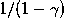

# 深度强化学习最认真研究『编辑部遴选』

> 原文：[`mp.weixin.qq.com/s?__biz=MzAxNTc0Mjg0Mg==&mid=2653284858&idx=1&sn=d903cfbe552c525edb282833505510b9&chksm=802e2befb759a2f9cb0805b4550a842672656b93d380cce47d8a96350c114444a8989be278f0&scene=27#wechat_redirect`](http://mp.weixin.qq.com/s?__biz=MzAxNTc0Mjg0Mg==&mid=2653284858&idx=1&sn=d903cfbe552c525edb282833505510b9&chksm=802e2befb759a2f9cb0805b4550a842672656b93d380cce47d8a96350c114444a8989be278f0&scene=27#wechat_redirect)

**编辑部**

微信公众号

**关键字**全网搜索

**『量化投资』：排名第一**

**『量       化』：排名第二**

**『机器学习』：排名第三**

我们会再接再厉

成为全网**优质的**金融、技术类公众号

**原文出处**

简书

**原文作者**

Not_GOD **已授权**

**前言**wow**写在前面的话** 深度强化学习可以说是人工智能领域现在最热门的方向，吸引了众多该领域优秀的科学家去发掘其能力极限. 而深度强化学习本身也由于其通用性备受各个应用领域推崇，从端对端游戏控制、机器人手臂控制、推荐系统，甚至也来到了自然语言对话系统. 然而如何在日新月异，几乎每日都在更新迭代的深度强化学习的进展中保持好节奏，那是这篇文章带给大家的建议和思考. 

**深度学习**

深度学习是人工神经网络 2006 年后重获新生的名称，伴随着其实际应用中的超越式效果而风靡全球. 使之成为可行的方法的计算设备 GPU 也因此大卖特卖，成为深度学习研究必备利器。

人工神经网络已经可以实现任意复杂度连续函数的逼近，这个可以在 Michael Nielsen 的《神经网络和深度学习》书中看到神经网络可以计算任何函数的具体化的证明. 而深度学习则可以利用超多的隐藏层来提升表示的能力（浅层网络需要指数级的隐藏元个数才能达到相当的深层网络的表达能力）。深度学习的表示其实是大量函数的复合，并可以通过反向传播进行训练，参见下图。

现在深度学习已经席卷了语音识别、图像识别、计算机视觉、自然语言处理乃至视频预测等领域，主要的两种网络 CNN 和 RNN 完成了空间和时间的完备. 但由于对于深度学习本身仍旧有太多的认知空白，一部分人仍然对其无法完全接受. 尽管这样，我还是想建议大家去了解它，你可以从书本开始，比如 《神经网络和深度学习》 还有来自 Montreal University 的 《深度学习》，来走进这个领域. 这本书包含了深度学习学习、研究及应用所有需要的概念和直觉（并不含强化学习）

**强化学习**

强化学习，现在常常将其看作机器学习领域的一个分支，但如果细细去看，你会发现，强化学习本身也有完整的一条发展的脉络. 从动物行为研究和优化控制两个领域独立发展最终经 Bellman 之手汇集抽象为 MDP 问题而完成形式化. 之后经很多的科学家的不断扩大，形成了相对完备的体系——常被称为近似动态规划，参看 MIT 教授 Dimitri P. Bertsekas 的 动态规划系列，Dynamic Programming and Optimal Control, Vol. II, 4th Edition: Approximate Dynamic Programming。

强化学习是非常严谨的领域，适合各类人享受/被折磨（数学重起来可以直接 KO 一般的非数学系本科生）. 但往往应用起来却非常困难，首先维度灾难的存在使得我们很难高效地求解最优的策略或者计算最优行动值. 另外深度学习其中包含的思想——贪婪、动态规划、近似等等都是算法中最为关键的部分，也是这些方法使用得比较极致的地方. 因此，才有不少人持续在其上很多年不断地推进研究的深入和一般性. （这里，其实要说一句，国内的强化学习研究并不是特别领先，也要引发我们的思考. 另一个有趣的现象是，作为强化学习研究的重镇 Alberta 大学，也就是 Richard Sutton 等计算机科学家领衔的强化学习中心，同样是在加拿大. 这种感觉让人想到了 Geoffrey Hinton 在 Toronto 领导的深度学习复兴. 个人感觉，国内强化学习研究不能够兴起的原因是研究者本身相对狭窄的视角，与不同学科和思想的连接甚弱，乃至于不敢想象——一句话概括的话，我觉得是勇气和想象力的缺失吧！在现在的研究中看到得更多是很多想法的全方位连接，交叉科学的研究是切切实实地交叉）。

在 Warren B. Powell 的一篇短文中说道，很多来自不同领域的人，都在忙着自己的一亩三分地上耕耘，自得其乐；实际上，大多人做出来同样的工作，因此他提出了 10 条意见. 简言之：建议大家从一个全貌看待问题和学科，找到相通联的点，以此出发，找到潜在的连线，最终形成整体的面的认知。

这里结合 David Silver 的强化学习课程给出一个强化学习的概貌：

**强化深度学习**

深度学习模型的简单（实际上带来了更多的不可控制的难度）刚刚好是降低了一些使用的难度，短短数十行代码，便能够解决之前需要花费大量精力才可以设计出来的系统. 所以，各个应用领域（语音、图像、视觉、自然语言理解等）现在都把资源往深度学习上倾斜，在这里我们不去评判这会造成的未发生的不良后果，从乐观的角度来看，深度学习确实让人工智能领域重新焕发活力. 当然如何去疏导人们的激情是相当重要的事情，我相信过上一段时间后，大家都会找到合适的路径发展下去的。

一蹴而就的成功在科学领域往往是非常难以实现的. 存在的若干重要的数论、图论问题，也都是经过一代代科学家继往开来、在前人工作上不断推进的. 说完了历史，现在来看看最为激动人心的进展. 我们介绍深度强化学习的范式和相关算法. 看看究竟什么才是最为关键的因素. 实际上关键在于我们如何去应用这些技术解决问题——适合的问题建模，解决手段的提升。

强化学习之前并不能实用的原因在于面对过大的状态或者行动空间，很难有效地处理这些情形，往往看到的例子都是相对简化的场景. 深度学习的出现让人们能够去处理真正的问题，比如说视觉识别准确率的大幅提高至 ImageNet 数据急的 top-5 错误率下降到了 4% 以内，现在语音识别已经真正变得比较成熟，并且被广泛商用，且目前所有的商用语音识别算法没有一个不是基于深度学习的. 这些都是说明深度学习能成为一些实际应用的基础. 而现在深度强化学习的研究和应用也基本上针对上面的问题展开。

根据 Berkeley 的深度强化学习课程我们可以其分成近似动态规划方法（Approximate Dynamic Programming Methods）策略梯度方法（Policy Gradient Methods）和 搜索+监督学习（Search + Supervised Learning）三类. 我们这里挑几个代表性的方法简要介绍一下，如 Deep Q- Network、Double Q-Network 和 DDPG 等方法及现在的一些应用，如机器人手臂控制、对话生成和游戏控制等等. 这些研究也不是突然一下子就出现的，他们的产生可以说伴随着强化学习的发展而恰好到深度学习的出现又产生了巨大的能量. 先看看近似动态规划方法，Deep Q-Network。

## **Double Q-Network**

在某些随机环境中，Q-学习表现很糟糕. 罪魁祸首是很大的行动值的过估计(
overestimations). 这些过估计是由于 Q 学习使用最大的行动值作为最大期望行动值的估计产生了正的偏差. 这里有另外一种方式来近似对于任意随机变量集的最大期望行动值. 所谓的双估计方法某些事件会欠估计而不是过估计. 将这种思想应用在 Q-学习上可以得到双 Q-学习方法，一种免策略强化学习方法. 这个算法可以收敛到最优策略上，并在某些设置下表现得要超过 Q-学习算法。

Double Q-Network 则是融合 Q-学习和深度学习的结果，在某些 Atari 游戏中 DQN 本身其实也会受到过估计的影响，通过双 Q-学习的引入，就能够处理大规模的函数近似问题. 最终的算法不仅仅降低了观察值过估计，而且在某些游戏中有着相当好的表现。

## **策略梯度方法**

尽管现存若干本强化学习相关的书籍，但是对于策略梯度部分的介绍确实不够的.已有的强化学习（RL）课本没有给出足够的关于如何使用函数近似的指导；基本上都是聚焦在离散状态空间的领域. 而且，现有 RL 课本并没有对无导数优化和策略梯度方法给出充分讲述，而这些技术在很多的任务上都是相当重要的。

策略梯度算法通过梯度下降进行优化. 就是说，通过重复计算策略的期望回报梯度的噪声估计，然后按照梯度方向来更新策略. 该方法比其他 RL 方法（如 Q-学习）更有利，原因是我们可以直接优化感兴趣的量——策略的期望总收益. 该类方法由于梯度估计的高方差长期被认为不太实用，直到最近，Schulman 等人和 Mnih 等人的工作展示了神经网络策略在困难的控制问题上的采用策略梯度方法的成功应用。

你可能比较熟悉概率模型的监督学习，其中目标是最大化给定输入(x) 时的输出 (y) 的对数概率。

策略梯度方法通常需要假设一个随机策略，该策略给出了对每个状态 (s) 的行动 (a) 上的概率分布；我们将此分布写作

如果我们知道对每个状态正确的行动

我们可以简单地最大化监督学习的目标函数：

然而，我们并不知道正确的行动. 相反，我们会尝试对行动好坏进行粗略的猜测，试着去增加好的行动的概率. 更加具体地讲，假设我们刚收集完 agent 和环境一个 agent 和环境回合的交互，所以我们有了一个状态、行动和收益的序列：

令

表示收益的和：

最简单的策略梯度公式就是：

使用这个梯度的估计

我们可以用一个梯度上升的步骤，

进行策略的更新，其中

为学习率. 我们会收集所有的回合，对那个回合中所有的行动的对数概率按照回合的总收益

为比例进行增加. 换言之，如果我们收集了大量的回合数据，其中一些是好的（凭借运气），另外一些是差的. 我们本质上是在进行监督学习——最大化好的回合的概率.
尽管我们现在还没有给出对上述策略梯度公式的数学上的验证，但实际上已经给出了一个对策略梯度的无偏估计、 

策略梯度定义为右式的策略期望总收益的梯度。
如果我们用充足的样本（充足的回合），那么就可以任意精度计算出策略梯度. 然而，估计量

通常噪声很大，即有很高的方差. 你可以想象，这里存在很大的提升空间. 与其提高好的轨迹（trajectory）的概率，我们应该提高好的行动的概率，也就是说，我们应试着去推断哪些行动影响轨迹的好坏。
有一系列形如下式的策略梯度估计量： 

其中

是行动

的有利度 (advantage)的估计——比平均值好还是坏的程度.
下面的有利度估计量更有效率，也更常见：

其中

是折扣因子， 

是 状态-值 函数 

的近似。

用来定义一个有效时间区域，其中你忽略所有可能的超过未来

的时间步的影响.

我们的策略其实是

那么我们如何使用一个神经网络进行表示？实际上，我们仅仅需要将

映射到某个向量

上，向量描述了行动

上的分布. 例如，
如果

来自一个离散的集合，那么我们设计一个神经网络将

到一个概率向量上. （我们一般在神经网络的最后层使用一个 softmax 函数）这完全就是我们用来进行分类器学习的形式.
如果

是连续的，那么我们可以将

映射到一个高斯分布的均值和方差上. 一般情况我们使用一个不依赖于

的对角协方差.
如果

是二值的，那么我们可以使用一个单个输出的网络，表示输出 1 的概率。

**DDPG 深度确定型策略梯度方法**

这是 DPG 确定型策略梯度方法的深度学习化，利用 DQN 的思想将 DPG 进行改造. DDPG 可以解决连续行动空间上的强化学习问题. 在实验中，DDPG 给出了稳定的表现，并且在不同环境上都不需要做出改动. 另外，DDPG 在所有实验中都是以比 DQN 学习使用更少时间步的经验发现 Atari 游戏的解的，大概是性能 20 倍的差距. 给定更多模拟时间，DDPG 可能解决比现在 Atari 游戏更加困难的问题. DDPG 的未来方向应该是利用基于模型的方法来减少训练的回合次数，因为模型无关的强化学习方法通常需要大量的训练才能找到合理的解。

DDPG 实际上是 Actor-Critic 结构，融合了策略和值函数两者信息进行学习. 对 Actor 和 Critic 均使用深度神经网络进行近似。

使用一个权重为

的深度神经网络

来表示策略，定义目标函数为总折扣奖励

然后使用 SGD 来端对端优化目标函数，也即是说调整策略参数

来达到更大的奖励

确定型策略梯度是 David Silver 在 2014 年的工作，刚好为此铺垫，他们证明了确定型策略梯度算法给出的期望恰好就是策略梯度（这里可以参考 DPG 论文中的证明），策略的梯度由下式给出 

策略梯度是最大化提升

的方向
确定型 Actor-Critic，使用两个网络，Actor 是参数为

的策略

Critic 是参数为

的值函数

Critic 为 Actor 提供损失函数， 

梯度从 Critic 到 Actor 反向传播， 

Critic 通过 Q-学习估计当前策略的值 

而 Actor 按照提升 Q 的方向更新策略

确定型深度策略梯度（DDPG）由于基本的 actor-critic 使用神经网络会振荡或者发散，DDPG 给出了稳定解，采取了 DQN 中的技巧对 actor 和 critic 均使用经验回放并冻结目标网络来避免振荡

**基于记忆的 DRL 架构**

近期 Michigan 大学的研究组一篇论文提出了一种基于记忆的深度强化学习架构，专门设计了可控制的机制来处理第一人称视角的场景、延迟奖励及高维视觉信息，并引入主动感知能力，从而能够较好地完成既定任务. 上面提到的问题或者要求同时具备是现有的深度强化学习架构并不能完全应付. 这个新框架在实验中相比其他的深度强化学习模型表现出了较好的泛化能力。

其结构示例如图：

这两幅图展示了记忆操作的过程和不同的网络整体结构。

 MQN 仅仅依赖当前观察，除了当前输入用来做强化学习问题中的时态上下文的内存检索类似于 MemNN，是一个单纯的前驱网络结构构造了上下文环境；RMQN 则是循环结构使用 LSTM 从观察的历史信息中刻画了空间和时间信息，保证能够从 LSTM 和外部记忆中获得时态信息；FRMQN 则包含了一个从检索得到的记忆中反馈到上下文向量的链接. 如图

最终使用的 FRMQN 网络架构包含了用来抽取图像特征的卷积网络、获取历史观察的记忆单元和一个上下文向量用于记忆查询和行动值的估计. 其中提及的 FRQMN 对于未曾见过的环境在学习值函数的时候能够表现出更好的泛化能力。

在 https://sites.google.com/a/umich.edu/junhyuk-oh/icml2016-minecraft 可以看到在实际的 Minecraft 中的 agent 行为的效果视频。

**大规模离散行动空间上的深度强化学习**

这项工作建立在 DeepMind 之前的 DDPG 等工作之上，杂糅了若干模型，并使用嵌入的方式来大幅度降低行动空间的维数，其主要过程在下图中给出： 

**博弈均衡求解的深度强化学习方法**

NFSP 就是引入神经网络近似函数的 FSP，是一种利用强化学习技术来从自我博弈中学习近似纳什均衡的方法. 解决了三个问题：

*   无先验知识 NFSP agent 学习

*   运行时不依赖局部搜索

*   收敛到自我对局的近似纳什均衡

这是一般的不完美信息二人零和博弈. 虚拟对弈同样也会收敛到合作、势力场博弈的纳什均衡. 所以 NFSP 也能够成功应用在这些博弈上. 另外，近期的研究关于连续空间行动的强化学习（Lillicrap et al. 2015）也能够应用在连续行动博弈中，目前的博弈论方法并不能直接处理这样的情形. 所以说，这系列工作是具有重要的意义的，揭示了可以完成部分真实场景博弈的均衡求解。

**用于对话生成的深度强化学习**

循环神经网络在对话生成上的应用确实有所进展，可以为对话机器人生成回应的语句，但是这些反应相当地短视，常常就忽略了对未来产生的后果. 为对话的未来方向进行建模是产生连贯有趣的对话的关键，这也是传统 NLP 对话模型要采用强化学习的缘故. 这个工作，将这些目标进行整合，应用深度强化学习来建模机器人对话的未来奖励. 这个对话模型模拟了两个虚拟 agent 之间的对话，使策略梯度方法在包含三个有用的对话属性（信息量、连贯性和易答性）的奖励序列上. 实验在 diversity、长度和人类评判上进行，结果表明算法产生了更具交互性的答复并刺激出更加持久的对话模拟. 这也是基于对话长期成功的学习神经网络对话模型的第一次尝试。

**未来发展**

现在的深度强化学习中很多的模型是，强化学习中部分研究成果深度学习化的结果. 但最令人兴奋的是，一些新的想法，例如强化变分推断，在 Theophane Weber 等人的论文中，就将 VI 和 RL 进行了联系. 参见下图的对比：

他们给出了一种将推断看作是强化学习的视角，这样其实可以让变分推断的研究者们受强化学习技术启发创造出新的推断技术. 基线和值函数的方式来进行解释. 很多强化学习中其他的概念可用在变分推断中，如时间差分方法或者探索方法，未来这两者间的关系应该能够挖掘到更深的层次，这也使得我们能够找到更多的微分模型和关联技术。

而这篇文章中作者之一 John Schulman 和他 Berkeley 的合作者也有一个进行从计算方法的角度统一化工作，Gradient Estimation Using Stochastic Computation Graphs，将监督学习、非监督学习和强化学习中出现的共同问题进行提炼——损失函数由一个随机变量集上的期望定义，这些随机变量可能是概率模型的变量或者是外部环境的变量. 那么使用样本来估计损失函数的梯度就是基于梯度学习的算法的核心. 该文给出了随机计算图的形式化定义——包含确定型函数和条件概率分布的有向无环图，并解释如何自动推导出损失函数梯度的无偏估计. 得到的算法是对标准反向传播算法的微小改进. 该框架可以帮助研究者们开发复杂微妙的模型，方便地加入随机和确定型的操作，如注意力、记忆和行动控制等。

另外深度强化学习在博弈均衡求解中的应用也是令人兴奋的方向之一，随着这些技术的细化和深入，我们将理论计算机和更为实用的机器学习等等技术之间的鸿沟进一步缩小。

未来深度强化学习的发展必定是理论探索和应用实践的深入，这一方面取决于我们深度学习的认识，另一方面则倚重不断地实践。

最后，我想推荐一下 OpenAI 的 gym，这是一个强化学习算法测试的环境，可以在上面去尝试自己解决一些问题，同时也可以比对自己方法的优劣. 现在也是相当活跃的一个项目，OpenAI 的成员正在不断扩展这个环境，使之满足现在强化学习需要的环境，另外也在征求大家的意见列出最关键的一些相关问题. 深度学习有很多的标准的任务可以供大家测试算法，强化学习领域实际上在前几年并不是非常方便进行测试，现在的 Gym 可以算作深度强化学习算法的试金石了。

OpenAI 处于快速发展阶段，其中涉及的 POMDP 环境不断增加：

*   经典控制和玩具文本：强化学习文献中的小规模的任务

*   算法：执行诸如多位数字相加，序列逆变等等计算. 大多数这样的任务需要记忆，而难度可通过序列长度调整

*   Atari 游戏：屏幕图像或者 RAM 作为输入，使用的是 Arcade Learning Environment 作为底层支撑

*   棋盘游戏：当前包括围棋的 9X9 和 19X19 棋盘，Pachi 作为对手

*   2D 和 3D 机器人：在模拟环境中控制机器人，这些任务使用了 MuJoCo 物理引擎，还有部分来自 RLLAB

根据 OpenAI 发布的信息，他们也在扩展 Gym 中其他的环境，如：

*   多 agent 场景，这些场景中的 agent 之间可以合作或者竞争

*   Curriculum 学习和迁移学习. 当前这些任务还只是初期，后面会形成任务的序列，这样算法可以一个接一个任务地进行训练. 这里的设计师创建不断提升难度的任务序列，来适应所需的场景.

*   真实世界操作：最终目标是将 Gym API 和机器人硬件进行结合，在真实世界中检验强化学习算法

所以从 OpenAI Gym 开始你可以逐步走近到走进这个有意思的领域了，通过实现那些 tricky 的算法来掌握它，对于很多人来说，实现了可以运作的算法代码才是真的懂了（我觉得可能还不够，仍旧有很多的指引需要我们去探索，也许数学证明才是真的理解象征……）

很开心能够有这样的一群人去实践人工智能技术的开放化，对此，我非常的钦佩，也希望能够借助自己的力量来帮助这个项目的成长。

在 Gym 变得更加稳定后， OpenAI 近期向大家征求未来的研究项目，这里可以看到相应的项目和评分。 

**学习建议**

*   现在网络上其实遍布了可以学习深度强化学习的资源，建议大家可以选择下面的课程：

*   Neural Networks for Machine Learning — Geoff Hinton (Coursera)

*   Neural Nets — Andrej Karpathy’s CS231N (Stanford)

*   Reinforcement Learning — David Silver UCL

*   Advanced Robotics (the MDP / optimal control lectures) — Pieter Abbeel’s CS287 (Berkeley)

*   Deep RL — John Schulman’s CS294-112 (Berkeley)

*   Deep RL — David Silver RLDM

*   Deep RL — John Schulman MLSS

*   除了课程外，也有一些书籍，比如 Richard Sutton 等人的《Reinforcement Learning: An Introduction》，还有 Pieter 推荐了 Cover 和 Thomas 的《信息论》和 Nocedal 和 Wright 写的 nonlinear optimization 书，David Barber 的 Bayesian Reasoning and Machine Learning 等等

*   如果你爱编程实现，那么 Ilya Sutskever 建议你从实现简单的 MNIST 分类器开始，卷积网络，重新实现 char-rnn，然后玩玩大的卷积网络. 同样还可以选择一些竞赛，比如说 Kaggle 的 Knowledge 系列. 不断地去寻找训练和实现的手感. 在 OpenAI 中也有很多的资源帮助你快速找到感觉。

*   但实际上，深度学习和强化学习及深度强化学习需要有理论和实践的结合，所以理论课程和实践经历都是非常重要的. 通过读书听课可以找到自己的位置，还有知识本身所处的位置以及你在整个知识地图的位置，从而不至于迷失在日新月异的环境中，慢慢地你会发现自己感兴趣的那些目的地，然后逐步地探索这些有趣的目的地，最终能够取得令自己满意的成就. 而实现模型的重要性在于你可以将那些抽象的概念和理论转化为实实在在可以触及的经验，你飞动的指尖会慢慢告诉你什么是正确的节奏，哪些是让你兴奋的点. 通常理论和实践之间的差异之大会超乎想象，所以只能够通过实际应用去填补这些罅隙，实现完模型后往往需要成天成天的调试你才能达到满意的效果. 这个过程是非常痛苦的，但这种痛苦也是短暂的：当你最终完成了一个真正可用的模型时，那种快感无与伦比. 我想这也是很多人坚持挑战自己的缘故吧. Ilya Suskever 说道：“But each time you suffer, know that you've built a little bit of skill that will be invaluable for the future.”

**后记**

两周前答应刘昕博士，匆匆写完这篇，越到 deadline 越是能发现自己的漏洞，为了填补这些常常查资料到深夜，不过这个过程还是非常享受，乐在其中. 从深度学习基本的 MLP、SGD 的理解和掌握，到 RNN LSTM 及 Neural Turing Machine 和 Memory Network 等网络的理解，再到慢慢地发现生成式模型的魅力所在，随之与变分推断的结合，然后后来的强化学习重新进入我的视野，这个过程跌宕起伏，也让我对这个庞大领域的脉络逐渐清晰. 可以说深度学习重新激活了我对机器学习的热情. 而且随着理解的深入，你会发现深度强化学习会将各个领域有趣的问题放在同样的一个框架内进行思考和处理，这是以前只有博弈论和复杂网络能够带来给我的体验. 相较于单纯掌握某个领域的知识和技术，我倾向于从更广的层面来理解它们，然后吸收进入自己的知识体系。

这个过程中，我们需要的一方面是接受新的技术，同时也要辨别清楚那些重要的东西，那么最好的方式就是去研习它们，观察它们，使用它们，这样才有最真切的体会，也能够告诉自己需要的究竟是什么。

我们给某个事物取了名字，一方面界定清楚了它，但另一方面也限制住了它. 实际上，并不需要太多严苛地将注意力限制在一个有“名”的物上，而是应该去感知它所能够触及的领域和问题，通过用之来增加认知. 对于技术或者理论均是如此，敢于突破前人列下的规则，才是我们创新的动力之源。

现在这个开放的时代，让技术的进步可以方便地获取，只要你有热情和兴趣，就能够找到释放的地方. 尽管有着诸多鸿沟拦在人类的面前，但是勇敢者必定能够迈出坚定的步伐去探知未来的奥秘！既然如此，大家尽情发挥吧~

记住，跟随你的好奇心，它会指引你找到属于自己的路！

**“I am a pessimist because of intelligence, but an optimist because of will.”**

**投稿、商业合作**

**请发邮件到：lhtzjqxx@163.com**

**关注者**

**从****1 到 10000+**

**我们每天都在进步**

听说，置顶关注我们的人都不一般

****