# 【量化精品】通过 LSTM 神经网络进行时序预测针对股票市场（附 Python 源码）

> 原文：[`mp.weixin.qq.com/s?__biz=MzAxNTc0Mjg0Mg==&mid=2653284793&idx=1&sn=76c954a5a8006c815565d8669411f983&chksm=802e2bacb759a2ba4dd2ad122fe7cd99ab85ed29900b212189ab0af36749123c9e39b422363b&scene=27#wechat_redirect`](http://mp.weixin.qq.com/s?__biz=MzAxNTc0Mjg0Mg==&mid=2653284793&idx=1&sn=76c954a5a8006c815565d8669411f983&chksm=802e2bacb759a2ba4dd2ad122fe7cd99ab85ed29900b212189ab0af36749123c9e39b422363b&scene=27#wechat_redirect)

**编辑部**

微信公众号

**关键字**全网搜索

**『量化投资』：排名第一**

**『量       化』：排名第二**

**『机器学习』：排名第三**

我们会再接再厉

成为全网**优质的**金融、技术类公众号

查看源代码请点击

**阅读原文**

Neural Networks these days are the “go to” thing when talking about new fads in machine learning. As such, there’s a plethora of courses and tutorials out there on the basic vanilla neural nets, from simple tutorials to complex articles describing their workings in depth.

For deeper networks the obsession with image classification tasks seems to have also caused tutorials to appear on the more complex convolutional neural networks. This is great, if you’re into that sort of thing, for me however I’m not particularly enthused by classifying images. I am far more interested in data with timeframes. And this is where recurrent neural networks (RNNs) come in rather handy (and I’m guessing that by reading this article you’ll know that long short term memory, LSTM, networks are the most popular and useful variants of RNNs. If not, there’s lots of useful articlesdescribing LSTMs out there you should probably check out first).

Now whilst there’s lots of public research papers and articles on LSTMs, what I’ve found is that pretty much all of these deal with the theoretical workings and maths behind them and the examples they give don’t really show predictive look-ahead powers of LSTMs in terms of a time series. Again, all great if you’re looking to know the intricate workings of LSTMs but not ideal if you just want to get something up and running.

What I’ll be doing here then is giving a full meaty code tutorial on the use of LSTMs to forecast some time series using the Keras package for Python [2.7].

Friendly Warning: If you’re looking for an article which deals in how LSTMs work from a mathematical and theoretic perspective then I’m going to be disappointing you worse than I disappointed the last girl I dated. If however you’re looking for an article with practical coding examples that work, keep reading…

## **A SIMPLE SIN WAVE**

Let’s start with the most basic thing we can think of that’s a time series; your bog standard sin wave function. And let’s create the data we’ll need to model many oscillations of this function for the LSTM network to train over. I made an excel spreadsheet to make a sin wave with amplitude and frequency of 1 (giving an angular frequency of 6.28) and I used the function to get data points over 5001 time periods with a time delta of 0.01\. The result (in case you’ve never seen a series of sin waves in your life) looks like this.

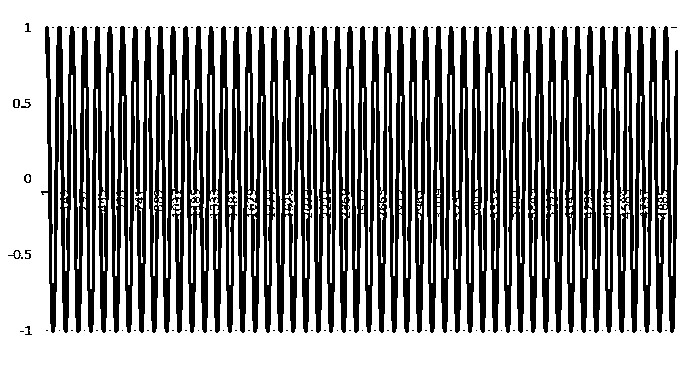

The full sin wave dataset visualized: 5001 time periods

Now that we have the data, what are we actually trying to achieve? Well that’s simple we want the LSTM to learn the sin wave from a set window size of data that we will feed it and then hopefully we can ask the LSTM to predict the next N-steps in the series and it will keep spitting out the sin wave.

We’ll start by transforming and loading the data from the CSV file to the numpy array that will feed the LSTM. The way Keras LSTM layers work is by taking in a numpy array of 3 dimensions (N, W, F) where N is the number of training sequences, W is the sequence length and F is the number of features of each sequence. I chose to go with a sequence length (read window size) of 50 which allows for the network so get glimpses of the shape of the sin wave at each sequence and hence will hopefully teach itself to build up a pattern of the sequences based on the prior window received. The sequences themselves are sliding windows and hence shift by 1 each time, causing a constant overlap with the prior windows.

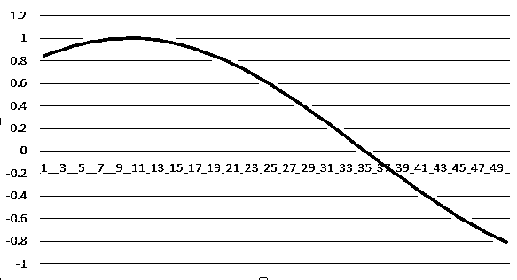

An example of a sequence of length 50

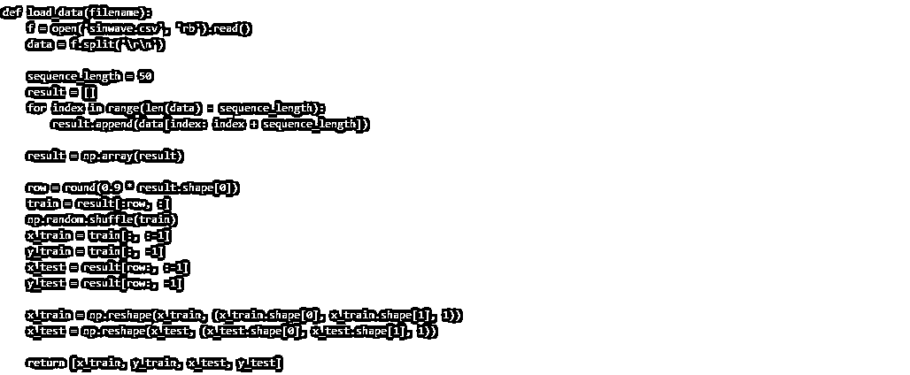

Next up we need to actually build the network itself. This is the simple part! At least if you’re using Keras it’s as simple as stacking Lego bricks. I used a network structure of [1, 50, 100, 1] where we have 1 input layer (consisting of a sequence of size 50) which feeds into an LSTM layer with 50 neurons, that in turn feeds into another LSTM layer with 100 neurons which then feeds into a fully connected normal layer of 1 neuron with a linear activation function which will be used to give the prediction of the next time step.

Here’s the code for the model build functions:

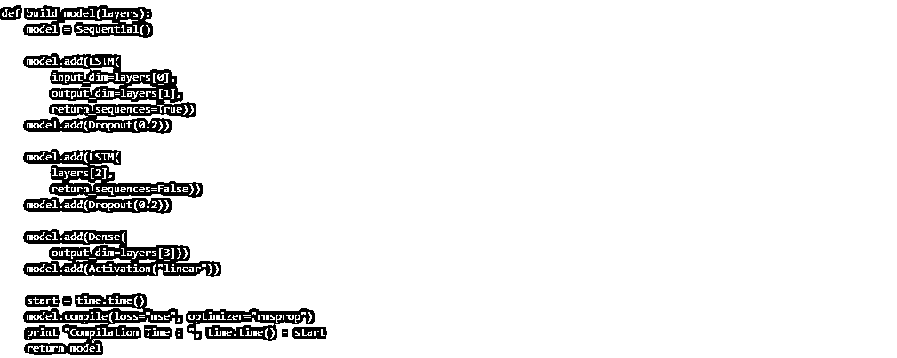

Finally it’s time to train the network on the data and see what we get. I used only 1 training epoch with this LSTM, which unlike traditional networks where you need lots of epochs for the network to be trained on lots of training examples, with this 1 epoch an LSTM will cycle through all the sequence windows in the training set once. If this data had less structure to it, a large number of epochs would be required, but as this is a sin wave with a predictable pattern that maps onto a simple function 1 training epoch will be good enough to get a very good approximation of the full sin function.

We put all this run code into a seperate run.py module and run it like such:

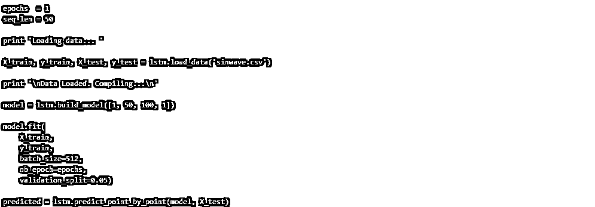

If you’re observant you’ll have noticed in our load_data() function above we split the data in to train/test sets as is standard practice for machine learning problems. However what we need to watch out for here is what we actually want to achieve in the prediction of the time series.

If we were to use the test set as it is, we would be running each window full of the true data to predict the next time step. This is fine if we are only looking to predict one time step ahead, however if we’re looking to predict more than one time step ahead, maybe looking to predict any emergent trends or functions (e.g. the sin function in this case) using the full test set would mean we would be predicting the next time step but then disregarding that prediction when it comes to subsequent time steps and using only the true data for each time step.

You can see below the graph of using this approach to predict only one time step ahead at each step in time:

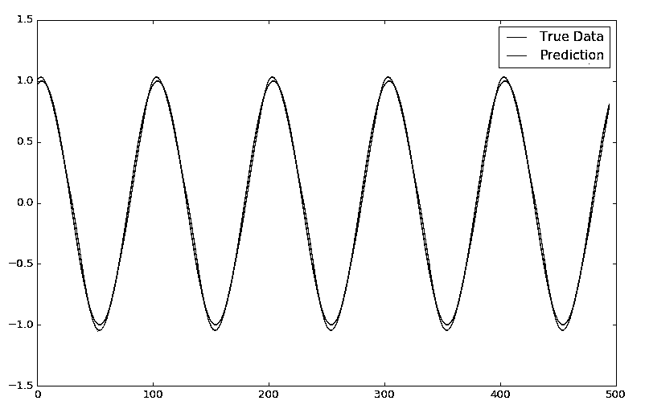

epochs = 1, window size = 50

If however we want to do real magic and predict many time steps ahead we only use the first window from the testing data as an initiation window. At each time step we then pop the oldest entry out of the rear of the window and append the prediction for the next time step to the front of the window, in essence shifting the window along so it slowly builds itself with predictions, until the window is full of only predicted values (in our case, as our window is of size 50 this would occur after 50 time steps). We then keep this up indefinitely, predicting the next time step on the predictions of the previous future time steps, to hopefully see an emerging trend.

The graph below shows the sin wave time series being predicted from only an initial start window of true test data and then being predicted for ~500 steps:

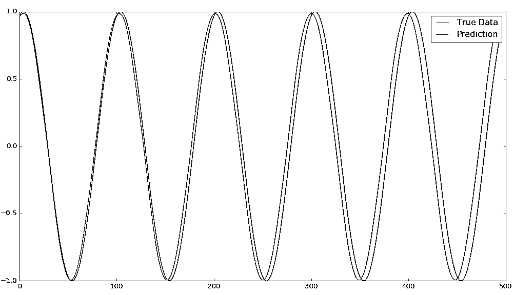

epochs = 1, window size = 50  

Overlaid with the true data we can see that with just 1 epoch and a reasonably small training set of data the LSTM has already done a pretty damn good job of predicting the sin function. You can see that as we predict more and more into the future the error margin increases as errors in the prior predictions are amplified more and more when they are used for future predictions. As such we see that the LSTM hasn’t got the frequency quite right and it drifts the more we try to predict it. However as the sin function is a very easy oscillating function with zero noise it can predict it to a good degree.

Next we will try to see what happens when we try to predict the data on much more stochastic real world data (not saying a sin wave isn’t in the real world. I mean after all, what is the real world when we can make real data for a sin wave and predict on it... I digress…).

## **A NOT-SO-SIMPLE STOCK MARKET**

We predicted a several hundred time steps of a sin wave on an accurate point-by-point basis. So we can now just do the same on a stock market time series and make a shit load of money right?

A stock time series is unfortunately not a function that can be mapped. It can best described more as a random walk, which makes the whole prediction thing considerably harder. But what about the LSTM identifying any underlying hidden trends? Well, let’s take a look. 

I have taken the adjusted daily closing price of the S&P 500 equity index from January 2000 – August 2016\. I’ve stripped out everything to make it in the exact same format as our sin wave data and we will now run it through the same model we used on the sin wave with the same train/test split.

There is one slight change we need to make to our data however, because a sin wave is already a nicely normalized repeating pattern it works well running the raw data points through the network. However running the adjusted returns of a stock index through a network would make the optimization process shit itself and not converge to any sort of optimums for such large numbers. So to combat this we will take each n-sized window of training/testing data and normalize each one to reflect percentage changes from the start of that window (so the data at point i=0 will always be 0). We’ll use the following equations to normalise and subsequently de-normalise at the end of the prediction process to get a real world number out of the prediction:

n = normalised list [window] of price changes
p = raw list [window] of adjusted daily return prices

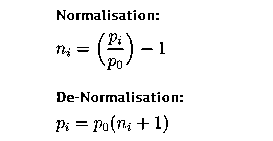

We added a ***normalise_windows(window_data)*** function to our code and updated our load_data(filename) function to include a conditional call and take the sequence length and normalise flag l***oad_data(filename, seq_len, normalise_window)***:

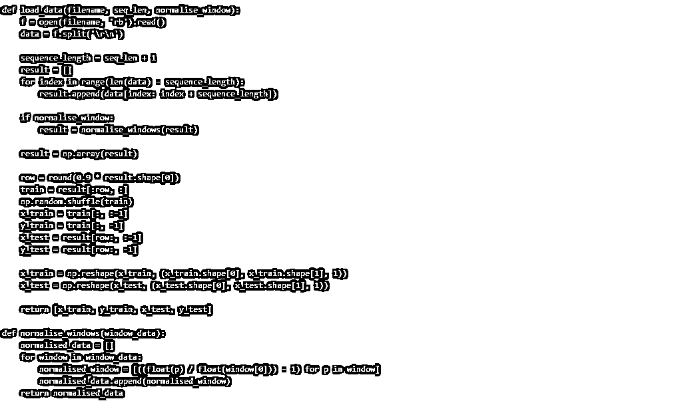

This now normalised the windows as mentioned above and hence we can now run our stock data through our LSTM network. Let’s see how it does:

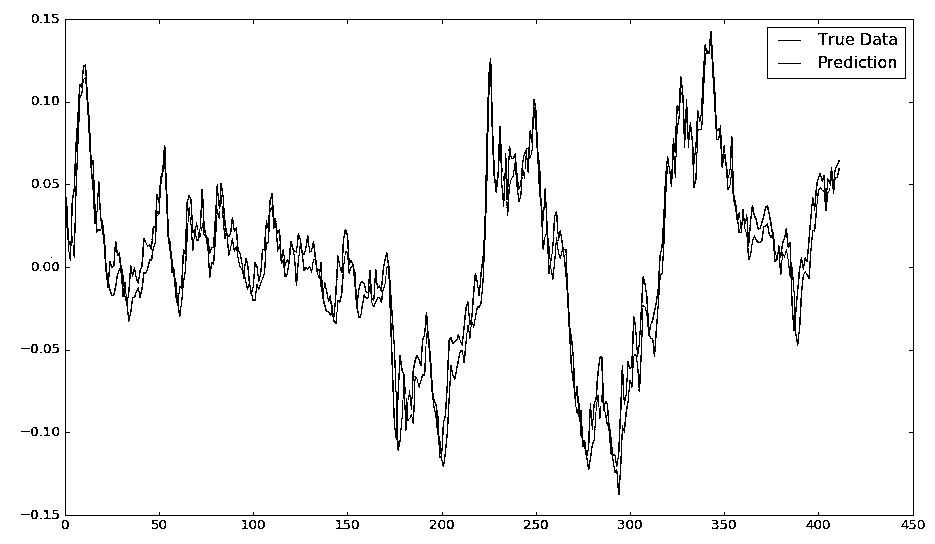

epochs = 50, window size = 50

Running the data on a single point-by-point prediction as mentioned above gives something that matches the returns pretty closely. But this is deceptive! Why? Well if you look more closely, the prediction line is made up of singular prediction points that have had the whole prior true history window behind them. Because of that, the network doesn’t need to know much about the time series itself other than that each next point most likely won’t be too far from the last point. So even if it gets the prediction for the point wrong, the next prediction will then factor in the true history and disregard the incorrect prediction, yet again allowing for an error to be made.

We can’t see what is happening in the brain of the LSTM, but I would make a strong case that for this prediction of what is essentially a random walk (and as a matter of point, I have made a completely random walk of data that mimics the look of a stock index, and the exact same thing holds true there as well!) is “predicting” the next point with essentially a Gaussian distribution, allowing the essentially random prediction to not stray too wildly from the true data.

So what would we look at if we wanted to see whether there truly was some underlying pattern discernable in just the price movements? Well we would do the same as for the sin wave problem and let the network predict a sequence of points rather than just the next one.

Doing that we can now see that unlike the sin wave which carried on as a sin wave sequence that was almost identical to the true data, our stock data predictions converge very quickly into some sort of equilibrium.

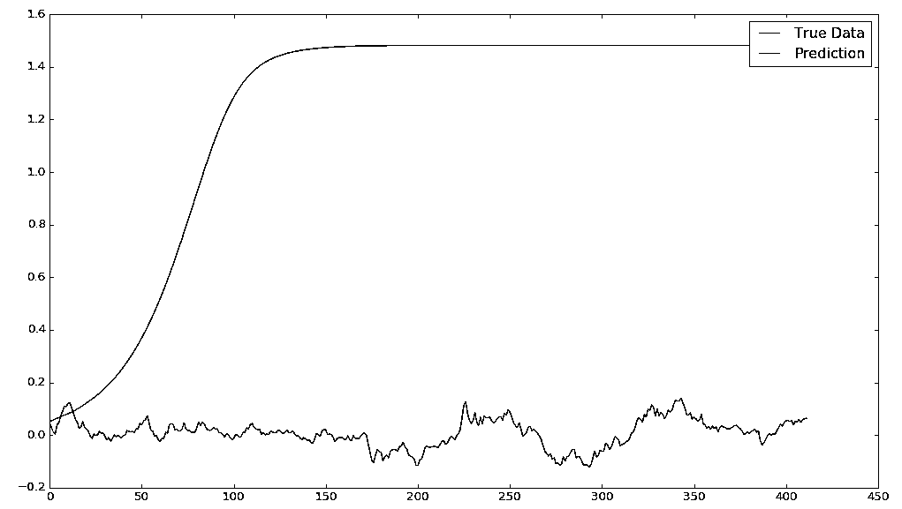

epochs = 50, window size = 50

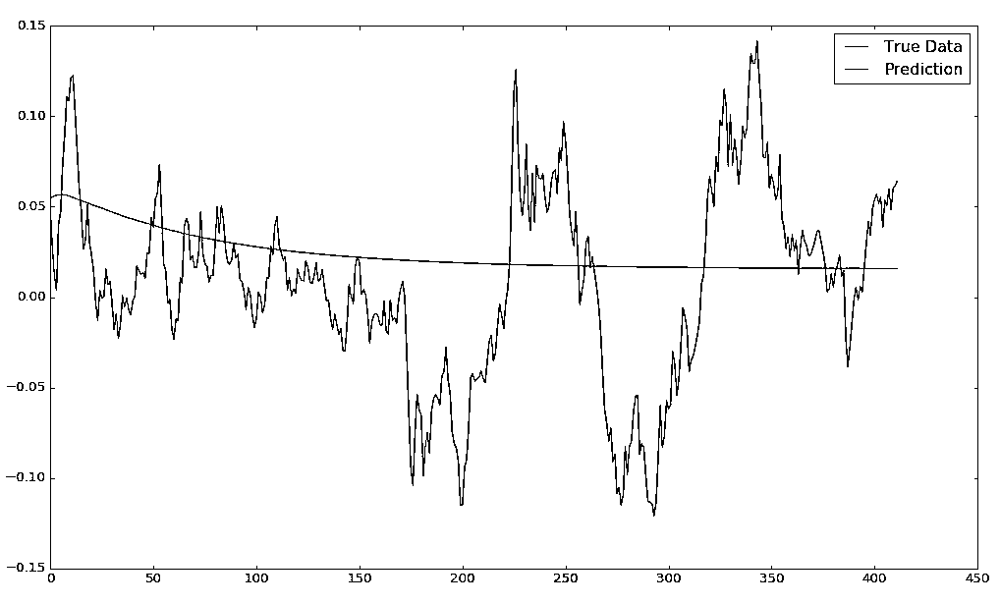

epochs = 1, window size = 50

Looking at the equilibrium for the two training examples we’ve run (one with 1 epoch and one with 50 epochs) we can see there’s wild differences between the two. This wild difference seems to be orthogonal to what you might expect; usually a higher epoch would mean a more accurate model, however in this case it almost looks as if the single epoch model is tending towards some sort of reversion that generally follows the short time price movement.

Let’s investigate this further by limiting our prediction sequence to 50 future time steps and then shifting the initiation window by 50 each time, in effect creating many independent sequence predictions of 50 time steps:

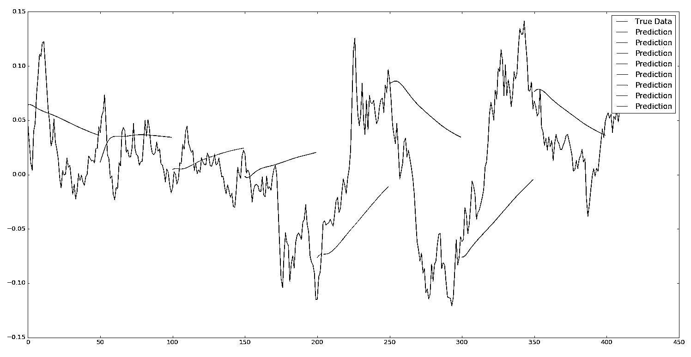

epochs = 1, window size = 50, sequence shift = 50

I’m going to be honest here and say that the result in the graph above has surprised me slightly. I was expecting to be able to demonstrate that it would be a fools game to try to predict future price movements from purely historical price movements on a stock index (due to the fact that there are so many underlying factors that influence daily price fluctuations; from fundamental factors of the underlying companies, macro events, investor sentiment and market noise…) however checking the predictions of the very limited test above we can see that for a lot of movements, especially the large ones, there seems to be quite the consensus of the model predictions and the subsequent price movement.

I’m going to put a big fucking warning sign right here however! There are many, MANY reasons why the above “promising looking” graph could be wrong. Sampling errors, pure luck in a small sample size… nothing in this graph should be taken at face value and blindly followed into a money sucking pit without some thorough and extensive series of backtests (which are out of scope for this article). You’ve been warned.

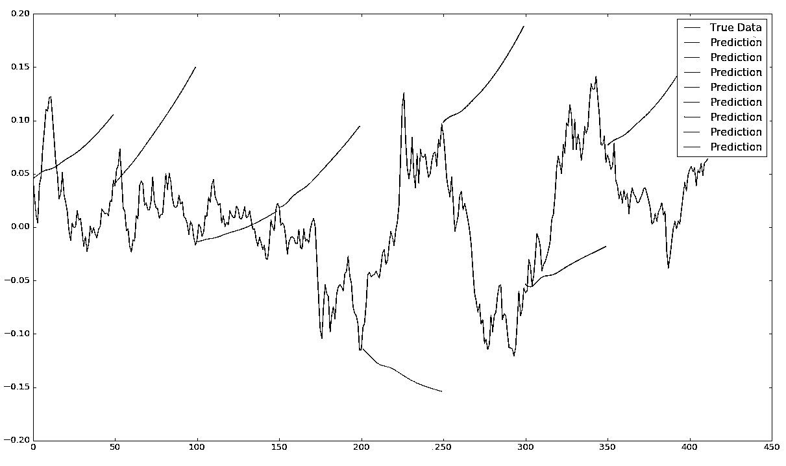

epochs = 400, window size = 50, sequence shift = 50

In fact when we take a look at the graph above of the same run but with the epochs increased to 400 (which should make the model mode accurate) we see that actually it now just tries is predict an upwards momentum for almost every time period!

However, with that I hope all you eager young chaps have learnt the basics of what makes LSTM networks tick and how they can be used to predict and map a time series, as well as the potential pitfalls of doing so!

LSTM uses are currently rich in the world of text prediction, AI chat apps, self-driving cars…and many other areas. Hopefully this article has expanded on the practical applications of using LSTMs in a time series approach and you’ve found it useful.

**投稿、商业合作**

**请发邮件到：lhtzjqxx@163.com**

**关注者**

**从****1 到 10000+**

**我们每天都在进步**

听说，置顶关注我们的人都不一般

****