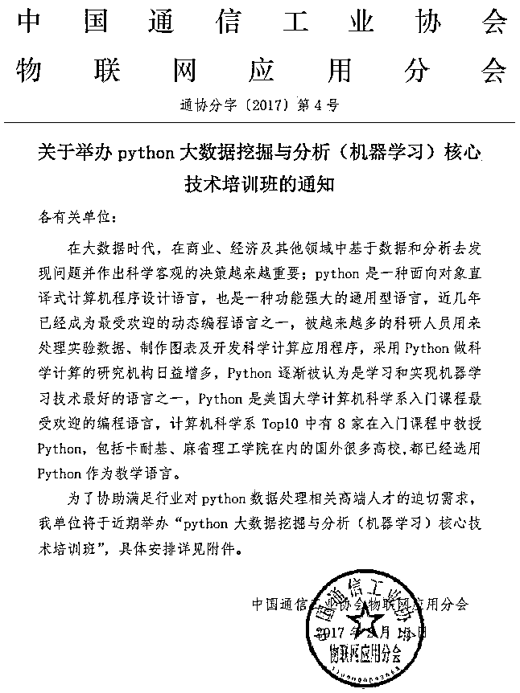
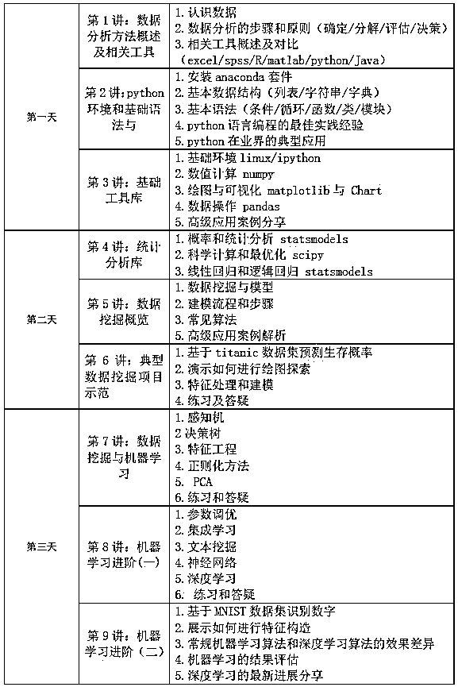

# Python 大数据挖掘与分析（机器学习）核心技术培训的通知

> 原文：[`mp.weixin.qq.com/s?__biz=MzAxNTc0Mjg0Mg==&mid=2653284775&idx=1&sn=2532616a9d3f47403e52b96535c53496&chksm=802e2bb2b759a2a4536e0151fba5bd0901d435e9d0e1460d9ea12d4b1eec71e93c917e8b9b12&scene=27#wechat_redirect`](http://mp.weixin.qq.com/s?__biz=MzAxNTc0Mjg0Mg==&mid=2653284775&idx=1&sn=2532616a9d3f47403e52b96535c53496&chksm=802e2bb2b759a2a4536e0151fba5bd0901d435e9d0e1460d9ea12d4b1eec71e93c917e8b9b12&scene=27#wechat_redirect)

**编辑部**

微信公众号

**关键字**全网搜索

**『量化投资』：排名第一**

**『量       化』：排名第二**

**『机器学习』：排名第三**

我们会再接再厉

成为全网**优质的**金融、技术类公众号

**一、课程对象**

从事计算机、云计算、大数据、互联网等相关领域项目的科研院所的项目负责人、科研人员、工程技术人员；各地方政府信息中心负责人、技术骨干；大数据产业投资团队，大数据应用开发商，大数据服务提供商等；有志于 python 机器学习研究和应用的个人及从业者，高校相关专业的教学科研人员、高年级本科生及研究生。  

**二、培训目标**                         

1，让学员尽快掌握 python 语言的基本结构与语法与数据类型，模块、基本用法，熟悉函数，类设计，包的使用及基本的编程方法；

2，理解 python 数据挖掘与分析技术在当代各种大数据相关产品中的应用，并掌握该领域最关键技术的原理以及技术应用过程；

3，能开发出一些实际的应用项目并初步胜任 Python 的数据挖掘和机器学习工作；

4，通过紧密结合应用实例，针对工作中存在的疑难问题进行分析讲解和专题讨论，进而有效提升学员解决科研及教学中实际问题的能力同时提升其从数据角度去思考的能力。

**三、时间及地点**

 

2017 年 3 月 23 日～26 日 

 

杭州

**四、颁发证书**

学员培训后经考核合格可获得全国通信和信息技术创新人才培养工程《数据挖掘与分析应用高级工程师》职业技术水平证书。该证书表明持有者已通过相关培训和考核，具备相应的专业知识和专业技能，并作为聘用、任职、定级和晋升的重要参考依据，全国通用。

**五、教学大纲**

（讲师可根据报名人员的专业背景及技术基础对大纲进行优化调整）

**六、拟邀师资**

**肖老师**：15 年数据处理从业经历，国内使用 Python 作为数据处理工具的先行者，BAT 工作背景，目前在中国最大的电子商务与金融服务企业担任数据中心高级分析师、高级项目经理；承担过多个大型数据挖掘与分析项目，精通 python、R、matlab 等多种工具进行数据挖掘分析,拥有深厚的算法推导及代码实现能力；长期关注 Python 的发展和国内外各行业的应用情况；翻译并出版数据挖掘与机器学习专著两部， 2012 年起担任浙江大学研究生数据挖掘与 Python 专业课程导师，擅长把艰涩难懂的技术问题进行浅显的分解，能兼顾来自不同行业不同领域学员的不同需求，具有丰富的教学技巧及实践经验。

**金老师**：资深 R 语言、Python、Hadoop 用户，南开大学统计学背景，北美海归。BAT 工作背景，目前在中国最大的电子商务与金融服务企业担任高级风险策略分析师，具有丰富的 R 数据挖掘分析培训经验，探索出一套以案例讲解带动理论理解和软件操作熟悉的方法。

**七、费用标准**

培训费用 3980 元/人（含培训费、教材费、考试费、证书申报、场地等相关费用），食宿统一安排，费用自理。

**八、联系方式**

联 系 人: 孙老师 

QQ:  2777641833    

gxb_sunchi@126.com

18612972493      

**投稿、商业合作**

**请发邮件到：lhtzjqxx@163.com**

**关注者**

**从****1 到 10000+**

**我们每天都在进步**

听说，置顶关注我们的人都不一般

****