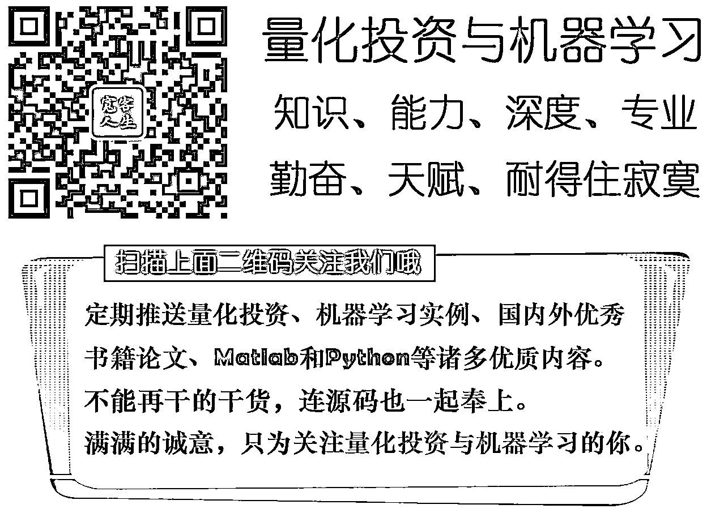

# 【原创精品】使用 R 语言 gbm 包实现梯度提升算法

> 原文：[`mp.weixin.qq.com/s?__biz=MzAxNTc0Mjg0Mg==&mid=2653284768&idx=1&sn=3265102776d8047359b2f625c6e79fb8&chksm=802e2bb5b759a2a3a7be775a806e777d973f90ee6dcf65c315c5df839563beeb0c0310fcaf2f&scene=27#wechat_redirect`](http://mp.weixin.qq.com/s?__biz=MzAxNTc0Mjg0Mg==&mid=2653284768&idx=1&sn=3265102776d8047359b2f625c6e79fb8&chksm=802e2bb5b759a2a3a7be775a806e777d973f90ee6dcf65c315c5df839563beeb0c0310fcaf2f&scene=27#wechat_redirect)

**编辑部**

微信公众号

**关键字**全网搜索

**『量化投资』：排名第一**

**『量       化』：排名第二**

**『机器学习』：排名第三**

我们会再接再厉

成为全网**优质的**金融、技术类公众号

**紧急通知**

我们和深度学习每日摘要公众号联合发起的**微信社区技术交流群已经开通。**详情见此推文：[说好的『12:00』的推文来啦！](http://mp.weixin.qq.com/s?__biz=MzAxNTc0Mjg0Mg==&mid=2653284755&idx=1&sn=4e9ac5627fd01f9996166cec1b37f5d5&chksm=802e2b86b759a29023763d4ee5002ced8ad4546adf5086bb9b08bc75e47627ec18b2082eef61&scene=21#wechat_redirect)

由于添加人数众多，微信对每日添加人数有限制，导致部分人群暂时没有通过微信验证，希望大家理解一下，我们会尽快处理这个问题。 

谢谢各位理解。

**原创推文预告（绿色为已发布，点击标题即可阅读）**

●  [随机森林在因子选择上的应用基于 Matlab](http://mp.weixin.qq.com/s?__biz=MzAxNTc0Mjg0Mg==&mid=2653284721&idx=1&sn=d10574bab3dd2c9e180ba10dfd997b36&chksm=802e2b64b759a272c0955c8d30f33e4fc94567d0924ea7503370413413afe5658c6d5479e3d7&scene=21#wechat_redirect)

●  [择时策略：在一天的何时进行交易](http://mp.weixin.qq.com/s?__biz=MzAxNTc0Mjg0Mg==&mid=2653284661&idx=1&sn=c9ad97af8f3523545e0504ecd23a3c30&chksm=802e2b20b759a2360ae7d800ec324673dda88715b12414f381435ce105d21a372b91ac2200bc&scene=21#wechat_redirect)

●  [主题模型 - LDA 学习笔记（一）](http://mp.weixin.qq.com/s?__biz=MzAxNTc0Mjg0Mg==&mid=2653284555&idx=1&sn=bb10c8d1b6c027d054f37c530b12a13f&chksm=802e2adeb759a3c8dd40b0047ea6c4997da26acb920ba5d955f36cc7bf57f692777d3ffe1a74&scene=21#wechat_redirect)

● 朴素贝叶斯对垃圾邮件进行分类基于 Python

● R 语言构建追涨杀跌量化交易模型

● R 语言量化投资常用包总结

● R 语言者如何使用 Python 在数据科学方面

● 国外书籍放送：Math、ML、DL（干货）

● 免费网络课程：ML 和 AI（干货）

● 实用指南在 R 聚类算法和评价的介绍

● 朴素贝叶斯算法在 Python 和 R 的应用

**所有编辑部原创文章，未经授权**

**任何个人和机构不得以任何方式转载**

**gbm-Gradient Boost Machinet 梯度提升算法**

梯度提升算法 Gradient Boosting Machine，属于模型集成方法中的 boosting 类方法。通常来说模型集成能够大大提高模型表现，减少单个模型预测的偏差和方差，因此深受数据分析人士的喜爱。

最基础的模型集成方法，即生成多个模型（也叫基础学习器 base learner）后，取预测平均数（如线性回归）或以多数投票表决（如决策树等分类问题）为模型结果。为了训练出不同的模型，需要对训练集进行 Bootstrap 抽样，这种方法于 1996 年由 Breiman 提出，叫做 bagging，是较为简单的模型集成法。而 bagging 与 boosting 的主要区别，即 boosting 算法中基础学习器的训练往往以上一个基础学习器的结果为基础，对上一个基础学习器有所改进。每一次训练也叫做一次迭代，对于 boosting，模型集成是有先后训练顺序的基础学习器的加总，而 bagging 是彼此没有关系的基础学习器的加总。

boost 也分为许多种类，如 AdaBoost、Gradient Boost、XGBoost 等，Gradient Boost 顾名思义，与梯度脱不开关系，对梯度有了解或学过数值计算的人应当知道，负梯度方向是函数下降最快的方向。在有监督机器学习中，我们的目标是学得使得损失函数最小的模型，因此梯度下降算法的目标则是在每一轮迭代中，求得当前模型的损失函数的负梯度方向，乘以一定的步长（即学习速率），加到当前模型中形成此轮迭代产生的新模型，从而达到每一轮迭代后的模型，相比上轮模型，都可以使得损失函数更小的目的。

因此对于 Gradient Boost Machine 来说重要的变量有：迭代次数 M、损失函数的形式ψ(y,f)和基础学习器的形式 h(x,θ)。确定了以上变量后，Gradient Boost Machine 的算法如下：

1、以常数初始化函数 f0

2、从第 1 到第 M 次迭代：

3、计算负梯度函数 gt(x)

4、训练新的基础学习器 h(x, θt)

5、找到最佳步长ρt 使得

**gbm 包**

实际上，梯度提升算法并不特指某个特定模型，而是一种机器学习思想，被人们运用到许多传统的模型中而形成了一类强大的机器学习方法。有趣的是，gbm 包的全称也并不是 Gradient Boost Machine，而是 generalized boosted regression models—广义提升回归模型，即运用了 boosting 算法的广义回归模型，既可以解决回归问题，也可以解决分类问题。

gbm 包中最主要的函数为 gbm/gbm.fit。函数提供了很多参数以进行模型调优。

（1）distribution：模型计算损失函数时，需要对输出变量的数据分布做出假设。一般来说，对于分类问题，选择 bernoulli 或者 adaboost，前者更为推荐；对于连续因变量，选择 gaussian 或者 laplace。此外，gbm 包还为一些具体问题提供了不少其他选择。

（2）shrinkage：学习速率，即每一步迭代中向梯度下降方向前进的速率。一般来说学习速率越小，模型表现越好。令 shrinkage=0.001 得出的模型几乎一定比 shrinkage=0.01 的模型好，然而代价是前者运算所需的时间和所耗内存将是后者的 10 倍。所以选择的准则是在可以承受的时间和内存范围内，shrinkage 越小越好。

（3）n.trees：即 number of iteration—迭代次数。迭代次数的选择与学习速率密切相关，下图展示了模型表现、学习速率和迭代次数之间的关系：

迭代次数可以设得稍微大一点，因为模型训练完后，gbm 中的 gbm.perf 可以估计出最佳迭代次数以供预测阶段使用。在模型训练阶段，gbm 作者的经验法则是：3000-10000 之间的迭代次数搭配 0.01-0.001 之间的学习速率。

（4）interaction.depth 和 n.minobsinnode：子决策树即基础学习器的深度和决策树叶节点包含的最小观测树，若基础学习器训练得过于复杂，将提升模型对于样本的拟合能力而导致过拟合问题，因此子决策树深度不宜过大，叶节点可包含的最小观测书不宜过小。

**实现**

本文以 kaggle 上著名的 titanic 生还预测问题为例，演示如何用 R 语言实现这一强大的算法。具体问题介绍可移步：https://www.kaggle.com/c/titanic.

**获取数据：**

首先对数据集进行前期考察：

**字段意义：**

PassengerId：乘客 ID；Pclass:乘客等级；Name:乘客姓名；Sex:性别；Age:年龄；SibSp:堂兄弟/妹个数；Parch:父母与小孩个数；Ticket:船票信息，Fare:票价；Cabin:客舱；Embarked:登船舱口。

可知训练数据集包含 12 个变量，891 个观测；测试数据集则少了目标变量 Survived，包含 11 个变量。由于 Name 属性和 ticket 属性取值过散、PassengerID 只是计数变量，我们认为预测意义不大，故在建模中舍弃。

summary 函数返回自变量的相对重要性，可看出票价、年龄、性别三个变量对于结果预测非常重要。因此 gbm 也是一种很有用的变量筛选方法，当自变量个数较多带来信息噪声时，bgm 将会给噪声变量赋予接近于 0 的相对重要性。

gbm.perf 函数返回最佳迭代次数，由图可看出迭代到第 1364 次时，模型表现不再有进一步的提升，因此最佳迭代次数为 1364。

样本内预测准确度为 0.87

在 gaggle 上提交结果：

**投稿、商业合作**

**请发邮件到：lhtzjqxx@163.com**

**关注者**

**从****1 到 10000+**

**我们每天都在进步**

听说，置顶关注我们的人都不一般

****