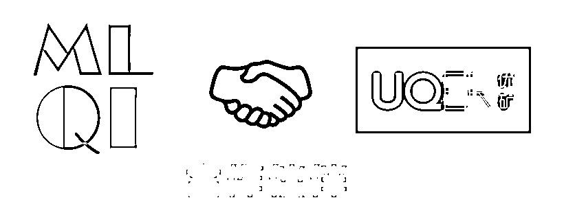

# 新股、次新股的投资机会深入研究 | 基于 Python（附源代码）

> 原文：[`mp.weixin.qq.com/s?__biz=MzAxNTc0Mjg0Mg==&mid=2653284749&idx=1&sn=8d35787fc3452d1ab17b89637ed4e59b&chksm=802e2b98b759a28eab8f2be6007c40b87131cac04b38bdf7b1bd726b3316778f809906f6356a&scene=27#wechat_redirect`](http://mp.weixin.qq.com/s?__biz=MzAxNTc0Mjg0Mg==&mid=2653284749&idx=1&sn=8d35787fc3452d1ab17b89637ed4e59b&chksm=802e2b98b759a28eab8f2be6007c40b87131cac04b38bdf7b1bd726b3316778f809906f6356a&scene=27#wechat_redirect)

**编辑部**

微信公众号

**关键字**全网搜索

**『量化投资』：排名第一**

**『量       化』：排名第二**

**『机器学习』：排名第三**

我们会再接再厉

成为全网**优质的**金融、技术技类公众号

**摘要**

*   本文主要从新股首次破板、次新股短期投资机会、次新股长期投资机会这三个方面来详细分析，新股合适的卖出时点，次新股的合适的投资机会等有意思的问题。

*   本文结构

*   新股首次破板状态统计分析

*   次新股的短期投资机会

*   次新股的长期投资机会

**新股首次破板状态统计分析**

首先我们要找到新股首次破板的日期是哪天，这里我们所说的首次破板是新股除第一天后的第二天开始算起，没有一字板的第一天。得益于通联数据提供的 tick 级数据计算的涨跌停次数 API，我们可以很方便判断一只股票是否在当天是一字板，判别标准为当天开盘价等于当天涨停价，且当天涨停次数等于 1。

`000166.XSHE`(申万宏源),`001979.XSHE`(招商蛇口),`300498.XSHE`(温氏股份),`601155.XSHG`(新城控股)。这四只股票上市日首日就没有涨停，不过都有些并购重组的意味，申万宏源和招商蛇口就不用说了，温氏股份是吸并大华农，新城控股是 B 股转 A 股。所以这种股票没有很好的涨幅也是情有可原的，毕竟谈不上纯正的新股。我们把这几只股票剔除，继续分析。

> 可以看出，不同的流通市值在一字板天数上有显著差异，呈现出明显的小市值效应，需要注意的是此处都是用新股上市第二天的收盘价计算的属性。中了流通市值小于 5 的新股的就偷着乐了吧。

> 用总市值来分组也体现出明显的小市值效应，但可以看出以新股上市第二天的收盘价的总市值，已没有股票是是低于 5 亿的了。

> 可以看出用 PE 来进行划分，各股票的一字板数差异不大，可能的原因是各个股票的估值更加参考的各个股票所处的行业，故我们进一步以行业来做分组。

> 从行业属性来看，计算机、国防军工等股票平均来说有更多的一字板，而银行、非银金融、采掘等传统行业则更少的一字板天数。当然，也很有可能是因为银行等行业的股票上市时就市值较大，而计算机等则比较小，内生原因可能还是市值。但也正是因为计算机、通信等属于新兴行业，它们目前公司的都处于起步，所以市值较小；而银行等传统行业，已经非常成熟，上市的公司也市值相对较大。所以也很难说明，这就不是行业的原因。

此处，我们不进一步讨论，行业，市值与估值的交叉影响。我们只要知道，行业与市值对新股上市的一字板天数的影响是非常显著的，而估值从全市场范围来看影响并不是很显著，这对我们进一步对次新股的操作是非常有帮助的。

**次新股的短期投资机会**

此处，次新股的定义是上市首日一次性涨停后，第一次出现不是一字板的股票，这样的股票也是我们实际中可以买得到的股票。而如何把握次新股的短期投资机会呢，有一句叫什么，对一只的股票最好的定价，就是找到一个相似的股票。故短期来说，可能会有某一只股票因整体的市场环境不好而提前破板，这时候参考其相似公司的涨停板数，就可以对该次新股有一个较好的参考意义。当然本身市场环境的变化，就会直接影响新股的涨停天数，但即使至今，新股的涨停逻辑仍在，所以当有某只股票意外破板，就可以把握该机会，果断买入。 

这里不用到未来数据，做一个简单的回测，用 2015 年 6 月 3 日之前破板的 99 只股票作为初始已知样本，其后破板的 350 只做为回测股票滚动寻找初始状态最为接近的样本。

这里给出全部信息，实际上对于单一股票，拿出之前相同行业的股票进行综合分析就可以，譬如说上面的例子，`603989`在 2015 年 5 月 15 日上市，在 2015 年 6 月 3 日破板，历经 14 个涨停板，已经是之前所有电子行业上市的股票的最多涨停天数了，并且流通市值和总市值在之前上市的电子行业中也较大，所以这样一个涨停次数已经算非常多了。也就是在牛市最后的疯狂才有这样一个情况，可以看下 K 线，股灾迅速跌去了三分之二，这样的股票在破板之后最好不要碰。

这里我们做一个简单的量化，选出破板的股票，其一字板数是之前上市的同行业股票最少的 20%的,并且流通市值(亿)、总市值(亿)也是最小 50%,PE 不要最大的 20%。

OK，我们大致选出了这几只股票有比较好的投资机会，有点少，当然你可以放松条件得到更多。现在我们调用事件驱动时间窗口分析，对这几只股票进行事件窗口收益率测试。

> 可以看出这样选出的次新股在短期确实有比较多的超额收益，观察基准走势可以发现，指数一开始也是上涨的，观察事件列表也可以知道，大部分都是在 2015 年 7 月 8 日的大跌提前破板的，之后指数开始反弹，这些次新股也开始反弹，并且反弹力度超乎想象。

**次新股的长期投资机会**

长期来看当然是看基本面咯，这个这里没啥好说的了。 

这里只说一点，历史来说，一个壳卖个二三十亿完全没问题吧，那一只股票的总市值能低于这个价吗？不能！尤其是别人还有很多净资产的。所以，这是我觉得市值因素如此重要的原因。当然现在风云突变，不停的上新股，而且刘主席很反感这些卖壳的公司。但这是 A 股一贯的逻辑，有时收紧有时放松，并且现在没有完善的退市机制，不可能这样一直上新股。

**投稿、商业合作**

**请发邮件到：lhtzjqxx@163.com**

**关注者**

**从****1 到 10000+**

**我们每天都在进步**

听说，置顶关注我们的人都不一般

****