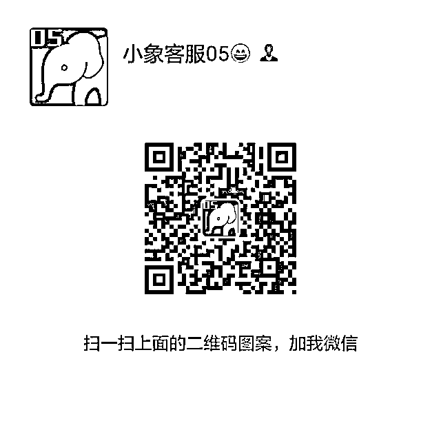

# 【福利】深度学习重磅来袭，直击数据科学最前沿！

> 原文：[`mp.weixin.qq.com/s?__biz=MzAxNTc0Mjg0Mg==&mid=2653284725&idx=1&sn=3b0298a81d22bbf7668e5d01985d6c9a&chksm=802e2b60b759a276d64884148e79bf6ca13f6a9b3dc8bd1511ca52d157aa8a51260cf004b209&scene=27#wechat_redirect`](http://mp.weixin.qq.com/s?__biz=MzAxNTc0Mjg0Mg==&mid=2653284725&idx=1&sn=3b0298a81d22bbf7668e5d01985d6c9a&chksm=802e2b60b759a276d64884148e79bf6ca13f6a9b3dc8bd1511ca52d157aa8a51260cf004b209&scene=27#wechat_redirect)

**编辑部**

微信公众号

**关键字**全网搜索

**『量化投资』：排名第一**

**『量       化』：排名第二**

**『机器学习』：排名第三**

我们会再接再厉

成为全网**优质的**金融、技术技类公众号

**立即参团**

原价 ¥899.00

100 人以上 ¥ 599.00

300 人以上 ¥ 499.00

300 人以上 ¥ 399.00

**目前已达最低价**

**文末加客服微信参团**

课程名称

**深度学习**【第三期】

主讲老师

**李伟， 美国纽约城市大学博士**

研究领域包括深度学习，计算机视觉，人脸计算以及人机交互，即将毕业加入美国顶级云计算平台人工智能研究组。在 CVPR，ECCV 等顶级会议上发表了多篇学术文章，同时他还是 WACV，ACCV，ECCV 等重要视觉会议以及 MVA，CVIU 等期刊的审稿人。

课程简介

本次的深度学习课程主要包括三大部分：

1\. 深度学习核心原理。了解深度学习运行的最核心数学原理，从而对后续的知识点扩展，模型设计与优化技能打下基础。

2. 深度学习知识点连接。会涵盖主流的深度学习研究工程应用中碰到的大部分知识点，与大部分学习资料孤立进行知识点介绍不同，会结合主讲人自身总结找到所有知识点之间的联系，便于系统掌握。

3. 介绍不同知识点的代表应用。结合所学的原理以及知识点，介绍比较重要的图像和语言方面的应用，如**增强学习，迁移学习，GAN**等， 方便学员针对自身兴趣的目标进行强化训练。

面向人群

1\.  想了解和学习深度学习的学习者

2\.  想学习深度学习的相关从业人员

3\.  想转行从事深度的学习者

学习收益

通过本课程的学习，学员将会收获：

1\.  帮助学员系统性的掌握深度学习的基本原理，以及从基本概念到各个先进模型的转化思路

2\.  了解研究过程中定义问题设计模型的思路

3\.  培养学员面对工程及学术问题的思考解决能力

4\.  快速积累深度学习项目经验

开课时间

2017 年 3 月 4 日开课

学习方式

在线直播，共 10 次

每周 2 次（周六、日晚上 20:00-22:00）

直播后提供录制回放视频，可在线反复观看，有效期 1 年

课程大纲

#### 第一课 深度学习总体介绍

1.  神经网络：传统到现代

2.  深度学习应用特点

3.  深度学习发展方向

4.  深度学习框架比较：用 Tensorflow 进行课程学习

#### 第 2 课 传统神经网络

1.  线性回归

2.  非线性激励函数

3.  loss 函数，常见问题：过拟合，正则化，dropout

   实例：传统神经网络络实现

#### 第 3 课 反向反馈：深度学习模型优化基础

1.  SGD 梯度下降介绍

2.  神经网络的梯度优化

3.  神经网络训练

   实例：反向梯度优化对比

#### 第 4 课 卷积神经网络

1.  卷积核以及卷积层

2.  AlexNet 最早的现代神经网络

3.  VGG，GoogleNet,，ResNet. 近期的高级网络

   实例：利用已有模型进行物体分类／特征提取

#### 第 5 课  迁移学习

1.  理论分析

2.  迁移模型&原始训练模型

3.  如何设计新的的网络

   实例：表情识别／人脸识别／动物识别

#### 第 6 课 与时域信息相关的深度学习

1.  RNN    

2.  LSTM

3.  图片标题生成

4.  视频处理

   实例：LSTM 用于图片标题生成

#### 第 7 课 自然语言处理

1.  处理之前：speech to text

2.  词语表达，word2vect

3.  语句生成 LSTM

   实例：根据上下文回答问题

#### 第 8 课 给予深度学习的目标检测

1.  传统的目标检测方法

2.  初代算法： Region CNN

3.  升级： SPP Net， Fast RCNN， Faster RCNN

4.  深度学习另辟蹊径： YoLo 和 SSD

   实例： 自动驾驶的核心：实时目标检测

#### 第 9 课 深度卷积神经网络的重要应用

1.  图片问答

2.  图像模式转换

3.  图像高清化

4.  围棋程序， Alpha go

5.  自动游戏机器人，DeepMind Atari

   实例： 图片艺术风格转化

#### 第 10 课：无监督学习：对抗网络 GAN

1.  传统无监督学习 Autoencode，K Means，Sparse Coding

2.  RBM 限制博斯曼机，深度学习的另一支

3.  生成对抗网络 GAN

   实例： 机器生成图片，以假乱真

**长按扫码加客服——****参团，咨询，查看课程**

****

**投稿、商业合作**

**请发邮件到：lhtzjqxx@163.com**

**关注者**

**从****1 到 10000+**

**我们每天都在进步**

听说，置顶关注我们的人都不一般

