# 【原创精品】随机森林在因子选择上的应用基于 Matlab

> 原文：[`mp.weixin.qq.com/s?__biz=MzAxNTc0Mjg0Mg==&mid=2653284721&idx=1&sn=d10574bab3dd2c9e180ba10dfd997b36&chksm=802e2b64b759a272c0955c8d30f33e4fc94567d0924ea7503370413413afe5658c6d5479e3d7&scene=27#wechat_redirect`](http://mp.weixin.qq.com/s?__biz=MzAxNTc0Mjg0Mg==&mid=2653284721&idx=1&sn=d10574bab3dd2c9e180ba10dfd997b36&chksm=802e2b64b759a272c0955c8d30f33e4fc94567d0924ea7503370413413afe5658c6d5479e3d7&scene=27#wechat_redirect)

**编辑部**

微信公众号

**关键字**全网搜索

**『量化投资』：排名第一**

**『量       化』：排名第二**

**『机器学习』：排名第三**

我们会再接再厉

成为全网**优质的**金融、技术技类公众号

**所有编辑部原创文章，未经授权**

**任何个人和机构不得以任何方式转载**

**原创推文预告**

● 使用 R 语言 gbm 包实现梯度提升算法

● 朴素贝叶斯对垃圾邮件进行分类基于 Python

● R 语言构建追涨杀跌量化交易模型

● R 语言量化投资常用包总结

● R 语言者如何使用 Python 在数据科学方面

● 国外书籍放送：Math、ML、DL（干货）

● 免费网络课程：ML 和 AI（干货）

● 实用指南在 R 聚类算法和评价的介绍

● 朴素贝叶斯算法在 Python 和 R 的应用

**干货分享**

**（已经全部分享，点击标题，即可获取）**

[2016 年全年所有券商金融工程研究报告（共 600 篇）- 第 1 部分](http://mp.weixin.qq.com/s?__biz=MzAxNTc0Mjg0Mg==&mid=2653284668&idx=1&sn=1d099b61ac8a378f39ef99203cfb85af&chksm=802e2b29b759a23f1ce824e84ab55601f8da41ace7877cac3fe97900f1a7147c97a732481841&scene=21#wechat_redirect)

2[016 年全年所有券商金融工程研究报告（共 600 篇）- 第 2、3、4 部分](http://mp.weixin.qq.com/s?__biz=MzAxNTc0Mjg0Mg==&mid=2653284678&idx=1&sn=0c29d884ada86f565b5849057fe5cdb6&chksm=802e2b53b759a245db87fe77c211e8f987464d0d188305808b412fb2d36cbc9f4bb707fedde9&scene=21#wechat_redirect)

[2016 年全年所有券商金融工程研究报告（共 600 篇）- 第 5、6、7、8、9 部分](http://mp.weixin.qq.com/s?__biz=MzAxNTc0Mjg0Mg==&mid=2653284702&idx=1&sn=c150e541adb6f852459b085a086bf97f&chksm=802e2b4bb759a25de30c981d25e8db6c90e409e0c8ec5303ad0b3fa673abfc01fd4832842c16&scene=21#wechat_redirect)

**基于随机森林算法的位点检测模型**

**随机森林算法模型**

**（1）随机森林算法定义**  

随机森林在运算量没有显著提高的前提下提高了预测精度。随机森林对多元公线性不敏感，结果对缺失数据和非平衡的数据比较稳健，可以很好地预测多达几千个解释变量的作用。随机森林，是用随机的方式建立一个森林，森林里面有很多的决策树组成，随机森林的每一棵决策树之间是没有关联的。在得到森林之后，当有一个新的输入样本进入的时候，就让森林中的每一棵决策树分别进行一下判断，看看这个样本应该属于哪一类（对于分类算法），然后看看哪一类被选择最多，就预测这个样本为哪一类。

**（2）随机森林算法优点**

随机森林算法被大量使用，基于它有很多的优点：

（a）在数据集上表现良好，两个随机性的引入，使得随机森林不容易陷入过拟合；

（b）两个随机性的引入，使得随机森林具有很好的抗噪声能力；

（c）它能够处理很高维度的数据，并且不用做特征选择，对数据集的适应能力强；

（d）可生成一个 Proximities=

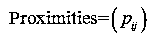

矩阵，用于度量样本之间的相似性：

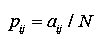

（aij 表示样本 i 和 j 出现在随机森林中同一个叶子结点的次数，N 为随机森林中树的颗数）。

**（3）随机森林算法应用范围**  

随机森林主要应用于回归和分类。随机森林和使用决策树作为基本分类器有些类似。以决策树为基本模型的 bagging 在每次 bootstrap 放回抽样之后，产生一棵决策树，抽多少样本就生成多少棵树，在生成这些树的时候没有进行更多的干预。而随机森林也是进行 bootstrap 抽样，但它与 bagging 的区别是：在生成每棵树的时候，每个节点变量都仅仅在随机选出的少数变量中产生。随机森林（randomforest）是一种利用多个分类树对数据进行判别与分类的方法，它在对数据进行分类的同时，还可以给出各个变量（因子）的重要性评分，评估各个变量在分类中所起的作用。

**（4）随机森林（RF）算法基本原理**

随机森林通过自助法（bootstrap）重采样技术，从原始训练样本集 N 中有放回地重复随机抽取 k 个样本生成新的训练样本集合，然后根据自助样本集生成 k 个分类树组成随机森林，新数据的分类结果按分类树投票多少形成的分数而定。其实质是对决策树算法的一种改进，将多个决策树合并在一起，每棵树的建立依赖于一个独立抽取的样本，森林中的每棵树具有相同的分布，分类误差取决于每一棵树的分类能力和它们之间的相关性。特征选择采用随机的方法去分裂每一个节点，然后比较不同情况下产生的误差。能够检测到的内在估计误差、分类能力和相关性决定选择特征的数目。单棵树的分类能力可能很小，但在随机产生大量的决策树后，一个测试样品可以通过每一棵树的分类结果经统计后选择最可能的分类。

**Gin importance 值和 Permutationimportance 值**

随机森林方法的一个重要特性是能够计算每个变量的重要性值，RF 提供两种基本的变量重要性值：Giniimportance 值和 Permutation importance 值。

**（1）Giniimportance 值**

在节点分裂过程中用 Gini 系数来衡量各节点的样本纯度，Gini 系数定为：    

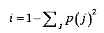

其中，P(j) 为该节点中属于类别 j 的样本所占的比例。选择合适的节点分裂属性，使子节点的样本纯度比父节点的样本纯度更高，样本的不纯度的下降为：

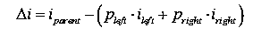

Pleft 和 Pright 分别为左右两个子节点中样本所占的比例，ipatsent、ileft、iright 分别为父节点和左右子节点的 Gini 系数。任取一个属性变量 Xi，对森林中的所有选择该变量为分裂变量的节点计算不纯度降低量的总和，可获得 Xi 的 Giniimportance，即：    

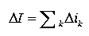

**（2）Permutationimportance 值**

通过随机森林 T 中的每棵树 t 对样本计算预测准确率 At。记录样本被正确分类的个数为 Nr，则：

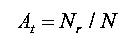

然后将需要计算的变量的属性值打乱随机赋值，再次利用样本计算预测准确率 A*t。记录样本被正确分类的个数为 N'T，则：

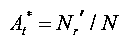

最后将预测准确率的改变量对 T 取算术平均，可获得该变量 Permutationimportance，即：

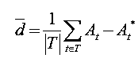

**随机森林算法条件控制**

森林中所要生长出的树的个数 ntree，生长每棵树中节点分裂随机选择的变量子集中变量的个数 mtry，以及每棵树的规模，在用于样本的预测分类的情况下，每个样本所占的权重也可以设置。

（a）mtry 的控制：参数 mtry 可以视为随机森林模型的自由度(df，degreesof freedom)控制参数，mtry 越大，自由度越小。

（b）ntree 的控制：其中一个重要参数是需要在森林中生长出多少棵分类决策树，即参数 ntree。与参数 mtry 复杂的情况不同的是，参数 ntree 值越大越好。

（c）规模的控制：从实验角度讲，限制树的规模有一定的效应，因为可以加快计算的速度，特别是对于有很多噪声变量的情况下，可以减少多余的节点分裂而生成仅含有重要变量的更小规模的分类回归树。

**基于随机森林的因子选择方法**

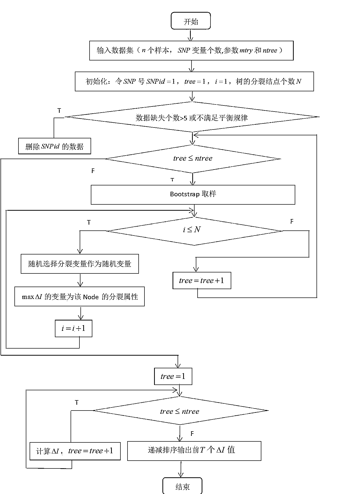

基于随机森林的因子筛选求解流程图

**随机森林算法因子重要性检测结果**

本题提供了 2014 年和 2015 年两年的数据，由于上市公司年报数据在第二年 4 月 30 号之前出来，所以 2014 年的数据选择区间为 2014-05-01 至 2015-05-01,2015 年的数据选择为 2015-05-01 至 2016-05-01。

表 1：待选因子

| 序号 | 1 | 2 | 3 | 4 | 5 | 6 | 7 | 8 |
| 因子 | 市值 | 净资产收益率 | 总资产净利率 | 流动比率 | 速动比率 | 市盈率 | 市净率 | 每股净收益 |
| 序号 | 9 | 10 | 11 | 12 | 13 | 14 | 15 | 16 |
| 因子 | 营业收入增长率 | 净利润增长率 | 总资产增长率 | 固定资产扩张增长率 | 存货周转率 | 总资产周转率 | Z 值 | 上市以来分红率 |

本文对模拟数据集取 ntree=1000 以及 mtry=4，实验得到各因子的重要性 Giniimportance 值。

radio = 1.96;

z = find(profit>mean(profit)+radio*std(profit));

我们将当年的股票分为两类，收益率大于均值加上 1.96 倍方差则为优质股票，定义为 1，其他为-1。定义为 1 的优质股票数量按照正态分布概率估算为 5%。

**（1）2014 年数据检验**

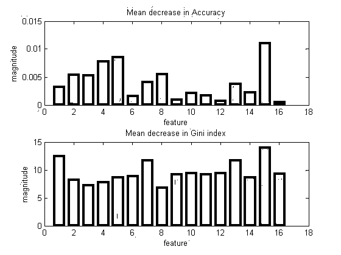

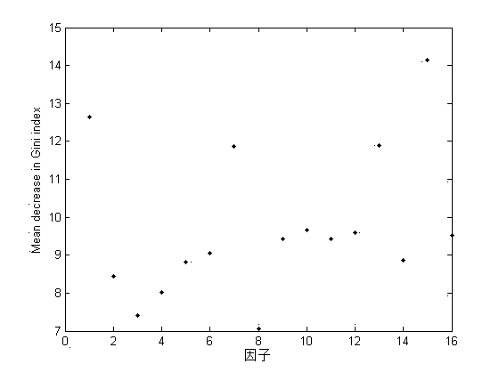

因子的重要性值

将因子基尼系数从高到低排列

16 个因子的基尼系数

| 因子重要等级 | 因子 | 因子重要性值 |
| 1 | Z 值 | 14.155 |
| 2 | 市值 | 12.635 |
| 3 | 存货周转率 | 11.903 |
| 4 | 市净率 | 11.864 |
| 5 | 净利润增长率 | 9.674 |
| 6 | 固定资产扩张增长率 | 9.591 |
| 7 | 上市以来分红率 | 9.513 |
| 8 | 总资产增长率 | 9.427 |
| 9 | 营业收入增长率 | 9.423 |
| 10 | 市盈率 | 9.062 |
| 11 | 总资产周转率 | 8.875 |
| 12 | 速动比率 | 8.820 |
| 13 | 净资产收益率 | 8.439 |
| 14 | 流动比率 | 8.027 |
| 15 | 总资产净利率 | 7.421 |
| 16 | 每股净收益 | 7.049 |

实验结果显示，从 1 到 16 对应的因子的变量重要性值依次减小，因子重要

性值越大，说明该因子影响其收益率大。

**（2）2015 年数据实验**

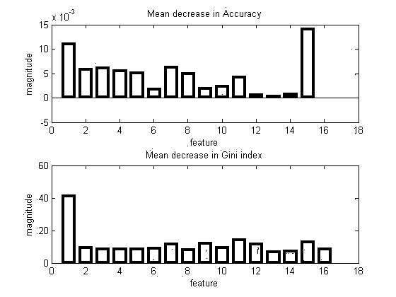

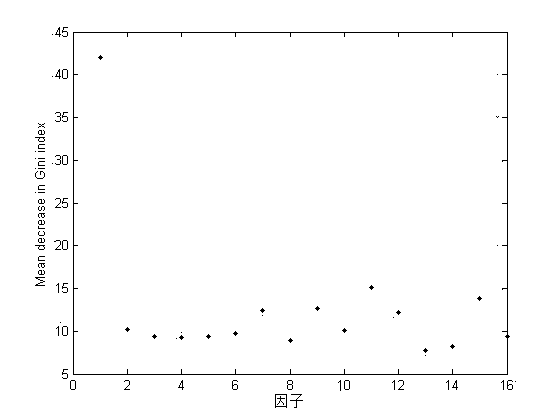

16 个因子的基尼系数

| 因子重要等级 | 因子 | 因子重要性值 |
| 1 | 市值 | 41.9889 |
| 2 | 总资产增长率 | 15.1180 |
| 3 | Z 值 | 13.8874 |
| 4 | 营业收入增长率 | 12.6155 |
| 5 | 市净率 | 12.4453 |
| 6 | 固定资产扩张增长率 | 12.1865 |
| 7 | 净资产收益率 | 10.1617 |
| 8 | 净利润增长率 | 10.1454 |
| 9 | 市盈率 | 9.6903 |
| 10 | 总资产净利率 | 9.3742 |
| 11 | 速动比率 | 9.3501 |
| 12 | 上市以来分红率 | 9.3313 |
| 13 | 流动比率 | 9.2721 |
| 14 | 每股净收益 | 8.9495 |
| 15 | 总资产周转率 | 8.2217 |
| 16 | 存货周转率 | 7.7311 |

| 因子重要等级 | 2014 因子 | 2014 因子重要性值 | 2015 因子 | 2015 因子重要性值 |
| 1 | Z 值 | 14.155 | 市值 | 41.9889 |
| 2 | 市值 | 12.635 | 总资产增长率 | 15.1180 |
| 3 | 存货周转率 | 11.903 | Z 值 | 13.8874 |
| 4 | 市净率 | 11.864 | 营业收入增长率 | 12.6155 |
| 5 | 净利润增长率 | 9.674 | 市净率 | 12.4453 |
| 6 | 固定资产扩张增长率 | 9.591 | 固定资产扩张增长率 | 12.1865 |
| 7 | 上市以来分红率 | 9.513 | 净资产收益率 | 10.1617 |
| 8 | 总资产增长率 | 9.427 | 净利润增长率 | 10.1454 |
| 9 | 营业收入增长率 | 9.423 | 市盈率 | 9.6903 |
| 10 | 市盈率 | 9.062 | 总资产净利率 | 9.3742 |
| 11 | 总资产周转率 | 8.875 | 速动比率 | 9.3501 |
| 12 | 速动比率 | 8.820 | 上市以来分红率 | 9.3313 |
| 13 | 净资产收益率 | 8.439 | 流动比率 | 9.2721 |
| 14 | 流动比率 | 8.027 | 每股净收益 | 8.9495 |
| 15 | 总资产净利率 | 7.421 | 总资产周转率 | 8.2217 |
| 16 | 每股净收益 | 7.049 | 存货周转率 | 7.7311 |

从以上数据可以发现 Z 值、市值、市净率、净利润增长率、固定资产扩张增长率、总资产增长率、营业收入增长率是能够区分出档期收益率较高的股票重要因子

**投稿、商业合作**

**请发邮件到：lhtzjqxx@163.com**

**关注者**

**从****1 到 10000+**

**我们每天都在进步**

听说，置顶关注我们的人都不一般

****