# 两会行情投资指南：从历史数据看，这些板块会涨！

> 原文：[`mp.weixin.qq.com/s?__biz=MzAxNTc0Mjg0Mg==&mid=2653284704&idx=1&sn=5f2b07a7da7c5ca072df780f87a72e03&chksm=802e2b75b759a26385fc12ae1c9d70142d53cc5db6849f88164a3ffb80c19b27fb2d94627088&scene=27#wechat_redirect`](http://mp.weixin.qq.com/s?__biz=MzAxNTc0Mjg0Mg==&mid=2653284704&idx=1&sn=5f2b07a7da7c5ca072df780f87a72e03&chksm=802e2b75b759a26385fc12ae1c9d70142d53cc5db6849f88164a3ffb80c19b27fb2d94627088&scene=27#wechat_redirect)

**编辑部**

微信公众号

**关键字**全网搜索

**『量化投资』：排名第一**

**『量       化』：排名第二**

**『机器学习』：排名第三**

我们会再接再厉

成为全网**优质的**金融、技术技类公众号

**量化投资寒冬已过**

**春天正向我们走来**

**股指期货给了我们曙光**

今天在这里给大家分享一篇很红的两会行情统计，就让我们一起成为优秀的 A 股战士吧！ 

A 股市场的日历效应

日历效应反映了金融市场与日历有关的非正常收益，包括星期效应、月内效应、月份效应、节假日效应等。全国“两会”是“全国人民代表大会”和“中国人民政治协商会议”的简称，于每年 3 月份左右召开。自 1994 年以来，A 股市场共经历 23 次“两会”（不含 2017 年）。在这 23 次召开期间其后，A 股表现出较为明显的日历效应，以下统计 A 股市场主要指数及申万一级行业的指数在两会期间、前后 5 个交易日、10 个交易日、20 个交易日的市场表现（涨跌幅及上涨比例）。

上证综指历次两会期间及前后表现

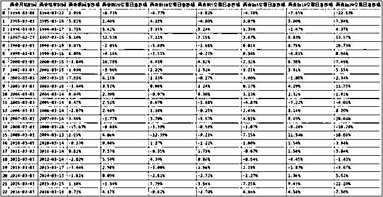

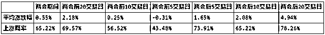

从上证指数收益率过去 23 年的经验看，**“两会”前后的统计结论比较显著：**

**1.**“两会”期间： “两会”期间上涨概率为 65.22%，平均涨幅为 0.55%；                   

**2.**“两会”前后 5 个交易日：会后大概率上涨（73.91%），会前不稳定，上涨概率较低(43.48%),平均涨幅也小于 0；                                                                     

**3.**“两会”前后 10 个交易日：会后较大可能上涨（65.22%），会前不稳定；“两会”前后 20 个交易日：会前会后均大概率上涨（分别为 65.57%、78.26%）; 平均涨幅与上涨概率会后要大于会前。 

中证 500、沪深 300 历次两会期间及前后表现

比较两会期间及会前会后风格变化情况，以中证 500 指数、沪深 300 指数分别代表中小盘和大盘风格，以 2005 年至 2016 年为样本区间，分析它们的涨跌幅情况。

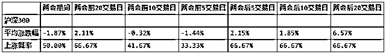

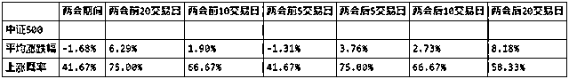

从中证 500 与沪深 300 过去 12 年的涨跌幅度来看，两会前后 5 个交易日、10 个交易日、20 个交易日中小盘的平均涨跌幅均要大于大盘表现，且上涨概率除两会后 20 个交易日也要优于大盘的表现。而且从这些数据，不难看出这样的特征，两会前 20 交易日大概率呈现出先上涨，临近两会大概率下跌的情况。而两会后呈现大概率上涨，而过了 5 到 10 个交易日上涨概率开始下跌。中小板体现出波动性比大盘大的特征，涨的时候涨的多，跌得时候也跌的多。

行业指数历次两会期间及前后表现

按照申万一级行业分类，统计下 2000 年以来 28 个行业在两会前后的市场表现，具体如下所示。

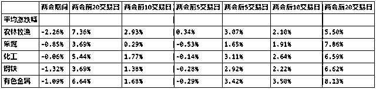

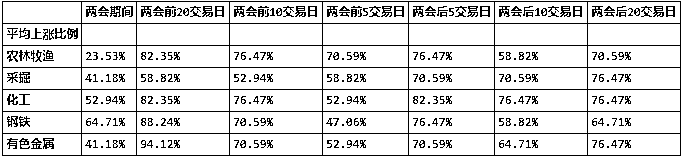

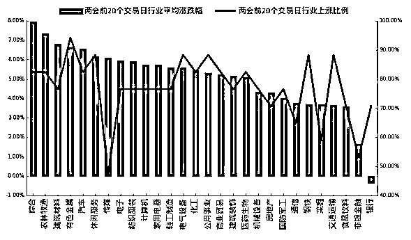

可以看出在两会前 20 个交易日到两会开始期间，**综合、农林牧渔、建筑材料、有色金属等行业的平均涨幅较大**；且在统计区间，有色金属的上涨比例最高，达到了 90%以上，而传媒虽然平均涨幅也较大，但上涨比例不到 50%很低，证明其在有些年份表现非常好，但过半数年份都是涨幅小于零的，不稳定。 

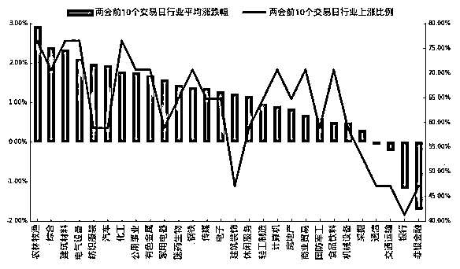

在两会前 10 个交易日到两会开始期间，**仍旧是农林牧渔、综合、建筑材料等行业的平均涨幅大，且上涨比例也很大**。相比于两会前 20 个交易日到两会开始期间，行业的平均涨跌幅大幅下降，行业的上涨比例也有不少下降。表明从两会前 20 个交易日至两会前 10 个交易日，是一个更好的投资区间。

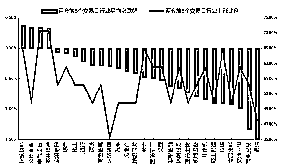

在两会前 5 个交易日到两会开始期间，大部分的行业平均涨跌幅小于 0，且许多行业的上涨比例不到 50%。相比于两会前 20 个交易日到两会开始期间，行业的平均涨跌幅大幅下降，行业的上涨比例也有不少下降。**表明从两会前 20 个交易日至两会前 10 个交易日，是一个更好的投资区间**。 

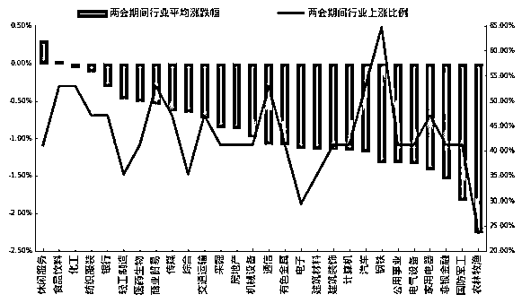

两会期间所有行业的平均涨跌幅均惨不忍睹，仅休闲服务行业为正，并且大部分行业的上涨比例小于 50%。 

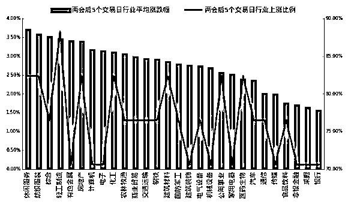

**两会后 5 个交易日，所有行业的平均涨跌幅为正，且幅度较大**。休闲服务、纺织服装、综合、轻工制造等行业的平均涨跌幅较大，且轻工制造的上涨比例最高。 

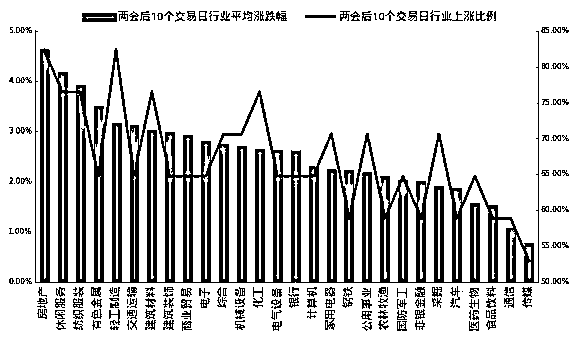

**两会后 10 个交易日，房地产、休闲服务、纺织服装等行业平均涨幅较大**，但相比与两会后的 5 个交易日，整体上涨比例下降，整体平均涨跌幅也下降。 

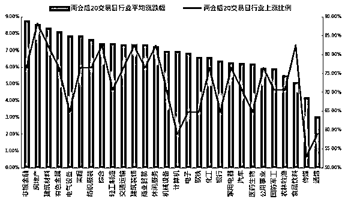

**两会后 20 个交易日，非银金融、房地产、建筑材料等行业平均涨幅较大**，所有行业平均涨幅均大于 3%，但各行业上涨比例有高有低，分化严重。 

总结

从历史上两会前后的整体的表现上来看，**大盘及行业板块在两会前后存在较为明显的日历效应**，两会前 20 个交易日至两会开始，市场整体上涨概率高，平均涨跌幅为正，但临近两会或两会期间，大盘平均涨跌幅为负，且上涨概率低于 50%；而会议结束后，5 到 20 个交易日上涨概率与平均涨跌幅均较高。两会前市场的整体风格表现较为明显，中小板的表现要优于沪深 300 的表现。 从行业上看，两会开始前 20 日，益多配置综合、有色金属、农林牧渔等行业。而临近两会或者在两会期间，可以适当降低仓位，配一些前期涨幅较低的行业。两会结束的 5 日至 20 日，益多配置房地产、轻工制造、休闲服务等行业。

**投稿、商业合作**

**请发邮件到：lhtzjqxx@163.com**

**关注者**

**从****1 到 10000+**

**我们每天都在进步**

听说，置顶关注我们的人都不一般

****