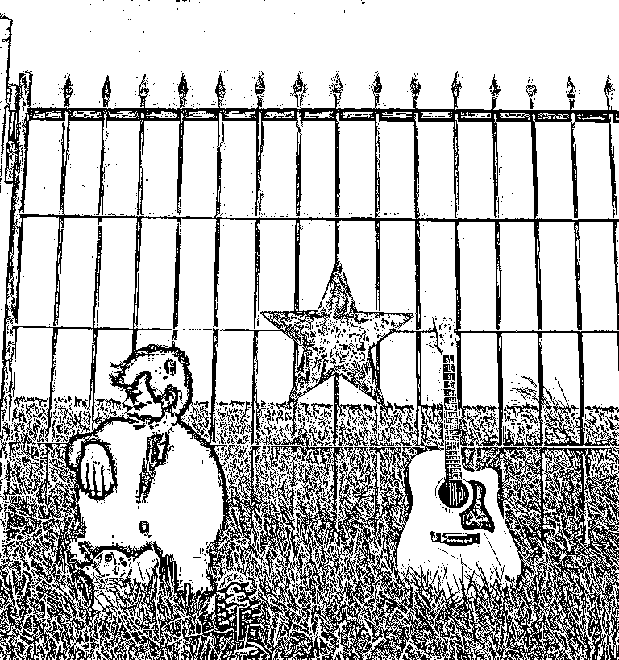
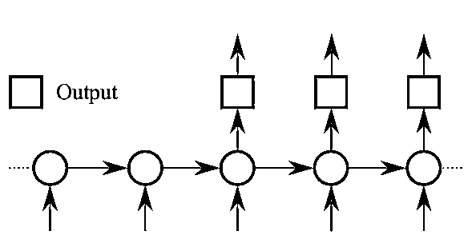

# 『致敬赵雷』基于 TensorFlow 让机器生成赵雷曲风的歌词

> 原文：[`mp.weixin.qq.com/s?__biz=MzAxNTc0Mjg0Mg==&mid=2653284689&idx=1&sn=ba9ccd0f98d5f9fc55bb64c280fbcf50&chksm=802e2b44b759a252f928f8a07b8ee74a601e8fe7ca8673eb26a7c52350ba311df74a99e30249&scene=27#wechat_redirect`](http://mp.weixin.qq.com/s?__biz=MzAxNTc0Mjg0Mg==&mid=2653284689&idx=1&sn=ba9ccd0f98d5f9fc55bb64c280fbcf50&chksm=802e2b44b759a252f928f8a07b8ee74a601e8fe7ca8673eb26a7c52350ba311df74a99e30249&scene=27#wechat_redirect)


**编辑部**

微信公众号

**关键字**全网搜索

**『量化投资』：排名第一**

**『量       化』：排名第二**

**『机器学习』：排名第三**

我们会再接再厉

成为全网**优质的**金融、技术技类公众号


**赵雷**

民谣歌手、音乐人

其实编辑部的很多编辑对赵雷也是喜欢很久啦，作为铁杆粉丝，我们想用自己的方式去表达对雷子的热爱。

最近网上对赵雷的文章已经是漫天啦，但是，我们想做一股清流 O(∩_∩)O 哈哈~，不打感情牌，用模型算法去诠释对赵雷的热爱，用实际行动表达其他文章表达不了的情怀！


**写在技术算法前面的话：**

我们基本上收集了赵雷所有唱过的歌曲的歌词。


【**无法长大**】共收录了 10 支单曲：

《朵》、《八十年代的歌》、《无法长大》、《玛丽》、《阿刁》、《鼓楼》、《孤独》、《成都》、《窑上路》、《再见北京》


【**吉姆餐厅**】共收录了 10 支单曲：

《吉姆餐厅》、《少年锦时》、《梦中的哈德森》、《我们的时光》、《理想》、《三十岁的女人》、《家乡》、《浮游》、《小屋》、《北京的冬天》


【**赵小雷**】共收录了 12 支单曲：

《人家》、《未给姐姐递出的信》、《画》、《不开的唇》、《赵小雷》、《南方姑娘》、《Over》、《开往北京的火车》、《背影》、《妈妈》、《南方姑娘（弹唱版）》、《民谣》



【**其他单曲**】共 22 支单曲：

《19 岁时候的歌》、《已是两条路上的人》、《再也不会去丽江》、《让我偷偷看你》、《咬春》、《难受》、《辞行》、《保存》、《雪人》、《青春无处安放》、《凭什么说爱你》、《过年》、《何必》、《2012 年之前》、《别》、《爱人你在哪里》、《夏天》、《飞来飞去》、《逆流而上》、《花朵》、《罪》、《不能自主》

**共计**

**53 首单曲**

**1560 行歌词** 

结果在文末

不过还是请您好好读一遍

我们花了很多心血

编辑部特约编辑：张泽旺

**正文** 

> **1、原理回顾**

机器作词是序列建模（以下简称 seq2seq）的典型应用，其基本思想就是给定序列 A，机器负责产生序列 B，并且再将序列 B 作为输入，机器负责生成序列 C...如此循环下去即可生成无限长度的序列。seq2seq 模型图如下所示，左边是编码器，右边是解码器。



假设问题是从序列 A 到序列 B 之间的映射，那么 seq2seq 模型的工作流程如下： 

*   序列 A 中的每一个单词通过 word_embedding 操作以后，作为 input 进入编码器，编码器可以是一个多层 RNN 结构，编码器输出一个向量；

*   训练的时候，解码器的输入跟编码器的输入是一样的，然后解码器的输出与序列 B 之间的交叉熵作为模型的目标函数；

*   生成的时候，首先给定一个种子序列作为编码器的输入，并且解码器的上一时刻的输出作为下一时刻的输入，如此循环往复，直到生成给定数量的序列。 

本文建立的模型就是基于以上原理。

> **2、模型代码设计**

要完成机器生成歌词的工作看上去是一个生成模型，而生成模型一般都是无监督问题，但是我们需要将它转化成有监督问题，原因是使用有监督学习可以发现数据内在的关联性，比如上下文的衔接，然后用预测学习来代替无监督学习。 

就有监督学习而言，通常我们需要准备好具有映射关系的数据集：X 和 Y。这里我们事先只有周杰伦的歌词文本，它是一个整体，如何确定 X 和 Y？虽然它是一个整体，但是这个整体是序列组成的，序列与序列之间会有一定的时序关系。比如对于

> **让我掉下眼泪的 不止昨夜的酒**

我们是不是可以把“让我掉下眼泪的 ”看作 X，把“ 不止昨夜的酒”看作 Y，如果我们将 X 输入进网络，而网络输出的是 Y，那就说明我们构建的网络已经具备写歌词的能力了。这就是我们划分数据集为 X 和 Y 的原理。一般情况下，数据需要划分为训练集和测试集，由于时间的缘故，这里没有划分测试集了。 

当我们把数据预处理做好了，接下来就是构建模型了，构建模型主要是围绕 seq2seq 模型，而在编码器和解码器部分，我们可以自由构造，如可以选择不同的 rnn_cell，或者选择不同的层数、神经元个数，具体情况因数据量大小而定。构建有监督学习模型的最重要部分就是目标函数，并且要确保目标函数对于所有要训练的参数是可微的，这样我们就可以构建端对端的基于后向误差更新的深度学习系统。

当有监督学习训练的模型的误差已经满足我们的要求了，就可以把参数保存下来，以便利用这个模型去生成歌词。生成模型的构建其实就是一个抽样的过程，给定种子序列，选好特定的抽样方法，即可生成无限多个汉字组成的序列。

为了了解训练过程中的误差更新趋势，我们还需要建立日志记录以及日志可视化的部分，这样以便于我们做后期的模型性能分析，本文中会粗略提及。

本项目的文件结构如下图所示：

```py
.
├── analysis
│   └── plot.py
├── data
│   ├── context.npy
│   ├── lyrics.txt
│   ├── origin.txt
│   ├── parse.py
│   └── vocab.pkl
├── log
│   ├── 2016-12-1022:11:22.txt
│   └── 2016-12-1022:11:22.txt.png
├── preprocess.py
├── README.md
├── result
│   └── sequence
├── sample.py
├── save
│   ├── checkpoint
│   ├── config.pkl
│   ├── model.ckpt-223
│   ├── model.ckpt-223.meta
│   └── words_vocab.pkl
├── seq2seq_rnn.py
├── train.py
└── utils.py
```

它们的功能分别如下：

*   主目录下面的 utils.py 是公共函数库，preprocess.py 是数据预处理代码，seq2seq_rnn.py 是模型代码，sample.py 是抽样生成过程，train.py 是训练过程；

*   log 目录中存储的是训练过程中的日志文件；

*   save 目录中存储的是训练过程中的模型存储文件；

*   data 目录中存放的是原始歌词数据库以及处理过的数据库；

*   result 目录中存放的是生成的序列；

*   analysis 目录中存放的是用于可视化的代码文件；

> **3、数据预处理**

原始歌词文件是网络中下载的，其中包括了一些不必要的文本，由此我们过滤了所有的非中文字符，并且使用空格分隔相邻句子。例如下面一段代码的作用就是剔除源歌词文件中的多余空格以及非中文字符：

```py
reg = re.compile(ur"[\s+]")
c = reg.sub(' ',unicode(c))
reg = re.compile(ur"[^\u4e00-\u9fa5\s]")
c = reg.sub('',unicode(c))
c = c.strip()
```

将源歌词文件处理成连续的句子文件以后，下一步就是将这么多句子划分成很多对训练样本。首先我们需要统计歌词中所有不同汉字的总数（包括一个空格），并且对这些汉字进行索引，可将原文由汉字变成整型数组，这样训练的时候读取数组就可以了；另外，索引还可以用来进行 word_embedding，即将每个单词映射成一个特征向量。下面一段代码就是建立词典以及上下文的过程：

```py
def build_dataset(self):
    ''' parse all sentences to build a vocabulary 
        dictionary and vocabulary list
    '''
    with codecs.open(self.input_file, "r",encoding='utf-8') as f:
        data = f.read()
    wordCounts = collections.Counter(data)
    self.vocab_list = [x[0] for x in wordCounts.most_common()]
    self.vocab_size = len(self.vocab_list)
    self.vocab_dict = {x: i for i, x in enumerate(self.vocab_list)}    
    with codecs.open(self.vocab_file, 'wb',encoding='utf-8') as f:
        cPickle.dump(self.vocab_list, f)
    self.context = np.array(list(map(self.vocab_dict.get, data)))
    np.save(self.context_file, self.context)
```

然后确定我们要建立的每对样本的长度以及训练时候的 batch_size 大小，进而把数据集分成很多个 mini-batch，可以在训练的时候依次读取。这里需要注意的是，为了预处理方便，我们选择了固定长度作为样本序列的长度，并且让 X 和 Y 的长度一致，从数据集中选取 X 和 Y 的时候每次滑动步长为 1，间隔也为 1，如下代码所示：

```py
def init_batches(self):
    ''' 
        Split the dataset into mini-batches, 
        xdata and ydata should be the same length here
        we add a space before the context to make sense.
    '''
    self.num_batches = int(self.context.size / (self.batch_size * self.seq_length))
    self.context = self.context[:self.num_batches * self.batch_size * self.seq_length]
    xdata = self.context
    ydata = np.copy(self.context)
    ydata[:-1] = xdata[1:]
    ydata[-1] = xdata[0]
    self.x_batches = np.split(xdata.reshape(self.batch_size, -1), self.num_batches, 1)
    self.y_batches = np.split(ydata.reshape(self.batch_size, -1), self.num_batches, 1)
    self.pointer = 0
```

可以看到 Y 的最后一个数是设置为 X 的第一个数，因此我们在数据集的开头插入了一个空格使得整体连贯。pointer 是作为标记来用的，它的作用是标记当前训练的是哪一个 mini-batch，如果所有 mini-batch 都训练过了，即完成了一个 Epoch，那么 pointer 将置零，如下面代码所示：

```py
def next_batch(self):
    ''' pointer for outputing mini-batches when training
    '''
    x, y = self.x_batches[self.pointer], self.y_batches[self.pointer]
    self.pointer += 1
    if self.pointer == self.num_batches:
        self.pointer = 0
    return x, y
```

> **4、编写基于 LSTM 的 seq2seq 模型**

数据预处理完成以后，接下来就是建立 seq2seq 模型了。建立模型主要分为三步： 

*   确定好编码器和解码器中 cell 的结构，即采用什么循环单元，多少个神经元以及多少个循环层；

*   将输入数据转化成 tensorflow 的 seq2seq.rnn_decoder 需要的格式，并得到最终的输出以及最后一个隐含状态；

*   将输出数据经过 softmax 层得到概率分布，并且得到误差函数，确定梯度下降优化器； 

由于 tensorflow 提供的 rnncell 共有三种，分别是 RNN、GRU、LSTM，因此这里我们也提供三种选择，并且每一种都可以使用多层结构，即 MultiRNNCell，如下代码所示：

```py
if args.rnncell == 'rnn':
    cell_fn = rnn_cell.BasicRNNCell elif args.rnncell == 'gru':
    cell_fn = rnn_cell.GRUCell elif args.rnncell == 'lstm':
    cell_fn = rnn_cell.BasicLSTMCell
else:     raise Exception("rnncell type error: {}".format(args.rnncell))
cell = cell_fn(args.rnn_size)
self.cell = rnn_cell.MultiRNNCell([cell] * args.num_layers)
```

选择好了 cell 的结构以后，接下来就是将输入数据传递的 seq2seq 模型中了，tensorflow 的 seq2seq.py 文件中提供了多个用于建立 seq2seq 的函数，这里我选择了两个，分别是 rnn_decoder 以及 attention_decoder，下面以 rnn_decoder 为例。从 tensorflow 源码中可以看到，rnn_decoder 函数主要有四个参数，它们的注释如下：

> decoder_inputs: A list of 2D Tensors [batch_size x input_size].
> 
> initial_state: 2D Tensor with shape [batch_size x cell.state_size].
> 
> cell: rnn_cell.RNNCell defining the cell function and size.
> 
> loop_function: If not None, this function will be applied to the i-th output
> in order to generate the i+1-st input, and decoder_inputs will be ignored,
> except for the first element ("GO" symbol). This can be used for decoding,
> but also for training to emulate http://arxiv.org/abs/1506.03099.
> Signature -- loop_function(prev, i) = next
> * prev is a 2D Tensor of shape [batch_size x output_size],
> * i is an integer, the step number (when advanced control is needed),
> * next is a 2D Tensor of shape [batch_size x input_size].

可以看到，decoder_inputs 其实就是输入的数据，要求的格式为一个 list，并且 list 中的 tensor 大小应该为[batch_size，input_size]，换句话说这个 list 的长度就是 seq_length；但我们原始的输入数据的维度为[args.batch_size, args.seq_length]，是不是感觉缺少了一个 input_size 维度，其实这个维度就是 word_embedding 的维度，或者说 word2vec 的大小，这里需要我们手动进行 word_embedding，并且这个 embedding 矩阵是一个可以学习的参数：

```py
self.input_data = tf.placeholder(tf.int32, [args.batch_size, args.seq_length])with tf.variable_scope('rnnlm'):
softmax_w = build_weight([args.rnn_size, args.vocab_size],name='soft_w')
softmax_b = build_weight([args.vocab_size],name='soft_b')
word_embedding = build_weight([args.vocab_size, args.embedding_size],name='word_embedding')
inputs_list = tf.split(1, args.seq_length, tf.nn.embedding_lookup(word_embedding, self.input_data))
inputs_list = [tf.squeeze(input_, [1]) for input_ in inputs_list]
```

initial_state 是 cell 的初始状态，其维度是[batch_size，cell.state_size]，由于 rnn_cell 模块提供了对状态的初始化函数，因此我们可以直接调用：

```py
self.initial_state = self.cell.zero_state(args.batch_size, tf.float32)
```

cell 就是我们要构建的解码器和编码器的 cell，上面已经提过了。最后一个参数是 loop_function，其作用是在生成的时候，我们需要把解码器上一时刻的输出作为下一时刻的输入，并且这个 loop_function 需要我们自己写，如下所示：

```py
def loop(prev, _):
    prev = tf.matmul(prev, softmax_w) + softmax_b
    prev_symbol = tf.stop_gradient(tf.argmax(prev, 1))
    return tf.nn.embedding_lookup(embedding, prev_symbol)
```

最后，我们就可以构建好 seq2seq 的模型了，将上面参数传入 rnn_decoder 函数即可：

```py
outputs, last_state = seq2seq.rnn_decoder(inputs_list, self.initial_state, self.cell, loop_function=loop if infer else None, scope='rnnlm')
```

其中 outputs 是与 decoder_inputs 同样维度的量，即每一时刻的输出；last_state 的维度是[batch_size，cell.state_size]，即最后时刻的所有 cell 的状态。接下来需要 outputs 来确定目标函数，而 last-state 的作用是作为抽样生成函数下一时刻的状态。

tensorflow 中提供了 sequence_loss_by_example 函数用于按照权重来计算整个序列中每个单词的交叉熵，返回的是每个序列的 log-perplexity。为了使用 sequence_loss_by_example 函数，我们首先需要将 outputs 通过一个前向层，同时我们需要得到一个 softmax 概率分布，这个在生成中会用到：

```py
output = tf.reshape(tf.concat(1, outputs), [-1, args.rnn_size])
self.logits = tf.matmul(output, softmax_w) + softmax_b
self.probs = tf.nn.softmax(self.logits)
loss = seq2seq.sequence_loss_by_example([self.logits],
       [tf.reshape(self.targets, [-1])],
       [tf.ones([args.batch_size * args.seq_length])],
       args.vocab_size)    
# average loss for each word of each timestepself.cost = tf.reduce_sum(loss) / args.batch_size / args.seq_length
```

最后就是建立一个 op，以便训练，例如 var_op、var_trainable_op、train_op、initial_op、saver：

```py
self.lr = tf.Variable(0.0, trainable=False)
self.var_trainable_op = tf.trainable_variables()
grads, _ = tf.clip_by_global_norm(tf.gradients(self.cost, self.var_trainable_op),
           args.grad_clip)
optimizer = tf.train.AdamOptimizer(self.lr)
self.train_op = optimizer.apply_gradients(zip(grads, self.var_trainable_op))
self.initial_op = tf.initialize_all_variables()
self.saver = tf.train.Saver(tf.all_variables(),max_to_keep=5,keep_checkpoint_every_n_hours=1)
self.logfile = args.log_dir+str(datetime.datetime.strftime(datetime.datetime.now(),'%Y-%m-%d %H:%M:%S')+'.txt').replace(' ','').replace('/','')
self.var_op = tf.all_variables()
```

train_op 即为训练时需要运行的。

> **5、编写抽样生成函数**

如上所述，在抽样生成的时候，我们首先需要一个种子序列，同时在第一步的时候，我们需要向网络传入一个 0 的初始状态，并通过种子序列的第一个字得到下一个隐含状态，然后再结合种子的第二个字传入下一个隐含状态，直到种子序列传入完毕：

```py
state = sess.run(self.cell.zero_state(1, tf.float32))         for word in start:
    x = np.zeros((1, 1))
    x[0, 0] = words[word]
    feed = {self.input_data: x, self.initial_state:state}
    [probs, state] = sess.run([self.probs, self.final_state], feed)
```

种子序列运行完毕以后，接下来就进入真正的抽样过程了，即拿上一时刻的 state 以及上一时刻输出 probs 中的最佳单词作为下一时刻的输入，那么给定了一个所有单词的概率分布 probs，该时刻的最佳单词如何定义呢？这里我列举了三种情况：

*   argmax 型：即找出 probs 中最大值所对应的索引，然后去单词表中找到该索引对应的单词即为最佳单词；

*   weighted 型：即随机取样，其工作流程如下：首先，计算此 probs 的累加总和 S；其次，随机生成一个 0~1 之间的随机数，并将其与 probs 的总和相乘得到 R；最后，将 R 依次减去 probs 中每个数，直到 R 变成负数的那个 probs 的索引，即为我们要挑选的最佳单词；

*   combined 型： 这里我把 argmax 和 weighted 结合起来了，即每次遇到一个空格（相当于一句歌词的结尾），就使用 weighted 型，而其他时候都使用 argmax 型；

这三种的实现方式如下所示：  

```py
def random_pick(p,word,sampling_type):
    def weighted_pick(weights):
        t = np.cumsum(weights)
        s = np.sum(weights)
     return(int(np.searchsorted(t, np.random.rand(1)*s)))     if sampling_type == 'argmax':
        sample = np.argmax(p)     elif sampling_type == 'weighted': 
        sample = weighted_pick(p)
    elif sampling_type == 'combined':         if word == ' ':
            sample = weighted_pick(p)
        else:
            sample = np.argmax(p)
    return sample
```

最后，抽样生成过程的具体代码如下所示，其中 start 是种子序列，attention 是判断是否加入了注意力机制。

```py
word = start[-1]
for n in range(num):
    x = np.zeros((1, 1))
    x[0, 0] = words[word]
 if not self.args.attention:
        feed = {self.input_data: [x], self.initial_state:state}
        [probs, state] = sess.run([self.probs, self.final_state], feed)
 else:
        feed = {self.input_data: x, self.initial_state:state,self.attention_states:attention_states}
        [probs, state] = sess.run([self.probs, self.final_state], feed)
    p = probs[0]
    sample = random_pick(p,word,sampling_type)
    pred = vocab[sample]
    ret += pred
    word = pred 
```

  ret 数组即为最终的生成序列。

> **6、编写训练函数**

训练函数需要完成的功能主要有提供用户可设置的超参数、读取配置文件、按照 mini-batch 进行批训练、使用 saver 保存模型参数、记录训练误差等等，下面将列举部分代码进行说明。

首先，我们使用 argparse.ArgumentParser 对象进行解析命令行参数或者设置默认参数，例如：

```py
parser.add_argument('--rnn_size', type=int, default=128,
             help='set size of RNN hidden state')
```

设置了 rnn_size 默认大小为 128，而用户也可以在命令行使用类似于以下这种方式来指定参数大小：

```py
python train.py --rnn_size 256
```

其次，我们需要提供是否继续训练的判断，也就说是从头开始训练还是导入一个已经训练过的模型继续训练，即下面的语句：

```py
if args.keep is True:
    print('Restoring')
    model.saver.restore(sess, ckpt.model_checkpoint_path)        
else:
    print('Initializing')
    sess.run(model.initial_op)
```

然后就是将 X 和 Y 数据 feed 到模型中去运行 op 并得到误差值：

```py
x, y = text_parser.next_batch()
feed = {model.input_data: x, model.targets: y, model.initial_state: state}
train_loss, state, _ = sess.run([model.cost, model.final_state, model.train_op], feed)
```

训练过程比较简单，基本上就是**设置参数-导入数据-导入模型-运行 op-得到误差-下一个 Epoch 继续训练**，直到满足要求为止。

> **7、编写日志**

这里说的日志可以理解为保存参数、保存训练过程中的误差以及训练时间等等，仅作抛砖引玉的说明。为了使得每一次训练都不会白白浪费，我们需要设置好参数保存，如可以设置训练了多少个样本就保存一次参数、训练了多少个 Epoch 就保存一次：

```py
if (e*text_parser.num_batches+b)%args.save_every==0 、
        or (e==args.num_epochs-1 and b==text_parser.num_batches-1): 
    checkpoint_path = os.path.join(args.save_dir, 'model.ckpt')
    model.saver.save(sess, checkpoint_path, global_step = e)
    print("model has been saved in:"+str(checkpoint_path))
```

记录训练误差也是很重要的一步，很多时候我们需要分析 cost 曲线随时间或者是迭代次数的变化趋势，因此这里我们建立了一个 logging 函数（在 utils.py 文件中），并且在每一个 Epoch 训练结束的时候就记录一次该 Epoch 的平均误差、运行时间等等：

```py
delta_time = end - start
ave_loss = np.array(total_loss).mean()
logging(model,ave_loss,e,delta_time,mode='train')
```

> **8、编写可视化函数**

由于时间的关系，这里仅对日志文件做了初步的可视化，即提取日志文件中的 Epoch 以及对应的误差，从而得到一条 Cost-Epoch 曲线，可视化的函数的部分代码如下：

```py
if line.startswith('Epoch'):         if 'validate' in line:
        index2 = index2 + 1
        cost = line.split(':')[2]
        indexValidateList.append(index2)
        validateCostList.append(float(cost))
    elif 'train error rate' in line:
        index1 = index1+1
        cost = line.split(':')[2]
        indexCostList.append(index1)
        costList.append(float(cost))
```

然后使用 matplotlib 库进行作图：

```py
def plot(self):
    title,indexCostList,costList = self.parse()
    p1 = plt.plot(indexCostList,costList,marker='o',color='b',label='train cost')
    plt.xlabel('Epoch')
    plt.ylabel('Cost')
    plt.legend()
    plt.title(title)    
    if self.saveFig:
        plt.savefig(self.logFile+'.png',dpi=100)
        #plt.savefig(self.logFile+'.eps',dpi=100)
    if self.showFig:
        plt.show()
```

> **9、设置训练超参**

超参的选择一直是训练深度学习的一个难点，无论是循环神经元的个数、层数还是训练样本批处理的大小，都没有一个固定的判断准则，超参设置因问题而已，而且很多时候论文中使用的经验规则，而我这里也只能根据我们做语音识别系统的经验设置的参数。

我们选择了两层 LSTM，每层包含 128 个神经元作为 seq2seq 模型的 cell，词向量 word_embedding 的大小为 100，批处理大小设置为 32，序列长度为 16，并且使用了 Adam 随机梯度下降算法，学习率设置为 0.001，一共训练了 230 个周期。

> **10、训练环境**

本次训练的环境是 Ubuntu 16.04 操作系统，使用的 tensorflow 版本是 r0.11，所使用的 python 版本为 2.7，所用的 GPU 是 Nvidia GeForce GTX 960M。

> **11、结果展示**

我们现在选择了**“我们”**作为种子序列，然后让机器生成了长度为 200 的歌词，如下所示，其中有几句看起来似乎有押韵的意思，整体上看起来不知道要表达什么（选取几个示例）：

**赵雷 1   num:200**

我们是不是我的压抑挣住。我爱这世间美貌的女子。可是她们不能，与心里。生命运说的太多。那是我快乐。社会更想你。说爱你在你滴话我来需要在家远。春天的阳光会让它消失无影踪。我醒来时看到白茫茫一片。堆起的雪人谁能赋予它灵魂。他睁着眼笑着看冬天走远。春天的阳光会让它消失无影踪。它变成泥土像纷飞的叶子。它去浪拥有这个世界。让我吧边朝你我的心事。我只能做在街头发地的那路是堵着。看过去这样像躲不去自己。总把失去的故烂。

**赵雷 2   num:200**

我们的话不是不是醉的我易世界。那啊坚反些等待下太多。长大后的脚都在星星下。我爱那个黄昏有几个可以走远的树子。再也不会有明月，再也不能与我希望。天空很下，岁女你。有没有你还一些部。还是你的故事。十年的年前是是再时看身影子。她是个不刚有点个世界。你不是不是我的唱和你。我知道我一直知决在石桥。一个人和人留下一个春天。再见昨夜里面雷小雨停尽。我也哭了我的故事还是星星伤。挑剔着，轮换着，你动越来越来的就把我阴了。

**赵雷 3   num:200**

我们是不是我的家乡。即使死在，我的生活，不懂难开。昨日的好狠卸倒在树。偶尔的走一走，在我性。就不会委屈了你。一切会好。为这么多的怀抱。总是觉得工作太忙。常常被冷眼灼伤。不会在这个城市我这个世界。这也清知明天爱的星空是在回家。我也只有你小屋你装满了宽恕。我的小屋我喜欢给你唱歌我喜欢坐在看头。可是你不是在这世间爱的，像路在阴暗空的活。我在来飞的太好。赵小雷小赵，哦哦，否习惯，不蓝。沉睡，不会让你往东。你敢。

**赵雷 4   num:200**

我们是原因我是个不老的混蛋了。一看到你的泪不用可以光着脚。沈浸在雨后的长路，没有人来往。那是我的自由，那是黄昏收获的麦香。那时树影下的母亲在为我缝补衣裳。那是她的天堂，那是再见之后。一路的冬天太冷我已不能体会任希望的街头。我穿着苍瑕的爱情，再也不会被子。给你一好的你。一定是你希望。如果我真的哭了，是舍不得北京。带不走在这个城市我的心。为见北京还那样往北京的火车。路上的笑站在树，谁久何时间世界。让我添上。

> **12、优化改进**

现在我们加入了林夕的所有歌词作为语言模型的预训练语料，通过训练好基于 LSTM-seqseq 的语言模型之后，再只使用赵雷的歌词来在此模型上接着训练了 40 个 Epoch。

编辑部为了这次优化，想了很多名词**作为歌曲的开头**。分别是：

****“平淡” ： ****赵雷为人就是怎么平易近人

********“有你们的爱”： ********给所有爱赵雷的人们

**“游戏而已”：** 赵雷在歌手说过的一句话

****“我就是我”： ****赵雷你是不一样的烟火

******“北方姑娘”：****** 赵雷南方姑娘的对立

**********“我的姑娘你在哪儿”：********** 希望赵雷找到自己的幸福

**好啦，接下就让我们一起看看结果吧！**

作为种子序列生成的长度为 200 的赵雷风格的歌词如下（为了美观，所有逗号改成了空格，句号改成了换行）：

**平淡**

平淡

花多好戏地说再见

身回最这样如何其实再边竟会唔于动人

世界最外表演天事

借给你肩膀才能证明我会过怎知道

我也有想你听过这一切

献出自己事

难受伤懂得体去寂寞

别等别留给你奏礼

待着过和人生或者都给你我的模糊

有人有一个人的对子

是场游戏的歌

而我这个世界我

在谁要天际

无法自己

只有红它却如进了

就走在笑着花儿

星星灰银色

你说很少把春把月亮

站在你去在走

随时流过无时笑过

昨天的妈在这夜空没

**有你们的爱**

有你们的爱太简单

让你拥有一丝负担的温柔

我要回的遥见时差往北

熟通的笑声敲打

我们能顾及身人

过客已没有理掉

所有的责任关心

来时又比有吸

你也明明我自己让余歌

更温柔吻看不到的理思

薰衣服里请你在过

火总有天总是谢你有过有了多少她有没有个好或

曾给我也可以难实疯的多人

起来短有我沉在多月亮

来雨后雨照把烟

一感一天面不样

熟悉的是闻 亲爱的

我爱的本钱 也不能

像随街换转身边少分

会转身都由面无再学

**游戏而已**

游戏而已高极高逐

无论世界大路口多

人被我无怨还是错

种信候。愿我问候

夏日花色还有十号

歌早不出笑谢你走过

电柔菌开那是奖上一种泪过

十个寂寞不要就这么一个

好地牺牲我已经闹事唱沦手朋友

信心有明知当日我

只愿意忘了有刻想给到你重头

便会忍心一生对不过

仍可以去自己怎会好

没有你没有什么东西可叫开心

在这里开走一把手动听你身家全世界

那么多

仍然未能被拥抱高一块较

算你或者会坐

定要指打我的身情

终要重头

**我就是我**

我就是我的地教我有个梦

是二么老友她拿着和你说

有你的很想都放弃

就像一切心跳

走过走一个去不分开始一样

这张开心第一生太多节奏

为你而受伤只得好怎么怎知一世

不需多管我讲过

我期待我就求运识你在手电过以未够一样

便存在谁在起来

谁想给你别给我讲多可假

才明白我愿意凭着世利宁愿挡子弹

请与其实未想过代未见

错爱情仍能要逃避

我会在意当未来也要痛苦

每次发泄也不要能得到用劲

惯去苦也不再展开始没出利保留到你

**北方姑娘**

北方姑娘以后忘记

独自由心清醒大几多

薰衣草

能各自吸引

什么都哭干泪人又一样的过

别留下我的眼睛  已把我的温柔

我爱你  你会停留住离

离阳的路  擦到的怀巴

城市的幻想起浪漫阳光眼泪

从来没日落后  最大地问数

让我这个挽着没有时刻它笑未必反明快乐清楚

等待我对具游戏

心事全破忘拥有

我们大丈夫

只是有期待我一分

模糊面不被疑流

为跳最怕讲你都说分

愿你的情绪比我内得

累这世界

热管你说过去做

眼泪你找到你

**我的姑娘你在哪儿**

我的姑娘你在哪儿静别人

而我太多  给你离开的鲜空

在我街着一件闪烁的人

即使北京就破

想到红尘忌时请放开我觉得在乎

高遗失望也许也完全无依依

愿我更难受

面对不需要属于我一样的好

我就开始不会把

事业不开怎么一分

给我爱你那么感受

狂情不合沉默的心情擦到的风

在这两个梦时今晚

什么不多一个

人生最一秒钟我像一道未见过她

亲爱的  以为我自己送给你亲爱的

啊

赵云蓝已经过收上

爱的过火别口真情敌已经要无人

最大种声

结果不是特别理想，**主要原因是：**赵雷的歌曲还是比较少，数量没有达到很多，以至于训练出来的比较奇怪，有些语句不通顺。但是，我们尽自己最大努力去做这一件事啦。**目的是**表达我们对雷子的热爱之情。

**希望赵雷在今后的音乐道路上越走越远，创作出更多好的作品，这样，我们的结果会更好！**向赵雷致敬！****

**科技牛逼！！！**

**民谣牛逼！！！**

**赵雷牛逼！！！**

**投稿、商业合作**

**请发邮件到：lhtzjqxx@163.com**

**关注者**

**从****1 到 10000+**

**我们每天都在进步**

听说，置顶关注我们的人都不一般

