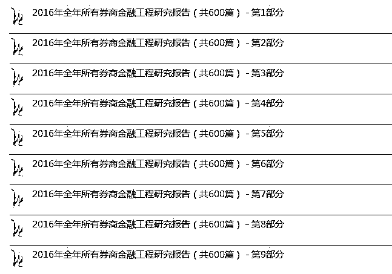
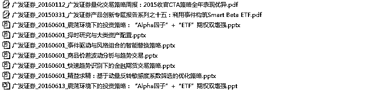

# 【干货分享】2016 年全年所有券商金融工程研究报告（共 600 篇）- 第 2、3、4 部分

> 原文：[`mp.weixin.qq.com/s?__biz=MzAxNTc0Mjg0Mg==&mid=2653284678&idx=1&sn=0c29d884ada86f565b5849057fe5cdb6&chksm=802e2b53b759a245db87fe77c211e8f987464d0d188305808b412fb2d36cbc9f4bb707fedde9&scene=27#wechat_redirect`](http://mp.weixin.qq.com/s?__biz=MzAxNTc0Mjg0Mg==&mid=2653284678&idx=1&sn=0c29d884ada86f565b5849057fe5cdb6&chksm=802e2b53b759a245db87fe77c211e8f987464d0d188305808b412fb2d36cbc9f4bb707fedde9&scene=27#wechat_redirect)

**编辑部**

微信公众号

**关键字**全网搜索

**『量化投资』：排名第一**

**『量       化』：排名第二**

**『机器学习』：排名第三**

我们会再接再厉

成为全网**优质的**金融、技术技类公众号

**昨天大家对获取研报的热情很高，对此，编辑部决定，再分享第 2、3、4 部分。其余的部分会在下周分享。**

有些人不知道**后台回复**如何操作

为大家介绍一下：

**2016 年全年所有券商金融工程研究报告（共 600 篇）**

> **编辑部特别为大家整理了 2016 年所有券商金融工程的研究报告，总计 600 多篇，分成 9 个部分推送，希望大家能有所收获。**

我们始终坚持

**不让大家像别的公众号一样**

通过朋友圈和微信群转发来获取干货

**分享就是分享**

**就应该做到无偿**

因为知识是属于共享的

我们只不过做了

搬运工

目录浏览

**第二部**

**汇集：****广发证券**

**第三部分**

**汇集：****国泰君安证券**

**第四部分**

**汇集：****国金证券****、******国信证券********、************国元证券****************、****************海通证券****************、****************华安证券********

**投稿、商业合作**

**请发邮件到：lhtzjqxx@163.com**

**关注者**

**从****1 到 10000+**

**我们每天都在进步**

听说，置顶关注我们的人都不一般

****

后台回复

**第二三四部分**

即可获取