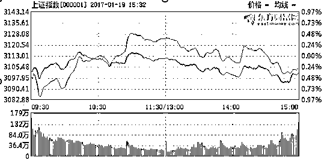
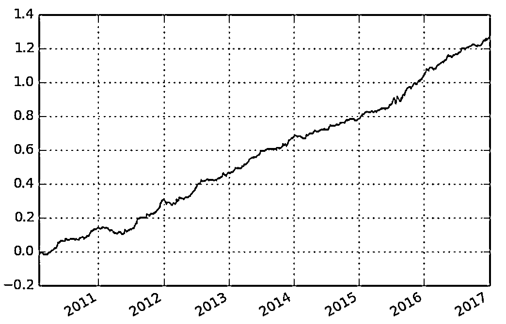

# 择时策略：在一天的何时进行交易

> 原文：[`mp.weixin.qq.com/s?__biz=MzAxNTc0Mjg0Mg==&mid=2653284661&idx=1&sn=c9ad97af8f3523545e0504ecd23a3c30&chksm=802e2b20b759a2360ae7d800ec324673dda88715b12414f381435ce105d21a372b91ac2200bc&scene=27#wechat_redirect`](http://mp.weixin.qq.com/s?__biz=MzAxNTc0Mjg0Mg==&mid=2653284661&idx=1&sn=c9ad97af8f3523545e0504ecd23a3c30&chksm=802e2b20b759a2360ae7d800ec324673dda88715b12414f381435ce105d21a372b91ac2200bc&scene=27#wechat_redirect)

**编辑部**

微信公众号

**关键字**全网搜索

**『量化投资』：排名第一**

**『量       化』：排名第二**

**『机器学习』：排名第三**

我们会再接再厉

成为全网**优质的**金融、技术技类公众号

**所有编辑部原创文章，未经授权**

**任何个人和机构不得以任何方式转载**

**原创推文预告**

● 随机森林在因子选择上的应用基于 Matlab 

● 使用 R 语言 gbm 包实现梯度提升算法

● 朴素贝叶斯对垃圾邮件进行分类基于 Python

● R 语言构建追涨杀跌量化交易模型

● R 语言量化投资常用包总结

● R 语言者如何使用 Python 在数据科学方面

● 国外书籍放送：Math、ML、DL（干货）

● 免费网络课程：ML 和 AI（干货）

● 实用指南在 R 聚类算法和评价的介绍

● 朴素贝叶斯算法在 Python 和 R 的应用

**在一天的何时进行交易**

虽然取了这样一个标题，但这篇文章实际上并不是讲一个关于选择交易时间的量化策略，而是想通过这样一个问题，去思考一些市场的规律，发现规律后看能否被我们利用形成策略。

回到标题提到的问题本身，作为一个普通的股民，实际上他的交易时间选择是非常自由的，开盘、午盘还是收盘前交易可能对于他来说并没有什么差别。比如在前一天，某股民计划第二天买入一只股票，这时候他并没有偏好说是在第二天的什么时候买入，在第二天很有可能会根据当天的市场情况做交易。当然市场中肯定存在一些有固定习惯的股民，比如他习惯在开盘时候交易或者是习惯在收盘前交易，但对于整个市场来说普通股民在一天选择交易的时间点应该是偏向均匀分布的。然而实际情况并不是这样，一般来说在开盘后和收盘前的成交量要显著高于盘中的成交量，这几乎已经是市场的一个铁的规律，应该大部分交易者都会熟知这个规律，即一天的成交量呈现 U 型分布，如下图

一类是类似于普通股民这样的交易者，他没有任何对股票未来走势预测的信息或者是能力，他对一天中在何时交易没有任何偏好。比如还有只做大类资产配置的基金，或者只是想平衡一下自己的资产组合，这类交易都没有时间上的偏好，但他们有另一个偏好就是流动性偏好，他们希望在成交量放大的时候进行交易，因为这时候市场可以提供流动性，使得他们的交易可以顺利快速进行，而不会因为自己的交易对市场产生冲击从而造成损失。

另一类交易者通过一些独有的信息可以对股票未来走势有自己的预判，这里的预判不单单是对股票未来涨跌的预判，可能是对于股票未来风险的预判，可能未来股票的波动率会增加，一些保守的策略投资者会通过预判退出，而一些激进的投资者就会通过预判买入，这并不涉及到未来股票是否上涨的问题。那么这一类交易者同时有时间上的偏好，又有流动性的偏好，他们希望在获得消息后尽快交易，然后交易时市场又有良好的流动性提供，这样自己的大额交易不会对市场造成冲击。那么有这两种交易者的存在的市场就会自然而然的形成一天成交量呈现 U 型分布的形态。

一般来说各种各样的资本市场的信息，国家相关政策等等，基本都是在非交易时间发布的，第二类交易者在盘后收集了非常多的信息之后，下一个交易日一开盘，他们就会希望进行相关交易，从而推高了一些成交量，而第一类交易者发现开盘后成交量较高，然后他们也就选择了在开盘后进行交易，从而进一步推高了成交量。收盘前成交量高也是同样的道理，第二类投资者预判收盘后可能会有不确定的信息，隔夜风险较大，他就会在收盘前平掉自己的头寸，从而推高了收盘前的成交量。久而久之的，大家就形成了进行交易一般在开盘后或者收盘前的习惯。

这里要再提一下非交易时间的一些信息，和盘中出现的一些信息这两类信息造成的效果可能是不太一样的。在非交易时间的一些信息，比如新闻什么的，它一般通过了很长时间的传播，到下一次开盘时，可能非常多的交易者都知道了这一个消息，从而在开盘后直接同时表现出来。而在盘中的一些信息，每个交易者获取的速度并不相同，最先获取到信息的交易者可能会直接大笔交易，所以盘中经常会出现一些股票突然上涨的情形，而一般来说散户并没有盘中获取额外信息的能力(在上班呢)。

说清楚了 U 型成交量分布的成因之后，我们来构建一个策略。每一只股票开盘后半小时和收盘前半小时的成交量占全天成交量的比例差别很大。那么又是什么原因导致了这种差别呢。那些开盘收盘成交量占比很大的股票的交易者中第二类交易者的占比很大，相对应的成交量占比很小的股票的交易者中第二类交易者的占比很小。也就是说成交量占比大的股票，它的相关信息被大部分交易者得知，而成交量占比小的股票，它的额外信息只被少部分交易者得知。如果一个信息被大部分人知道，那么它基本就是一个无用的信息，如果一个信息只有很少的人知道，那么它所包含的价值就很高。也就是说，成交量占比高的股票被大部分交易者所关注，而这部分股票有很大可能是被高估的，而成交量占比小的股票则相反。所以开盘收盘成交量占比低的股票要优于成交量占比高的股票。下面我们通过实验，来验证我们的猜测。

我们通过 tushare 下载每支股票历史的逐笔成交数据，虽然数据有部分的缺失，但对于研究并不影响。得到数据后，我们计算每天 09：30 到 10：00 以及 14：30 到 15：00 的成交量，再计算每天的总成交量，两者相除得到开盘收盘成交量占比。然后每天通过成交量占比对股票排序，分成 10 组，买入占比最小的一组，卖出占比最大的一组，每次持有一个月，回测时间为 2010 年初到 2017 年初，得到如下每日收益累和图，年华夏普比达到 3.6：

从图中我们可以看到在过去 7 年这一个因子都有非常好的表现。当然这只是初步构造了因子，还有很多优化的空间，比如可能成交量占比的一阶差分会是一个更好的因子，当然它也就表示了其他的含义。然后还需要分析这一因子与市值等传统因子的相关性，这里就不赘述了。

**投稿、商业合作**

**请发邮件到：lhtzjqxx@163.com**

**关注者**

**从****1 到 10000+**

**我们每天都在进步**

听说，置顶关注我们的人都不一般

****