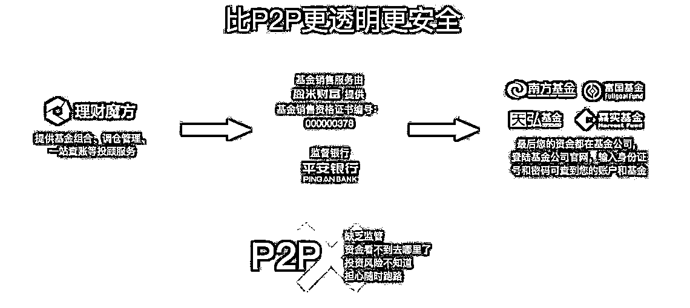
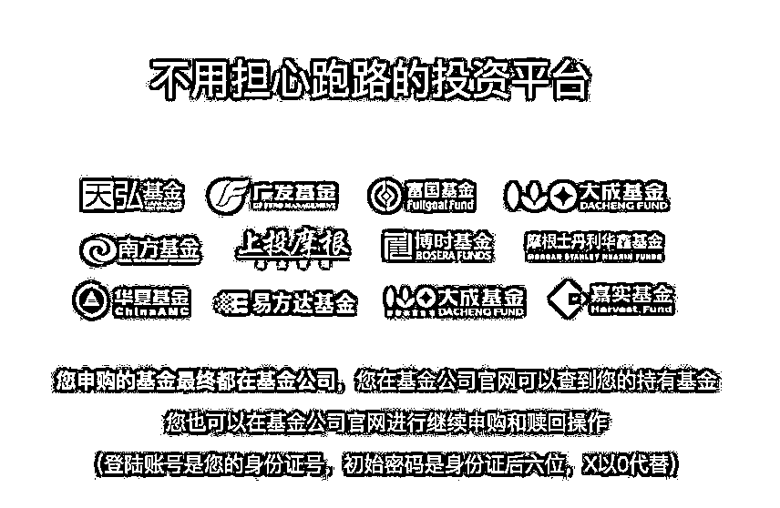
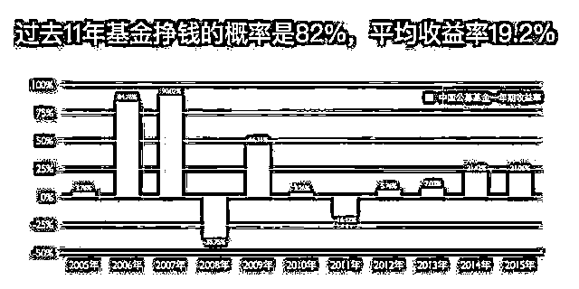
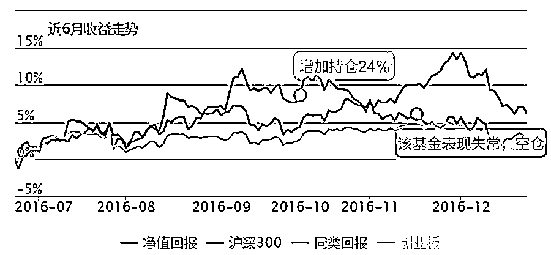
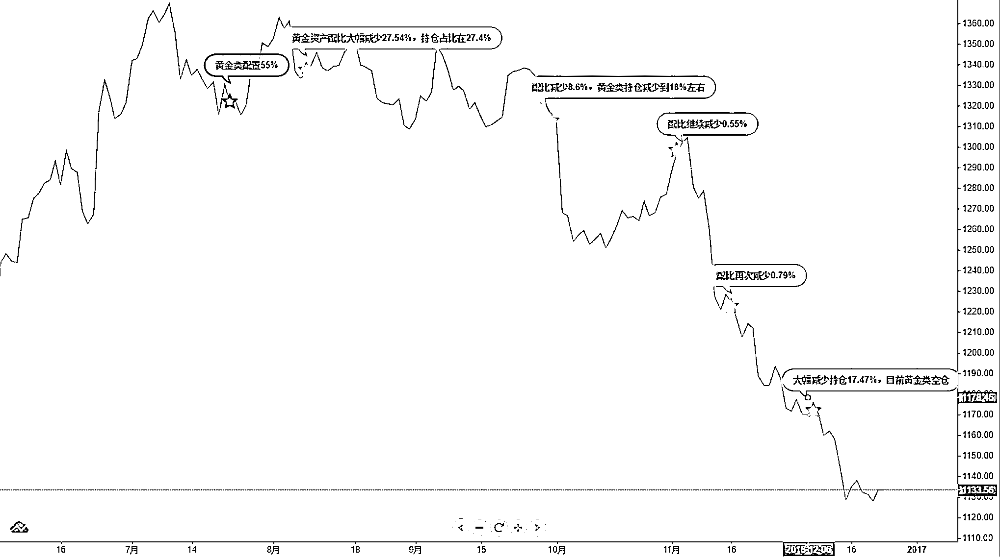
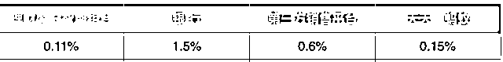

# 基金投资，怎样才能赚到钱～

> 原文：[`mp.weixin.qq.com/s?__biz=MzAxNTc0Mjg0Mg==&mid=2653284657&idx=1&sn=9f90ae6801488f973652e3c5a12efbf0&chksm=802e2b24b759a232fc3ff8a435ec7a675c10027a1fa4c35c0daaa2af30d177ccbfae1fa8d7b4&scene=27#wechat_redirect`](http://mp.weixin.qq.com/s?__biz=MzAxNTc0Mjg0Mg==&mid=2653284657&idx=1&sn=9f90ae6801488f973652e3c5a12efbf0&chksm=802e2b24b759a232fc3ff8a435ec7a675c10027a1fa4c35c0daaa2af30d177ccbfae1fa8d7b4&scene=27#wechat_redirect)

**编辑部**

微信公众号

**关键字**全网搜索

**『量化投资』：排名第一**

**『量       化』：排名第二**

**『机器学习』：排名第三**

我们会再接再厉

成为全网**优质的**金融、技术技类公众号

为什么最近理财产品和基金的联系越来越紧密了？因为江湖险恶~

“萝卜章”事件，券商、银行、保险公司纷纷躺枪。

私募债违约，阿里旗下的招财宝也受到波及。

买了 P2P 之后，是不是晚上都开始失眠了？固定收益类理财产品的好日子似乎已经一去不复返了。

基于基金呢？合规、资金安全，不用担心跑路…… 

过去投资固定收益类理财产品，是因为风险低，收益高，而现在基础改变了。转向现在投资以基金为主的浮动收益类理财产品，这是一个大的趋势。

选择自己一只只买还是雇一个投顾团队从市场上 3000 只基金里帮你定制投资策略，这是两条不一样的路。

今天公众号推荐的是**理财魔方**，属于雇个智能投顾帮你管基金的平台，看看这个平台到底如何～

 **理财魔方**  **让亏损的基民赚起来** 

**资金安全**

> 首先看一下，理财魔方智能投顾为什么会比 P2P 更安全？
> 
> 
> 
> 
> 
> **理财魔方与广发证券旗下盈米（基金销售牌照编号：000000378）合作，用户在理财魔方购买确认后，可在基金公司官网查看到自己持有的基金**
> 
> > 登陆账号为用户身份证号
> > 
> > 初始密码为身份证后六位（X 以 0 代替）
> 
> 换句话说，即使理财魔方公司倒闭了，用户的基金还在基金公司的账户上，可以继续申购和赎回！

**团队专业**

> 其次，之所以会关注它，主要因为团队的专业，体现在金融与技术两个方面：
> 
> ## 1**专业的基金专家**
> 
> 联合创始人马永谙，是业内第一个基金评价体系“银河证券基金评价体系”的设计人，也是国内第一只 MOM 和 FOF 私募基金的管理人**。**作为基金研究领域的资深专家，天然的对基金有深刻的认知，从金融领域给予专业有力的保障！理财魔方对基金的筛选与评价自然是熟门熟路，团队 DNA 里都是基金。
> 
> ## 2**强大的技术专家**
> 
> 还有一点，也就是理财魔方强调的：“通过大数据与机器学习的方式，根据基金走势数据，判断基金真实投向。”
> 
> 买基金过程中，基金的选择是比较困难的，所得的信息没法及时判断基金经理的真实投资方向，面临一些风险不可控。理财魔方做数据挖掘的负责人是清华大学博士，前英特尔数据挖掘负责人，从技术领域给予强大的保障！
> 
> 业内资深基金研究专家参与构建整个基金筛选与评价体系，清华博士、前英特尔数据挖掘负责人负责算法与数据挖掘，用魔方的原话是：“打造基金的冠军组合”。
> 
> 如果你买基金没赚钱，可以尝试  
> 
> 在参加过的一个基金论坛上，某基金知名基金经理曾说过，
> 
> 即使我的基金 2-3 年里是翻倍甚至是更多盈利的，但买这只基金的用户赔钱的概率却高达 70%至 80%，这是非常残酷的现实。
> 
> 
> 
> 图：我们看到对基金的真实评价，似乎永远是亏损的网友在骂娘……但基金真的不赚钱吗？过去 11 年间，基金只有两年是亏损的
> 
> 为什么绝大部分基金投资者没有赚到钱？
> 
> 首先，普通投资者缺乏筛选基金的能力与择时的能力，对投资基金的品种以及交易的时间点把握不准。
> 
> 其次，普通投资者容易受到情绪波动的影响，当持有的基金波动幅度超过了本身的风险承受能力，投资者往往会选择认亏离场，导致亏损的出现。
> 
> 而智能投顾，一方面，通过大数据与机器学习，有效的选择优秀的共募基金与恰当的调仓时点；另一方面，机器没有情绪，遵守纪律，避免人性的贪婪恐惧。
> 
> 所以，当你自己对基金筛选感到没有头绪、对买卖点择时无所适从的时候，可以尝试下智能投顾这种专业的管理模式的。

**产品优秀**

> ## 1**调仓逻辑清晰**
> 
> **公开调仓，逻辑清晰明确**
> 
> 理财魔方的调仓是完全公开的，即使不购买，组合的调仓操作也可以看到，作为一个基金投资的建议来参考也是很有价值的，比如：
> 
> 理财魔方 2016 年 11 月 16 日调仓：国泰中小盘成长混合 LOF 基金近期风格不稳定，理财魔方智能投资管理系统提示今日需将该基金剔除基金池
> 
> 
> 
> 图：可以发现，一个组合一定能短时间帮你赚钱？未必！但最大的作用是，规避一些你可能忽视的风险，把收益维持在一个平稳的状态，并在牛市时发力博取高收益
> 
> 理财魔方 2016 年 8 月 8 日调仓：另类资产近期存在较高风险，降低该类资产的配置比例以获得更好的投资收益。且在 9 月 30 日、11 月 2 日、11 月 16 日几次调仓过程中逐次降低黄金类资产配置，直至 12 月 7 日调仓，完全清空黄金类资产。
> 
> 
> 
> 图：在黄金一路下滑中每一次大幅减仓和大行情试探都是比较精准的（点击看大图），而从它第一次大幅减仓 27%开始到空仓，黄金已经跌了大概 15%，有效防止了资产的缩水
> 
> 官方对于其量化策略的描述也是一个“避免亏损”的投资理念：
> 
> 核心不是盲目追求高收益，而是力求控制风险，因为 50%的下跌，需要 100%的涨幅才能回本。
> 
> *   选出更优质稳定的基金
>     
>     
> *   对事中风险进行调整
>     
>     
> *   对极端下跌进行控制
>     
>     
> 
> ## 2**购买费用优化**
> 
> 把用户需要支付的费用做得很低，管理费目前也免收
> 
> 买智能投资组合，有些人忽视了费用这一块，而有些人则因为默认“费用肯定很贵”就放弃了。今天把这块可能产生的费用都一一列明一下：
> 
> *   申购基金费用（雇一个智能投顾就是帮你打理基金，基金公司收的费用是逃不掉的）
>     
>     理财魔方
>     
>     用算法优化，优先选择免申购费和赎回费的 C 类基金，把申购费率降到了目前市场最低。
>     
>     
> *   智能投顾平台收取帮你打理的费用（管理费），一般在 0.25%/年
>     
>     理财魔方
>     
>     管理费目前免收
>     
>     
> 
> 相当于免费雇佣一个专业的团队帮你管基金，而且买基金的费用也是市场上较低的。按照其中的某个组合大致算了一下申购的费用，比较如下：
> 
> 
> 
> 理财魔方目前的投资方有
> 
> 
> 
> 蝙蝠资本、松柏资本、长安私人资本，这是目前我在市场上所发现的最平易近人，对节省用户费用做得比较用心的智能投顾。

**投稿、商业合作**

**请发邮件到：lhtzjqxx@163.com**

**关注者**

**从****1 到 10000+**

**我们每天都在进步**

点击【阅读原文】体验 2000 元起投的智能组合

量化策略选基的调仓全都公开了，即使不买也可以参考

