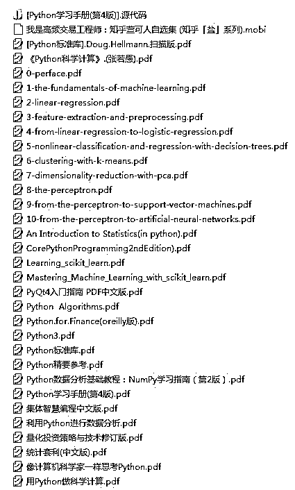

# 本周编辑部原创精品推文（附 Python 量化投资和机器学习国内外书籍，好东西哦！）

> 原文：[`mp.weixin.qq.com/s?__biz=MzAxNTc0Mjg0Mg==&mid=2653284648&idx=1&sn=c398c89c9c57ec04674310eddd06c8c3&chksm=802e2b3db759a22b571907348b9bc9b0bef66bee3f4db34fdddcc4c4c8fb77fd6f83e3e52005&scene=27#wechat_redirect`](http://mp.weixin.qq.com/s?__biz=MzAxNTc0Mjg0Mg==&mid=2653284648&idx=1&sn=c398c89c9c57ec04674310eddd06c8c3&chksm=802e2b3db759a22b571907348b9bc9b0bef66bee3f4db34fdddcc4c4c8fb77fd6f83e3e52005&scene=27#wechat_redirect)

**编辑部**

微信公众号

**关键字**全网搜索

**『量化投资』：排名第一**

**『量       化』：排名第二**

**『机器学习』：排名第三**

我们会再接再厉

成为全网**优质的**金融、技术技类公众号

**本周推文预告**

● 随机森林在因子选择上的应用基于 Matlab 

● 使用 R 语言 gbm 包实现梯度提升算法

● 朴素贝叶斯方法对垃圾邮件进行分类基于 Python

● 择时策略：在一天的何时交易

● R 语言构建追涨杀跌量化交易模型

● R 语言量化投资常用包总结

● R 语言研究者如何使用 Python 在数据科学方面

**Python 量化投资和机器学习国内外书籍放送**

本次分享书籍不算多

后续会继续分享

谢谢希望大家有所收获

我们始终坚持

不让大家

通过朋友圈和微信群转发来获取书籍

**分享就是分享**

**做到无偿**

因为知识是属于共享的

我们只不过做了

搬运工

后台回复

**Python 书籍汇总**

即可获取

**投稿、商业合作**

**请发邮件到：lhtzjqxx@163.com**

**关注者**

**从****1 到 10000+**

**我们每天都在进步**

听说，置顶关注我们的人都不一般

****