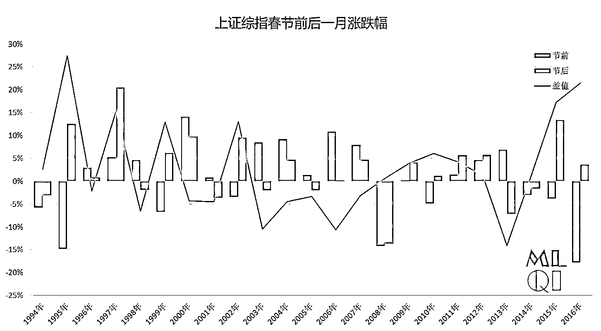

# 春节后行情走势和行业涨跌分析

> 原文：[`mp.weixin.qq.com/s?__biz=MzAxNTc0Mjg0Mg==&mid=2653284642&idx=1&sn=f5859b0ad094f2515c08fae811e03a09&chksm=802e2b37b759a2215ca639532b635e6cb60d3fa7674116e4cb434101a243ffba8f266e72f26b&scene=27#wechat_redirect`](http://mp.weixin.qq.com/s?__biz=MzAxNTc0Mjg0Mg==&mid=2653284642&idx=1&sn=f5859b0ad094f2515c08fae811e03a09&chksm=802e2b37b759a2215ca639532b635e6cb60d3fa7674116e4cb434101a243ffba8f266e72f26b&scene=27#wechat_redirect)

**编辑部**

微信公众号

**关键字**全网搜索

**『量化投资』：排名第一**

**『量       化』：排名第二**

**『机器学习』：排名第三**

我们会再接再厉

成为全网**优质的**金融、技术技类公众号

明天就开市啦，在此，祝大家在新的一年里，都有好的业绩！

自 1994 年以来，A 股市场共经历 23 个春节长假（不含 2017 年）。先以上证综指为例。

**上证综指春节前后涨跌幅 **

从上证综合指数收益角度来看，春节前后的统计结论比较显著： 

春节前后一个交易日：**1994 年**以来，**节前大概率上涨（73.91%）** ，节后不稳定；

**2006 年**以来，节前上涨的可能性较高（63.64%） ，节后大概率下跌（63.64%） ，且节前收益大概率高于节后（63.64%） 。 

春节前后一周（5 个交易日）：**1994** **年**以来，**节前节后均较大可能上涨（分别为 78.26%和 73.91%）**，且**节后涨幅大概率低于节前**；**2006 年**以来**节前节后上涨概率均较高（分别为 90.91%和 81.82%）**，节前收益大概率高于节后。 

春节前后一个月（22 个交易日）：**1994 年**以来，**节前节后上涨概率均在 60%以上；****2006 年**以来，**节后上涨概率较高（72.73%）** ，且节后涨幅大概率高于节前（72.73%） 。

**上证综指春节前后成交量变化率**

上证综指的成交量呈现出比较明显的放量缩量特征： 

春节前后一个交易日：**2006 年**以来，**节前大概率缩量**（81.82%），节后及全样本

均不稳定。 

**春节前后一周**（5 个交易日）：无论 1994 年以来还是 2006 年以来，**节前缩量、节后放量的特征比较显著**（均为 72.73%） 。 

**春节前后一个月**（22 个交易日）：**节后放量概率较高**（72.73%） 。 

**创业板指数春节前后涨跌幅 **

**从创业板指收益角度，节后一个交易日、节前一周、节后一周、节后一个月大概****率上涨**（分别为 66.67%、83.33%、83.33%和 66.67%） 。 

对比每年春节前后收益，以日和周为周期，节前涨幅大概率不如节后（日和周均为 66.67%），以月为周期，节后收益大于节前收益年份数量占比较高（66.67%） 。 

****创业板**指春节前后成交量变化率**

**从创业板成交量来看，**春节前一日、前一周成交量大概率下降**（分别为 83.33%和 66.67%） ，**节前一月成交量上涨概率为 66.67%，节后成交放量的可能性较大**（日、周、月为周期的概率分别为 83.33%、83.33%和 100%）。 **

**对上证综指、深证成指、沪深 300，中证 500 进行统计分析。**

****

### **从**品种**来看**

### **中证 500 的涨幅最大**

### **其他基本持平**

****

****

### **从**天数**来看**

### ****春节前 5 天****

### ****春节后 10-20****

### **涨幅最大**

****

****

****行业指数春节前后成交量变化率****

**统计申万行业指数 2004 年至 2016 年的行业涨跌变化。 **

****

****节前一周所有行业均大概率上涨**，其中汽车、有色金属、医药生物、电气设备、化工、综合、建筑材料、休闲服务、商业贸易、公用事业、交通运输和机械设备等 12 个行业上涨概率均在 90%以上。 **

****节后一周大部分行业上涨概率较高**，其中医药生物、综合、农林牧渔、电子和国防军工上涨概率高于 90%。 节前一个月行业上涨概率不稳定，仅有汽车、交通运输和钢铁涨幅概率达到 69.23%。 **

****节后一个月行业上涨相对较为显著**，化工、汽车、有色金属、医药生物、纺织服装和农林牧渔上涨概率在 70%以上。**

**春节前后周度效应比较明显，月度效应节后更为显著。 **

****投稿、商业合作****

****请发邮件到：lhtzjqxx@163.com****

****关注者****

****从****1 到 10000+****

****我们每天都在进步****

**听说，置顶关注我们的人都不一般**

****

********