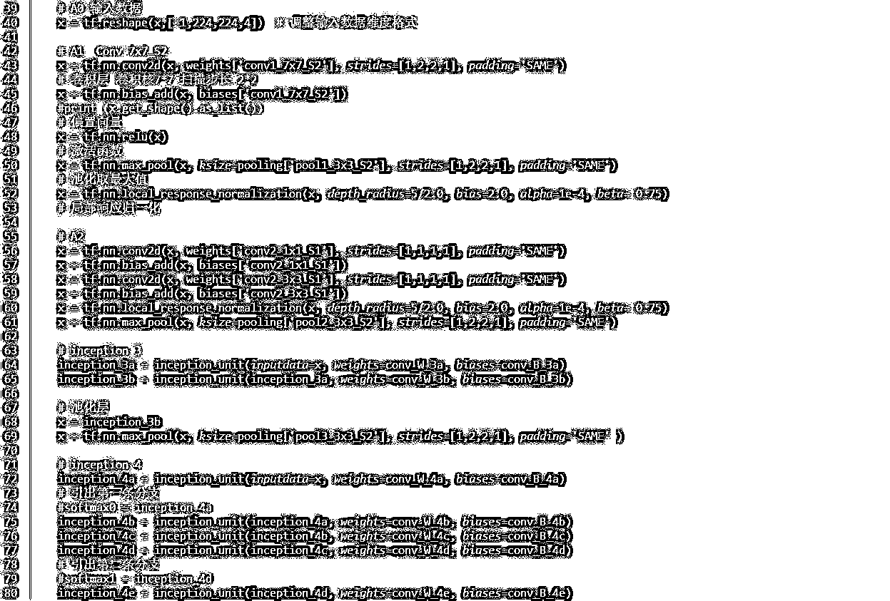
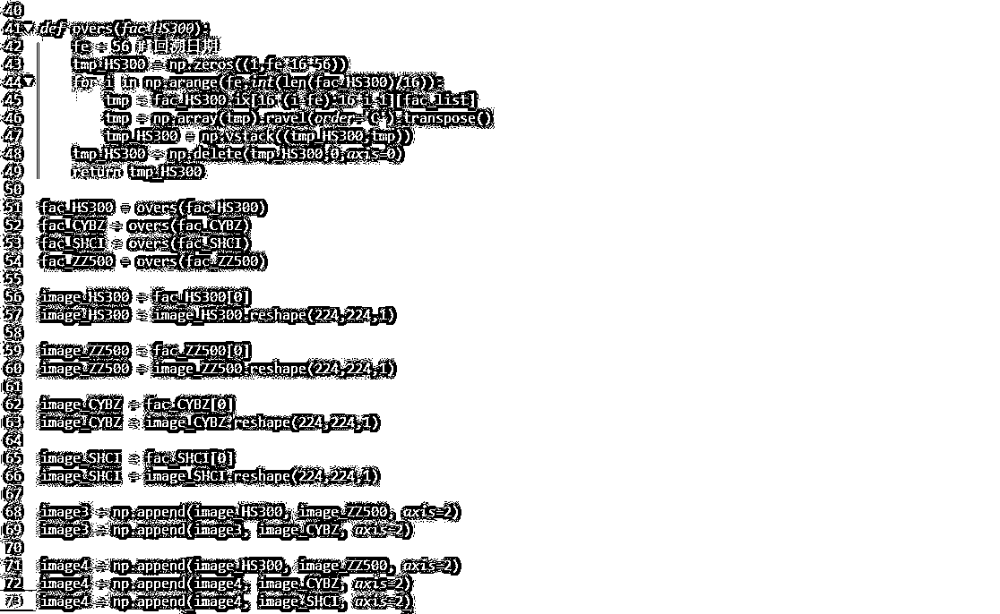

# 【独家推送】GoogLeNet 构建技术分析因子的模式识别基于 TensorFlow

> 原文：[`mp.weixin.qq.com/s?__biz=MzAxNTc0Mjg0Mg==&mid=2653284595&idx=1&sn=6439b58326185c23887ac205d84942bb&chksm=802e2ae6b759a3f08047f0ed169eecd528b733d89734cc74842f38f8f06f276d9926530931ac&scene=27#wechat_redirect`](http://mp.weixin.qq.com/s?__biz=MzAxNTc0Mjg0Mg==&mid=2653284595&idx=1&sn=6439b58326185c23887ac205d84942bb&chksm=802e2ae6b759a3f08047f0ed169eecd528b733d89734cc74842f38f8f06f276d9926530931ac&scene=27#wechat_redirect)


**编辑部**

微信公众号

**关键字**全网搜索

**『量化投资』：排名第一**

**『量       化』：排名第二**

**『机器学习』：排名第三**

我们会再接再厉

成为全网**优质的**金融、技术技类公众号

系列文章（点击即可查看）

[机器学习该如何应用到量化投资系列（一）](http://mp.weixin.qq.com/s?__biz=MzAxNTc0Mjg0Mg==&mid=2653283935&idx=1&sn=56e84e986f278403d8840387c615a2a7&chksm=802e244ab759ad5c43720a7960567d215970877250ca72534016bf53a021c73f83665068639d&scene=21#wechat_redirect)

[机器学习该如何应用到量化投资系列（二）](http://mp.weixin.qq.com/s?__biz=MzAxNTc0Mjg0Mg==&mid=2653283982&idx=1&sn=6a14e2e145d8e7db46ba64a1439e1b2f&chksm=802e249bb759ad8d436e05f51625be0f5142ab8af374ebcfad24c332efc5fd0190a8283cbdfb&scene=21#wechat_redirect)

[机器学习该如何应用到量化投资系列（三）](http://mp.weixin.qq.com/s?__biz=MzAxNTc0Mjg0Mg==&mid=2653283997&idx=1&sn=15516e5874384a1c959c9ec037926e8a&chksm=802e2488b759ad9ed6cc8c3320bed22427b26bb89aa113fa77508e931254d6c78fa745a21fbe&scene=21#wechat_redirect)

[机器学习该如何应用到量化投资系列（四）](http://mp.weixin.qq.com/s?__biz=MzAxNTc0Mjg0Mg==&mid=2653284479&idx=1&sn=19e499c32cb1ecca292ac1085de557ea&chksm=802e2a6ab759a37c2d745a875ab980318b7f75a3f581576371cb74c704d811625a7177bcab4b&scene=21#wechat_redirect)

**第一部分**

*   GoogLeNet, 2014 年 ILSVRC 挑战赛冠军,这个 model 证明了一件事：用更多的卷积，更深的层次可以得到更好的结构。（当然，它并没有证明浅的层次不能达到这样的效果）

*   通过使用 NiN（Network-in-network）结构拓宽卷积网络的宽度和深度，其中将稀疏矩阵合并成稠密矩阵的方法和路径具有相当的工程价值。

*   本帖使用这个 NiN 结构的复合滤波器对 HS300ETF 进行技术分析因子预测。并通过叠加不同指数，尝试寻找‘指数轮动’可能存在的相关关系。

### **1.1 ****LeNet-5 一种典型的卷积网络是。当年美国大多数银行用它来识别支票上面的手写数字的。**


### **1.2 NiN 结构的 Inception module, GoogleLeNet 核心卷积模块，一个拓宽宽度的滤波器 ,相当于一个高度非线性的滤波器**


### **1.3 GoogleLeNet 拓扑结构图，可以看到 GoogleLeNet 在 LeNet 网络结构上面大量使用 Inception_unit 滤波器拓宽加深 LeNet 网络，Going deeper with convolutions 论文中 Inception_unit 滤波器将稀疏矩阵合并成稠密矩阵的方法和路径具有相当的工程价值。**


**第二部分**

### GoogleLeNet 拓扑结构代码（截取部分）

*   在使用 Tensorflow 复现论文(Going deeper with convolutions)发现 SAME 算法填充（0）要比 VALID 效果好一些，很稳定的好一些。





**第三部分**

# **HS300 技术分析指标数据图像表示**

### 处理技术分析指标，生成时间序列的多因子数据,使用前 56 天数据预测后 14 天涨跌。


```py
Number of data losses 726 Ratio : 0.0467302
```

### **直观图像**

*   取某个交易日技术分析指标参数合成图片像素数据。

*   CNN 一般用来设计机器视觉，简单说就是专门处理图像和视频的，下图为按照 CV 观点来看输入的多因子数据。

*   因为前面技术分析因子进行标准化（归一化处理），这里对因子数据进行缩放和偏置。

**技术分析因子数值波动**


**多种技术分析因子数值在 Y 轴并列之后使用颜色表示因子数值大小**

****

********

********

********

********

********

### ******使用上证指数、中证 500、创业板指 叠加 HS300******

*   ****在做技术分析的时候，通常行情和单只股票走势，采用叠加噪音的方式探索是否几个指数存在可量化的关系****

*   ****这里采用多图叠加的方法添加噪音进行探索，参考 RGB 3 基色合成彩色图片****

*   ****image3 HS300 ZZ500 CYBZ****

*   ****image4 HS300 ZZ500 CYBZ SHCI****

********

********

```py
**Number of data losses 726 Ratio : 0.0467302
Number of data losses 726 Ratio : 0.0467302
Number of data losses 726 Ratio : 0.0467302
Number of data losses 726 Ratio : 0.0467302** 
```

*   ****设定使用几个指数线的 56 天技术分析因子作为训练数据，使用 CNN 网络卷积进行提取特征，下面两幅图片就是从 CV 角度看到的我们输入的多因子数据。****

********

********

********

******** 

******设置参数并训练******

********

********

```py
**CPU times: user 54min 48s, sys: 14min 59s, total: 1h 9min 47s
Wall time: 29min 19s**
```

********

********

****查看全部内容，请点击阅读原文****

******投稿、商业合作******

******请发邮件到：lhtzjqxx@163.com******

******关注者******

******从****1 到 10000+******

******我们每天都在进步******

****听说，置顶关注我们的人都不一般****

********

************