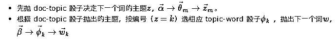

# 【原创精品】主题模型 - LDA 学习笔记（一）

> 原文：[`mp.weixin.qq.com/s?__biz=MzAxNTc0Mjg0Mg==&mid=2653284555&idx=1&sn=bb10c8d1b6c027d054f37c530b12a13f&chksm=802e2adeb759a3c8dd40b0047ea6c4997da26acb920ba5d955f36cc7bf57f692777d3ffe1a74&scene=27#wechat_redirect`](http://mp.weixin.qq.com/s?__biz=MzAxNTc0Mjg0Mg==&mid=2653284555&idx=1&sn=bb10c8d1b6c027d054f37c530b12a13f&chksm=802e2adeb759a3c8dd40b0047ea6c4997da26acb920ba5d955f36cc7bf57f692777d3ffe1a74&scene=27#wechat_redirect)

**编辑部**

微信公众号

**关键字**全网搜索

**『量化投资』：排名第一**

**『量       化』：排名第二**

**『机器学习』：排名第三**

我们会再接再厉

成为全网**优质的**金融、技术技类公众号

**本期编辑：Roy**

● 复旦大学物理学士、计算机硕士 

● 文本挖掘、机器学习、量化投资

**一、概述**

**1\. LDA 是什么？**

‍‍**主题模型（Topic Model）**

2003 年由 Blei, Ng 和 Jordan 提出的一种主题模型，可以用来分析文章的主题分布。

**概率生成模型（Probabilistic Generative Model）**

LDA 模型认为一篇文章有若干个主题。

如下图所示：每一个词 wi 来自不同的主题 zi，来自不同主题的概率不同；在每个主题 zi 下生成每个词的概率不同。所以一个词为 wi 的概率为：‍‍

LDA 的目的就是为了找出每篇文章的主题概率分布。

**例子**

有 395 篇英文新闻，假设每篇新闻都有 20 个主题（#数字是拍脑袋得的）。

这样就完成了对于文本数据的降维工作，为进一步分析做好准备。

**二、简化模型（掷骰子）**

LDA 认为一篇文章由若干主题构成，每一个词都属于某一主题。

可以用抛骰子类比写文章的过程，存在两类不同骰子：

1.  doc-topic 骰子：某篇文章对应不同主题的概率分布。

2.  topic-word 骰子：某个主题对应不同词的概率分布。

生成 N 篇文章（语料库有 V 个不同词，K 个主题）的过程：

**Step 1**：从 topic-word 坛子抽取 K 个骰子

**S****tep 2**：对于每一篇文章，抽取一个新的 doc -topic 骰子

**S****tep 3**：抛骰子决定下一个词

**三、概率表述**

**选骰子是 Dirichlet，抛骰子是 Multinomial**

真正处理文本时，为了方便处理：直接分词，不考虑顺序，用 bag-of-words 模型.

比如：抛骰子 3 次，结果是「1， 2， 1」，对应概率是 p(x1,x2,x3)= p(x1=1)p(x2=2)p(x3=1) 。

因为不考虑顺序了，对应的概率是 p(x1,x2,x3) 是多项式分布 p(x1,x2,x3)=C(3,2)p(x=1)² * C(3,1)p(x=2)。

然后在求后验分布时，分子上似然概率中的系数和分母归一常数中的系数约掉了，所以文中提到多项式分布的地方都省略掉了多项式分布系数。

**求解（Gibbs Sampling）**

‍‍我们所能观察到的只是文章 ‍‍<nobr aria-hidden="true">W，而用来生成文章的不同骰子是潜变量（latent variables）不能观测。我们所要做的是根据观测到的文章，去推测用了一个什么样的骰子。‍‍‍‍</nobr>

<nobr aria-hidden="true"></nobr>

<nobr aria-hidden="true">其中分母部分无法直接求解，需近似求解。可以用 EM、Bayesian Variance、Expectation Propagation、Gibbs Sampling 等不同的方法求解。这里介绍用 Gibbs Sampling 求解的方法。</nobr>

<nobr aria-hidden="true"></nobr>

<nobr aria-hidden="true"></nobr>

<nobr aria-hidden="true"></nobr>

 <nobr aria-hidden="true">**lda 包****（****源码****）**</nobr>

<nobr aria-hidden="true">https://github.com/ariddell/lda</nobr>

<nobr aria-hidden="true">以 5 篇文章、2 个主题的 Corpus 为例：</nobr> 

<nobr aria-hidden="true">Corpus 用 Doc-Topic Matrix 表示:</nobr>

<nobr aria-hidden="true">****</nobr>

<nobr aria-hidden="true">********</nobr>

<nobr aria-hidden="true">******五、总结******</nobr>

<nobr aria-hidden="true">****LDA 模型本身简单明了，可以通过 “选骰子 — 抛骰子” 通俗理解。实际求解过程涉及数学背景较多，如：Dirichlet 分布、共轭分布、Bayesian Inference、Gibbs Sampling 等。****</nobr>

## <nobr aria-hidden="true">******Reference******</nobr>

1.  <nobr aria-hidden="true">****Blei D M, Ng A Y, Jordan M I. Latent dirichlet allocation[J]. Journal of Machine Learning Research, 2003, 3:993-1022.****</nobr>

2.  <nobr aria-hidden="true">****D. Blei. Probabilistic topic models.  Communications of the ACM,55(4):77–84, 2012. ****</nobr>

3.  <nobr aria-hidden="true">****Griffiths, Thomas L., and Mark Steyvers. “Finding scientific topics.“ Proceedings of the National academy of Sciences 101.suppl 1 (2004): 5228-5235.****</nobr>

4.  <nobr aria-hidden="true">****《LDA 数学八卦》****</nobr>

5.  <nobr aria-hidden="true">****Heinrich G. Parameter Estimation for Text Analysis[J]. Technical Report, 2005.****</nobr>

6.  <nobr aria-hidden="true">****《Computational Statistics in Python》by Cliburn Chan from Duke****</nobr>

7.  <nobr aria-hidden="true">****LDA 作者 David M. Blei 的 lecture 视频****</nobr>

8.  <nobr aria-hidden="true">****Teh, Yee Whye, et al. “Hierarchical dirichlet processes.“ *Journal of the american statistical association* (2012).****</nobr>

<nobr aria-hidden="true">******投稿、商业合作******</nobr>

<nobr aria-hidden="true">******请发邮件到：lhtzjqxx@163.com******</nobr>

<nobr aria-hidden="true">******关注者******</nobr>

<nobr aria-hidden="true">******从****1 到 10000+******</nobr>

<nobr aria-hidden="true">******我们每天都在进步******</nobr>

<nobr aria-hidden="true">****听说，置顶关注我们的人都不一般****</nobr>

<nobr aria-hidden="true">********</nobr>

<nobr aria-hidden="true">************</nobr>