# 【Python 量化投资】拟合具有非平稳特征的神经网络对股票进行预测

> 原文：[`mp.weixin.qq.com/s?__biz=MzAxNTc0Mjg0Mg==&mid=2653284528&idx=1&sn=f67a9c0009ec0c4d737dd34ceb251e47&chksm=802e2aa5b759a3b36aec976833094c367add62bef415d6a833893ef1025852c6642e42fc0eec&scene=27#wechat_redirect`](http://mp.weixin.qq.com/s?__biz=MzAxNTc0Mjg0Mg==&mid=2653284528&idx=1&sn=f67a9c0009ec0c4d737dd34ceb251e47&chksm=802e2aa5b759a3b36aec976833094c367add62bef415d6a833893ef1025852c6642e42fc0eec&scene=27#wechat_redirect)


**编辑部**

微信公众号

**关键字**全网搜索

**『量化投资』：排名第一**

**『量       化』：排名第二**

**『机器学习』：排名第三**

我们会再接再厉

成为全网**优质的**金融、技术技类公众号

## **对建筑行业的股价进行分析预测**

### **一、建筑行业规模**

* * *

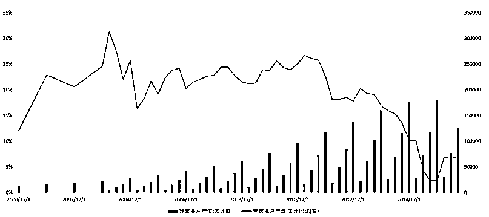

### **二、建筑行业市值前六公司**

* * *

*   **`中国建筑`** - 601668.SH

*   **`中国交建`** - 601800.SH

*   **`中国中铁`** - 601390.SH

*   **`中国铁建`** - 601186.SH

*   **`中国中冶`** - 601618.SH

*   **`中国电建`** - 601669.SH

### **三、建模计算分析**

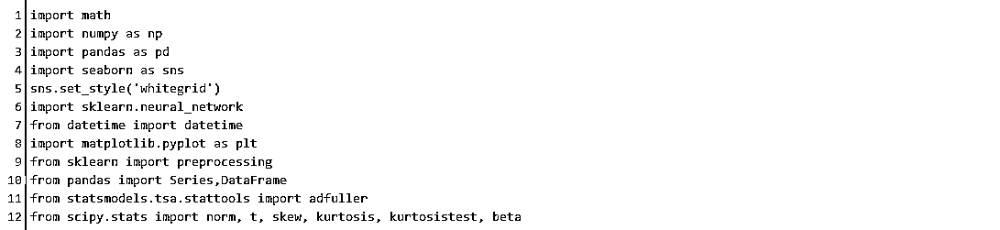

```py
对中国电建 - 601669.SH 进行预测 
```

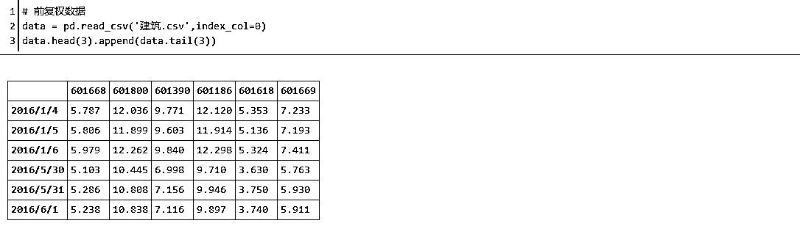

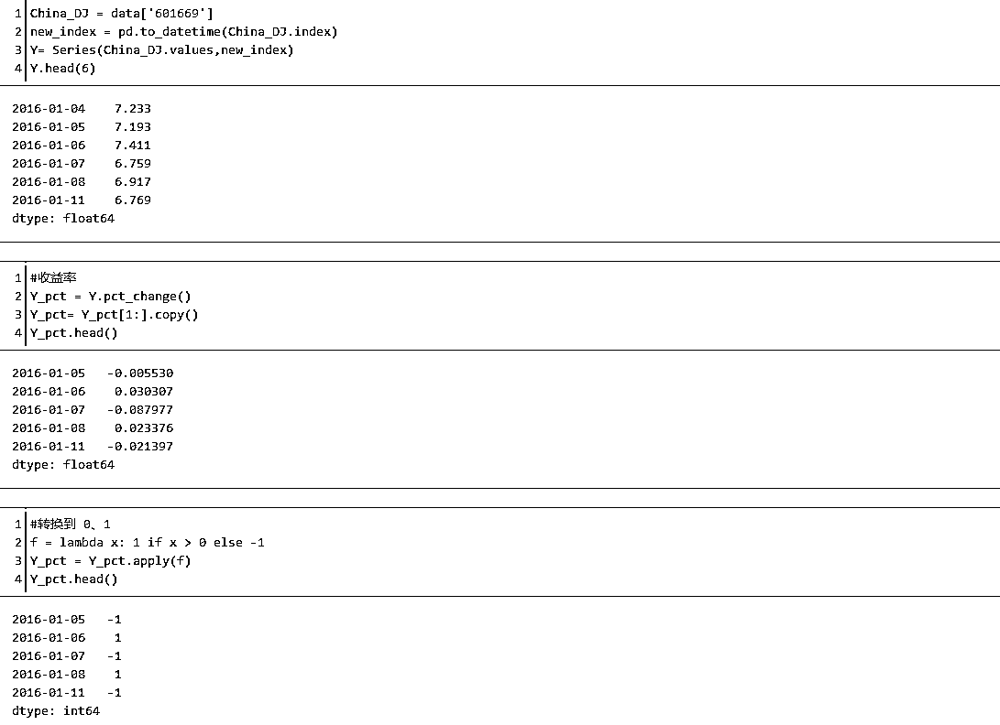

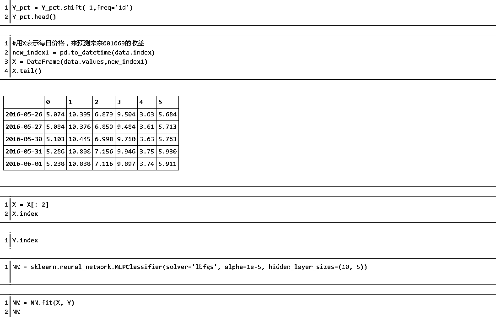

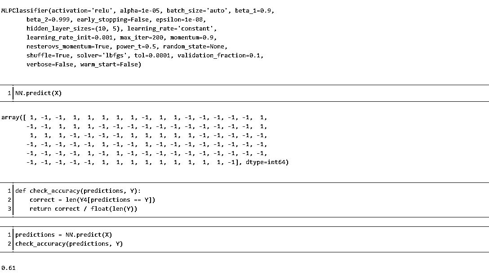

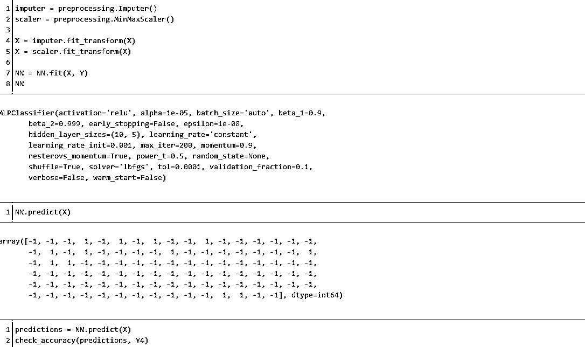

## **`0.71`**

可以预测第二天的方向超过 71%的时间。

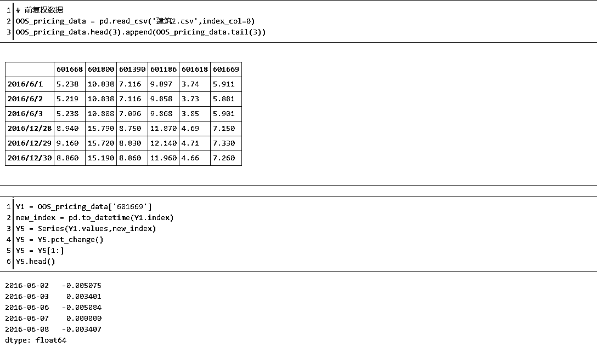

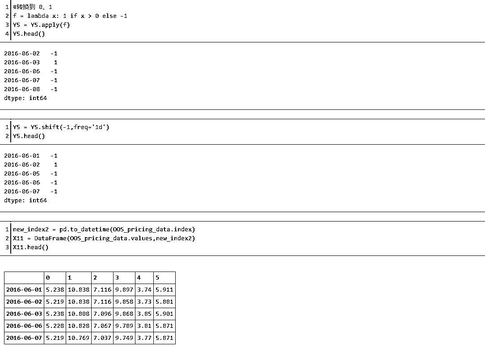

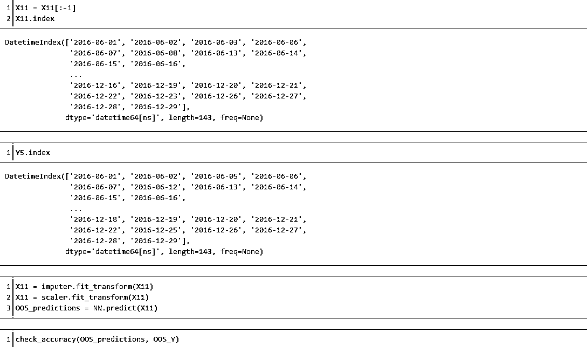

## **`0.50`**

只有 50%的准确率

```py
可能是在不同时期之间的不稳定造成的，这导致学习神经网络,很适合现在的条件训练数据,但不适合在不同条件下测试数据。也有可能是神经网络是适合噪声而没有体现出真正的信号，很难讲。 
```

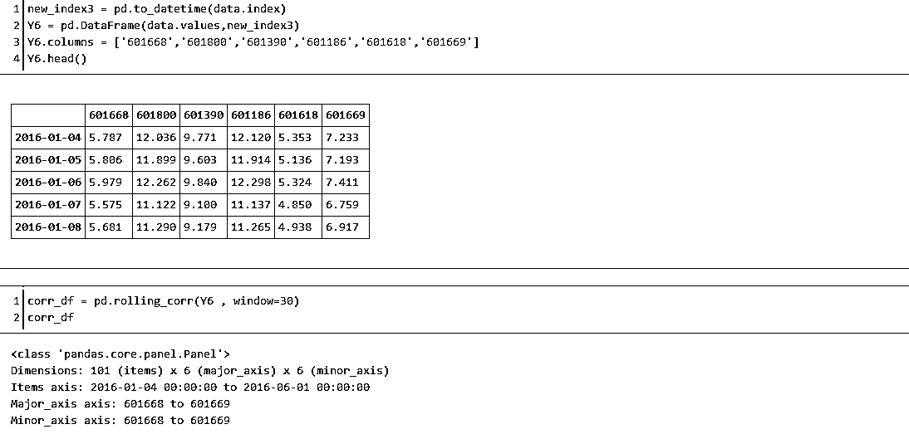

```py
看看平稳性 
```

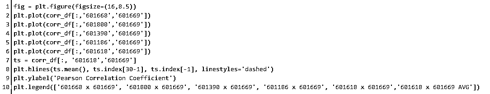

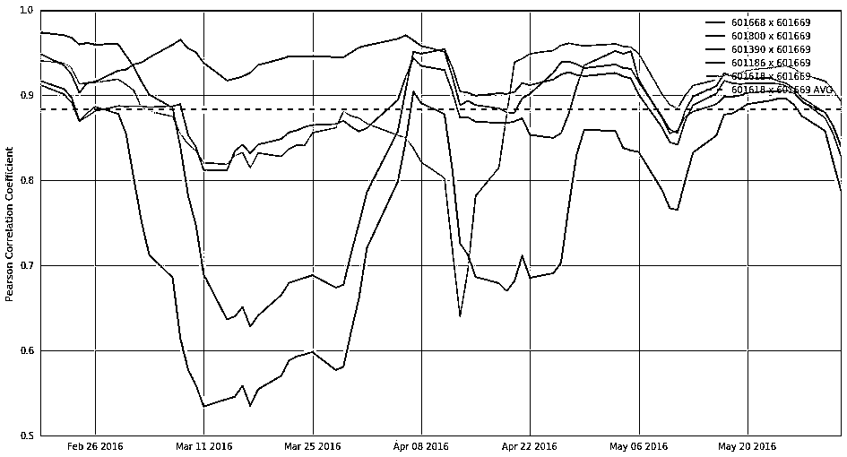

**投稿、商业合作**

**请发邮件到：lhtzjqxx@163.com**

**关注者**

**从****1 到 10000+**

**我们每天都在进步**

听说，置顶关注我们的人都不一般


****