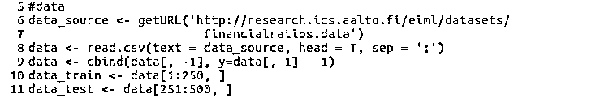

# 【R 机器学习】一种基于 K 近邻法的集成学习算法概要

> 原文：[`mp.weixin.qq.com/s?__biz=MzAxNTc0Mjg0Mg==&mid=2653284512&idx=1&sn=fbdb9faf059cc9ebc481429de94ba629&chksm=802e2ab5b759a3a3674191fb29942645773bfa1cecbdbebf001ae8a08adc38a0dd4b52f28c92&scene=27#wechat_redirect`](http://mp.weixin.qq.com/s?__biz=MzAxNTc0Mjg0Mg==&mid=2653284512&idx=1&sn=fbdb9faf059cc9ebc481429de94ba629&chksm=802e2ab5b759a3a3674191fb29942645773bfa1cecbdbebf001ae8a08adc38a0dd4b52f28c92&scene=27#wechat_redirect)

**编辑部**

微信公众号

**关键字**全网搜索

**『量化投资』：排名第一**

**『量       化』：排名第二**

**『机器学习』：排名第三**

我们会再接再厉

成为全网**优质的**金融、技术技类公众号

**编辑部** 

大家期待已久的**R 语言版块**终于和你们见面了。本期是我们 R 语言编辑部 Chen 编辑的文章。希望大家有所收获！

**1、引言**

构建量化策略，首先需要找到具有所谓 alpha 的特征量，将这些特征量输入到数学模型学习出买入或者卖出信号，然后根据一定的出场规则出场。数学模型各种各样，有诸如线性回归、logistic 回归的线性模型; 也有诸如神经网络、支持向量机等非线性模型。数学模型的目的是尽可能的将具有 alpha 的特征量准确的翻译成买入或者是卖出信号。相同的特征量，不同的模型，其翻译的精度是不一样的，所谓翻译精度不仅仅是指样本内的拟合，更重要的是样本外的预测，理论以及经验均表明，数学模型越简单，其泛化能力越强，在进行样本外预测时，精度越高。

k 近邻法是最为简单的机器学习算法之一，原理是在训练样本中选取与输入特征量最近的 k 个样本，看这些样本特征量对应的样本的大多数属于哪一类，然后就将输入特征量的类别确定为那一类。本文首先介绍一种基于 k 近邻法的集成学习模型，然后给出其在一个简单的分类问题中的表现，同时给出相应的 R 源码。

**2 、k 近邻法**

k 近邻法是一种非参数有监督学习算法，既可以用于回归，也可以用于分类。分类时，根据其 k 个近邻的训练样本的类别，通过多数表决的方式进行预测。

 

k 近邻法不具有显式学习过程，直接利用训练数据集对特征向量空间进行划分，并其作为分类的模型。影响 k 近邻法效果的基本要素有距离度量、k 值的选择、分类决策规则。

k 近邻法常用的距离度量有欧氏距离（离差平方和）、马氏距离（加权离差平方和）、曼哈顿距离（绝对离差和）、余弦距离（特征向量计算的余弦值）等。不同的距离度量对预测结果有直接影响。k 值的选择会对 k 近邻法的预测结果产生重大影响，k 值越大，模型越简单，模型拟合误差越大，当 k 值等于样本量的大小时，不管输入特征向量是什么，我们都将其类别简单的预测为多数类; k 值越小，模型越复杂，模型的拟合误差越小，此时模型对训练数据变的非常敏感，如果临近的点恰好是噪声，预测会出错，当 k 值等于 1 的时候，就是最近邻法。分类决策有很多，k 近邻法中，一般选择的规则有两种，一种是多数投票，一种是加权投票，所谓加权投票就是距离输入特征远的点所占的权重比距离近的点所占的权重小，权值总和为 。

**3、集成方法**

任何单一分类方法都可能不是最好的，k 近邻法也不例外，本文所介绍的集成技术是将众多 k 近邻法所构造出来的模型组合起来，输入量不是由单一模型预测其类别，而是通过若干 k 近邻模型通过多数投票表决方式决定输出类别。

 

**4、算法实现及相关结果**

需要指出的是，利用 k 近邻法时，本文借助的是 R 语言中的 class 包，在实现所谓的集成时，本文并不是将众多模型本身集成起来，而是将各个模型的预测结果集成起来，这样极大的简化了编程的难度。在测试单一模型效果时，本文研究了 k 值的变化（从 1 到 40）对模型预测效果的影响; 在测试集成算法效果时，本文构造子模型时抽取的是特征量的子空间样本，子空间的维度 sub_dim 会对模型的效果产生影响，另外子模型的数量也会对模型的效果产生影响，出于简化需要，模型的个数 nresample 是多少，

本文就构造几个 k 近邻模型（如 nresample=5, 那么就构造最近邻，2-nn, 3-nn, 4-nn, 5-nn 五个模型）。

首先加载本文所需要的 R 语言包：

为了说明该算法分类效果，本文用一个机器学习数据集做测试，选择前 250 个样本作为训练集，剩下样本作为测试集。该数据地址：http://research.ics.aalto.fi/eiml/datasets/financialratios.data

k 近邻法在 R 语言上的包是 class，我们加载过后，用里面的 knn()函数，下面给出的是经典的单一 k 近邻法模型在预测时的代码及相关结果。  

 

k 近邻法是一种比较稳定的算法，当训练集给定的时候，测试集的预测结果唯一确定，因此，精度不需要程序运行多次再求平均。这里给出的是不同的 k 值对 k 近邻法的影响效果。

 

在实现集成学习的时候，我们的表决规则是简单的多数投票表决，下面给出的是在 k 近邻法基础上实现的集成算法。

构造集成学习的子模型的时候，子空间的维度会对模型的预测效果产生影响，另外，该集成学习算法每次随机产生子空间，为了避免随机因素影响，在每个子空间维度，重复 20 次，对精度进行平均处理。（需要指出的是，此时固定子模型个数为 ）。

 

下面给出的是不同的子空间维度对集成模型精度影响。 

 

构造集成学习算法时，子模型的个数会对模型效果产生影响，基于和上面一样的因素，针对每一个模型个数上，同样重复 20 次，对精度进行平均处理。（此时固定子模型维度为 20）

下面给出的是不同的自模型个数对模型效果的影响。

 

从上面的结果可以看出，子空间的维度以及子模型的个数均会对模型的效果产生影响，于是索性给出一个三维图，同时给出子模型的维度以及子模型的个数对模型效果的影响。

 

下面便是子空间维度以及子模型个数对本文介绍的集成学习算法的影响效果。

 

**5、结论**

比较上面经典的 k 近邻法与本文介绍的集成学习算法对同一个分类数据分类预测效果，不难发现，集成学习算法的预测效果远远优于经典的 k 近邻法。集成学习算法受到多个参数（不仅仅是本文所列的两个参数：子空间的维度及子模型的个数）影响，或许通过优化算法，寻找一个较为合适的参数组合，得到的便是一个简单且有效的分类算法。

**6、参考文献**

1 统计学习方法

2 The Art of R Programming

3 Ensemble KNNs for Bankruptcy Prediction

**投稿、商业合作**

**请发邮件到：lhtzjqxx@163.com**

**关注者**

**从****1 到 10000+**

**我们每天都在进步**

听说，置顶关注我们的人都不一般

****