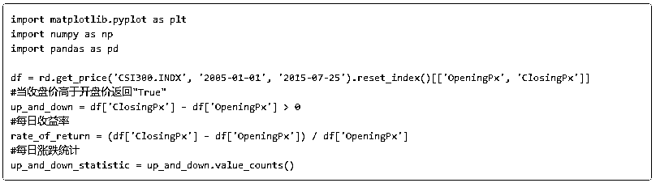
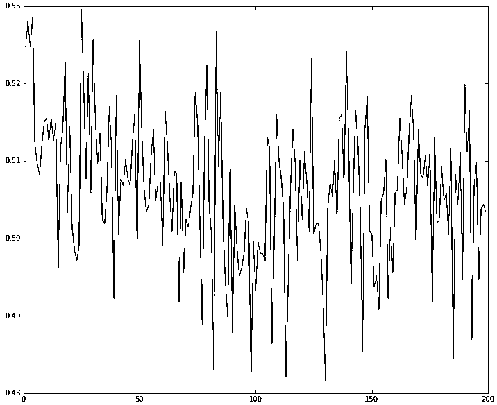

# 【独家发送】机器学习该如何应用到量化投资系列（四）——关于涨跌的思考基于 Python

> 原文：[`mp.weixin.qq.com/s?__biz=MzAxNTc0Mjg0Mg==&mid=2653284479&idx=1&sn=19e499c32cb1ecca292ac1085de557ea&chksm=802e2a6ab759a37c2d745a875ab980318b7f75a3f581576371cb74c704d811625a7177bcab4b&scene=27#wechat_redirect`](http://mp.weixin.qq.com/s?__biz=MzAxNTc0Mjg0Mg==&mid=2653284479&idx=1&sn=19e499c32cb1ecca292ac1085de557ea&chksm=802e2a6ab759a37c2d745a875ab980318b7f75a3f581576371cb74c704d811625a7177bcab4b&scene=27#wechat_redirect)

**编辑部**

微信公众号

**关键字**全网搜索

**『量化投资』：排名第一**

**『量       化』：排名第二**

**『机器学习』：排名第三**

我们会再接再厉

成为全网**优质的**金融、技术技类公众号

系列文章（点击即可查看）

[机器学习该如何应用到量化投资系列（一）](http://mp.weixin.qq.com/s?__biz=MzAxNTc0Mjg0Mg==&mid=2653283935&idx=1&sn=56e84e986f278403d8840387c615a2a7&chksm=802e244ab759ad5c43720a7960567d215970877250ca72534016bf53a021c73f83665068639d&scene=21#wechat_redirect)

[机器学习该如何应用到量化投资系列（二）](http://mp.weixin.qq.com/s?__biz=MzAxNTc0Mjg0Mg==&mid=2653283982&idx=1&sn=6a14e2e145d8e7db46ba64a1439e1b2f&chksm=802e249bb759ad8d436e05f51625be0f5142ab8af374ebcfad24c332efc5fd0190a8283cbdfb&scene=21#wechat_redirect)

[机器学习该如何应用到量化投资系列（三）](http://mp.weixin.qq.com/s?__biz=MzAxNTc0Mjg0Mg==&mid=2653283997&idx=1&sn=15516e5874384a1c959c9ec037926e8a&chksm=802e2488b759ad9ed6cc8c3320bed22427b26bb89aa113fa77508e931254d6c78fa745a21fbe&scene=21#wechat_redirect)

**目录**

⊙机器学习 & scikit-learn 简介

⊙HS300 历史数据特征一览

⊙基于历史涨跌的机器学习预测模型构建字

## **机器学习 & scikit-learn 简介**

简单说：机器学习算法是一类从数据中自动分析获得规律，并利用规律对未知数据进行预测的算法。用一张图说明它所包含的内容：

 

我们把目光集中到上图中的有监督学习，它是指数据中包括了我们想预测的属性，有监督学习有以下两类：

*   分类(Classification):样本属于两个或多个类别，我们希望通过从已标记类别的数据学习，来预测未标记数据的分类。例如，识别手写数字就是一个分类问题，其目标是将每个输入向量对应到有穷的数字类别。从另一种角度来思考，分类是一种有监督学习的离散（相对于连续）形式，对于 n 个样本，一方有对应的有限个类别数量，另一方则试图标记样本并分配到正确的类别。

*   回归(Regression):如果希望的输出是一个或多个连续的变量，那么这项任务被称作回归，比如用年龄和体重的函数来预测三文鱼的长度。

之前对这块没啥接触的伙伴，Andrew Ng 的课是不错的入门选择，另外这里还有一份关于它的笔记。

·········································································

**scikit-learn**是一个基于 NumPy、SciPy、Matplotlib 的机器学习包，主要涵盖了分类、回归和聚类等机器学习算法，例如 knn、SVM、逻辑回归、朴素贝叶斯、随机森林、k-means 等等，简言之：是一只强大的轮子。官网有个很好耍的例子：安德森鸢尾花品种亚属预测。

我们有一百五十个鸢尾花的一些尺寸观测值：萼片长度、宽度，花瓣长度和宽度。还有它们的亚属：山鸢尾（Iris setosa）、变色鸢尾（Iris versicolor）和维吉尼亚鸢尾（Iris virginica）。我们使用这些数据，从中学习并预测一个新的数据。在 scikit-learn 中，通过创建一个估计器(estimator)从已经存在的数据学习，并且调用它的 fit(X,Y)方法。代码如下：

 

## **HS300 历史数据特征一览**

**** 

输出每日涨跌统计：

> True 1379
> False 1185
> dtype: int64

可见过去十年中，有 1379 个交易日是上涨的，而 1185 个交易日下跌。画个图对比下：

 从图来看差距还是很明显，看来如果心情以每日涨跌来决定的话，快乐的时光还是更多的，真是 A 股的正能量。

 进而统计每日收益率的特征：

可以看到过去 2000 多个交易日中，沪深 300 单日涨幅最大为 8.5 个点（大奇迹日），单日跌幅最大为 9.5 个点（大盘跌停）。

 

曲线以零为轴上下震荡，可以看到曲线有两大宽幅波动的区间，一个是 07 年的牛市，另外一个，就是我们现在这个渐行渐远的......似乎开始向 0 轴收敛的......虽然宽幅波动这意味着风险增强，但同时也诉说着交易市场的活跃，宽幅波动的开端暗示着牛市脚步的靠近，末端预示着牛儿的即将远行。

根据每日收益率的历史数据还可进一步绘制频率分布直方图并使用 Kernel Density Estimate 对数据进行拟合：

是一个标准正态分布，可是如果仔细瞅瞅你会发现，涨跌幅靠近零轴，涨强跌弱；而涨跌幅远离零轴的位置，跌强涨弱。也就是，微涨与微跌，微涨的情况更为显著，大涨与大跌，大跌分布更为明显。

## **基于历史涨跌的机器学习预测模型构建**

上面介绍了机器学习的基本概念、scikit-learn 的使用以及我们的数据——HS300 指数数据的特征及分布，下面正式进入机器学习实战中。讨论的问题主要有三点：

*   机器学习估计器的选择，即我们使用何种算法进行我们的预测。

*   训练集样本数量的选择，即我们每次预测结果之前使用多少条训练集合的样本。

*   涨跌时间窗口的选择，即我们每个样本中的特征个数，我们训练集每个单元包含连续多少个交易日的涨跌。

**机器学习估计器的选择**

事实上，机器学习应用中一个很棘手的问题就是根据自己问题的实际找到一个合适的估计器，不同的估计器适合于不同类型的数据以及研究的对象，下面这张图给出了一个粗暴的引导：

 

按图索骥，把目光聚焦到图的左上角，最终选择的结果为：EnsembleClassifiers、LinearSVC、KNeighborsClassifier.另外 JMLR 这儿有篇神奇的文章： Do we Need Hundreds of Classifiers to Solve Real World Classification Problems?，文章测试了 179 种分类模型在 UCI 所有的 121 个数据上的性能，发现**Random Forests** 和 **SVM** **性能最好**。为此，我们的 EnsembleClassifiers 选择 RandomForestClassifier，即我们最终想在 RandomForestClassifier、LinearSVC、KNeighborsClassifier 中比较比较。

将 CSI300 数据与另外 15 只随机选择的股票，保证相同的训练集样本数量与时间窗口的情况下，分别使用 RandomForestClassifier、LinearSVC、KNeighborsClassifier 这三种估计器进行学习，与此同时通过计算预测的胜率来比较各自的表现。

 

可以看出，KNeighborsClassifier 表现明显逊于 RandomForestClassifier、LinearSVC，它的波动较大且胜率与另外两者比也不理想。下面就使用 RandomForestClassifier 作为估计器做测试。

### **训练集样本数量的选择**

训练集样本数量一定程度制约了预测结果的准确性，理想情况下我当然希望每次做预测的样本数量越多越好，但是你知道理想很骨感的，训练集样本数量一方面受实际总的数据量限制，另外，计算的资源与时间也是制约的一个因素。我们最终要形成某种程度的妥协，即保证相当程度的预测效果下选择最小的训练集样本数量。于是我们计算样本数从 1~300 范围内的胜率，有了下面的代码：

 

可以看出，控制其它条件不变的前提下，随着样本数量的增多，胜率逐步提高结果更为稳定并且最后维持在 0.52~0.53 左右波动，为了节约计算资源以及考虑到历史数据的总量，选择 100 个训练集样本数是较为合理的。  

### **涨跌时间窗口的选择**

一个共同点是：每次曲线的开端都会存在倒塌式下滑，而后稳定震荡于 0.5 扔硬币的概率左右。也就是说，动量是存在的，只不过很小（结合前面两节的试验结果其期望处于 0.53 这个位置），且时间窗口很短，超出这个时间窗口，预测问题就转化为扔硬币问题。

**总结**

上文讨论了三个变量对预测结果的影响，结果并不满意，一方面 daybar 的数据量局限，一方面，总会有没注意到的细节且训练数据的维度较低。但是这个探索路途很有意思。后续还可以有很多可以扩展尝试的地方，比如把涨与跌分类为大涨大跌小涨小跌，比如再把交易量的数据加入训练集。 

话说细分涨跌的代码分享如下：

**感谢米筐(ricequant)技术支持与商业合作**

**** 

源代码请点击

**阅读原文**

**投稿、商业合作**

**请发邮件到：lhtzjqxx@163.com**

**关注者**

**从****1 到 10000+**

**我们每天都在进步**

听说，置顶关注我们的人都不一般

****