# 【Python 量化投资】基于网格优化、遗传算法对 CTA 策略进行参数优化

> 原文：[`mp.weixin.qq.com/s?__biz=MzAxNTc0Mjg0Mg==&mid=2653284456&idx=1&sn=97cc79b063658038edf7bb133f50019c&chksm=802e2a7db759a36b5ce24873fc97f3042d9cbd2ea44721681cebe4c5bdbc95db01c58f685746&scene=27#wechat_redirect`](http://mp.weixin.qq.com/s?__biz=MzAxNTc0Mjg0Mg==&mid=2653284456&idx=1&sn=97cc79b063658038edf7bb133f50019c&chksm=802e2a7db759a36b5ce24873fc97f3042d9cbd2ea44721681cebe4c5bdbc95db01c58f685746&scene=27#wechat_redirect)

**编辑部**

微信公众号

**关键字**全网搜索

**『量化投资』：排名第一**

**『量       化』：排名第二**

**『机器学习』：排名第三**

我们会再接再厉

成为全网**优质的**科技文公众号

**投资策略**

## **基于指数移动平均线的交易系统**

*   多头开仓条件：短期均线上穿长期均线同时长期均线大于更长期均线的值

*   空头开仓条件：短期均线下穿长期均线同时长期均线小于更长期均线的值

为了达到分散风险的目的，选取价格走势相关性较小的品种，本文将标的池选为 RBM0, CUM0, RMM0, SRM0 等主力合约。获取 2014 年 1 月 1 日止 2014 年 12 月 31 日这些合约的日行情。

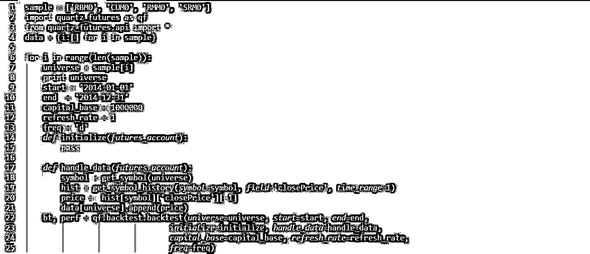

**标的之间的相关系数矩阵**

**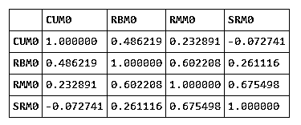** 

**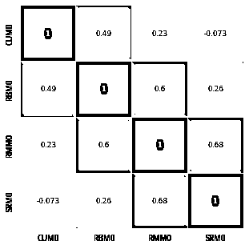**

**参数优化**

1.  网格优化
    那么参数设为多少合适？指数移动平均线交易系统涉及到三个参数，短周期，长周期，更长的周期。下面我们设置为更长的周期为 25，来对短周期和长周期进行网格化的遍历，设定短周期范围为 5 至 10，长周期范围为 15-25。

2.  遗传算法
    通过机器学习的方法来进行参数优化求解。

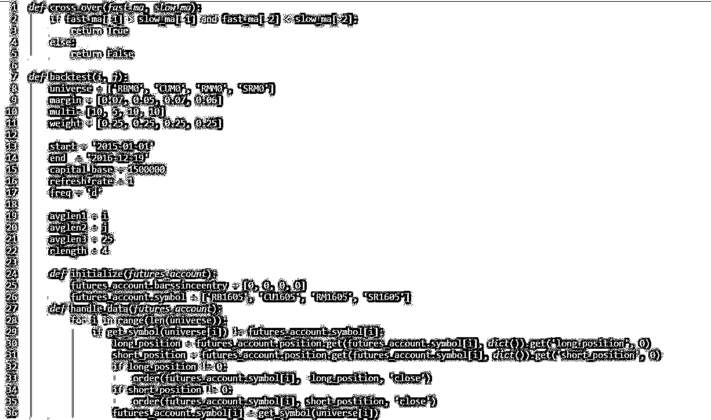

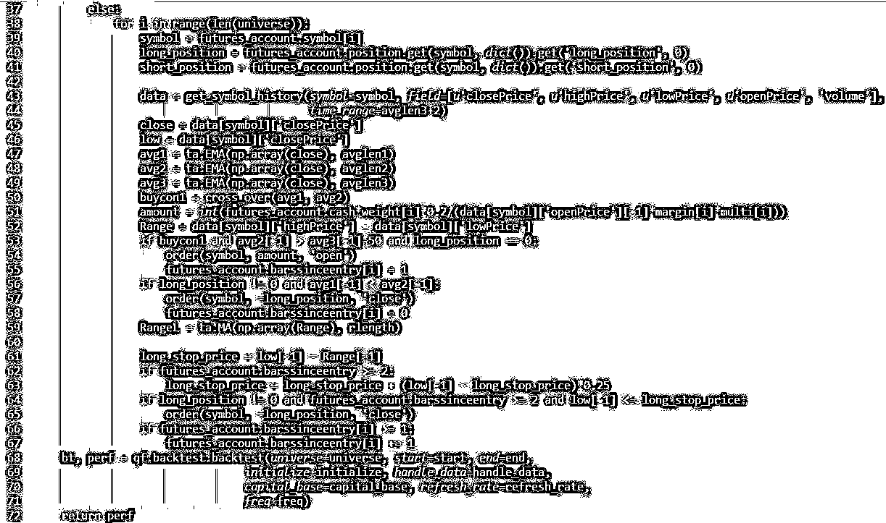

**网格算法**

**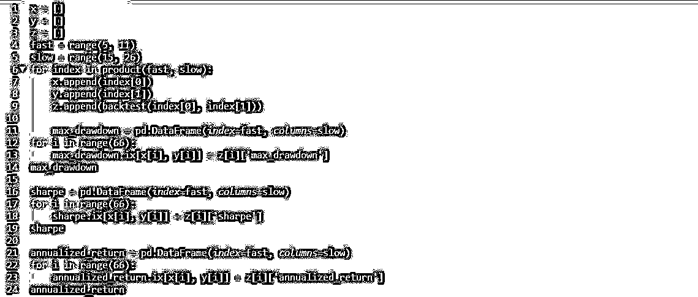** 

**max_drawdown**

**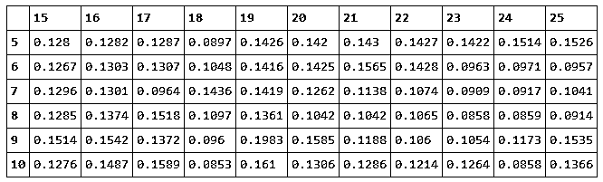** 

**sharpe**

**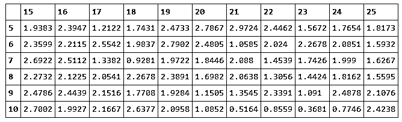** 

**annualized_return**

**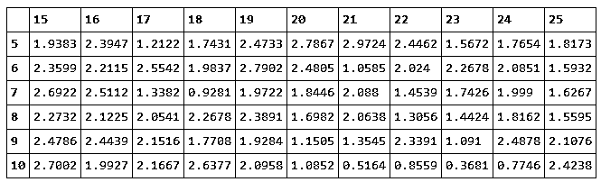** 

最后本文选择了 5 日短线，20 日长线来作为回测的参数。下面画出其累计收益率的走势，以及具体风险指标。

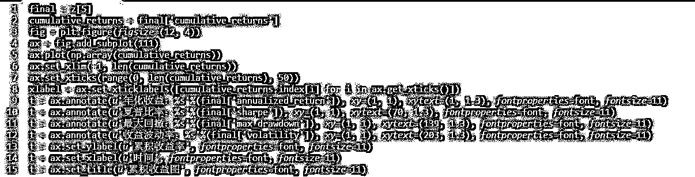 

**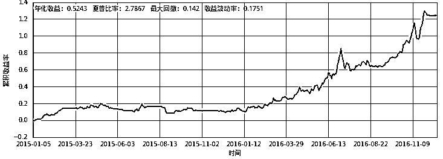** 

****遗传算法****

那么有没有不遍历的方法进行参数优化？本文以机器学习的遗传算法为例，旨在提供一个思路，具体效果可能并没有那么理想，而且容易陷入局部最优解，后续还将多加调整。

**遗传算法介绍**

遗传算法是通过模拟大自然中生物进化的历程，来解决问题的。大自然中一个种群经历过若干代的自然选择后，剩下的种群必定是适应环境的。把一个问题所有的解看做一个种群，经历过若干次的自然选择以后，剩下的解中是有问题的最优解的。当然，只能说有最优解的概率很大。

`几点说明`

1.  **编码方式**：我们考虑两个参数，短周期与长周期。短周期的范围为[5，10]，长周期范围为[15，25]。采用普通的二进制编码，码长为 6 位。

2.  **解码方式**：对于 6 位的二进制编码可以表示[0，63]内的任意正整数，所以还需构造映射进行转换至相应的区间。

3.  **适应度函数**：这里的适应度函数即回测，函数的因变量为策略的年化收益率

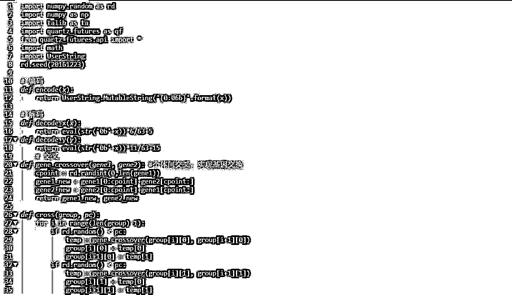 

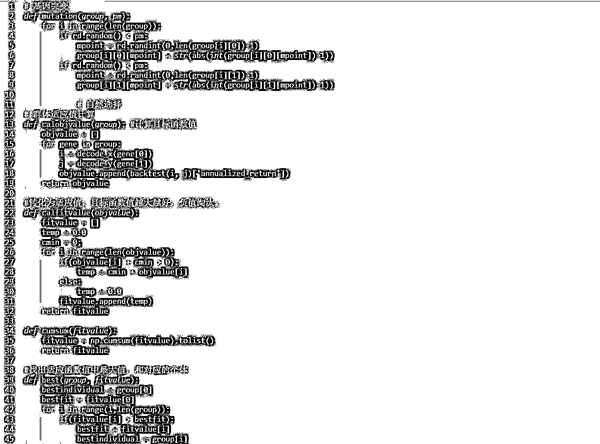

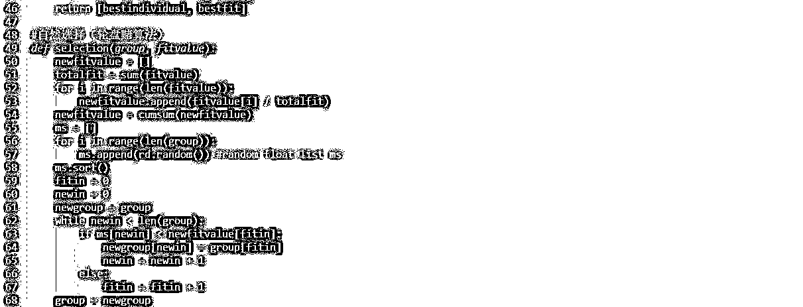

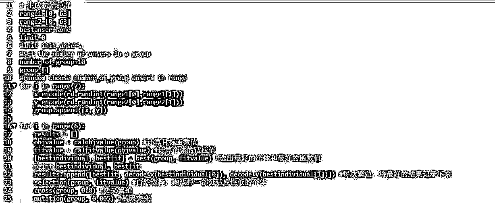

['000000', '101011']  0.5451 

['000010', '101101']  0.5451 

['000010', '000010']  0.5451 

['000000', '000100']  0.5451

可以看到 6 次繁衍后，遗传算法最后也收敛到了最优解上。

**感谢优矿技术支持与商业合作**

源代码请点击

**阅读原文**

**投稿、商业合作**

**请发邮件到：lhtzjqxx@163.com**

**关注者**

**从****1 到 10000+**

**我们每天都在进步**

听说，置顶关注我们的人都不一般

****