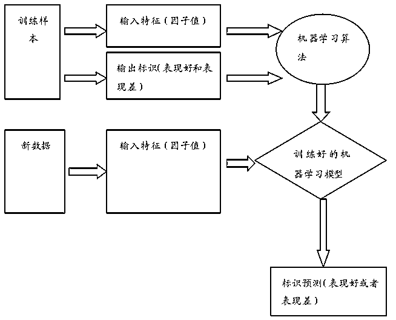
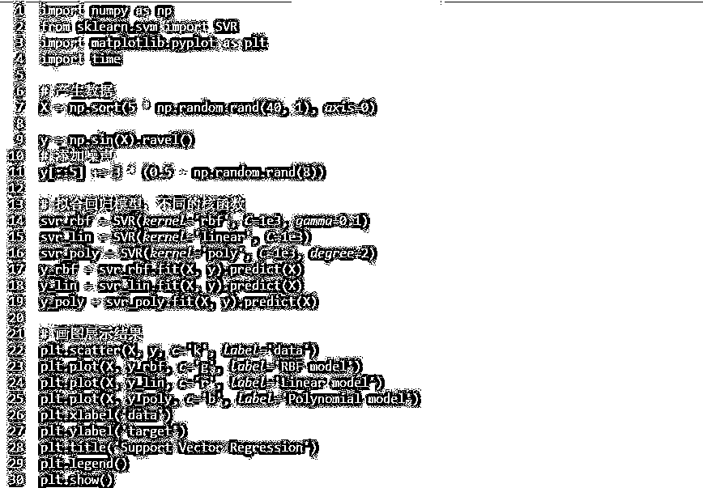
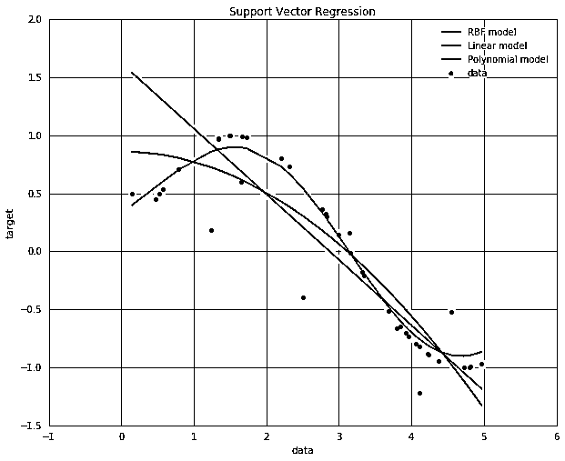
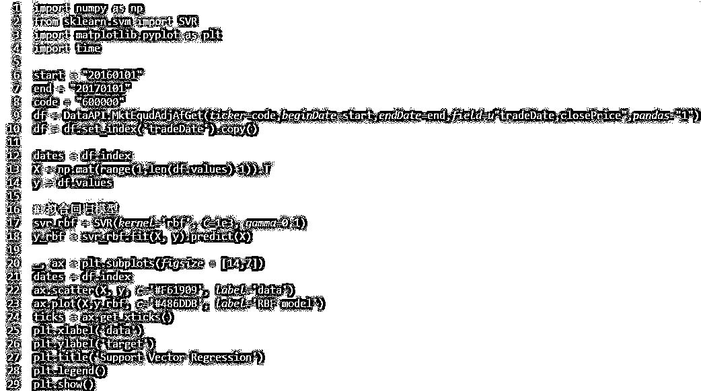
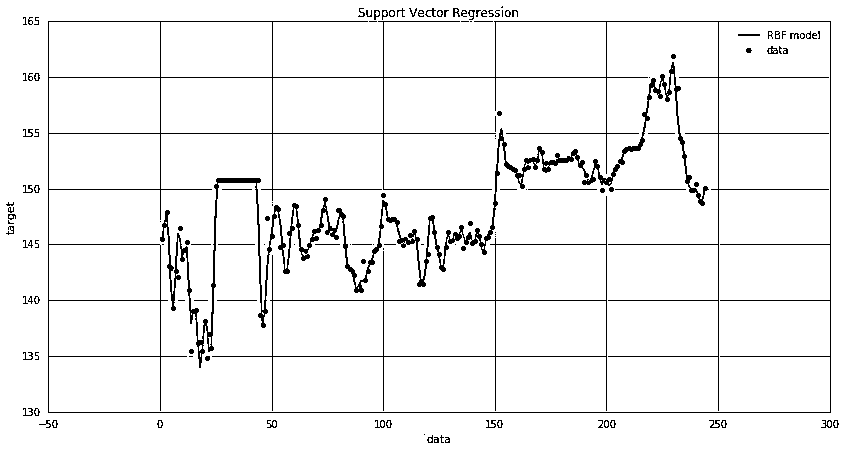
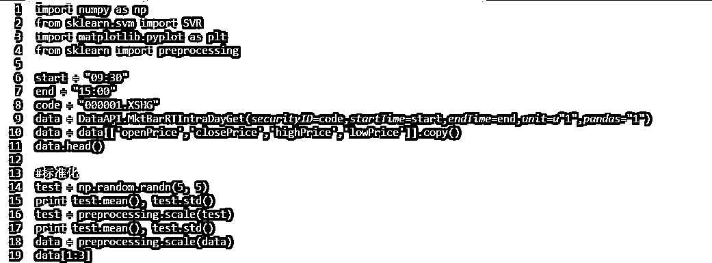
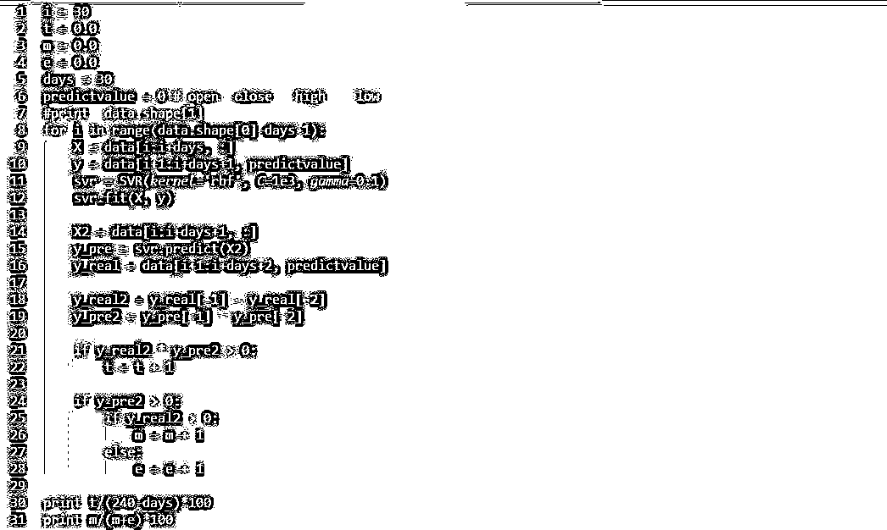
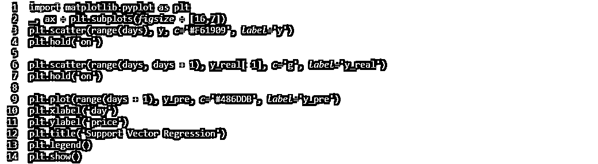
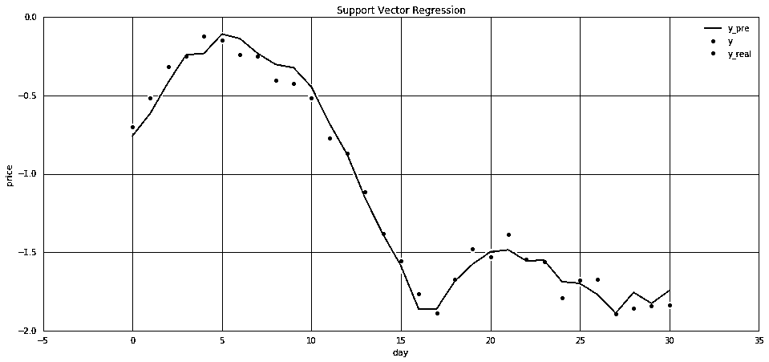

# 【Python 量化投资】系列之 SVR 预测第二天开盘趋势和股价的正负统计分析（附代码）

> 原文：[`mp.weixin.qq.com/s?__biz=MzAxNTc0Mjg0Mg==&mid=2653284430&idx=1&sn=e54b370a96f11c87eab44fb2cfcaae6e&chksm=802e2a5bb759a34d910976b7b494eae954da9c7a5568c013af97f831563a0d01aca79619c75f&scene=27#wechat_redirect`](http://mp.weixin.qq.com/s?__biz=MzAxNTc0Mjg0Mg==&mid=2653284430&idx=1&sn=e54b370a96f11c87eab44fb2cfcaae6e&chksm=802e2a5bb759a34d910976b7b494eae954da9c7a5568c013af97f831563a0d01aca79619c75f&scene=27#wechat_redirect)

**本期导读**

⊙ML、SVM 介绍

⊙股价的正负统计分析

⊙预测第二天开盘趋势

机器学习方法是计算机科学的一个分支，它借助于计算机算法，对数据进行分析后，实现模式识别，进而实现对未来数据的预测。

机器学习方法可以分为以下几个类别：

> #### **1.监督学习：**

训练的输出分类是预先设定好的，根据输入和输出，算法的目标在于寻找其中的对应函数。

> #### **2.无监督学习：**

训练的输出分类是预先不知道的。算法的目标在于发现数据中的结构，如聚类分析。

> #### **3.半监督学习：**

介于监督学习和无监督学习之间。

> #### **4.增强学习：**

算法通过执行一系列的动作，影响环境中的可观察变量，从而得到环境对动作反应的规律。最后根据这个规律，判断该采取何种行动以最大化某种回报。

监督式学习是机器学习的一个分支，可以通过训练样本而建立起一个输入和输出之间的函数，并以此对新的事件进行预测。

#### 典型的监督学习流程如下：

 

#### **支持向量机**

是监督学习中一种常用的学习方法。

支持向量机（ Support Vector Machines SVM ）是一种比较好的实现了结构风险最小化思想的方法。它的机器学习策略是结构风险最小化原则 为了最小化期望风险，应同时最小化经验风险和置信范围）。具体就不详细介绍了，百度有很多资料。

http://scikit-learn.org/stable/modules/svm.html#svm 中是 SVM 函数和简单介绍。

from sklearn.svm import SVR 可以构造支持向量回归（Support Vector Regression）模型

from sklearn.svm import SVC 可以用于分类（Support Vector Classification）

Support Vector Regression 官网的一个简单例子。

http://scikit-learn.org/stable/auto_examples/svm/plot_svm_regression.html#example-svm-plot-svm-regression-py

从回归的角度，可以根据之前的历史数据，预测下一个时间点的股价。

分类的角度，可以根据历史数据，预测下一个时间点股价的正负。

下面对股票数据进行回归建模。

 

 

#### **特征选择**

基本面因子：PE，PB，ROE 等

技术指标因子：RSI、KDJ、MA、MACD 等

蜡烛图形态因子：三乌鸦、锤子线等

#### **输出**

股价

股价涨跌分类

未来一段时间收益率

#### **利用非监督学习甚至深度学习找到特征**

比如找到大涨的股票，然后看大涨前一段时间的形态有没有相似的，利用非监督学习的方法。显然，这样的关系可能不是那么明显地存在于股票的价格中，可能存在于收益曲线中或者方差曲线中，甚至更高复杂度的统计量中。深度学习提供了将原数据投影到另一个特征空间中的方法，而且是高度非线性的。那么，原数据中没有体现出来的相关性，会不会在这种高度非线性的投影空间中体现出来呢？这个问题值思考。

## **SVR (Support Vector Regression)**

SVR 是 SVM(Support Vector Machine)中的一个版本，可以用于解决回归问题。

原理性参考这篇文章：A Tutorial on Support Vector Regression

简易中文版：Support Vector Regression

 

-0.192138249253

0.897470249992 4.88498130835e-17 1.0

array([[ 0.22282753,  0.25228758,  0.3448784 ,  0.33066172],       [ 0.26034535,  0.27540362,  0.24237401,  0.20206961]])

## **拟合与预测**

假设 i 为 1，days 为 30，

**X**：第 i~i+days 天的开盘，收盘，最高，最低数据。

**y**：第 i+1~i+days+1 天（对应的第二天）的开盘价。

**X2**：第 i~i+days+1 天的开盘，收盘，最高，最低数据。

**yrep**：第 i+1~i+days+2 天（对应的第二天）的预测开盘价。

**yreal**：第 i+1~i+days+2 天的开盘价。

**yreal2**：第 i+days+2 天的开盘价减第 i+days+1 天的开盘价。（真实趋势，大于 0 表示涨了）

**yrep2**：第 i+days+2 天的开盘价减第 i+days+1 天的预测开盘价。（预测趋势，大于 0 表示涨了）

#### **同号相乘大于零，这里统计的是所有预测趋势的正确数量，预测涨和跌都算在里面了。**

**t**：预测成功次数。

#### **后面的两个 if 统计的是当预测为涨的时候，实际涨的次数和跌的次数。这个胜率只统计预测涨的成功率。**

**m**：预测上涨，且真实情况上涨的次数。

**e**：预测上涨，但真实情况下跌的次数。

 

70.9523809524 

66.3636363636

（结果还不错）

图中蓝线代表的是预测的走势，红点代表输入的训练集，绿点代表未来值，可以看到，蓝线最后一段的走势和红点很接近。

 

**投稿、商业合作**

**请发邮件到：lhtzjqxx@163.com**

**关注者**

**从****1 到 10000+**

**我们每天都在进步**

听说，置顶关注我们的人都不一般

****