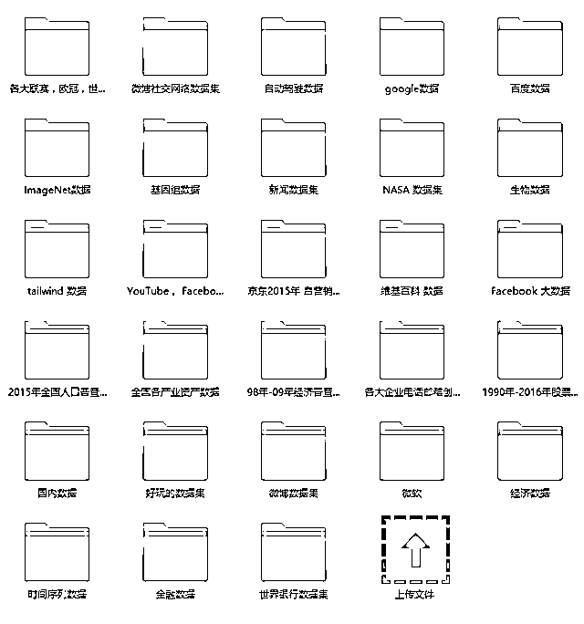
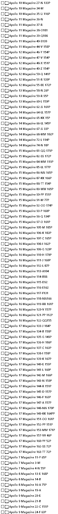
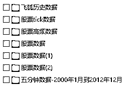
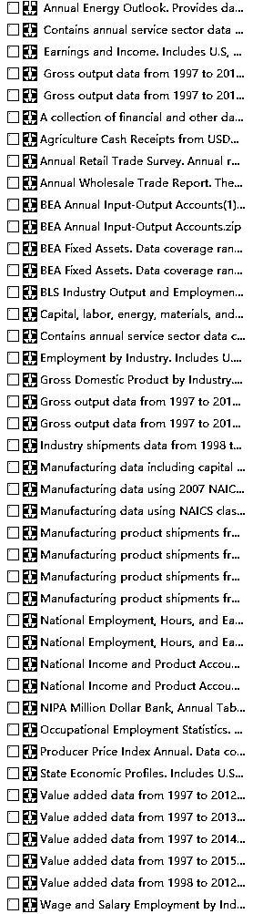
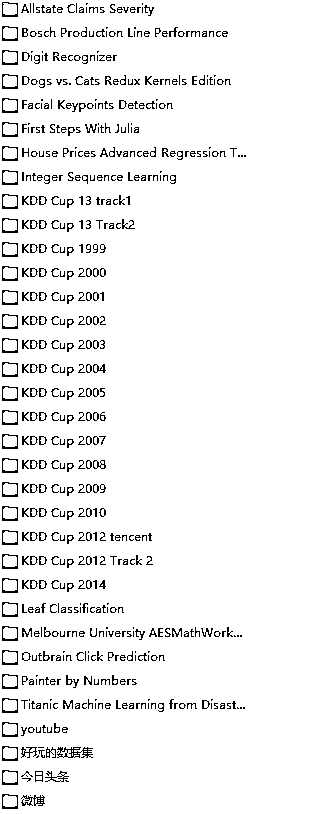

# 这是我见过的最全的训练数据集，没有之一！

> 原文：[`mp.weixin.qq.com/s?__biz=MzAxNTc0Mjg0Mg==&mid=2653284392&idx=1&sn=6baa2e6c377f2e0797f0428b62d78e86&chksm=802e2a3db759a32b45a15c02b9e9a2b9d58e7fa8e06edb00ae9ed4a9cc70149ff73bd5d632f6&scene=27#wechat_redirect`](http://mp.weixin.qq.com/s?__biz=MzAxNTc0Mjg0Mg==&mid=2653284392&idx=1&sn=6baa2e6c377f2e0797f0428b62d78e86&chksm=802e2a3db759a32b45a15c02b9e9a2b9d58e7fa8e06edb00ae9ed4a9cc70149ff73bd5d632f6&scene=27#wechat_redirect)

从大学毕业起，小编就开始收集各类数据集，经过近几年的积累和沉淀，小编收集整理了 32 套数据集，内容涵盖“自动驾驶”、“人脸识别”、“世界杯”、“股票数据”、“基因组数据”、“全球各大社交媒体数据”等。  

截止到今天，小编已经分享给超过 10 万的程序员朋友下载，这次我把所有数据集重新梳理精简，免费分享给大家 。

 

扫描下面二维码，关注公众号 “小象”，点击菜单栏左下角“领取资料”。

**本次干货总计 32 套****，****700G 大小**

NASA 数据集

可上下滑动，点击图片查看全部

1990-2016 年股票数据

可上下滑动，点击图片查看全部

美国经济数据

kaggle 竞赛数据

以上是小编挑选的 5 个案例，32 套数据集都将免费分享给大家。

小编深知这次免费分享一定会受到很多人的欢迎，所以大家一定要帮助小编让更多人拿到数据集。

PS：杜绝伸手党！

扫描下面二维码，关注公众号 “小象”，点击菜单栏左下角“领取资料”。

**关注者**

**从****1 到 10000+**

**我们每天都在进步**

**投稿、商业合作**

**请发邮件到：lhtzjqxx@163.com**

听说，置顶关注我们的人都不一般

****