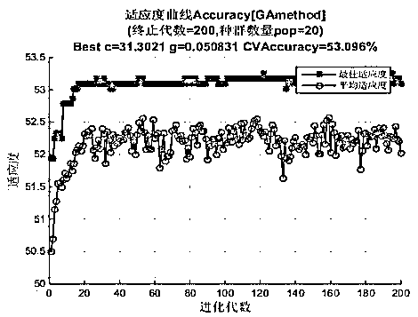
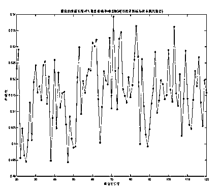

# 量化投资之机器学习应用——基于 SVM 模型的商品期货择时交易策略（提出质疑和讨论）

> 原文：[`mp.weixin.qq.com/s?__biz=MzAxNTc0Mjg0Mg==&mid=2653284388&idx=1&sn=8c0a75165ef3eee5a7ca089dfee85e72&chksm=802e2a31b759a327d106923b4e2c74706e8dab9848f998ec62de7bf19a4aeececc9aac362072&scene=27#wechat_redirect`](http://mp.weixin.qq.com/s?__biz=MzAxNTc0Mjg0Mg==&mid=2653284388&idx=1&sn=8c0a75165ef3eee5a7ca089dfee85e72&chksm=802e2a31b759a327d106923b4e2c74706e8dab9848f998ec62de7bf19a4aeececc9aac362072&scene=27#wechat_redirect)

2016 年在东证期货的量化报告里，读到一篇文章，关于量化投资策略之机器学习应用——基于 SVM 模型的期货择时交易策略 。就顺手算了一下，发现了一些问题，因此和大家来讨论。

**（文章比较长，因为有编辑部成员思考实践的部分，我们支持大胆提出质疑的精神！请在留言处发表你的看法和观点。）**

**本文为编辑部原创内容任何个人、机构组织不得以任何方式进行转载，除非经过本公众号授权，否则将进行举报投诉！！！**

我们旨在

成为全网**优质的**金融、科技文公众号

**机器学习简述**  

根据 Tom Michael Mitchell 对机器学习的定义，假设有任务 T、执行结果衡量标准 P 以及从中获取的经验值 E，计算机程序在反复执行相关任务（T）后的成绩（P）会随着经验（E）的积累而不断提高和完善，这个过程被统称为机器学习，对任务求解的途径称为学习方法。从实例中学习的模型主要包含三个部分：数据源（数据发生器）、训练器以及学习机器。数据源的特性决定训练器和学习环境，将数据 x-输入至训练器中，返回响应值 y-学习机器通过观测训练集((x1,y1),...( xn,yn))，构造相应算法用于预测其他特定数据源 xi 在训练器中的响应 yi，并以预测结果 y-适当地逼近响应值为目标。依据不同的训练数据集，机器学习可以分为监督学习、无监督学习、半监督学习以及强化学习，其中监督学习是指每一个有效的数据输入都对应一个输出（响应值）；依据不同的输出值，机器学习又可以分为分类问题（输出值离散分布）、回归问题（输出值连续分布）以及结构化问题（输出值隐性决定）。

** SVM 择时策略 **

SVM （support vector machine）属于机器学习中的监督学习算法，以统计学习理论为基础，在最小化样本误差的同时寻求结构风险最小化，以提高学习机器的泛化能力。SVM 算法的优点在于通过参数寻优以降低泛化出错率，同时使用核函数在高维度特征空间中进行学习以解决非线性分类和回归问题。 

SVM 择时模型的本质属于分类器，构建的流程包括：1\.  收集数据，例如基本的历史行情信息（开盘价、收盘价、最高价以及最低价等）；2\. 分析数据，对数据的所有特征项进行梳理，删除重复项以降低数据维度；3\. 训练算法，使用粒子群优化算法（PSO）以及遗传算法（GA）实现参数调优；4\. 测试算法，在设置止损点位的基础上对择时策略进行回测检验，统计模型准确率和收益率。总体来说，将 SVM 分类算法与其他参数优化算法相结合，使其通过学习带有涨跌标签的历史交易数据，成为预测未来某一时间区间涨跌方向的分类器，并据此进行为商品期货交易决策。 

** 线性分类问题  **

以篮球比赛中对球员的定位问题为例，根据 2015 至 2016 赛季 NBA （美国职业篮球协会）在编 450 名球员的比赛场均数据，包括得分（两分球/三分球）、助攻、篮板、盖帽以及抢断等特征量，构建 SVM 模型，其中后场球员标签为+1，前场球员标签为-1。此模型的学习过程是通过以上球员的样本数据（训练集），能够准确地对球员的定位进行分类。若有新球员进入联盟，我们可以将其大学和高中比赛的数据输入模型，根据预测结果对其定位进行分类。若仅考虑二维特征量，图中分类器可以用函数(1)表示，其余数据点的分布用函数(2)表示 

 

其中 x 表示二维特征量 x-(x1,x2)，函数(1)用来表示分类超平面，若 f(x) < 0，则数据点在超平面左边，标签值为-1，若 f(x) >0，则数据点在超平面右边，标签值为+1，若 f(x) =0，则数据点在超平面上，不属于任何一类。函数 g(x)类似于 Logistics 函数，将 f(x)的值映射到标签集(-1,+1)上。f(x) 能够表示数据点到超平面距离的远近，我们可以用函数间隔 r=y(wtx+b) 的正负性来验证分类的置信度和准确性，为此我们致力于寻找能够使正负类中函数间隔最小值最大化的超平面。 

 

图中两个支撑着中间间隙的超平面到分类超平面的距离相等，即求得的最大函数间隔 r，在这两个支撑超平面上的点称为支持向量，它们满足 r=y(wtx+b) ；对于不是支持向量的数据点，则满足 r=y(wtx+b)  >  r；若 r=y(wtx+b)  < 0，则表示数据点分类错误。SVM 模型可以通过参数寻优找到分类超平面，以最大限度分隔正负类数据并使支撑超平面之间的距离最大化。 

** 非线性分类问题**

鉴于 SVM 模型更多被运用在解决小样本的非线性分类问题，可以通过核函数和惩罚因子来推广上述的线性支持向量机。在核函数能够计算对应输入特征数据的内积的前提下，可以通过使用恰当的核函数来替代内积，在将非线性的数据映射到高维空间的同时不增加需调参数的个数，从而在高维空间中寻找响应的超平以进行分类。根据问题性质和数据类型，我们选择不同类型的核函数。常用的核函数有如下几类： 

虽然通过映射将原始数据映射到高维空间之后，线性分隔的可操作性增加，但是因为数据特性的原因， 例如噪音， 而造成与均值或正常位置偏离度较大的数据点难以准确分类。一般来说，超平面由少数几个支持向量组成，如果支持向量里存在离群值，则会对非线性分类器的效果产生负面影响。如图 3 所示，若不考虑被圈起的数据点则分类超平面与支撑超平面为三条实线，若考虑此离群值则超平面为三条间隔变小的虚线，此时其他测试集的分类可信度将会降低，并且随着离群值往左下方偏离，分类超平面的构造将失效。

为获得最佳分类效果，SVM 模型允许数据点在一定程度内偏离超平面，通过引入松弛变量ξ和惩罚因子 C，使得最小，其中ξ表示数据点允许偏离的函数间隔的量，C 用于控制分类函数中函数间隔最优与数据点总体偏差量最小之间的权重。例如，根据历史球员比赛数据，后场球员的场均抢断和助攻数据要优于前场球员，而盖帽和篮板数据呈现相对劣势，若出现盖帽数据优于联盟平均值的后场球员，则会干扰 SVM 模型的判断。惩罚因子的作用在于消除离群值的影响。 

**特征量筛选方案**

数据分析中对原始数据源的清理会极大提高优化算法的效率，例如数据源中不同特征向量反映同类特性时对其进行合并。在 SVM 择时策略模型中我们采用 PCA(Principle Component Analysis)算法对数据源进行降维处理，将基础交易数据项（开盘价、收盘价、最高价、最低价等）与合成数据项（MACD、RSI 等）中存在相关性的特征进行剔除，并最大化保留具有代表性的特征项。 

PCA 可以分为以下步骤： 

1)  将原始数据按维度（特征量）进行标准化处理，减去均值并处以标准差； 

2)  计算协方差矩阵的特征向量和特征值，选取贡献度达到 90%的特征值所对应的特征向量； 

3)  使用选取的特征向量将标准化矩阵转换到新空间，产生新的样本数据，降维完成。  我们使用经过处理的数据样本构建模型，预测变量的个数缩减使得计算过程简化，变量之间相互独立但可以最大化反映原始特征信息。 

** 参数寻优过程 **

参数寻优的过程主要针对 SVM 模型中核函数参数和惩罚因子，我们选择两种方法来对核函数中𝛾以及惩罚因子 C 进行动态寻优，分别是粒子群算法和遗传算法。 

PSO 算法从生物种群行为中得到启发，采用跟随式寻优步骤，每个粒子代表一个实验个体，也对应一个潜在最优解。适应度函数决定粒子的适应度值，而粒子的速度决定粒子移动的方向和距离，速度随自身及其他粒子的移动情况而动态调整，从而实现个体在可解空间中的寻优。 

**粒子群优化算法流程 **

**遗传算法流程**

遗传算法借鉴生物界自然选择和遗传机制，从随机产生的初始解开始搜索，通过选择、交叉、变异操作逐步迭代以产生新解。同 PSO 算法，群体中的每个个体代表一个潜在最优解，其好坏由适应度来衡量，根据适应度从上一代中选择一定数量的优秀个体，通过交叉、变异形成下一代群体。遗传算法的优点在于将问题编码后进行优化，而不针对参数本身，从而不受函数约束条件限制，采用并行搜索的方式也可以减少陷入局部最优的可能性。 

粒子群算法比遗传算法具有更高效的信息共享机制，更新群体极值使得信息实现全局范围共享，但遗传算法通过交叉和变异拥有比粒子群算法更有效的逃离局部最优解的概率。所以通过 SVM 模型中分别使用两种算法进行参数寻优，最终选择交叉验证结果中准确率最高的算法以及相应参数。 

 **SVM 模型实践---特征量选择**

因为要构建一个日度级别的交易策略，所以选取能够快速反应市场信息的交易数据作

为 SVM 的测试集。选择的样本属性集合分为两类，特征量集合 A 包括基本交易数据，特征量集合 B 包括技术指标，在后续模型构建中将对这两类集合进行对比。

**交易数据特征量集合 A **

**** 

**技术指标特征量集合 B **

**
其实，机器学习的核心就**

**选特征**

**选特征**

**选特征**

 ** SVM 择时模型流程**

1)  选取过去 n 天的训练集数据，将其进行归一化，并使用 PCA 进行降维处理，得到新的训练集； 

2)  使用遗传算法和粒子群优化算法选取最佳参数，获取的标准依据各自算法中适应度值以及交叉验证的准确率来判断，并从两个算法中选择结果较优的参数； 

3)  将得到的最优参数代入 SVM 模型，选择出构建模型的最佳时间窗口长度，判断的标准为滑窗内的最佳预测准确率； 

4)  将滑动窗口以及最优参数代入 SVM 模型，使用当日的训练数据进行分类，预测明日的上涨或下跌，并根据预测结果设置合适的止损，开盘建仓，收盘平仓。 

  **SVM 择时策略实证分析**

首先针对 SVM 择时策略回测，数据源、交易参数以及模型参数设定如下：

通过对数据归一化处理，我们将原本规模或者单位不同的特征量数据统一转换至 0 到 1 的区间内，避免出现某一项特征量自身绝对数值过大而影响分类效果。降维处理后特征量的维数降低，但保留的维数已经能够覆盖原始数据 90%的方差特征。 

对比粒子群优化算法和遗传算法优化参数的结果，我们可以看出遗传算法在特征量结合 A 和 B 的测试中，交叉验证的准确率相对较高，于是我们选择由遗传算法优化得到的参数。使用遗传算法和技术指标数据源可以达到接近 65%的交叉验证准确率。 

**   编辑成员讨论部分**

1、大家观察上图进行归一化的数据，最低价竟然在最高价的上面。这是个一个思考的问题。为什么会这样？

2、PCA 算法改怎么样用到金融时间序列？

**问题 1：**

首先，对于开高收低，成交量、涨跌幅、及即使再如何进行归一化，数据本身的性质不能变。大家也知道，因为金融时间序列是相互影响的，并不是独立存在的。最低价永远比最高价要小，但是为什么在进行归一化后变了呢？是算法问题，还是其他。编辑部成员分别进行了测试：

归一化的方法常用的有两种：

## **`简单缩放 | min-max 标准化(Min-max normalization) | 离差标准化`**

* * *

在简单缩放中，我们的目的是通过对数据的每一个维度的值进行重新调节（这些维度可能是相互独立的），使得最终的数据向量落在 [0,1]或[ − 1,1] 的区间内（根据数据情况而定）。这对后续的处理十分重要，因为很多默认参数（如 PCA-白化中的 epsilon）都假定数据已被缩放到合理区间。 例子:在处理自然图像时，我们获得的像素值在 [0,255] 区间中，常用的处理是将这些像素值除以 255，使它们缩放到 [0,1] 中.

这种算法是对原始数据的线性变换，使结果落到[0,1]区间，转换函数如下：

X 为原始数据，Xmax、Xmin 分别为原始数据集的最大值和最小值。

**`适用场景`**

这种归一化方法比较适用在数值比较集中的情况。但是，如果 max 和 min 不稳定，很容易使得归一化结果不稳定，使得后续使用效果也不稳定，实际使用中可以用经验常量值来替代 max 和 min。而且当有新数据加入时，可能导致 max 和 min 的变化，需要重新定义。在不涉及距离度量、协方差计算、数据不符合正太分布的时候，可以使用第一种方法或其他归一化方法。比如图像处理中，将 RGB 图像转换为灰度图像后将其值限定在[0 255]的范围。

进行验证：

def MaxMinNormalization(data):

      name= data.columns

      for i in name:

         min_value = data[i].min() #数据集中的最小值

         max_value = data[i].max() #数据集中的最大值

         Range = max_value-min_value #计算取值范围

         data[i] = (data[i] - min_value) / Range

B[['high','low','amt','pct_chg']].plot(figsize=(18,10))

## **`标准差标准化 | z-score 0 均值标准化(zero-mean normalization)`**

* * *

经过处理的数据符合标准正态分布，即均值为 0，标准差为 1，其转化函数为：

u: 所有样本数据的均值
σ: 为所有样本数据的标准差

**`适用场景`**

在分类、聚类算法中，需要使用距离来度量相似性的时候、或者使用 PCA 技术进行降维的时候，第二种方法(Z-score standardization)表现更好。

进行验证：

def zeroMeanNormalization(data):

      name= data.columns

      for i in name:

          av = data[i].mean() #数据集中的平均值

          st = data[i].std()  #数据集中的方差

          data[i] = (data[i] - av) / st

B[['high','low','pct_chg','amt']].plot(figsize=(16,10))

 

但我们发现，最低价还是在最高价的上面

所以我们觉得，就不能对金融时间序列进行归一化操作。因为这样的操作会导致后面的所有工作可能都会出错，如果，不直接对一手数据进行操作，其实可以考虑二手数据，这就是第二种方法，指标的测试及归一化。

如果非要进行一手数据操作，建议使用机器学习的其他算法，比如用序列思想的 RNN 或者 CNN。这样可能会好一些，或者直接不要用归一化，直接用随机森林或者二叉等等树。

所以如果第一步做的不对的话，后面就不用看了，当然，这只是一种观点，希望大家可以提出来，我们进行讨论。

**问题 2：**

PCA 通过线性变换将原始数据变换为一组各维度线性无关的表示，可用于提取数据的主要特征分量，常用于高维数据的降维。我们对如此多的技术指标特征，量价特征等等，进行主成分分析，这点对于降低工作量和提取主要信息是很有用的。

## ****`该如何降维才能最大程度保留原有的信息`****

* * *

> ****最大方差理论****

**最好的 k 维特征是将 n 维样本点转换为 k 维后，每一维上的样本方差都很大。******

****将样本投影到某一维上，这里用一条过原点的直线表示****

**************** 

****************

****************

****************

****************

**********这就是 PCA 的核心********** 

********PCA 在**sklearn**中也有函数和算法，这个大家可以看官方文档。********

********接下来，继续进行预测和参数优化部分。********

****************

****************

****************

****************

********在得到的最佳窗口长度基础上，我们可以使用得到的 SVM 模型预测交易信号，并对比********

********实际买卖信号。 ********

**********以基础价量为样本的最优滑窗长度**********

****************

**********以技术指标为样本的最优滑窗长度********** 

****************

**********特征量集合 A 与集合 B **********

****************

**********沪深 300 股指期货主力合约走势与策略累计收益（技术指标） **********

****************

**********沪深 300 股指期货主力合约走势与策略累计收益（价量数据）********** 

****************

********根据回测数据我们可以看到，价量数据集合 A 与技术指标集合 B 在预测下跌时胜率均比预测上涨时要更精确，并且策略的总体预测精度均超过 50%。结合最大回撤、累计收益率、夏普比率以及滑动窗口，可以看出集合 A 对市场的消息反映更快，收益率累计高，但波动率也相对较高，相比而言集合 B 更加稳健，拥有低回撤的同时也有较强的夏普比率和信息比率。双方的连盈、连亏次数相当，反映两个特征集合对市场趋势的把握能力相同。 ********

**********总结** ********

********通过 SVM 择时策略模型，通过数据清理与参数优化两个重要步骤来调试 SVM 模型，结合窗口滑动进行动态测试交易，在明确交易信号、止损标准清晰、建仓不考虑冲击成本、流动性因素的基础上，构建日度开盘建仓、收盘平仓的被动策略，保证一定程度的精度预测，同时也获得良好的收益和风险表现。但仍有一下几个方面需要改善： ********

********1)  特征量是训练 SVM 模型的根基，是机器学习的“参考书”。继续挖掘能反映市场情绪、量价关系、动能转换以及趋势变化的优秀特征量是必不可少的。另外，日度交易策略也需要测量在不同的市场趋势与环境中哪些特征指标是最能有效反映市场信息。 ********

********2)  数据频率的升级可以提升数据源信息丰度，但遗传算法的迭代使得目前算法仍只能适用于日度级别。如何优化算法以进一步优化计算效率是研究的重点。 ********

********3)  PCA 线性正交降维的劣势可以得到解决，可以用更少的维度来反映相同量的特征信息。 ********

********4)  开发操作简便、指令完善以及交互体验优良的模型参数调试 GUI （图形用户界面），使数据清理优良程度以及参数优化结果能以图形的方式直接展示，方便直观地了解模型构建与调试过程。 ********

********5)  丰富交易策略，包括开发更灵活、指令清晰的择时模型，以及将 SVM 分类回归功能运用至市场波动率研究和选股策略。 ********

********最新一期的预测结果：********

**************** 

**********投稿、商业合作**********

**********请发邮件到：lhtzjqxx@163.com**********

**********关注者**********

**********从****1 到 10000+**********

**********我们每天都在进步**********

********听说，置顶关注我们的人都不一般********

****************

********************