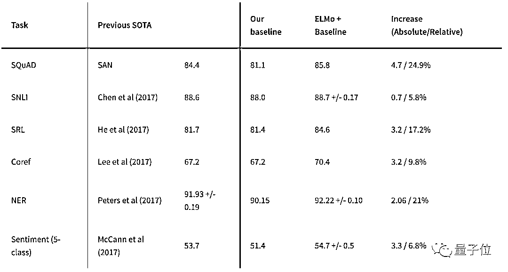

# 【重磅】2018 全球 AI 技术年度大盘点

> 原文：[`mp.weixin.qq.com/s?__biz=MzAxNTc0Mjg0Mg==&mid=2653289883&idx=1&sn=99fb7ee90d07e7e51af067cd5b96e873&chksm=802e3f8eb759b698bc1016842680726c3c45f4fb183c5fd4de7185c34ead5fff5d9a96f7af7d&scene=27#wechat_redirect`](http://mp.weixin.qq.com/s?__biz=MzAxNTc0Mjg0Mg==&mid=2653289883&idx=1&sn=99fb7ee90d07e7e51af067cd5b96e873&chksm=802e3f8eb759b698bc1016842680726c3c45f4fb183c5fd4de7185c34ead5fff5d9a96f7af7d&scene=27#wechat_redirect)

请**标星公众号**，第一时间获取最新推文

***时 间 就 这 样 悄 无 声 息 的 溜 了***

**2018 年，就只剩下****2****天了**

##### 安妮 夏乙 发自 凹非寺
量子位 出品 | 公众号 QbitAI

**综述**

2018，仍是 AI 领域激动人心的一年。

这一年成为 NLP 研究的分水岭，各种突破接连不断；CV 领域同样精彩纷呈，与四年前相比 GAN 生成的假脸逼真到让人不敢相信；新工具、新框架的出现，也让这个领域的明天特别让人期待……

近日，Analytics Vidhya 发布了一份 2018 人工智能技术总结与 2019 趋势预测报告，原文作者 PRANAV DAR。量子位在保留这个报告架构的基础上，对内容进行了重新编辑和补充。

这份报告总结和梳理了全年主要 AI 技术领域的重大进展，同时也给出了相关的资源地址，以便大家更好的使用、查询。

报告共涉及了五个主要部分：

*   自然语言处理（NLP）

*   计算机视觉

*   工具和库

*   强化学习

*   AI 道德

下面，我们就逐一来盘点和展望，嘿喂狗~

**自然语言处理（NLP**）

2018 年在 NLP 历史上的特殊地位，已经毋庸置疑。

这份报告认为，这一年正是 NLP 的分水岭。2018 年里，NLP 领域的突破接连不断：ULMFiT、ELMo、最近大热的 BERT……

迁移学习成了 NLP 进展的重要推动力。从一个预训练模型开始，不断去适应新的数据，带来了无尽的潜力，甚至有“NLP 领域的 ImageNet 时代已经到来”一说。

**■ ULMFiT**

这个缩写，代表“**通用语言模型的微调**”，出自 ACL 2018 论文：Universal Language Model Fine-tuning for Text Classification。

正是这篇论文，打响了今年 NLP 迁移学习狂欢的第一枪。

论文两名作者一是 Fast.ai 创始人 Jeremy Howard，在迁移学习上经验丰富；一是自然语言处理方向的博士生 Sebastian Ruder，他的 NLP 博客几乎所有同行都在读。

两个人的专长综合起来，就有了 ULMFiT。想要搞定一项 NLP 任务，不再需要从 0 开始训练模型，拿来 ULMFiT，用少量数据微调一下，它就可以在新任务上实现更好的性能。

他们的方法，在六项文本分类任务上超越了之前最先进的模型。

详细的说明可以读他们的论文：

https://arxiv.org/abs/1801.06146

Fast.ai 网站上放出了训练脚本、模型等：

http://nlp.fast.ai/category/classification.html

**■ ELMo**

这个名字，当然不是指《芝麻街》里那个角色，而是“语言模型的词嵌入”，出自艾伦人工智能研究院和华盛顿大学的论文 Deep contextualized word representations，NLP 顶会 NAACL HLT 2018 的优秀论文之一。

ELMo 用语言模型（language model）来获取词嵌入，同时也把词语所处句、段的语境考虑进来。

这种语境化的词语表示，能够体现一个词在语法语义用法上的复杂特征，也能体现它在不同语境下如何变化。

当然，ELMo 也在试验中展示出了强大功效。把 ELMo 用到已有的 NLP 模型上，能够带来各种任务上的性能提升。比如在机器问答数据集 SQuAD 上，用 ELMo 能让此前最厉害的模型成绩在提高 4.7 个百分点。

这里有 ELMo 的更多介绍和资源：

https://allennlp.org/elmo

**■ BERT**

说 BERT 是 2018 年最火的 NLP 模型，一点也不为过，它甚至被称为 NLP 新时代的开端。

它由 Google 推出，全称是**B**idirectional **E**ncoder **R**epresentations from **T**ransformers，意思是来自 Transformer 的双向编码器表示，也是一种预训练语言表示的方法。

从性能上来看，没有哪个模型能与 BERT 一战。它在 11 项 NLP 任务上都取得了最顶尖成绩，到现在，SQuAD 2.0 前 10 名只有一个不是 BERT 变体：

如果你还没有读过 BERT 的论文，真的应该在 2018 年结束前补完这一课：

https://arxiv.org/abs/1810.04805

另外，Google 官方[开源了训练代码和预训练模型](http://mp.weixin.qq.com/s?__biz=MzIzNjc1NzUzMw==&mid=2247507210&idx=3&sn=ee69c35f118a1768ac04aa832b3e6186&chksm=e8d06a78dfa7e36e92ba4e14263389a76415a9e900a041ccf82c21655ed466e71a8353f519c7&scene=21#wechat_redirect)：

https://github.com/google-research/bert

如果你是 PyTorch 党，也不怕。这里还有[官方推荐的 PyTorch 重实现和转换脚本](http://mp.weixin.qq.com/s?__biz=MzIzNjc1NzUzMw==&mid=2247507514&idx=3&sn=721fbc22788463aa9f5e2563c47393c1&chksm=e8d06948dfa7e05ed98f41957a836273f0e2c88bad8ed7f2e9e6b0c9d6c016beff61f65a7fd1&scene=21#wechat_redirect)：

https://github.com/huggingface/pytorch-pretrained-BERT

**■ PyText**

BERT 之后，NLP 圈在 2018 年还能收获什么惊喜？答案是，一款新工具。

就在上周末，Facebook 开源了自家工程师们一直在用的 NLP 建模框架 PyText。这个框架，每天要为 Facebook 旗下各种应用处理超过 10 亿次 NLP 任务，是一个工业级的工具包。（Facebook 开源新 NLP 框架：简化部署流程，大规模应用也 OK）

PyText 基于 PyTorch，能够加速从研究到应用的进度，从模型的研究到完整实施只需要几天时间。框架里还包含了一些预训练模型，可以直接拿来处理文本分类、序列标注等任务。

想试试？开源地址在此：

https://github.com/facebookresearch/pytext

**■ Duplex**

如果前面这些研究对你来说都太抽象的话，Duplex 则是 NLP 进展的最生动例证。

名字有点陌生？不过这个产品你一定听说过，它就是 Google 在 2018 年 I/O 开发者大会上展示的“打电话 AI”。

它能主动打电话给美发店、餐馆预约服务，全程流畅交流，简直以假乱真。Google 董事长 John Hennessy 后来称之为“非凡的突破”，还说：“在预约领域，这个 AI 已经通过了图灵测试。”

Duplex 在多轮对话中表现出的理解能力、合成语音的自然程度，都是 NLP 目前水平的体现。

如果你还没看过它的视频……

[`v.qq.com/iframe/preview.html?width=500&height=375&auto=0&vid=r0647360dsv`](https://v.qq.com/iframe/preview.html?width=500&height=375&auto=0&vid=r0647360dsv)

**■ 2019 年展望**

NLP 在 2019 年会怎么样？我们借用一下 ULMFiT 作者 Sebastian Ruder 的展望：

预训练语言模型嵌入将无处不在：不用预训练模型，从头开始训练达到顶尖水平的模型，将十分罕见。

能编码专业信息的预训练表示将会出现，这是语言模型嵌入的一种补充。到时候，我们就能根据任务需要，把不同类型的预训练表示结合起来。

在多语言应用、跨语言模型上，将有更多研究。特别是在跨语言词嵌入的基础上，深度预训练跨语言表示将会出现。

**计算机视觉**

今年，无论是图像还是视频方向都有大量新研究问世，有三大研究曾在 CV 圈掀起了集体波澜。

**■ BigGAN**

今年 9 月，当搭载 BigGAN 的双盲评审中的 ICLR 2019 论文现身，行家们就沸腾了：**简直看不出这是 GAN 自己生成的。**

在计算机图像研究史上，BigGAN 的效果比前人进步了一大截。比如在 ImageNet 上进行 128×128 分辨率的训练后，它的 Inception Score（IS）得分 166.3，是之前最佳得分 52.52 分**3 倍**。

除了搞定 128×128 小图之外，BigGAN 还能直接在 256×256、512×512 的 ImageNet 数据上训练，生成更让人信服的样本。

在论文中研究人员揭秘，BigGAN 的惊人效果背后，真的付出了金钱的代价，最多要用 512 个 TPU 训练，费用可达 11 万美元，合人民币 76 万元。

不止是模型参数多，训练规模也是有 GAN 以来最大的。它的参数是前人的 2-4 倍，批次大小是前人的 8 倍。

**相关地址**

研究论文：

https://openreview.net/pdf?id=B1xsqj09Fm

**延伸阅读**

[惊！史上最佳 GAN 现身，超真实 AI 假照片，行家们都沸腾了](http://mp.weixin.qq.com/s?__biz=MzIzNjc1NzUzMw==&mid=2247505181&idx=1&sn=2e817ec2ae918fd85c0ebcf85e810997&chksm=e8d0626fdfa7eb799021a16584bef14fb56bcda155dcee2d12b612e77ac18c53d6faedcd5aaa&scene=21#wechat_redirect)

[训练史上最佳 GAN 用了 512 块 TPU，一作自述：这不是算法进步，是算力进步](http://mp.weixin.qq.com/s?__biz=MzIzNjc1NzUzMw==&mid=2247505758&idx=3&sn=f6586a89960f54e89e72c42d2b65397e&chksm=e8d0602cdfa7e93aebef859f3e546b6df596af6a6ec0526518b95b7d6b223fb877596e1286da&scene=21#wechat_redirect)

[史上最强 GAN：训练费 10 万起，现在免费体验，画风鬼畜又逼真](http://mp.weixin.qq.com/s?__biz=MzIzNjc1NzUzMw==&mid=2247507950&idx=1&sn=5f6ad3faa1a7a9dada286911f549bbd5&chksm=e8d0689cdfa7e18a6daa6101172ce6c69c4b97da57f20175e1b2365c4c9f3f08ad4b1a3501ca&scene=21#wechat_redirect)

**■ Fast.ai 18 分钟训练整个 ImageNet**

在完整的 ImageNet 上训练一个模型需要多久？各大公司不断下血本刷新着记录。

不过，也有不那么烧计算资源的平民版。

今年 8 月，在线深度学习课程 Fast.ai 的创始人 Jeremy Howard 和自己的学生，用**租来的**亚马逊 AWS 的云计算资源，**18 分钟**在 ImageNet 上将图像分类模型训练到了 93%的准确率。

前前后后，Fast.ai 团队只用了 16 个 AWS 云实例，每个实例搭载 8 块英伟达 V100 GPU，结果比 Google 用 TPU Pod 在斯坦福 DAWNBench 测试上达到的速度还要快 40%。

这样拔群的成绩，成本价只需要**40 美元**，Fast.ai 在博客中将其称作人人可实现。

**相关地址**

Fast.ai 博客介绍：

https://www.fast.ai/2018/08/10/fastai-diu-imagenet/

**延伸阅读**

[40 美元 18 分钟训练整个 ImageNet！人人可实现](http://mp.weixin.qq.com/s?__biz=MzIzNjc1NzUzMw==&mid=2247502384&idx=2&sn=e5f0517baca5e5d63d26de66071d6e98&chksm=e8d07d42dfa7f4548c5547bf30bf84020a8f2cb4fd648905b2afeac9fbf67b60ff1ae7c1323e&scene=21#wechat_redirect)

[224 秒！ImageNet 上训练 ResNet-50 最佳战绩出炉，索尼下血本破纪录](http://mp.weixin.qq.com/s?__biz=MzIzNjc1NzUzMw==&mid=2247508021&idx=2&sn=8d84bb079dd38d526c114dc4af916ee6&chksm=e8d01747dfa79e51ab40c216cdba293fd72aa71aa90b77472411d02c6f7bac1b2e222657a43d&scene=21#wechat_redirect)

**■ vid2vid 技术**

今年 8 月，英伟达和 MIT 的研究团队高出一个**超逼真**高清视频生成 AI。

只要一幅动态的语义地图，就可获得和真实世界几乎一模一样的视频。换句话说，只要把你心中的场景勾勒出来，无需实拍，电影级的视频就可以自动 P 出来：

除了街景，人脸也可生成：

这背后的 vid2vid 技术，是一种在生成对抗性学习框架下的新方法：精心设计的生成器和鉴别器架构，再加上时空对抗目标。 

这种方法可以在分割蒙版、素描草图、人体姿势等多种输入格式上，实现高分辨率、逼真、时间相干的视频效果。

好消息，vid2vid 现已被英伟达开源。

**相关地址**

研究论文：

https://tcwang0509.github.io/vid2vid/paper_vid2vid.pdf

GitHub 地址

https://github.com/NVIDIA/vid2vid

**延伸阅读**

[真实到可怕！英伟达 MIT 造出马良的神笔](http://mp.weixin.qq.com/s?__biz=MzIzNjc1NzUzMw==&mid=2247502757&idx=1&sn=8603dbc1b19f33b59095c5647d3d2fc3&chksm=e8d07cd7dfa7f5c1a01323f0daccd292ddf6d9db8b59bf75c93f1f16dbca8e4233030315fc3d&scene=21#wechat_redirect)

[一文看尽深度学习这半年](http://mp.weixin.qq.com/s?__biz=MzIzNjc1NzUzMw==&mid=2247509236&idx=2&sn=c1086db22ac1c62659b8cc4d47b5946a&chksm=e8d01386dfa79a90315d5daff027ce8dab97837478e3d02dd28b9f40a496a7d47020fc7eb45e&scene=21#wechat_redirect)

**■ 2019 趋势展望**

Analytics Vidhya 预计，明年在计算机视觉领域，对现有方法的改进和增强的研究可能多于创造新方法。

在美国，政府对无人机的限令可能会稍微“松绑”，开放程度可能增加。而今年大火的自监督学习明年可能会应用到更多研究中。

Analytics Vidhya 对视觉领域也有一些期待，目前来看，在 CVPR 和 ICML 等国际顶会上公布最新研究成果，在工业界的应用情况还不乐观。他希望在 2019 年，能看到更多的研究在实际场景中落地。

Analytics Vidhya 预计，视觉问答（Visual Question Answering，VQA）技术和视觉对话系统可能会在各种实际应用中首次亮相。

**工具和框架**

哪种工具最好？哪个框架代表了未来？这都是一个个能永远争论下去的话题。

没有异议的是，不管争辩的结果是什么，我们都需要掌握和了解最新的工具，否则就有可能被行业所抛弃。

今年，机器学习领域的工具和框架仍在快速的发展，下面就是这方面的总结和展望。

**■ PyTorch 1.0**

根据 10 月 GitHub 发布的 2018 年度报告，PyTorch 在增长最快的开源项目排行上，名列第二。也是唯一入围的深度学习框架。

作为谷歌 TensorFlow 最大的“劲敌”，PyTorch 其实是一个新兵，2017 年 1 月 19 日才正式发布。2018 年 5 月，PyTorch 和 Caffe2 整合，成为新一代 PyTorch 1.0，竞争力更进一步。

相较而言，PyTorch 速度快而且非常灵活，在 GitHub 上有越来越多的开码都采用了 PyTorch 框架。可以预见，明年 PyTorch 会更加普及。

至于 PyTorch 和 TensorFlow 怎么选择？在我们之前发过的一篇报道里，不少大佬站 PyTorch。

实际上，两个框架越来越像。前 Google Brain 深度学习研究员，Denny Britz 认为，大多数情况下，选择哪一个深度学习框架，其实影响没那么大。

**相关地址**

PyTorch 官网：

https://pytorch.org/

**延伸阅读**

[PyTorch 还是 TensorFlow？这有一份新手指南](http://mp.weixin.qq.com/s?__biz=MzIzNjc1NzUzMw==&mid=2247488154&idx=1&sn=88e8f47568c170b78563c89e0246c319&chksm=e8d3a5e8dfa42cfe8bb906c21465a691359c1622095edad1c2748cb00d9aabb0be94f6e04759&scene=21#wechat_redirect)

[尝鲜 PyTorch 1.0 必备伴侣](http://mp.weixin.qq.com/s?__biz=MzIzNjc1NzUzMw==&mid=2247505364&idx=1&sn=388b4924f44c52da7ef4f1fc0f8e8789&chksm=e8d062a6dfa7ebb0d580d0f9b07f5d64368155f4ad59feb526449bfda6575cbfad4aa49d2c3b&scene=21#wechat_redirect)

[TensorFlow 王位不保？ICLR 投稿论文 PyTorch 出镜率快要反超了](http://mp.weixin.qq.com/s?__biz=MzIzNjc1NzUzMw==&mid=2247505393&idx=2&sn=73258548a04648f664cdbecb846b1708&chksm=e8d06283dfa7eb956b6fff10c77f6d850495685130f86f6043d79cbfd8389244c6f2751e81d0&scene=21#wechat_redirect)

**■ AutoML**

很多人将 AutoML 称为深度学习的新方式，认为它改变了整个系统。有了 AutoML，我们就不再需要设计复杂的深度学习网络。

今年 1 月 17 日，谷歌推出 Cloud AutoML 服务，把自家的 AutoML 技术通过云平台对外发布，即便你不懂机器学习，也能训练出一个定制化的机器学习模型。

不过 AutoML 并不是谷歌的专利。过去几年，很多公司都在涉足这个领域，比方国外有 RapidMiner、KNIME、DataRobot 和 H2O.ai 等等。

除了这些公司的产品，还有一个开源库要介绍给大家：

Auto Keras！

这是一个用于执行 AutoML 任务的开源库，意在让更多人即便没有人工智能的专家背景，也能搞定机器学习这件事。

这个库的作者是美国德州农工大学（Texas A&M University）助理教授胡侠和他的两名博士生：金海峰、Qingquan Song。Auto Keras 直击谷歌 AutoML 的三大缺陷：

第一，还得付钱。

第二，因为在云上，还得配置 Docker 容器和 Kubernetes。

第三，服务商(Google)保证不了你数据安全和隐私。

**相关地址**

官网：

https://autokeras.com/

GitHub：

https://github.com/jhfjhfj1/autokeras

**延伸阅读**

[一文看懂深度学习新王者「AutoML」](http://mp.weixin.qq.com/s?__biz=MzIzNjc1NzUzMw==&mid=2247503016&idx=1&sn=5521830e7a201d1893be62aa8975a032&chksm=e8d07bdadfa7f2cc45c9d784b73691826f9d41d4fe713586f63ce0325c61c94202a4e9526939&scene=21#wechat_redirect)

[开源的“谷歌 AutoML 杀手”来了](http://mp.weixin.qq.com/s?__biz=MzIzNjc1NzUzMw==&mid=2247502064&idx=3&sn=526c0eb5f9520ed1584873a5af48b08f&chksm=e8d07f82dfa7f6942c06298653808fa722f3359c0407de492de8a4b0fd0af861f17f1fe35d3f&scene=21#wechat_redirect)

[谷歌放大招！全自动训练 AI 无需写代码，全靠刚发布的 Cloud AutoML](http://mp.weixin.qq.com/s?__biz=MzIzNjc1NzUzMw==&mid=2247493350&idx=1&sn=76db3f988ae1c373c50ebe6814a276ea&chksm=e8d05194dfa7d88257ae1dc188aa68ace7fc8f9dc90ab3da93152a973d4509441eccff1a368d&scene=21#wechat_redirect)

**■ TensorFlow.js**

今年 3 月底的 TensorFlow 开发者会峰会 2018 上，TensorFlow.js 正式发布。

这是一个面向 JavaScript 开发者的机器学习框架，可以完全在浏览器中定义和训练模型，也能导入离线训练的 TensorFlow 和 Keras 模型进行预测，还对 WebGL 实现无缝支持。

在浏览器中使用 TensorFlow.js 可以扩展更多的应用场景，包括展开交互式的机器学习、所有数据都保存在客户端的情况等。

实际上，这个新发布的 TensorFlow.js，就是基于之前的 deeplearn.js，只不过被整合进 TensorFlow 之中。

谷歌还给了几个 TensorFlow.js 的应用案例。比如借用你的摄像头，来玩经典游戏：吃豆人（Pac-Man）。

**相关地址**

官网：

https://js.tensorflow.org/

**延伸阅读**

[有笔记本就能玩的体感游戏！TensorFlow.js 实现体感格斗教程](http://mp.weixin.qq.com/s?__biz=MzIzNjc1NzUzMw==&mid=2247507369&idx=3&sn=2ceeb8c3c8e7e24abc16b6f68bee78ff&chksm=e8d06adbdfa7e3cdc42728fd800c06b7b24fead53528a552f1eb801e58d27079a887392ae01a&scene=21#wechat_redirect)

[谷歌 AI 魔镜：看你手舞足蹈，就召唤出 8 万幅照片学你跳](http://mp.weixin.qq.com/s?__biz=MzIzNjc1NzUzMw==&mid=2247501485&idx=3&sn=985f4000b9679f181868ca1d3a7216dc&chksm=e8d071dfdfa7f8c950a82df7f49610475c9b06886a66fe3040d0a20bb0b9c552ed28048abd85&scene=21#wechat_redirect)

[我不是偷拍的变态，只是在找表情包的本尊](http://mp.weixin.qq.com/s?__biz=MzIzNjc1NzUzMw==&mid=2247498027&idx=4&sn=3725d210bc763de85c6b63f1ad1b9285&chksm=e8d04e59dfa7c74f6c1383fe9b388d1ac39cdf3de6e277544082cd3bf252c3b7d8e377f7f26d&scene=21#wechat_redirect)

**■ 2019 趋势展望**

在工具这个主题中，最受关注的就是 AutoML。因为这是一个真正会改变游戏规则的核心技术。在此，引用 H2O.ai 的大神 Marios Michailidis（KazAnova）对明年 AutoML 领域的展望。

*   以智能可视化、提供洞见等方式，帮助描述和理解数据

*   为数据集发现、构建、提取更好的特征

*   快速构建更强大、更智能的预测模型

*   通过机器学习可解释性，弥补黑盒建模带来的差距

*   推动这些模型的产生

**强化学习**

强化学习还有很长的路要走。

除了偶尔成为头条新闻之外，目前强化学习领域还缺乏真正的突破。强化学习的研究非常依赖数学，而且还没有形成真正的行业应用。

希望明年可以看到更多 RL 的实际用例。现在我每个月都会特别关注一下强化学习的进展，以期看到未来可能会有什么大事发生。

**■ OpenAI 的强化学习入门教程**

全无机器学习基础的人类，现在也可以迅速上手强化学习。

11 月初，OpenAI 发布了强化学习 (RL) 入门教程：Spinning Up。从一套重要概念，到一系列关键算法实现代码，再到热身练习，每一步都以清晰简明为上，全程站在初学者视角。

团队表示，目前还没有一套比较通用的强化学习教材，RL 领域只有一小撮人进得去。这样的状态要改变啊，因为强化学习真的很有用。

**相关地址**

教程入口：

https://spinningup.openai.com/en/latest/index.html

GitHub 传送门：

https://github.com/openai/spinningup

**延伸阅读**

[强化学习如何入门？看这篇文章就够了](http://mp.weixin.qq.com/s?__biz=MzIzNjc1NzUzMw==&mid=2247498702&idx=3&sn=766997fc7ecd5d1e68e051870490ea08&chksm=e8d04cbcdfa7c5aa3e18a80caaa063c6013e2ce36df74b120dcff37baabda669de3409968e7a&scene=21#wechat_redirect)

[人人能上手：OpenAI 发射初学者友好的强化学习教程 | 代码简约易懂](http://mp.weixin.qq.com/s?__biz=MzIzNjc1NzUzMw==&mid=2247507733&idx=3&sn=1160f715dbfb405345a3c41750d06193&chksm=e8d06867dfa7e17187116e9d5e88ed040e99c2027dcbcc790807281acae6b8ce8f934a5acca6&scene=21#wechat_redirect)

[强化学习算法 Q-learning 入门：教电脑玩“抓住芝士”小游戏](http://mp.weixin.qq.com/s?__biz=MzIzNjc1NzUzMw==&mid=2247488154&idx=4&sn=05485435b9410f046011a5ac95e943a6&chksm=e8d3a5e8dfa42cfec3d7aecbe98f8c4da7ce7d1d59ce153d7ab9306ac09af64e0eba1c73523c&scene=21#wechat_redirect)

**■ 谷歌的强化学习新框架「多巴胺」**

Dopamine（多巴胺），这是谷歌今年 8 月发布的强化学习开源框架，基于 TensorFlow。

新框架在设计时就秉承着清晰简洁的理念，所以代码相对紧凑，大约是 15 个 Python 文件，基于 Arcade Learning Environment (ALE)基准，整合了 DQN、C51、 Rainbow agent 精简版和 ICML 2018 上的 Implicit Quantile Networks。

为了让研究人员能快速比较自己的想法和已有的方法，该框架提供了 DQN、C51、 Rainbow agent 精简版和 Implicit Quantile Networks 的玩 ALE 基准下的那 60 个雅达利游戏的完整训练数据。

另外，还有一组 Dopamine 的教学 colab。

**相关地址**

Dopamine 谷歌博客：

https://ai.googleblog.com/2018/08/introducing-new-framework-for-flexible.html

Dopamine github 下载：

https://github.com/google/dopamine/tree/master/docs#downloads

colabs：

https://github.com/google/dopamine/blob/master/dopamine/colab/README.md

游戏训练可视化网页：

https://google.github.io/dopamine/baselines/plots.html

**■ 2019 趋势展望**

DataHack Summit 2018 发言人、ArxivInsights 创始人 Xander Steenbrugge，也是一名强化学习专家，以下是来自他的总结和展望。

1、由于辅助学习任务越来越多，增加了稀疏的外在奖励，样本的复杂性将继续提高。在非常稀疏的奖励环境中，效果非常好。

2、正因如此，直接在物理世界训练将越来越可行，替代当前大多先在虚拟环境中训练的方法。我预测 2019 年，会出现第一个只由深度学习训练，没有人工参与而且表现出色的机器人 demo 出现。

3、在 DeepMind 把 AlphaGo 的故事延续到生物领域之后（AlphaFold），我相信强化学习将逐步在学术领域外创造实际的商业价值。例如新药探索、电子芯片架构优化、车辆等等……

4、强化学习会有一个明显的转变，以前在训练数据上测试智能体的行为将不再视为“允许”。泛化指标将成为核心，就像监督学习一样。

**AI 道德**

AI 被滥用事故在 2018 年被频频爆出：Facebook AI 助特朗普当选美国总统、Google 与美国军方联手开发 AI 武器、微软为移民和海关执法局（ICE）提供云计算和人脸识别服务……

每一次事故都会重新掀起一波对 AI 道德准则的讨论高潮，一些硅谷科技公司也再次期间制定了企业 AI 准则。

Analytics Vidhya 认为，AI 道德现在还是一个灰色地带，目前还没有所有人可以遵循的框架，2019 年将有更多企业和政府制定相关条例。

AI 道德规范的制定，现在才刚刚起步。

**延伸阅读**

[谷歌将禁止 AI 用于武器，李飞飞等“反对与军方合作”事件始末](http://mp.weixin.qq.com/s?__biz=MzIzNjc1NzUzMw==&mid=2247499306&idx=3&sn=5c0b3ad6cb665b15403454a9ae158de2&chksm=e8d04958dfa7c04e6f4f255931b60175cdfa055e18dce31b78dc6fbab4e93fbeeaaee51a207e&scene=21#wechat_redirect)

[刚刚，Google 发布 AI 七原则：不开发武器，但会继续与军方合作](http://mp.weixin.qq.com/s?__biz=MzIzNjc1NzUzMw==&mid=2247499707&idx=1&sn=64e89575742885b7c0eb47c1a343290f&chksm=e8d048c9dfa7c1df795462ab20146b7de0de3b8fe11b4767187fb6738719699f33dda81b2a88&scene=21#wechat_redirect)

[AI 助特朗普当选？FB 史上最大数据滥用曝光，牵出 ACL 终身奖得主](http://mp.weixin.qq.com/s?__biz=MzIzNjc1NzUzMw==&mid=2247495654&idx=1&sn=030ee3d944620769aab2e126d9094c0c&chksm=e8d05894dfa7d18239caa8c60581cd0ad9eba97f11bba8987b704701eed23eb0a15ed97f2e05&scene=21#wechat_redirect)

**推荐阅读**

[01、经过多年交易之后你应该学到的东西（深度分享）](https://mp.weixin.qq.com/s?__biz=MzAxNTc0Mjg0Mg==&mid=2653289074&idx=1&sn=e859d363eef9249236244466a1af41b6&chksm=802e3867b759b1717f77e07a51ee5671e8115130c66562577280ba1243cba08218add04f1f00&token=449379994&lang=zh_CN&scene=21#wechat_redirect)

[02、监督学习标签在股市中的应用（代码+书籍）](https://mp.weixin.qq.com/s?__biz=MzAxNTc0Mjg0Mg==&mid=2653289050&idx=1&sn=60043a5c95b877dd329a5fd150ddacc4&chksm=802e384fb759b1598e500087374772059aa21b31ae104b3dca04331cf4b63a233c5e04c1945a&token=449379994&lang=zh_CN&scene=21#wechat_redirect)

[03、全球投行顶尖机器学习团队全面分析](https://mp.weixin.qq.com/s?__biz=MzAxNTc0Mjg0Mg==&mid=2653289018&idx=1&sn=8c411f676c2c0d92b0dd218f041bee4b&chksm=802e382fb759b139ffebf633ac14cdd0f21938e4613fe632d5d9231dab3d2aca95a11628378a&token=449379994&lang=zh_CN&scene=21#wechat_redirect)

[04、使用 Tensorflow 预测股票市场变动](https://mp.weixin.qq.com/s?__biz=MzAxNTc0Mjg0Mg==&mid=2653289014&idx=1&sn=3762d405e332c599a21b48a7dc4df587&chksm=802e3823b759b135928d55044c2729aea9690f86752b680eb973d1a376dc53cfa18287d0060b&token=449379994&lang=zh_CN&scene=21#wechat_redirect)

[05、使用 LSTM 预测股票市场基于 Tensorflow](https://mp.weixin.qq.com/s?__biz=MzAxNTc0Mjg0Mg==&mid=2653289238&idx=1&sn=3144f5792f84455dd53c27a78e8a316c&chksm=802e3903b759b015da88acde4fcbc8547ab3e6acbb5a0897404bbefe1d8a414265d5d5766ee4&token=2020206794&lang=zh_CN&scene=21#wechat_redirect)

[06、美丽的回测——教你定量计算过拟合概率](https://mp.weixin.qq.com/s?__biz=MzAxNTc0Mjg0Mg==&mid=2653289314&idx=1&sn=87c5a12b23a875966db7be50d11f09cd&chksm=802e3977b759b061675d1988168c1fec06c602e8583fbcc9b76f87008e0c10b702acc85467a0&token=1972390229&lang=zh_CN&scene=21#wechat_redirect)

[07、利用动态深度学习预测金融时间序列基于 Python](https://mp.weixin.qq.com/s?__biz=MzAxNTc0Mjg0Mg==&mid=2653289347&idx=1&sn=bf5d7899bc4a854d4ba9046fdc6fe0d6&chksm=802e3996b759b080287213840987bb0a0c02e4e1d4d7aae23f10a225a92ef6dd922d8006123d&token=290397496&lang=zh_CN&scene=21#wechat_redirect)

[08、Facebook 开源神器 Prophet 预测时间序列基于 Python](https://mp.weixin.qq.com/s?__biz=MzAxNTc0Mjg0Mg==&mid=2653289394&idx=1&sn=24a836136d730aa268605628e683d629&chksm=802e39a7b759b0b1dcf7aaa560699130a907716b71fc9c45ff0e5d236c5ae8ef80ebdb09dbb6&token=290397496&lang=zh_CN&scene=21#wechat_redirect)

[09、Facebook 开源神器 Prophet 预测股市行情基于 Python](https://mp.weixin.qq.com/s?__biz=MzAxNTc0Mjg0Mg==&mid=2653289437&idx=1&sn=f0dca7da8e69e7ba736992cb3d034ce7&chksm=802e39c8b759b0de5bce401c580623d0729ecca69d13926479d36e19aff8c9c9e8a20265afff&token=290397496&lang=zh_CN&scene=21#wechat_redirect)

[10、2018 第三季度最受欢迎的券商金工研报前 50（附下载）](https://mp.weixin.qq.com/s?__biz=MzAxNTc0Mjg0Mg==&mid=2653289358&idx=1&sn=db6e8ab85b08f6e67790ec0e401e586e&chksm=802e399bb759b08d6eec855f9901ea856d0da68c7425cba62791b8948da6ad761a3d88543dad&token=290397496&lang=zh_CN&scene=21#wechat_redirect)

[11、实战交易策略的精髓（公众号深度呈现）](https://mp.weixin.qq.com/s?__biz=MzAxNTc0Mjg0Mg==&mid=2653289447&idx=1&sn=f2948715bf82569a6556d518e56c1f9e&chksm=802e39f2b759b0e4502d1aaac562b87789573b55c76b3c85897d8c9d88dbf9a0b7ee34d86a4e&token=290397496&lang=zh_CN&scene=21#wechat_redirect)

[12、Markowitz 有效边界和投资组合优化基于 Python](https://mp.weixin.qq.com/s?__biz=MzAxNTc0Mjg0Mg==&mid=2653289478&idx=1&sn=f8e01a641be021993d8ef2d84e94a299&chksm=802e3e13b759b7055cf27a280c672371008a5564c97c658eee89ce8481396a28d254836ff9af&token=290397496&lang=zh_CN&scene=21#wechat_redirect)

[13、使用 LSTM 模型预测股价基于 Keras](https://mp.weixin.qq.com/s?__biz=MzAxNTc0Mjg0Mg==&mid=2653289495&idx=1&sn=c4eeaa2e9f9c10995be9ea0c56d29ba7&chksm=802e3e02b759b7148227675c23c403fb9a543b733e3d27fa237b53840e030bf387a473d83e3c&token=1260956004&lang=zh_CN&scene=21#wechat_redirect)

[14、量化金融导论 1：资产收益的程式化介绍基于 Python](https://mp.weixin.qq.com/s?__biz=MzAxNTc0Mjg0Mg==&mid=2653289507&idx=1&sn=f0ca71aa07531bbbdbd33213f0bab89f&chksm=802e3e36b759b720138b3b17a4dd0e198e054b9de29a038fdd50805f824effa55831111ad026&token=1936245282&lang=zh_CN&scene=21#wechat_redirect)

[15、预测股市崩盘基于统计机器学习与神经网络（Python+文档）](https://mp.weixin.qq.com/s?__biz=MzAxNTc0Mjg0Mg==&mid=2653289533&idx=1&sn=4ef964834e84a9995111bb057b0fc5dd&chksm=802e3e28b759b73e0618eb1262c53aa0601fbf5805525a7c7ff40dc3db62c7704496611bdbf1&token=1950551577&lang=zh_CN&scene=21#wechat_redirect)

[16、实现最优投资组合有效前沿基于 Python（附代码）](https://mp.weixin.qq.com/s?__biz=MzAxNTc0Mjg0Mg==&mid=2653289609&idx=1&sn=c7f0b3e47025862d10bb53b6ab88bcda&chksm=802e3e9cb759b78abf6b8b049c59bf18ccfb2ead7580d1f557d36de2292f59dcbd94dcd41910&token=2085008037&lang=zh_CN&scene=21#wechat_redirect)

[**17、精心为大家整理了一些超级棒的机器学习资料（附链接）**](https://mp.weixin.qq.com/s?__biz=MzAxNTc0Mjg0Mg==&mid=2653289615&idx=1&sn=1cdc89afb997d0c580bf0cef296d946c&chksm=802e3e9ab759b78ce9f0cd152a680d4a413d6c8dcb02a7a296f4091993a7e4137e7520394575&token=2085008037&lang=zh_CN&scene=21#wechat_redirect)

[18、海量 Wind 数据，与全网用户零距离邂逅！](https://mp.weixin.qq.com/s?__biz=MzAxNTc0Mjg0Mg==&mid=2653289623&idx=1&sn=28a3600fd7a72d7be00b066ca0f98244&chksm=802e3e82b759b7943f43a4f6ef4a91e4153fa6b8210de9590235fa8ee66eb9811ce177054dbc&token=1389401983&lang=zh_CN&scene=21#wechat_redirect)

[**19、机器学习、深度学习、量化金融、Python 等最新书籍汇总下载**](https://mp.weixin.qq.com/s?__biz=MzAxNTc0Mjg0Mg==&mid=2653289640&idx=1&sn=34e94fcbe99052b8e7381ecc48a36dc0&chksm=802e3ebdb759b7ab897cd329a680715b6f8294e63550ddf0c57b9e1320b2b7d1408c6fdca0c7&token=1389401983&lang=zh_CN&scene=21#wechat_redirect)

[20、各大卖方 2019 年 A 股策略报告，都是有故事的人！](https://mp.weixin.qq.com/s?__biz=MzAxNTc0Mjg0Mg==&mid=2653289725&idx=1&sn=4b65cd1fb8331438e4c0b3d0eae6b51f&chksm=802e3ee8b759b7fe1b94e84d54cc23b0ab05853d5cd227812574b350e9fc2cce9e5f1bc6cb7a&token=1389401983&lang=zh_CN&scene=21#wechat_redirect)

****公众号官方 QQ 群****

**量化、技术人士深度交流群**

