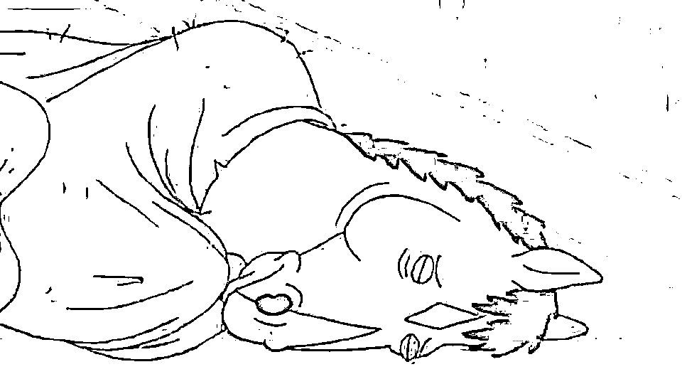

# 大疆员工过劳猝死，『加班文化』你反抗的了吗?

> 原文：[`mp.weixin.qq.com/s?__biz=MzAxNTc0Mjg0Mg==&mid=2653289829&idx=1&sn=d2ad2beb2bec1f3682386e5e47fb4b5e&chksm=802e3f70b759b666c025b5338b82a09cbf53bfbe72cd4a10ae7799268ed9fd8c25e450ec3e14&scene=27#wechat_redirect`](http://mp.weixin.qq.com/s?__biz=MzAxNTc0Mjg0Mg==&mid=2653289829&idx=1&sn=d2ad2beb2bec1f3682386e5e47fb4b5e&chksm=802e3f70b759b666c025b5338b82a09cbf53bfbe72cd4a10ae7799268ed9fd8c25e450ec3e14&scene=27#wechat_redirect)

请**标星公众号★**，第一时间获取最新推文

***时 间 就 这 样 悄 无 声 息 的 溜 了***

**2018 年，就只剩下 4 天了**

作者 | UniCareer

作者 | Uni 酱

**必听**

前段时间，一位年仅 25 岁的大疆员工不幸猝死过世 

这已经不知道是第多少个因过劳猝死的年轻人

**公司称没有“加班文化”“年轻人比较拼”引发众怒**

鲜活的人生才刚刚开始，就画上了句号

**“年轻的时候就该拼命”**

呵，多讽刺

**年轻人的悲哀: 出师未捷身先死**

事件发生后，大疆的一位负责人表示：

> *“死者的去世与加班无关，出于对死者的尊重，具体细节不便透露。”*

*图片来源：微博

知乎上很快出现了问答： 

> # *如何看待年仅 25 岁的大疆 DJI 员工或因过劳而猝死家中？公司是否应当承担责任？*

一位大疆员工表示，**公司内部加班情况确实很严重：**

*图片来源：知乎@匿名用户

**出师未捷身先死，是拼命工作的年轻人们最大的悲哀。**我们所有人都听过这句话：比你优秀的人比你更努力。这的确是一个事实，但反过来看另一面更可怕：**越来越多优秀又拼命的人拼着拼着，命就没了。**

问答中排在第一的答案来自逝者的好友：

> *他太要强了，对于在意的事情，他是那种你给他多大的压力，他都能转化为成绩的人。*

为了赚钱，为了生存，为了在职场中站稳脚跟，为了在大城市立足，年轻人们越来越努力了。老师，父母，朋友圈的励志鸡汤都在大喊：年轻人不要怕辛苦，年轻人就要勇于奋斗！

****

*图片来源：网络

**讽刺的是，这几年，勇于奋斗的年轻人因过劳猝死的新闻就没停过：**

*   就在上月，一位 36 岁的券商研究员在家中猝然离世

*   今年 10 月，公众号趣塘沽创始人大志突发心梗去世

*   今年 9 月，杭州探索文化传媒公司董事长董大伟因筹备 IPO 事务劳累成疾，突发脑梗去世

*   2016 年 6 月，天涯社区副主编金波因经常熬夜工作导致猝死

*   2016 年 5 月，28 岁的网易女编辑过度劳累猝死

*   2015 年 12 月，某腾讯高管在加班数月后猝死

*   2015 年 3 月，毕业 4 个月的百度地图技术研发人员，在睡梦中猝死

*   2015 年 3 月，36 岁的 IT 男张斌因劳累过度猝死在酒店马桶上

    …… 

不想列举了，因为拼命工作而猝死的悲剧还有太多太多。中国社科院曾做过一项调查，**中国有 7 成知识分子走在过劳死的边缘。**

****加班, 普遍又可怕****

不知道从什么时候起，加班成为了一种文化。更可怕的是，越来越多想扎根大城市的年轻人们不得不适应这种文化。时间长了，面对自己被工作“强奸”了的生活，慢慢放弃了抵抗。

************

***图片来源：网络**

****@互联网公司的 996****

**晚上 9 点，来自互联网圈的真实对话：**

> ***员工 A：我下班啦！*** 
> 
> ***员工 B：今天这么早？***

****

***图片来源：网络**

**Uni 酱自毕业之后就一直在互联网公司，想说如果是可以按时下班的 996，10106，就还算好的，还有更恐怖的 007。**完整的周末（既不用去公司也不用在家加班的那种），是属于互联网人的奢侈。**** 

**蛋疼的是，即便你人已经下班了，即便你已经躺在床上了，即便是周末，企业微信/钉钉的一条消息，就能立刻把你拽回电脑前搬砖。**

****@咨询公司不下班****

> ***网上流传着这样一句话：***
> 
> ***“互联网公司 10 点下班，4A 公司凌晨下班，咨询公司直接就不下班了。”***

**不仅加班是常态，因为要见不同地方的客户，1 周 5 天出差也是常态。** 

****

***图片来源：知乎**

## 

****@事务所每周工作 45-75 小时****

**四大的年审期间，一周至少加班 4 天，每天最少加 3 小时，一般晚上 10：30-11：00 下班，周末正常加班 1 天，有时甚至熬到夜里 3、4 点才睡觉。每周工作不到 40 个小时的日子很少。**

****

***图片来源：脉脉**

## 

****@房地产没有周末****

**遭遇寒冬高喊“活下来”的万科，是出了名的加班严重，其他地产巨头也一样。**

****

***图片来源：知乎**

****怎么能让加班的自己好受一点****

****不管我们有多讨厌加班，都很难改变这种文化。**从资本家的角度来看，你不加班总有人愿意加班，如果所有人都不选择加班，那也就不用加班了。但无奈总有人会选择偷偷打破它，最后的结果就是大家都被迫越界来达到制衡。*********图片来源：网络**

**于是，即便所有人都讨厌加班，都深知一周超过 50 小时的工作时间大多是无效的，这么多年过去了，我们仍然在加班。**没办法，成年人的世界就是这么不合理，**而我们就是这么怂，不敢抵抗。而且，没有政府和法律的监管，凭一己之力根本无法抵抗这种现状。** 

**所以，**比起找到不加班还薪水高的公司，让不得不加的班变得好受一点，时间缩短一些，可能更现实。****

**决定加班痛苦程度的核心问题是：**面对加班，你最大的烦恼是什么？**究竟是身体撑不住还是心理上太痛苦，比如不满意薪资，或是觉得加班做的事情毫无意义，又累又没用？**

****比起钱和工作内容，身体这条最关键。**不管是谁，都撑不住天天熬夜，能早起就不要熬夜。如果必须熬夜加班，那么再忙也要抽出时间健身，尽可能保持精力充沛。一旦发现身体有所异样，赶紧去医院，该辞职辞职，该调理调理。**工作可以不要，命就一条。****

****

***图片来源：网络**

****然后是心态，如果一份工作只会让你感到无比痛苦，那这份工作可能真的不适合你。**工作是为了让生活变得更好，而不是让生活只剩下焦虑和不快乐，因为工作频频崩溃甚至抑郁，真的没有必要，不如换一个。**

**说说 Uni 酱自己的例子吧，新媒体大概是 Uni 加班最多的部门，写稿写到很晚，周末在家里憋稿子都是常态。一边哭一边喊着“我要辞职”，一边写一边熬完夜继续去上班。**最让我们感到难受的并不是文章难写，而是明明是该休息的周末和晚上，我们却没有选择休息的权力。**好在有时文章的数据不错，会缓解头一天的痛苦，但这个成就感是靠不住的，因为有的时候加班完成的工作效果并不好。**

**所以，**面对不得不加班的状况，你可以选择辞职，如果不能立刻辞职，就请在心里接受它，会好受一些。**现在 Uni 酱的做法是尽量在周五搞定周末的文章，实在不行就提前安排好周日一天的外出行程，强迫自己提高效率在周六把工作做完。**

****既然加班难以避免，又没有底气说辞就辞，那就别矫情。**尽量让自己的加班效率高些，时间短些，不爽可以喊，委屈可以哭，发泄完调整好情绪快点做完，挤时间出去玩儿吧！**

********努力可以, 但别拼命********

******我们应该努力，但努力不代表拼命，没有公司值得你拼命**。人们都记住了乔布斯，但没人会去同情那些日夜点灯熬油的工程师，肯定有很多人为了他改变世界的理想失去了健康，家庭和谐和其他很多种生活的可能。但谁知道呢？谁关心呢？谁在乎呢？****

****对于大疆来说，这位 25 岁的有志青年是位优秀的，可以为公司创造价值的员工，即便离开了也可以找到替补。但是对于他的家人，伴侣和朋友来说，他是无法替代的，鲜活的生命和情感，而现在只剩下回忆，惋惜和眼泪了。****

********

*****图片来源：网络****

******人生一世，草木一秋，******

******生活永远大于工作，大于一切。******

****愿逝者安息🕯️****

******推荐阅读******

****[01、经过多年交易之后你应该学到的东西（深度分享）](https://mp.weixin.qq.com/s?__biz=MzAxNTc0Mjg0Mg==&mid=2653289074&idx=1&sn=e859d363eef9249236244466a1af41b6&chksm=802e3867b759b1717f77e07a51ee5671e8115130c66562577280ba1243cba08218add04f1f00&token=449379994&lang=zh_CN&scene=21#wechat_redirect)**** 

****[02、监督学习标签在股市中的应用（代码+书籍）](https://mp.weixin.qq.com/s?__biz=MzAxNTc0Mjg0Mg==&mid=2653289050&idx=1&sn=60043a5c95b877dd329a5fd150ddacc4&chksm=802e384fb759b1598e500087374772059aa21b31ae104b3dca04331cf4b63a233c5e04c1945a&token=449379994&lang=zh_CN&scene=21#wechat_redirect)****

****[03、全球投行顶尖机器学习团队全面分析](https://mp.weixin.qq.com/s?__biz=MzAxNTc0Mjg0Mg==&mid=2653289018&idx=1&sn=8c411f676c2c0d92b0dd218f041bee4b&chksm=802e382fb759b139ffebf633ac14cdd0f21938e4613fe632d5d9231dab3d2aca95a11628378a&token=449379994&lang=zh_CN&scene=21#wechat_redirect)**** 

****[04、使用 Tensorflow 预测股票市场变动](https://mp.weixin.qq.com/s?__biz=MzAxNTc0Mjg0Mg==&mid=2653289014&idx=1&sn=3762d405e332c599a21b48a7dc4df587&chksm=802e3823b759b135928d55044c2729aea9690f86752b680eb973d1a376dc53cfa18287d0060b&token=449379994&lang=zh_CN&scene=21#wechat_redirect)****

****[05、使用 LSTM 预测股票市场基于 Tensorflow](https://mp.weixin.qq.com/s?__biz=MzAxNTc0Mjg0Mg==&mid=2653289238&idx=1&sn=3144f5792f84455dd53c27a78e8a316c&chksm=802e3903b759b015da88acde4fcbc8547ab3e6acbb5a0897404bbefe1d8a414265d5d5766ee4&token=2020206794&lang=zh_CN&scene=21#wechat_redirect)****

****[06、美丽的回测——教你定量计算过拟合概率](https://mp.weixin.qq.com/s?__biz=MzAxNTc0Mjg0Mg==&mid=2653289314&idx=1&sn=87c5a12b23a875966db7be50d11f09cd&chksm=802e3977b759b061675d1988168c1fec06c602e8583fbcc9b76f87008e0c10b702acc85467a0&token=1972390229&lang=zh_CN&scene=21#wechat_redirect)****

****[07、利用动态深度学习预测金融时间序列基于 Python](https://mp.weixin.qq.com/s?__biz=MzAxNTc0Mjg0Mg==&mid=2653289347&idx=1&sn=bf5d7899bc4a854d4ba9046fdc6fe0d6&chksm=802e3996b759b080287213840987bb0a0c02e4e1d4d7aae23f10a225a92ef6dd922d8006123d&token=290397496&lang=zh_CN&scene=21#wechat_redirect)****

****[08、Facebook 开源神器 Prophet 预测时间序列基于 Python](https://mp.weixin.qq.com/s?__biz=MzAxNTc0Mjg0Mg==&mid=2653289394&idx=1&sn=24a836136d730aa268605628e683d629&chksm=802e39a7b759b0b1dcf7aaa560699130a907716b71fc9c45ff0e5d236c5ae8ef80ebdb09dbb6&token=290397496&lang=zh_CN&scene=21#wechat_redirect)****

****[09、Facebook 开源神器 Prophet 预测股市行情基于 Python](https://mp.weixin.qq.com/s?__biz=MzAxNTc0Mjg0Mg==&mid=2653289437&idx=1&sn=f0dca7da8e69e7ba736992cb3d034ce7&chksm=802e39c8b759b0de5bce401c580623d0729ecca69d13926479d36e19aff8c9c9e8a20265afff&token=290397496&lang=zh_CN&scene=21#wechat_redirect)****

****[10、2018 第三季度最受欢迎的券商金工研报前 50（附下载）](https://mp.weixin.qq.com/s?__biz=MzAxNTc0Mjg0Mg==&mid=2653289358&idx=1&sn=db6e8ab85b08f6e67790ec0e401e586e&chksm=802e399bb759b08d6eec855f9901ea856d0da68c7425cba62791b8948da6ad761a3d88543dad&token=290397496&lang=zh_CN&scene=21#wechat_redirect)**** 

****[11、实战交易策略的精髓（公众号深度呈现）](https://mp.weixin.qq.com/s?__biz=MzAxNTc0Mjg0Mg==&mid=2653289447&idx=1&sn=f2948715bf82569a6556d518e56c1f9e&chksm=802e39f2b759b0e4502d1aaac562b87789573b55c76b3c85897d8c9d88dbf9a0b7ee34d86a4e&token=290397496&lang=zh_CN&scene=21#wechat_redirect)****

****[12、Markowitz 有效边界和投资组合优化基于 Python](https://mp.weixin.qq.com/s?__biz=MzAxNTc0Mjg0Mg==&mid=2653289478&idx=1&sn=f8e01a641be021993d8ef2d84e94a299&chksm=802e3e13b759b7055cf27a280c672371008a5564c97c658eee89ce8481396a28d254836ff9af&token=290397496&lang=zh_CN&scene=21#wechat_redirect)****

****[13、使用 LSTM 模型预测股价基于 Keras](https://mp.weixin.qq.com/s?__biz=MzAxNTc0Mjg0Mg==&mid=2653289495&idx=1&sn=c4eeaa2e9f9c10995be9ea0c56d29ba7&chksm=802e3e02b759b7148227675c23c403fb9a543b733e3d27fa237b53840e030bf387a473d83e3c&token=1260956004&lang=zh_CN&scene=21#wechat_redirect)****

****[14、量化金融导论 1：资产收益的程式化介绍基于 Python](https://mp.weixin.qq.com/s?__biz=MzAxNTc0Mjg0Mg==&mid=2653289507&idx=1&sn=f0ca71aa07531bbbdbd33213f0bab89f&chksm=802e3e36b759b720138b3b17a4dd0e198e054b9de29a038fdd50805f824effa55831111ad026&token=1936245282&lang=zh_CN&scene=21#wechat_redirect)****

****[15、预测股市崩盘基于统计机器学习与神经网络（Python+文档）](https://mp.weixin.qq.com/s?__biz=MzAxNTc0Mjg0Mg==&mid=2653289533&idx=1&sn=4ef964834e84a9995111bb057b0fc5dd&chksm=802e3e28b759b73e0618eb1262c53aa0601fbf5805525a7c7ff40dc3db62c7704496611bdbf1&token=1950551577&lang=zh_CN&scene=21#wechat_redirect)****

****[16、实现最优投资组合有效前沿基于 Python（附代码）](https://mp.weixin.qq.com/s?__biz=MzAxNTc0Mjg0Mg==&mid=2653289609&idx=1&sn=c7f0b3e47025862d10bb53b6ab88bcda&chksm=802e3e9cb759b78abf6b8b049c59bf18ccfb2ead7580d1f557d36de2292f59dcbd94dcd41910&token=2085008037&lang=zh_CN&scene=21#wechat_redirect)****

****[17、精心为大家整理了一些超级棒的机器学习资料（附链接）](https://mp.weixin.qq.com/s?__biz=MzAxNTc0Mjg0Mg==&mid=2653289615&idx=1&sn=1cdc89afb997d0c580bf0cef296d946c&chksm=802e3e9ab759b78ce9f0cd152a680d4a413d6c8dcb02a7a296f4091993a7e4137e7520394575&token=2085008037&lang=zh_CN&scene=21#wechat_redirect)****

****[18、海量 Wind 数据，与全网用户零距离邂逅！](https://mp.weixin.qq.com/s?__biz=MzAxNTc0Mjg0Mg==&mid=2653289623&idx=1&sn=28a3600fd7a72d7be00b066ca0f98244&chksm=802e3e82b759b7943f43a4f6ef4a91e4153fa6b8210de9590235fa8ee66eb9811ce177054dbc&token=1389401983&lang=zh_CN&scene=21#wechat_redirect)****

****[19、机器学习、深度学习、量化金融、Python 等最新书籍汇总下载](https://mp.weixin.qq.com/s?__biz=MzAxNTc0Mjg0Mg==&mid=2653289640&idx=1&sn=34e94fcbe99052b8e7381ecc48a36dc0&chksm=802e3ebdb759b7ab897cd329a680715b6f8294e63550ddf0c57b9e1320b2b7d1408c6fdca0c7&token=1389401983&lang=zh_CN&scene=21#wechat_redirect)****

****[20、各大卖方 2019 年 A 股策略报告，都是有故事的人！](https://mp.weixin.qq.com/s?__biz=MzAxNTc0Mjg0Mg==&mid=2653289725&idx=1&sn=4b65cd1fb8331438e4c0b3d0eae6b51f&chksm=802e3ee8b759b7fe1b94e84d54cc23b0ab05853d5cd227812574b350e9fc2cce9e5f1bc6cb7a&token=1389401983&lang=zh_CN&scene=21#wechat_redirect)****

****[21、京东量化平台宣告下线，其他平台该何去何从？](https://mp.weixin.qq.com/s?__biz=MzAxNTc0Mjg0Mg==&mid=2653289787&idx=1&sn=ba9c0b62af511c708db58696f62ac0fb&chksm=802e3f2eb759b638aea077ae127e447333da71f112fc15284f1632a3e5e822f33a1a61e6f09b&token=1389401983&lang=zh_CN&scene=21#wechat_redirect)****

******公众号官方 QQ 群******

******量化、技术人士深度交流群******

********