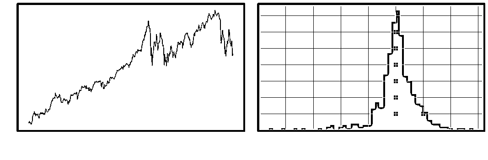
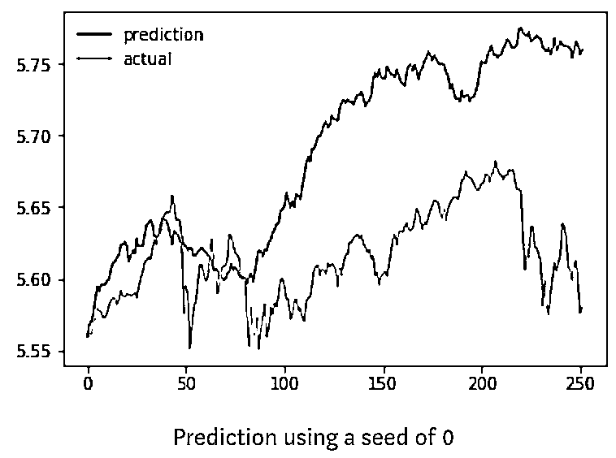
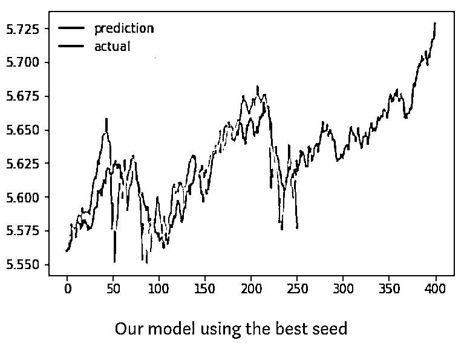
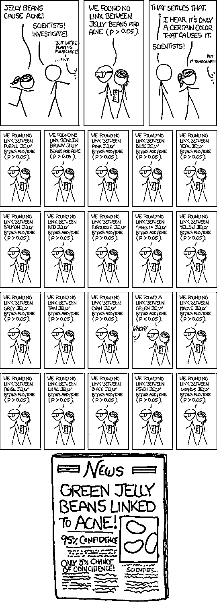

# 预测股市 | 如何避免 p-Hacking，为什么你要看涨？

> 原文：[`mp.weixin.qq.com/s?__biz=MzAxNTc0Mjg0Mg==&mid=2653289820&idx=1&sn=d3fee74ba1daab837433e4ef6b0ab4d9&chksm=802e3f49b759b65f422d20515942d5813aead73231da7d78e9f235bdb42386cf656079e69b8b&scene=27#wechat_redirect`](http://mp.weixin.qq.com/s?__biz=MzAxNTc0Mjg0Mg==&mid=2653289820&idx=1&sn=d3fee74ba1daab837433e4ef6b0ab4d9&chksm=802e3f49b759b65f422d20515942d5813aead73231da7d78e9f235bdb42386cf656079e69b8b&scene=27#wechat_redirect)


请**标星公众号★**，第一时间获取最新推文

***时 间 就 这 样 悄 无 声 息 的 溜 了***

**2018 年，就只剩下 5 天了**

作者 | Branko Blagojevic

编译 | 1+1=6

我们计算标普 500 指数过去一年的表现及每日回报率。但是过去两年的估值并不那么不稳定

```py
import datetime as dt
import matplotlib.pyplot as plt
import numpy as np
import pandas as pd
%matplotlib inline
stock = pd.read_csv("SPY.csv", index_col="Date")
cutoff = len(stock)//2
prices = pd.Series(stock.Close)
log_prices = np.log(prices)
deltas = pd.Series(np.diff(prices), index=stock.index[1:])
log_deltas = pd.Series(np.diff(log_prices), index=stock.index[1:])
latest_prices = stock.Close[cutoff:]
latest_log_prices = np.log(latest_prices)
latest_log_deltas = deltas[cutoff:]
prior_log_deltas = log_deltas[:cutoff]
prior_log_mean = np.mean(prior_log_deltas)
prior_log_std = np.std(prior_log_deltas)
f, axes = plt.subplots(ncols=2, figsize=(15,5))
prices.plot(ax=axes[0])
deltas.hist(bins=50, ax=axes[1])
f.autofmt_xdate()
f.tight_layout()
```



一些人尝试使用神经网络，特别是递归神经网络来预测市场回报。由于递归神经网络考虑了历史数据，因此对于时间序列数据是有用的。但这似乎有些过头了。神经网络不必要那么复杂。让我们看看是否可以**用随机数来拟合一个更简单的模型**！

**模型随机数发生器**

下面的预测函数根据历史标准差和平均收益率创建一组随机的正态分布日收益率。

```py
def predict(mean, std, size, seed=None):
    """ Returns a normal distribution based on given mean, standard deviation and size"""
    np.random.seed(seed)
    return np.random.normal(loc=mean, scale=std, size=size)
```

apply_returns 函数只将我们的收益应用于一个起始价格，从而得到一个预测的股票价格。

```py
def apply_returns(start, returns):
    """ Applies given periodic returns """
    cur = start
    prices = [start]
    for r in returns:
        cur += r
        prices.append(cur)
    return prices
```

最后，我们想要得到回报。有几种可能的分数我们可以用，但是我们用均方误差（MSE）。

```py
def score(actual, prediction):
    # mean square error
    return np.mean(np.square(actual - prediction))
```

把我们的预测可视化，通过结果来看总是很有用的。这就是比较的作用。

```py
def compare(prediction, actual):
    # plots a prediction over the actual series
    plt.plot(prediction, label="prediction")
    plt.plot(actual, label="actual")
    plt.legend()
```

我们来看看 seed=0 是怎么出来的。

```py
predict_deltas = predict(prior_log_deltas_mean, prior_log_deltas_std, latest_size, seed = 0)
start = latest_log_prices[0]
prediction = apply_returns(start, predict_deltas)
print("MSE: {:0.08f}".format(score(latest_log_prices, prediction)))
compare(prediction=prediction, actual=latest_log_prices.values)
MSE: 0.00797138
```



虽然不是很好，但这只是一个开始。我们的模型预测了今年早些时候的增长，但它肯定超过了预期。这就是我们希望优化模型 seed 值，以更好地去预测市场。

```py
predict_partial = lambda s: predict(mean = prior_log_deltas_mean, std = prior_log_deltas_std, size = latest_size, seed = s)
def find_best_seed(actual, predict_partial, score, start_seed, end_seed):
    best_so_far = None
    best_score = float("inf")
    start = actual[0]
    for s in range(start_seed, end_seed):
        print('\r{} / {}'.format(s, end_seed), end="")
        predict_deltas = predict_partial(s)
        predict_prices = apply_returns(start, predict_deltas)
        predict_score = score(actual, predict_prices)
        if predict_score < best_score:
            best_score = predict_score
            best_so_far = s
    return best_so_far, best_score
best_seed, best_score = find_best_seed(latest_log_prices, predict_partial, score, start_seed=0, end_seed=500000)
print("best seed: {} best MSE: {:0.08f}".format(best_seed, best_score))
best seed: 68105 best MSE: 0.00035640
```

经过 500k 的试验，我们将 p 值从 0.00797 降到了 0.0003564 。这是一个很大的进步。

历史性的表现是不错的，但我们想看看神奇的 seed 在接下来的几个月里会有什么表现。

```py
returns = predict(mean=prior_log_deltas_mean, std=prior_log_deltas_std, size=400, seed=best_seed)
prediction = apply_returns(start, returns)
compare(prediction, latest_log_prices.values)
compare(prediction, log_prices.values)
```



根据我们的模型，到今年年底，市场应该会开始回升，达到新的高度。

**p-Hacking**

在这里，公众号给大家普及一下什么事 p-Hacking：

**我们在统计时经常用到 P 值，一般认为 P≦0.05 有统计学意义。但是现在很多统计学家并不是这样认为，对于 P 值的滥用和误用进行了苛刻的批评**。因此出现了一个新词：P-hacking。

P-hacking 最早应该是美国宾夕法尼亚大学的 Simmons 和他的团队提出来的：

P-hacking 按照字面的意思来看是「P 值黑客]，但是实际上的意思科研动力认为是「P 值篡改」或者「P 值操纵」。这可能是在线都市词典收录的第一个统计词汇：

> *Exploiting –perhaps unconsciously - researcher degrees of freedom until p<.05.*

从词典给出的意思来看 P-hacking 是科研人员不断的尝试统计计算直到 p<.05，当然有时这可能是无意识的。在线都市词典还给出了例句：

> *That finding seems to have been obtained through p-hacking, the authors dropped one of the conditions so that the overall p-value would be less than .05.
> She is a p-hacker, she always monitors data while it is being collected.*

Simmons 等人也对 P-hacking 进行了定义：

> *P-hacking refers to the practice of reanalyzing data in many different ways to yield a target result. They, and more recently Motulsky, have described the variations on P-hacking, and the hazards, notably the likelihood of false positives—findings that statistics suggest are meaningful when they are no.*



有一些可重现性危机，一些科学家无法复制一些关键实验：

> *今年 8 月，《科学》杂志发表了一项名为“可复制性项目”（re - bility Project）的计划的成果。该计划是由非营利组织开放科学中心（Center for Open Science）协调的合作项目。参与者试图复制 100 个与实验相关的心理学研究，这些研究已经在三家著名的心理学杂志上发表。*
> 
> *媒体广泛报道的结果令人深思。只有 39 项研究被成功复制。*

我猜想，大部分原因是研究人员在发表具有统计学意义的结果之前进行了大量的试验。或者在试验过程中改变不同的参数。这就是所谓的**The garden of forking paths**，并不总是经过深思熟虑的。

文献地址：

***http://101.96.10.63/www.stat.columbia.edu/~gelman/research/unpublished/p_hacking.pdf***

> *Researcher degrees of freedom can lead to a multiple comparisons problem, even in settings where researchers perform only a single analysis on their data. The problem is there can be a large number of potential comparisons when the details of data analysis are highly contingent on data, without the researcher having to perform any conscious procedure of fishing or examining multiple p-values*

经济和金融预测很容易受到这些偏差的影响。我听经济学家经常说，因子 X 的 N 个月滞后是 y 的一个指标，为什么 N 个月滞后？1 - (N-1)的滞后还没有解决。

**避免 p-Hacking**

在你自己的研究中避免 p-Hacking 的一个好的方法是：从一开始就对自己诚实。仔细考虑并记录你想要测试的所有内容。如果你想测试 20 个不同的因素，请在开始测试之前指定这些因素，并在评估指标时考虑所有 20 个因素。

但最重要的是，想想你自己的模型在做什么。神经网络有时被认为是黑箱，从某种意义上说，的确如此，但是你应该批判性地回顾每一步。如果你正在进行图像识别，请观察每一层的激活，大致了解该层的激活基于什么。如果你正在进行强化学习来玩游戏，看看你是否能够大致理解逻辑是如何工作的。如果你正在进行自然语言处理，请考虑与同义词、反义词和相关单词有关的词向量。

**如果你在做股票市场分析，问问自己你真正想从模型中得到什么**。为什么某些因素的第 n 个延迟是一个预测因素？为什么以前的收益会影响未来的收益？你为什么只考虑最近的 N 次收益？为什么要预测一个（每天、每小时、每分钟）的周期？你为什么要考虑从 X 到 Y 这段时间？为什么验证到 Z？

将股票增量输入到一个递归神经网络中就可以达到减少损失的目的，但是有了解释，你也可以将这些值拟合到一个随机数生成器中。

文章来源：

https://medium.com/ml-everything/predicting-the-stock-market-p-hacking-and-why-you-should-be-bullish-90fddc583838

**推荐阅读**

[01、经过多年交易之后你应该学到的东西（深度分享）](https://mp.weixin.qq.com/s?__biz=MzAxNTc0Mjg0Mg==&mid=2653289074&idx=1&sn=e859d363eef9249236244466a1af41b6&chksm=802e3867b759b1717f77e07a51ee5671e8115130c66562577280ba1243cba08218add04f1f00&token=449379994&lang=zh_CN&scene=21#wechat_redirect)

[02、监督学习标签在股市中的应用（代码+书籍）](https://mp.weixin.qq.com/s?__biz=MzAxNTc0Mjg0Mg==&mid=2653289050&idx=1&sn=60043a5c95b877dd329a5fd150ddacc4&chksm=802e384fb759b1598e500087374772059aa21b31ae104b3dca04331cf4b63a233c5e04c1945a&token=449379994&lang=zh_CN&scene=21#wechat_redirect)

[03、全球投行顶尖机器学习团队全面分析](https://mp.weixin.qq.com/s?__biz=MzAxNTc0Mjg0Mg==&mid=2653289018&idx=1&sn=8c411f676c2c0d92b0dd218f041bee4b&chksm=802e382fb759b139ffebf633ac14cdd0f21938e4613fe632d5d9231dab3d2aca95a11628378a&token=449379994&lang=zh_CN&scene=21#wechat_redirect)

[04、使用 Tensorflow 预测股票市场变动](https://mp.weixin.qq.com/s?__biz=MzAxNTc0Mjg0Mg==&mid=2653289014&idx=1&sn=3762d405e332c599a21b48a7dc4df587&chksm=802e3823b759b135928d55044c2729aea9690f86752b680eb973d1a376dc53cfa18287d0060b&token=449379994&lang=zh_CN&scene=21#wechat_redirect)

[05、使用 LSTM 预测股票市场基于 Tensorflow](https://mp.weixin.qq.com/s?__biz=MzAxNTc0Mjg0Mg==&mid=2653289238&idx=1&sn=3144f5792f84455dd53c27a78e8a316c&chksm=802e3903b759b015da88acde4fcbc8547ab3e6acbb5a0897404bbefe1d8a414265d5d5766ee4&token=2020206794&lang=zh_CN&scene=21#wechat_redirect)

[06、美丽的回测——教你定量计算过拟合概率](https://mp.weixin.qq.com/s?__biz=MzAxNTc0Mjg0Mg==&mid=2653289314&idx=1&sn=87c5a12b23a875966db7be50d11f09cd&chksm=802e3977b759b061675d1988168c1fec06c602e8583fbcc9b76f87008e0c10b702acc85467a0&token=1972390229&lang=zh_CN&scene=21#wechat_redirect)

[07、利用动态深度学习预测金融时间序列基于 Python](https://mp.weixin.qq.com/s?__biz=MzAxNTc0Mjg0Mg==&mid=2653289347&idx=1&sn=bf5d7899bc4a854d4ba9046fdc6fe0d6&chksm=802e3996b759b080287213840987bb0a0c02e4e1d4d7aae23f10a225a92ef6dd922d8006123d&token=290397496&lang=zh_CN&scene=21#wechat_redirect)

[08、Facebook 开源神器 Prophet 预测时间序列基于 Python](https://mp.weixin.qq.com/s?__biz=MzAxNTc0Mjg0Mg==&mid=2653289394&idx=1&sn=24a836136d730aa268605628e683d629&chksm=802e39a7b759b0b1dcf7aaa560699130a907716b71fc9c45ff0e5d236c5ae8ef80ebdb09dbb6&token=290397496&lang=zh_CN&scene=21#wechat_redirect)

[09、Facebook 开源神器 Prophet 预测股市行情基于 Python](https://mp.weixin.qq.com/s?__biz=MzAxNTc0Mjg0Mg==&mid=2653289437&idx=1&sn=f0dca7da8e69e7ba736992cb3d034ce7&chksm=802e39c8b759b0de5bce401c580623d0729ecca69d13926479d36e19aff8c9c9e8a20265afff&token=290397496&lang=zh_CN&scene=21#wechat_redirect)

[10、2018 第三季度最受欢迎的券商金工研报前 50（附下载）](https://mp.weixin.qq.com/s?__biz=MzAxNTc0Mjg0Mg==&mid=2653289358&idx=1&sn=db6e8ab85b08f6e67790ec0e401e586e&chksm=802e399bb759b08d6eec855f9901ea856d0da68c7425cba62791b8948da6ad761a3d88543dad&token=290397496&lang=zh_CN&scene=21#wechat_redirect)

[11、实战交易策略的精髓（公众号深度呈现）](https://mp.weixin.qq.com/s?__biz=MzAxNTc0Mjg0Mg==&mid=2653289447&idx=1&sn=f2948715bf82569a6556d518e56c1f9e&chksm=802e39f2b759b0e4502d1aaac562b87789573b55c76b3c85897d8c9d88dbf9a0b7ee34d86a4e&token=290397496&lang=zh_CN&scene=21#wechat_redirect)

[12、Markowitz 有效边界和投资组合优化基于 Python](https://mp.weixin.qq.com/s?__biz=MzAxNTc0Mjg0Mg==&mid=2653289478&idx=1&sn=f8e01a641be021993d8ef2d84e94a299&chksm=802e3e13b759b7055cf27a280c672371008a5564c97c658eee89ce8481396a28d254836ff9af&token=290397496&lang=zh_CN&scene=21#wechat_redirect)

[13、使用 LSTM 模型预测股价基于 Keras](https://mp.weixin.qq.com/s?__biz=MzAxNTc0Mjg0Mg==&mid=2653289495&idx=1&sn=c4eeaa2e9f9c10995be9ea0c56d29ba7&chksm=802e3e02b759b7148227675c23c403fb9a543b733e3d27fa237b53840e030bf387a473d83e3c&token=1260956004&lang=zh_CN&scene=21#wechat_redirect)

[14、量化金融导论 1：资产收益的程式化介绍基于 Python](https://mp.weixin.qq.com/s?__biz=MzAxNTc0Mjg0Mg==&mid=2653289507&idx=1&sn=f0ca71aa07531bbbdbd33213f0bab89f&chksm=802e3e36b759b720138b3b17a4dd0e198e054b9de29a038fdd50805f824effa55831111ad026&token=1936245282&lang=zh_CN&scene=21#wechat_redirect)

[15、预测股市崩盘基于统计机器学习与神经网络（Python+文档）](https://mp.weixin.qq.com/s?__biz=MzAxNTc0Mjg0Mg==&mid=2653289533&idx=1&sn=4ef964834e84a9995111bb057b0fc5dd&chksm=802e3e28b759b73e0618eb1262c53aa0601fbf5805525a7c7ff40dc3db62c7704496611bdbf1&token=1950551577&lang=zh_CN&scene=21#wechat_redirect)

[16、实现最优投资组合有效前沿基于 Python（附代码）](https://mp.weixin.qq.com/s?__biz=MzAxNTc0Mjg0Mg==&mid=2653289609&idx=1&sn=c7f0b3e47025862d10bb53b6ab88bcda&chksm=802e3e9cb759b78abf6b8b049c59bf18ccfb2ead7580d1f557d36de2292f59dcbd94dcd41910&token=2085008037&lang=zh_CN&scene=21#wechat_redirect)

[17、精心为大家整理了一些超级棒的机器学习资料（附链接）](https://mp.weixin.qq.com/s?__biz=MzAxNTc0Mjg0Mg==&mid=2653289615&idx=1&sn=1cdc89afb997d0c580bf0cef296d946c&chksm=802e3e9ab759b78ce9f0cd152a680d4a413d6c8dcb02a7a296f4091993a7e4137e7520394575&token=2085008037&lang=zh_CN&scene=21#wechat_redirect)

[18、海量 Wind 数据，与全网用户零距离邂逅！](https://mp.weixin.qq.com/s?__biz=MzAxNTc0Mjg0Mg==&mid=2653289623&idx=1&sn=28a3600fd7a72d7be00b066ca0f98244&chksm=802e3e82b759b7943f43a4f6ef4a91e4153fa6b8210de9590235fa8ee66eb9811ce177054dbc&token=1389401983&lang=zh_CN&scene=21#wechat_redirect)

[19、机器学习、深度学习、量化金融、Python 等最新书籍汇总下载](https://mp.weixin.qq.com/s?__biz=MzAxNTc0Mjg0Mg==&mid=2653289640&idx=1&sn=34e94fcbe99052b8e7381ecc48a36dc0&chksm=802e3ebdb759b7ab897cd329a680715b6f8294e63550ddf0c57b9e1320b2b7d1408c6fdca0c7&token=1389401983&lang=zh_CN&scene=21#wechat_redirect)

[20、各大卖方 2019 年 A 股策略报告，都是有故事的人！](https://mp.weixin.qq.com/s?__biz=MzAxNTc0Mjg0Mg==&mid=2653289725&idx=1&sn=4b65cd1fb8331438e4c0b3d0eae6b51f&chksm=802e3ee8b759b7fe1b94e84d54cc23b0ab05853d5cd227812574b350e9fc2cce9e5f1bc6cb7a&token=1389401983&lang=zh_CN&scene=21#wechat_redirect)

[21、京东量化平台宣告下线，其他平台该何去何从？](https://mp.weixin.qq.com/s?__biz=MzAxNTc0Mjg0Mg==&mid=2653289787&idx=1&sn=ba9c0b62af511c708db58696f62ac0fb&chksm=802e3f2eb759b638aea077ae127e447333da71f112fc15284f1632a3e5e822f33a1a61e6f09b&token=1389401983&lang=zh_CN&scene=21#wechat_redirect)

**公众号官方 QQ 群**

**量化、技术人士深度交流群**

