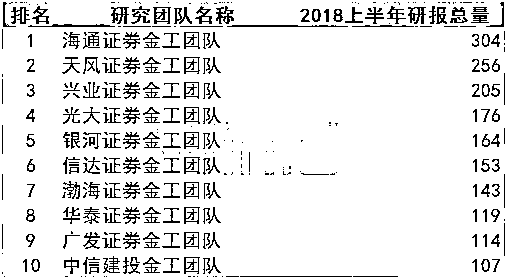
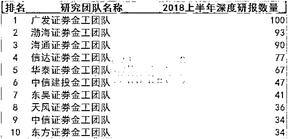
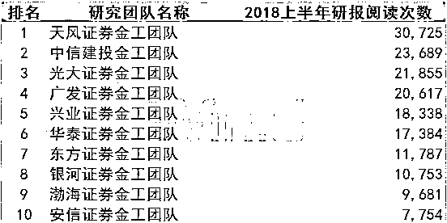
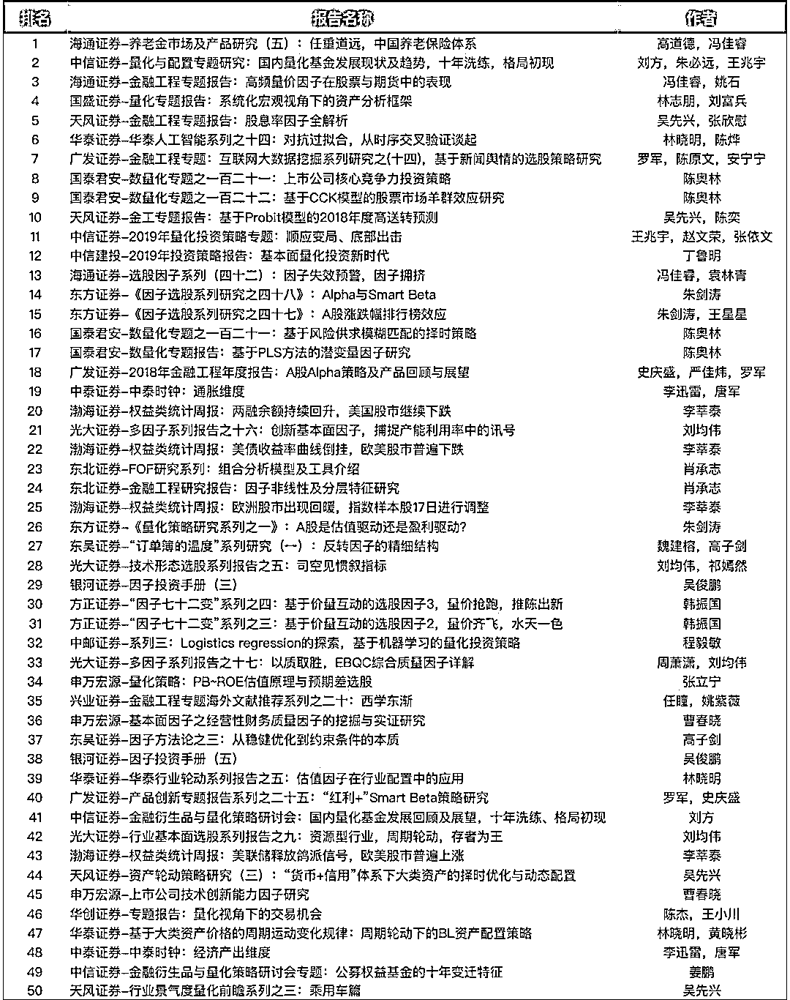

# 二千零一十八、最后一期 | 所有券商金工热点研报前 50（附下载）

> 原文：[`mp.weixin.qq.com/s?__biz=MzAxNTc0Mjg0Mg==&mid=2653289804&idx=1&sn=6234ec52657b302f9bee3c46a74823e1&chksm=802e3f59b759b64f0e393987a5897f1198b4fba64373e4d8b79f51d63f09aed8eef361f78e88&scene=27#wechat_redirect`](http://mp.weixin.qq.com/s?__biz=MzAxNTc0Mjg0Mg==&mid=2653289804&idx=1&sn=6234ec52657b302f9bee3c46a74823e1&chksm=802e3f59b759b64f0e393987a5897f1198b4fba64373e4d8b79f51d63f09aed8eef361f78e88&scene=27#wechat_redirect)

请**标星公众号**，第一时间获取最新推文

***时 间 就 这 样 悄 无 声 息 的 溜 了***

**2018 年，就只剩下 7 天了**

2018 上半年，Wind 资讯推出了一篇文章。统计了 2018 年上半年近百家券商研究所表现情况。在这里，公众号作为量化领域相关的自媒体，仅对**金融工程**做回顾。

**下载研报看文末**

**金融工程篇**

2018 上半年，**海通证券**、**天风证券**、**兴业证券**的金融工程研究团队发布的研报总量位居前三。

虽广发证券研报总量排名第九，但其深度研报有 100 份，占据深度研报总量的榜首。

此外，渤海证券、华泰证券的深度研报占比均较高，分别为 65%、56%。**天风证券金工团队的研报阅读量位居第一。**

**研报总量 TOP10**

**深度研报总量 TOP10**

**研报阅读总次数 TOP10**

**编辑部的话**

从 2018 年起，公众号不再对发布券商金工研报全年下载。目前，我们只对当年不定期月度的热点研报进行分享。

**2018 快至年末，我们也在第一时间给大家分享今年最后一次研报推送。**

2018 年 11、12 月**热点研报**涉及股票、机器学习、多因子、基本面等主题共计 50 篇。

**（排名根据互联网综合统计，仅代表公众号观点）**

**往期金工研报汇总**

**综合**

[各大券商 1](http://mp.weixin.qq.com/s?__biz=MzAxNTc0Mjg0Mg==&mid=2653283257&idx=2&sn=49c78925e7f3535b9cad95bf91574519&scene=21#wechat_redirect) | [各大券商 2](http://mp.weixin.qq.com/s?__biz=MzAxNTc0Mjg0Mg==&mid=2653283773&idx=1&sn=d4604682da0c5563be9da16717d11bf9&scene=21#wechat_redirect) 

[海通（百篇）](http://mp.weixin.qq.com/s?__biz=MzAxNTc0Mjg0Mg==&mid=2653284202&idx=1&sn=f94bdefe70ddcb538ca463ba1c5e5205&chksm=802e257fb759ac69899d8544937600c22637697591fce25d1ed1b72414d975eeeba7cc58c9d8&scene=21#wechat_redirect) |  [广发（最全）](http://mp.weixin.qq.com/s?__biz=MzAxNTc0Mjg0Mg==&mid=2653284199&idx=1&sn=4ec9cac078f8057744349c9c953decb2&chksm=802e2572b759ac6438362451289132ab4bb631da5b41e9f2b2545eb5efe50e0d14d6bd3d3015&scene=21#wechat_redirect) | [国泰君安（精华）](http://mp.weixin.qq.com/s?__biz=MzAxNTc0Mjg0Mg==&mid=2653284196&idx=1&sn=85245caf9148fb965df1c56c963984ba&chksm=802e2571b759ac6772582aea40781bddd6f148f144edc9b8b08606749f3c2c012b907441d59d&scene=21#wechat_redirect)

**2016 年金工共 600 篇**

[第 1 部分](http://mp.weixin.qq.com/s?__biz=MzAxNTc0Mjg0Mg==&mid=2653284668&idx=1&sn=1d099b61ac8a378f39ef99203cfb85af&chksm=802e2b29b759a23f1ce824e84ab55601f8da41ace7877cac3fe97900f1a7147c97a732481841&scene=21#wechat_redirect) | [第 2-4 部分](http://mp.weixin.qq.com/s?__biz=MzAxNTc0Mjg0Mg==&mid=2653284678&idx=1&sn=0c29d884ada86f565b5849057fe5cdb6&chksm=802e2b53b759a245db87fe77c211e8f987464d0d188305808b412fb2d36cbc9f4bb707fedde9&scene=21#wechat_redirect) | [第 5-9 部分](http://mp.weixin.qq.com/s?__biz=MzAxNTc0Mjg0Mg==&mid=2653284702&idx=1&sn=c150e541adb6f852459b085a086bf97f&chksm=802e2b4bb759a25de30c981d25e8db6c90e409e0c8ec5303ad0b3fa673abfc01fd4832842c16&scene=21#wechat_redirect)

**2017 年金工全年 1000+篇**

[1-3 月](https://mp.weixin.qq.com/s?__biz=MzAxNTc0Mjg0Mg==&mid=2653286032&idx=1&sn=f931e3de55ba425049553d524173b57e&chksm=802e2c85b759a5935002ab01161a92be5ba6c7a5ba64ad12d8be55490fa328973835008ab2dc&scene=21#wechat_redirect) | [4-6 月](https://mp.weixin.qq.com/s?__biz=MzAxNTc0Mjg0Mg==&mid=2653286032&idx=1&sn=f931e3de55ba425049553d524173b57e&chksm=802e2c85b759a5935002ab01161a92be5ba6c7a5ba64ad12d8be55490fa328973835008ab2dc&scene=21#wechat_redirect) | [7 月](https://mp.weixin.qq.com/s?__biz=MzAxNTc0Mjg0Mg==&mid=2653286133&idx=1&sn=c8ef7e2df827698971c71c270ec08a65&chksm=802e2ce0b759a5f63de0fb7f635e8959c4f25a5c761d165a0a2312d08e48e48e408dde572642&scene=21#wechat_redirect) | [8 月](https://mp.weixin.qq.com/s?__biz=MzAxNTc0Mjg0Mg==&mid=2653286262&idx=1&sn=8fe879fc4a5189cf027b7496da82681f&chksm=802e2d63b759a47535c7a0dfe279672f10821edcdeb49c6f099a7388feef39e8faeb2aaf30e3&scene=21#wechat_redirect) | 9 月 | [10 月](https://mp.weixin.qq.com/s?__biz=MzAxNTc0Mjg0Mg==&mid=2653286510&idx=1&sn=b64aab20dc1ba2e56776aa34090d361d&chksm=802e327bb759bb6d558caf6a2aaf4e86bfaf31a3558573f58c7f5f24d1526756ec0ac1d3a820&scene=21#wechat_redirect) | [11 月](https://mp.weixin.qq.com/s?__biz=MzAxNTc0Mjg0Mg==&mid=2653286772&idx=1&sn=f8ca457e87587ed73aa3d81903336db5&chksm=802e3361b759ba7775e1879e1c8a0b9b917d9ff43649e68c85b17b434d516acfc0ec758968a7&scene=21#wechat_redirect) | [12 月](https://mp.weixin.qq.com/s?__biz=MzAxNTc0Mjg0Mg==&mid=2653287361&idx=1&sn=b659d13209d14bfc2cc9865ca1c42042&chksm=802e31d4b759b8c2548c5f128f0a7b6d59dbc3a89b2f8f49fcdf197736ad2cb1c25182928e51&scene=21#wechat_redirect)

**2017 年全年热点**

## [2017 年最热门的 50 篇券商金工研报](https://mp.weixin.qq.com/s?__biz=MzAxNTc0Mjg0Mg==&mid=2653287411&idx=1&sn=f1151b0ad87f5b45e99aca7ddf1f412e&chksm=802e31e6b759b8f064653deee672eb2fb6d73e4743a077b3456659e1f9b58c7cfe8e3ff1271b&scene=21#wechat_redirect)

**2018 热点（1 月-10 月）**

[热点 1](https://mp.weixin.qq.com/s?__biz=MzAxNTc0Mjg0Mg==&mid=2653288446&idx=1&sn=9c9eff76734dc2a9f1b046eb9184704a&chksm=802e35ebb759bcfdf5843d5b0892c8c2142e15a62454e31846fd979c215ae56ebab2a717cefa&scene=21#wechat_redirect) | [热点 2](https://mp.weixin.qq.com/s?__biz=MzAxNTc0Mjg0Mg==&mid=2653288146&idx=1&sn=bd43689e8b566872b93a6026f35480cc&chksm=802e34c7b759bdd1efa8b23b409321c14f3f056ad11375f28ca603a4315237a852f159b0fe55&scene=21#wechat_redirect) | [热点 3](https://mp.weixin.qq.com/s?__biz=MzAxNTc0Mjg0Mg==&mid=2653288683&idx=1&sn=e986298df44c954e405f01814c0745a7&chksm=802e3afeb759b3e824b7de6aac11e857fc306ad06f7afe466209923726d3a423aa65f0cf611e&token=1389401983&lang=zh_CN&scene=21#wechat_redirect)

**推荐阅读**

[01、经过多年交易之后你应该学到的东西（深度分享）](https://mp.weixin.qq.com/s?__biz=MzAxNTc0Mjg0Mg==&mid=2653289074&idx=1&sn=e859d363eef9249236244466a1af41b6&chksm=802e3867b759b1717f77e07a51ee5671e8115130c66562577280ba1243cba08218add04f1f00&token=449379994&lang=zh_CN&scene=21#wechat_redirect)

[02、监督学习标签在股市中的应用（代码+书籍）](https://mp.weixin.qq.com/s?__biz=MzAxNTc0Mjg0Mg==&mid=2653289050&idx=1&sn=60043a5c95b877dd329a5fd150ddacc4&chksm=802e384fb759b1598e500087374772059aa21b31ae104b3dca04331cf4b63a233c5e04c1945a&token=449379994&lang=zh_CN&scene=21#wechat_redirect)

[03、全球投行顶尖机器学习团队全面分析](https://mp.weixin.qq.com/s?__biz=MzAxNTc0Mjg0Mg==&mid=2653289018&idx=1&sn=8c411f676c2c0d92b0dd218f041bee4b&chksm=802e382fb759b139ffebf633ac14cdd0f21938e4613fe632d5d9231dab3d2aca95a11628378a&token=449379994&lang=zh_CN&scene=21#wechat_redirect)

[04、使用 Tensorflow 预测股票市场变动](https://mp.weixin.qq.com/s?__biz=MzAxNTc0Mjg0Mg==&mid=2653289014&idx=1&sn=3762d405e332c599a21b48a7dc4df587&chksm=802e3823b759b135928d55044c2729aea9690f86752b680eb973d1a376dc53cfa18287d0060b&token=449379994&lang=zh_CN&scene=21#wechat_redirect)

[05、使用 LSTM 预测股票市场基于 Tensorflow](https://mp.weixin.qq.com/s?__biz=MzAxNTc0Mjg0Mg==&mid=2653289238&idx=1&sn=3144f5792f84455dd53c27a78e8a316c&chksm=802e3903b759b015da88acde4fcbc8547ab3e6acbb5a0897404bbefe1d8a414265d5d5766ee4&token=2020206794&lang=zh_CN&scene=21#wechat_redirect)

[06、美丽的回测——教你定量计算过拟合概率](https://mp.weixin.qq.com/s?__biz=MzAxNTc0Mjg0Mg==&mid=2653289314&idx=1&sn=87c5a12b23a875966db7be50d11f09cd&chksm=802e3977b759b061675d1988168c1fec06c602e8583fbcc9b76f87008e0c10b702acc85467a0&token=1972390229&lang=zh_CN&scene=21#wechat_redirect)

[07、利用动态深度学习预测金融时间序列基于 Python](https://mp.weixin.qq.com/s?__biz=MzAxNTc0Mjg0Mg==&mid=2653289347&idx=1&sn=bf5d7899bc4a854d4ba9046fdc6fe0d6&chksm=802e3996b759b080287213840987bb0a0c02e4e1d4d7aae23f10a225a92ef6dd922d8006123d&token=290397496&lang=zh_CN&scene=21#wechat_redirect)

[08、Facebook 开源神器 Prophet 预测时间序列基于 Python](https://mp.weixin.qq.com/s?__biz=MzAxNTc0Mjg0Mg==&mid=2653289394&idx=1&sn=24a836136d730aa268605628e683d629&chksm=802e39a7b759b0b1dcf7aaa560699130a907716b71fc9c45ff0e5d236c5ae8ef80ebdb09dbb6&token=290397496&lang=zh_CN&scene=21#wechat_redirect)

[09、Facebook 开源神器 Prophet 预测股市行情基于 Python](https://mp.weixin.qq.com/s?__biz=MzAxNTc0Mjg0Mg==&mid=2653289437&idx=1&sn=f0dca7da8e69e7ba736992cb3d034ce7&chksm=802e39c8b759b0de5bce401c580623d0729ecca69d13926479d36e19aff8c9c9e8a20265afff&token=290397496&lang=zh_CN&scene=21#wechat_redirect)

[10、2018 第三季度最受欢迎的券商金工研报前 50（附下载）](https://mp.weixin.qq.com/s?__biz=MzAxNTc0Mjg0Mg==&mid=2653289358&idx=1&sn=db6e8ab85b08f6e67790ec0e401e586e&chksm=802e399bb759b08d6eec855f9901ea856d0da68c7425cba62791b8948da6ad761a3d88543dad&token=290397496&lang=zh_CN&scene=21#wechat_redirect)

[11、实战交易策略的精髓（公众号深度呈现）](https://mp.weixin.qq.com/s?__biz=MzAxNTc0Mjg0Mg==&mid=2653289447&idx=1&sn=f2948715bf82569a6556d518e56c1f9e&chksm=802e39f2b759b0e4502d1aaac562b87789573b55c76b3c85897d8c9d88dbf9a0b7ee34d86a4e&token=290397496&lang=zh_CN&scene=21#wechat_redirect)

[12、Markowitz 有效边界和投资组合优化基于 Python](https://mp.weixin.qq.com/s?__biz=MzAxNTc0Mjg0Mg==&mid=2653289478&idx=1&sn=f8e01a641be021993d8ef2d84e94a299&chksm=802e3e13b759b7055cf27a280c672371008a5564c97c658eee89ce8481396a28d254836ff9af&token=290397496&lang=zh_CN&scene=21#wechat_redirect)

[13、使用 LSTM 模型预测股价基于 Keras](https://mp.weixin.qq.com/s?__biz=MzAxNTc0Mjg0Mg==&mid=2653289495&idx=1&sn=c4eeaa2e9f9c10995be9ea0c56d29ba7&chksm=802e3e02b759b7148227675c23c403fb9a543b733e3d27fa237b53840e030bf387a473d83e3c&token=1260956004&lang=zh_CN&scene=21#wechat_redirect)

[14、量化金融导论 1：资产收益的程式化介绍基于 Python](https://mp.weixin.qq.com/s?__biz=MzAxNTc0Mjg0Mg==&mid=2653289507&idx=1&sn=f0ca71aa07531bbbdbd33213f0bab89f&chksm=802e3e36b759b720138b3b17a4dd0e198e054b9de29a038fdd50805f824effa55831111ad026&token=1936245282&lang=zh_CN&scene=21#wechat_redirect)

[15、预测股市崩盘基于统计机器学习与神经网络（Python+文档）](https://mp.weixin.qq.com/s?__biz=MzAxNTc0Mjg0Mg==&mid=2653289533&idx=1&sn=4ef964834e84a9995111bb057b0fc5dd&chksm=802e3e28b759b73e0618eb1262c53aa0601fbf5805525a7c7ff40dc3db62c7704496611bdbf1&token=1950551577&lang=zh_CN&scene=21#wechat_redirect)

[16、实现最优投资组合有效前沿基于 Python（附代码）](https://mp.weixin.qq.com/s?__biz=MzAxNTc0Mjg0Mg==&mid=2653289609&idx=1&sn=c7f0b3e47025862d10bb53b6ab88bcda&chksm=802e3e9cb759b78abf6b8b049c59bf18ccfb2ead7580d1f557d36de2292f59dcbd94dcd41910&token=2085008037&lang=zh_CN&scene=21#wechat_redirect)

[17、精心为大家整理了一些超级棒的机器学习资料（附链接）](https://mp.weixin.qq.com/s?__biz=MzAxNTc0Mjg0Mg==&mid=2653289615&idx=1&sn=1cdc89afb997d0c580bf0cef296d946c&chksm=802e3e9ab759b78ce9f0cd152a680d4a413d6c8dcb02a7a296f4091993a7e4137e7520394575&token=2085008037&lang=zh_CN&scene=21#wechat_redirect)

[18、海量 Wind 数据，与全网用户零距离邂逅！](https://mp.weixin.qq.com/s?__biz=MzAxNTc0Mjg0Mg==&mid=2653289623&idx=1&sn=28a3600fd7a72d7be00b066ca0f98244&chksm=802e3e82b759b7943f43a4f6ef4a91e4153fa6b8210de9590235fa8ee66eb9811ce177054dbc&token=1389401983&lang=zh_CN&scene=21#wechat_redirect)

[19、机器学习、深度学习、量化金融、Python 等最新书籍汇总下载](https://mp.weixin.qq.com/s?__biz=MzAxNTc0Mjg0Mg==&mid=2653289640&idx=1&sn=34e94fcbe99052b8e7381ecc48a36dc0&chksm=802e3ebdb759b7ab897cd329a680715b6f8294e63550ddf0c57b9e1320b2b7d1408c6fdca0c7&token=1389401983&lang=zh_CN&scene=21#wechat_redirect)

[20、各大卖方 2019 年 A 股策略报告，都是有故事的人！](https://mp.weixin.qq.com/s?__biz=MzAxNTc0Mjg0Mg==&mid=2653289725&idx=1&sn=4b65cd1fb8331438e4c0b3d0eae6b51f&chksm=802e3ee8b759b7fe1b94e84d54cc23b0ab05853d5cd227812574b350e9fc2cce9e5f1bc6cb7a&token=1389401983&lang=zh_CN&scene=21#wechat_redirect)

[21、京东量化平台宣告下线，其他平台该何去何从？](https://mp.weixin.qq.com/s?__biz=MzAxNTc0Mjg0Mg==&mid=2653289787&idx=1&sn=ba9c0b62af511c708db58696f62ac0fb&chksm=802e3f2eb759b638aea077ae127e447333da71f112fc15284f1632a3e5e822f33a1a61e6f09b&token=1389401983&lang=zh_CN&scene=21#wechat_redirect)

**公众号官方 QQ 群**

**量化、技术人士深度交流群**

**下载本期热点研报**

在**后台**输入

**20181223**

**后台获取方式介绍**

**一言不合就给我好看**

