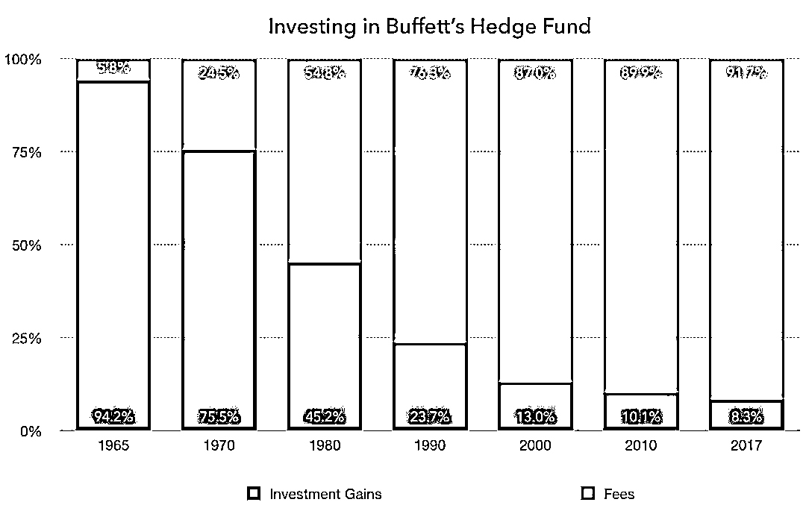
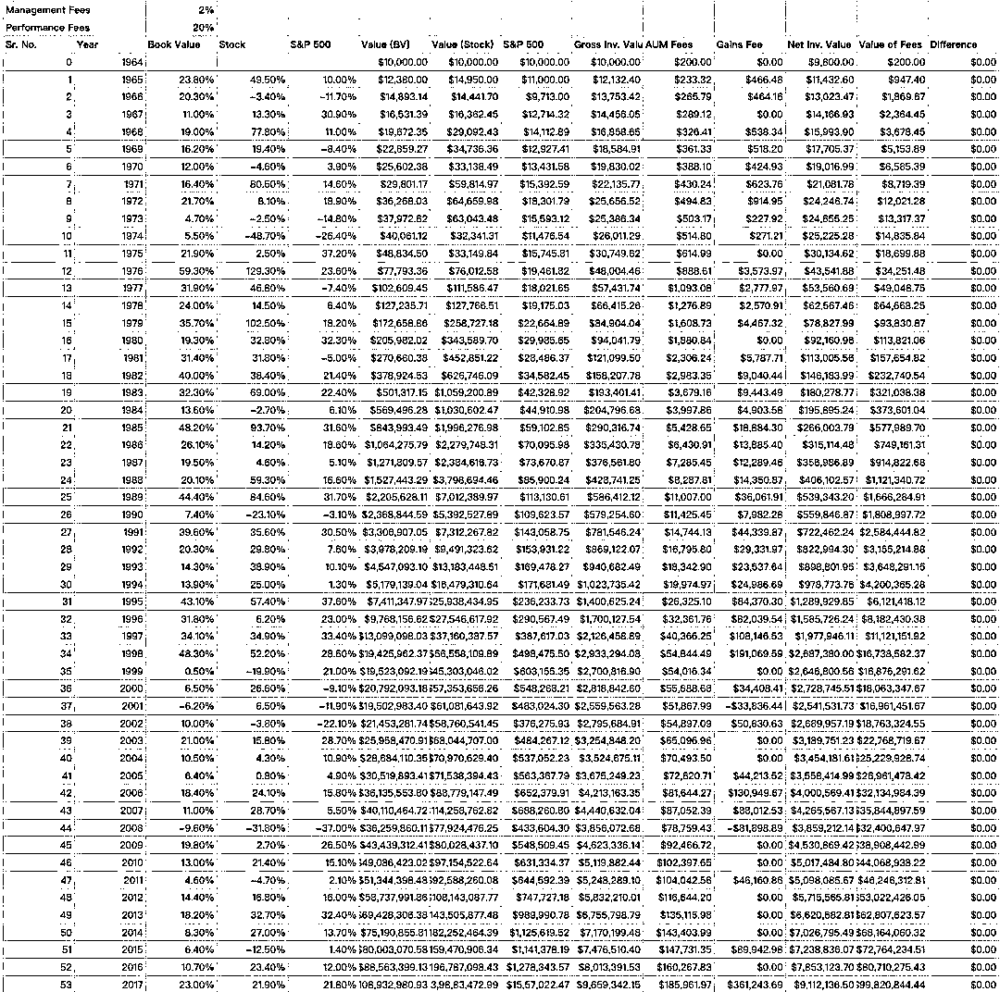

# 如果巴菲特设立对冲基金，会是怎样？

> 原文：[`mp.weixin.qq.com/s?__biz=MzAxNTc0Mjg0Mg==&mid=2653289797&idx=1&sn=40ef31fbb748a19196adce1198756b1f&chksm=802e3f50b759b64685ff7654aa913a733a3c3c6b7d37743d0cdacf3d6adbfe4f27f867fe9f48&scene=27#wechat_redirect`](http://mp.weixin.qq.com/s?__biz=MzAxNTc0Mjg0Mg==&mid=2653289797&idx=1&sn=40ef31fbb748a19196adce1198756b1f&chksm=802e3f50b759b64685ff7654aa913a733a3c3c6b7d37743d0cdacf3d6adbfe4f27f867fe9f48&scene=27#wechat_redirect)

***时 间 就 这 样 悄 无 声 息 的 溜 了***

**2018 年，就只剩下 8 天了**

作者：Vikas Bardia | Medium 

编译：1+1=6

**推荐阅读**

## 1、[机器学习、深度学习、量化金融、Python 最新书籍汇总](https://mp.weixin.qq.com/s?__biz=MzAxNTc0Mjg0Mg==&mid=2653289640&idx=1&sn=34e94fcbe99052b8e7381ecc48a36dc0&chksm=802e3ebdb759b7ab897cd329a680715b6f8294e63550ddf0c57b9e1320b2b7d1408c6fdca0c7&token=1883102744&lang=zh_CN&scene=21#wechat_redirect)

## [2、海量 Wind 数据，与全网用户零距离邂逅！](https://mp.weixin.qq.com/s?__biz=MzAxNTc0Mjg0Mg==&mid=2653289623&idx=1&sn=28a3600fd7a72d7be00b066ca0f98244&chksm=802e3e82b759b7943f43a4f6ef4a91e4153fa6b8210de9590235fa8ee66eb9811ce177054dbc&token=1883102744&lang=zh_CN&scene=21#wechat_redirect)

## [3、超级棒的机器学习资料下载](https://mp.weixin.qq.com/s?__biz=MzAxNTc0Mjg0Mg==&mid=2653289615&idx=1&sn=1cdc89afb997d0c580bf0cef296d946c&chksm=802e3e9ab759b78ce9f0cd152a680d4a413d6c8dcb02a7a296f4091993a7e4137e7520394575&token=1883102744&lang=zh_CN&scene=21#wechat_redirect)

每年 2 月/3 月，巴菲特都会给伯克希尔哈撒韦公司（Berkshire Hathaway）的股东们写一封年度信，详细阐述他对过去、现在和未来的见解和看法。

在每封信的开头都是伯克希尔的历史表现，以账面价值变化百分比和股价变化百分比来衡量，和该年度标普 500 指数作为基准的回报率。自 1965 年接管伯克希尔哈撒韦公司（Berkshire Hathaway）以来，这位世界上最成功的投资者已经为股东和自己赚了数十亿美元，过去 53 年的年复合增长率高达 20%。

Let that sink in — **53 years!**

1965 年至 2017 年间，伯克希尔哈撒韦的账面价值年均增长 19.1%。同期，标准普尔 500 指数的回报率为 9.9%，其中包括股息。伯克希尔哈撒韦公司的¥10000 投资，扣除所有成本在今天增长到令人难以置信的¥10.89 亿。

然而，如果不投资巴菲特运营的伯克希尔哈撒韦公司，而是投资其设立的对冲基金。收取与其他公司类似的 2/20 费用（即 2%的管理费+ 20%的收益），¥10000 的投资只会变成¥89 万，余剩下的¥10 亿将被巴菲特纳入囊中！

随着时间的推移，由于看似正常的管理费，大部分钱都流向了基金经理。

这里有几点假设需要注意：

> 1、管理费在每年年初扣除；
> 
> 2、每年年底，巴菲特基金支付 20%的绩效费（按收益计算），其表现优于标准普尔 500 指数。这一扣除反映在第二年年初；
> 
> 3、所得费用将再投资于本基金，并获得与本基金相同的回报。这种情况在实际操作中很少发生，因为钱是花出去的，奖金是发出去的等等。然而，它仍然显示了投资者损失的价值；
> 
> 4、在现实中，人们更关心股价的变化，而不是账面价值。在这种情况下，如果采用 2/20 的收费结构，赚取的费用与产生的价值之间的差额甚至会更大。

详细计算在这里（可能存在四舍五入的问题）：

在涉足伯克希尔哈撒韦公司之前，巴菲特经营着多家投资合伙企业（最后一家在 1969 年被清算，然后才完全控制并成为伯克希尔哈撒韦公司的董事长）。今天很难相信这一点，但是巴菲特有一个 0/25 的费用结构。也就是说，他不收取任何管理费，并且有权获得高于 6%的最低回报率 25%的收益。阿尔弗雷德•琼斯（Alfred Jones）采用了类似的 0/20 费率结构。琼斯于 1949 年创建了第一支对冲基金，被称为“对冲基金业之父”。

从那时到现在，我不确定 2/20 收费结构是如何或为什么成为对冲基金、另类投资基金如 PE & VCs（风险投资）、投资组合管理服务，甚至大多数共同基金的标准（2%的 bit，在大多数国家是禁止收取业绩费的）。事实上，如今的收费结构已经变得如此复杂，以至于投资者常常不知道自己到底在支付什么，以及为什么要支付。

近年来，发达市场的机构投资者和顾问已开始强调收费，利用他们的规模和权力来压低成本。这些国家的散户投资者也从这一趋势中获益，许多 ETF 和共同基金目前的收费不到 0.10%。有趣的是，低成本基金的最大支持者之一就是巴菲特本人，这是他一直提出的一条投资建议。事实上，在他 2013 年的年度信中，他提到，这主要是希望受托人在他去世后管理妻子的钱进行投资：

> “My money, I should add, is where my mouth is: What I advise here is essentially identical to certain instructions I’ve laid out in my will…My advice to the trustee could not be more simple: Put 10% of the cash in short-term government bonds & 90% in a very low-cost S&P 500 index fund. I believe the trust’s long-term results from this policy will be superior to those attained by most investors — whether pension funds, institutions or individuals — who employ high-fee managers.”

这就是巴菲特对这种低成本策略的信心。2007 年，巴菲特甚至公开押注 100 万美元与一家对冲基金经理赌博：对冲基金在未来 10 年的表现不会超过标准普尔指数基金。不出所料，他在今年年初赢得了这场赌局。

**推荐阅读**

[01、经过多年交易之后你应该学到的东西（深度分享）](https://mp.weixin.qq.com/s?__biz=MzAxNTc0Mjg0Mg==&mid=2653289074&idx=1&sn=e859d363eef9249236244466a1af41b6&chksm=802e3867b759b1717f77e07a51ee5671e8115130c66562577280ba1243cba08218add04f1f00&token=449379994&lang=zh_CN&scene=21#wechat_redirect)

[02、监督学习标签在股市中的应用（代码+书籍）](https://mp.weixin.qq.com/s?__biz=MzAxNTc0Mjg0Mg==&mid=2653289050&idx=1&sn=60043a5c95b877dd329a5fd150ddacc4&chksm=802e384fb759b1598e500087374772059aa21b31ae104b3dca04331cf4b63a233c5e04c1945a&token=449379994&lang=zh_CN&scene=21#wechat_redirect)

[03、全球投行顶尖机器学习团队全面分析](https://mp.weixin.qq.com/s?__biz=MzAxNTc0Mjg0Mg==&mid=2653289018&idx=1&sn=8c411f676c2c0d92b0dd218f041bee4b&chksm=802e382fb759b139ffebf633ac14cdd0f21938e4613fe632d5d9231dab3d2aca95a11628378a&token=449379994&lang=zh_CN&scene=21#wechat_redirect)

[04、使用 Tensorflow 预测股票市场变动](https://mp.weixin.qq.com/s?__biz=MzAxNTc0Mjg0Mg==&mid=2653289014&idx=1&sn=3762d405e332c599a21b48a7dc4df587&chksm=802e3823b759b135928d55044c2729aea9690f86752b680eb973d1a376dc53cfa18287d0060b&token=449379994&lang=zh_CN&scene=21#wechat_redirect)

[05、使用 LSTM 预测股票市场基于 Tensorflow](https://mp.weixin.qq.com/s?__biz=MzAxNTc0Mjg0Mg==&mid=2653289238&idx=1&sn=3144f5792f84455dd53c27a78e8a316c&chksm=802e3903b759b015da88acde4fcbc8547ab3e6acbb5a0897404bbefe1d8a414265d5d5766ee4&token=2020206794&lang=zh_CN&scene=21#wechat_redirect)

[06、美丽的回测——教你定量计算过拟合概率](https://mp.weixin.qq.com/s?__biz=MzAxNTc0Mjg0Mg==&mid=2653289314&idx=1&sn=87c5a12b23a875966db7be50d11f09cd&chksm=802e3977b759b061675d1988168c1fec06c602e8583fbcc9b76f87008e0c10b702acc85467a0&token=1972390229&lang=zh_CN&scene=21#wechat_redirect)

[07、利用动态深度学习预测金融时间序列基于 Python](https://mp.weixin.qq.com/s?__biz=MzAxNTc0Mjg0Mg==&mid=2653289347&idx=1&sn=bf5d7899bc4a854d4ba9046fdc6fe0d6&chksm=802e3996b759b080287213840987bb0a0c02e4e1d4d7aae23f10a225a92ef6dd922d8006123d&token=290397496&lang=zh_CN&scene=21#wechat_redirect)

[08、Facebook 开源神器 Prophet 预测时间序列基于 Python](https://mp.weixin.qq.com/s?__biz=MzAxNTc0Mjg0Mg==&mid=2653289394&idx=1&sn=24a836136d730aa268605628e683d629&chksm=802e39a7b759b0b1dcf7aaa560699130a907716b71fc9c45ff0e5d236c5ae8ef80ebdb09dbb6&token=290397496&lang=zh_CN&scene=21#wechat_redirect)

[09、Facebook 开源神器 Prophet 预测股市行情基于 Python](https://mp.weixin.qq.com/s?__biz=MzAxNTc0Mjg0Mg==&mid=2653289437&idx=1&sn=f0dca7da8e69e7ba736992cb3d034ce7&chksm=802e39c8b759b0de5bce401c580623d0729ecca69d13926479d36e19aff8c9c9e8a20265afff&token=290397496&lang=zh_CN&scene=21#wechat_redirect)

[10、2018 第三季度最受欢迎的券商金工研报前 50（附下载）](https://mp.weixin.qq.com/s?__biz=MzAxNTc0Mjg0Mg==&mid=2653289358&idx=1&sn=db6e8ab85b08f6e67790ec0e401e586e&chksm=802e399bb759b08d6eec855f9901ea856d0da68c7425cba62791b8948da6ad761a3d88543dad&token=290397496&lang=zh_CN&scene=21#wechat_redirect)

[11、实战交易策略的精髓（公众号深度呈现）](https://mp.weixin.qq.com/s?__biz=MzAxNTc0Mjg0Mg==&mid=2653289447&idx=1&sn=f2948715bf82569a6556d518e56c1f9e&chksm=802e39f2b759b0e4502d1aaac562b87789573b55c76b3c85897d8c9d88dbf9a0b7ee34d86a4e&token=290397496&lang=zh_CN&scene=21#wechat_redirect)

[12、Markowitz 有效边界和投资组合优化基于 Python](https://mp.weixin.qq.com/s?__biz=MzAxNTc0Mjg0Mg==&mid=2653289478&idx=1&sn=f8e01a641be021993d8ef2d84e94a299&chksm=802e3e13b759b7055cf27a280c672371008a5564c97c658eee89ce8481396a28d254836ff9af&token=290397496&lang=zh_CN&scene=21#wechat_redirect)

[13、使用 LSTM 模型预测股价基于 Keras](https://mp.weixin.qq.com/s?__biz=MzAxNTc0Mjg0Mg==&mid=2653289495&idx=1&sn=c4eeaa2e9f9c10995be9ea0c56d29ba7&chksm=802e3e02b759b7148227675c23c403fb9a543b733e3d27fa237b53840e030bf387a473d83e3c&token=1260956004&lang=zh_CN&scene=21#wechat_redirect)

[14、量化金融导论 1：资产收益的程式化介绍基于 Python](https://mp.weixin.qq.com/s?__biz=MzAxNTc0Mjg0Mg==&mid=2653289507&idx=1&sn=f0ca71aa07531bbbdbd33213f0bab89f&chksm=802e3e36b759b720138b3b17a4dd0e198e054b9de29a038fdd50805f824effa55831111ad026&token=1936245282&lang=zh_CN&scene=21#wechat_redirect)

[15、预测股市崩盘基于统计机器学习与神经网络（Python+文档）](https://mp.weixin.qq.com/s?__biz=MzAxNTc0Mjg0Mg==&mid=2653289533&idx=1&sn=4ef964834e84a9995111bb057b0fc5dd&chksm=802e3e28b759b73e0618eb1262c53aa0601fbf5805525a7c7ff40dc3db62c7704496611bdbf1&token=1950551577&lang=zh_CN&scene=21#wechat_redirect)

[16、实现最优投资组合有效前沿基于 Python（附代码）](https://mp.weixin.qq.com/s?__biz=MzAxNTc0Mjg0Mg==&mid=2653289609&idx=1&sn=c7f0b3e47025862d10bb53b6ab88bcda&chksm=802e3e9cb759b78abf6b8b049c59bf18ccfb2ead7580d1f557d36de2292f59dcbd94dcd41910&token=2085008037&lang=zh_CN&scene=21#wechat_redirect)

[17、精心为大家整理了一些超级棒的机器学习资料（附链接）](https://mp.weixin.qq.com/s?__biz=MzAxNTc0Mjg0Mg==&mid=2653289615&idx=1&sn=1cdc89afb997d0c580bf0cef296d946c&chksm=802e3e9ab759b78ce9f0cd152a680d4a413d6c8dcb02a7a296f4091993a7e4137e7520394575&token=2085008037&lang=zh_CN&scene=21#wechat_redirect)

**公众号官方 QQ 群**

**量化、技术人士深度交流群**

