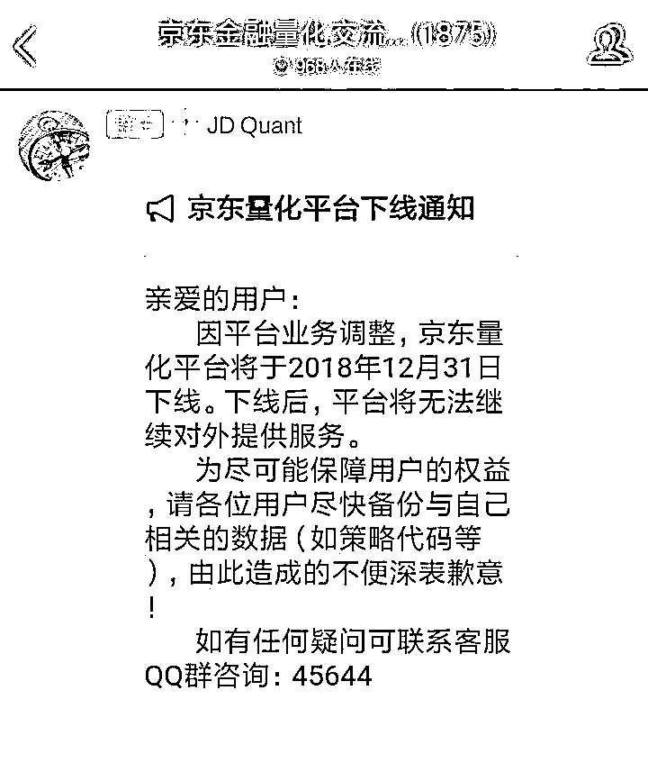
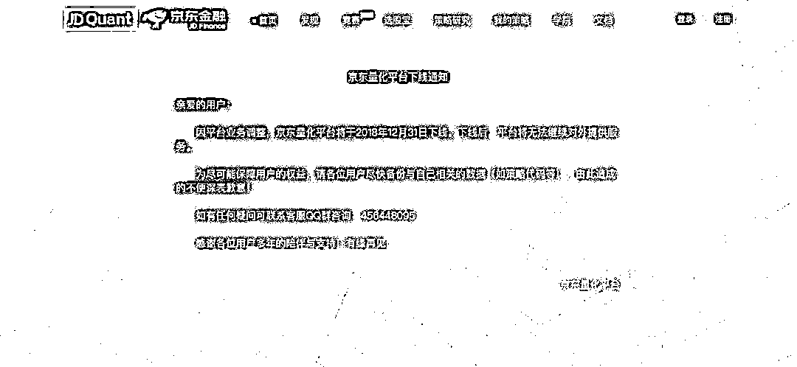
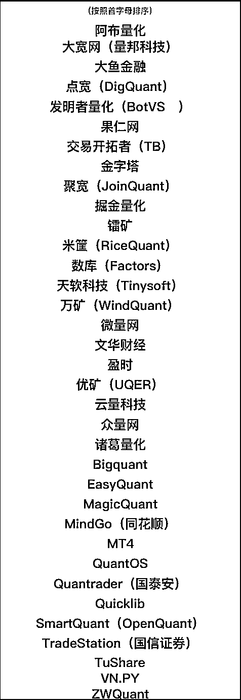

# 京东量化平台宣告下线，其他平台该何去何从？

> 原文：[`mp.weixin.qq.com/s?__biz=MzAxNTc0Mjg0Mg==&mid=2653289787&idx=1&sn=ba9c0b62af511c708db58696f62ac0fb&chksm=802e3f2eb759b638aea077ae127e447333da71f112fc15284f1632a3e5e822f33a1a61e6f09b&scene=27#wechat_redirect`](http://mp.weixin.qq.com/s?__biz=MzAxNTc0Mjg0Mg==&mid=2653289787&idx=1&sn=ba9c0b62af511c708db58696f62ac0fb&chksm=802e3f2eb759b638aea077ae127e447333da71f112fc15284f1632a3e5e822f33a1a61e6f09b&scene=27#wechat_redirect)

作者：量化投资与机器学习公众号编辑部

***本文内容对所有平台保持中立态度**

昨日，公众号从网友在京东金融量化交流群的截图获悉，平台可能面临下线。

今日，我们从官网看到了这条公告。确保消息的准确性！

不禁令人唏嘘，2018，不平凡的一年。

京东的下线，对所有平台来说是警钟、也是动力！

从 2014 年起，各大量化平台开始陆续上线，可能都受到了 Quantopian 的启发。前段时间，界面曾经写过一篇文章，其中对各个平台的打法总结的很到位：

*   **第一大类别为互联网思维**

*   **第二大类别为数据业务延伸**

*   **第三大类别为 IT 技术派**

*   **第四大类别为互联网巨头跨界**

我们可以看出，每个平台在未来可能在这条路上一直走下去，或者转型。

我们统计了一下国内的量化平台，有 30+之多：

每个平台都有自己的群体与定位，从目前来看，一直持续与活跃的不足一半。

不管有多少家平台，**变现难**是很多平台遇到的最主要问题，不管是 2B 还是 2C。这个问题至今我们没有看到哪家平台给出一个特别好的解决方案。

可能不断的培养用户口碑，不断的聚拢用户，最后靠流量去变现，也是一种求生之道。 

从目前来看，还没有一家平台做到如此成功。因为，要让 C 端用户从口袋里掏一分钱，是很难的。

我们综合各大平台的特点和行业发展，总结了几点内容供大家思考：

**1、2C or 2B**

选择 2B 还是 2C 是每个平台想要想清楚的。因为它决定了你未来的路该如何走，也决定了你产品的定位。有些平台从 2C→2B、2B→2C 去做，有些从 2B→2C、2C→2B，有些直接 2C 等等，各有各的门道。

**2、数据**

现在各大平台都在搭建自己的数据体系，比如米筐的【RQData】、聚宽的【JQData】等，但是与优矿（通联数据）、万矿（Wind）、MindGo（同花顺）这样专门做金融数据的平台相比，其在数据的深度、广度上还有待提高。

这也由此产生了一个问题，Wind、通联这样的数据大公司，都参与到这场角逐中，他们该如何发挥自己的数据优势？其他平台该如何面对？这是值得每个平台思考的。

会是后来者居上？还是强者恒强？

**3、产品**

这个是核心，现在每家都有几个看家的。但是，一样要有差异化。这需要强大的技术团队和具有前瞻性的产品经理。

**4、云端 or 本地**

所有进行实盘操作的机构，对策略的保密性看的十分重，他们基本都是在本地搭建系统进行策略的开发与回测，因为是最核心的东西。

你会把赚钱的策略放在云平台吗？

在线云平台固然方便易用，但落地到终端更为安全、可靠。这是一个趋势，但不一定对每个平台都适合。

**5、定位**

还是搬出最开始的这四个分类：

*   **第一大类别为互联网思维**

*   **第二大类别为数据业务延伸**

*   **第三大类别为 IT 技术派**

*   **第四大类别为互联网巨头跨界**

什么是互联网思维？：**快、广、狠**

什么数据业务延伸？：**全面**

什么 IT 技术派？：**专业**

什么互联网巨头跨界？：**钱多**

其实到最后，大家在前三点都需必备，和读书一样：**博而后深，广而后专**。

不过，每个平台必须有张自己的王牌！

**你可以不大而全、但是你要精而细。**

**6、用户粘性、口碑**

C 端用户的粘性培养，需要每个平台花心思，花时间。可能某个平台推出一个很好的功能，你的部分用户会因为此转移对象。这也促使很多平台，争分夺秒、彼此覆盖。也是一个好事，彼此互相促进，但是也要考虑自身的实力和定位。

但好的平台，用户不会因为某个功能不完善而弃用，这就需要所有平台在其他方面做出更多努力。

比如：优矿的【量化精英养成计划】、万矿的【WQFA 人才培养计划】、聚宽的【基金经理训练营】等。都给全网的量化爱好者提供了一个很好的学习机会，同时，也为对每家平台在口碑、流量等方面进行了积累。

比如：用户出书与平台挂钩。王小川、阿布、濮元恺等作者基于优矿、阿布量化、聚宽、TB 写了基于此平台的学习资料。

还有就是解决问题的能力、速度、效率。所有平台都是摸爬滚打过来的。你的用户在帮你找 bug，如何让问题得以快速解决，用户用的爽，口碑、粘性自然就上来了，而且有裙带效应。道理大家都懂，但落实执行很重要。

不要觉得当客服很掉价，你也是在了解产品，了解用户需求，了解公司的未来。大家去看看所有平台的社区，很大一部分都是用户的提问，关于产品、功能甚至很简单的编程、策略问题。更不要说每个平台的 QQ、微信群了。

平台的免费成就了用户的包容，但是如果把这种包容不能转化为你的优势，那用户会因为体验不好逐渐放弃。

**7、运营**

好的东西得有人用，怎么让更多人知道你东西好？

怎么推？这个大家应该都清楚。

这也是刚才说的，每个平台需要有的互联网思维，运营只是一部分。你的定位不一定要发展成互联网企业，但是你的思维时刻要保持！

想方设法、无处不及。可能有时候一篇文案、一个策略、一场活动、一个比赛就能给平台带来无数流量。

比如：

*   优矿的《追踪聪明钱 - A 股市场交易的微观结构初探》这篇帖子，成为了无数用户的代码范本。

*   万矿免费的 WQFA 量化课程，给平台圈粉无数。

*   聚宽的高校数据教学免费支持计划，对平台在高校用户的培养添砖加瓦。

*   BigQuant 在 AI 方面的量化百科，给平台了增加专业度。

*   米筐的 RQData Excel 插件，对其数据的使用和用户培养都起到了作用。

*   掘金的机构版对用户免费试用。

等等~~~

可能每个平台在某些方面都有做，如何做精做深，大家自己要去思考了。

产品做到某一定程度，一定需要运营的跟进。如果产品得不到认可，要么是你产品本身很差劲，要么就是你的运营做的不到位。

**运营需不需要花钱，**怎样四两拨千金，这个就看运营团队的本事了。

**8、融资**

很多公司其实很烧钱。

以下 3 段内容来自：***界面投资******《量化平台玩家们的变现难题》***

> 企查查数据显示，2014 年 11 月，米筐获得了由源码资本提供的 100 万美元的天使轮投资，时隔两年，又顺利拿下 2500 万元的 A 轮融资，投资方为华睿资本和百度。去年九月，恒生电子又对公司进行了 A+轮投资，具体金额不详。不管是从融资的频率还是金额来看，显然，米筐的“烧钱”速度是非常快的。
> 
> 深圳南山一位不愿意透露姓名的投行人士对界面新闻记者表示，接连获得融资说明机构对这一项目发展前景看好，但是既然是投资就有一定的回报预期，如果企业迟迟不能盈利甚至连盈利的方向都找不到，那么后期融资就会面临很大的压力。而一旦资金链断裂，这种高度依赖融资的企业，无疑面临困难。
> 
> 同样高度依赖融资的还有聚宽，企查查数据显示，聚宽在去年 12 月中旬获得了百度 1 亿元的战略投资。在此之前，聚宽获得三轮融资，分别是 2015 年 9 月六禾投资的 100 万元天使轮、次年 9 月启迪之星、方信资本合计 1000 万元的 A 轮以及盛山资产在去年 10 月投资的 B 轮等。

大家可以自己算算现在花了多少了。

刚才说的，每个平台做了那么多功能、产品和运营，有一部分就是为了让你给投钱的哥们看到希望，看到未来盈利的可能性。有了钱，平台可以继续把这个蛋糕做大。京东量化平台可能不缺钱。但是，没有钱，你一定不能玩。

其实，这有点像 ofo，最近发生的事大家都知道。如果企业迟迟不能盈利或者其定位不够。那么，倒下去是早晚的事。

**最后说的话**

再过几年，量化平台这个行业，一定会倒下一批公司，也一定会存活一批公司。

活下来的要么有钱，要么找到了一条属于自己的路，这条路就是你的王牌，说白了就是核心竞争力，别人很难抢走。 

原因很简单，就是综上所述的积累，沉淀。互联网领域竞争是非常残酷的，情怀讲到一定程度就要挣钱啦。

2018 年的市场环境让量化整体比较难做。很多新政策的出台也未必一定是春来了。

未来谁能留下，谁又将消失在洪流之中，存在很多不确定性，我们将拭目以待！

**公众号作为量化领域垂直的自媒体，也将持续为所有量化爱好者贡献自己的一份力量。**

-End-