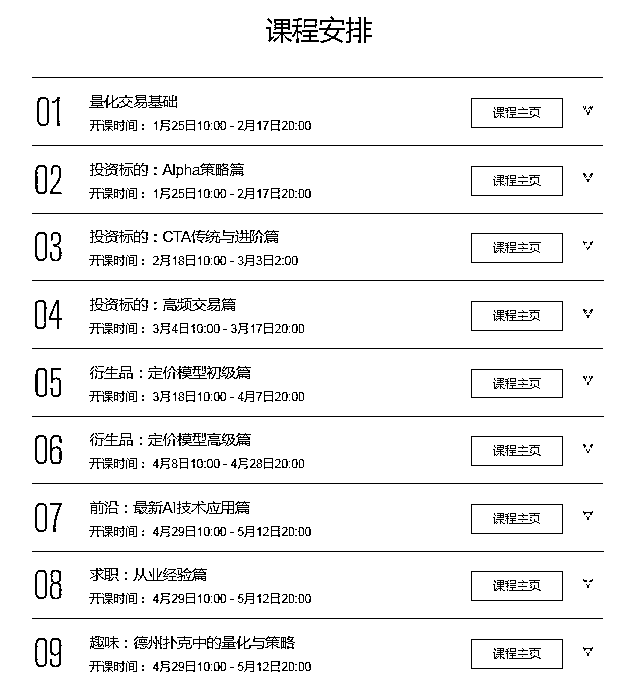

# AI 量化交易，盘点你不可不知的行业信息！

> 原文：[`mp.weixin.qq.com/s?__biz=MzAxNTc0Mjg0Mg==&mid=2653289764&idx=1&sn=b847cbc9661df2f681caa7221bda4474&chksm=802e3f31b759b6274980eb643b416e2881b179340458ee2e7dcc7ca12d42f75632bf60f93de3&scene=27#wechat_redirect`](http://mp.weixin.qq.com/s?__biz=MzAxNTc0Mjg0Mg==&mid=2653289764&idx=1&sn=b847cbc9661df2f681caa7221bda4474&chksm=802e3f31b759b6274980eb643b416e2881b179340458ee2e7dcc7ca12d42f75632bf60f93de3&scene=27#wechat_redirect)

**量化交易是不是很高大上？**

量化交易，听起来很高大上，其实就是众多投资方法中的一种。

**要理解什么是量化交易，首先我们来说说什么叫“量化”。**

我们来想象一种场景：

假如有人做了两道菜，让大家去评价这两道菜，哪道菜对我们来说更有营养。通常，大家可能会通过“看”两道菜里的食材种类和数量或者基于知识经验，来作出评价。

而如果我们通过数学模型统计工具，对两道菜里的成分进行数据分析和计算，来得出结论，这就叫做「量化」。

**同样的，我们利用计算机技术，通过建模分析、优化参数等手段，从历史金融数据中挖掘出影响投资的指标，使用程序进行自动交易来获得“超额”的收益，这种投资方法就叫做量化交易。**

通过量化交易，投资者极大地减少因为主观地“经验性”判断和“情绪化”地冲动作出非理性地投资决策；同时因为计算机出色的计算能力，投资者也能更快地找到投资的“规律”。

**AI 在量化交易中的应用**

说起 AI 在量化交易中的应用，我们不妨拿股票举例。

作为一名投资者，我们投资获得的收益主要有两种：**一****种是 Alpha 收益，另一种是 Beta 收益**。

**这两种收益有什么区别呢？**

简单来说：Beta 收益是由大盘整体的变化带来的收益，而 Alpha 收益则是受多种因素影响的收益。所以相对来讲，想要获得 Alpha 收益，则需要考虑的更多，因此也更难获取。 

**那么如何才能获得更多的 Alpha 收益呢？**

这里我们要提到一个叫做“因子”的概念。拿上文中选菜的例子来说，每道菜里的“蛋白质含量”、“维生素含量”就是因子。在股市中，对各种因子的组合制定不同的策略，再执行这些策略，就能获得更多的 Alpha 收益。

从下图可以看出，今年来大部分的股票因子都无法带来正的收益率。

**然而，在量化交易中，我们做不好的，人工智能却能替我们做好。**

**利用 AI 技术，我们可以处理传统意义上无法量化的数据，通过使用不同的算法，计算机可以选择并执行不同的投资策略。**

**AI 量化交易的就业前景**

目前，国内各大券商的量化岗位，在招聘时均会明确要求应聘者有计算机或人工智能等相关领域背景。

从薪资来看，国内量化分析师的平均工资为 17260 元/月，应届生的工资也达到了 10K 左右，平均工作经验在 3 年以上的工资水平可达到 20K 以上。不过纸面上的工资对他们来说可能只是零花钱，在机构效益好的年份，年终奖甚至能达到工资的好几十倍。

从学历来看，量化分析师的岗位以本科学历为主，硕士为辅，充分说明了量化在业界的发展比学术界领先，在这种黄金时期，入门 AI 量化时不可待。

**AI 量化的学习路径**

对于零基础的同学，想要入 AI 量化的大门需要翻越 4 座大山：金融理论，交易策略，机器学习与深度学习，AI 量化实践。

**1\. 金融理论**

**这一部分主要了解量化交易发展过程中经典的理论及模型**，如市场有效假说、期权定价模型、投资组合管理、股票市场的随机过程、二叉树模型、微笑模型等，这些是理解金融市场行为等理论基础。

**2\. 交易策略**

基本面、技术面分析、时间序列分析、Alpha 策略、多因子模型、CTA 策略都是传统的典型的交易策略。即使在使用 AI 解决量化交易的过程中，传统的交易策略也被大量地使用，**这一阶段主要能掌握传统交易策略的思想以及使用方法即可**。

**3\. 机器学习与深度学习**

任何交易策略最后都要落到实地，尤其在量化领域，使用**AI 技术需要掌握基础的机器学习和深度学习算法**。吴恩达在 Machine Learning 和《Deep LearningSpecialization》深入浅出地讲解了机器学习和深度学习理论和算法原理，是入门者的必备良药。

**4\. AI 量化实践**

**实践是检验真理的唯一标准**。学习者需要在真正的市场环境中去检验编写的策略是否有效，并不断进行优化、改进，才能够为投资者实现稳定的收益。

针对量化研究的小白、有志于投身 AI 量化交易事业的同学，网易云课堂特地推出了 AI 量化交易课程。

本课程不仅从理论层面夯实学习者的金融学知识，同时手把手带领学员搭建自己的系统，并在自己的系统中实现相关策略。在课程中我们重点加入了**AI 技术在量化交易中的应用内容，指导学员使用深度网络模型指导量化实践**。

**现在，面向本公众号粉丝发出限时免费福利**：

12 月 19 日，网易云课堂微专业邀请了国内知名私募量化投资经理——赖老师，为大家免费直播讲解那些量化交易中，你不可不知的行业信息。

**Part.1 免费直播公开课**

**直播主题**

《AI 量化交易，盘点你不可不知的行业信息》

12 月 19 日 周三 20:00

**直播大纲**

1.量化交易的发展近况及相关公司

2.国内量化交易相关岗位情况解读

3.解密必须掌握的面试核心考察点

4.学习路径简介与核心资源推荐

**直播讲师**

赖老师 国内知名私募量化投资经理

**网易云课堂「AI 量化交易」特约讲师**

浙江大学计算机硕士，发表 AI 相关论文数十篇。曾在*****el 等多家国内外顶尖对冲基金担任量化投资经理，期间利用神经网络/机器学习知识进行建模选股和日内高频交易，取得卓越稳定的收益。

**Part.2 免费体验课**

**《AI 量化交易》**

**课程大纲** 

1.量化交易的历史背景与发展

2.机器学习加持下的量化交易新世界

3.量化案例展示——大单跟随

4.量化交易指衍生品定价

**Part.3 免费学习资料包**

AI 量化交易电子书

▼

AI 量化交易相关论文

▼

**Part.4 获取方式**

扫描下方二维码

添加网易云课堂「AI 量化交易」助教

即可获取所有免费福利

为了保证学习体验

本次学习社群限时开放

**数量有限，进群从速哦~**

**点击****【阅读原文】****，免费领取福利！**