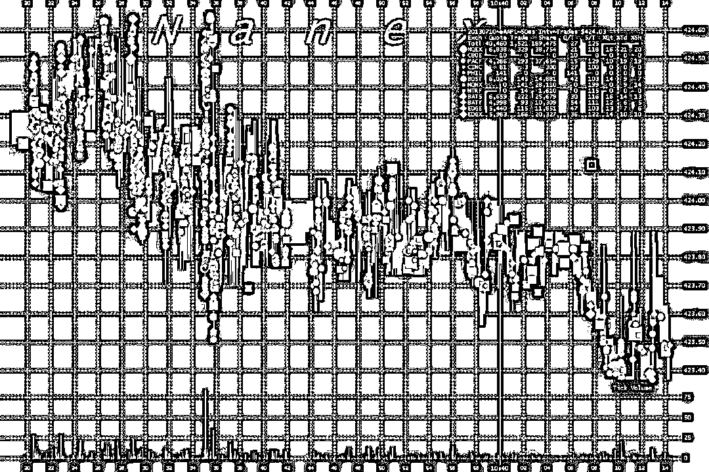

# 零佣金券商罗宾侠这次玩大了，它是如何打劫你的钱包的？

> 原文：[`mp.weixin.qq.com/s?__biz=MzAxNTc0Mjg0Mg==&mid=2653289757&idx=1&sn=b0af257119e6f1000e79bd418363af90&chksm=802e3f08b759b61ea87bb97739a15f611fad8579dd90762daec7c13577ed95dc3b4d1e028407&scene=27#wechat_redirect`](http://mp.weixin.qq.com/s?__biz=MzAxNTc0Mjg0Mg==&mid=2653289757&idx=1&sn=b0af257119e6f1000e79bd418363af90&chksm=802e3f08b759b61ea87bb97739a15f611fad8579dd90762daec7c13577ed95dc3b4d1e028407&scene=27#wechat_redirect)

***时 间 就 这 样 悄 无 声 息 的 溜 了***

**2018 年，就只剩下 12 天了**

作者 | 徐杨   

来源 | 新全球资产配置

去年 8 月，我曾写过一篇文章《[美国的盈透证券太厉害了，开始发行信用卡了](http://mp.weixin.qq.com/s?__biz=MjM5NzU3MDc1MA==&mid=2455722515&idx=1&sn=ce768d9a05a6cae8bde0dd7af328cea5&chksm=b17c0bc2860b82d44b751a978b16af0551540e2b4259412cd91b0caac08a65b1fbf167e4f43d&scene=21#wechat_redirect)》。而就在 2018 年 12 月 13 号，以“零佣金”为噱头、估值超过 56 亿美金的美国券商业的亚马逊 — 罗宾侠（Robinhood），宣布将向客户提供年利息为**3%**的“Checking&Saving （活期账户）”！

据罗宾侠官网的披露，这个账户不仅向客户提供 3%的固定年化利息，而且还自带一张万事达卡。通过这张万事达通道的卡片，你可以在超过 75，000 个 ATM 上取现，而且还是”免费“取现。不仅如此，罗宾侠也把自己“免费”的理念贯彻到底，这个活期账户没有最低账户要求、零月费、零超额支取费、零境外支付费、零换新卡费......

数据来源：Robinhood

这感觉，要让其它银行没有活路了对不对？！但事情美好得让我非常疑惑，因为我坚信：世界上没有免费的午餐。

****很高很高很高的活期利息？****

年化 3%的美金活期利率有多高？如果你了解美国市场，答案是非常高。我们知道，美国去年开始就进入了升息周期，连续几次加息后，美联储联邦有效基准利率（EFFR）目前在 2.19%，这是美国市场上真正无风险利率的基准。我们普通投资人能赚取的无风险利率，基本上就是银行提供的活期存款。这个活期存款利率，基本上等于美国短期国库券。 

数据来源：（公众号）新全球资产配置，Bloomberg

我们看到美国短期国库券中 1 个月、3 个月和 6 个月的收益率截止于 11 月底，在 2.29%～2.51%这个区间。越长的国库券，收益率越高，这是因为要支付更多的流动性风险补偿。要想到达 3%的收益率水平，至少要投资一大部分的资金到 10 年期国债中（2.99%）和 30 年期国债中（3.29%）。

而债券的期限越长，对利率的敏感程度就越高，其价格波动就会越大。历史上，10 年期国债和 30 年期国债的价格都曾经出现过 15%以上的回撤，单月最大跌幅也高达 8%以上，它们并不是真正意义上的“无风险”资产。真正意义上的“无风险”资产，是 0-3 个月期的美国短期国库券，但其历史上年化收益率只有 3.37%。

如果你作为这个活期账户的持有人，基本上是不会感受到利率对价格的影响的，因为你赚取的是罗宾侠给你承诺的 3%的利率，而罗宾侠赚取的是差价，所以大部分的利率风险是由罗宾侠承担的。

那么换个角度看，罗宾侠甘愿承担着多出来的利率风险，从长短期国库券的平均收益率 2.6%到承诺的 3%，对公司压力绝对不小，别忘了，罗宾侠在这个活期帐户上，可是连任何月费也不收取的。如果你坚信美联储会持续加息(至少罗宾侠是这么认为的)，罗宾侠面临的投资风险将会小很多。

**其它银行的活期账户利率有多高？**

作为传统的存款机构，美国各个银行间的活期账户利息也是不尽相同。罗宾侠在宣传自己这个活期账户时，列举了 4 家美国的银行提供的活期账户收益，都是少得可怜。 

数据来源：Robinhood

我去查了一下，活期账户利率最高的银行是 PNC，有年化 2.35%之多，紧跟其后的是 InvestorBank，2.25%。虽然罗宾侠故意选的是名气又大利率又低的银行来对比自己，不过，就算是利率最高的银行，还是跟罗宾侠的 3%，也差了整整 0.65%。

如果投资人直接去投资于美国短期国库券，可以赚取大概 2.40%的回报，但是银行由于有经营成本、还有管理人成本，所以理论上就算银行不赚取任何手续费，最多也只会给你直接投资于国债的利率回报。

但是罗宾侠，不仅免去了各项费用，还给你了更高的利率，这是为什么？为什么？为什么？！

因为罗宾侠就是亚马逊的衣钵传人：不管利润，只管市场占有率和增长率。连罗宾侠的联合创始人自己也说到 ： 

*“Amazon built an entire business around a strategy that makes that long-term investments in financial services, We fully intend to make money off of this but we do not need it to be profitable on day one.”*

*换作人话就是：“我们不争朝夕，只在乎赚取长期利润”。但罗宾侠不是不争朝夕，而是通过免费这个“噱头“，颠覆这个行业。*

罗宾侠的”免费“，确实跟亚马逊有异曲同工之妙。但与亚马逊的”免费“不同的是，亚马逊在拼命挤压产品提供方，而罗宾侠的”免费“，则是“隐形”地在从用户身上收费。

**真的是银行活期帐户吗？**

事实上，罗宾侠的这个所谓的“Checking&Saving”，并不是真正意义上的传统银行的活期存款帐户。罗宾侠的“活期帐户”，是一个罗宾侠证券帐户的“功能”，实际上是把客户在证券帐户中的钱，做了一个标记，标记成“活期帐户的钱”，然后罗宾侠在背后，拿着这笔钱，去投资于美国长短期国库券，给客户承诺 3%的收益。 

所以问题就来了：对投资人来说，既然罗宾侠宣称是“活期帐户”，那么投资人在使用时，能否享受到像真的银行帐户那样的投资人保障呢？答案，是非常模糊的。银行帐户的保障是什么？是银行在倒闭时，你的存款现金会有一定的保障。

做美股投资的人，应该知道在美国，有两个大哥分别为银行帐户和证券帐户提供保险。一位大哥叫 FDIC（Federal Deposit Insurance Corporation，联邦存款保险公司），另一位大哥叫 SIPC（Securities Investor Protection Corporation，证券投资人保护公司）。

这两位大哥，就跟中国的门神一样，是保护投资人的最后一道屏障。FDIC，主要为银行帐户提供保险，如果你不幸把钱存在了某个要倒闭了的银行中时，FDIC 就会站出来，给你一笔最多 25 万美金的银子。而 SIPC 呢，是保护证券帐户的一个非政府机构，他保护的是投资人证券帐户中的现金和证券，现金部分补偿也高达 25 万美金。

罗宾侠的“活期帐户功能”是基于证券帐户的，所以保护银行帐户的 FDIC 是肯定不会保护罗宾侠的客户的。那么保护证券帐户的 SIPC 呢？本周五，SIPC 的 CEO Stephen Harbeck 站出来啪啪打脸：

*"Robinhood would be buying securities for its account and sharing a portion of the proceeds with their customers, and that’s not what we cover. I’ve never seen a single document on this. I haven’t been consulted on this."*

*“罗宾侠拿客户钱去投资（美国国库券）然后跟客户分享收益的行为，将（导致这部分现金）不会受到 SIPC 保护。他们上线产品之前，并没有发微信问我，并没有！”*

为什么 SIPC 的 CEO 说罗宾侠的这个功能不受 SIPC 保护呢，过程很复杂，但简单来说：如果你证券帐户的现金，目的是为了投资而存放的话，那么这笔现金，是会受到 SIPC 保护的；但是，罗宾侠这个“活期帐户功能”，实际上是在向客户借钱：客户不需要将这笔钱做任何投资，甚至不需要动一个指头，只是以 3%的利率在证券帐户中借给了罗宾侠。这种在证券帐户的借款行为，是不受 SIPC 保护的。

既不受 FDIC 保护，也不受 SIPC 保护，没了两大门神的客户证券帐户的这笔现金，保障到底在哪里？当然了，罗宾侠说：“我们投资的是美国国库券，是非常安全的资产“。你使用这个“活期帐户功能”的话，就要相信罗宾侠的投资能力，如果罗宾侠投资失败，或者有 Fraud（骗局），或者有交易错误，又或者倒闭，那你的这部分现金是不会有保障的。

**“免费”的交易？**

罗宾侠之所以这么出名，还是因为他们的“免佣金”旗号叫得响彻大地：所有使用罗宾侠交易的客户，都不需要付出交易佣金。罗宾侠靠着这个旗号，快速的从美国市场崛起，要知道市场上交易费用最低的电子交易商老大，盈透证券（IB），每笔最低交易佣金也大概需要在 2.6 美金左右。我当时用盈透证券，每个月交易超过 4 亿美金时的综合成本，也仅仅在 0.007%左右。 

只做佣金业务的罗宾侠，不收佣金，怎么赚钱？具体来讲其实有 3 种方式：

1\. 利息：客户账户中的现金部分的利息，100%的被罗宾侠赚取。

2\. 高级会员的月费：如果你要做杠杠交易，你需要付 10 美金的月费。

3\. 杠杆交易的利息：罗宾侠收取大概 7.5%左右的杠杆利息费。

当然还有一些乱七八糟的费用，比如你打电话下单每笔需要收费等。但是这些收费项目，纵使罗宾侠有 300 万的用户，都不是特别高频次的项目，所以对罗宾侠的收入贡献有限。

那么完美的如同圣母的罗宾侠，它最赚钱的，也是最遭受诟病的收入来源，其实是“**Sell Order Flow**”。Sell Order Flow 翻译成中文就是“卖订单流”，简单理解就是：这个券商拿着你的订单，不直接去交易所寻找全国最优价格 (NBBO “National best bid and offer”)，而是转手绕到市场上的高频交易公司，让这些高频交易公司进行撮合交易。

理解了高频交易的套利机制（已经了解的可以直接跳过），才能更好的理解我对卖订单流的顾虑。由于国际金融市场普遍实行做市商制度，也就是中间商来撮合买卖价格，中间商通过买卖双方的价差来赚钱，同时为市场提供流动性。这种买卖之间的细小价差，吸引了大笔资金进入套利。

高频交易公司就是其中的一员，由于订单交易指令从券商发射到交易所，这中间不仅有时差，还有多个交易所同时询价的机制。而高频交易公司走的是技术派，就是利用时间差和多交易所进行毫秒级的套利（有些疯狂的高频交易商为了极致的算力，在铺设光纤线路时，要是设计的路线没走直线，而是多出一个拐角，都会暴跳如雷）。

当然了除了速度，他们在“流量”上也要狠下功夫。要是高频交易公司能够触碰更多的交易量，赚到的钱就会成倍的放大。而这些高频交易公司不可能去做消费者业务，所以就需要在市场上付出一定的价格，去买券商的交易量。可以理解为：券商并没有带你的订单走最优的“中间商”路径，而转手把你的订单卖给了高频交易商，高频交易商再通过各种交易策略，来撮合买来的或者市场上自然的流量，进行套利。问题在哪？我们举起一个非常极端的栗子：

比如，你想以 40 美金买入 200 股股票，一共 8000 美金的投资。假设市场上最优的买卖价差（NBBO）为 1 美分（注意这个时候，交易成本是：$0.01x200 股=2 美金），但是券商没有让你的订单直接去跟最优价格成交，而是将你的订单卖给了高频交易商。如果高频交易商将你的买单，跟一个价差 2 美分的卖单撮合了，这个点差，就把你的交易成本变成了 4 美金（$0.02x200 股=4 美金），而你 2 美刀的羊毛就这样被高频交易商给薅了。

问题是，个人投资人基本上无法发现这个行为，因为速度太快，频率太高了。

数据来源：NAXEX，AAPL 一段时间内在各大交易所的询价点

罗宾侠，就是这么一家非常出名的“卖订单流”的交易商。卖订单流的做法利来争议就很大，有的公司说，这可以增加市场的流动性和竞争，帮助客户获得更好的成交质量；但是又有很多学术研究说卖订单流不能为客户带来额外的价值。买卖订单流的公司，都对此项业务比较黑箱，好在 SEC 至少要求这些公司披露一定的信息，我们得以窥探一二。

下图是根据罗宾侠 2018 年第三季度的 SEC 文件，以在 NYSE 上交易的股票为例：

数据来源：新全球资产配置，SEC

罗宾侠 57%的订单流被卖到了 Citadel Securities，这是一家大名鼎鼎的美国对冲基金和高频交易商。最近 2 年比较出名的新闻就是关于做市商这块的“头头”：在 2017 年，这个全球顶级的对冲基金公司，正式聘任 80 后华人赵鹏为旗下做市分支 Citadel Securities 的 CEO。赵鹏有一个开挂的人生：毕业于北京八中少儿班，北大数学本科，及 Berkeley 统计 PHD。有人称，赵鹏是继陆奇之后，为数不多的一位年入 9 位数的北美华人。

**客户真的在“免费”交易吗？**

Citadel 以多少钱的价格去买罗宾侠用户的订单流量？根据 SEC 报告，大约是每 1 美金，需要付出$0.00026 美金。美国市场上另外一位交易商巨头 TD Ameritrade，当然也卖订单流给 Citadel，他们卖的价格，大概是每 1 股$0.0016 美金；E*Trade 卖的价格是每 1 股$0.0011 美金。是不是看起来罗宾侠卖的很低？ 

猫腻就在这里：罗宾侠从来没有公布过每卖一股订单流所赚取的收入，他们非常巧妙地把这个收入，转化成了每 1 美金，这样让这个收入看起来，比其它券商都低很多。那么我们来统一口径吧：假设美国股票的平均价格为每股 30 美金，50 美金，70 美金这 3 档。

数据来源：新全球资产配置，SEC

如上图，我们把罗宾侠说的每 1 美金订单流，统一成每 1 股：Citadel 去买罗宾侠的订单流所要付出的价格，平均是去买 E*Trade 订单流的 11 倍，平均是去买 TD Ameritrade 的 8 倍。

世界上没有免费的午餐，作为高频交易商，必须要保证持续的、高频次的小额赚钱。如果一个交易商愿意付出 8-11 倍的价格去买一家券商的订单流，那么这个订单流必须要很赚钱才行。

你觉得一家通过高频交易和对冲策略为主、CEO 是奥数冠军、资产规模超过 300 亿美金的对冲基金，以 8 倍的价格收你的订单流为的是什么？肯定是大有赚头。那么高频交易商赚的是谁的钱？羊毛出在羊身上，实际上赚的是用罗宾侠做交易的客户的钱。

订单流赚钱的前提是，这个订单流可套利的空间很大，而套利空间大的背后，就是客户交易质量的下降。很多个人投资者平时会忽略交易质量这个成本，因为他们无法找到数据来比较，下单时也无法看到自己成交的价格是否是市场最优。而且在“免费”的噱头的驱动下，变本加厉地交易。

根据上面的数据，假设罗宾侠卖的成本就是客户损失的交易质量，那么罗宾侠的客户，在平均交易价格是 50 美金的情况下，每交易一笔，就会比在 TD Ameritrade 交易多损失$0.0062 美金。如果一年交易一万笔，就会多损失 114 美金。2017 年，SEC 处罚了 Citadel，并且罚款 2200 万美金，原因是 Citadel 在撮合买来的订单流的时候，没有做到为客户寻找最优价格。

有谁不卖客户的订单流？资产规模超过 5 万亿美金的先锋基金旗下的券商，不卖；美国第一大电子交易，日均成交超过 70 万笔的 盈透证券，不卖。当然我也不会告诉你，罗宾侠的两位创始人曾经都是为高频交易公司编写程序的工程师，我相信罗宾侠基本只靠卖订单流度日的原因，一定为的是给客户带来更好的交易体验。

**写在最后**

这一次发布 3%年化利率的活期账户时，罗宾侠联合创始人 Bhatt 也毫不隐讳的说道：  

*“If we roll this product out, and it's adopted by millions who love it and use, we will have one of the fastest growing financial services companies in history”。*

*“如果这个高息账户成功了，会吸引超过百万计的客户，我们将会成为历史**增速最快**的金融服务公司。”*

17 世纪的荷兰郁金香泡沫是历史上增速最快的种植业泡沫；英国的南海公司泡沫是历史上增速最快的债券泡沫；01 年互联网泡沫是历史上增速最快的互联网泡沫；15 年以比特币为首的 ICO 是历史上增速最快的数字货币泡沫。现在的王者，亚马逊，在 01 年也暴跌了 90%以上......

每当看到”增速最快“的时候，我都不禁想问，这样的商业模式到底可靠吗？互联网时代下，并没有“不可能”。我不是为银行的收费项目辩护，很多银行的收费项目确实很操蛋。但是，罗宾侠不仅要承担高于美国短期国库券的利息，还要免去所有账户的费用，而通过与万事达卡合作分享的刷卡手续费，对于负的利润空间也只是杯水车薪。

金融这个行业传统的赚钱模式莫过于两类：佣金，管理费。在美国证券行业里，不管是佣金空间，还是管理费空间，都在被持续地挤压：零佣金的交易、零管理费的共同基金，管理费低得令人发指的指数 ETF。美国券商提供活期账户并不是什么新鲜事，而罗宾侠则是在“免费”的基础上更进了一步。长远来看，这到底是为了客户，为了品牌，还是为了估值，为了估值，为了估值？

美国智能投顾的鼻祖之一，Betterment，也有类似的帮助客户管理现金的做法。Betterment 的做法是：通过 2 只 ETF，在证券账户里自动地为客户管理现金，其目前的收益率在年化 2.09%。在我看来，这才是更加可靠和具有持续性的做法。

投资的时候，你一定要知道你到底在投资什么。当我写到这里的时候，罗宾侠已经默默的从其官网上，下线了这个“Checking&Saving （活期帐户）”的介绍页面，替换成了“Cash Management（现金管理）”，并且加上了“Coming Soon”。我仿佛已经看见了 SEC，拿起弓箭，对准了罗宾侠。

