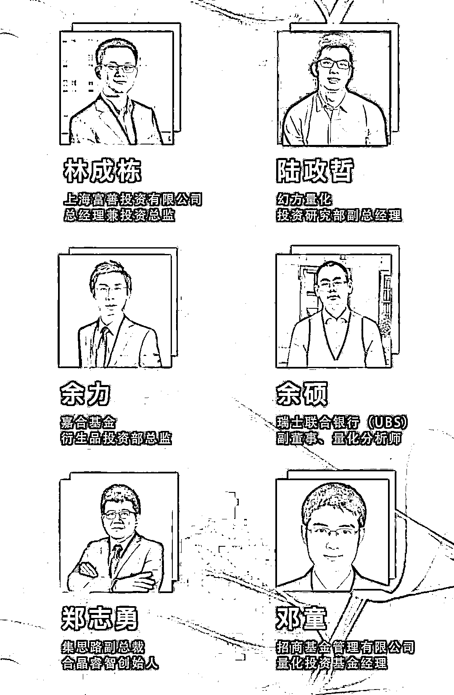

# 二千零一十八、年末巨献 | 万矿全球量化嘉年华（线上）

> 原文：[`mp.weixin.qq.com/s?__biz=MzAxNTc0Mjg0Mg==&mid=2653289744&idx=1&sn=d7670935a3949777763ac972defbf48c&chksm=802e3f05b759b61356ce6ddb5698a5738da748b0b3b7d3aa870b1b424a1a8a3c0b09db51f84f&scene=27#wechat_redirect`](http://mp.weixin.qq.com/s?__biz=MzAxNTc0Mjg0Mg==&mid=2653289744&idx=1&sn=d7670935a3949777763ac972defbf48c&chksm=802e3f05b759b61356ce6ddb5698a5738da748b0b3b7d3aa870b1b424a1a8a3c0b09db51f84f&scene=27#wechat_redirect)

◯**活动介绍** ◯

为了给广大量化投资爱好者提供更广泛的交流学习机会，万矿将于 2018 年年末，在全网举办一场大型的线上量化嘉年华活动。

此次活动，我们邀请了**公募基金**、**私募基金**、**券商金工**、**海外机构**等众多重量级嘉宾，为大家分享**量化基本面**、**量化 CTA**、**资产配置、****期权交易**、**金融科技**等方面的研究与应用。希望给 Wind 以及全网万矿用户带来一场量化投资的知识盛宴！

（嘉宾按演讲顺序排名）

◯**活动时间** ◯

**2018 年 12 月 17 日****至****2018 年 12 月 28 日**

**每日 2 场**

**15:30****—****16:30**

**16:30****—****17:30**

◯**活动议程** ◯

◯** Wind****介绍** ◯

**Wind **| 中国大陆领先的金融数据、信息和软件服务企业，总部位于上海陆家嘴金融中心。 在国内市场，Wind 的客户包括中国绝大多数的**证****券公司**、**基金管理公司**、**保险公司**、**银行**和**投资公司****等金融企业**；在国际市场，已经被中国证监会批准的合格境外机构投资者**（QFII）中的众多机构是 Wind 的客户**。

◯**万矿介绍** ◯

**万矿**（**www.winquant.com**）是 Wind 旗下高端量化分析云平台，提供基于 Python 的量化投资研究环境，以及丰富的金融数据，全矩阵覆盖量化投研环境，拥有：**量****化学院**、**策略研究**、**投研工具**等。用户通过浏览器或客户端即可开始投资研究。

◯**如何参加** ◯

全网用户均可**在线免费**收听

**一、****非****Wind 终端用户**

**方式 1****：**请登陆 ***www.windquant.com***，进入**社区【推荐】**栏目进行查看。

**方式 2：****扫描****下方二维码，每日会更新会议内容**

**（记得每天来看哦！）**

**二、Wind 终端用户**

**方式 1：**通过****Wind 金融终端****

1、点击终端首页右侧**“3C 会议”**或在右下角输入**“3C”**。

2、选中一场会议，点击**“立即报名”**。会议开始后进入会议详情页，点击**“进入直播”**，即可在线收听。**您还可以在互动处留言提问，与嘉宾交流。**

**方式 2：**通过****Wind 金融终端（机构专用）APP****

1、点击 APP 后，进入**“3C 会议平台”**。参会流程与 Wind 金融终端相同。

◯**合作媒体** ◯

（不分先后顺序）

——**End**——

全网用户都可登录**网页版**

**免费注册、免费使用**

**地址：*****www.windquant.com***

有 Wind 账号的朋友登录**Wind 金融终端**

点击**量化**或输入**WQT**即可使用万矿

**点击****阅读原文****，****查看更详细会议信息**