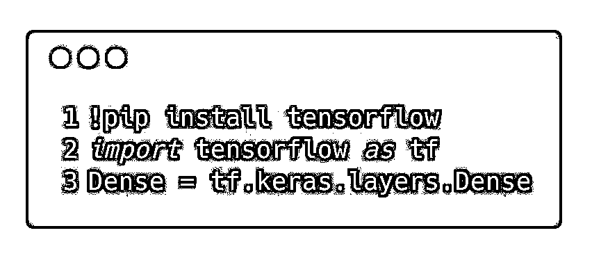
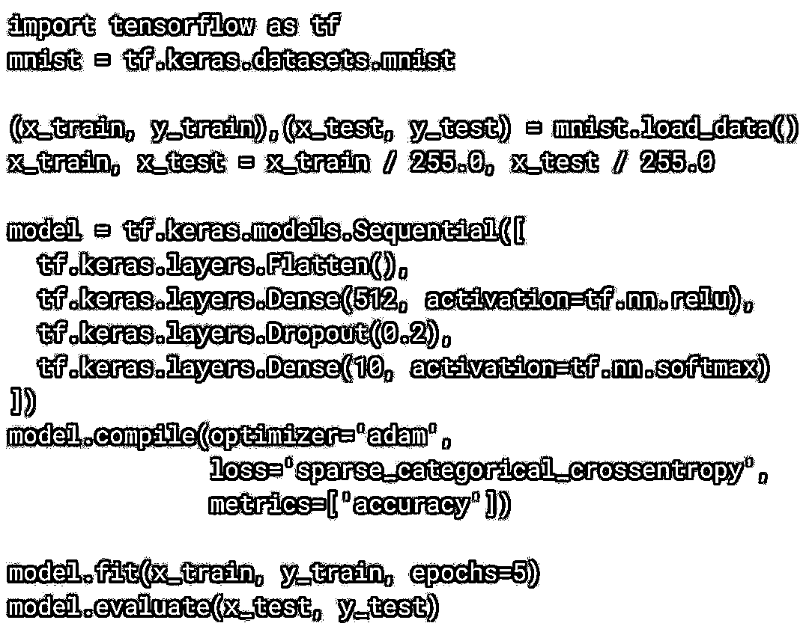
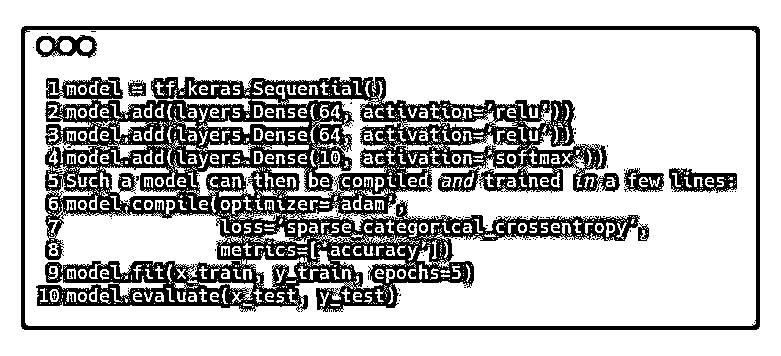
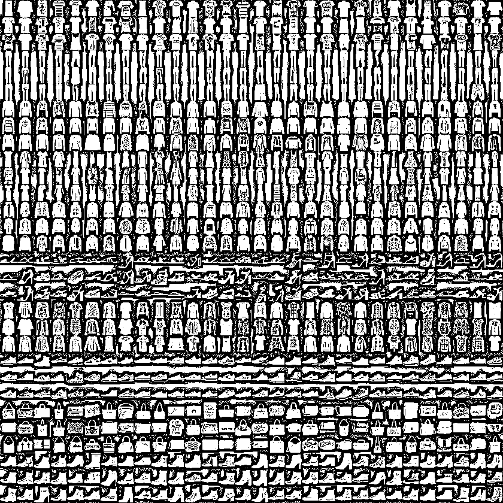
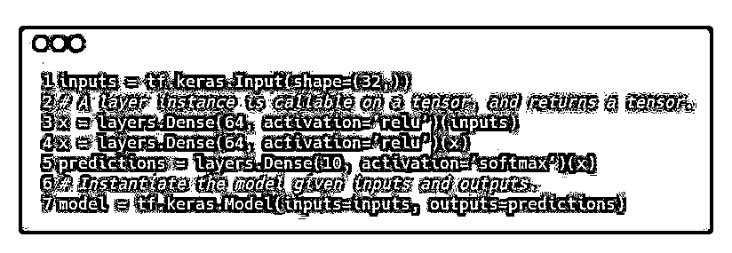
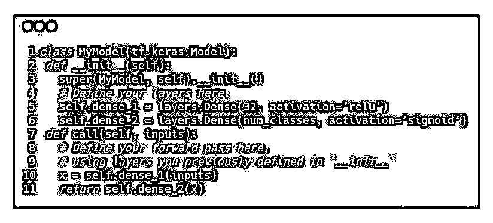
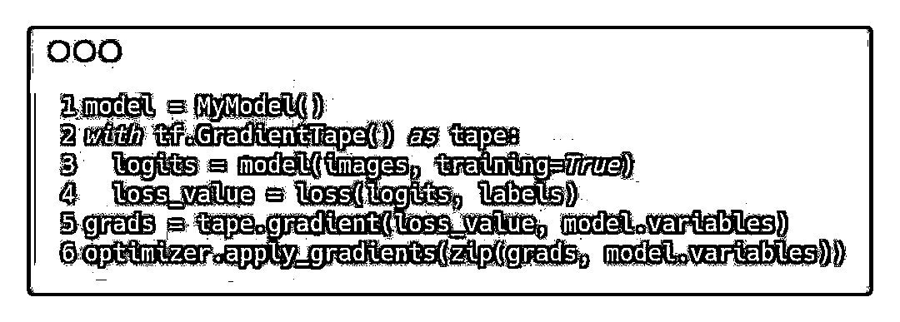
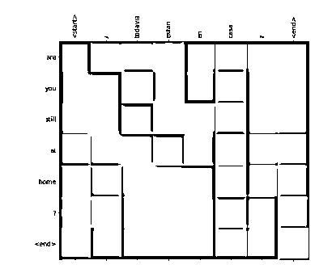
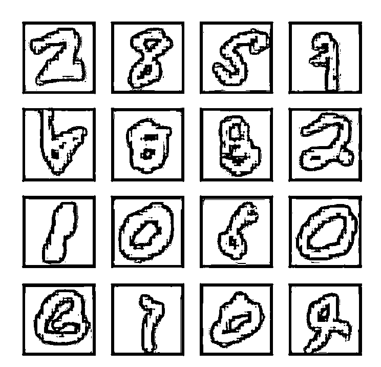

# TensorFlow 2.0 发布在即，高级 API 变化抢先看

> 原文：[`mp.weixin.qq.com/s?__biz=MzAxNTc0Mjg0Mg==&mid=2653289739&idx=1&sn=82ff1647a50709dba3a13034f38ac7fa&chksm=802e3f1eb759b608c305c94210983c6b4994ea6ffb38be8b87bea6ad3aea4ddd93ea956532d1&scene=27#wechat_redirect`](http://mp.weixin.qq.com/s?__biz=MzAxNTc0Mjg0Mg==&mid=2653289739&idx=1&sn=82ff1647a50709dba3a13034f38ac7fa&chksm=802e3f1eb759b608c305c94210983c6b4994ea6ffb38be8b87bea6ad3aea4ddd93ea956532d1&scene=27#wechat_redirect)

***时 间 就 这 样 悄 无 声 息 的 溜 了***

**2018 年，就只剩下 16 天了**

作者 | Sandeep Gupta, Josh Gordon, and Karmel Allison

整理 | 非主流、Jane

来自 | AI 科技大本营

**推荐阅读**

## 1、[机器学习、深度学习、量化金融、Python 最新书籍汇总](https://mp.weixin.qq.com/s?__biz=MzAxNTc0Mjg0Mg==&mid=2653289640&idx=1&sn=34e94fcbe99052b8e7381ecc48a36dc0&chksm=802e3ebdb759b7ab897cd329a680715b6f8294e63550ddf0c57b9e1320b2b7d1408c6fdca0c7&token=1883102744&lang=zh_CN&scene=21#wechat_redirect)

## [2、海量 Wind 数据，与全网用户零距离邂逅！](https://mp.weixin.qq.com/s?__biz=MzAxNTc0Mjg0Mg==&mid=2653289623&idx=1&sn=28a3600fd7a72d7be00b066ca0f98244&chksm=802e3e82b759b7943f43a4f6ef4a91e4153fa6b8210de9590235fa8ee66eb9811ce177054dbc&token=1883102744&lang=zh_CN&scene=21#wechat_redirect)

## [3、超级棒的机器学习资料下载](https://mp.weixin.qq.com/s?__biz=MzAxNTc0Mjg0Mg==&mid=2653289615&idx=1&sn=1cdc89afb997d0c580bf0cef296d946c&chksm=802e3e9ab759b78ce9f0cd152a680d4a413d6c8dcb02a7a296f4091993a7e4137e7520394575&token=1883102744&lang=zh_CN&scene=21#wechat_redirect)

【导语】早在今年 8 月的时候，谷歌开源战略师 Edd Wilder-James 在一封公开邮件中表示正在研发 TensorFlow 2.0，并将于今年晚些时候发布预览版。在 2018 年最后半个月的日子里，我们就要迎来了新版本的发布。

在之前的公开邮件中，Edd Wilder-James 曾提到过一些 TensorFlow 2.0 的设计思想和重大改变：易用性将成为重点、Eager Execution 将会是核心功能、支持更多的平台和语言等。

而且未来所有的 tf.contrib 都会被弃用，对于每个 contrib 模块，要么 a）将项目集成到 TensorFlow 中；b）将其移至单独的存储库；c）完全将其移除。

在这篇文章中，我们将预览 TensorFlow 中高级 API 的未来方向，并回答大家常问的一些问题。

Keras 是广受开发者社区欢迎的高级 API，主要用于构建和训练深度学习模型。它可以用于快速原型设计、最先进的研究以及实际生产。**虽然 TensorFlow 已经支持 Keras，但是 2.0 版本将实现更加紧密的集成。**

Keras 有以下几大关键优点：用户友好、模块化、可组合、容易扩展，既适合新手，也适合专家。这些优点加起来。可以让学习、研究、开发、部署的工作流更加容易，效率更高。通过将 Keras 构建为 TensorFlow 的高级 API，机器学习领域的新手可以更容易上手。通过单一的高级 API 可以减少混淆，让我们能够专注于为研究人员提供高级功能。

TensorFlow 2.0 版本发布在即。我们会先解答下大家比较关注的几个问题，然后我们会介绍 TensorFlow 2.0 中关于 Keras 的一些新功能和重大变化，如 Sequential API、Functional API、Model Subclassing API 与 Estimators 等。

# 

**FAQ**

****▌******1、问：Keras 是否是一个独立的库？**

**答：**其实，更应该把 Keras 视为一个 API。Keras 一直作为一个开源项目进行维护，大家可以在 （www.keras.io.）中找到。这个项目一直独立于 TensorFlow，并且拥有一个活跃的贡献者社区和用户社区。在 tf.keras 模块里，TensorFlow 有一个特定增强功能的完整 Keras API 实现。

****▌******2、问：Keras 只是 TensorFlow 或其他库的一个包装器吗？**

**答：**不，这是一个常见的（但可以理解的）错误观念。 Keras 用于定义和训练机器学习模型的 API 标准，它与特定实现无关：除了 TensorFlow，Keras API 还可以用于 MXNet，TypeScript，JavaScript，CNTK，Theano，PlaidML，Scala，CoreML 和其他库的实现。

****▌******3、问：TensorFlow 内置的 Keras 版本与 keras.io 上的版本有什么区别？**

**答：**TensorFlow 包含 Keras API（在 tf.kerasmodule 中）的实现，具有 TensorFlow 特定的增强功能，包括支持 Eager Execution，方便直观调试和快速迭代，支持 TensorFlow SavedModel 模型交换格式，以及分布式训练（包括 TPU）。

当用到 tf.keras 模块的子类 API 时，Eager Execution 特别有用。这类 API 受到 Chainer 的启发，大家通过命令行就可以编写模型。tf.keras 与 TensorFlow 的生态系统紧密结合，可以支持：

*   tf.data 用于构建高性能的输入流。你可以用 Numpy 处理的数据来训练模型，或者用 tf.data 来衡量规模和性能。

*   分布策略。在跨各种计算平台时进行分布式训练，包括分布在很多机器上的 GPU 和 TPU。

*   输出模型。通过 tf.keras APIs 创建的模型可以在 TensorFlow SavedModel 格式下进行序列化，并且可以使用 TensorFlow Serving 或通过其他语言（Java、Go、Rust、C#等）进行绑定。

*   模型可以使用 TensorFlow Lite 部署在移动或嵌入式设备上，也可以使用 TensorFlow.js。（也可以使用与此相同的 Keras API 直接在 JavaScript 中开发模型。）

*   特征列，用于有效地表示和分类结构化数据。

**如何安装 tf.keras？我是否需要先通过 pip 安装 Keras ？**

因为 tf.keras 是包含在 TensorFlow 内的，所以，大家不用单独安装 Keras。如果在 Colab 中你可以直接运行下面的代码：

然后你就可以使用 tf.keras 了。如果你是安装新手，可以通过近期教程中的一些例子来检查是否导入成功。

****▌******5、TensorFlow 为专家和新手提供了不同 API，如何使用？**

TensorFlow 的开发者们经验、层次都不同，有刚接触 ML 的学生们、也有 ML 领域的专家或研究者。而 TensorFlow 的一个优点就是它提供了不同的 APIs 支持不同的工作流和目标。这也是 TensorFlow 的 Keras 集成的一个主要目标，可以让用户选择对自己更有益处的部分，而无需采用 Keras 的整体框架。

# 

**Sequential API**

如果你正在学习机器学习，我们 建议你从 tf.keras Sequential API 开始，它非常直观、简洁，适用于机器学习中 95% 的问题。使用这个 API，10 行代码就能搭建一个神经网络。

> 参考案例：
> 
> https://colab.research.google.com/github/tensorflow/docs/blob/master/site/en/tutorials/_index.ipynb

定义模型的最常用方法是构建神经网络的层图，最简单的模型类型是把这些层堆叠起来。 你可以使用 Sequential API 来定义这样的模型，如下所示：

在 “Learn and UseML”章节下面，你可以找到更多使用 the Sequential API 的教程，参考链接：

> https://www.tensorflow.org/tutorials/

# 

**Functional API**

当然，顺序模型是一个简单的神经网络层堆栈，不能代表任何模型。不过，你可以使用 Functional API 来构建更高级的模型，定义复杂的拓扑结构，包括多输入和多输出模型，具有共享层的模型以及具有残差连接的模型。

使用 Functional API 构建模型时，神经层是可调用的，并可以返回张量作为输出。然后可以使用这些输入张量和输出张量来定义模型。 例如：

上面的模型同样可以使用简单的代码来进行编译和训练。

# 

**Model Subclassing API**

如果你想搭建完全可自定义的模型，那么可以使用 Model Subclassing API。在类方法（class method）的主体中，你必须以这种方式定义前向传播。

这样的模型更灵活，但是也更难调试。所有这三种类型的模型三种类型的模型都可以使用前面显示的简单编译和调整命令来编译和训练，或者你可以编写自己的定制训练循环来实现完全控制。

例如:

更多 the Model Subclassing 的案例，可以在“research and experimentation”章节中查看教程，参考链接：

> https://www.tensorflow.org/tutorials/

使用 the Model Subclassing API 实现的 Neural Machine Translation with Attention 

使用 the Model Subclassing API 实现的 GAN 

# 

**如果这些模型都无法满足你的研究？**

*   **如果你发现 tf.keras 限制了你的应用领域，你还有其他选择：**

使用独立于 Keras 模型定义的 tf.keras 神经层，并编写自己的梯度和训练代码。类似地，你可以单独使用 tf.keras.optimizers，tf.keras.initializers，tf.keras.losses 或 tf.keras.metrics。

*   **同时，你也可以完全忽略 tf.keras，使用较低层级的 TensorFlow，Python 和 AutoGraph 来获得你想要的结果。**

这完全取决于你！请注意，tf.layers 中的非面向对象层将被弃用，tf.contribution（包括高级 API，如 tf.contribution.slim 和 tf.contribution.learn）在 TF 2.0 中将不可用。

# 

**Estimators 会发生哪些变化？**

Estimator 在 Google 和 TensorFlow 社区的应用都十分广泛。 我们已经将几种模型打包为 Premade Estimators，包括线性分类器，DNN 分类器，组合 DNN 线性分类器（又名 宽深模型）和梯度增强树。 这些模型已经投入生产并得到广泛部署，由于这些原因，包括 Premade Estimators 在内的 Estimator API 将包含在 TensorFlow 2.0 中。

对于 Premade Estimators 的用户来说，Keras 和 Eager Execution 焦点变化带来的的影响将是微乎其微的。我们可能会更改 Premade Estimators 的实现，同时保持 API 的界面相同。我们还将努力添加作为 Premade Estimators 实现的模型的 Keras 版本，并扩展 Keras 以更好地满足大规模生产的要求。

也就是说，如果你正在开发自定义体系结构，那我们建议使用 tf.keras 来构建模型而不是 Estimator。如果你正在构建需要用到 Estimators 的基础架构，那么可以使用 model_to_estimator() 来转换模型，同时我们也努力确保 Keras 可以跨 TensorFlow 生态系统工作。

# 

**进击到 TensorFlow 2.0!**

希望大家可以和我们一样喜欢使用 tf.keras 。在接下来几个月的时间，TensorFlow 团队将关注于提升开发者们的体验。在我们的文档和教程里也将会体现这点。我们也期待您的想法和反馈，并通过 Github issues 和 PRs 为项目作出贡献。感谢大家！

> 社区资源：
> 
> https://www.tensorflow.org/community/

> 原文链接：
> 
> https://medium.com/tensorflow/standardizing-on-keras-guidance-on-high-level-apis-in-tensorflow-2-0-bad2b04c819a

**机器学习、深度学习、量化金融**

**Python 等最新书籍汇总（免费打包带走）**

**推荐阅读**

[01、经过多年交易之后你应该学到的东西（深度分享）](https://mp.weixin.qq.com/s?__biz=MzAxNTc0Mjg0Mg==&mid=2653289074&idx=1&sn=e859d363eef9249236244466a1af41b6&chksm=802e3867b759b1717f77e07a51ee5671e8115130c66562577280ba1243cba08218add04f1f00&token=449379994&lang=zh_CN&scene=21#wechat_redirect)

[02、监督学习标签在股市中的应用（代码+书籍）](https://mp.weixin.qq.com/s?__biz=MzAxNTc0Mjg0Mg==&mid=2653289050&idx=1&sn=60043a5c95b877dd329a5fd150ddacc4&chksm=802e384fb759b1598e500087374772059aa21b31ae104b3dca04331cf4b63a233c5e04c1945a&token=449379994&lang=zh_CN&scene=21#wechat_redirect)

[03、全球投行顶尖机器学习团队全面分析](https://mp.weixin.qq.com/s?__biz=MzAxNTc0Mjg0Mg==&mid=2653289018&idx=1&sn=8c411f676c2c0d92b0dd218f041bee4b&chksm=802e382fb759b139ffebf633ac14cdd0f21938e4613fe632d5d9231dab3d2aca95a11628378a&token=449379994&lang=zh_CN&scene=21#wechat_redirect)

[04、使用 Tensorflow 预测股票市场变动](https://mp.weixin.qq.com/s?__biz=MzAxNTc0Mjg0Mg==&mid=2653289014&idx=1&sn=3762d405e332c599a21b48a7dc4df587&chksm=802e3823b759b135928d55044c2729aea9690f86752b680eb973d1a376dc53cfa18287d0060b&token=449379994&lang=zh_CN&scene=21#wechat_redirect)

[05、使用 LSTM 预测股票市场基于 Tensorflow](https://mp.weixin.qq.com/s?__biz=MzAxNTc0Mjg0Mg==&mid=2653289238&idx=1&sn=3144f5792f84455dd53c27a78e8a316c&chksm=802e3903b759b015da88acde4fcbc8547ab3e6acbb5a0897404bbefe1d8a414265d5d5766ee4&token=2020206794&lang=zh_CN&scene=21#wechat_redirect)

[06、美丽的回测——教你定量计算过拟合概率](https://mp.weixin.qq.com/s?__biz=MzAxNTc0Mjg0Mg==&mid=2653289314&idx=1&sn=87c5a12b23a875966db7be50d11f09cd&chksm=802e3977b759b061675d1988168c1fec06c602e8583fbcc9b76f87008e0c10b702acc85467a0&token=1972390229&lang=zh_CN&scene=21#wechat_redirect)

[07、利用动态深度学习预测金融时间序列基于 Python](https://mp.weixin.qq.com/s?__biz=MzAxNTc0Mjg0Mg==&mid=2653289347&idx=1&sn=bf5d7899bc4a854d4ba9046fdc6fe0d6&chksm=802e3996b759b080287213840987bb0a0c02e4e1d4d7aae23f10a225a92ef6dd922d8006123d&token=290397496&lang=zh_CN&scene=21#wechat_redirect)

[08、Facebook 开源神器 Prophet 预测时间序列基于 Python](https://mp.weixin.qq.com/s?__biz=MzAxNTc0Mjg0Mg==&mid=2653289394&idx=1&sn=24a836136d730aa268605628e683d629&chksm=802e39a7b759b0b1dcf7aaa560699130a907716b71fc9c45ff0e5d236c5ae8ef80ebdb09dbb6&token=290397496&lang=zh_CN&scene=21#wechat_redirect)

[09、Facebook 开源神器 Prophet 预测股市行情基于 Python](https://mp.weixin.qq.com/s?__biz=MzAxNTc0Mjg0Mg==&mid=2653289437&idx=1&sn=f0dca7da8e69e7ba736992cb3d034ce7&chksm=802e39c8b759b0de5bce401c580623d0729ecca69d13926479d36e19aff8c9c9e8a20265afff&token=290397496&lang=zh_CN&scene=21#wechat_redirect)

[10、2018 第三季度最受欢迎的券商金工研报前 50（附下载）](https://mp.weixin.qq.com/s?__biz=MzAxNTc0Mjg0Mg==&mid=2653289358&idx=1&sn=db6e8ab85b08f6e67790ec0e401e586e&chksm=802e399bb759b08d6eec855f9901ea856d0da68c7425cba62791b8948da6ad761a3d88543dad&token=290397496&lang=zh_CN&scene=21#wechat_redirect)

[11、实战交易策略的精髓（公众号深度呈现）](https://mp.weixin.qq.com/s?__biz=MzAxNTc0Mjg0Mg==&mid=2653289447&idx=1&sn=f2948715bf82569a6556d518e56c1f9e&chksm=802e39f2b759b0e4502d1aaac562b87789573b55c76b3c85897d8c9d88dbf9a0b7ee34d86a4e&token=290397496&lang=zh_CN&scene=21#wechat_redirect)

[12、Markowitz 有效边界和投资组合优化基于 Python](https://mp.weixin.qq.com/s?__biz=MzAxNTc0Mjg0Mg==&mid=2653289478&idx=1&sn=f8e01a641be021993d8ef2d84e94a299&chksm=802e3e13b759b7055cf27a280c672371008a5564c97c658eee89ce8481396a28d254836ff9af&token=290397496&lang=zh_CN&scene=21#wechat_redirect)

[13、使用 LSTM 模型预测股价基于 Keras](https://mp.weixin.qq.com/s?__biz=MzAxNTc0Mjg0Mg==&mid=2653289495&idx=1&sn=c4eeaa2e9f9c10995be9ea0c56d29ba7&chksm=802e3e02b759b7148227675c23c403fb9a543b733e3d27fa237b53840e030bf387a473d83e3c&token=1260956004&lang=zh_CN&scene=21#wechat_redirect)

[14、量化金融导论 1：资产收益的程式化介绍基于 Python](https://mp.weixin.qq.com/s?__biz=MzAxNTc0Mjg0Mg==&mid=2653289507&idx=1&sn=f0ca71aa07531bbbdbd33213f0bab89f&chksm=802e3e36b759b720138b3b17a4dd0e198e054b9de29a038fdd50805f824effa55831111ad026&token=1936245282&lang=zh_CN&scene=21#wechat_redirect)

[15、预测股市崩盘基于统计机器学习与神经网络（Python+文档）](https://mp.weixin.qq.com/s?__biz=MzAxNTc0Mjg0Mg==&mid=2653289533&idx=1&sn=4ef964834e84a9995111bb057b0fc5dd&chksm=802e3e28b759b73e0618eb1262c53aa0601fbf5805525a7c7ff40dc3db62c7704496611bdbf1&token=1950551577&lang=zh_CN&scene=21#wechat_redirect)

[16、实现最优投资组合有效前沿基于 Python（附代码）](https://mp.weixin.qq.com/s?__biz=MzAxNTc0Mjg0Mg==&mid=2653289609&idx=1&sn=c7f0b3e47025862d10bb53b6ab88bcda&chksm=802e3e9cb759b78abf6b8b049c59bf18ccfb2ead7580d1f557d36de2292f59dcbd94dcd41910&token=2085008037&lang=zh_CN&scene=21#wechat_redirect)

[17、精心为大家整理了一些超级棒的机器学习资料（附链接）](https://mp.weixin.qq.com/s?__biz=MzAxNTc0Mjg0Mg==&mid=2653289615&idx=1&sn=1cdc89afb997d0c580bf0cef296d946c&chksm=802e3e9ab759b78ce9f0cd152a680d4a413d6c8dcb02a7a296f4091993a7e4137e7520394575&token=2085008037&lang=zh_CN&scene=21#wechat_redirect)

**公众号官方 QQ 群**

**量化、技术人士实名制交流**

