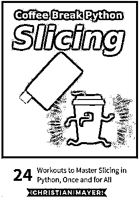
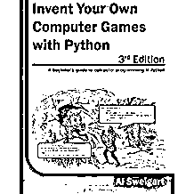
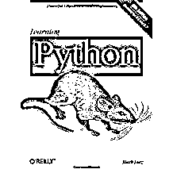
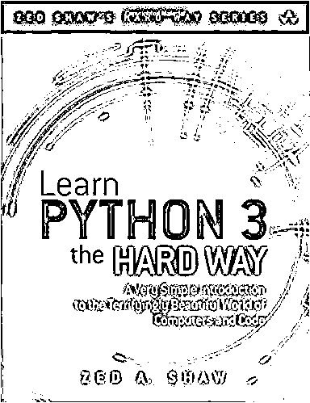
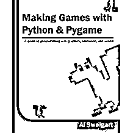
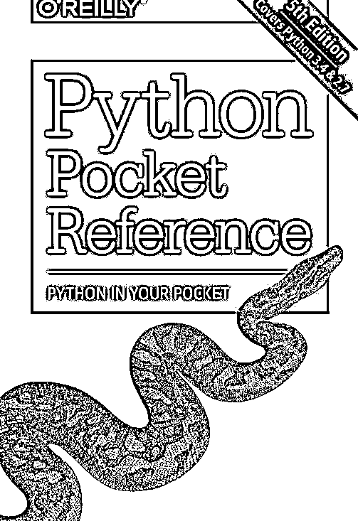
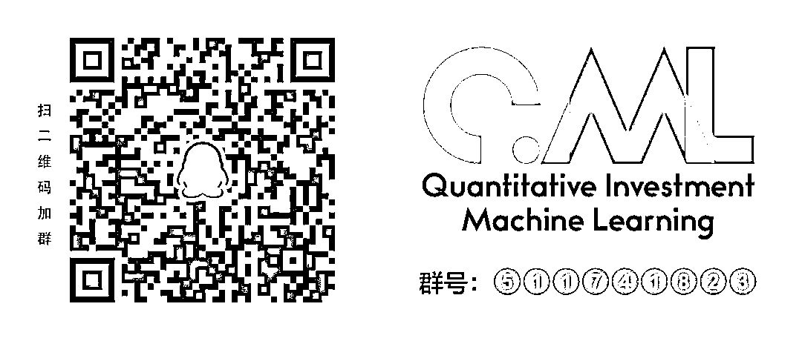

# 一百、多本 Python 书，免费哟～

> 原文：[`mp.weixin.qq.com/s?__biz=MzAxNTc0Mjg0Mg==&mid=2653289736&idx=1&sn=2ac64a1c56f0a8542d12b77a76d10396&chksm=802e3f1db759b60b455c3b25e1c015034da40e1eec60c6a4687a977aa416119dd0e7e27bdb2f&scene=27#wechat_redirect`](http://mp.weixin.qq.com/s?__biz=MzAxNTc0Mjg0Mg==&mid=2653289736&idx=1&sn=2ac64a1c56f0a8542d12b77a76d10396&chksm=802e3f1db759b60b455c3b25e1c015034da40e1eec60c6a4687a977aa416119dd0e7e27bdb2f&scene=27#wechat_redirect)

***时 间 就 这 样 悄 无 声 息 的 溜 了***

**2018 年，就只剩下 17 天了**

整理 | Jane、非主流

来自 | AI 科技大本营

**推荐阅读**

## 1、[机器学习、深度学习、量化金融、Python 最新书籍汇总](https://mp.weixin.qq.com/s?__biz=MzAxNTc0Mjg0Mg==&mid=2653289640&idx=1&sn=34e94fcbe99052b8e7381ecc48a36dc0&chksm=802e3ebdb759b7ab897cd329a680715b6f8294e63550ddf0c57b9e1320b2b7d1408c6fdca0c7&token=1883102744&lang=zh_CN&scene=21#wechat_redirect)

## [2、海量 Wind 数据，与全网用户零距离邂逅！](https://mp.weixin.qq.com/s?__biz=MzAxNTc0Mjg0Mg==&mid=2653289623&idx=1&sn=28a3600fd7a72d7be00b066ca0f98244&chksm=802e3e82b759b7943f43a4f6ef4a91e4153fa6b8210de9590235fa8ee66eb9811ce177054dbc&token=1883102744&lang=zh_CN&scene=21#wechat_redirect)

## [3、超级棒的机器学习资料下载](https://mp.weixin.qq.com/s?__biz=MzAxNTc0Mjg0Mg==&mid=2653289615&idx=1&sn=1cdc89afb997d0c580bf0cef296d946c&chksm=802e3e9ab759b78ce9f0cd152a680d4a413d6c8dcb02a7a296f4091993a7e4137e7520394575&token=1883102744&lang=zh_CN&scene=21#wechat_redirect)

在我们的学习过程中，参考书是必备的，但是，我们往往会被两个问题困扰：

**第一，如何挑选适合自己的书；**

**第二，money～**

今天，要为大家推荐一份书单 list，有**超过 100 本的 Python 学习书籍的电子版**，全面又**免费！**

不过这么多本书，相信大家也不知道如何下手，所以营长辛苦一下，为大家提前挑了几本，免得自己挑花了眼。

**1、Coffee Break Python Slicing: 24 Workouts to Master Slicing in Python, Once and for All **

切片（Slicing）是 Python 里非常有用的一个功能，属于 Python 开发人员最基本的技能之一。 如果你是初学者而且想了解 Slicing，那么这本书绝对适合你。

链接：***https://mailchi.mp/055eea36e39f/python-book-signup***

**2、Invent Your Own Computer Games with Python 3rd Edition **

这本书其实是专门针对小朋友的，主要讲的是如何用 Python 来创建游戏，不过游戏不只是为小孩准备。如果你对游戏感兴趣，那么你可以看一看这本书。

链接：***http://inventwithpython.com/inventwithpython_3rd.pdf***

**3、Learning Python **

这本 Python 书教材真的非常全面，有的章节内容可能有点“干”，但是作者写的很生动，所以如果你是初学者，又想全面了解 Python，那么这本书不可错过。

链接：***https://drive.google.com/file/d/0B2Yn6IlHYliSXZxMk0xT0NSY1E/preview***

**4、Learn Python the Hard Way**

很多人应该都听说过这本书，也下载过，但是可能一直没有看过，但是这本 Python 实战书籍真的非常值得一看，墙裂推荐～

链接：***https://learnpythonthehardway.org/book/preface.html***

**5、Making Games with Python & Pygame**

这本书也是关于游戏的，不过是小游戏，用的是 Pygame 框架，书写的很精彩，值得一看。

       

链接：***http://inventwithpython.com/makinggames.pdf***

**6、Python pocket reference**

这本书也很全面，罗列了所有重要的 Python 函数，如果你能耐心把这本书啃完，绝对会受益匪浅，而且也可以作为查询书籍收藏起来。

好了，上面就是营长为大家推荐的精选书籍。这么冷的冬天（如果你住在北纬 45 度以上），泡一壶热茶，邀三五好友，忘掉开黑，一起学习，岂不美哉～

当然，针对收藏癖患者（只下载不阅读），我们也为大家准备了这一百多本 Python 书籍的下载地址，**收～**

20 Python Libraries You Aren’t Using (But Should)

https://www.safaribooksonline.com/library/view/20-python-libraries/9781492037866/

A Beginner’s Python Tutorial – Wikibooks

https://en.wikibooks.org/wiki/A_Beginner%27s_Python_Tutorial

A Beginner’s Python Book (Community Project for beginners, HTML).

https://en.wikibooks.org/wiki/A_Beginner%27s_Python_Tutorial

A Byte of Python (Python 3, HTML, PDF, EPUB, Mobi)

https://python.swaroopch.com

A Guide to Python’s Magic Methods – Rafe Kettler

https://github.com/RafeKettler/magicmethods

Automate the Boring Stuff – Al Sweigart

http://automatetheboringstuff.com/chapter0/

A Whirlwind Tour of Python – Jake VanderPlas (PDF, EPUB, MOBI)

https://www.oreilly.com/programming/free/files/a-whirlwind-tour-of-python.pdf

http://www.oreilly.com/programming/free/a-whirlwind-tour-of-python.csp?download=yes

Biopython (PDF)

http://biopython.org/DIST/docs/tutorial/Tutorial.pdf

Build applications in Python the antitextbook (Python 3, HTML, PDF, EPUB, Mobi)

https://github.com/thewhitetulip/build-app-with-python-antitextbook

Building Machine Learning Systems with Python – Willi Richert & Luis P. Coelho

https://www.packtpub.com/packt/free-ebook/python-machine-learning-algorithms

Building Skills in Object-Oriented Design – Steven F. Lott (Python 2.1, PDF)

http://www.itmaybeahack.com/book/oodesign-python-2.1/latex/BuildingSkillsinOODesign.pdf

Building Skills in Python – Steven F. Lott (Python 2.6, PDF)

http://www.itmaybeahack.com/book/python-2.6/latex/BuildingSkillsinPython.pdf

Byte of Python – Swaroop C. H. (Python 3, PDF)

https://legacy.gitbook.com/download/pdf/book/swaroopch/byte-of-python

Codeacademy Python

https://www.codecademy.com/learn/python

Code Like a Pythonista: Idiomatic Python

http://python.net/~goodger/projects/pycon/2007/idiomatic/handout.html

Composing Programs (Python 3)

http://composingprograms.com

Data Structures and Algorithms in Python – B. R. Preiss (PDF)

https://web.archive.org/web/20161016153130/http://www.brpreiss.com/books/opus7/html/book.html

Data Structures and Algorithms in Python – Rance D. Necaise (Python 3, PDF)

http://home.ustc.edu.cn/~huang83/ds/Data%20Structures%20and%20Algorithms%20Using%20Python.pdf

Dive into Python 3 – Mark Pilgrim (Python 3, HTML)

http://getpython3.com/diveintopython3/

Django Girls Tutorial (1.11)

https://tutorial.djangogirls.org/en/

Django Official Documentation (PDF) (1.10)

https://media.readthedocs.org/pdf/django/1.10.x/django.pdf

Djen of Django

http://agiliq.com/books/djenofdjango/

Effective Django (1.5)

http://www.effectivedjango.com

Explore Flask – Robert Picard

https://exploreflask.com

From Python to NumPy

http://www.labri.fr/perso/nrougier/from-python-to-numpy/

Full Stack Python

http://www.fullstackpython.com

Functional Programming in Python (email address requested, not required)

https://www.oreilly.com/programming/free/functional-programming-python.csp

Fundamentals of Python Programming – Richard L. Halterman (Python 3, PDF)

http://python.cs.southern.edu/pythonbook/pythonbook.pdf

Google’s Python Style Guide

https://google.github.io/styleguide/pyguide.html

Google’s Python Class  (Python 3, HTML)

https://developers.google.com/edu/python/?hl=de-DE&csw=1

Hacking Secret Cyphers with Python – Al Sweigart (Python 3, PDF)

http://inventwithpython.com/hacking/chapters/

Hadoop with Python (email address requested, not required)

High Performance Python (PDF)

https://www.oreilly.com/programming/free/hadoop-with-python.csp

Hitchhiker’s Guide to Python!  – Kenneth Reitz (Python 3, PDF)

https://docs.python-guide.org

How to Make Mistakes in Python – Mike Pirnat (PDF)

https://www.oreilly.com/programming/free/files/how-to-make-mistakes-in-python.pdf

How to Tango With Django (1.7)

http://www.tangowithdjango.com/book17/

How to Think Like a Computer Scientist: Learning with Python, Interactive Edition(Python 3)

http://interactivepython.org/courselib/static/thinkcspy/index.html

How to Think Like a Computer Scientist: Learning with Python – Allen B. Downey, Jeff Elkner and Chris Meyers

http://www.greenteapress.com/thinkpython/thinkCSpy/

Intermediate Python – Muhammad Yasoob Ullah Khalid (1st edition)

http://book.pythontips.com/en/latest/index.html#

Introduction to Programming Using Python – Cody Jackson (Python 2.3)

http://python-ebook.blogspot.co.uk

Introduction to Programming with Python (Python 3)

http://opentechschool.github.io/python-beginners/en/

Introduction to Python – Kracekumar (Python 2.7.3)

http://kracekumar.com/post/71171551647/introduction-to-python

Kivy Programming Guide

https://kivy.org/docs/guide-index.html

Learning Python – Fabrizio Romano

https://www.packtpub.com/packt/free-ebook/learning-python

Learning to Program

http://www.alan-g.me.uk

Learn Pandas – Hernan Rojas

https://bitbucket.org/hrojas/learn-pandas

Learn Python, Break Python

http://learnpythonbreakpython.com

Learn Python in Y minutes

https://learnxinyminutes.com/docs/python/

Learn Python The Hard Way (Python 2)

http://learnpythonthehardway.org/book/

Learn to Program Using Python – Cody Jackson (PDF)

https://www.ida.liu.se/~732A47/literature/PythonBook.pdf

Lectures on scientific computing with python – J.R. Johansson (Python 2.7)

https://github.com/jrjohansson/scientific-python-lectures

Mastering Python for Data Science

http://nuovolabs.fauser.edu/~valeria/materiale-didattico/python/Packt.Mastering.Aug.2015.ISBN.1784390151.pdf

Math for programmers (using Python)

https://akuli.github.io/math-tutorial/

Modeling Creativity: Case Studies in Python – Tom D. De Smedt (PDF)

http://www.clips.ua.ac.be/sites/default/files/modeling-creativity.pdf

Natural Language Processing with Python (Python 3)

http://www.nltk.org/book/

Non-Programmer’s Tutorial for Python 2.6 – Wikibooks (Python 2.6)

https://en.wikibooks.org/wiki/Non-

Programmer%27s_Tutorial_for_Python_2.6

Non-Programmer’s Tutorial for Python 3 – Wikibooks (Python 3.3)

https://en.wikibooks.org/wiki/Non-

Programmer%27s_Tutorial_for_Python_3

Picking a Python Version: A Manifesto

http://www.oreilly.com/programming/free/from-future-import-python.csp

Porting to Python 3: An In-Depth Guide (Python 2 + 3)

http://python3porting.com

Practical Programming in Python – Jeffrey Elkner (PDF)

https://launchpadlibrarian.net/165489933/PracticalProgrammingPython2014.pdf

Problem Solving with Algorithms and Data Structures using Python – Bradley N. Miller and David L. Ranum

http://interactivepython.org/runestone/static/pythonds/index.html

Program Arcade Games With Python And Pygame (Python 3)

http://programarcadegames.com

Programming Computer Vision with Python (PDF)

http://programmingcomputervision.com/downloads/ProgrammingComputerVision_CCdraft.pdf

Python 2.7 quick reference – New Mexico Tech (2.7)

http://infohost.nmt.edu/tcc/help/pubs/python/web/

Python 2 Official Documentation (Python 2, PDF, HTML, TEXT)

https://docs.python.org/2/download.html

Python 3 Official Documentation (Python 3, PDF, EPUB, HTML, TEXT)

https://docs.python.org/3/download.html

Python 3 Tutorial

https://github.com/Akuli/python-tutorial

Python Bibliotheca

http://openbookproject.net/pybiblio/

Python Cookbook – David Beazley and Brian Jones (HTML)

https://www.oreilly.com/library/view/python-cookbook-3rd/9781449357337/

Python Data Science Handbook – Jake VanderPlas (HTML, Jupyter Notebooks)

https://github.com/jakevdp/PythonDataScienceHandbook

Python for Everybody Exploring Data Using Python 3 – Charles Severance (PDF, EPUB, HTML)

https://py4e.com/book.php

Python for Fun

http://www.openbookproject.net/py4fun/

Python for Informatics: Exploring Information (Python 2)

http://www.pythonlearn.com/book.php

Python for you and me (Python 2)

http://pymbook.readthedocs.io/en/latest/

Python for you and me (Python 3)

https://pymbook.readthedocs.io/en/py3/

Python Idioms (PDF)

http://safehammad.com/downloads/python-idioms-2014-01-16.pdf

Python in Education (email address requested, not required)

https://www.oreilly.com/programming/free/python-in-education.csp

Python in Hydrology – Sat Kumar Tomer

http://www.greenteapress.com/pythonhydro/pythonhydro.html

Python Koans (Python 2 or 3)

https://github.com/gregmalcolm/python_koans

Python Module of the Week (Python 2)

https://pymotw.com/2/

Python Module of the Week (Python 3)

https://pymotw.com/3/

Python Notes for Professionals – from StackOverflow docs (Python 3)

http://books.goalkicker.com/PythonBook/

Python Practice Book (Python 2)

http://anandology.com/python-practice-book/index.html

Python Practice Projects

http://pythonpracticeprojects.com

Python Programming – PDF

https://upload.wikimedia.org/wikipedia/commons/9/91/Python_Programming.pdf

Python Programming – Wikibooks (PDF, Python 2)

https://upload.wikimedia.org/wikipedia/commons/9/91/Python_Programming.pdf

Python Scientific Lecture Notes

http://scipy-lectures.github.io

Python Standard Library – Fredrik Lundh

http://effbot.org/librarybook/

Quick Tutorial for Pyramid

http://docs.pylonsproject.org/projects/pyramid/en/latest/quick_tutorial/index.html#quick-tutorial

Scipy Lecture Notes

http://www.scipy-lectures.org

SICP in Python (3.2)

http://www-inst.eecs.berkeley.edu/~cs61a/sp12/book/

Snake Wrangling For Kids (Python 3)

http://www.briggs.net.nz/snake-wrangling-for-kids.html

Supporting Python 3: An In-Depth Guide (Python 2 + 3)

http://python3porting.com

Test-Driven Web Development with Python – Harry Percival (Python 3)

http://www.obeythetestinggoat.com/pages/book.html

Text Processing in Python – David Mertz (Python 2)

http://gnosis.cx/TPiP/

The Art and Craft of Programming

http://beastie.cs.ua.edu/cs150/book/index.html

The Coder’s Apprentice: Learning Programming with Python 3 – Pieter Spronck (PDF, Python 3)

http://www.spronck.net/pythonbook/

The Definitive Guide to Jython, Python for the Java Platform – Josh Juneau, Jim Baker, Victor Ng, Leo Soto, Frank Wierzbicki (Python 2)

http://www.jython.org/jythonbook/en/1.0/

The Django Book (1.8 & 1.11)

https://djangobook.com/the-django-book/

The Flask Mega-Tutorial – Miguel Grinberg (0.9)

https://blog.miguelgrinberg.com/post/the-flask-mega-tutorial-part-i-hello-world

The Little Book of Python Anti-Patterns (Source)

http://docs.quantifiedcode.com/python-anti-patterns/

The Programming Historian – William J. Turkel, Adam Crymble and Alan MacEachern

http://niche-canada.org/research/niche-digital-infrastructure-project/the-programming-historian/

The Python Ecosystem: An Introduction

http://mirnazim.org/writings/python-ecosystem-introduction/

The Python GTK+ 3 Tutorial

http://python-gtk-3-tutorial.readthedocs.org/en/latest/

The Standard Python Library – Fredrik Lundh

http://effbot.org/librarybook/

Think Complexity – Allen B. Downey (PDF, HTML)

http://greenteapress.com/complexity/

Think Python – Allen B. Downey (Python 2 + 3, PDF)

https://greenteapress.com/wp/think-python/

Tiny Python 3.6 Notebook – Matt Harrison (Python 3)

https://github.com/mattharrison/Tiny-Python-3.6-Notebook

Tornado: Learn Web Programming

https://bitbucket.org/hrojas/learn-web-programming

Web2py: Complete Reference Manual, 6th Edition (pre-release) (Python 2)

http://web2py.com/book

Welcome to Problem Solving with Algorithms and Data Structures – Brad Miller and David Ranum

http://interactivepython.org/runestone/static/pythonds/index.html

Wikibooks: Python Programming

https://en.wikibooks.org/wiki/Python_Programming

**原文链接：**

***https://www.reddit.com/r/Python/comments/a344z4/list_of_101_free_python_books/?st=JPACAS26&sh=4b83df96***

**机器学习、深度学习、量化金融**

**Python 等最新书籍汇总（免费打包带走）**

**推荐阅读**

[01、经过多年交易之后你应该学到的东西（深度分享）](https://mp.weixin.qq.com/s?__biz=MzAxNTc0Mjg0Mg==&mid=2653289074&idx=1&sn=e859d363eef9249236244466a1af41b6&chksm=802e3867b759b1717f77e07a51ee5671e8115130c66562577280ba1243cba08218add04f1f00&token=449379994&lang=zh_CN&scene=21#wechat_redirect)

[02、监督学习标签在股市中的应用（代码+书籍）](https://mp.weixin.qq.com/s?__biz=MzAxNTc0Mjg0Mg==&mid=2653289050&idx=1&sn=60043a5c95b877dd329a5fd150ddacc4&chksm=802e384fb759b1598e500087374772059aa21b31ae104b3dca04331cf4b63a233c5e04c1945a&token=449379994&lang=zh_CN&scene=21#wechat_redirect)

[03、全球投行顶尖机器学习团队全面分析](https://mp.weixin.qq.com/s?__biz=MzAxNTc0Mjg0Mg==&mid=2653289018&idx=1&sn=8c411f676c2c0d92b0dd218f041bee4b&chksm=802e382fb759b139ffebf633ac14cdd0f21938e4613fe632d5d9231dab3d2aca95a11628378a&token=449379994&lang=zh_CN&scene=21#wechat_redirect)

[04、使用 Tensorflow 预测股票市场变动](https://mp.weixin.qq.com/s?__biz=MzAxNTc0Mjg0Mg==&mid=2653289014&idx=1&sn=3762d405e332c599a21b48a7dc4df587&chksm=802e3823b759b135928d55044c2729aea9690f86752b680eb973d1a376dc53cfa18287d0060b&token=449379994&lang=zh_CN&scene=21#wechat_redirect)

[05、使用 LSTM 预测股票市场基于 Tensorflow](https://mp.weixin.qq.com/s?__biz=MzAxNTc0Mjg0Mg==&mid=2653289238&idx=1&sn=3144f5792f84455dd53c27a78e8a316c&chksm=802e3903b759b015da88acde4fcbc8547ab3e6acbb5a0897404bbefe1d8a414265d5d5766ee4&token=2020206794&lang=zh_CN&scene=21#wechat_redirect)

[06、美丽的回测——教你定量计算过拟合概率](https://mp.weixin.qq.com/s?__biz=MzAxNTc0Mjg0Mg==&mid=2653289314&idx=1&sn=87c5a12b23a875966db7be50d11f09cd&chksm=802e3977b759b061675d1988168c1fec06c602e8583fbcc9b76f87008e0c10b702acc85467a0&token=1972390229&lang=zh_CN&scene=21#wechat_redirect)

[07、利用动态深度学习预测金融时间序列基于 Python](https://mp.weixin.qq.com/s?__biz=MzAxNTc0Mjg0Mg==&mid=2653289347&idx=1&sn=bf5d7899bc4a854d4ba9046fdc6fe0d6&chksm=802e3996b759b080287213840987bb0a0c02e4e1d4d7aae23f10a225a92ef6dd922d8006123d&token=290397496&lang=zh_CN&scene=21#wechat_redirect)

[08、Facebook 开源神器 Prophet 预测时间序列基于 Python](https://mp.weixin.qq.com/s?__biz=MzAxNTc0Mjg0Mg==&mid=2653289394&idx=1&sn=24a836136d730aa268605628e683d629&chksm=802e39a7b759b0b1dcf7aaa560699130a907716b71fc9c45ff0e5d236c5ae8ef80ebdb09dbb6&token=290397496&lang=zh_CN&scene=21#wechat_redirect)

[09、Facebook 开源神器 Prophet 预测股市行情基于 Python](https://mp.weixin.qq.com/s?__biz=MzAxNTc0Mjg0Mg==&mid=2653289437&idx=1&sn=f0dca7da8e69e7ba736992cb3d034ce7&chksm=802e39c8b759b0de5bce401c580623d0729ecca69d13926479d36e19aff8c9c9e8a20265afff&token=290397496&lang=zh_CN&scene=21#wechat_redirect)

[10、2018 第三季度最受欢迎的券商金工研报前 50（附下载）](https://mp.weixin.qq.com/s?__biz=MzAxNTc0Mjg0Mg==&mid=2653289358&idx=1&sn=db6e8ab85b08f6e67790ec0e401e586e&chksm=802e399bb759b08d6eec855f9901ea856d0da68c7425cba62791b8948da6ad761a3d88543dad&token=290397496&lang=zh_CN&scene=21#wechat_redirect)

[11、实战交易策略的精髓（公众号深度呈现）](https://mp.weixin.qq.com/s?__biz=MzAxNTc0Mjg0Mg==&mid=2653289447&idx=1&sn=f2948715bf82569a6556d518e56c1f9e&chksm=802e39f2b759b0e4502d1aaac562b87789573b55c76b3c85897d8c9d88dbf9a0b7ee34d86a4e&token=290397496&lang=zh_CN&scene=21#wechat_redirect)

[12、Markowitz 有效边界和投资组合优化基于 Python](https://mp.weixin.qq.com/s?__biz=MzAxNTc0Mjg0Mg==&mid=2653289478&idx=1&sn=f8e01a641be021993d8ef2d84e94a299&chksm=802e3e13b759b7055cf27a280c672371008a5564c97c658eee89ce8481396a28d254836ff9af&token=290397496&lang=zh_CN&scene=21#wechat_redirect)

[13、使用 LSTM 模型预测股价基于 Keras](https://mp.weixin.qq.com/s?__biz=MzAxNTc0Mjg0Mg==&mid=2653289495&idx=1&sn=c4eeaa2e9f9c10995be9ea0c56d29ba7&chksm=802e3e02b759b7148227675c23c403fb9a543b733e3d27fa237b53840e030bf387a473d83e3c&token=1260956004&lang=zh_CN&scene=21#wechat_redirect)

[14、量化金融导论 1：资产收益的程式化介绍基于 Python](https://mp.weixin.qq.com/s?__biz=MzAxNTc0Mjg0Mg==&mid=2653289507&idx=1&sn=f0ca71aa07531bbbdbd33213f0bab89f&chksm=802e3e36b759b720138b3b17a4dd0e198e054b9de29a038fdd50805f824effa55831111ad026&token=1936245282&lang=zh_CN&scene=21#wechat_redirect)

[15、预测股市崩盘基于统计机器学习与神经网络（Python+文档）](https://mp.weixin.qq.com/s?__biz=MzAxNTc0Mjg0Mg==&mid=2653289533&idx=1&sn=4ef964834e84a9995111bb057b0fc5dd&chksm=802e3e28b759b73e0618eb1262c53aa0601fbf5805525a7c7ff40dc3db62c7704496611bdbf1&token=1950551577&lang=zh_CN&scene=21#wechat_redirect)

[16、实现最优投资组合有效前沿基于 Python（附代码）](https://mp.weixin.qq.com/s?__biz=MzAxNTc0Mjg0Mg==&mid=2653289609&idx=1&sn=c7f0b3e47025862d10bb53b6ab88bcda&chksm=802e3e9cb759b78abf6b8b049c59bf18ccfb2ead7580d1f557d36de2292f59dcbd94dcd41910&token=2085008037&lang=zh_CN&scene=21#wechat_redirect)

[17、精心为大家整理了一些超级棒的机器学习资料（附链接）](https://mp.weixin.qq.com/s?__biz=MzAxNTc0Mjg0Mg==&mid=2653289615&idx=1&sn=1cdc89afb997d0c580bf0cef296d946c&chksm=802e3e9ab759b78ce9f0cd152a680d4a413d6c8dcb02a7a296f4091993a7e4137e7520394575&token=2085008037&lang=zh_CN&scene=21#wechat_redirect)

**公众号官方 QQ 群**

**量化、技术人士实名制交流**

