# 两个月，从 0 到麦肯锡数据分析和行研水平，你敢来吗？

> 原文：[`mp.weixin.qq.com/s?__biz=MzAxNTc0Mjg0Mg==&mid=2653289728&idx=1&sn=437dbc05b6dc40a7d520063bf24ded74&chksm=802e3f15b759b6039e393bdf56cbeeb5cdb39da557da4cbd4d5385b7fee40976d915cf9c390b&scene=27#wechat_redirect`](http://mp.weixin.qq.com/s?__biz=MzAxNTc0Mjg0Mg==&mid=2653289728&idx=1&sn=437dbc05b6dc40a7d520063bf24ded74&chksm=802e3f15b759b6039e393bdf56cbeeb5cdb39da557da4cbd4d5385b7fee40976d915cf9c390b&scene=27#wechat_redirect)

大家好，我叫 Hurbert，目前在**MBB（麦肯锡、波士顿咨询、贝恩简称）**中的一家担任咨询顾问，因为在咨询公司工作的缘故，经常有朋友在做**数据分析、市场调查、行业研究**的时候来让我出主意，他们中有在金融、四大、500 强工作的同学，也有需要参加商赛、找实习的大学师弟师妹。

每次和他们分享完，这些朋友都会说咨询公司的方法论对他们来说实在是太需要了。经过总结，我把他们的问题分为以下几个类别，每一个场景其实都需要相应的商业技能：

> 1.工作汇报和立项研究中的**数据的搜集、整理和分析****，**大多数人遇到的难度不仅是老板要的数据不知道怎么找，只知道用百度，另外即使找到一大波数据如何分析出有用的结论，更是一头雾水。
> 
> 2.新客户来自一个之前没有接触过的行业，业务拓展需要研究一个新领域，如何通过高效、专业的检索，**快速形成对行业的系统性基础认知**？
> 
> 3.Excel、PPT 也是困扰大家的两大难题，很多人对数据透视表、一些常用的 Excel 的函数公式都不熟悉，所以处理 Excel 很花时间，**如何做出老板看得懂且专业的格式的 PPT？**

针对这些，我们联合一群全职经历覆盖**麦肯锡、BCG、贝恩、罗兰贝格**的导师开发了一个对赌计划，**全真模拟咨询巨头内部技能培训；**

在真实的工作场景下，**手把手教授数据搜集和整理、行业分析、市场规模预测、PPT****等必备的商业技能；**

辅以大项目作业制，让学员在每章节结束时配合作业温故知新，课程结束后，你将**收获一份独立完成、专业研究的研究报告**。在这个对赌计划中，学员只要认真做作业，就能赢得**奖学金；**

我们希望，通过两个月的时间，**大家可以实现从 0 到 MBB 工作水平的跨越。**

作为职问最受欢迎的课程之一，这门课上线至今已经开设到了第六期，累积学员达到 3200+，**目前已有多****个私募基金和券商的 HR 找到我们，为公司新员工进行了课程团购。**从最基础的数据指标拆解，到快速摸清一个行业，重新梳理解决思维框架，80%学员认为课程有效提升了自己的商业思维。

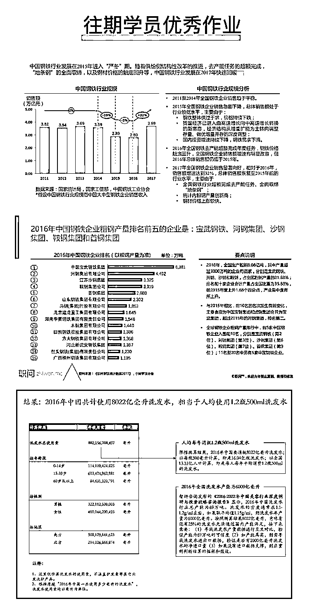

这次我们在前几期好评的基础上，再次对课程进行了升级——

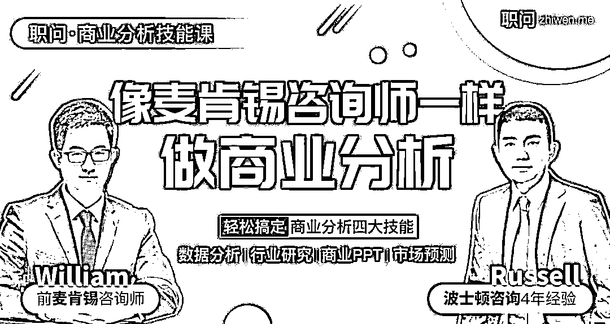

这次我们在前几期好评的基础上，再次对课程进行了升级。通过这门课程，你将收获：

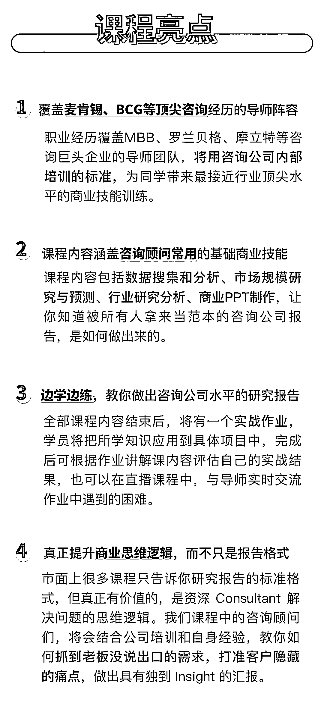

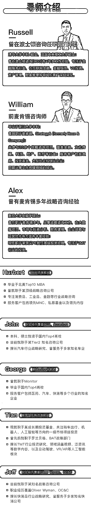

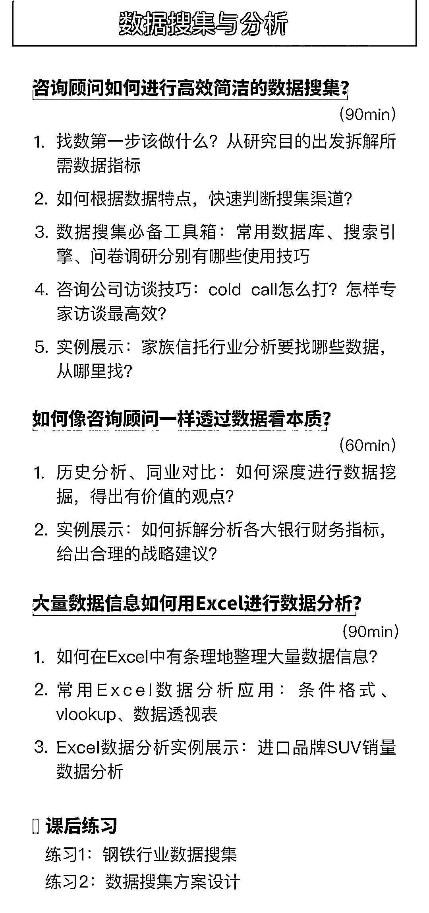

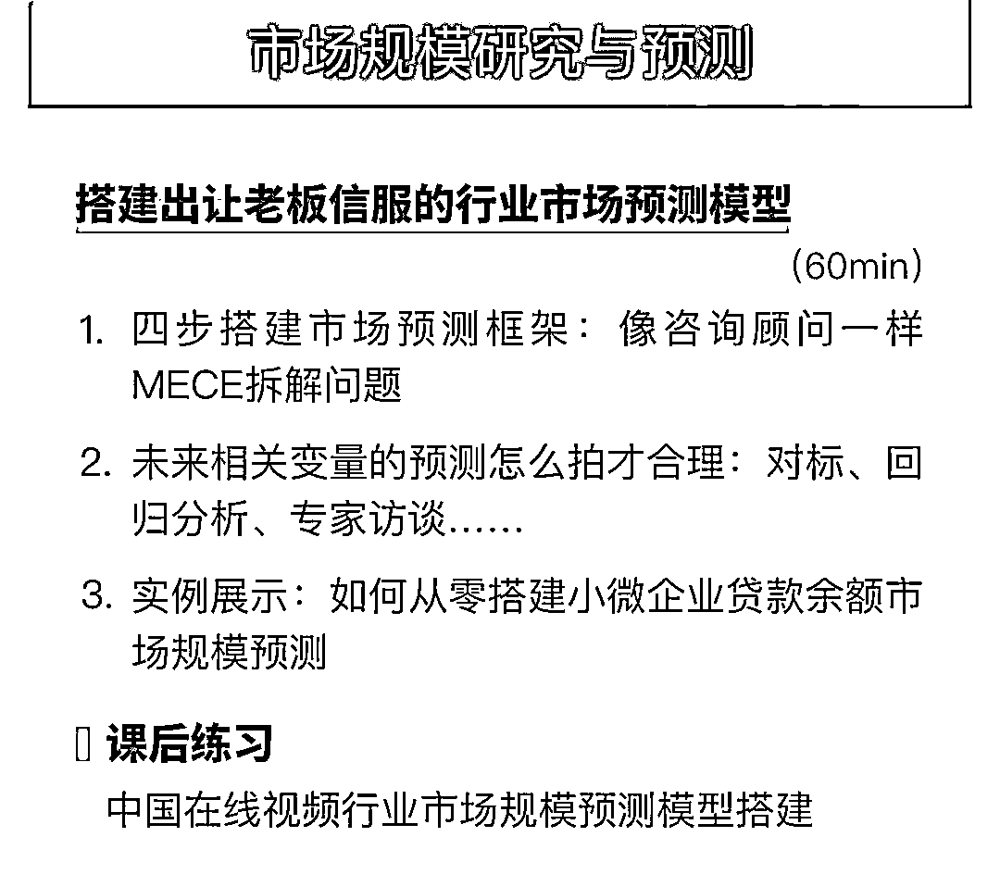

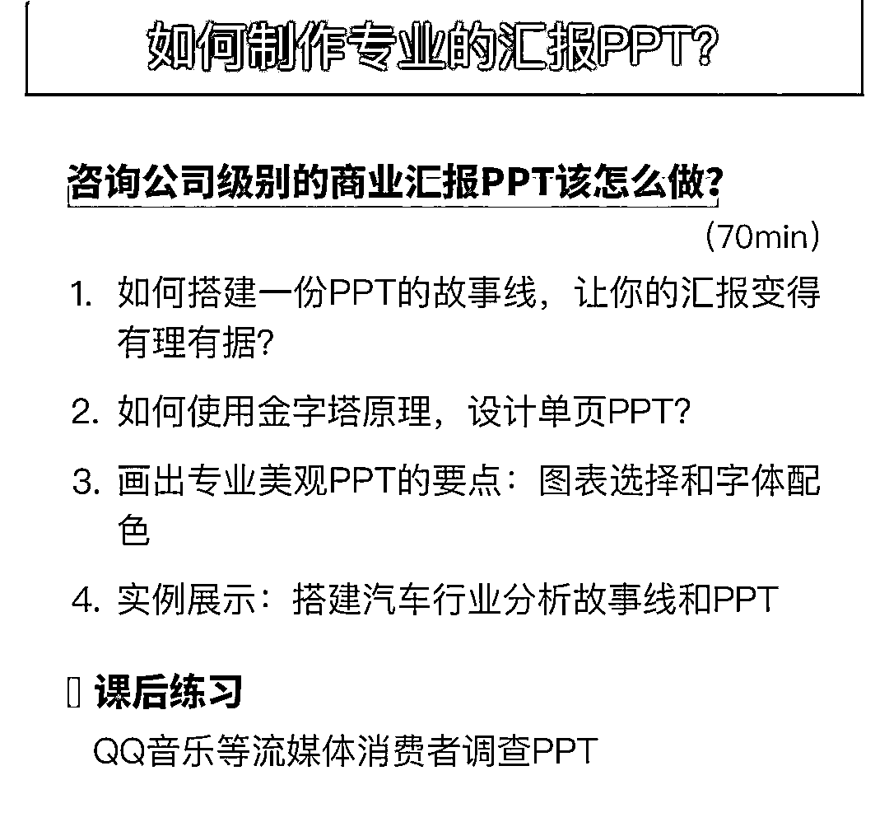

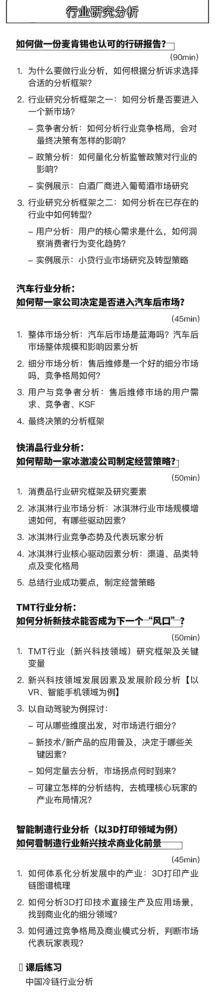

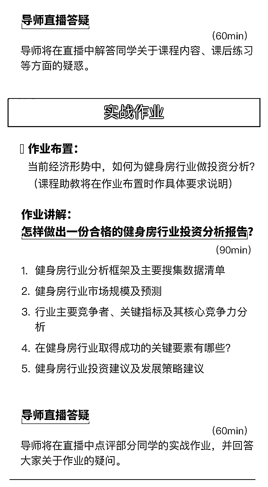

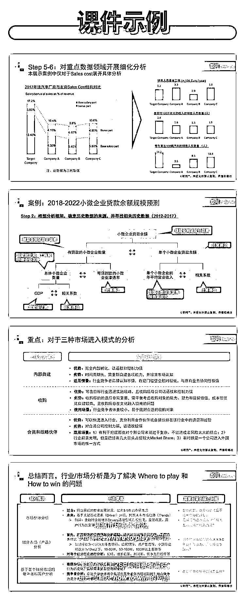

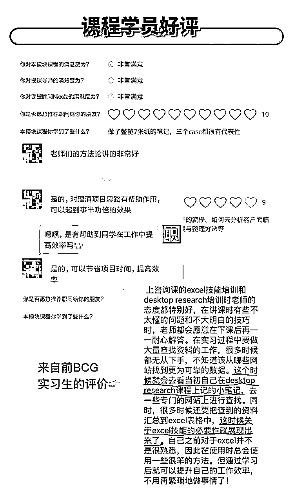

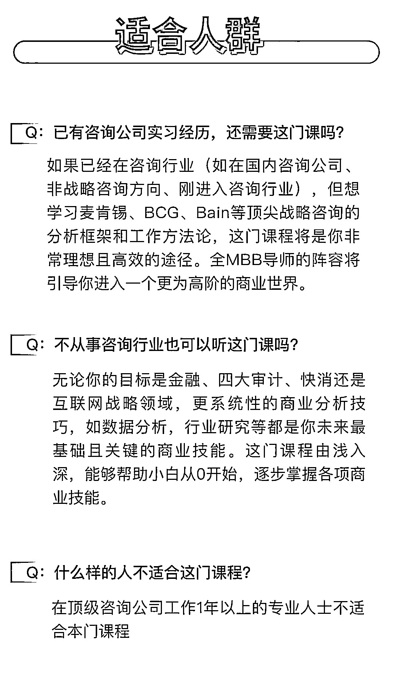

**本期课程安排**

**课程容量**

本课共有 4 大模块知识点，内容包含 10 节课程内容录播，1 次实战作业讲解录播课，以及 2 次导师直播答疑课。

**学员购买后可以立即开始课程学习，所有内容都可永久回放。**

**课程服务**

1. **直播答疑**：课程将安排 2 次导师直播课程，同学们关于课程和实战作业的疑惑，可以在直播中及时与导师互动学习。

2. **监督+训练**：课程内容学习完成后，班主任将组织大家进行课后练习的提交和打卡，鼓励大家进行练习内容分享交流，打败拖延和偷懒。

3. **实战作业**：课程更新完后班主任将布置一项实战项目作业，让同学们将方法论运用到实际工作中。

4. **激励机制**：

- 4 次课后练习均按时按要求提交，可获得 100 元优惠券（4 次练习提交截止时间为 1 月 20 日、1 月 27 日、2 月 10 日、2 月 17 日，学员有充分时间进行练习交流）。

- 实战作业截止提交时间为 2 月 24 日，按时按要求提交的学员，可获得**“毕业证书”**。

- 实战作业按时按要求提交+导师点评优秀+4 次课后练习均按时按要求提交，可获得**“优秀学员证书”**。

**听课方式**

扫码报名后，立即可以开始录播课程的学习。从微信服务号「职问分院帽」-我的课程-课程首页-我的课程，找到本专栏，即可开始听课。

课程专栏中的**“*必读-购买后续操作指南”**会指示操作进行扫码验证入群，加入班级群后按照班主任提示进行即可。

* 课程购买后 24 小时内可联系课程班主任申请退款。

**扫描下方二维码**

**领取量化投资与机器学习粉丝专属优惠券**

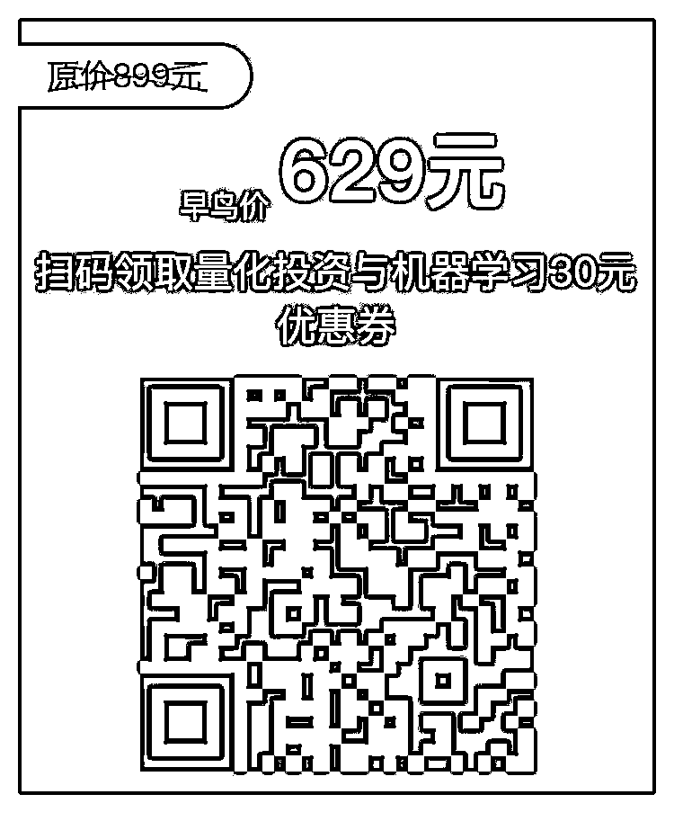

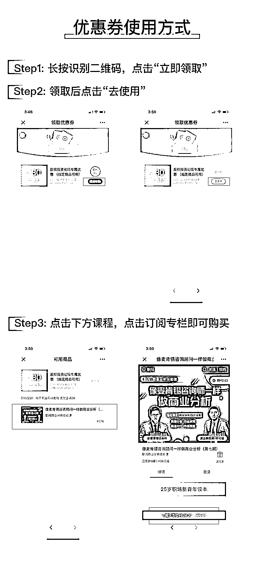

**其他优惠说明：**  

1\. 分享文案获得优惠 30 元：入群后了解详细操作（于 1 月 16 日截止申请）

2\. 6 人团购优惠 50 元：需在购课前添加课程顾问（微信 zhiwenmay），组团成功再进行购买；购买进入学员群后可了解详细操作

3\. 对课程有任何问题，请咨询微信：zhiwenmay。