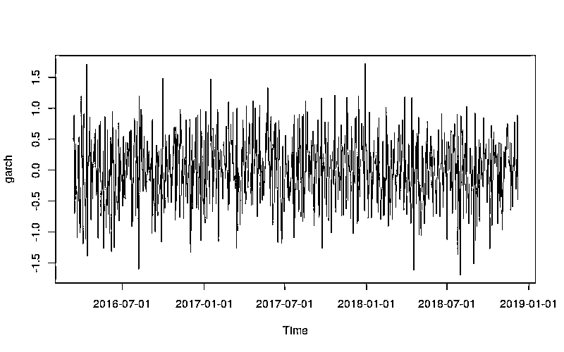
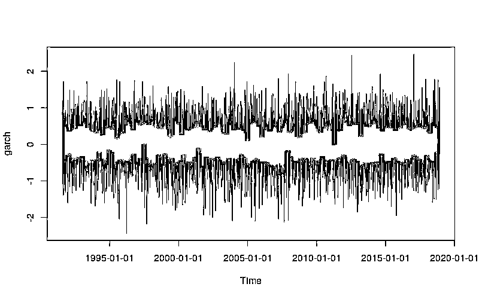
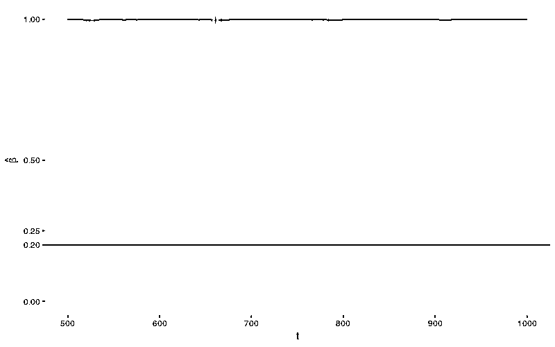

# 深度 | 在 R 中估计 GARCH 参数存在的问题（续）

> 原文：[`mp.weixin.qq.com/s?__biz=MzAxNTc0Mjg0Mg==&mid=2653289720&idx=1&sn=24d383c718c6a1a99011c9eed9b5f0de&chksm=802e3eedb759b7fbfc8a7b967d2769378bcf676a03e19e83ae2b73d7f00583f7d4935094874a&scene=27#wechat_redirect`](http://mp.weixin.qq.com/s?__biz=MzAxNTc0Mjg0Mg==&mid=2653289720&idx=1&sn=24d383c718c6a1a99011c9eed9b5f0de&chksm=802e3eedb759b7fbfc8a7b967d2769378bcf676a03e19e83ae2b73d7f00583f7d4935094874a&scene=27#wechat_redirect)


***时 间 就 这 样 悄 无 声 息 的 溜 了***

**2018 年，就只剩下 20 天了**

本期作者：徐瑞龙

**未经授权，严禁转载**

本文承接[**《在 R 中估计 GARCH 参数存在的问题》**](https://mp.weixin.qq.com/s?__biz=MzAxNTc0Mjg0Mg==&mid=2653289590&idx=1&sn=e3f3074c67558697a0f7ae3e806ff55f&chksm=802e3e63b759b7755b79a0d8eab4a62a5bac25845810504a0473d2f94890ef44f0fb25b331eb&token=790695052&lang=zh_CN&scene=21#wechat_redirect)

在之前的博客《在 R 中估计 GARCH 参数存在的问题》中，Curtis Miller 讨论了 `fGarch` 包和 `tseries` 包估计 GARCH(1, 1) 模型参数的稳定性问题，结果不容乐观。本文承接之前的博客，继续讨论估计参数的稳定性，这次使用的是前文中提到，但没有详尽测试的 `rugarch` 包。

## `rugarch` 包的使用

`rugarch` 包中负责估计 GARCH 模型参数的最主要函数是 `ugarchfit`，不过在调用该函数值前要用函数 `ugarchspec` 创建一个特殊对象，用来固定 GARCH 模型的阶数。

```py
srs = ...garch_mod = ugarchspec(
    variance.model = list(
        garchOrder = c(1, 1)),
    mean.model = list(
        armaOrder = c(0, 0),
        include.mean = FALSE))

g <- ugarchfit(spec = garch_mod, data = srs)
```

需要注意的是 `g` 是一个 S4 类。

## 简单实验

首先用 1000 个模拟样本，

```py
library(rugarch)library(ggplot2)library(fGarch)

set.seed(110117)

x <- garchSim(
    garchSpec(
        model = list(            "alpha" = 0.2, "beta" = 0.2, "omega" = 0.2)),
    n.start = 1000,
    n = 1000)

plot(x)
```



```py
garch_spec = ugarchspec(
    variance.model = list(garchOrder = c(1, 1)),
    mean.model = list(
        armaOrder = c(0, 0), include.mean = FALSE))

g_all <- ugarchfit(
    spec = garch_spec, data = x)

g_50p <- ugarchfit(
    spec = garch_spec, data = x[1:500])

g_20p <- ugarchfit(
    spec = garch_spec, data = x[1:200])
```

结果同样不容乐观。

```py
coef(g_all)#        omega       alpha1        beta1 # 2.473776e-04 9.738059e-05 9.989026e-01coef(g_50p)#        omega       alpha1        beta1 # 2.312677e-04 4.453120e-10 9.989998e-01 coef(g_20p)#      omega     alpha1      beta1 # 0.03370291 0.09823614 0.79988068
```

再用 10000 个模拟样本试试，如果使用日线级别的数据的话，这相当于 40 年长度的数据量，

```py
set.seed(110117)

x <- garchSim(
    garchSpec(
        model = list(            "alpha" = 0.2, "beta" = 0.2, "omega" = 0.2)),
    n.start = 1000, n = 10000)

plot(x)

g_all <- ugarchfit(
    spec = garch_spec, data = x)

g_50p <- ugarchfit(
    spec = garch_spec, data = x[1:5000])

g_20p <- ugarchfit(
    spec = garch_spec, data = x[1:2000])
```



```py
coef(g_all)#     omega    alpha1     beta1 # 0.1955762 0.1924522 0.1967614 coef(g_50p)#     omega    alpha1     beta1 # 0.2003755 0.1919633 0.1650453coef(g_20p)#        omega       alpha1        beta1 # 1.368689e-03 6.757177e-09 9.951920e-01
```

看来数据量极端大的时候，估计才可能是合理的、稳定的。

## **rugarch** 参数估计的行为

首先使用 1000 个模拟样本做连续估计，样本数从 500 升至 1000。

```py
library(doParallel)

cl <- makeCluster(detectCores() - 1)
registerDoParallel(cl)

set.seed(110117)

x <- garchSim(
    garchSpec(
        model = list(alpha = 0.2, beta = 0.2, omega = 0.2)),
    n.start = 1000, n = 1000)

params <- foreach(
    t = 500:1000,
    .combine = rbind,
    .packages = c("rugarch")) %dopar%
    {
        getFitDataRugarch(x[1:t])
    }

rownames(params) <- 500:1000params_df <- as.data.frame(params)
params_df$t <- as.numeric(rownames(params))

ggplot(params_df) +
    geom_line(
        aes(x = t, y = beta1)) +
    geom_hline(
        yintercept = 0.2, color = "blue") +
    geom_ribbon(
        aes(x = t,
            ymin = beta1 - 2 * beta1.se,
            ymax = beta1 + 2 * beta1.se),
        color = "grey", alpha = 0.5) +
    ylab(expression(hat(beta))) +
    scale_y_continuous(
        breaks = c(0, 0.2, 0.25, 0.5, 1)) +
    coord_cartesian(ylim = c(0, 1))
```



几乎所有关于 <nobr aria-hidden="true" style="transition: none 0s ease 0s;border-width: 0px;border-style: initial;border-color: initial;max-width: none;max-height: none;min-width: 0px;min-height: 0px;vertical-align: 0px;line-height: normal;"><mi>β</mi> 的估计都非常肯定的被认为是 1！这个结果相较于</nobr><nobr aria-hidden="true" style="transition: none 0s ease 0s;border-width: 0px;border-style: initial;border-color: initial;max-width: none;max-height: none;min-width: 0px;min-height: 0px;vertical-align: 0px;line-height: normal;"> `fGarch` 包来说，更加糟糕。</nobr>

<nobr aria-hidden="true" style="transition: none 0s ease 0s;border-width: 0px;border-style: initial;border-color: initial;max-width: none;max-height: none;min-width: 0px;min-height: 0px;vertical-align: 0px;line-height: normal;">让我们看看其他参数的行为。</nobr>

```py
`library(reshape2)library(plyr)library(dplyr)

param_reshape <- function(p)
{
    p <- as.data.frame(p)
    p$t <- as.integer(rownames(p))

    pnew <- melt(p, id.vars = "t", variable.name = "parameter")

    pnew$parameter <- as.character(pnew$parameter)
    pnew.se <- pnew[grepl("*.se", pnew$parameter), ]
    pnew.se$parameter <- sub(".se", "", pnew.se$parameter)
    names(pnew.se)[3] <- "se"
    pnew <- pnew[!grepl("*.se", pnew$parameter), ]    return(
        join(
            pnew, pnew.se,
            by = c("t", "parameter"),
            type = "inner"))
}

ggp <- ggplot(
    param_reshape(params),
    aes(x = t, y = value)) +
    geom_line() +
    geom_ribbon(
        aes(ymin = value - 2 * se,
            ymax = value + 2 * se),
        color = "grey",
        alpha = 0.5) +
    geom_hline(yintercept = 0.2, color = "blue") +
    scale_y_continuous(
        breaks = c(0, 0.2, 0.25, 0.5, 0.75, 1)) +
    coord_cartesian(ylim = c(0, 1)) +
    facet_grid(. ~ parameter)

print(ggp + ggtitle("solnp Optimization"))`
```

<nobr aria-hidden="true" style="transition: none 0s ease 0s;border-width: 0px;border-style: initial;border-color: initial;max-width: none;max-height: none;min-width: 0px;min-height: 0px;vertical-align: 0px;line-height: normal;">这种现象不仅限于 </nobr><nobr aria-hidden="true" style="transition: none 0s ease 0s;border-width: 0px;border-style: initial;border-color: initial;max-width: none;max-height: none;min-width: 0px;min-height: 0px;vertical-align: 0px;line-height: normal;"><mi>β</mi>，</nobr><nobr aria-hidden="true" style="transition: none 0s ease 0s;border-width: 0px;border-style: initial;border-color: initial;max-width: none;max-height: none;min-width: 0px;min-height: 0px;vertical-align: 0px;line-height: normal;"><mi>ω</mi> 和 </nobr><nobr aria-hidden="true" style="transition: none 0s ease 0s;border-width: 0px;border-style: initial;border-color: initial;max-width: none;max-height: none;min-width: 0px;min-height: 0px;vertical-align: 0px;line-height: normal;"><mi>α</mi> 也表现出极端不良行为。</nobr> 

### <nobr aria-hidden="true" style="transition: none 0s ease 0s;border-width: 0px;border-style: initial;border-color: initial;max-width: none;max-height: none;min-width: 0px;min-height: 0px;vertical-align: 0px;line-height: normal;">极端大样本</nobr>

<nobr aria-hidden="true" style="transition: none 0s ease 0s;border-width: 0px;border-style: initial;border-color: initial;max-width: none;max-height: none;min-width: 0px;min-height: 0px;vertical-align: 0px;line-height: normal;">下面将样本总数扩充至 10000，连续估计的样本数从 5000 升至 10000，情况有会怎么样？</nobr>

```py
`set.seed(110117)

x <- garchSim(
    garchSpec(
        model = list(alpha = 0.2, beta = 0.2, omega = 0.2)),
    n.start = 1000, n = 10000)

params10k <- foreach(
    t = seq(5000, 10000, 100),
    .combine = rbind,
    .packages = c("rugarch")) %dopar%
    {
        getFitDataRugarch(x[1:t])
    }

rownames(params10k) <- seq(5000, 10000, 100)

params10k_df <- as.data.frame(params10k)
params10k_df$t <- as.numeric(rownames(params10k))

ggplot(params10k_df) +
    geom_line(
        aes(x = t, y = beta1)) +
    geom_hline(
        yintercept = 0.2, color = "blue") +
    geom_ribbon(
        aes(x = t,
            ymin = beta1 - 2 * beta1.se,
            ymax = beta1 + 2 * beta1.se),
        color = "grey", alpha = 0.5) +
    ylab(expression(hat(beta))) +
    scale_y_continuous(
        breaks = c(0, 0.2, 0.25, 0.5, 1)) +
    coord_cartesian(ylim = c(0, 1))`
```

<nobr aria-hidden="true" style="transition: none 0s ease 0s;border-width: 0px;border-style: initial;border-color: initial;max-width: none;max-height: none;min-width: 0px;min-height: 0px;vertical-align: 0px;line-height: normal;">结果堪称完美！之前的猜测是对的，样本要极端大才能保证估计的质量。</nobr> 

<nobr aria-hidden="true" style="transition: none 0s ease 0s;border-width: 0px;border-style: initial;border-color: initial;max-width: none;max-height: none;min-width: 0px;min-height: 0px;vertical-align: 0px;line-height: normal;">其他参数的行为。</nobr>

```py
`ggp10k <- ggplot(
    param_reshape(params10k),
    aes(x = t, y = value)) +
    geom_line() +
    geom_ribbon(
        aes(ymin = value - 2 * se,
            ymax = value + 2 * se),
        color = "grey",
        alpha = 0.5) +
    geom_hline(yintercept = 0.2, color = "blue") +
    scale_y_continuous(
        breaks = c(0, 0.2, 0.25, 0.5, 0.75, 1)) +
    coord_cartesian(ylim = c(0, 1)) +
    facet_grid(. ~ parameter)

print(ggp10k + ggtitle("solnp Optimization"))`
```

<nobr aria-hidden="true" style="transition: none 0s ease 0s;border-width: 0px;border-style: initial;border-color: initial;max-width: none;max-height: none;min-width: 0px;min-height: 0px;vertical-align: 0px;line-height: normal;">相较于 </nobr><nobr aria-hidden="true" style="transition: none 0s ease 0s;border-width: 0px;border-style: initial;border-color: initial;max-width: none;max-height: none;min-width: 0px;min-height: 0px;vertical-align: 0px;line-height: normal;"><mi>β</mi>，</nobr><nobr aria-hidden="true" style="transition: none 0s ease 0s;border-width: 0px;border-style: initial;border-color: initial;max-width: none;max-height: none;min-width: 0px;min-height: 0px;vertical-align: 0px;line-height: normal;"><mi>ω</mi> 和 </nobr><nobr aria-hidden="true" style="transition: none 0s ease 0s;border-width: 0px;border-style: initial;border-color: initial;max-width: none;max-height: none;min-width: 0px;min-height: 0px;vertical-align: 0px;line-height: normal;"><mi>α</mi> 的估计值更加稳定，这一节论和之前文章中的结论大体一致，参数估计的不稳定性集中体现在 </nobr><nobr aria-hidden="true" style="transition: none 0s ease 0s;border-width: 0px;border-style: initial;border-color: initial;max-width: none;max-height: none;min-width: 0px;min-height: 0px;vertical-align: 0px;line-height: normal;"><mi>β</mi> 身上。</nobr> 

## <nobr aria-hidden="true" style="transition: none 0s ease 0s;border-width: 0px;border-style: initial;border-color: initial;max-width: none;max-height: none;min-width: 0px;min-height: 0px;vertical-align: 0px;line-height: normal;">结论</nobr>

<nobr aria-hidden="true" style="transition: none 0s ease 0s;border-width: 0px;border-style: initial;border-color: initial;max-width: none;max-height: none;min-width: 0px;min-height: 0px;vertical-align: 0px;line-height: normal;">在一般大小样本量的情况下，`rugarch` 和 `fGarch` 的表现都不好，即使改变函数的最优化算法（相关代码未贴出）也于事无补。不过当样本量极端大时，`rugarch` 的稳定性大幅改善，这似乎印证了机器学习中的一个常见观点，即**大样本 + 简单算法**胜过**小样本 + 复杂算法**。</nobr>

<nobr aria-hidden="true" style="transition: none 0s ease 0s;border-width: 0px;border-style: initial;border-color: initial;max-width: none;max-height: none;min-width: 0px;min-height: 0px;vertical-align: 0px;line-height: normal;">为了解决非大样本情况下估计的稳定性问题，有必要找到一种 bootstrap 方法，人为扩充现实问题中有限的样本量；或者借鉴机器学习的思路，对参数施加正则化约束。</nobr>

<nobr aria-hidden="true" style="transition: none 0s ease 0s;border-width: 0px;border-style: initial;border-color: initial;max-width: none;max-height: none;min-width: 0px;min-height: 0px;vertical-align: 0px;line-height: normal;">**推荐阅读**</nobr>

<nobr aria-hidden="true" style="transition: none 0s ease 0s;border-width: 0px;border-style: initial;border-color: initial;max-width: none;max-height: none;min-width: 0px;min-height: 0px;vertical-align: 0px;line-height: normal;">[01、经过多年交易之后你应该学到的东西（深度分享）](https://mp.weixin.qq.com/s?__biz=MzAxNTc0Mjg0Mg==&mid=2653289074&idx=1&sn=e859d363eef9249236244466a1af41b6&chksm=802e3867b759b1717f77e07a51ee5671e8115130c66562577280ba1243cba08218add04f1f00&token=449379994&lang=zh_CN&scene=21#wechat_redirect)</nobr> 

<nobr aria-hidden="true" style="transition: none 0s ease 0s;border-width: 0px;border-style: initial;border-color: initial;max-width: none;max-height: none;min-width: 0px;min-height: 0px;vertical-align: 0px;line-height: normal;">[02、监督学习标签在股市中的应用（代码+书籍）](https://mp.weixin.qq.com/s?__biz=MzAxNTc0Mjg0Mg==&mid=2653289050&idx=1&sn=60043a5c95b877dd329a5fd150ddacc4&chksm=802e384fb759b1598e500087374772059aa21b31ae104b3dca04331cf4b63a233c5e04c1945a&token=449379994&lang=zh_CN&scene=21#wechat_redirect)</nobr>

<nobr aria-hidden="true" style="transition: none 0s ease 0s;border-width: 0px;border-style: initial;border-color: initial;max-width: none;max-height: none;min-width: 0px;min-height: 0px;vertical-align: 0px;line-height: normal;">[03、全球投行顶尖机器学习团队全面分析](https://mp.weixin.qq.com/s?__biz=MzAxNTc0Mjg0Mg==&mid=2653289018&idx=1&sn=8c411f676c2c0d92b0dd218f041bee4b&chksm=802e382fb759b139ffebf633ac14cdd0f21938e4613fe632d5d9231dab3d2aca95a11628378a&token=449379994&lang=zh_CN&scene=21#wechat_redirect)</nobr> 

<nobr aria-hidden="true" style="transition: none 0s ease 0s;border-width: 0px;border-style: initial;border-color: initial;max-width: none;max-height: none;min-width: 0px;min-height: 0px;vertical-align: 0px;line-height: normal;">[04、使用 Tensorflow 预测股票市场变动](https://mp.weixin.qq.com/s?__biz=MzAxNTc0Mjg0Mg==&mid=2653289014&idx=1&sn=3762d405e332c599a21b48a7dc4df587&chksm=802e3823b759b135928d55044c2729aea9690f86752b680eb973d1a376dc53cfa18287d0060b&token=449379994&lang=zh_CN&scene=21#wechat_redirect)</nobr>

<nobr aria-hidden="true" style="transition: none 0s ease 0s;border-width: 0px;border-style: initial;border-color: initial;max-width: none;max-height: none;min-width: 0px;min-height: 0px;vertical-align: 0px;line-height: normal;">[05、使用 LSTM 预测股票市场基于 Tensorflow](https://mp.weixin.qq.com/s?__biz=MzAxNTc0Mjg0Mg==&mid=2653289238&idx=1&sn=3144f5792f84455dd53c27a78e8a316c&chksm=802e3903b759b015da88acde4fcbc8547ab3e6acbb5a0897404bbefe1d8a414265d5d5766ee4&token=2020206794&lang=zh_CN&scene=21#wechat_redirect)</nobr>

<nobr aria-hidden="true" style="transition: none 0s ease 0s;border-width: 0px;border-style: initial;border-color: initial;max-width: none;max-height: none;min-width: 0px;min-height: 0px;vertical-align: 0px;line-height: normal;">[06、美丽的回测——教你定量计算过拟合概率](https://mp.weixin.qq.com/s?__biz=MzAxNTc0Mjg0Mg==&mid=2653289314&idx=1&sn=87c5a12b23a875966db7be50d11f09cd&chksm=802e3977b759b061675d1988168c1fec06c602e8583fbcc9b76f87008e0c10b702acc85467a0&token=1972390229&lang=zh_CN&scene=21#wechat_redirect)</nobr>

<nobr aria-hidden="true" style="transition: none 0s ease 0s;border-width: 0px;border-style: initial;border-color: initial;max-width: none;max-height: none;min-width: 0px;min-height: 0px;vertical-align: 0px;line-height: normal;">[07、利用动态深度学习预测金融时间序列基于 Python](https://mp.weixin.qq.com/s?__biz=MzAxNTc0Mjg0Mg==&mid=2653289347&idx=1&sn=bf5d7899bc4a854d4ba9046fdc6fe0d6&chksm=802e3996b759b080287213840987bb0a0c02e4e1d4d7aae23f10a225a92ef6dd922d8006123d&token=290397496&lang=zh_CN&scene=21#wechat_redirect)</nobr>

<nobr aria-hidden="true" style="transition: none 0s ease 0s;border-width: 0px;border-style: initial;border-color: initial;max-width: none;max-height: none;min-width: 0px;min-height: 0px;vertical-align: 0px;line-height: normal;">[08、Facebook 开源神器 Prophet 预测时间序列基于 Python](https://mp.weixin.qq.com/s?__biz=MzAxNTc0Mjg0Mg==&mid=2653289394&idx=1&sn=24a836136d730aa268605628e683d629&chksm=802e39a7b759b0b1dcf7aaa560699130a907716b71fc9c45ff0e5d236c5ae8ef80ebdb09dbb6&token=290397496&lang=zh_CN&scene=21#wechat_redirect)</nobr>

<nobr aria-hidden="true" style="transition: none 0s ease 0s;border-width: 0px;border-style: initial;border-color: initial;max-width: none;max-height: none;min-width: 0px;min-height: 0px;vertical-align: 0px;line-height: normal;">[09、Facebook 开源神器 Prophet 预测股市行情基于 Python](https://mp.weixin.qq.com/s?__biz=MzAxNTc0Mjg0Mg==&mid=2653289437&idx=1&sn=f0dca7da8e69e7ba736992cb3d034ce7&chksm=802e39c8b759b0de5bce401c580623d0729ecca69d13926479d36e19aff8c9c9e8a20265afff&token=290397496&lang=zh_CN&scene=21#wechat_redirect)</nobr>

<nobr aria-hidden="true" style="transition: none 0s ease 0s;border-width: 0px;border-style: initial;border-color: initial;max-width: none;max-height: none;min-width: 0px;min-height: 0px;vertical-align: 0px;line-height: normal;">[10、2018 第三季度最受欢迎的券商金工研报前 50（附下载）](https://mp.weixin.qq.com/s?__biz=MzAxNTc0Mjg0Mg==&mid=2653289358&idx=1&sn=db6e8ab85b08f6e67790ec0e401e586e&chksm=802e399bb759b08d6eec855f9901ea856d0da68c7425cba62791b8948da6ad761a3d88543dad&token=290397496&lang=zh_CN&scene=21#wechat_redirect)</nobr> 

<nobr aria-hidden="true" style="transition: none 0s ease 0s;border-width: 0px;border-style: initial;border-color: initial;max-width: none;max-height: none;min-width: 0px;min-height: 0px;vertical-align: 0px;line-height: normal;">[11、实战交易策略的精髓（公众号深度呈现）](https://mp.weixin.qq.com/s?__biz=MzAxNTc0Mjg0Mg==&mid=2653289447&idx=1&sn=f2948715bf82569a6556d518e56c1f9e&chksm=802e39f2b759b0e4502d1aaac562b87789573b55c76b3c85897d8c9d88dbf9a0b7ee34d86a4e&token=290397496&lang=zh_CN&scene=21#wechat_redirect)</nobr>

<nobr aria-hidden="true" style="transition: none 0s ease 0s;border-width: 0px;border-style: initial;border-color: initial;max-width: none;max-height: none;min-width: 0px;min-height: 0px;vertical-align: 0px;line-height: normal;">[12、Markowitz 有效边界和投资组合优化基于 Python](https://mp.weixin.qq.com/s?__biz=MzAxNTc0Mjg0Mg==&mid=2653289478&idx=1&sn=f8e01a641be021993d8ef2d84e94a299&chksm=802e3e13b759b7055cf27a280c672371008a5564c97c658eee89ce8481396a28d254836ff9af&token=290397496&lang=zh_CN&scene=21#wechat_redirect)</nobr>

<nobr aria-hidden="true" style="transition: none 0s ease 0s;border-width: 0px;border-style: initial;border-color: initial;max-width: none;max-height: none;min-width: 0px;min-height: 0px;vertical-align: 0px;line-height: normal;">[13、使用 LSTM 模型预测股价基于 Keras](https://mp.weixin.qq.com/s?__biz=MzAxNTc0Mjg0Mg==&mid=2653289495&idx=1&sn=c4eeaa2e9f9c10995be9ea0c56d29ba7&chksm=802e3e02b759b7148227675c23c403fb9a543b733e3d27fa237b53840e030bf387a473d83e3c&token=1260956004&lang=zh_CN&scene=21#wechat_redirect)</nobr>

<nobr aria-hidden="true" style="transition: none 0s ease 0s;border-width: 0px;border-style: initial;border-color: initial;max-width: none;max-height: none;min-width: 0px;min-height: 0px;vertical-align: 0px;line-height: normal;">[14、量化金融导论 1：资产收益的程式化介绍基于 Python](https://mp.weixin.qq.com/s?__biz=MzAxNTc0Mjg0Mg==&mid=2653289507&idx=1&sn=f0ca71aa07531bbbdbd33213f0bab89f&chksm=802e3e36b759b720138b3b17a4dd0e198e054b9de29a038fdd50805f824effa55831111ad026&token=1936245282&lang=zh_CN&scene=21#wechat_redirect)</nobr>

<nobr aria-hidden="true" style="transition: none 0s ease 0s;border-width: 0px;border-style: initial;border-color: initial;max-width: none;max-height: none;min-width: 0px;min-height: 0px;vertical-align: 0px;line-height: normal;">[15、预测股市崩盘基于统计机器学习与神经网络（Python+文档）](https://mp.weixin.qq.com/s?__biz=MzAxNTc0Mjg0Mg==&mid=2653289533&idx=1&sn=4ef964834e84a9995111bb057b0fc5dd&chksm=802e3e28b759b73e0618eb1262c53aa0601fbf5805525a7c7ff40dc3db62c7704496611bdbf1&token=1950551577&lang=zh_CN&scene=21#wechat_redirect)</nobr>

<nobr aria-hidden="true" style="transition: none 0s ease 0s;border-width: 0px;border-style: initial;border-color: initial;max-width: none;max-height: none;min-width: 0px;min-height: 0px;vertical-align: 0px;line-height: normal;">[16、实现最优投资组合有效前沿基于 Python（附代码）](https://mp.weixin.qq.com/s?__biz=MzAxNTc0Mjg0Mg==&mid=2653289609&idx=1&sn=c7f0b3e47025862d10bb53b6ab88bcda&chksm=802e3e9cb759b78abf6b8b049c59bf18ccfb2ead7580d1f557d36de2292f59dcbd94dcd41910&token=2085008037&lang=zh_CN&scene=21#wechat_redirect)</nobr>

<nobr aria-hidden="true" style="transition: none 0s ease 0s;border-width: 0px;border-style: initial;border-color: initial;max-width: none;max-height: none;min-width: 0px;min-height: 0px;vertical-align: 0px;line-height: normal;">[17、精心为大家整理了一些超级棒的机器学习资料（附链接）](https://mp.weixin.qq.com/s?__biz=MzAxNTc0Mjg0Mg==&mid=2653289615&idx=1&sn=1cdc89afb997d0c580bf0cef296d946c&chksm=802e3e9ab759b78ce9f0cd152a680d4a413d6c8dcb02a7a296f4091993a7e4137e7520394575&token=2085008037&lang=zh_CN&scene=21#wechat_redirect)</nobr>

<nobr aria-hidden="true" style="transition: none 0s ease 0s;border-width: 0px;border-style: initial;border-color: initial;max-width: none;max-height: none;min-width: 0px;min-height: 0px;vertical-align: 0px;line-height: normal;">**公众号官方 QQ 群**</nobr>

<nobr aria-hidden="true" style="transition: none 0s ease 0s;border-width: 0px;border-style: initial;border-color: initial;max-width: none;max-height: none;min-width: 0px;min-height: 0px;vertical-align: 0px;line-height: normal;">**群里已经分享了****66 篇****干货**</nobr>

<nobr aria-hidden="true" style="transition: none 0s ease 0s;border-width: 0px;border-style: initial;border-color: initial;max-width: none;max-height: none;min-width: 0px;min-height: 0px;vertical-align: 0px;line-height: normal;">**量化、技术人士实名制交流**</nobr>

<nobr aria-hidden="true" style="transition: none 0s ease 0s;border-width: 0px;border-style: initial;border-color: initial;max-width: none;max-height: none;min-width: 0px;min-height: 0px;vertical-align: 0px;line-height: normal;">**没有按规则加群者一律忽略**</nobr>

<nobr aria-hidden="true" style="transition: none 0s ease 0s;border-width: 0px;border-style: initial;border-color: initial;max-width: none;max-height: none;min-width: 0px;min-height: 0px;vertical-align: 0px;line-height: normal;"></nobr>