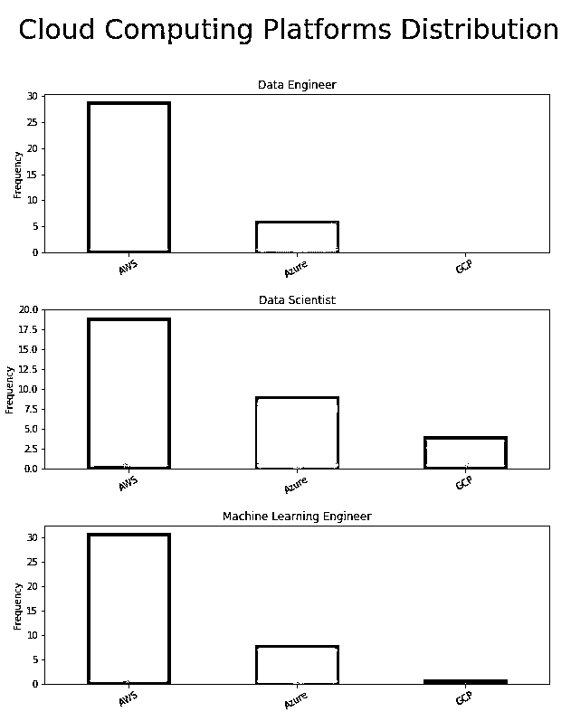
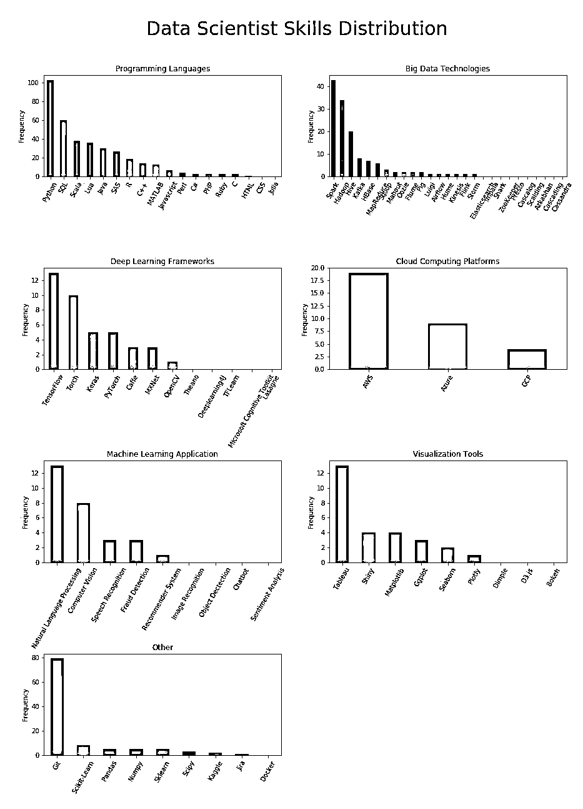

# 【干货】数据科学家的理想简历长啥样？手把手教你！

> 原文：[`mp.weixin.qq.com/s?__biz=MzAxNTc0Mjg0Mg==&mid=2653289704&idx=1&sn=49f4c2f00a5490ebf2ff2ca981052b35&chksm=802e3efdb759b7ebb4aee2b76bf601ad138f3bd41e23421d805bedd674d986fef7e483933b04&scene=27#wechat_redirect`](http://mp.weixin.qq.com/s?__biz=MzAxNTc0Mjg0Mg==&mid=2653289704&idx=1&sn=49f4c2f00a5490ebf2ff2ca981052b35&chksm=802e3efdb759b7ebb4aee2b76bf601ad138f3bd41e23421d805bedd674d986fef7e483933b04&scene=27#wechat_redirect)

本期作者：George Liu

本期翻译：1+1=6

***时 间 就 这 样 悄 无 声 息 的 溜 了***

**2018 年，就只剩下 23 天了**

**推荐阅读**

## 1、[机器学习、深度学习、量化金融、Python 最新书籍汇总](https://mp.weixin.qq.com/s?__biz=MzAxNTc0Mjg0Mg==&mid=2653289640&idx=1&sn=34e94fcbe99052b8e7381ecc48a36dc0&chksm=802e3ebdb759b7ab897cd329a680715b6f8294e63550ddf0c57b9e1320b2b7d1408c6fdca0c7&token=1883102744&lang=zh_CN&scene=21#wechat_redirect)

## [2、海量 Wind 数据，与全网用户零距离邂逅！](https://mp.weixin.qq.com/s?__biz=MzAxNTc0Mjg0Mg==&mid=2653289623&idx=1&sn=28a3600fd7a72d7be00b066ca0f98244&chksm=802e3e82b759b7943f43a4f6ef4a91e4153fa6b8210de9590235fa8ee66eb9811ce177054dbc&token=1883102744&lang=zh_CN&scene=21#wechat_redirect)

## [3、超级棒的机器学习资料下载](https://mp.weixin.qq.com/s?__biz=MzAxNTc0Mjg0Mg==&mid=2653289615&idx=1&sn=1cdc89afb997d0c580bf0cef296d946c&chksm=802e3e9ab759b78ce9f0cd152a680d4a413d6c8dcb02a7a296f4091993a7e4137e7520394575&token=1883102744&lang=zh_CN&scene=21#wechat_redirect)

**Python 和 R 之间不再争论**

**因为 Python 现在是主导者**

曾经有人争论过 Python 或 R 是否是数据科学的首选语言。显然，市场需求告诉我们**Python 现在是领导者**。同样值得注意的是，R 比 SAS 更少提及。因此，如果你正在考虑进入数据科学领域，请考虑将你的学习重点放在 Python 上。 SQL 作为数据库的语言是数据科学家第二重要的语言。由于数据科学家职业的广泛性，其他语言也扮演着重要角色。

> 总之，**数据科学家的主要语言是：****Python，SQL，Scala，Lua，Java，SAS，R，C ++和 Matlab**。

**机器学习工程师所需的语言更加多样化**

Python 作为机器学习工程师的顶级语言并不令人惊讶。由于需要从头开始实现算法并在大数据环境中部署 ML 模型，因此 C ++和 Scala 等相关语言也很重要。总的来说，与其他两个角色相比，语言的需求似乎更加分散。

> 总之，**机器学习工程师的主要语言是：****Python，Scala，Java，C ++，Lua，SQL，Javascript，Matlab，CSS 和 C＃**。

**如果你想成为一名数据工程师**

**SQL 是必须掌握的**

数据工程师一直处理数据库，SQL 是数据库语言，所以难怪 SQL 是很热的语言。 Python 很重要，但仍然失去了 Scala 和 Java，因为这些语言可以帮助数据工程师处理大数据。 

> 总之，**数据工程师的主要语言是：****SQL，Scala，Java，Python 和 Lua。**

**Scala 是数据科学中第二大语言（不是 R）**

当我们检查不同的角色时，有趣的是，Scala 可以是第二个或第三个。所以我们可以说数据科学中的前三种语言是**Python**，**SQL**和**Scala**。**如果你正在考虑学习一门新语言，请考虑使用 Scala！** 

**Spark 是除数据工程师之外首选大数据技能**

仅对于数据工程师而言，Hadoop 比 Spark 更多，但总的来说，Spark 绝对是首先应该学习的大数据框架。 Cassandra 对工程师而言比科学家更重要，而 Storm 似乎只与数据工程师有关。 

> 总之，**数据科学的顶级大数据技术是**：**Spark，Hadoop，Kafka，Hive**。

**TensorFlow 是深度学习的王者**

数据工程师职位发布中几乎没有提到深度学习框架，因此该角色似乎不需要 DL 框架。 **DL 框架的最多提及来自机器学习工程师角色**，**表明 ML 工程师确实很多地处理机器学习建模，而不仅仅是模型部署**。 此外，TensorFlow 在深度学习领域绝对占据主导地位。 尽管 Keras 作为高级深度学习框架在数据科学家中非常受欢迎，但它几乎与机器学习工程师角色无关，可能表明 ML 从业者大多使用较低级别的框架，如 TensorFlow。

> 总之，**数据科学中最重要的深度学习框架是**：**TensorFlow，Torch，Caffee**和**MXNet**。

**AWS 全面支配**

**计算机视觉是机器学习中大部分需求的来源**

对于一般的数据科学家来说，自然语言处理是最大的 ML 应用领域，其次是计算机视觉，语音识别，欺诈检测和推荐系统。 有趣的是，对于机器学习工程师来说，最大的需求来自计算机视觉，而自然语言处理则是远程第二。 另一方面，数据工程师再次成为专注的专家 - 这些 ML 应用领域中没有一个与他们相关。 

**洞察力** - 如果您想成为数据科学家，你可以选择构建各种类型的项目，以根据您想要进入的领域展示您的专业知识，但对于机器学习工程师来说，计算机视觉是最佳选择！

**可视化，Tableau 是必须的**

可视化工具主要是数据科学家所需要的，很少有人提到数据工程师和机器学习工程师。 但是，Tableau 是所有角色的首选。 对于**数据科学家来说**，**Shiny，Matplotlib，ggplot**和**Seaborn**似乎同样重要。 

**Git 对每个人都很重要**

**而 Docker 仅适用于工程师**

接下来，我们使用词云来探索每个角色最常用的关键词，并结合相应的技能为所有数据科学角色构建理想的配置文件！

**数据科学家更多是关于机器学习**

**而不是业务或分析**

Data Scientist 一直被视为需要统计，分析，机器学习和商业知识的全方位专业。 似乎仍然如此，或者至少，数据科学家仍然存在各种需求。 然而，现在看来，数据科学家们更多地关注机器学习而不是其他任何东西。 

其他主要要求包括：业务，管理，通信，研究，开发，分析，产品，技术，统计，算法，模型，客户/客户和计算机科学。

**机器学习工程师是关于研究**

**系统设计和建筑**

与一般的数据科学家相比，机器学习工程师肯定似乎有一个更集中的组合，包括研究，设计和工程。 显然，解决方案，产品，软件和系统是主导的主题。 伴随着这些，有研究，算法，AI，深度学习和计算机视觉。 有趣的是，商业，管理，客户和沟通等术语似乎也很重要。 这可以在该项目的进一步迭代中进一步研究。 另一方面，管道和平台也脱颖而出，证实了机器学习工程师在构建数据管道以部署 ML 系统方面的责任的共识。 

**数据工程师是真正的专家**

与机器学习工程师相比，数据工程师拥有更加专注的产品组合。 显然，重点是通过设计和开发管道来支持产品，系统和解决方案。 最高要求包括技术技能，数据库，构建，测试，环境和质量。 机器学习也很重要，可能是因为管道主要用于支持 ML 模型部署数据需求。

我希望这个项目可以帮助您了解雇主正在寻找什么，最重要的是帮助您做出有关如何定制简历和学习哪些技术的明智决策！

**推荐阅读**

[01、经过多年交易之后你应该学到的东西（深度分享）](https://mp.weixin.qq.com/s?__biz=MzAxNTc0Mjg0Mg==&mid=2653289074&idx=1&sn=e859d363eef9249236244466a1af41b6&chksm=802e3867b759b1717f77e07a51ee5671e8115130c66562577280ba1243cba08218add04f1f00&token=449379994&lang=zh_CN&scene=21#wechat_redirect)

[02、监督学习标签在股市中的应用（代码+书籍）](https://mp.weixin.qq.com/s?__biz=MzAxNTc0Mjg0Mg==&mid=2653289050&idx=1&sn=60043a5c95b877dd329a5fd150ddacc4&chksm=802e384fb759b1598e500087374772059aa21b31ae104b3dca04331cf4b63a233c5e04c1945a&token=449379994&lang=zh_CN&scene=21#wechat_redirect)

[03、全球投行顶尖机器学习团队全面分析](https://mp.weixin.qq.com/s?__biz=MzAxNTc0Mjg0Mg==&mid=2653289018&idx=1&sn=8c411f676c2c0d92b0dd218f041bee4b&chksm=802e382fb759b139ffebf633ac14cdd0f21938e4613fe632d5d9231dab3d2aca95a11628378a&token=449379994&lang=zh_CN&scene=21#wechat_redirect)

[04、使用 Tensorflow 预测股票市场变动](https://mp.weixin.qq.com/s?__biz=MzAxNTc0Mjg0Mg==&mid=2653289014&idx=1&sn=3762d405e332c599a21b48a7dc4df587&chksm=802e3823b759b135928d55044c2729aea9690f86752b680eb973d1a376dc53cfa18287d0060b&token=449379994&lang=zh_CN&scene=21#wechat_redirect)

[05、使用 LSTM 预测股票市场基于 Tensorflow](https://mp.weixin.qq.com/s?__biz=MzAxNTc0Mjg0Mg==&mid=2653289238&idx=1&sn=3144f5792f84455dd53c27a78e8a316c&chksm=802e3903b759b015da88acde4fcbc8547ab3e6acbb5a0897404bbefe1d8a414265d5d5766ee4&token=2020206794&lang=zh_CN&scene=21#wechat_redirect)

[06、美丽的回测——教你定量计算过拟合概率](https://mp.weixin.qq.com/s?__biz=MzAxNTc0Mjg0Mg==&mid=2653289314&idx=1&sn=87c5a12b23a875966db7be50d11f09cd&chksm=802e3977b759b061675d1988168c1fec06c602e8583fbcc9b76f87008e0c10b702acc85467a0&token=1972390229&lang=zh_CN&scene=21#wechat_redirect)

[07、利用动态深度学习预测金融时间序列基于 Python](https://mp.weixin.qq.com/s?__biz=MzAxNTc0Mjg0Mg==&mid=2653289347&idx=1&sn=bf5d7899bc4a854d4ba9046fdc6fe0d6&chksm=802e3996b759b080287213840987bb0a0c02e4e1d4d7aae23f10a225a92ef6dd922d8006123d&token=290397496&lang=zh_CN&scene=21#wechat_redirect)

[08、Facebook 开源神器 Prophet 预测时间序列基于 Python](https://mp.weixin.qq.com/s?__biz=MzAxNTc0Mjg0Mg==&mid=2653289394&idx=1&sn=24a836136d730aa268605628e683d629&chksm=802e39a7b759b0b1dcf7aaa560699130a907716b71fc9c45ff0e5d236c5ae8ef80ebdb09dbb6&token=290397496&lang=zh_CN&scene=21#wechat_redirect)

[09、Facebook 开源神器 Prophet 预测股市行情基于 Python](https://mp.weixin.qq.com/s?__biz=MzAxNTc0Mjg0Mg==&mid=2653289437&idx=1&sn=f0dca7da8e69e7ba736992cb3d034ce7&chksm=802e39c8b759b0de5bce401c580623d0729ecca69d13926479d36e19aff8c9c9e8a20265afff&token=290397496&lang=zh_CN&scene=21#wechat_redirect)

[10、2018 第三季度最受欢迎的券商金工研报前 50（附下载）](https://mp.weixin.qq.com/s?__biz=MzAxNTc0Mjg0Mg==&mid=2653289358&idx=1&sn=db6e8ab85b08f6e67790ec0e401e586e&chksm=802e399bb759b08d6eec855f9901ea856d0da68c7425cba62791b8948da6ad761a3d88543dad&token=290397496&lang=zh_CN&scene=21#wechat_redirect)

[11、实战交易策略的精髓（公众号深度呈现）](https://mp.weixin.qq.com/s?__biz=MzAxNTc0Mjg0Mg==&mid=2653289447&idx=1&sn=f2948715bf82569a6556d518e56c1f9e&chksm=802e39f2b759b0e4502d1aaac562b87789573b55c76b3c85897d8c9d88dbf9a0b7ee34d86a4e&token=290397496&lang=zh_CN&scene=21#wechat_redirect)

[12、Markowitz 有效边界和投资组合优化基于 Python](https://mp.weixin.qq.com/s?__biz=MzAxNTc0Mjg0Mg==&mid=2653289478&idx=1&sn=f8e01a641be021993d8ef2d84e94a299&chksm=802e3e13b759b7055cf27a280c672371008a5564c97c658eee89ce8481396a28d254836ff9af&token=290397496&lang=zh_CN&scene=21#wechat_redirect)

[13、使用 LSTM 模型预测股价基于 Keras](https://mp.weixin.qq.com/s?__biz=MzAxNTc0Mjg0Mg==&mid=2653289495&idx=1&sn=c4eeaa2e9f9c10995be9ea0c56d29ba7&chksm=802e3e02b759b7148227675c23c403fb9a543b733e3d27fa237b53840e030bf387a473d83e3c&token=1260956004&lang=zh_CN&scene=21#wechat_redirect)

[14、量化金融导论 1：资产收益的程式化介绍基于 Python](https://mp.weixin.qq.com/s?__biz=MzAxNTc0Mjg0Mg==&mid=2653289507&idx=1&sn=f0ca71aa07531bbbdbd33213f0bab89f&chksm=802e3e36b759b720138b3b17a4dd0e198e054b9de29a038fdd50805f824effa55831111ad026&token=1936245282&lang=zh_CN&scene=21#wechat_redirect)

[15、预测股市崩盘基于统计机器学习与神经网络（Python+文档）](https://mp.weixin.qq.com/s?__biz=MzAxNTc0Mjg0Mg==&mid=2653289533&idx=1&sn=4ef964834e84a9995111bb057b0fc5dd&chksm=802e3e28b759b73e0618eb1262c53aa0601fbf5805525a7c7ff40dc3db62c7704496611bdbf1&token=1950551577&lang=zh_CN&scene=21#wechat_redirect)

[16、实现最优投资组合有效前沿基于 Python（附代码）](https://mp.weixin.qq.com/s?__biz=MzAxNTc0Mjg0Mg==&mid=2653289609&idx=1&sn=c7f0b3e47025862d10bb53b6ab88bcda&chksm=802e3e9cb759b78abf6b8b049c59bf18ccfb2ead7580d1f557d36de2292f59dcbd94dcd41910&token=2085008037&lang=zh_CN&scene=21#wechat_redirect)

[17、精心为大家整理了一些超级棒的机器学习资料（附链接）](https://mp.weixin.qq.com/s?__biz=MzAxNTc0Mjg0Mg==&mid=2653289615&idx=1&sn=1cdc89afb997d0c580bf0cef296d946c&chksm=802e3e9ab759b78ce9f0cd152a680d4a413d6c8dcb02a7a296f4091993a7e4137e7520394575&token=2085008037&lang=zh_CN&scene=21#wechat_redirect)

**公众号官方 QQ 群**

**群里已经分享了****66 篇****干货**

**量化、技术人士实名制交流**

**没有按规则加群者一律忽略**

