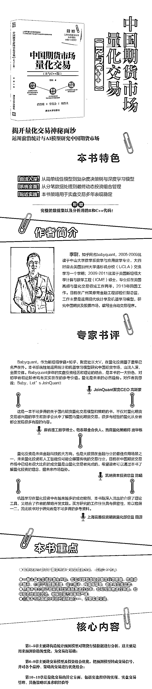

# 知乎大 V『babyquant』出书啦！公众号免费赠送~

> 原文：[`mp.weixin.qq.com/s?__biz=MzAxNTc0Mjg0Mg==&mid=2653289676&idx=1&sn=9fb01a155e39b1b89f71bbcd5e0798e2&chksm=802e3ed9b759b7cf27997adeccd859d43f55a25b4a9dabeeacfb7123ae9679ba306b8bdc1df1&scene=27#wechat_redirect`](http://mp.weixin.qq.com/s?__biz=MzAxNTc0Mjg0Mg==&mid=2653289676&idx=1&sn=9fb01a155e39b1b89f71bbcd5e0798e2&chksm=802e3ed9b759b7cf27997adeccd859d43f55a25b4a9dabeeacfb7123ae9679ba306b8bdc1df1&scene=27#wechat_redirect)

**赠书活动在文末查看**

**作者简介**

李尉，目前担任广州某量化私募投资基金高级投资经理，负责管理多个私募证券投资基金产品。日常工作主要是运用现代统计学及机器学习模型，研究期货及股票市场，编写全自动交易程序。在任职国丰源之前，李尉曾担任深圳前海泓倍资产管理有限公司 CTA 量化交易员（投资经理）、广州康腾投资管理有限公司高级策略师、广发期货有限公司高频交易小组组长兼量化研究员、美国 CMT Asia Inc 量化分析师等职位。李尉于 2011 年获得美国斯坦福大学计算与数学工程硕士学位，于 2009 年获得中山大学数学与应用数学学士学位。

**内容简介**

本书主要介绍如何运用统计分析和机器学习等方法对中国期货市场量化交易进行建模分析。不仅覆盖了基础的数据获取、数据清理、因子提取、模型构造以及后的动态投资组合优化、C++编程实现等方面，而且有丰富的代码方便读者临摹学习和修改提升。本书中的数据首先是交易所原始的期货分笔数据，在此基础上整合成 5 分钟 K 线，然后再计算预测因子，后套入统计预测模型。在交易层面，采用严谨的滚动优化方式，充分考虑了滑点和手续费，严格测试。另外本书还覆盖了中低频的趋势策略以及高频的短趋势策略，后也详细介绍了跨期套利策略，以及对读者择业就业的建议。

**本书内容的广度和深度都是国内市场上少见的，适合相关专业人士和感兴趣的投资爱好者阅读，如高校数理类和经管类师生及证券、期货、私募证券、公募基金等量化交易相关从业人员，以及对机器学习在金融方面运用的相关人士和对量化交易感兴趣的各行各业人士。**

**免费赠书规则**

**原价：88.00 元**

大家在本篇推文 **底部【写留言】** 处发表留言。

获得**点赞**数**前 10**的读者，即可免费获赠此书。

届时工作人员会联系十位读者，寄出此书。

**活动截止日 **

**2018.12.09 18:00**

**点击****阅读原文****，****查看关于此书更多详情！**