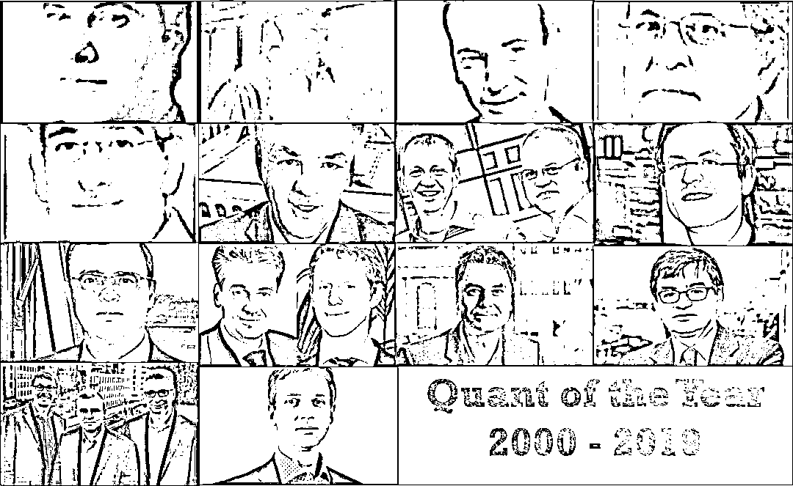
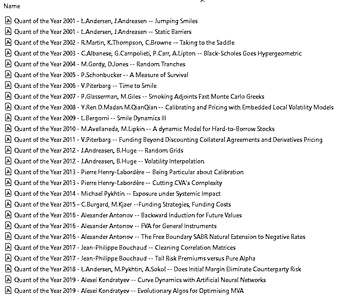
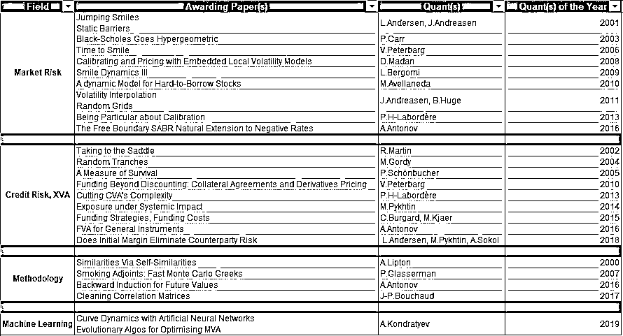

# 【重磅】年度宽客 （2000 - 2019）

> 原文：[`mp.weixin.qq.com/s?__biz=MzAxNTc0Mjg0Mg==&mid=2653289664&idx=1&sn=ec7e1db34342cd1ef8e4d4d468c35dd8&chksm=802e3ed5b759b7c33bd98ddd8efbd1a8e4a396ce4320cc0128cea164b4ed8a25f2c446b7ef8e&scene=27#wechat_redirect`](http://mp.weixin.qq.com/s?__biz=MzAxNTc0Mjg0Mg==&mid=2653289664&idx=1&sn=ec7e1db34342cd1ef8e4d4d468c35dd8&chksm=802e3ed5b759b7c33bd98ddd8efbd1a8e4a396ce4320cc0128cea164b4ed8a25f2c446b7ef8e&scene=27#wechat_redirect)

**作者：王圣元**

***时 间 就 这 样 悄 无 声 息 的 溜 了***

**2018 年，就只剩下 26 天了**

**推荐阅读**

## 1、[机器学习、深度学习、量化金融、Python 最新书籍汇总](https://mp.weixin.qq.com/s?__biz=MzAxNTc0Mjg0Mg==&mid=2653289640&idx=1&sn=34e94fcbe99052b8e7381ecc48a36dc0&chksm=802e3ebdb759b7ab897cd329a680715b6f8294e63550ddf0c57b9e1320b2b7d1408c6fdca0c7&token=1883102744&lang=zh_CN&scene=21#wechat_redirect)

## [2、海量 Wind 数据，与全网用户零距离邂逅！](https://mp.weixin.qq.com/s?__biz=MzAxNTc0Mjg0Mg==&mid=2653289623&idx=1&sn=28a3600fd7a72d7be00b066ca0f98244&chksm=802e3e82b759b7943f43a4f6ef4a91e4153fa6b8210de9590235fa8ee66eb9811ce177054dbc&token=1883102744&lang=zh_CN&scene=21#wechat_redirect)

## [3、超级棒的机器学习资料下载](https://mp.weixin.qq.com/s?__biz=MzAxNTc0Mjg0Mg==&mid=2653289615&idx=1&sn=1cdc89afb997d0c580bf0cef296d946c&chksm=802e3e9ab759b78ce9f0cd152a680d4a413d6c8dcb02a7a296f4091993a7e4137e7520394575&token=1883102744&lang=zh_CN&scene=21#wechat_redirect)

**本文献给刚刚出生的儿子**

前几天看到了 Quant of the Year 2019 颁布的新闻，回想从 2015 年开始自学机器学习时就没关注这个了，因为这个奖项通常都是 Q-quant （即在风险中性测度下玩转的 quant） 所拿，而我开始对机器学习感兴趣，已经向 P-quant 靠拢了。关于 P-quant 和 Q-quant 的区别可参照我之前写的[**这个帖子**](http://mp.weixin.qq.com/s?__biz=MzIzMjY0MjE1MA==&mid=2247485368&idx=1&sn=5872cd579616dadd93a33b29f15298f1&chksm=e89084b1dfe70da733bf4370687fc3f91f6b36ec6b0562a43978e7a873f91dde2834bec47282&scene=21#wechat_redirect)。但今天这个奖项是颁给一个渣打银行 （SCB）的数据分析执行董事，他用 P-quant 的机器学习方法来解决银行实际的问题。心血来潮把从 2000 年到 2019 年的这 20 年的新闻读了，论文也从 Risk 网站上下载了。（Risk 网站下载这些论文需注册会员，因此有些论文上有水印不让传播，为了尊重知识产权，只在公众号后台分享那些没打水印的论文，望理解）

**文末下载**

**论文在文末下载**

下面就简要回顾下这 20 年年度最佳宽客做了什么吧。

**2019 年**

**Alexei Kondratyev**

**论文 1**：*Curve Dynamics with Artificial Neural Networks*

**论文 2**：***Evolutionary Algos for Optimising MVA***

*Quants these days tend to maintain expertise in specific fields. With Alexei, his expertise in multiple, unrelated fields gives him a broader perspective and makes him a great researcher. --* Alexander Sokol

新闻链接：

***https://www.risk.net/awards/6159246/quant-of-the-year-alexei-kondratyev*** 

亮点：用机器学习的法来解决卖方 (sell side) 的问题。

机器学习其实在金融上的应用主要都在买方 (buy side), 比如私募或者基金，而 Alexei 的主要贡献是在卖方如银行中找到了两个应用：

1.  用人工神经网络 + 正则化，和自动编码器来捕捉利率曲线和商品远期曲线里的动态关系。【论文 1】

2.  用遗传算法 (Genetic Algorithm, GA) 和粒子群优化 (Particle Swarm Optimization, PSO) 来为银行压缩交易而减少保证金 (margin)。两个都是进化算法，GA 主要在离散型变量空间 (比如货币 currency, 交易对手 counterparty) 找最优解，而 PSO 主要在连续性变量空间 (比如年限 tenor, 本金 notional) 找最优解。【论文 2】

**论文还要好好读，至少现在我觉得第一篇的 input 的选择就有些不合理，可能犯了数据窥探 （data snooping）的错误。Alexei 目前还在研究量子计算 （Quantum Computing），和 NASA 合作把量子计算应用在一个含 60 个资产的组合优化上，节省了一半的计算时间。（是不是有点小题大做了？）**

* * *

**2018 年**

**Leif Andersen**

**Michael Pykhtin**

**Alexander Sokol**

**论文**：*Does Initial Margin Eliminate Counterparty Risk*

*They looked at the entire complexities of the margining process and modelled it mathematically. They looked at things from first principles and the result was amazing.* -- Alexei Kondratyev

新闻链接：

***https://www.risk.net/awards/5371021/quants-of-the-year-leif-andersen-michael-pykhtin-and-alexander-sokol*** 

**亮点：深挖交易对手违约后的细节，将保证金风险期 (Margin Period of Risk, MPOR) 分解成四个时段来分析并量化了之前从来没有人去想要量化的结算风险 (settlement risk)。**

* * *

**2017 年**

**Jean-Philippe Bouchaud**

**论文**：*Cleaning Correlation Matrices*

*It is really more of a physics approach, to let the data speak. A lot of models used in mathematical finance seem to be more driven by their convenience and the possibility to answer a question with a number, rather than taking the time and thinking about the problem.* -- Bouchaud

新闻链接：

***https://www.risk.net/risk-magazine/analysis/2479713/quant-of-the-year-jean-philippe-bouchaud***

**亮点：**用实证研究 (emprical reseach) 和数据，而不是用理论的公式来处理相关系数矩阵。****

* * *

**2016 年**

**Alexander Antonov**

**论文 1**：*The Free Boundary SABR Natural Extension to Negative Rates*

**论文 2**：*FVA for General Instruments*

**论文 3**：*Backward Induction for Future Values*

*In all his papers there is a clear practical problem, amazing mathematics and practical implementation. I think the combination of those three elements is really quant work at its best*. -- Paul Glasserman

新闻链接：

***https://www.risk.net/awards/2442477/quant-of-the-year-alexandre-antonov***

**亮点：在**负利率环境下的**提出自由边界 (free boundary) SABR 模型，欧式期权仍有解析解或者近似解析解，校正快，计算敏感度也没有之前 shifted SABR 模型产生的跳跃的现象。**

* * *

****2015 年****

****Christoph Burgard****

****Mats Kjaer****

****论文**：*Funding Strategies, Funding Costs***

***The way they have approached the problem is revolutionary. They have gone back to basics and modified the Black-Scholes PDE. And because it is intuitive, it is very revealing in that you can see the cashflows in a very transparent way*. -- Andrew Green** 

**新闻链接：**

*****https://www.risk.net/derivatives/2387793/quants-year-christoph-burgard-and-mats-kjaer*****

****亮点：为业界各说各话的融资估值调整 (Funding Valuation Adjustment, FCA) 提出一个健全的理论框架。****

* * *

****2014 年****

****Michael Pykhtin****

****论文****：***Exposure under Systemic Impact***

***Systemic risk is at the forefront of everyone’s mind but is notoriously difficult to quantify. Pykhtin’s clear and pragmatic approach goes a long way towards setting a rigorous framework to measure and control it.* -- Vladimir Piterbarg** 

**新闻链接：**

*****https://www.risk.net/awards/2320285/quant-year-michael-pykhtin*****

****亮点：专门针对于系统重要性交易对手 (Systemically Important Counterparty, SIC) 提出系统内错向风险 (Systemic Wrong-Way Risk, SWWR) 来量化它们违约造成的后果。****

**I see this as an important part of my role – communicating these technical details, This dialogue between industry and regulator is an increasingly valuable function as rules and guidelines get more technical. It’s familiar to Pykhtin – from both sides.**

* * *

****2013 年****

****Pierre Henry-Labordère****

****论文 1**：*Being Particular about Calibration***

****论文 2**：*Cutting CVA's Complexity***

***It’s not complicated, actually. Using Malliavin is no harder than using the Itô lemma or the Girsanov theorem.* -- Pierre Henry-Labordère** 

**新闻链接：**

*****https://www.risk.net/awards/2232028/quant-of-the-year-pierre-henry-labordere-societe-generale*****

****亮点：用法国人逆天的数学来在金融界炫耀，当然大量的减少了两大难题的计算量，分别是“**局部随机波动率 (Local Stochastic Volatility, LSV) 模型校正**”和“**组合层面的信用估值调整 (Credit Valuation Adjustment, CVA) 计算**”****。****

* * *

******2012 年******

******Jesper Andreasen******

******Brian Huge******

********论文 1****：*Volatility Interpolation*****

 ********论文 2**** 

：*Random Grids*

*There are no fundamental laws handed down from God on clay tablets. I think there is still a tendency to see the world through models, forgetting they are only as good as their implementation.* -- Jesper andreasen**** 

****新闻链接：****

*******https://www.risk.net/awards/2133160/quants-year-jesper-andreasen-and-brian-huge-danske-bank*******

******亮点：1\. 找到一种无套利的波动率插值方法；2\. 提出一个模型校正、偏微分方程有限差分和蒙特卡洛模拟的一致离散化的想法。******

* * *

********2011 年********

********Vladimir Piterbarg********

********论文**：*Funding Beyond Discounting Collateral Agreements and Derivatives Pricing*******

*******What Piterbarg is doing is rewriting Black-Scholes post-financial crisis. After the crisis, you can’t ignore the cost of funding in any asset class or you lose money.* -- Alex Langnau****** 

******新闻链接：******

*********https://www.risk.net/awards/1934297/quant-year-vladimir-piterbarg-barclays-capital*********

********亮点：对衍生品定价时引入融资成本 (cost of funding)，而且这些调整可以完美的添加到整套 Black-Scholes 框架中。********

* * *

********2010 年********

********Marco Avellaneda********

********论文**：*A dynamic Model for Hard-to-Borrow Stocks*******

*******Short selling is a common scapegoat during financial crises.  In 2008, the ban on short selling was also used as a form of protectionism for propping up the stock of financial firms.* -- Marco Avellaneda****** 

******新闻链接：******

*********https://www.risk.net/awards/1567801/quant-of-the-year-marco-avellaneda*********

********亮点：对于难以去借 (hard-to-borrow) 来做空的股票，买卖权平价关系 (put-call parity) 不在适用。********

* * *

********2009 年 ********

********Lozenro Bergomi********

********论文**：*Smile Dynamics III*******

*******His idea of directly modelling the joint dynamics of the spot and variance swap volatility is theoretically sound and practically easy to implement. His quant of the year award is well deserved.* -- Alexander Lipton****** 

******新闻链接：******

*********https://www.risk.net/awards/1496978/quant-year-lorenzo-bergomi*********

********亮点：提出可以控制远期方差微笑 (smile of forward variance) 而且可以校正于波动率指数 (volatility index, VIX) 期货和期权的模型。********

* * *

******2008 年******

******Dilip Madan******

******论文**：*Calibrating and Pricing with Embedded Local Volatility Models*****

*****The most important moment of my career was my meeting with professor Dilip Madan. He is one of the few academics that are aware that the future does not behave like the past.* -- Peter Carr**** 

****新闻链接：****

*******https://www.risk.net/awards/1498261/quant-year-dilip-madan*******

******亮点：提出一个内嵌型的局部波动率模型 (embedded local volatility model) 来对波动率指数期权、股票和利率混合产品进行定价。******

* * *

******2007 年******

******Paul Glasserman******

******Michael Giles******

******论****文**：*Smoking Adjoints Fast Monte Carlo Greeks*****

*****The adjoint method accelerates the calculation of Greeks via Monte Carlo simulation by, in essence, rearranging the order of calculations, as compared to the standard method.* -- Paul Glasserman**** 

****新闻链接：****

*******https://www.risk.net/awards/1498251/quants-year-paul-glasserman-and-michael-giles*******

******亮点：用反向方法 (adjoint method) 来计算复杂衍生物的敏感度，比传统的有限差分 (finite)、路径微分和似然比在计算敏感度的精度不减速度却爆升。******

* * *

******2006 年******

******Vladimir Piterbarg******

******论文**：*Time to Smile*****

*****The global skew is some sort of average of local skew.* -- Vladimir Piterbarg**** 

****新闻链接：****

*******https://www.risk.net/awards/1497820/quant-year-vladimir-piterbarg*******

******亮点：提出参数平均 (parameter averaging) 的想法，将和时间有关的参数比如偏斜 (skew)、波动率转换成和时间无关的有效 (effective) 参数，加快了复杂模型的校正速度确没有降低校正质量。******

* * *

********2005 年********

********Philipp Schönbucher********

********论文**：*A Measure of Survival*******

*******Schönbucher is one of the most innovative researchers in credit and many of today’s practitioners have benefited from his insights. His work on CDS option pricing is typically focused and thorough, and will form the backbone of future work on the subject.* -- Richard Martin****** 

******新闻链接：******

*********https://www.risk.net/awards/1497632/quant-year-philipp-schonbucher*********

********亮点：用可违约资产 (defaultable asset) 当计价物 (numeraire)，在各种波动率设定下推导出类似 Black-Scholes 公式来对信用违约互换期权 (CDS option) 进行定价。********

* * *

********2004 年********

********Michael Gordy********

********论文**：*Random Tranches*******

*******Gordy’s work in portfolio credit risk is both distinguished and topical, with many of his papers being among the cornerstones of modern credit risk management practices. His work at the Federal Reserve has been highly influential with academics and practitioners alike.* -- Leif Andersen****** 

******新闻链接：******

*********https://www.risk.net/awards/1498479/quant-year-michael-gordy-us-fed*********

********亮点：在符合巴塞尔大框架下，提出了一个简单公式，能计算证券化分层所需的监管资本，解决了巴塞尔对此类产品提出过于复杂要求的监管痛点。********

* * *

********2003 年 ********

********Peter Carr********

********论文**：*Black-Scholes Goes Hypergeometric*******

*******Peter has contributed more fundamental ideas to the area of mathematical finance in the past couple of years than anyone I am aware of. Peter lives, eats and breathes mathematical finance.* -- Keith Lewis****** 

******新闻链接：******

*********https://www.risk.net/derivatives/1506232/quant-of-the-year-peter-carr*********

********亮点：用不同的波动率设定来推广 Black-Scholes 公式，并推导欧式期权和障碍期权的解析解。********

* * *

********2002 年 ********

********Richard Martin********

********论文**：Taking to the Saddle******

******In credit risk modelling, he’s the most switched on person I know. -- Tom Wilde****** 

******新闻链接：******

*********https://www.risk.net/awards/1506446/2002-winner-quant-year-richard-martin*********

********亮点：用鞍点法 (saddle-point method) 代替了蒙特卡洛模拟来对损失事件建模和计算组合损失分布。********

* * *

********2001 年********

**********Leif Andersen**********

********Jesper Andreasen******** 

********论文 1**：*Jumping Smiles*******

********论文 2**：*Static Barriers*******

******无新闻链接******

******亮点：1\. 提出跳跃扩散 (Jump-Diffusion) 模型改进局部波动率模型，因为后者生成的微笑曲线随着时间越来越平，不符合实证观察。2\. 引进跳跃扩散模型来静态对冲障碍期权。******

* * *

********2000 年********

********Alexander Lipton********

********论文**：*Similarities Via Self-Similarities *******

******无新闻链接******

******到处都下载不到他的论文，甚至都很难搜索出来。听说是关于介绍复杂衍生物的定价方法论，但是细节不清楚因此不评价。******

********总结********

******这 20 年的年度宽客和他们得奖论文主要分成**市场风险 （Market Risk）**，**信用风险**及估**值调整 （Credit Risk, XVA）**，**方法论**和**机器学习**这四大类，如下图所示：******

************

******从上表来看，研究市场风险的趋势在下降；研究估值调整，融资成本 (funding cost) 和保证金 (initial margin) 越来越多；研究机器学习的从今年刚开始有第一篇，按着大趋势以后会越来越多。******

********亮点一评**：2007 年的最佳论文 *Smoking Adjoints: Fast Monte Carlo Greeks* 真实好东西，这个 Adjoint 方法其实和机器学习里面的反向传播非常类似，这种反向求导数的方法统称 Adjoint Automatic Differentation, AAD，在金融和机器学习中有太多应用，比如百慕大期权蒙特卡洛求敏感度，比如组合层面的 XVA，比如深度神经网络的反向传播，只要求少量输出对大量输入的导数，AAD 在效率和速度上会让你重新认识这个世界。******

********感叹一声**：传统的衍生品的定价方法不存在了，现在定个价单单看产品的风险因子完全不够，交易对手、融资成本和保证金都会影响衍生品的价格。******

********世界越来越复杂，但能用简单优雅的模型来描述他的宽客才配的起 Quant of the Year 这个称号!********

********论文下载********

******在**后台**输入******

********20181204********

********不希望某些人拿着我们的资源去收费********

********后台获取方式介绍********

************

********公众号官方 QQ 群********

********群里已经分享了****66 篇****干货********

********量化、技术人士实名制交流********

********没有按规则加群者一律忽略********

************