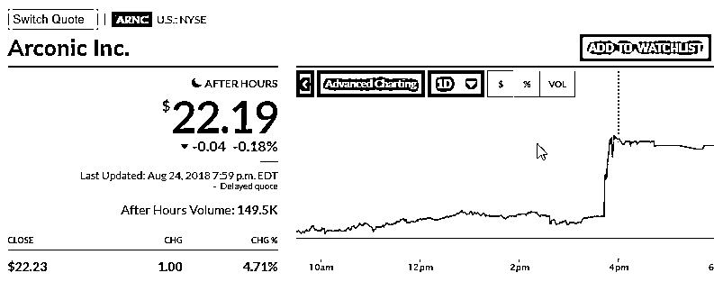
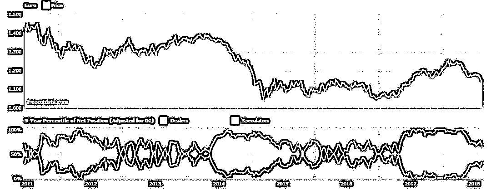
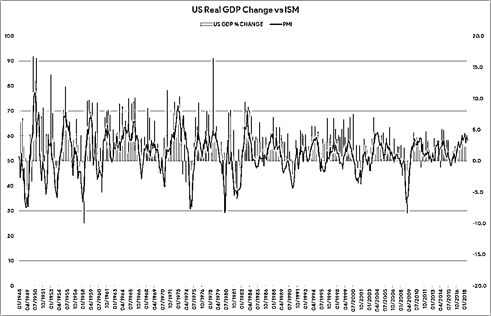
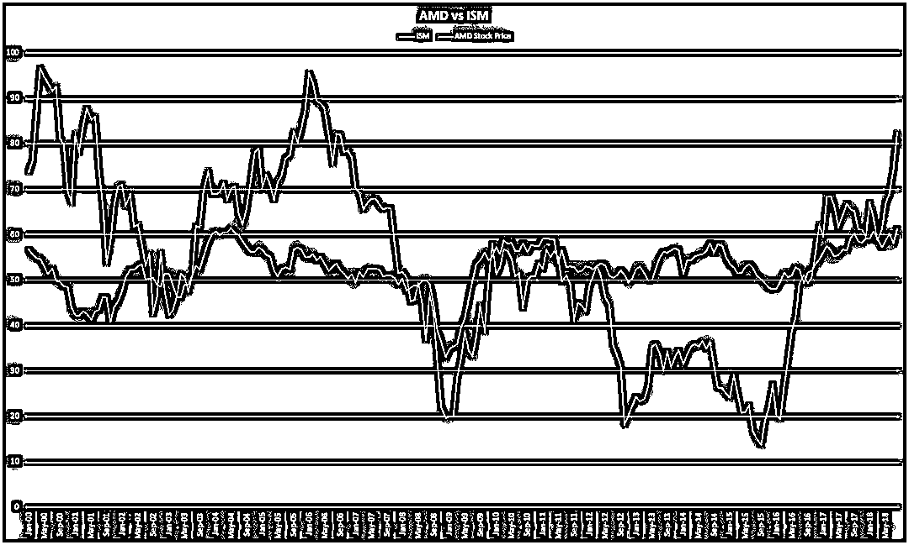
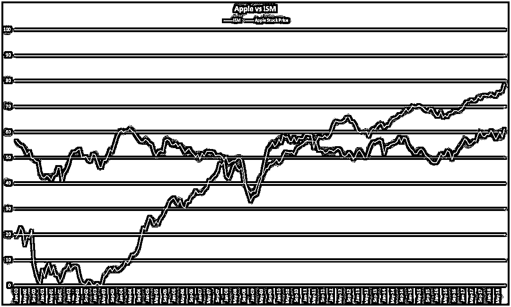
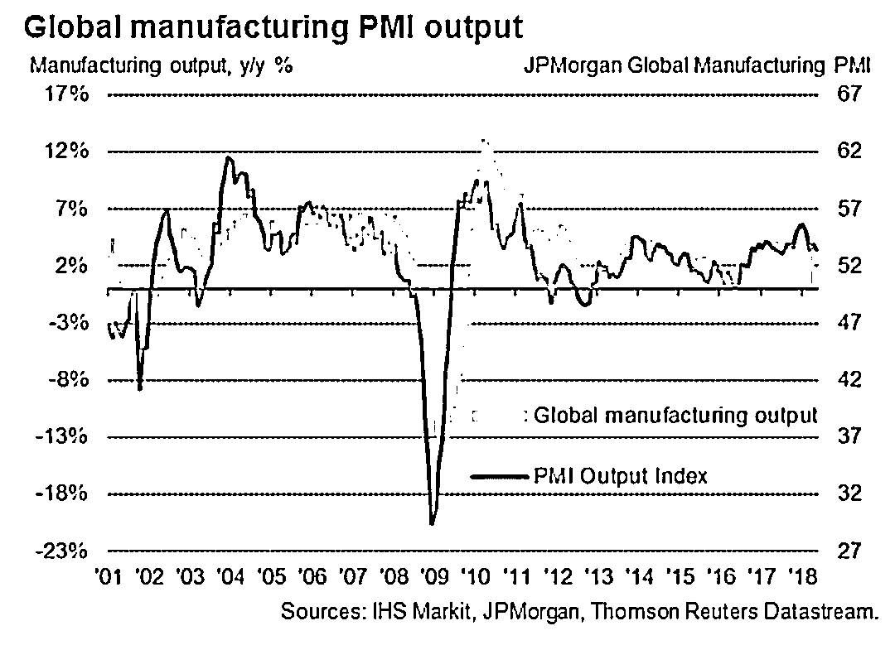
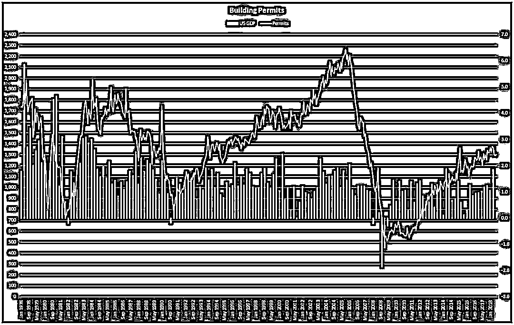
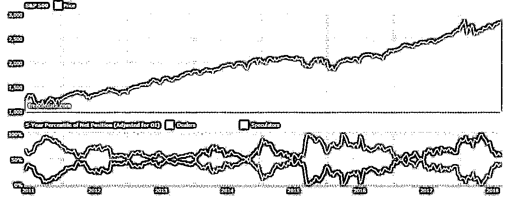
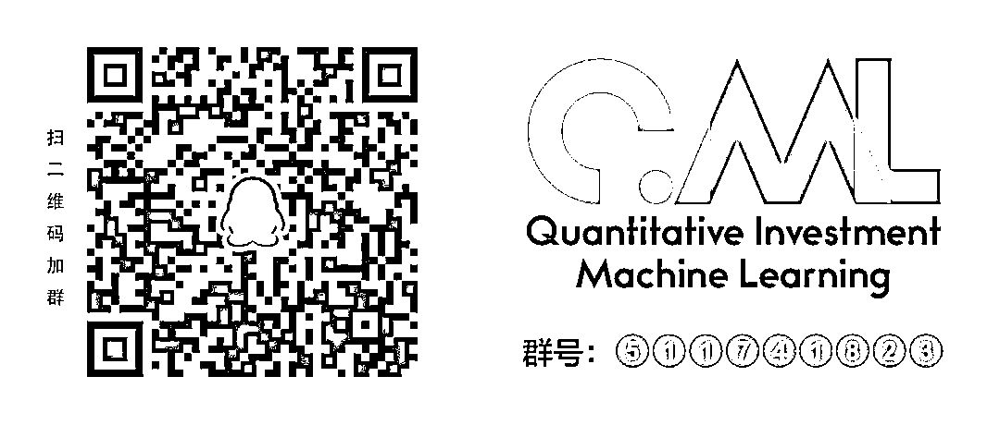

# Medium 9.3K 赞的文章——预测股市比你想象的要容易

> 原文：[`mp.weixin.qq.com/s?__biz=MzAxNTc0Mjg0Mg==&mid=2653289660&idx=1&sn=d4f15e16012b418b55184f7660f8d3c2&chksm=802e3ea9b759b7bf0f0d3c3cd4c4ba1df0d475b1fb5938aa53c1d4bd2d1c73c9ed8ea172172e&scene=27#wechat_redirect`](http://mp.weixin.qq.com/s?__biz=MzAxNTc0Mjg0Mg==&mid=2653289660&idx=1&sn=d4f15e16012b418b55184f7660f8d3c2&chksm=802e3ea9b759b7bf0f0d3c3cd4c4ba1df0d475b1fb5938aa53c1d4bd2d1c73c9ed8ea172172e&scene=27#wechat_redirect)

我们翻译了一版，最后还是觉得原版比较原汁原味，so~

Even if you don’t trade stocks for a living, or have any financial background whatsoever, being able to predict the future economy can be a huge benefit to your financial situation. Real estate can be sold at its highs, money can be drawn from mutual funds that are expected to rise indefinitely, and when things start to go bad, moving capital into tangible assets such as gold is a boon.

This article aims to give market outsiders a no-nonsense four-step guide to successfully predicting the health of the economy consistently over time.

**Step 1: Break the financial matrix**

If you think trading is hard, you’re right. It turns out that up to 80–90 percent of non-institutional traders (those who don’t work at financial institutions) lose money when trading. This high percentage has prompted regulators to force brokers to publish data about their clients’ losses on their own platforms. That’s why you’ll find the following language on the websites of countless investment companies: “Spread bets and CFDs are complex instruments and come with a high risk of losing money rapidly due to leverage. 79% of retail investor accounts lose money when trading spread bets and CFDs with this provider.” 

These warnings don’t really solve the problem, and have been about as effective as GDPR cookie compliance (i.e. they have virtually no effect whatsoever). If anything, the broker is just fueling the potential client’s desire to beat the odds: “Are you one of the 21 percent?”

It is also becoming increasingly difficult for traders to beat the market due to the rise of “algo trading” (the use of computer algorithms), a strategy that virtually eliminates any chance for mere mortals to make money trading on a short-term basis. If you have ever tried trading a company’s earnings the market will have moved before you had a chance to react (as the below graph demonstrates).

Day trading is now the least profitable way to trade, as only advanced supercomputers can now benefit from world news and company earnings. A trading floor no longer has 200+ sweaty middle-aged men throwing their hands up in the air like Hollywood wants you to believe; they have been replaced by machines implementing financial artificial intelligence, commonly known as FinTech.

So why do people still think day trading will make them rich? This can be explained by the fact that day trading is widely advertised as an effective strategy by the mainstream brokerage industry and financial media. Once it is shoved down retail traders’ throats, they cave in to the constant propaganda and lose money quickly by sticking to unprofitable strategies whilst utilizing the “education” offered by the brokers, which is code for “learn how to give me all your money in the fastest way possible.”

The entire industry is based on suckering desperate individuals into a false narrative. They say it is easy to make money—all you have to do is trade on charts with no fundamentals and you’ll be sitting on a beach sipping a piña colada in no time. But let’s ask the obvious question here: If trading were that easy, why isn’t everybody doing it?

The truth is it’s almost impossible to make money if you are a retail trader; the small percentage of people who do succeed have had sufficient training and education. Realising you are stepping into a financial matrix where everything being thrown at you forces you to lose money instead of gain, is the first step required to making informed decisions.

**Step 2: Learn how the “smart money” consistently**

** predict the market**

It’s important to understand that two herds exist in the financial markets: the dumb money and the smart money. “Dumb money” refers to nonprofessional investors, “smart money” to institutional investors who work at investment banks and hedge funds. These professional individuals use the same processes to create trade ideas and views on currencies, commodities, stocks, and bonds. Their strategies only differ from each other in terms of the assets they decide to trade. 

Since the smart money are analysing the same data and following the same indicators, a smart money herd mentality is created. The internet allows outsiders to get a glimpse of that mentality—to predict what the smart money are doing and what position they may take on a certain asset.

The CFTC (Commodity Futures Trading Commission), for instance, records smart money transactions in the financial markets using their weekly Commitments of Traders report. Below is a graph of eurodollar futures traded on the CFTC exchange. The white line on the graph below shows us that institutions are positioned net long the euro (that is, most people are buying) and net short the U.S. dollar (most people are selling). However, the number is decreasing, showing that money has been flowing from the euro into the dollar over the past year.

Now that we have identified that institutional investors have a herd mentality, we need to know how they come to the conclusion that the U.S. dollar is favored over the euro. The problem outsiders have when learning how markets really work is gaining the correct information about what drives the economy in the first place. The markets are forward-looking: the price you see is a reflection of what the market thinks the price will be six to 12 months in the future rather than in the present day. When it comes to the stock market, gross domestic product (GDP) is the benchmark for global growth and contraction. Therefore, being able to predict movements in GDP is the key to predicting stock market moves.

How do you predict GDP, you ask? The answer is leading economic indicators. You may have heard that term before, but you might not have been introduced to the most powerful indicators that are used by smart money who consistently predict market moves before the dumb money herd. If we can identify the leading indicators of GDP, then we can accurately predict future moves in GDP and therefore the stock market.

**Step 3: Use indicators to create a worldview**

We will now use the strongest and most accurate leading indicators to create a view on the economy and thereby predict future stock market movements. Two of the three indexes discussed below pertain specifically to the United States, but bear in mind that the U.S. economy drives the global economy and many stock markets mirror these indexes. (This actually hasn’t been the case recently if you look at Europe and China, but that’s something for you to do some further reading on.)

#### **The most powerful predictor: ISM**

The ISM Manufacturing Report On Business® publishes a monthly index score which is calculated by interviewing more than 300 purchasing managers from around the U.S. A score above 50 indicates that there is a positive growth in the economy and vice versa. However, this is not how a professional uses the ISM to predict GDP. It is all about the current trend and whether there is an upwards or downwards momentum in the readings. Remember that the difference between this indicator and a stock chart is that the score is based on real-life purchasing managers reporting current market conditions: it isn’t just a line on a chart!

Using the last 70 years’ worth of data we can create a key that allows us to predict GDP based on the ISM’s trend line:

ISM above 50 and increasing: positive outlook
ISM peaks above 50: neutral/negative outlook
ISM above 50 and decreasing: negative outlook
ISM below 50 and decreasing: negative outlook
ISM troughs below 50: neutral/positive outlook
ISM below 50 and increasing: positive outlook

With a six to 12 month time lag on GDP the correlation is staggering. And the fact that the lag exists is what allows professionals to accurately predict the stock market consistently over time. The financial media are aware of the ISM but barely dedicate any time in covering the true power of this leading indicator. It doesn’t matter what stock you are trading: the ISM will have some influence over that stock price.

The ISM’s amazing accuracy can partly be explained by the professional trader herd theory: institutions such as investment banks and hedge funds implement the same overall strategy but employ their own unique variations. You can almost guarantee that the ISM is an important part of a professional’s process when generating ideas and forming a global view on the world economy.

Here are examples of the ISM mirroring the stock price and therefore predicting the financial health and performance of well-known companies.

#### **JPMorgan global manufacturing PMI**

JPMorgan publishes a global PMI (purchasing managers’ index): it’s not limited to the U.S. markets like the ISM reports. We won’t really go into this indicator further, but the theory is exactly the same as the ISM.

#### **Building permits**

The second-most powerful and widely misunderstood indicator is the U.S. building permits index. Why would that be? It turns out that building permits aren’t just a planning application: they involve a payment made to the government. They aren’t free! If builders aren’t willing to pay for the application in the first place, this indicates that there is a decrease in demand for housing and that businesses are holding back on spending.

Plus, to build a house you need a large amount of capital. The vast majority of homebuilders use debt to finance the building of a house in the form of a mortgage. If banks and other lenders aren’t willing to lend, then the total number of permits will decrease—hence they act as a barometer of financial health. The wellbeing of the housing sector relies on the availability of credit in the system. The ability or inability of banks to issue a consistent supply of loans gives us a great insight into the health of the overall economy.

**Step 4: Use your newfound knowledge to predict the economy**

We are now in August of 2018\. The Chinese and European markets are contracting, and the financial media are saying the stock market in the U.S. has reached new all-time highs. But does that mean we should enter the market and buy stocks? Let’s check the status of our indicators.

ISM above 50 and decreasing: negative outlook
JPMorgan global manufacturing outlook decreasing: negative outlook
Building permits decreasing: negative outlook

Using the data we have obtained we can come to the conclusion that the U.S. economy is still growing but at a much slower rate than in previous months. As a result, smart money will eventually react as institutions will use this hypothesis to anticipate a global economic slowdown and short the U.S. market. (Hint: it’s already happening, check below!)

We are already seeing this in China and Europe as their stock markets start to tank and move towards negative GDP growth. But will the U.S. follow suit? It’s looking that way. In a year or two we could be on the verge of a recessionary period in the economy. However, it’s always good to wait for a few readings before changing your bias: future readings may reverse and hey, presto, an even longer bull market in the U.S.!

**Last Word**

I hope you can see now that having a view on the global economy is easy once you know what drives markets and can anticipate what is to come in the future. Once you realize how the system works and can operate within it, it starts to make complete sense. I encourage you to do some further reading on the material covered in this article, and to explore further how this information can be useful in your future financial decision-making.

**推荐阅读**

[01、经过多年交易之后你应该学到的东西（深度分享）](https://mp.weixin.qq.com/s?__biz=MzAxNTc0Mjg0Mg==&mid=2653289074&idx=1&sn=e859d363eef9249236244466a1af41b6&chksm=802e3867b759b1717f77e07a51ee5671e8115130c66562577280ba1243cba08218add04f1f00&token=449379994&lang=zh_CN&scene=21#wechat_redirect)

[02、监督学习标签在股市中的应用（代码+书籍）](https://mp.weixin.qq.com/s?__biz=MzAxNTc0Mjg0Mg==&mid=2653289050&idx=1&sn=60043a5c95b877dd329a5fd150ddacc4&chksm=802e384fb759b1598e500087374772059aa21b31ae104b3dca04331cf4b63a233c5e04c1945a&token=449379994&lang=zh_CN&scene=21#wechat_redirect)

[03、全球投行顶尖机器学习团队全面分析](https://mp.weixin.qq.com/s?__biz=MzAxNTc0Mjg0Mg==&mid=2653289018&idx=1&sn=8c411f676c2c0d92b0dd218f041bee4b&chksm=802e382fb759b139ffebf633ac14cdd0f21938e4613fe632d5d9231dab3d2aca95a11628378a&token=449379994&lang=zh_CN&scene=21#wechat_redirect)

[04、使用 Tensorflow 预测股票市场变动](https://mp.weixin.qq.com/s?__biz=MzAxNTc0Mjg0Mg==&mid=2653289014&idx=1&sn=3762d405e332c599a21b48a7dc4df587&chksm=802e3823b759b135928d55044c2729aea9690f86752b680eb973d1a376dc53cfa18287d0060b&token=449379994&lang=zh_CN&scene=21#wechat_redirect)

[05、使用 LSTM 预测股票市场基于 Tensorflow](https://mp.weixin.qq.com/s?__biz=MzAxNTc0Mjg0Mg==&mid=2653289238&idx=1&sn=3144f5792f84455dd53c27a78e8a316c&chksm=802e3903b759b015da88acde4fcbc8547ab3e6acbb5a0897404bbefe1d8a414265d5d5766ee4&token=2020206794&lang=zh_CN&scene=21#wechat_redirect)

[06、美丽的回测——教你定量计算过拟合概率](https://mp.weixin.qq.com/s?__biz=MzAxNTc0Mjg0Mg==&mid=2653289314&idx=1&sn=87c5a12b23a875966db7be50d11f09cd&chksm=802e3977b759b061675d1988168c1fec06c602e8583fbcc9b76f87008e0c10b702acc85467a0&token=1972390229&lang=zh_CN&scene=21#wechat_redirect)

[07、利用动态深度学习预测金融时间序列基于 Python](https://mp.weixin.qq.com/s?__biz=MzAxNTc0Mjg0Mg==&mid=2653289347&idx=1&sn=bf5d7899bc4a854d4ba9046fdc6fe0d6&chksm=802e3996b759b080287213840987bb0a0c02e4e1d4d7aae23f10a225a92ef6dd922d8006123d&token=290397496&lang=zh_CN&scene=21#wechat_redirect)

[08、Facebook 开源神器 Prophet 预测时间序列基于 Python](https://mp.weixin.qq.com/s?__biz=MzAxNTc0Mjg0Mg==&mid=2653289394&idx=1&sn=24a836136d730aa268605628e683d629&chksm=802e39a7b759b0b1dcf7aaa560699130a907716b71fc9c45ff0e5d236c5ae8ef80ebdb09dbb6&token=290397496&lang=zh_CN&scene=21#wechat_redirect)

[09、Facebook 开源神器 Prophet 预测股市行情基于 Python](https://mp.weixin.qq.com/s?__biz=MzAxNTc0Mjg0Mg==&mid=2653289437&idx=1&sn=f0dca7da8e69e7ba736992cb3d034ce7&chksm=802e39c8b759b0de5bce401c580623d0729ecca69d13926479d36e19aff8c9c9e8a20265afff&token=290397496&lang=zh_CN&scene=21#wechat_redirect)

[10、2018 第三季度最受欢迎的券商金工研报前 50（附下载）](https://mp.weixin.qq.com/s?__biz=MzAxNTc0Mjg0Mg==&mid=2653289358&idx=1&sn=db6e8ab85b08f6e67790ec0e401e586e&chksm=802e399bb759b08d6eec855f9901ea856d0da68c7425cba62791b8948da6ad761a3d88543dad&token=290397496&lang=zh_CN&scene=21#wechat_redirect)

[11、实战交易策略的精髓（公众号深度呈现）](https://mp.weixin.qq.com/s?__biz=MzAxNTc0Mjg0Mg==&mid=2653289447&idx=1&sn=f2948715bf82569a6556d518e56c1f9e&chksm=802e39f2b759b0e4502d1aaac562b87789573b55c76b3c85897d8c9d88dbf9a0b7ee34d86a4e&token=290397496&lang=zh_CN&scene=21#wechat_redirect)

[12、Markowitz 有效边界和投资组合优化基于 Python](https://mp.weixin.qq.com/s?__biz=MzAxNTc0Mjg0Mg==&mid=2653289478&idx=1&sn=f8e01a641be021993d8ef2d84e94a299&chksm=802e3e13b759b7055cf27a280c672371008a5564c97c658eee89ce8481396a28d254836ff9af&token=290397496&lang=zh_CN&scene=21#wechat_redirect)

[13、使用 LSTM 模型预测股价基于 Keras](https://mp.weixin.qq.com/s?__biz=MzAxNTc0Mjg0Mg==&mid=2653289495&idx=1&sn=c4eeaa2e9f9c10995be9ea0c56d29ba7&chksm=802e3e02b759b7148227675c23c403fb9a543b733e3d27fa237b53840e030bf387a473d83e3c&token=1260956004&lang=zh_CN&scene=21#wechat_redirect)

[14、量化金融导论 1：资产收益的程式化介绍基于 Python](https://mp.weixin.qq.com/s?__biz=MzAxNTc0Mjg0Mg==&mid=2653289507&idx=1&sn=f0ca71aa07531bbbdbd33213f0bab89f&chksm=802e3e36b759b720138b3b17a4dd0e198e054b9de29a038fdd50805f824effa55831111ad026&token=1936245282&lang=zh_CN&scene=21#wechat_redirect)

[15、预测股市崩盘基于统计机器学习与神经网络（Python+文档）](https://mp.weixin.qq.com/s?__biz=MzAxNTc0Mjg0Mg==&mid=2653289533&idx=1&sn=4ef964834e84a9995111bb057b0fc5dd&chksm=802e3e28b759b73e0618eb1262c53aa0601fbf5805525a7c7ff40dc3db62c7704496611bdbf1&token=1950551577&lang=zh_CN&scene=21#wechat_redirect)

[16、实现最优投资组合有效前沿基于 Python（附代码）](https://mp.weixin.qq.com/s?__biz=MzAxNTc0Mjg0Mg==&mid=2653289609&idx=1&sn=c7f0b3e47025862d10bb53b6ab88bcda&chksm=802e3e9cb759b78abf6b8b049c59bf18ccfb2ead7580d1f557d36de2292f59dcbd94dcd41910&token=2085008037&lang=zh_CN&scene=21#wechat_redirect)

[17、精心为大家整理了一些超级棒的机器学习资料（附链接）](https://mp.weixin.qq.com/s?__biz=MzAxNTc0Mjg0Mg==&mid=2653289615&idx=1&sn=1cdc89afb997d0c580bf0cef296d946c&chksm=802e3e9ab759b78ce9f0cd152a680d4a413d6c8dcb02a7a296f4091993a7e4137e7520394575&token=2085008037&lang=zh_CN&scene=21#wechat_redirect)

**公众号官方 QQ 群**

**量化、技术人士实名制交流**

**没有按规则加群者一律忽略**

