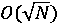
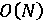
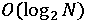
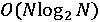
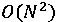
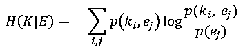

# 机器学习未来十年：你需要把握的趋势和热点

> 原文：[`mp.weixin.qq.com/s?__biz=MzAxNTc0Mjg0Mg==&mid=2653289627&idx=1&sn=a0b0f40dc052cccb12dafc4325f062a3&chksm=802e3e8eb759b7981dcb364f74d683630336d73f428b04aba0c060a51a4da50f07983b1ef5a3&scene=27#wechat_redirect`](http://mp.weixin.qq.com/s?__biz=MzAxNTc0Mjg0Mg==&mid=2653289627&idx=1&sn=a0b0f40dc052cccb12dafc4325f062a3&chksm=802e3e8eb759b7981dcb364f74d683630336d73f428b04aba0c060a51a4da50f07983b1ef5a3&scene=27#wechat_redirect)

本文来源：AI 科技大本营

本文贡献者：刘铁岩、秦涛、邵斌、陈薇、边江

*   刘铁岩，微软亚洲研究院副院长，国际电子电气工程师学会（IEEE）院士，美国计算机学会（ACM）杰出会员

*   秦涛，微软亚洲研究院资深研究员

*   邵斌，微软亚洲研究院主管研究员

*   陈薇，微软亚洲研究院主管研究员

*   边江，微软亚洲研究院主管研究员

* * *

人工智能正热。

技术创新是经济增长的根本动力。这些技术中，最重要的就是经济学家提到的“通用技术”，比如蒸汽机、内燃机、电力等。如今这个时代，人工智能就是最重要的“通用技术”。特别是行业与人工智能的结合，释放了行业的潜力，重塑了我们的生活。

人工智能备受关注、取得革命性进步背后的推手，其实是“机器学习”。

机器学习其实是一门多领域交叉学科，它涉及到计算机科学、概率统计、函数逼近论、最优化理论、控制论、决策论、算法复杂度理论、实验科学等多个学科。机器学习的具体定义也因此有许多不同的说法，分别以某个相关学科的视角切入。但总体上讲，其关注的核心问题是如何用计算的方法模拟类人的学习行为：从历史经验中获取规律（或模型），并将其应用到新的类似场景中。

那么，当我们谈机器学习时，到底在谈些什么？从业者需要掌握哪些前沿技术？未来，又有什么技术趋势值得期待？

**看前沿：你需要掌握的机器学习技术**

近年来，有很多新型的机器学习技术受到人们的广泛关注，也在解决实际问题中，提供了有效的方案。这里，我们简单介绍一下深度学习、强化学习、对抗学习、对偶学习、迁移学习、分布式学习、以及元学习。

**▌深度学习**

不同于传统的机器学习方法，深度学习是一类端到端的学习方法。基于多层的非线性神经网络，深度学习可以从原始数据直接学习，自动抽取特征并逐层抽象，最终实现回归、分类或排序等目的。在深度学习的驱动下，人们在计算机视觉、语音处理、自然语言方面相继取得了突破，达到或甚至超过了人类水平。深度学习的成功主要归功于三大因素——大数据、大模型、大计算，因此这三个方向都是当前研究的热点。

在过去的几十年中，很多不同的深度神经网络结构被提出，比如，卷积神经网络，被广泛应用于计算机视觉，如图像分类、物体识别、图像分割、视频分析等等；循环神经网络，能够对变长的序列数据进行处理，被广泛应用于自然语言理解、语音处理等；编解码模型（Encoder-Decoder）是深度学习中常见的一个框架，多用于图像或序列生成，例如比较热的机器翻译、文本摘要、图像描述（image captioning）问题。

****▌**强化学习**

2016 年 3 月，DeepMind 设计的基于深度卷积神经网络和强化学习的 AlphaGo 以 4:1 击败顶尖职业棋手李世乭，成为第一个不借助让子而击败围棋职业九段棋手的电脑程序。此次比赛成为 AI 历史上里程碑式的事件，也让强化学习成为机器学习领域的一个热点研究方向。

强化学习是机器学习的一个子领域，研究智能体如何在动态系统或者环境中以“试错”的方式进行学习，通过与系统或环境进行交互获得的奖赏指导行为，从而最大化累积奖赏或长期回报。由于其一般性，该问题在许多其他学科中也进行了研究，例如博弈论、控制理论、运筹学、信息论、多智能体系统、群体智能、统计学和遗传算法。

****▌**迁移学习**

迁移学习的目的是把为其他任务（称其为源任务）训练好的模型迁移到新的学习任务（称其为目标任务）中，帮助新任务解决训练样本不足等技术挑战。之所以可以这样做，是因为很多学习任务之间存在相关性（比如都是图像识别任务），因此从一个任务中总结出来的知识（模型参数）可以对解决另外一个任务有所帮助。迁移学习目前是机器学习的研究热点之一，还有很大的发展空间。

****▌**对抗学习**

传统的深度生成模型存在一个潜在问题：由于最大化概率似然，模型更倾向于生成偏极端的数据，影响生成的效果。对抗学习利用对抗性行为（比如产生对抗样本或者对抗模型）来加强模型的稳定性，提高数据生成的效果。近些年来，利用对抗学习思想进行无监督学习的生成对抗网络（GAN）被成功应用到图像、语音、文本等领域，成为了无监督学习的重要技术之一。

****▌**对偶学习**

对偶学习是一种新的学习范式，其基本思想是利用机器学习任务之间的对偶属性获得更有效的反馈/正则化，引导、加强学习过程，从而降低深度学习对大规模人工标注数据的依赖。对偶学习的思想已经被应用到机器学习很多问题里，包括机器翻译、图像风格转换、问题回答和生成、图像分类和生成、文本分类和生成、图像转文本和文本转图像等等。

****▌**分布式学习**

分布式技术是机器学习技术的加速器，能够显著提高机器学习的训练效率、进一步增大其应用范围。当“分布式”遇到“机器学习”，不应只局限在对串行算法进行多机并行以及底层实现方面的技术，我们更应该基于对机器学习的完整理解，将分布式和机器学习更加紧密地结合在一起。

****▌**元学习**

元学习（meta learning）是近年来机器学习领域的一个新的研究热点。字面上来理解，元学习就是学会如何学习，重点是对学习本身的理解和适应，而不仅仅是完成某个特定的学习任务。也就是说，一个元学习器需要能够评估自己的学习方法，并根据特定的学习任务对自己的学习方法进行调整。

**看趋势：把握机器学习的未来**

机器学习虽然取得了长足的进步，也解决了很多实际问题，但是客观地讲，机器学习领域仍然存在着巨大的挑战。

首先，主流的机器学习技术是黑箱技术，这让我们无法预知暗藏的危机，为解决这个问题，我们需要让机器学习具有可解释性、可干预性。其次，目前主流的机器学习的计算成本很高，亟待发明轻量级的机器学习算法。另外，在物理、化学、生物、社会科学中，人们常常用一些简单而美的方程（比如像薛定谔方程这样的二阶偏微分方程）来描述表象背后的深刻规律。那么在机器学习领域，我们是否也能追求到简单而美的规律呢？如此的挑战还有很多，不过我们对于这个领域未来的发展仍然充满信心。以下，我们将对未来十年的若干研究热点进行展望：

****▌**可解释的机器学习**

以深度学习为代表的各种机器学习技术方兴未艾，取得了举世瞩目的成功。机器和人类在很多复杂认知任务上的表现已在伯仲之间。然而，在解释模型为什么奏效及如何运作方面，目前学界的研究还处于非常初级的阶段。

**解释什么：相关性和因果逻辑性之间的鸿沟。**

大部分机器学习技术，尤其是基于统计的机器学习技术，高度依赖基于数据相关性习得的概率化预测和分析。相反，理性的人类决策更依赖于清楚可信的因果关系，这些因果关系由真实清楚的事实原由和逻辑正确的规则推理得出。从利用数据相关性来解决问题，过渡到利用数据间的因果逻辑来解释和解决问题，是可解释性机器学习需要完成的核心任务之一。

**为什么需要解释：知之为知之，不知为不知，是知也。**

机器学习模型基于历史数据进行分析和决策。但由于常识的缺失，机器在面对历史上未发生过或罕见的事件时，很大可能性会犯人类几乎不可能犯的低级错误。统计意义上的准确率并不能有效地刻画决策的风险，甚至在某些情况下，看似正确的概率性选择背后的原因与事实背道而驰。在可控性为首要考量目标的领域，比如医疗、核工业和航天等，理解数据决策背后所依赖的事实基础是应用机器学习的前提。对于这些领域，可解释性意味着可信和可靠。

可解释性机器学习，还是把机器学习技术与我们人类社会做深度集成的必经之路。对可解释性机器学习的需求不仅仅是对技术进步的渴求，同时包含各种非技术因素的考量，甚至包含法律法规。欧盟在 2018 年生效的 GDPR（GeneralData Protection Regulation）条例中明确要求，当采用机器做出针对某个体的决定时，比如自动拒绝一个在线信贷申请，该决定必须符合一定要求的可解释性。

除了产业和社会对可解释性机器学习的迫切需求，解释行为的动机同时是人类大脑内建的能力和诉求。认知神经科学先驱 Michael S. Gazzaniga 在对现代认知科学影响深远的裂脑人（Split-BrainPatients）研究中得出了如下的观察和结论：“我们的大脑会不由自主地去寻求（决策的）解释和事件发生的原由。”

**谁解释给谁：以人为中心的机器学习升级。**

解释给谁听，这个问题相对清楚。简而言之，解释给人。根据受众的不同，包含只有机器学习专家可以理解的解释，也包含普通大众都可以理解的解释。

那么由谁来解释呢？理想情况下，由机器解释：机器一边解答问题，一边给出答案背后的逻辑推理过程。但是，受限于很多机器学习技术的工作原理，机器自答自释并不总是行得通。很多机器学习算法是“数据进来，模型出去”，绝大部分时候，模型最终得出的结论与输入数据之间的因果关联变得无迹可寻，模型也变成了一个“神奇的”黑箱子。

在机器自答自释尚无有效方案的阶段，支持人工审查和回溯解答过程的方案可以提供一定程度的可解释性。此时，机器学习系统中各个子模块作用机理的可解释性就变得尤为重要。对于一个大型的机器学习系统，整体的可解释性高度依赖于各个组成部分的可解释性。从目前的机器学习到可解释性机器学习的演化将是一个涉及方方面面的系统工程，需要对目前的机器学习从理论到算法，再到系统实现进行全面的改造和升级。

**可解释性的度：起于实用，终于无穷。**

不同的应用场景对机器学习可解释性的要求天然不同。某些时候，“曲高和寡”的专业解释就已足够，尤其当其解释只用作技术安全性审查时；另外一些场合，当可解释性是人机交互的一部分时，“老妪能解”的通俗解答就变得非常必要。任何技术都只在一定范围和一定程度上起作用，对于机器学习的可解释性同样如此。可解释机器学习，起于实用性的需求，终于永无止尽的不断改进中。

****▌**轻量机器学习和边缘计算**

边缘计算（EdgeComputing）指的是在网络边缘节点来处理、分析数据。而边缘节点指的是在数据产生源头和云计算中心之间具有计算资源和网络资源的节点，比如手机就是人与云计算中心之间的边缘节点，而网关则是智能家居和云计算中心之间的边缘节点。在理想环境下，边缘计算指的是在数据产生源附近分析、处理数据，降低数据的流转，进而减少网络流量和响应时间。随着物联网的兴起以及人工智能在移动场景下的广泛应用，机器学习与边缘计算的结合就显得尤为重要。

**为什么边缘计算会在这种嵌入式机器学习的范式下发挥重要作用呢？**

**1.数据传输带宽和任务响应延迟**：在移动场景下，机器学习任务在需要大量的数据进行训练的同时又需要更短的响应延迟。以自动驾驶为例，比较大的延迟可能会显著增加事故风险，因此就需要定制的机载计算设备在边缘执行模型推断。而且，当有大量设备连接到同一网络时，有效带宽也会减少，而利用边缘计算可以有效地减少设备之间在通讯渠道上的竞争。

**2\. 安全性**：边缘计算中的边缘设备可以保障所收集的敏感数据的安全性。同时，边缘计算可以使智能的边缘设备分散化，降低 DDoS 攻击对整个网络影响的风险。

**3.定制化学习任务**：边缘计算使得不同的边缘设备可以针对他们所面对的不用类型的对象采取定制化的学习任务和模型。例如在安防领域的图像识别任务，不同区域的视频设备所观测到的图像信息可能差别很大，因此仅仅训练一个深度学习模型可能无法达到目的，而在云上同时托管多个模型代价也会很大。更有效的解决方案是在云中训练每个场景下不同的模型，并将训练好的模型发送到相应的边缘设备。

**4\. 多智能体协作**：边缘设备也可以同时模型多智能体场景，帮助训练多智能协作的强化学习模型。

那么将机器学习模型，特别是复杂的深度学习模型，嵌入到边缘计算的框架中所面临的挑战在哪里呢？

**1.参数高效的神经网络**：神经网络的一个显著特点是庞大的参数规模，而边缘设备往往不能处理大规模的神经网络。这促使研究人员在保持模型准确性的同时最小化神经网络的规模。现在通常采用的方式包括通过对卷积层的挤压和扩展来降低滤波器的次数，从而优化参数效率。

**2.神经网络修剪**：在神经网络的训练过程中存在一些神经元，对他们进行大量的训练后并不能改进模型的最终效果。在这种情况下，我们可以通过修剪这类神经元来节省模型空间。

**3.精度控制**：大多数神经网络参数都是 32 位浮点数。边缘设备可以设计为 8 位或更少的浮点数，通过这种降低精度的方式可以显著地减小模型规模。

**4.模型蒸馏**：模型蒸馏的过程是将训练好的复杂神经网络的能力迁移到一个结构更为简单的神经网络上。结合迁移学习的发展，这种方法可以更有效地降低模型复杂度同时又不会失去太多精度。

**5.优化的微处理器**：另外一个方向则是将神经网络的学习和推断能力嵌入到边缘设备的微处理器上，这种 AI 芯片所表现出来的潜力也受到越来越多的关注。

****▌**量子机器学习**

量子机器学习（Quantum ML）是量子计算和机器学习的交叉学科。

量子计算机利用量子相干和量子纠缠等效应来处理信息，这和经典计算机有着本质的差别。目前量子算法已经在若干问题上超过了最好的经典算法，我们称之为量子加速。例如搜索一个有 N 个条目未排序的数据库，量子算法所需时间为，而经典计算机的时间复杂度为；对一个 N×N 的稀疏矩阵求逆，量子计算机的时间复杂度为，而经典计算机为。

当量子计算遇到机器学习，可以是个互利互惠、相辅相成的过程：一方面我们可以利用量子计算的优势来提高经典的机器学习算法的性能，如在量子计算机上高效实现经典计算机上的机器学习算法。另一方面，我们也可以利用经典计算机上的机器学习算法来分析和改进量子计算系统。

**基于线性代数的量子机器学习算法**

这一类别中的许多量子机器学习算法是基于求解线性方程组的量子算法的各种变体，该算法在特定条件下（如 Hamiltonian 条件，稀疏矩阵或低秩矩阵满足该条件）求解 N 元线性方程组的复杂度为。需要指出的是，任何已知的矩阵求逆的经典算法的复杂度至少为。基于量子矩阵求逆算法可以加速很多机器学习方法，如最小二乘线性回归、支持向量机的最小二乘版本、高斯过程等，这些算法的训练可以简化为求解线性方程组。这一类量子机器学习算法的关键瓶颈是数据输入，如何用整个数据集特征来初始化量子系统。虽然对于某些特定的情况高效数据输入算法存在，但是对大多数情形而言，数据如何输入到量子系统是未知的。

**量子强化学习**

在量子强化学习中，一个量子智能体（agent）与经典环境互动，从环境获得奖励从而调整和改进其行为策略。在某些情况下，由于智能体的量子处理能力或者由于量子叠加探测环境的可能性，而实现量子加速。这类算法已在超导电路和俘获离子系统中提出。

**量子深度学习**

诸如量子退火器和采用可编程光子电路的专用量子信息处理器非常适合构建深层量子学习网络。最简单的可量子化的深度神经网络是玻尔兹曼机。经典的玻尔兹曼机由具有可调的相互作用的比特位组成，通过调整这些比特位的相互作用来训练玻尔兹曼机，使得其表达的分布符合数据的统计。为了量子化 Boltzmann 机，可以简单地将神经网络表示为一组相互作用的量子自旋，它对应于一个可调的 Ising 模型。然后通过将玻尔兹曼机中的输入神经元初始化为固定状态，并允许系统进行热化，我们可以读出输出量子位以获得结果。

量子退火器是专用的量子信息处理器，比通用量子计算机更容易构建和扩展，目前已初步商业化，如 D-wave 量子退火器。

**▌简单而美的定律**

大自然处处都是纷繁复杂的现象和系统。纵览现实世界复杂现象背后的本质，我们却能得到一个出乎意料的结论：貌似复杂的自然现象都由简单而优美的数学规律所刻画，比如偏微分方程。Mathematica 的创建者、知名计算机科学家、物理学家 Stephen Wolfram 也曾给出过类似的观察和结论: “事实证明，物理和其他科学领域几乎所有的传统数学模型最终都基于偏微分方程。” 既然自然现象背后简而美的数学定律如此普遍（尤其是偏微分方程），那么能否设计一种方法来自动地学习和发现现象背后的数学定律呢？这个问题显然很难，但并非完全不可能。 

对任何一个方程，某种相等性一定存在。那么更进一步，现实物理世界是否存在内在的、普遍的守恒性或不变量呢？关于这个问题，德国数学家 Emmy Noether 在 1915 年提出了极具洞察力的诺特定理（Noether’s theorem）。该定理指出，对于每个连续的对称变换都存在一个守恒量（不变量）与之对应。换言之，连续对称性和守恒定律之间有着一一对应关系。这对于发现自然现象背后的守恒关系，尤其是对于寻找物理守恒定律，提供了深刻的理论指引。事实上，绝大部分物理定律公式都是基于某种量的守恒而导出的，比如刻画量子系统的薛定谔方程就是由能量守恒得到。

基于这种洞察，科学工作者们开展了大量尝试并取得了累累硕果。例如，Schmidt 和 Lipson 在 2009 年发表的《科学》杂志论文中，提出了基于不变量原理和进化算法的自动定律发现方法。论文探讨了这样一个课题：对于给定的实验数据，我们基于某种不变性可以生成大量的等式或方程。那么，什么样的相关性才是重要且有意义的呢？虽然这个问题难以定量回答，Schmidt 和 Lipson 在论文中给出了他们的观点：基于某种不变量得到的有效公式必须能正确预测一个系统中各个组成部分之间的动态关系。具体来说，一个有意义的守恒公式须能正确刻画一组变量相对于时间的导数之间的关系。

相比于深度学习，自动定律学习更像牛顿当年观察研究世界的方法。在收集到很多关于现实世界的数据后，牛顿得到了一系列定律、方程和公式，可以用来简洁明了地刻画我们生活的这个物理世界的规律。万物皆数，自动化定律发现可以很大程度地辅助科学研究，甚至在一定领域内实现科学研究的自动化。

**即兴学习**

这里我们探讨的即兴学习与 Yann LeCun 一直倡导的预测学习，有着相似的目标，然而二者对世界的假设和采取的方法论非常不同。预测学习这个概念脱胎于无监督学习，侧重预测未来事件发生概率的能力。方法论上，预测学习利用所有当前可用的信息，基于过去和现在预测未来，或者基于现在分析过去。预测学习在一定程度上暗合现代认知科学对大脑能力的理解。

预测学习的两大要素是：建模世界和预测当前未知。问题是，我们生活的世界是否可以预测？这个问题的答案是不明确的。

与预测学习对世界的假设不同，即兴学习假设异常事件的发生是常态。即兴智能是指当遇到出乎意料的事件时可以即兴地、变通地处理解决问题的能力。即兴学习意味着没有确定的、预设的、静态的可优化目标。直观地讲，即兴学习系统需要进行不间断的、自我驱动的能力提升，而不是由预设目标生成的优化梯度推动演化。换言之，即兴学习通过自主式观察和交互来获得知识和解决问题的能力。

一个即兴学习系统通过观察环境并与环境交互的正负反馈中学习。这个过程跟强化学习表面上很像，本质的区别还是在于即兴学习没有确定预设的优化目标，而强化学习则通常需要一个预设的目标。既然即兴学习不是由根据固定优化目标所得出的学习梯度来驱动演化。那么，是什么驱动了这个学习过程？什么时候，这个学习过程会停止？这里，我们以“条件熵”模型为例来探讨这类学习系统。

这里 K 是学习系统当前拥有的知识，而 E 是环境中的信息。该公式刻画了环境相对于当前学习系统的“不确定性”。伴随着“负熵”的转移，学习系统获得越来越多关于环境的知识，这种“不确定性”逐步递减，直到消失。当这种“不确定性”完全消失后，“负熵”流动停止，学习过程结束。这时，该学习系统通过无预设目标的即兴学习，获得了对环境的全面理解。

**社会机器学习**

机器学习的目的是模拟人类的学习过程。机器学习虽然取得很大的成功，但是到目前为止，它忽视了一个重要的因素，也就是人的社会属性。我们每个人都是社会的一分子，很难从出生就脱离社会独自生存、学习并不断进步。既然人类的智能离不开社会，那么我们能否让机器们也具有某种意义的社会属性，模拟人类社会中的关键元素进行演化，从而实现比现在的机器学习方法更为有效、智能、可解释的“社会机器学习”呢？

社会是由亿万个人类个体构成，社会机器学习也应该是一个由机器学习智能体构成的体系。每一个机器学习算法除了按照现在的机器学习方法获取数据的规律，还参与社会活动。它们会联合其他的机器学习智能体按照社会机制积极获取信息、分工、合作、获得社会酬劳。与此同时，它们会总结经验、学习知识、相互学习来调整行为。

事实上，现在的机器学习方法中已经开始出现“社会智能”的零零星星的影子。比如，“知识蒸馏”可以描述机器学习智能体之间最简单的行为影响，它也可能是初步获取知识的方式；分布式机器学习算法中模型平均、模型集成、投票等方法是最简单的社会决策机制；强化学习提供了智能体基于酬劳反馈调整行为的框架。

由于社会属性是人类的本质属性，社会机器学习也将会是我们利用机器学习从获取人工智能到获取社会智能的重要方向！

**▌结语**

如前文所说，机器学习近几年发展迅猛，我们对它充满信心，文中提及的未来方向仅是基于笔者对机器学习领域的理解，一定还有很多没有涵盖的重要方向。其实预测未来是一件非常困难的事情，尤其是对于机器学习这个飞速发展的领域。Alan Kay 曾经说过：“预测未来最好的方法就是创造它”。因此。我们呼吁所有机器学习从业人员，无论是学者还是工程师，是教授还是学生，能够共同努力、携手前行，用我们的实际行动去推进这些重要的研究课题，用我们的双手去创造未来，这会比预测未来要实在得多、重要得多！

**推荐阅读**

[01、经过多年交易之后你应该学到的东西（深度分享）](https://mp.weixin.qq.com/s?__biz=MzAxNTc0Mjg0Mg==&mid=2653289074&idx=1&sn=e859d363eef9249236244466a1af41b6&chksm=802e3867b759b1717f77e07a51ee5671e8115130c66562577280ba1243cba08218add04f1f00&token=449379994&lang=zh_CN&scene=21#wechat_redirect)

[02、监督学习标签在股市中的应用（代码+书籍）](https://mp.weixin.qq.com/s?__biz=MzAxNTc0Mjg0Mg==&mid=2653289050&idx=1&sn=60043a5c95b877dd329a5fd150ddacc4&chksm=802e384fb759b1598e500087374772059aa21b31ae104b3dca04331cf4b63a233c5e04c1945a&token=449379994&lang=zh_CN&scene=21#wechat_redirect)

[03、全球投行顶尖机器学习团队全面分析](https://mp.weixin.qq.com/s?__biz=MzAxNTc0Mjg0Mg==&mid=2653289018&idx=1&sn=8c411f676c2c0d92b0dd218f041bee4b&chksm=802e382fb759b139ffebf633ac14cdd0f21938e4613fe632d5d9231dab3d2aca95a11628378a&token=449379994&lang=zh_CN&scene=21#wechat_redirect)

[04、使用 Tensorflow 预测股票市场变动](https://mp.weixin.qq.com/s?__biz=MzAxNTc0Mjg0Mg==&mid=2653289014&idx=1&sn=3762d405e332c599a21b48a7dc4df587&chksm=802e3823b759b135928d55044c2729aea9690f86752b680eb973d1a376dc53cfa18287d0060b&token=449379994&lang=zh_CN&scene=21#wechat_redirect)

[05、使用 LSTM 预测股票市场基于 Tensorflow](https://mp.weixin.qq.com/s?__biz=MzAxNTc0Mjg0Mg==&mid=2653289238&idx=1&sn=3144f5792f84455dd53c27a78e8a316c&chksm=802e3903b759b015da88acde4fcbc8547ab3e6acbb5a0897404bbefe1d8a414265d5d5766ee4&token=2020206794&lang=zh_CN&scene=21#wechat_redirect)

[06、美丽的回测——教你定量计算过拟合概率](https://mp.weixin.qq.com/s?__biz=MzAxNTc0Mjg0Mg==&mid=2653289314&idx=1&sn=87c5a12b23a875966db7be50d11f09cd&chksm=802e3977b759b061675d1988168c1fec06c602e8583fbcc9b76f87008e0c10b702acc85467a0&token=1972390229&lang=zh_CN&scene=21#wechat_redirect)

[07、利用动态深度学习预测金融时间序列基于 Python](https://mp.weixin.qq.com/s?__biz=MzAxNTc0Mjg0Mg==&mid=2653289347&idx=1&sn=bf5d7899bc4a854d4ba9046fdc6fe0d6&chksm=802e3996b759b080287213840987bb0a0c02e4e1d4d7aae23f10a225a92ef6dd922d8006123d&token=290397496&lang=zh_CN&scene=21#wechat_redirect)

[08、Facebook 开源神器 Prophet 预测时间序列基于 Python](https://mp.weixin.qq.com/s?__biz=MzAxNTc0Mjg0Mg==&mid=2653289394&idx=1&sn=24a836136d730aa268605628e683d629&chksm=802e39a7b759b0b1dcf7aaa560699130a907716b71fc9c45ff0e5d236c5ae8ef80ebdb09dbb6&token=290397496&lang=zh_CN&scene=21#wechat_redirect)

[09、Facebook 开源神器 Prophet 预测股市行情基于 Python](https://mp.weixin.qq.com/s?__biz=MzAxNTc0Mjg0Mg==&mid=2653289437&idx=1&sn=f0dca7da8e69e7ba736992cb3d034ce7&chksm=802e39c8b759b0de5bce401c580623d0729ecca69d13926479d36e19aff8c9c9e8a20265afff&token=290397496&lang=zh_CN&scene=21#wechat_redirect)

[10、2018 第三季度最受欢迎的券商金工研报前 50（附下载）](https://mp.weixin.qq.com/s?__biz=MzAxNTc0Mjg0Mg==&mid=2653289358&idx=1&sn=db6e8ab85b08f6e67790ec0e401e586e&chksm=802e399bb759b08d6eec855f9901ea856d0da68c7425cba62791b8948da6ad761a3d88543dad&token=290397496&lang=zh_CN&scene=21#wechat_redirect)

[11、实战交易策略的精髓（公众号深度呈现）](https://mp.weixin.qq.com/s?__biz=MzAxNTc0Mjg0Mg==&mid=2653289447&idx=1&sn=f2948715bf82569a6556d518e56c1f9e&chksm=802e39f2b759b0e4502d1aaac562b87789573b55c76b3c85897d8c9d88dbf9a0b7ee34d86a4e&token=290397496&lang=zh_CN&scene=21#wechat_redirect)

[12、Markowitz 有效边界和投资组合优化基于 Python](https://mp.weixin.qq.com/s?__biz=MzAxNTc0Mjg0Mg==&mid=2653289478&idx=1&sn=f8e01a641be021993d8ef2d84e94a299&chksm=802e3e13b759b7055cf27a280c672371008a5564c97c658eee89ce8481396a28d254836ff9af&token=290397496&lang=zh_CN&scene=21#wechat_redirect)

[13、使用 LSTM 模型预测股价基于 Keras](https://mp.weixin.qq.com/s?__biz=MzAxNTc0Mjg0Mg==&mid=2653289495&idx=1&sn=c4eeaa2e9f9c10995be9ea0c56d29ba7&chksm=802e3e02b759b7148227675c23c403fb9a543b733e3d27fa237b53840e030bf387a473d83e3c&token=1260956004&lang=zh_CN&scene=21#wechat_redirect)

[14、量化金融导论 1：资产收益的程式化介绍基于 Python](https://mp.weixin.qq.com/s?__biz=MzAxNTc0Mjg0Mg==&mid=2653289507&idx=1&sn=f0ca71aa07531bbbdbd33213f0bab89f&chksm=802e3e36b759b720138b3b17a4dd0e198e054b9de29a038fdd50805f824effa55831111ad026&token=1936245282&lang=zh_CN&scene=21#wechat_redirect)

[15、预测股市崩盘基于统计机器学习与神经网络（Python+文档）](https://mp.weixin.qq.com/s?__biz=MzAxNTc0Mjg0Mg==&mid=2653289533&idx=1&sn=4ef964834e84a9995111bb057b0fc5dd&chksm=802e3e28b759b73e0618eb1262c53aa0601fbf5805525a7c7ff40dc3db62c7704496611bdbf1&token=1950551577&lang=zh_CN&scene=21#wechat_redirect)

**公众号官方 QQ 群**

**群里已经分享了****62 篇****干货**

**量化、技术人士实名制交流**

**没有按规则加群者一律忽略**

