# 海量 Wind 数据，与全网用户零距离邂逅！

> 原文：[`mp.weixin.qq.com/s?__biz=MzAxNTc0Mjg0Mg==&mid=2653289623&idx=1&sn=28a3600fd7a72d7be00b066ca0f98244&chksm=802e3e82b759b7943f43a4f6ef4a91e4153fa6b8210de9590235fa8ee66eb9811ce177054dbc&scene=27#wechat_redirect`](http://mp.weixin.qq.com/s?__biz=MzAxNTc0Mjg0Mg==&mid=2653289623&idx=1&sn=28a3600fd7a72d7be00b066ca0f98244&chksm=802e3e82b759b7943f43a4f6ef4a91e4153fa6b8210de9590235fa8ee66eb9811ce177054dbc&scene=27#wechat_redirect)

**供稿：万矿**

万矿隶属 Wind，是**Wind 旗下一款高端量化分析云平台**，提供基于 Python 的量化投资研究环境以及丰富的金融数据。说到数据，这里要说：**Wind 为万矿提供了强大的金融数据支持，涵盖：股票、债券、基金、衍生品、指数、宏观行业等各类金融市场数据。直接调取 Python API 接口，与 Wind 终端完全切合！**

万矿的**数据分类十分细致**，**种类也超级全面**，**近期大家关注的全球股票（美股、新兴市场）、外汇、港股、期权等数据万矿应有尽有。**

用**“海量”**形容万矿的数据一点都不夸张。与国内其他量化平台相比，万矿在数据方面占有绝对的优势！

**WQ**

**数据种类介绍**

**按照接口函数划分**

**WSD/WSS****（时间序列/横截面序列）**

| 指标一级分类 | 指标二级分类 |
| 基本资料 | 14 大类 |
| 市场行情 | 10 大类 |
| 证券分析 | 8 大类 |
| 预测评级 | 12 大类 |
| 财务数据 | 7 大类 |
| 权益事件 | 8 大类 |
| 投资组合 | 7 大类 |

更详细指标展示：

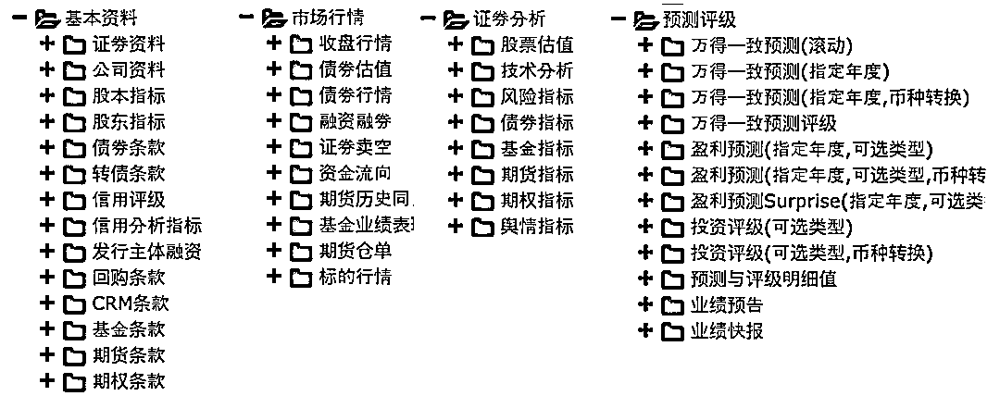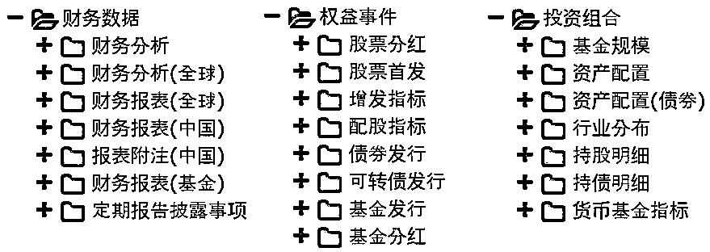

左右滑动查看更多

**WSQ****（****实时行情数据****，包括所有 WSQ 指标的 Level 1 数据，最高可订阅 4000 个指标）**

| 指标一级分类 | 指标二级分类 |
| 基本行情 | 70+类 |
| 资金流向 | 80+类 |
| 股票 | 18 类 |
| 债券 | 19 类 |
| 基金 | 5 类 |
| 期货 | 9 类 |
| 期权 | 41 类 |
| 指数 | 6 类 |

更详细指标展示：

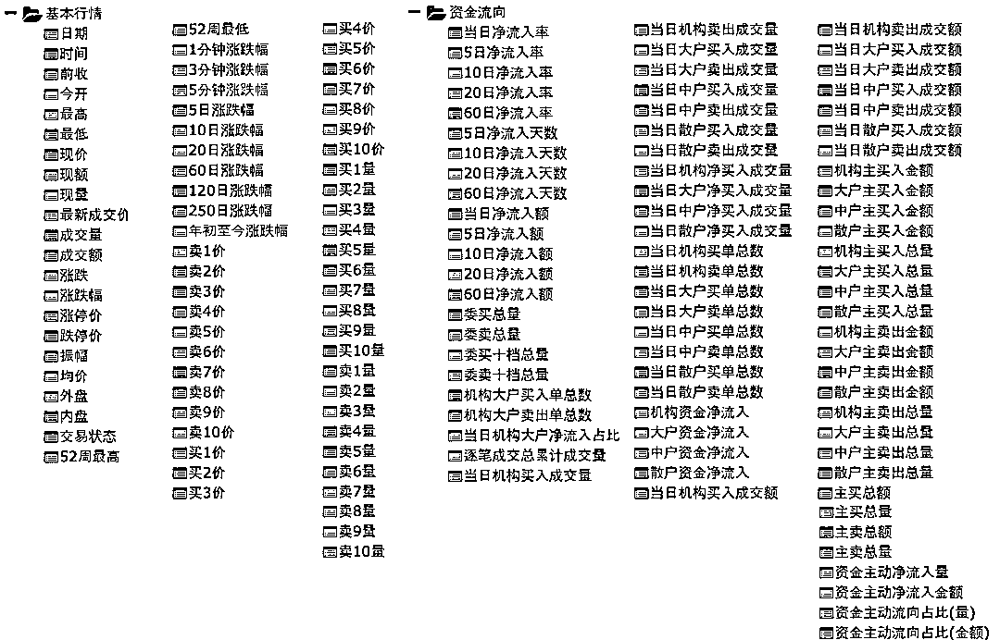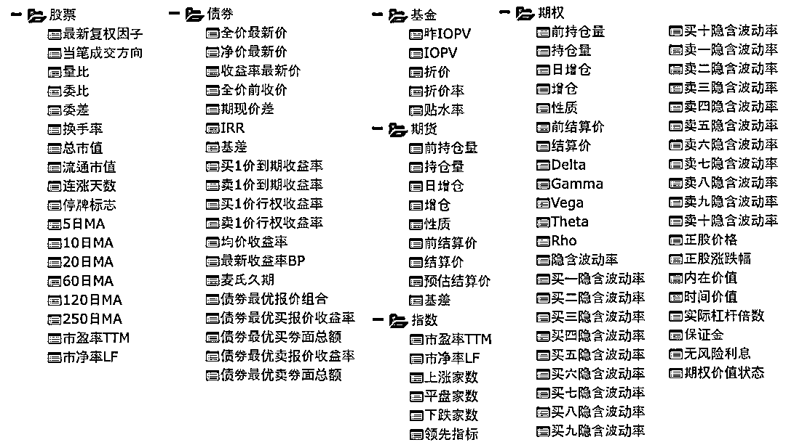

左右滑动查看更多

**WSEE/WSES****（选定股票板块的历史截面/时间序列截面）**

| 指标一级分类 | 指标二级分类 |
| 基本指标 | 6 类 |
| 股本指标 | 12 类 |
| 盈利预测 | 6 类 |
| 资金流向（中国） | 12 类 |
| 估值指标（全球） | 14 类 |
| 估值指标（中国） | 20 类 |
| 风险指标（中国） | 9 类 |
| 证监会统计指标（中国） | 7 类 |
| 财务指标（全球，GSD 准则） | 8 大类 |
| 财务数据（全球，GSD 准则） | 3 大类 |
| 财务指标（中国会计准则） | 9 大类 |
| 财务数据（中国会计准则） | 2 大类 |

更详细指标展示：

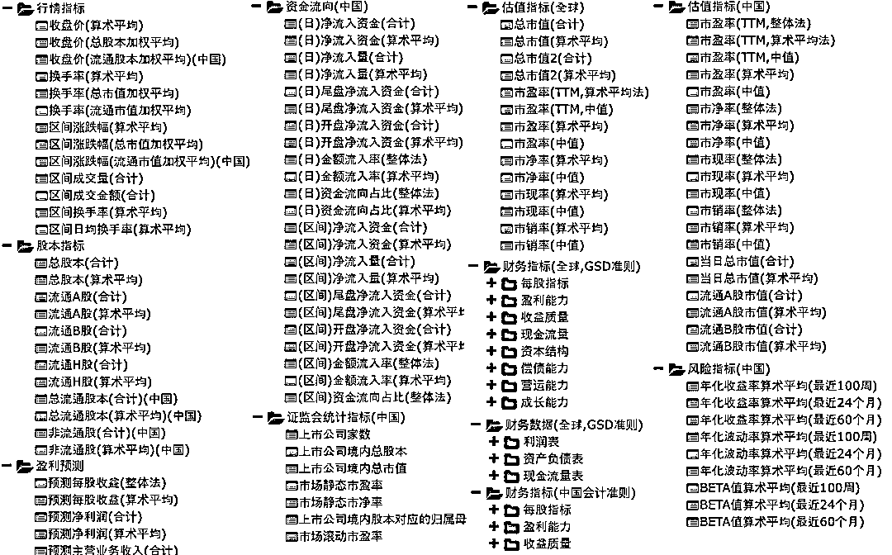

**WSET****（板块成分、指数成分以及各种证券品种的专题统计报表）**

| 指标一级分类 | 指标二级分类 |
| 板块指数 | 3 大类 |
| 股票 | 8 大类 |
| 债券 | 6 类 |
| 期权 | 3 大类 |
| 期货 | 7 类 |
| 基金 | 7 类 |

更详细指标展示：

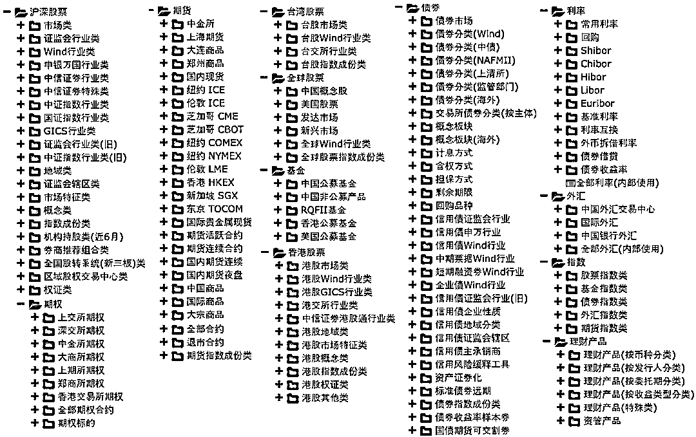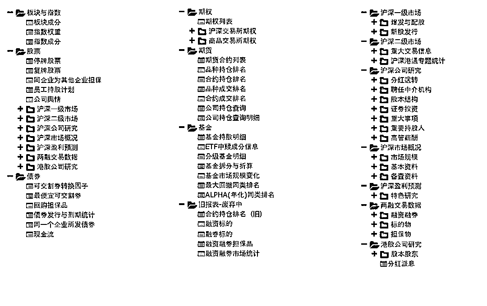

左右滑动查看更多

**WQ**

**量化因子**

Wind 量化因子库是经过标准化和正态化，量化研究和投资所需因子的数据库，包含**20+大类**，**400+个因子**，提供 A 股市场上市以来的所有因子数据。

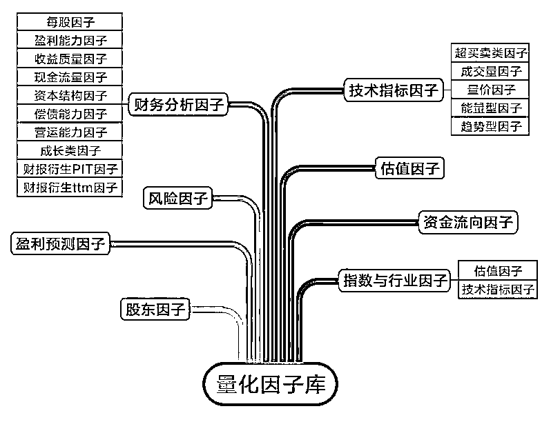

**优势 1：****Point in Time**

**提供每个时点发布的报表数据，避免在回测中引用未来数据！**利用万矿量化云分析平台进行测量搭建与回测，提高回测结果的准确性。

**优势 2： **** 多维衍生**

提供**多维度衍生计算报表及指标**，无论是你想根据 MRQ（最新一季）财务报表或是根据 TTM（滚动 12 个月）。

**优势 3： ** **更新及时**

因子库的相关数据在**交易日当天全部更新完毕**。

**优势 4：** **回测分析**

从**上市至今数据均保留**，**20+余年**可回测。

**优势 5：** **信息准确**

配备专业的数据团队进行因子库设计、开以及后期维护工作，**人工校验与 IT 智能相结合**，确保因子库信息准确。

点击下图了解使用详情：

**WQ**

**代码生成器**

有了如此**“海量”**的数据，万矿还希望大家直接使用我们的**智能代码生成器**，**简单快捷的调取各种数据 API 函数！**再也不用去查找文档和为参数众多的数据 API 而烦恼啦。

**代码生成器展示**

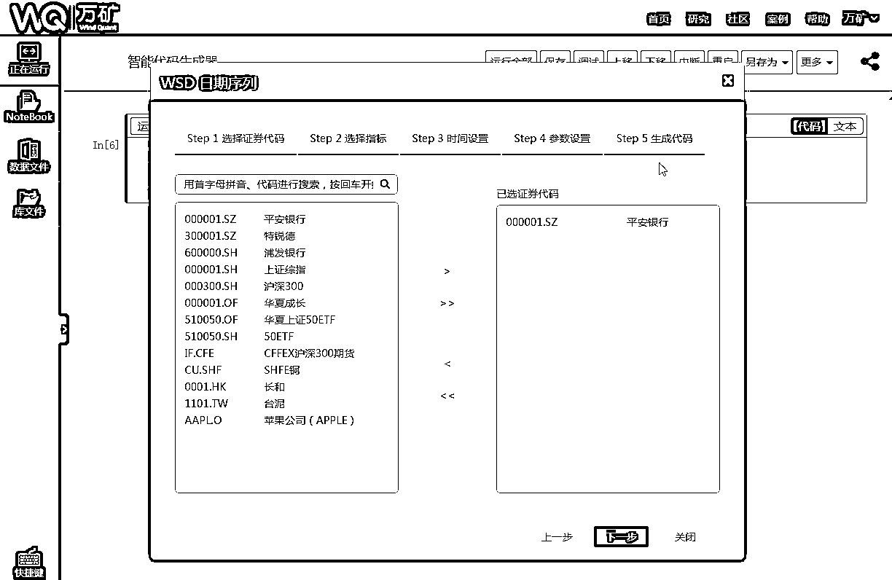

从选择证券代码、指标选择、日期设置、参数设置，到生成一段数据 API 代码，共 5 个步骤。最后只需复制粘贴生成代码到 Notebook 单元格中即可。

点击下图了解使用详情：

**WQ**

**如何使用万矿**

**1、Wind 终端用户**

登录**Wind 金融终端**点击**量化**或输入**WQT**即可使用万矿。

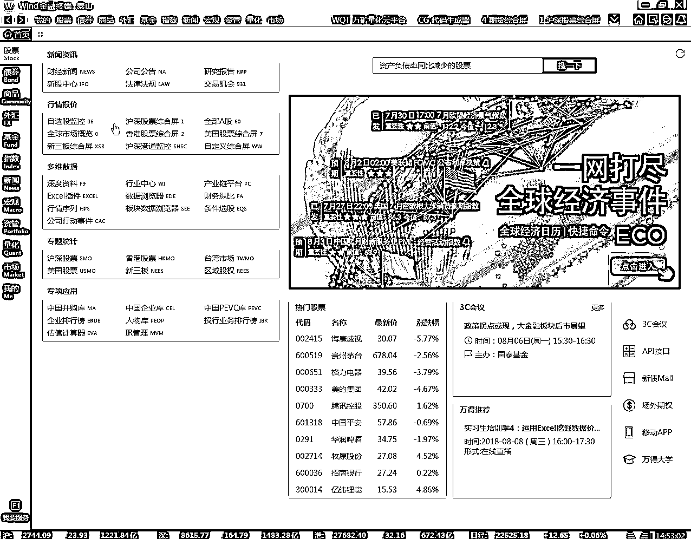

**2、互联网用户**

登录网页版，**免费**注册即可使用万矿。

***www.windquant.com***

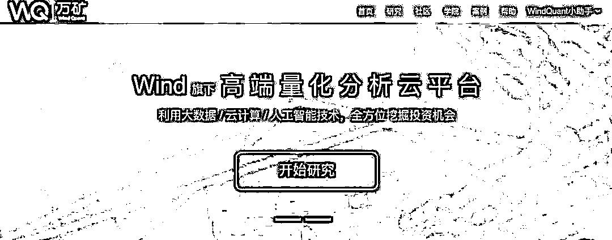

有了这么强大的数据支持，相信你可以基于万矿，做任何你想做的研究。 

万矿近期还有更多新的功能和产品将强势推出，大家尽请期待~

**WQ**

**更多功能介绍**

**可视化利器——WindCharts**

**可视化利器——WindCharts**

## **策略研究助手——案例模板**

## **超实用数据查看工具——Wtable**

## **在历史挖矿，在未来炼金**

**推荐阅读**

[01、经过多年交易之后你应该学到的东西（深度分享）](https://mp.weixin.qq.com/s?__biz=MzAxNTc0Mjg0Mg==&mid=2653289074&idx=1&sn=e859d363eef9249236244466a1af41b6&chksm=802e3867b759b1717f77e07a51ee5671e8115130c66562577280ba1243cba08218add04f1f00&token=449379994&lang=zh_CN&scene=21#wechat_redirect)

[02、监督学习标签在股市中的应用（代码+书籍）](https://mp.weixin.qq.com/s?__biz=MzAxNTc0Mjg0Mg==&mid=2653289050&idx=1&sn=60043a5c95b877dd329a5fd150ddacc4&chksm=802e384fb759b1598e500087374772059aa21b31ae104b3dca04331cf4b63a233c5e04c1945a&token=449379994&lang=zh_CN&scene=21#wechat_redirect)

[03、全球投行顶尖机器学习团队全面分析](https://mp.weixin.qq.com/s?__biz=MzAxNTc0Mjg0Mg==&mid=2653289018&idx=1&sn=8c411f676c2c0d92b0dd218f041bee4b&chksm=802e382fb759b139ffebf633ac14cdd0f21938e4613fe632d5d9231dab3d2aca95a11628378a&token=449379994&lang=zh_CN&scene=21#wechat_redirect)

[04、使用 Tensorflow 预测股票市场变动](https://mp.weixin.qq.com/s?__biz=MzAxNTc0Mjg0Mg==&mid=2653289014&idx=1&sn=3762d405e332c599a21b48a7dc4df587&chksm=802e3823b759b135928d55044c2729aea9690f86752b680eb973d1a376dc53cfa18287d0060b&token=449379994&lang=zh_CN&scene=21#wechat_redirect)

[05、使用 LSTM 预测股票市场基于 Tensorflow](https://mp.weixin.qq.com/s?__biz=MzAxNTc0Mjg0Mg==&mid=2653289238&idx=1&sn=3144f5792f84455dd53c27a78e8a316c&chksm=802e3903b759b015da88acde4fcbc8547ab3e6acbb5a0897404bbefe1d8a414265d5d5766ee4&token=2020206794&lang=zh_CN&scene=21#wechat_redirect)

[06、美丽的回测——教你定量计算过拟合概率](https://mp.weixin.qq.com/s?__biz=MzAxNTc0Mjg0Mg==&mid=2653289314&idx=1&sn=87c5a12b23a875966db7be50d11f09cd&chksm=802e3977b759b061675d1988168c1fec06c602e8583fbcc9b76f87008e0c10b702acc85467a0&token=1972390229&lang=zh_CN&scene=21#wechat_redirect)

[07、利用动态深度学习预测金融时间序列基于 Python](https://mp.weixin.qq.com/s?__biz=MzAxNTc0Mjg0Mg==&mid=2653289347&idx=1&sn=bf5d7899bc4a854d4ba9046fdc6fe0d6&chksm=802e3996b759b080287213840987bb0a0c02e4e1d4d7aae23f10a225a92ef6dd922d8006123d&token=290397496&lang=zh_CN&scene=21#wechat_redirect)

[08、Facebook 开源神器 Prophet 预测时间序列基于 Python](https://mp.weixin.qq.com/s?__biz=MzAxNTc0Mjg0Mg==&mid=2653289394&idx=1&sn=24a836136d730aa268605628e683d629&chksm=802e39a7b759b0b1dcf7aaa560699130a907716b71fc9c45ff0e5d236c5ae8ef80ebdb09dbb6&token=290397496&lang=zh_CN&scene=21#wechat_redirect)

[09、Facebook 开源神器 Prophet 预测股市行情基于 Python](https://mp.weixin.qq.com/s?__biz=MzAxNTc0Mjg0Mg==&mid=2653289437&idx=1&sn=f0dca7da8e69e7ba736992cb3d034ce7&chksm=802e39c8b759b0de5bce401c580623d0729ecca69d13926479d36e19aff8c9c9e8a20265afff&token=290397496&lang=zh_CN&scene=21#wechat_redirect)

[10、2018 第三季度最受欢迎的券商金工研报前 50（附下载）](https://mp.weixin.qq.com/s?__biz=MzAxNTc0Mjg0Mg==&mid=2653289358&idx=1&sn=db6e8ab85b08f6e67790ec0e401e586e&chksm=802e399bb759b08d6eec855f9901ea856d0da68c7425cba62791b8948da6ad761a3d88543dad&token=290397496&lang=zh_CN&scene=21#wechat_redirect)

[11、实战交易策略的精髓（公众号深度呈现）](https://mp.weixin.qq.com/s?__biz=MzAxNTc0Mjg0Mg==&mid=2653289447&idx=1&sn=f2948715bf82569a6556d518e56c1f9e&chksm=802e39f2b759b0e4502d1aaac562b87789573b55c76b3c85897d8c9d88dbf9a0b7ee34d86a4e&token=290397496&lang=zh_CN&scene=21#wechat_redirect)

[12、Markowitz 有效边界和投资组合优化基于 Python](https://mp.weixin.qq.com/s?__biz=MzAxNTc0Mjg0Mg==&mid=2653289478&idx=1&sn=f8e01a641be021993d8ef2d84e94a299&chksm=802e3e13b759b7055cf27a280c672371008a5564c97c658eee89ce8481396a28d254836ff9af&token=290397496&lang=zh_CN&scene=21#wechat_redirect)

[13、使用 LSTM 模型预测股价基于 Keras](https://mp.weixin.qq.com/s?__biz=MzAxNTc0Mjg0Mg==&mid=2653289495&idx=1&sn=c4eeaa2e9f9c10995be9ea0c56d29ba7&chksm=802e3e02b759b7148227675c23c403fb9a543b733e3d27fa237b53840e030bf387a473d83e3c&token=1260956004&lang=zh_CN&scene=21#wechat_redirect)

[14、量化金融导论 1：资产收益的程式化介绍基于 Python](https://mp.weixin.qq.com/s?__biz=MzAxNTc0Mjg0Mg==&mid=2653289507&idx=1&sn=f0ca71aa07531bbbdbd33213f0bab89f&chksm=802e3e36b759b720138b3b17a4dd0e198e054b9de29a038fdd50805f824effa55831111ad026&token=1936245282&lang=zh_CN&scene=21#wechat_redirect)

[15、预测股市崩盘基于统计机器学习与神经网络（Python+文档）](https://mp.weixin.qq.com/s?__biz=MzAxNTc0Mjg0Mg==&mid=2653289533&idx=1&sn=4ef964834e84a9995111bb057b0fc5dd&chksm=802e3e28b759b73e0618eb1262c53aa0601fbf5805525a7c7ff40dc3db62c7704496611bdbf1&token=1950551577&lang=zh_CN&scene=21#wechat_redirect)

**公众号官方 QQ 群**

**群里已经分享了****62 篇****干货**

**量化、技术人士实名制交流**

**没有按规则加群者一律忽略**

