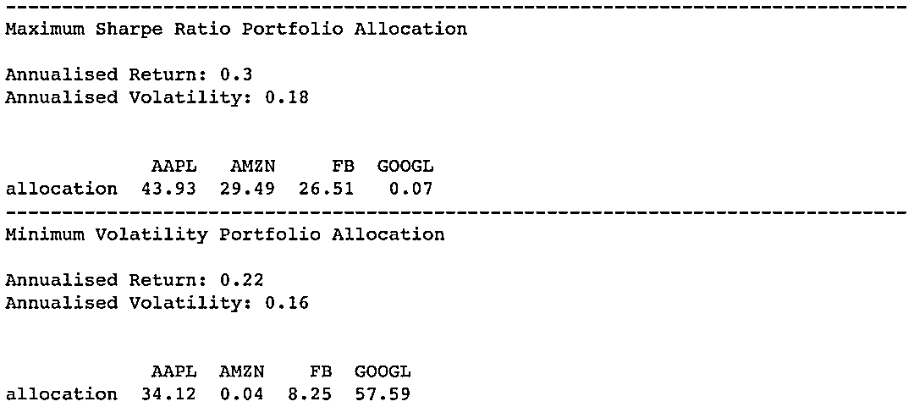

# 【进阶】实现最优投资组合有效前沿基于 Python（附代码）

> 原文：[`mp.weixin.qq.com/s?__biz=MzAxNTc0Mjg0Mg==&mid=2653289609&idx=1&sn=c7f0b3e47025862d10bb53b6ab88bcda&chksm=802e3e9cb759b78abf6b8b049c59bf18ccfb2ead7580d1f557d36de2292f59dcbd94dcd41910&scene=27#wechat_redirect`](http://mp.weixin.qq.com/s?__biz=MzAxNTc0Mjg0Mg==&mid=2653289609&idx=1&sn=c7f0b3e47025862d10bb53b6ab88bcda&chksm=802e3e9cb759b78abf6b8b049c59bf18ccfb2ead7580d1f557d36de2292f59dcbd94dcd41910&scene=27#wechat_redirect)


本期作者：The Rickest Ricky

本期翻译：Leti

**未经授权，严禁转载**

**现代投资组合理论**

良好的投资组合不仅仅是一长串的优质股票和债券。这是一个平衡的整体，为投资者提供各种突发事件方面的保护和机会。——哈里·马克维茨

“现代投资组合理论”（MPT）是 1952 年哈里.马克维茨在金融期刊上发表的名为“Portfolio Selection”的文章上提出的投资理论。


这里有一些帮助你理解 MPT 的基本概念。如果你对金融有一定的了解，你也许知道缩写“TANSTAAFL”代表什么意思。这是“天下没有免费午餐”（ “There Ain’t No Such Thing As A Free Lunch”.）的缩写。这与“风险与收益权衡”这一概念也非常相似。

高风险通常意味着高回报，低风险带来低回报的可能性也更大。MPT 假设投资者是风险中性的，这意味着有两个回报相同的投资组合，投资者们会倾向风险更低的投资组合。因此，如果存在高回报，投资者才会选择高风险的投资组合。

影响现代投资组合的另一个因素是“多样性”。现代投资组合理论提到，对于一一只特定股票，如果我们仅仅只关注到它的风险与回报是不够的。一个投资者可以通过投资多只股票，从其多样性中获利。主要是因为从中可以减少投资组合的风险。

我们需要明白的是，虽然在一个投资组合的收益为所有股票收益的平均值/加权平均值，但这个投资组合的风险不等于投资组合里所有股票风险的平均值/加权平均值。风险就是指一个资产的变化情况，如果在你的投资组合里有多只股票，那么你就需要计算一下这些股票之间变化的相关性。多样性的好处在于，你可以通过优化资产配置，使得该投资组合的风险低于投资组合中风险最低的股票的风险。

接下来介绍一下我是如何用 python 进行实际操作的：

```py
import pandas as pd  
import numpy as np
import matplotlib.pyplot as plt
import seaborn as sns
import quandl
import scipy.optimize as sco

plt.style.use('fivethirtyeight')
np.random.seed(777)

%matplotlib inline
%config InlineBackend.figure_format = 'retina'
```

要运行下面的这些代码，你需要使用你自己的 API key。在这篇文章里我选择了苹果，亚马逊，谷歌，脸书这几家公司的股票从 2016 年 1 月 1 日到 2017 年 12 月 31 日（共两年）调整后的收盘价。

```py
quandl.ApiConfig.api_key = 'your_api_key_here'
stocks = ['AAPL','AMZN','GOOGL','FB']
data = quandl.get_table('WIKI/PRICES', ticker = stocks,
                        qopts = { 'columns': ['date', 'ticker', 'adj_close'] },
                        date = { 'gte': '2016-1-1', 'lte': '2017-12-31' }, paginate=True)
data.head()
```


```py
data.info()
```

```py
<class 'pandas.core.frame.DataFrame'>
RangeIndex: 2006 entries, 0 to 2005
Data columns (total 3 columns):
date         2006 non-null datetime64[ns]
ticker       2006 non-null object
adj_close    2006 non-null float64
dtypes: datetime64ns, float64(1), object(1)
memory usage: 47.1+ KB
```

通过 info()函数可以看到，我们读取的数据已经是数据框格式了。我们还能对其进行一定的处理，以便后续的分析。

```py
df = data.set_index('date')
table = df.pivot(columns='ticker')
table.columns = [col[1] for col in table.columns]
table.head()
```


现在数据格式已整理好。首先我们看一下股票价格如何随着时间变动。

```py
plt.figure(figsize=(14, 7))
for c in table.columns.values:
    plt.plot(table.index, table[c], lw=3, alpha=0.8,label=c)
plt.legend(loc='upper left', fontsize=12)
plt.ylabel('price in $')
```


从图中可以看出，亚马逊和谷歌的股票价格比脸书和苹果的股票价格要高。由于图中脸书和苹果两只股票在底部，很难看出这两只股票价格的变动。

另外一种方法就是画出日收益图（即与前一天相比发生变化的百分比）。通过日收益图，我们更容易看出股票价格的变动情况。

```py
returns = table.pct_change()

plt.figure(figsize=(14, 7))
for c in returns.columns.values:
    plt.plot(returns.index, returns[c], lw=3, alpha=0.8,label=c)
plt.legend(loc='upper right', fontsize=12)
plt.ylabel('daily returns')
```


亚马逊有两处明显的高峰值以及几处低峰值。脸书有一处则达到了两年内四家公司的最高值。同时苹果也存在一些峰值。从上图我们可以粗略地看出，这四只股票当中，亚马逊的风险最大，而谷歌则较为稳定。

**随机生成投资组合**

目前我们有四只股票，那么在投资组合里我们应该如何对这四只股票进行资产配置呢？如果我们的资金为 1，那么我们要对每只股票赋以相应的权重，使得权重加起来为 1 。那么我们的资金就可以以相应的权重划分给特定的股票。例如，若亚马逊的权重为 0.5，意味着我们资金的 50%会分配给亚马逊这只股票。 

接下来我们可以定义一些函数，来对投资组合里的每只股票生成随机权重。那么就可以计算出投资组合每年的收益和波动性。

“portfolio_annualised_performance”函数可以计算年收益率和波动性（一年以 252 个交易日计算）。”random_portfolios”函数可以随机生成每一只股票权重从而产生不同的投资组合。通过调整 num_portfoios 参数，你可以随机生成 num_portfolios 个不同的投资组合。

```py
def portfolio_annualised_performance(weights, mean_returns, cov_matrix):
    returns = np.sum(mean_returns*weights ) *252
    std = np.sqrt(np.dot(weights.T, np.dot(cov_matrix, weights))) * np.sqrt(252)
    return std, returns

def random_portfolios(num_portfolios, mean_returns, cov_matrix, risk_free_rate):
    results = np.zeros((3,num_portfolios))
    weights_record = []
    for i in xrange(num_portfolios):
        weights = np.random.random(4)
        weights /= np.sum(weights)
        weights_record.append(weights)
        portfolio_std_dev, portfolio_return = portfolio_annualised_performance(weights, mean_returns, cov_matrix)
        results[0,i] = portfolio_std_dev
        results[1,i] = portfolio_return
        results[2,i] = (portfolio_return - risk_free_rate) / portfolio_std_dev
    return results, weights_record
```

关于上面的代码，我想指出两点。

**投资组合的标准差**

第一是关于”portfolio_annualised_performance”函数中投资组合的波动性。如果你搜索投资组合标准差的公式，你会看到以下这条公式。


如果使用矩阵形式，可以简化这条公式。在文章开头我提到的 Bernard Brenyah 他的博客中给出了如何将上面公式转化为矩阵形式，使其表达更简洁。


上面的矩阵形式，只是根号里的式子，因此我们需要对其开平方根。与年收益率一样，我将用一年 252 个交易日的数据来计算一个投资组合的年标准差。

**夏普比率**

其次我想说的是夏普比率。要了解夏普比率，首先要了解风险调整回报率的广泛概念。风险调整回报率通过衡量有多少风险可以产生回报来定义投资回报，这通常用比率或数字来表示。用于表示风险调整回报率的方式有很多，夏普比率就是其中一种。

夏普比率是在 1966 年由 Willian Sharpe 提出的，他也是经济学诺贝尔奖的获得者。


该比率描述了您为持有风险较高的资产所承受的额外波动所收到的超额收益率。夏普比率可用如下式子表示。


对于夏普比率将回报率标准差作为分母，并且假设收益率是服从正态分布的，目前还存在一些争议。但是，很多情况下，金融资产的收益通常都是偏离正态分布的，这可能会使得大家对夏普比率存在误解。因此，也有很多其它的方法用于调整或修改原始的夏普指数，但在这里我们就不细说了，我还是继续沿用最原始的夏普指数。

那么，我们开始定义一些我们的函数所要用到的参数。在数据框上使用 pct_change()函数可以很容易就可以得到每天的回报。此外，平均日回报率及回报率的协方差矩阵则需要通过计算投资组合的回报和波动得出。我们将会生成 25000 个随机的投资组合。最后，从 U.S.Department of  The Treasury（https://www.treasury.gov/resource-center/data-chart-center/interest-rates/Pages/TextView.aspx?data=billrates）中得到无风险利率。1.78%的无风险利率是在 2018 年初的 52 周的国库券利率。使用这一利率的合理之处在于，我们的历史数据是从 2016 年到 2017 年的，那么如果我在 2018 年的开始进行这项分析，最新的国库券利率就是从 2018i 年开始的。同时我也会选择 52 周的国库券利率来与我计算的年收益率和风险相匹配。

```py
returns = table.pct_change()
mean_returns = returns.mean()
cov_matrix = returns.cov()
num_portfolios = 25000
risk_free_rate = 0.0178
```

下面我简要地介绍一下以下函数的作用。首先，它生成一些随机的投资组合并得到相应的结果（投资组合的回报、波动性和夏普比率）以及每个投资组合里对应的权重。然后，找到夏普比率最高的投资组合，并用红星将夏普比率最高的投资组合标记起来。同时找出波动性最小的投资组合，并将其用绿色的星星标记起来。最后，将所有随机生成的投资组合的夏普比率用 color map 画出来。颜色越蓝，则代表夏普比率越高。

对于星标出来的两个最优投资组合，这个函数还会给出对应投资组合的资产配置情况。

```py
def display_simulated_ef_with_random(mean_returns, cov_matrix, num_portfolios, risk_free_rate):
    results, weights = random_portfolios(num_portfolios,mean_returns, cov_matrix, risk_free_rate)

    max_sharpe_idx = np.argmax(results[2])
    sdp, rp = results[0,max_sharpe_idx], results[1,max_sharpe_idx]
    max_sharpe_allocation = pd.DataFrame(weights[max_sharpe_idx],index=table.columns,columns=['allocation'])
    max_sharpe_allocation.allocation = [round(i*100,2)for i in max_sharpe_allocation.allocation]
    max_sharpe_allocation = max_sharpe_allocation.T

    min_vol_idx = np.argmin(results[0])
    sdp_min, rp_min = results[0,min_vol_idx], results[1,min_vol_idx]
    min_vol_allocation = pd.DataFrame(weights[min_vol_idx],index=table.columns,columns=['allocation'])
    min_vol_allocation.allocation = [round(i*100,2)for i in min_vol_allocation.allocation]
    min_vol_allocation = min_vol_allocation.T

    print "-"*80
    print "Maximum Sharpe Ratio Portfolio Allocation\n"
    print "Annualised Return:", round(rp,2)
    print "Annualised Volatility:", round(sdp,2)
    print "\n"
    print max_sharpe_allocation
    print "-"*80
    print "Minimum Volatility Portfolio Allocation\n"
    print "Annualised Return:", round(rp_min,2)
    print "Annualised Volatility:", round(sdp_min,2)
    print "\n"
    print min_vol_allocation

    plt.figure(figsize=(10, 7))
    plt.scatter(results[0,:],results[1,:],c=results[2,:],cmap='YlGnBu', marker='o', s=10, alpha=0.3)
    plt.colorbar()
    plt.scatter(sdp,rp,marker='*',color='r',s=500, label='Maximum Sharpe ratio')
    plt.scatter(sdp_min,rp_min,marker='*',color='g',s=500, label='Minimum volatility')
    plt.title('Simulated Portfolio Optimization based on Efficient Frontier')
    plt.xlabel('annualised volatility')
    plt.ylabel('annualised returns')
    plt.legend(labelspacing=0.8)
```

```py
display_simulated_ef_with_random(mean_returns, cov_matrix, num_portfolios, risk_free_rate)
```




对于风险最低的投资组合，其中资产超过一半被分配给谷歌。如果直接看股票的日收益图，也能发现四只股票中谷歌的波动率是最小的，那么从直觉上看给谷歌分配大比例资产即能使投资组合的风险最低。

如果我们想要以高风险来获得高回报，那么最大的夏普比率就能得到最好的风险调整回报率。在这种情况下，我们将资产大部分分配给亚马逊和脸书这两个波动率较大的股票。在风险最低的投资组合中，谷歌被分配到超过 50%的资产，而在夏普比率最高的投资组合中，只分配到了不到 1%的资产。

**有效前沿**

从随机生成的投资组合图中可以看出，蓝点聚集到一起在顶部形成了一条曲线。这条线就叫做有效前沿。为什么称之为有效呢？因为对于给定的回报，在这条线上的点的风险最低，而在这条线右边的点的风险都会比线上的高。如果期望收益率相同，当有一个风险较低的期权时，我们就没有必要去冒额外的风险了。

上面我们是通过随机生成各种可能的投资组合并从中找到最优的（最小化风险或最大化风险调整回报率）。我们也可以直接使用 Scipy 的优化函数。

如果你之前使用 Excel，你可能会知道 excel 里的‘solver’函数。当解决最优化问题即约束和界限问题时，Scipy 的优化函数与 excel 的 solver 函数的功能类似。

下面的函数是用于获得夏普比率最大的投资组合的。在 Scipy 的优化函数中，没有“最大化”的功能，因此作为一个目标函数，需要找到被最小化的变量值。这就是为什么要先定义“neg_sharpe_ratio”这个函数来计算负的夏普比率。那么就可以使用这个目标函数来计算最小的夏普比率了。在”max_sharpe_ratio”函数中，首先要定义一个参数（在这里应该是“weights”，而不是其它参数）。由于函数表达的问题，约束的构造对我来说有一点难理解。

```py
constraints = ({‘type’: ‘eq’, ‘fun’: lambda x: np.sum(x) — 1})
```

上面的约束是说，x 的总和应该等于 1 。 你可以把‘fun’参数里的 1 想象成它本来在等号的右边，现在被移到了等号的左边。

np.sum(x) = = 1 变成 np.sum(x) - 1

这是什么意思呢？意思就是所有权重加总的和应该等于 1 。你不能分配超过 100%的资产。

“bounds”是另一个设置随机权重的参数，它将权重限制在 0 到 1 之间。因为我们无法为股票分配负资产也不能分配超过 100%的资产。

```py
def neg_sharpe_ratio(weights, mean_returns, cov_matrix, risk_free_rate):
    p_var, p_ret = portfolio_annualised_performance(weights, mean_returns, cov_matrix)
    return -(p_ret - risk_free_rate) / p_var

def max_sharpe_ratio(mean_returns, cov_matrix, risk_free_rate):
    num_assets = len(mean_returns)
    args = (mean_returns, cov_matrix, risk_free_rate)
    constraints = ({'type': 'eq', 'fun': lambda x: np.sum(x) - 1})
    bound = (0.0,1.0)
    bounds = tuple(bound for asset in range(num_assets))
    result = sco.minimize(neg_sharpe_ratio, num_assets*[1./num_assets,], args=args,
                        method='SLSQP', bounds=bounds, constraints=constraints)
    return result
```

我们也可以定义一个优化函数来计算波动率最小的投资组合。这次确实是最小化目标函数。那么我们需要最小化的是什么呢？我们想要通过调整不同的权重来找到最小的波动率。“constraints”和“bounds”参数和上面相同。

```py
def portfolio_volatility(weights, mean_returns, cov_matrix):
    return portfolio_annualised_performance(weights, mean_returns, cov_matrix)[0]

def min_variance(mean_returns, cov_matrix):
    num_assets = len(mean_returns)
    args = (mean_returns, cov_matrix)
    constraints = ({'type': 'eq', 'fun': lambda x: np.sum(x) - 1})
    bound = (0.0,1.0)
    bounds = tuple(bound for asset in range(num_assets))

    result = sco.minimize(portfolio_volatility, num_assets*[1./num_assets,], args=args,
                        method='SLSQP', bounds=bounds, constraints=constraints)

    return result
```

正如我上面已经提到的，我们还可以绘制一条线来描述给定波动率的有效投资组合的位置。即“有效前沿”。接下来我会定义其它函数来计算有效前沿。第一个函数是“efficient_return‘，用于计算给定回报的最有效投资组合。第二个函数是”efficent_frontier”，用于计算一系列目标回报并计算每个回报对应的有效投资组合。

```py
def efficient_return(mean_returns, cov_matrix, target):
    num_assets = len(mean_returns)
    args = (mean_returns, cov_matrix)

    def portfolio_return(weights):
        return portfolio_annualised_performance(weights, mean_returns, cov_matrix)[1]

    constraints = ({'type': 'eq', 'fun': lambda x: portfolio_return(x) - target},
                   {'type': 'eq', 'fun': lambda x: np.sum(x) - 1})
    bounds = tuple((0,1) for asset in range(num_assets))
    result = sco.minimize(portfolio_volatility, num_assets*[1./num_assets,], args=args, method='SLSQP', bounds=bounds, constraints=constraints)
    return result

def efficient_frontier(mean_returns, cov_matrix, returns_range):
    efficients = []
    for ret in returns_range:
        efficients.append(efficient_return(mean_returns, cov_matrix, ret))
    return efficients
```

接下来使用所有随机生成的投资组合绘制具有最大夏普比率和最小波动率的投资组合选择。但是这次我们不从随机生成的投资组合中选择最优投资组合，而是使用 Scipy 的‘minimize’函数进行计算的。以下函数也会同时绘制出有效前沿曲线。

```py
def display_calculated_ef_with_random(mean_returns, cov_matrix, num_portfolios, risk_free_rate):
    results, _ = random_portfolios(num_portfolios,mean_returns, cov_matrix, risk_free_rate)

    max_sharpe = max_sharpe_ratio(mean_returns, cov_matrix, risk_free_rate)
    sdp, rp = portfolio_annualised_performance(max_sharpe['x'], mean_returns, cov_matrix)
    max_sharpe_allocation = pd.DataFrame(max_sharpe.x,index=table.columns,columns=['allocation'])
    max_sharpe_allocation.allocation = [round(i*100,2)for i in max_sharpe_allocation.allocation]
    max_sharpe_allocation = max_sharpe_allocation.T
    max_sharpe_allocation

    min_vol = min_variance(mean_returns, cov_matrix)
    sdp_min, rp_min = portfolio_annualised_performance(min_vol['x'], mean_returns, cov_matrix)
    min_vol_allocation = pd.DataFrame(min_vol.x,index=table.columns,columns=['allocation'])
    min_vol_allocation.allocation = [round(i*100,2)for i in min_vol_allocation.allocation]
    min_vol_allocation = min_vol_allocation.T

    print "-"*80
    print "Maximum Sharpe Ratio Portfolio Allocation\n"
    print "Annualised Return:", round(rp,2)
    print "Annualised Volatility:", round(sdp,2)
    print "\n"
    print max_sharpe_allocation
    print "-"*80
    print "Minimum Volatility Portfolio Allocation\n"
    print "Annualised Return:", round(rp_min,2)
    print "Annualised Volatility:", round(sdp_min,2)
    print "\n"
    print min_vol_allocation

    plt.figure(figsize=(10, 7))
    plt.scatter(results[0,:],results[1,:],c=results[2,:],cmap='YlGnBu', marker='o', s=10, alpha=0.3)
    plt.colorbar()
    plt.scatter(sdp,rp,marker='*',color='r',s=500, label='Maximum Sharpe ratio')
    plt.scatter(sdp_min,rp_min,marker='*',color='g',s=500, label='Minimum volatility')

    target = np.linspace(rp_min, 0.32, 50)
    efficient_portfolios = efficient_frontier(mean_returns, cov_matrix, target)
    plt.plot([p['fun'] for p in efficient_portfolios], target, linestyle='-.', color='black', label='efficient frontier')
    plt.title('Calculated Portfolio Optimization based on Efficient Frontier')
    plt.xlabel('annualised volatility')
    plt.ylabel('annualised returns')
    plt.legend(labelspacing=0.8)

display_calculated_ef_with_random(mean_returns, cov_matrix, num_portfolios, risk_free_rate)
```


我们得到的结果几乎与随机生成投资组合中得到的结果相同。最大的不同是 Scipy 的”optimize”函数在最大夏普比率的投资组合中没有给谷歌分配资产，而在随机生成的投资组合中最大夏普比率的投资组合中谷歌被分到了 0.45%的资产。其它在小数位上有一些差异，但绝大部分都基本相同。

除了可以绘制每个随机生成的投资组合，我们还可以绘制每个对应的年收益率值和年度风险。这样我们可以看到多样性是如何随着资产配置的优化不断降低的。

```py
def display_ef_with_selected(mean_returns, cov_matrix, risk_free_rate):
    max_sharpe = max_sharpe_ratio(mean_returns, cov_matrix, risk_free_rate)
    sdp, rp = portfolio_annualised_performance(max_sharpe['x'], mean_returns, cov_matrix)
    max_sharpe_allocation = pd.DataFrame(max_sharpe.x,index=table.columns,columns=['allocation'])
    max_sharpe_allocation.allocation = [round(i*100,2)for i in max_sharpe_allocation.allocation]
    max_sharpe_allocation = max_sharpe_allocation.T
    max_sharpe_allocation

    min_vol = min_variance(mean_returns, cov_matrix)
    sdp_min, rp_min = portfolio_annualised_performance(min_vol['x'], mean_returns, cov_matrix)
    min_vol_allocation = pd.DataFrame(min_vol.x,index=table.columns,columns=['allocation'])
    min_vol_allocation.allocation = [round(i*100,2)for i in min_vol_allocation.allocation]
    min_vol_allocation = min_vol_allocation.T

    an_vol = np.std(returns) * np.sqrt(252)
    an_rt = mean_returns * 252

    print "-"*80
    print "Maximum Sharpe Ratio Portfolio Allocation\n"
    print "Annualised Return:", round(rp,2)
    print "Annualised Volatility:", round(sdp,2)
    print "\n"
    print max_sharpe_allocation
    print "-"*80
    print "Minimum Volatility Portfolio Allocation\n"
    print "Annualised Return:", round(rp_min,2)
    print "Annualised Volatility:", round(sdp_min,2)
    print "\n"
    print min_vol_allocation
    print "-"*80
    print "Individual Stock Returns and Volatility\n"
    for i, txt in enumerate(table.columns):
        print txt,":","annuaised return",round(an_rt[i],2),", annualised volatility:",round(an_vol[i],2)
    print "-"*80

    fig, ax = plt.subplots(figsize=(10, 7))
    ax.scatter(an_vol,an_rt,marker='o',s=200)

    for i, txt in enumerate(table.columns):
        ax.annotate(txt, (an_vol[i],an_rt[i]), xytext=(10,0), textcoords='offset points')
    ax.scatter(sdp,rp,marker='*',color='r',s=500, label='Maximum Sharpe ratio')
    ax.scatter(sdp_min,rp_min,marker='*',color='g',s=500, label='Minimum volatility')

    target = np.linspace(rp_min, 0.34, 50)
    efficient_portfolios = efficient_frontier(mean_returns, cov_matrix, target)
    ax.plot([p['fun'] for p in efficient_portfolios], target, linestyle='-.', color='black', label='efficient frontier')
    ax.set_title('Portfolio Optimization with Individual Stocks')
    ax.set_xlabel('annualised volatility')
    ax.set_ylabel('annualised returns')
    ax.legend(labelspacing=0.8)

display_ef_with_selected(mean_returns, cov_matrix, risk_free_rate)
```


由图可知，风险最低的股票是谷歌，大概为 0.18 。但在最优投资组合中，最低的风险可以达到 0.16 ，并且比谷歌有更高的回报率。如果我们能够接受比谷歌高一点的风险，在最优投资组合下能得到 0.30 的回报率。

**坚持每天学习，并且在每完成一次实操，你会觉得今天的我肯定会比昨天的我更优秀。**

**推荐阅读**

[01、经过多年交易之后你应该学到的东西（深度分享）](https://mp.weixin.qq.com/s?__biz=MzAxNTc0Mjg0Mg==&mid=2653289074&idx=1&sn=e859d363eef9249236244466a1af41b6&chksm=802e3867b759b1717f77e07a51ee5671e8115130c66562577280ba1243cba08218add04f1f00&token=449379994&lang=zh_CN&scene=21#wechat_redirect)

[02、监督学习标签在股市中的应用（代码+书籍）](https://mp.weixin.qq.com/s?__biz=MzAxNTc0Mjg0Mg==&mid=2653289050&idx=1&sn=60043a5c95b877dd329a5fd150ddacc4&chksm=802e384fb759b1598e500087374772059aa21b31ae104b3dca04331cf4b63a233c5e04c1945a&token=449379994&lang=zh_CN&scene=21#wechat_redirect)

[03、全球投行顶尖机器学习团队全面分析](https://mp.weixin.qq.com/s?__biz=MzAxNTc0Mjg0Mg==&mid=2653289018&idx=1&sn=8c411f676c2c0d92b0dd218f041bee4b&chksm=802e382fb759b139ffebf633ac14cdd0f21938e4613fe632d5d9231dab3d2aca95a11628378a&token=449379994&lang=zh_CN&scene=21#wechat_redirect)

[04、使用 Tensorflow 预测股票市场变动](https://mp.weixin.qq.com/s?__biz=MzAxNTc0Mjg0Mg==&mid=2653289014&idx=1&sn=3762d405e332c599a21b48a7dc4df587&chksm=802e3823b759b135928d55044c2729aea9690f86752b680eb973d1a376dc53cfa18287d0060b&token=449379994&lang=zh_CN&scene=21#wechat_redirect)

[05、使用 LSTM 预测股票市场基于 Tensorflow](https://mp.weixin.qq.com/s?__biz=MzAxNTc0Mjg0Mg==&mid=2653289238&idx=1&sn=3144f5792f84455dd53c27a78e8a316c&chksm=802e3903b759b015da88acde4fcbc8547ab3e6acbb5a0897404bbefe1d8a414265d5d5766ee4&token=2020206794&lang=zh_CN&scene=21#wechat_redirect)

[06、美丽的回测——教你定量计算过拟合概率](https://mp.weixin.qq.com/s?__biz=MzAxNTc0Mjg0Mg==&mid=2653289314&idx=1&sn=87c5a12b23a875966db7be50d11f09cd&chksm=802e3977b759b061675d1988168c1fec06c602e8583fbcc9b76f87008e0c10b702acc85467a0&token=1972390229&lang=zh_CN&scene=21#wechat_redirect)

[07、利用动态深度学习预测金融时间序列基于 Python](https://mp.weixin.qq.com/s?__biz=MzAxNTc0Mjg0Mg==&mid=2653289347&idx=1&sn=bf5d7899bc4a854d4ba9046fdc6fe0d6&chksm=802e3996b759b080287213840987bb0a0c02e4e1d4d7aae23f10a225a92ef6dd922d8006123d&token=290397496&lang=zh_CN&scene=21#wechat_redirect)

[08、Facebook 开源神器 Prophet 预测时间序列基于 Python](https://mp.weixin.qq.com/s?__biz=MzAxNTc0Mjg0Mg==&mid=2653289394&idx=1&sn=24a836136d730aa268605628e683d629&chksm=802e39a7b759b0b1dcf7aaa560699130a907716b71fc9c45ff0e5d236c5ae8ef80ebdb09dbb6&token=290397496&lang=zh_CN&scene=21#wechat_redirect)

[09、Facebook 开源神器 Prophet 预测股市行情基于 Python](https://mp.weixin.qq.com/s?__biz=MzAxNTc0Mjg0Mg==&mid=2653289437&idx=1&sn=f0dca7da8e69e7ba736992cb3d034ce7&chksm=802e39c8b759b0de5bce401c580623d0729ecca69d13926479d36e19aff8c9c9e8a20265afff&token=290397496&lang=zh_CN&scene=21#wechat_redirect)

[10、2018 第三季度最受欢迎的券商金工研报前 50（附下载）](https://mp.weixin.qq.com/s?__biz=MzAxNTc0Mjg0Mg==&mid=2653289358&idx=1&sn=db6e8ab85b08f6e67790ec0e401e586e&chksm=802e399bb759b08d6eec855f9901ea856d0da68c7425cba62791b8948da6ad761a3d88543dad&token=290397496&lang=zh_CN&scene=21#wechat_redirect)

[11、实战交易策略的精髓（公众号深度呈现）](https://mp.weixin.qq.com/s?__biz=MzAxNTc0Mjg0Mg==&mid=2653289447&idx=1&sn=f2948715bf82569a6556d518e56c1f9e&chksm=802e39f2b759b0e4502d1aaac562b87789573b55c76b3c85897d8c9d88dbf9a0b7ee34d86a4e&token=290397496&lang=zh_CN&scene=21#wechat_redirect)

[**12、Markowitz 有效边界和投资组合优化基于 Python（相关文章）**](https://mp.weixin.qq.com/s?__biz=MzAxNTc0Mjg0Mg==&mid=2653289478&idx=1&sn=f8e01a641be021993d8ef2d84e94a299&chksm=802e3e13b759b7055cf27a280c672371008a5564c97c658eee89ce8481396a28d254836ff9af&token=290397496&lang=zh_CN&scene=21#wechat_redirect)

[13、使用 LSTM 模型预测股价基于 Keras](https://mp.weixin.qq.com/s?__biz=MzAxNTc0Mjg0Mg==&mid=2653289495&idx=1&sn=c4eeaa2e9f9c10995be9ea0c56d29ba7&chksm=802e3e02b759b7148227675c23c403fb9a543b733e3d27fa237b53840e030bf387a473d83e3c&token=1260956004&lang=zh_CN&scene=21#wechat_redirect)

[14、量化金融导论 1：资产收益的程式化介绍基于 Python](https://mp.weixin.qq.com/s?__biz=MzAxNTc0Mjg0Mg==&mid=2653289507&idx=1&sn=f0ca71aa07531bbbdbd33213f0bab89f&chksm=802e3e36b759b720138b3b17a4dd0e198e054b9de29a038fdd50805f824effa55831111ad026&token=1936245282&lang=zh_CN&scene=21#wechat_redirect)

[15、预测股市崩盘基于统计机器学习与神经网络（Python+文档）](https://mp.weixin.qq.com/s?__biz=MzAxNTc0Mjg0Mg==&mid=2653289533&idx=1&sn=4ef964834e84a9995111bb057b0fc5dd&chksm=802e3e28b759b73e0618eb1262c53aa0601fbf5805525a7c7ff40dc3db62c7704496611bdbf1&token=1950551577&lang=zh_CN&scene=21#wechat_redirect)

**公众号官方 QQ 群**

**群里已经分享了****60 篇****干货**

**量化、技术人士实名制交流**

**没有按规则加群者一律忽略**

