# 深度 | 在 R 中估计 GARCH 参数存在的问题

> 原文：[`mp.weixin.qq.com/s?__biz=MzAxNTc0Mjg0Mg==&mid=2653289590&idx=1&sn=e3f3074c67558697a0f7ae3e806ff55f&chksm=802e3e63b759b7755b79a0d8eab4a62a5bac25845810504a0473d2f94890ef44f0fb25b331eb&scene=27#wechat_redirect`](http://mp.weixin.qq.com/s?__biz=MzAxNTc0Mjg0Mg==&mid=2653289590&idx=1&sn=e3f3074c67558697a0f7ae3e806ff55f&chksm=802e3e63b759b7755b79a0d8eab4a62a5bac25845810504a0473d2f94890ef44f0fb25b331eb&scene=27#wechat_redirect)


本期作者：徐瑞龙

**未经授权，严禁转载**

本文翻译自***《Problems In Estimating GARCH Parameters in R 》***

原文链接：

*https://ntguardian.wordpress.com/2017/11/02/problems-estimating-garch-parameters-r/*

源代码：点击**阅读原文**

我从 R 的金融板块邮件列表收到一位知名金融工具包贡献者——Brian Peterson 的邮件：

我强烈建议关注 **rugarch** 和 **rmgarc****h**。RMetrics 序列包的主要维护者 Diethelm Wuertz 在 2016 年死于车祸，目前的代码基本处于无维护状态。

我会看看这是否解决了这个问题。谢谢 Brian！我把这篇帖子留给其他人，作为将来避免使用 gGarch 的告诫。这对我来说是个新闻，因为书籍经常引用 fGarch，所以这可能是那些寻求在 R 中使用 GARCH 模型的人的资源——为什么不要使用 fGarch。

我用 rugarch 进行了一次快速实验，看起来它同样被这个问题困扰。下面是我运行的代码，我会尽快在明天贴出一份全面的研究。

```py
library(rugarch)

spec = ugarchspec(
    variance.model = list(garchOrder = c(1, 1)),
    mean.model = list(
        armaOrder = c(0, 0), include.mean = FALSE),
    fixed.pars = list(
        alpha1 = 0.2, beta1 = 0.2, omega = 0.2))
ugarchpath(
    spec = spec, n.sim = 1000, n.start = 1000) -> x
srs = x@path$seriesSim
spec1 = ugarchspec(
    variance.model = list(garchOrder = c(1, 1)),
    mean.model = list(
        armaOrder = c(0, 0), include.mean = FALSE))
ugarchfit(spec = spec1, data = srs)
ugarchfit(spec = spec1, data = srs[1:100])
```

这些天我的研究重点是变点检测方法。这些是用于检测数据序列中出现结构性变化的统计检验和过程。来自质量控制的早期示例是在生产小部件时检测机器是否未校准。可能存在一些感兴趣的测量值，例如我们观察到的滚珠轴承的直径。机器按顺序生成这些小部件。在原假设下，滚珠轴承的平均直径不会改变，而在备择假设中，在制造过程中的某些未知点处，机器变得未校准并且滚珠轴承的平均直径发生变化。然后，检验在这两个假设之间做出决定。

这些类型的检验对经济学家和金融业工作者也很重要，特别是对于预测。我们再次使用按时间索引的序列数据，我首选的例子是股票的价格，在给出了股票的常见时间序列图，人们可以立即将其识别为时间序列，但还有更多的数据集，如州的 GDP 或失业率。经济学家希望使用过去的数据和统计量预测这些数量。统计方法的一个假设是要预测的序列是平稳的：数据的产生过程具有单一的均值、自相关性、分布等。这个假设并不总是经过检验，但对成功的预测至关重要。结构性变化的检验检查了这个假设，如果结果是假的，预测者可能需要在训练他们的模型时分割他们的数据集。

我之前写过关于这些检验的文章，介绍了 CUSUM 统计量，这是检测结构性变化的最流行的统计量。我的导师和他以前的博士生（Greg Rice，目前是滑铁卢大学的教授）开发了一个新的检验统计量，可以更好地检测数据集中早期或晚期发生的结构性变化（想象一下，制作小部件的机器几乎没有被校准，一百个小部件中只有最后一打样本受到影响）。我们提交论文的期刊正在要求我们进行修订，其中一个修订是更好的示例应用（我们最初使用上述博客文章中讨论的工资 / 生产率数据，审稿人抱怨这些变量是被相同因素决定的（codetermined），所以使用一个对另一个做回归没意义，我不同意这样的抱怨，但我不会在这里争论）。

我们希望将我们的检验应用于检测 GARCH 模型中的结构性变化，这是金融时间序列中的常见模型。据我所知，用于 GARCH 模型估计和推断（以及其他工作）的“最新技术” R 包是 **fGarch**。特别是，函数 garchFit() 用于从数据中估计 GARCH 模型。但是，当我们尝试在我们的检验中使用此函数时，我们得到了明显病态的数值（我们已经完成了模拟研究以了解预期的行为）。没有变化的原假设在模拟序列上被完全拒绝。我从未看到检验未能拒绝原假设，即使原假设总是对的。即使样本量为 10000，几乎不是小样本也是如此。

我们认为问题可能在于参数估计的协方差矩阵的估计，并且我煞费苦心地推导和编写函数以使该矩阵不使用数值微分，但这并没有阻止不良行为。最后我的导师和我上周三戏弄了 garchFit() 一把，并发现该函数应该受到责备。当我估计参数（不一定是我们最初认为的协方差矩阵，尽管它可能也被污染）时，函数对模拟数据的行为是如此不稳定，依我来看，该函数基本上是无用的。

这个函数应该是众所周知的，问题当然可能在于我，而不是 **fGarch**（或者可能有更好的包）。这个函数是如此重要，让我感到我应该分享我的发现。在这篇文章中，我展示了一序列数值实验，证明了 garchFit() 的病态行为。

## ‍‍‍‍

**A‍‍RCH 模型基础**

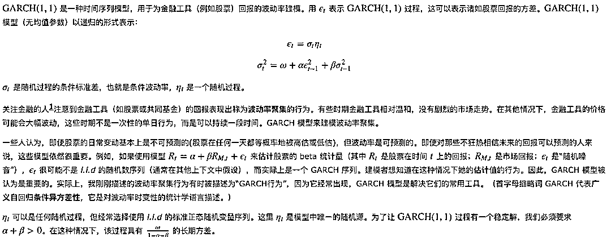

**估计 GARCH 参数**

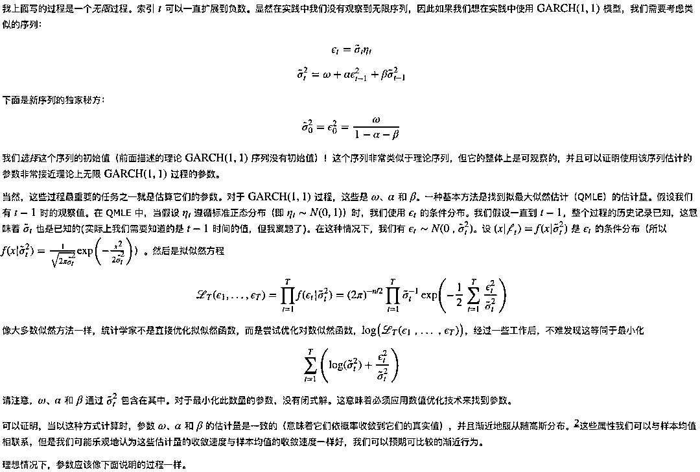

```py
`library(ggplot2)

x <- rnorm(1000, sd = 1/3)
df <- t(
    sapply(
        50:1000,
        function(t)
        {
            return(c("mean" = mean(x[1:t]), "mean.se" = sd(x[1:t])/sqrt(t)))
        }))

df <- as.data.frame(df)
df$t <- 50:1000

ggplot(
    df,
    aes(x = t, y = mean)) +
    geom_line() +
    geom_ribbon(
        aes(x = t, ymin = mean - 2 * mean.se, ymax = mean + 2 * mean.se),
        color = "grey", alpha = 0.5) +
    geom_hline(color = "blue", yintercept = 0) +
    coord_cartesian(ylim = c(-0.5, 0.5))`
```

<nobr aria-hidden="true">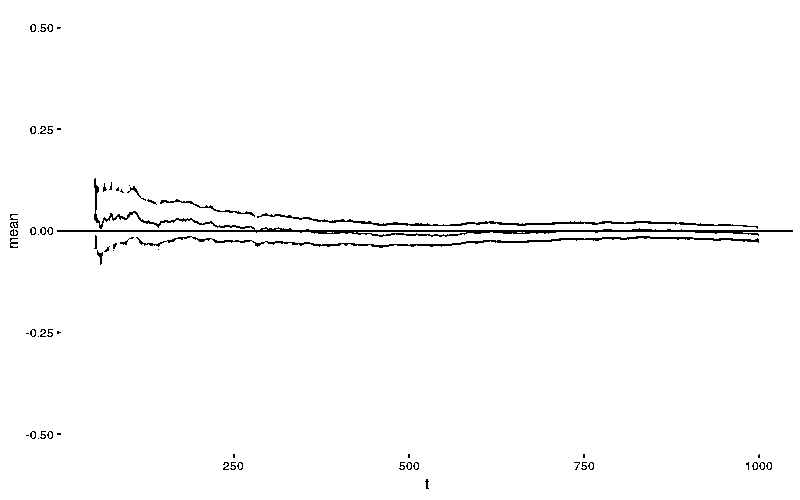</nobr>

## <nobr aria-hidden="true">**‍**‍‍‍‍‍‍‍</nobr>

<nobr aria-hidden="true">**fGarch 参数估计的行为**</nobr>

<nobr aria-hidden="true">在继续之前，让我们生成 </nobr><nobr aria-hidden="true"><mtext>GARCH</mtext><mo stretchy="false">(</mo><mn>1</mn><mo>,</mo><mn>1</mn><mo stretchy="false">)</mo> 序列。在本文中，我使用了所有参数都等于 0.2 的过程。注意，对于<mtext style="white-space: normal;">GARCH</mtext><mo stretchy="false" style="white-space: normal;">(</mo><mn style="white-space: normal;">1</mn><mo style="white-space: normal;">,</mo><mn style="white-space: normal;">1</mn><mo stretchy="false" style="white-space: normal;">)</mo>过程，长期方差将为 1/3。</nobr>

```py
`set.seed(110117)
library(fGarch)

x <- garchSim(
    garchSpec(
        model = list(
            "alpha" = 0.2, "beta" = 0.2, "omega" = 0.2)),
    n.start = 1000,
    n = 1000)

plot(x)`
```

<nobr aria-hidden="true">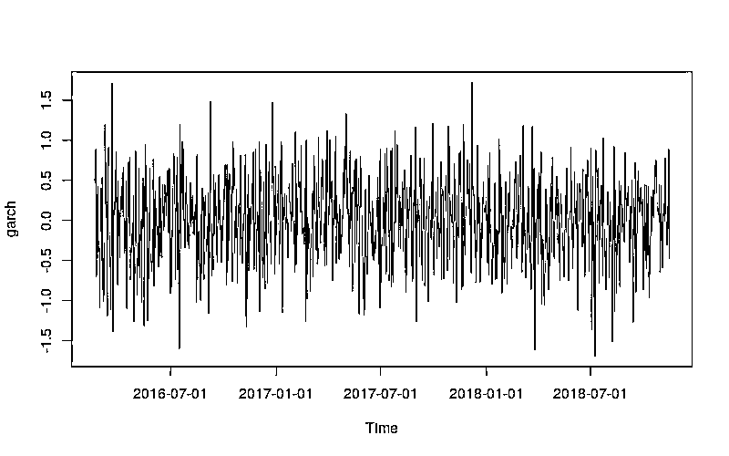</nobr>

<nobr aria-hidden="true">让我们看看 fGarch 的函数 garchFit() 所使用的参数。</nobr>

```py
<nobr aria-hidden="true">args(garchFit)

## function (formula = ~garch(1, 1), data = dem2gbp, init.rec = c("mci",
##     "uev"), delta = 2, skew = 1, shape = 4, cond.dist = c("norm",
##     "snorm", "ged", "sged", "std", "sstd", "snig", "QMLE"), include.mean = TRUE,
##     include.delta = NULL, include.skew = NULL, include.shape = NULL,
##     leverage = NULL, trace = TRUE, algorithm = c("nlminb", "lbfgsb",
##         "nlminb+nm", "lbfgsb+nm"), hessian = c("ropt", "rcd"),
##     control = list(), title = NULL, description = NULL, ...)
## NULL</nobr>
```

<nobr aria-hidden="true">该函数提供了一些选项，要最大化的分布（cond.dist）和用于优化的算法（algorithm）。除非另有说明，否则我将始终选择 cond.dist = QMLE 来指示函数使用 QMLE 估算器。</nobr>

<nobr aria-hidden="true">这是一次调用：</nobr>

```py
`garchFit(
    data = x, cond.dist = "QMLE", include.mean = FALSE)`
```

<nobr aria-hidden="true">‍‍</nobr>

```py
`##
## Series Initialization:
##  ARMA Model:                arma
##  Formula Mean:              ~ arma(0, 0)
##  GARCH Model:               garch
##  Formula Variance:          ~ garch(1, 1)
##  ARMA Order:                0 0
##  Max ARMA Order:            0
##  GARCH Order:               1 1
##  Max GARCH Order:           1
##  Maximum Order:             1
##  Conditional Dist:          QMLE
##  h.start:                   2
##  llh.start:                 1
##  Length of Series:          1000
##  Recursion Init:            mci
##  Series Scale:              0.5320977
##
## Parameter Initialization:
##  Initial Parameters:          $params
##  Limits of Transformations:   $U, $V
##  Which Parameters are Fixed?  $includes
##  Parameter Matrix:
##                      U          V params includes
##     mu     -0.15640604   0.156406    0.0    FALSE
##     omega   0.00000100 100.000000    0.1     TRUE
##     alpha1  0.00000001   1.000000    0.1     TRUE
##     gamma1 -0.99999999   1.000000    0.1    FALSE
##     beta1   0.00000001   1.000000    0.8     TRUE
##     delta   0.00000000   2.000000    2.0    FALSE
##     skew    0.10000000  10.000000    1.0    FALSE
##     shape   1.00000000  10.000000    4.0    FALSE
##  Index List of Parameters to be Optimized:
##  omega alpha1  beta1
##      2      3      5
##  Persistence:                  0.9
##
##
## --- START OF TRACE ---
## Selected Algorithm: nlminb
##
## R coded nlminb Solver:
##
##   0:     1419.0152: 0.100000 0.100000 0.800000
##   1:     1418.6616: 0.108486 0.0998447 0.804683
##   2:     1417.7139: 0.109746 0.0909961 0.800931
##   3:     1416.7807: 0.124977 0.0795152 0.804400
##   4:     1416.7215: 0.141355 0.0446605 0.799891
##   5:     1415.5139: 0.158059 0.0527601 0.794304
##   6:     1415.2330: 0.166344 0.0561552 0.777108
##   7:     1415.0415: 0.195230 0.0637737 0.743465
##   8:     1415.0031: 0.200862 0.0576220 0.740088
##   9:     1414.9585: 0.205990 0.0671331 0.724721
##  10:     1414.9298: 0.219985 0.0713468 0.712919
##  11:     1414.8226: 0.230628 0.0728325 0.697511
##  12:     1414.4689: 0.325750 0.0940514 0.583114
##  13:     1413.4560: 0.581449 0.143094 0.281070
##  14:     1413.2804: 0.659173 0.157127 0.189282
##  15:     1413.2136: 0.697840 0.155964 0.150319
##  16:     1413.1467: 0.720870 0.142550 0.137645
##  17:     1413.1416: 0.726527 0.138146 0.135966
##  18:     1413.1407: 0.728384 0.137960 0.134768
##  19:     1413.1392: 0.731725 0.138321 0.132991
##  20:     1413.1392: 0.731146 0.138558 0.133590
##  21:     1413.1392: 0.730849 0.138621 0.133850
##  22:     1413.1392: 0.730826 0.138622 0.133869
##
## Final Estimate of the Negative LLH:
##  LLH:  782.211    norm LLH:  0.782211
##     omega    alpha1     beta1
## 0.2069173 0.1386221 0.1338686
##
## R-optimhess Difference Approximated Hessian Matrix:
##            omega     alpha1      beta1
## omega  -8858.897 -1839.6144 -2491.9827
## alpha1 -1839.614  -782.8005  -531.7393
## beta1  -2491.983  -531.7393  -729.7246
## attr(,"time")
## Time difference of 0.04132652 secs
##
## --- END OF TRACE ---
##
##
## Time to Estimate Parameters:
##  Time difference of 0.3866439 secs
##
## Title:
##  GARCH Modelling
##
## Call:
##  garchFit(data = x, cond.dist = "QMLE", include.mean = FALSE)
##
## Mean and Variance Equation:
##  data ~ garch(1, 1)
## <environment: 0xa636ba4>
##  [data = x]
##
## Conditional Distribution:
##  QMLE
##
## Coefficient(s):
##   omega   alpha1    beta1  
## 0.20692  0.13862  0.13387  
##
## Std. Errors:
##  robust
##
## Error Analysis:
##         Estimate  Std. Error  t value Pr(>|t|)
## omega    0.20692     0.05102    4.056    5e-05 ***
## alpha1   0.13862     0.04928    2.813  0.00491 **
## beta1    0.13387     0.18170    0.737  0.46128
## ---
## Signif. codes:  0 '***' 0.001 '**' 0.01 '*' 0.05 '.' 0.1 ' ' 1
##
## Log Likelihood:
##  -782.211    normalized:  -0.782211
##
## Description:
##  Thu Nov  2 13:01:14 2017 by user:`
```

<nobr aria-hidden="true">参数不接近真实参数。人们可能最初将其归因于随机性，但事实似乎并非如此。</nobr>

<nobr aria-hidden="true">例如，当我在前 500 个数据点上拟合模型时，我能得到什么呢？</nobr>

```py
`garchFit(
    data = x[1:500], cond.dist = "QMLE", include.mean = FALSE)`
```

```py
`##
## Series Initialization:
##  ARMA Model:                arma
##  Formula Mean:              ~ arma(0, 0)
##  GARCH Model:               garch
##  Formula Variance:          ~ garch(1, 1)
##  ARMA Order:                0 0
##  Max ARMA Order:            0
##  GARCH Order:               1 1
##  Max GARCH Order:           1
##  Maximum Order:             1
##  Conditional Dist:          QMLE
##  h.start:                   2
##  llh.start:                 1
##  Length of Series:          500
##  Recursion Init:            mci
##  Series Scale:              0.5498649
##
## Parameter Initialization:
##  Initial Parameters:          $params
##  Limits of Transformations:   $U, $V
##  Which Parameters are Fixed?  $includes
##  Parameter Matrix:
##                      U           V params includes
##     mu     -0.33278068   0.3327807    0.0    FALSE
##     omega   0.00000100 100.0000000    0.1     TRUE
##     alpha1  0.00000001   1.0000000    0.1     TRUE
##     gamma1 -0.99999999   1.0000000    0.1    FALSE
##     beta1   0.00000001   1.0000000    0.8     TRUE
##     delta   0.00000000   2.0000000    2.0    FALSE
##     skew    0.10000000  10.0000000    1.0    FALSE
##     shape   1.00000000  10.0000000    4.0    FALSE
##  Index List of Parameters to be Optimized:
##  omega alpha1  beta1
##      2      3      5
##  Persistence:                  0.9
##
##
## --- START OF TRACE ---
## Selected Algorithm: nlminb
##
## R coded nlminb Solver:
##
##   0:     706.37230: 0.100000 0.100000 0.800000
##   1:     706.27437: 0.103977 0.100309 0.801115
##   2:     706.19091: 0.104824 0.0972295 0.798477
##   3:     706.03116: 0.112782 0.0950253 0.797812
##   4:     705.77389: 0.122615 0.0858136 0.788169
##   5:     705.57316: 0.134608 0.0913105 0.778144
##   6:     705.43424: 0.140011 0.0967118 0.763442
##   7:     705.19541: 0.162471 0.102711 0.739827
##   8:     705.16325: 0.166236 0.0931680 0.737563
##   9:     705.09943: 0.168962 0.100977 0.731085
##  10:     704.94924: 0.203874 0.0958205 0.702986
##  11:     704.78210: 0.223975 0.108606 0.664678
##  12:     704.67414: 0.250189 0.122959 0.630886
##  13:     704.60673: 0.276532 0.131788 0.595346
##  14:     704.52185: 0.335952 0.146435 0.520961
##  15:     704.47725: 0.396737 0.157920 0.448557
##  16:     704.46540: 0.442499 0.164111 0.396543
##  17:     704.46319: 0.440935 0.161566 0.400606
##  18:     704.46231: 0.442951 0.159225 0.400940
##  19:     704.46231: 0.443022 0.159284 0.400863
##  20:     704.46230: 0.443072 0.159363 0.400851
##  21:     704.46230: 0.443112 0.159367 0.400807
##
## Final Estimate of the Negative LLH:
##  LLH:  405.421    norm LLH:  0.810842
##     omega    alpha1     beta1
## 0.1339755 0.1593669 0.4008074
##
## R-optimhess Difference Approximated Hessian Matrix:
##            omega     alpha1      beta1
## omega  -8491.005 -1863.4127 -2488.5700
## alpha1 -1863.413  -685.6071  -585.4327
## beta1  -2488.570  -585.4327  -744.1593
## attr(,"time")
## Time difference of 0.02322888 secs
##
## --- END OF TRACE ---
##
##
## Time to Estimate Parameters:
##  Time difference of 0.1387401 secs
##
## Title:
##  GARCH Modelling
##
## Call:
##  garchFit(data = x[1:500], cond.dist = "QMLE", include.mean = FALSE)
##
## Mean and Variance Equation:
##  data ~ garch(1, 1)
## <environment: 0xa85f084>
##  [data = x[1:500]]
##
## Conditional Distribution:
##  QMLE
##
## Coefficient(s):
##   omega   alpha1    beta1  
## 0.13398  0.15937  0.40081  
##
## Std. Errors:
##  robust
##
## Error Analysis:
##         Estimate  Std. Error  t value Pr(>|t|)  
## omega    0.13398     0.11795    1.136   0.2560  
## alpha1   0.15937     0.07849    2.030   0.0423 *
## beta1    0.40081     0.44228    0.906   0.3648  
## ---
## Signif. codes:  0 '***' 0.001 '**' 0.01 '*' 0.05 '.' 0.1 ' ' 1
##
## Log Likelihood:
##  -405.421    normalized:  -0.810842
##
## Description:
##  Thu Nov  2 13:01:15 2017 by user:`
```

<nobr aria-hidden="true">请注意，参数 beta（列为 beta1）发生了巨大变化。不同的截止点又会怎么样？</nobr>

```py
`garchFit(
    data = x[1:200], cond.dist = "QMLE", include.mean = FALSE)`
```

```py
`##
## Series Initialization:
##  ARMA Model:                arma
##  Formula Mean:              ~ arma(0, 0)
##  GARCH Model:               garch
##  Formula Variance:          ~ garch(1, 1)
##  ARMA Order:                0 0
##  Max ARMA Order:            0
##  GARCH Order:               1 1
##  Max GARCH Order:           1
##  Maximum Order:             1
##  Conditional Dist:          QMLE
##  h.start:                   2
##  llh.start:                 1
##  Length of Series:          200
##  Recursion Init:            mci
##  Series Scale:              0.5746839
##
## Parameter Initialization:
##  Initial Parameters:          $params
##  Limits of Transformations:   $U, $V
##  Which Parameters are Fixed?  $includes
##  Parameter Matrix:
##                      U           V params includes
##     mu     -0.61993813   0.6199381    0.0    FALSE
##     omega   0.00000100 100.0000000    0.1     TRUE
##     alpha1  0.00000001   1.0000000    0.1     TRUE
##     gamma1 -0.99999999   1.0000000    0.1    FALSE
##     beta1   0.00000001   1.0000000    0.8     TRUE
##     delta   0.00000000   2.0000000    2.0    FALSE
##     skew    0.10000000  10.0000000    1.0    FALSE
##     shape   1.00000000  10.0000000    4.0    FALSE
##  Index List of Parameters to be Optimized:
##  omega alpha1  beta1
##      2      3      5
##  Persistence:                  0.9
##
##
## --- START OF TRACE ---
## Selected Algorithm: nlminb
##
## R coded nlminb Solver:
##
##   0:     280.63354: 0.100000 0.100000 0.800000
##   1:     280.63302: 0.100315 0.100088 0.800223
##   2:     280.63262: 0.100695 0.0992822 0.800059
##   3:     280.63258: 0.102205 0.0983397 0.800404
##   4:     280.63213: 0.102411 0.0978709 0.799656
##   5:     280.63200: 0.102368 0.0986702 0.799230
##   6:     280.63200: 0.101930 0.0984977 0.800005
##   7:     280.63200: 0.101795 0.0983937 0.799987
##   8:     280.63197: 0.101876 0.0984197 0.799999
##   9:     280.63197: 0.102003 0.0983101 0.799965
##  10:     280.63197: 0.102069 0.0983780 0.799823
##  11:     280.63197: 0.102097 0.0983703 0.799827
##  12:     280.63197: 0.102073 0.0983592 0.799850
##  13:     280.63197: 0.102075 0.0983616 0.799846
##
## Final Estimate of the Negative LLH:
##  LLH:  169.8449    norm LLH:  0.8492246
##      omega     alpha1      beta1
## 0.03371154 0.09836156 0.79984610
##
## R-optimhess Difference Approximated Hessian Matrix:
##             omega    alpha1     beta1
## omega  -26914.901 -6696.498 -8183.925
## alpha1  -6696.498 -2239.695 -2271.547
## beta1   -8183.925 -2271.547 -2733.098
## attr(,"time")
## Time difference of 0.02161336 secs
##
## --- END OF TRACE ---
##
##
## Time to Estimate Parameters:
##  Time difference of 0.09229803 secs
##
## Title:
##  GARCH Modelling
##
## Call:
##  garchFit(data = x[1:200], cond.dist = "QMLE", include.mean = FALSE)
##
## Mean and Variance Equation:
##  data ~ garch(1, 1)
## <environment: 0xad38a84>
##  [data = x[1:200]]
##
## Conditional Distribution:
##  QMLE
##
## Coefficient(s):
##    omega    alpha1     beta1  
## 0.033712  0.098362  0.799846  
##
## Std. Errors:
##  robust
##
## Error Analysis:
##         Estimate  Std. Error  t value Pr(>|t|)
## omega    0.03371     0.01470    2.293   0.0218 *  
## alpha1   0.09836     0.04560    2.157   0.0310 *  
## beta1    0.79985     0.03470   23.052   <2e-16 ***
## ---
## Signif. codes:  0 '***' 0.001 '**' 0.01 '*' 0.05 '.' 0.1 ' ' 1
##
## Log Likelihood:
##  -169.8449    normalized:  -0.8492246
##
## Description:
##  Thu Nov  2 13:01:15 2017 by user:`
```

<nobr aria-hidden="true">对于 200 个观察 beta 的估计是巨大的，标准差相对较小！</nobr>

<nobr aria-hidden="true">让我们深入探讨这一点。我在犹他大学数学系的超级计算机上进行了一些数值实验（译注：实际上，普通家用电脑也能应付）。下面是一个辅助函数，用于通过 garchFit()（在计算过程中屏蔽所有 garchFit() 的输出）来提取特定拟合的系数和标准差。</nobr>

```py
`getFitData <- function(x,
                       cond.dist = "QMLE",
                       include.mean = FALSE,
                       ...)
{
    args <- list(...)
    args$data = x
    args$cond.dist = cond.dist
    args$include.mean = include.mean

    log <- capture.output(
        {
            fit <- do.call(garchFit, args = args)
        })

    res <- coef(fit)
    res[paste0(names(fit@fit$se.coef), ".se")] <- fit@fit$se.coef
    return(res)
}`
```

<nobr aria-hidden="true">‍‍第一个实验是在每个可能的截止点计算该特定序列的系数。</nobr>

<nobr aria-hidden="true">(在编写此文档时，不会评估以下代码块。我已将结果保存在 Rda 文件中。对于涉及并行计算的每个代码块都是如此。我在犹他大学数学系的超级计算机上执行了这些计算，在这里保存结果。)</nobr>

```py
`library(doParallel)

set.seed(110117)

cl <- makeCluster(detectCores() - 1)
registerDoParallel(cl)

x <- garchSim(
    garchSpec(
        model = list(
            alpha = 0.2, beta = 0.2, omega = 0.2)),
    n.start = 1000, n = 1000)

params <- foreach(
    t = 50:1000,
    .combine = rbind,
    .packages = c("fGarch")) %dopar%
    {
        getFitData(x[1:t])
    }
rownames(params) <- 50:1000`
```

<nobr aria-hidden="true">下面我绘制这些系数，以及对应于两倍标准差的区域。该区域应大致对应 95％ 的置信区间。</nobr>

<nobr aria-hidden="true">这是一幅令人震惊的画面（但不是我见过的最令人震惊的画面，这是最好的案例之一）。请注意，置信区间无法覆盖 </nobr><nobr aria-hidden="true"><mi>β</mi><mo>=</mo><mn>0.2</mn> 的真实值，直到大约 375 个数据点。这些间隔本应该在大约 95％ 的时间内包含真实值！除此之外，置信区间相当大。</nobr>

<nobr aria-hidden="true">让我们看看其他参数的行为。</nobr>

<nobr aria-hidden="true">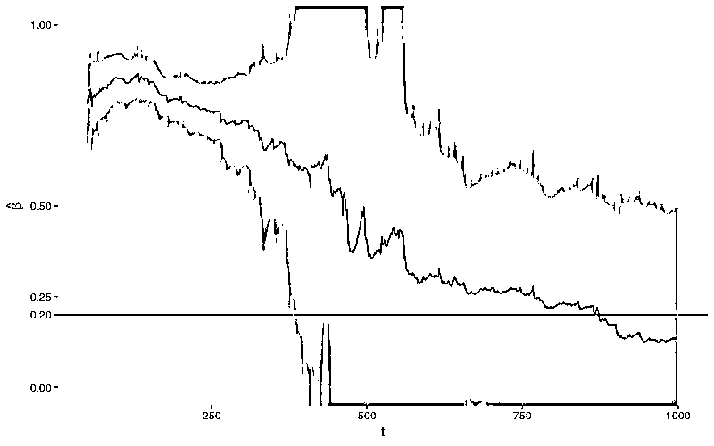</nobr>

```py
`ibrary(reshape2)
library(plyr)
library(dplyr)

param_reshape <- function(p)
{
    p <- as.data.frame(p)
    p$t <- as.integer(rownames(p))

    pnew <- melt(
        p, id.vars = "t", variable.name = "parameter")

    pnew$parameter <- as.character(pnew$parameter)
    pnew.se <- pnew[grepl("*.se", pnew$parameter), ]
    pnew.se$parameter <- sub(".se", "", pnew.se$parameter)
    names(pnew.se)[3] <- "se"
    pnew <- pnew[!grepl("*.se", pnew$parameter), ]

    return(
        join(
            pnew, pnew.se,
            by = c("t", "parameter"),
            type = "inner"))
}

ggp <- ggplot(
    param_reshape(params),
    aes(x = t, y = value)) +
    geom_line() +
    geom_ribbon(
        aes(ymin = value - 2 * se,
            ymax = value + 2 * se),
        color = "grey",
        alpha = 0.5) +
    geom_hline(yintercept = 0.2, color = "blue") +
    scale_y_continuous(
        breaks = c(0, 0.2, 0.25, 0.5, 0.75, 1)) +
    coord_cartesian(ylim = c(0, 1)) +
    facet_grid(. ~ parameter)

print(ggp + ggtitle("NLMINB Optimization"))`
```

<nobr aria-hidden="true"></nobr>

<nobr aria-hidden="true">这种现象不仅限于 beta\w，也表现出不良行为。(alpha 也不是很好，但要好得多。)</nobr>

<nobr aria-hidden="true">这种行为并不罕见，这是典型的。下面是使用不同种子生成的类似序列的图。</nobr>

<nobr aria-hidden="true">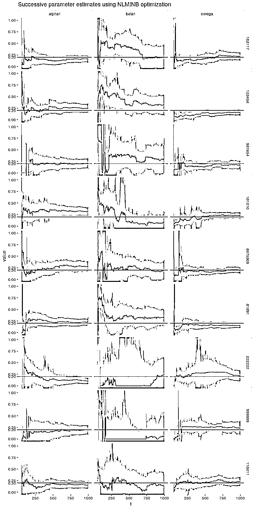</nobr>

<nobr aria-hidden="true">在这个图中我们看到了 beta 的其他类型的病态行为，特别是种子是 222222 和 999999 的情况，其中 beta 长期远低于正确值。对于所有这些模拟，beta 开始比正确的值大得多，接近 1，对于前面提到的两个种子，beta 从非常高的水平突然跳到非常低的水平。(此处未显示种子 110131 和 110137 的结果，它们甚至更糟！)</nobr>

<nobr aria-hidden="true">其他参数也存在自己的病态行为，但情况似乎并不那么严峻。我们看到的病态行为可能与 beta 的估计有关。实际上，如果我们看一下 ARCH(1)过程的类似实验（这是一个 GARCH(1,0)过程，相当于设置 beta=0）。</nobr>

```py
`set.seed(110117)

x <- garchSim(
    garchSpec(
        model = list(alpha = 0.2, beta = 0.2, omega = 0.2)),
    n.start = 1000, n = 1000)

xarch <- garchSim(
    garchSpec(
        model = list(omega = 0.2, alpha = 0.2, beta = 0)),
    n.start = 1000, n = 1000)
params_arch <- foreach(
    t = 50:1000,
    .combine = rbind,
    .packages = c("fGarch")) %dopar%
    {
        getFitData(
            xarch[1:t], formula = ~ garch(1, 0))
    }
rownames(params_arch) <- 50:1000

print(ggp %+% param_reshape(params_arch) + ggtitle("ARCH(1) Model"))`
```

<nobr aria-hidden="true" style="transition: none 0s ease 0s;border-width: 0px;border-style: initial;border-color: initial;max-width: none;max-height: none;min-width: 0px;min-height: 0px;vertical-align: 0px;line-height: normal;">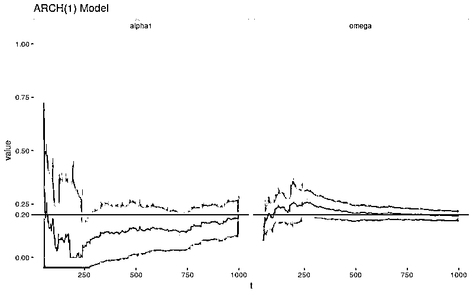</nobr>

<nobr aria-hidden="true" style="transition: none 0s ease 0s;border-width: 0px;border-style: initial;border-color: initial;max-width: none;max-height: none;min-width: 0px;min-height: 0px;vertical-align: 0px;line-height: normal;">病态行为似乎是数值性的，并且与 beta 密切相关。默认情况下，garchFit() 使用 nlminb()（带约束的拟牛顿方法）来解决优化问题，使用数值计算出的梯度。不过，我们可以选择其他方法。我们可以使用 L-BFGS-B 方法，以及 Nelder-Mead 方法。</nobr>

<nobr aria-hidden="true" style="transition: none 0s ease 0s;border-width: 0px;border-style: initial;border-color: initial;max-width: none;max-height: none;min-width: 0px;min-height: 0px;vertical-align: 0px;line-height: normal;">不幸的是，这些替代优化算法没有做得更好，他们甚至可能会做得更糟。</nobr>

```py
`# lbfgsb algorithm
params_lbfgsb <- foreach(
    t = 50:1000,
    .combine = rbind,
    .packages = c("fGarch")) %dopar%
    {
        getFitData(x[1:t], algorithm = "lbfgsb")
    }
rownames(params_lbfgsb) <- 50:1000

# nlminb+nm algorithm
params_nlminbnm <- foreach(
    t = 50:1000,
    .combine = rbind,
    .packages = c("fGarch")) %dopar%
    {
        getFitData(x[1:t], algorithm = "nlminb+nm")
    }
rownames(params_nlminbnm) <- 50:1000

# lbfgsb+nm algorithm
params_lbfgsbnm <- foreach(
    t = 50:1000,
    .combine = rbind,
    .packages = c("fGarch")) %dopar%
    {
        getFitData(x[1:t], algorithm = "lbfgsb+nm")
    }
rownames(params_lbfgsbnm) <- 50:1000

# cond.dist is norm (default)
params_norm <- foreach(
    t = 50:1000,
    .combine = rbind,
    .packages = c("fGarch")) %dopar%
    {
        getFitData(x[1:t], cond.dist = "norm")
    }
rownames(params_norm) <- 50:1000

print(ggp %+% param_reshape(params_lbfgsb) + ggtitle("L-BFGS-B Optimization"))`
```

<nobr aria-hidden="true" style="transition: none 0s ease 0s;border-width: 0px;border-style: initial;border-color: initial;max-width: none;max-height: none;min-width: 0px;min-height: 0px;vertical-align: 0px;line-height: normal;">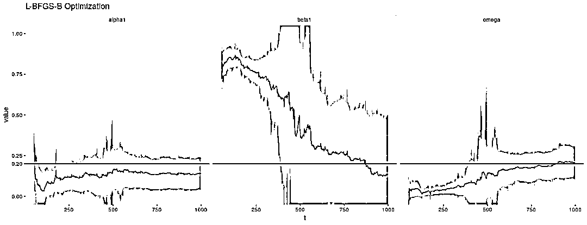</nobr>

<nobr aria-hidden="true" style="transition: none 0s ease 0s;border-width: 0px;border-style: initial;border-color: initial;max-width: none;max-height: none;min-width: 0px;min-height: 0px;vertical-align: 0px;line-height: normal;">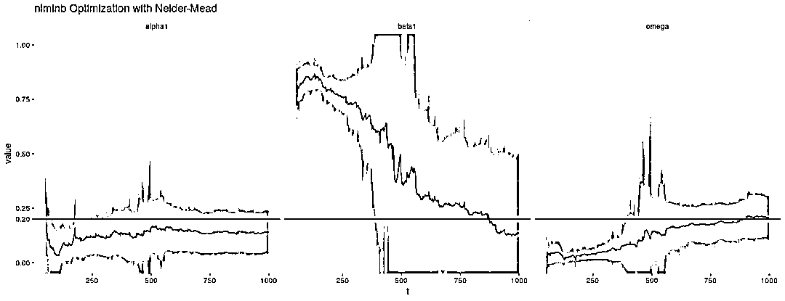</nobr>

<nobr aria-hidden="true" style="transition: none 0s ease 0s;border-width: 0px;border-style: initial;border-color: initial;max-width: none;max-height: none;min-width: 0px;min-height: 0px;vertical-align: 0px;line-height: normal;">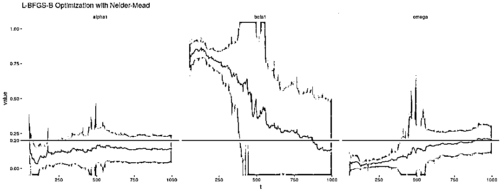</nobr>

<nobr aria-hidden="true" style="transition: none 0s ease 0s;border-width: 0px;border-style: initial;border-color: initial;max-width: none;max-height: none;min-width: 0px;min-height: 0px;vertical-align: 0px;line-height: normal;">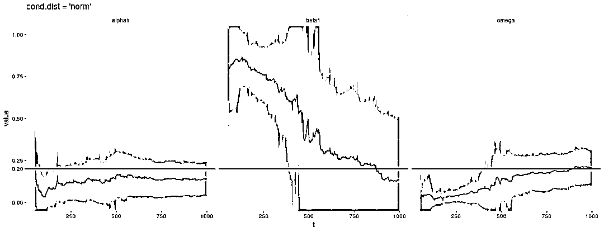</nobr>

<nobr aria-hidden="true" style="transition: none 0s ease 0s;border-width: 0px;border-style: initial;border-color: initial;max-width: none;max-height: none;min-width: 0px;min-height: 0px;vertical-align: 0px;line-height: normal;">在 CRAN，**fGarch** 自 2013 年以来没有看到更新！有可能 **fGarch** 开始显现出它的落伍老迈，新的包装已经解决了我在这里强调的一些问题。包 **tseries** 提供了一个函数 garch()，它也通过 QMLE 拟合 GARCH(1,1)模型，并且比 **fGarch** 更新。它是我所知道的唯一可以拟合 GARCH(1,1)模型的其他包。</nobr>

<nobr aria-hidden="true" style="transition: none 0s ease 0s;border-width: 0px;border-style: initial;border-color: initial;max-width: none;max-height: none;min-width: 0px;min-height: 0px;vertical-align: 0px;line-height: normal;">不幸的是，garch() 没有做得更好。事实上，它似乎更糟糕。问题再一次出现在 beta 身上。</nobr>

```py
`library(tseries)

getFitDatagarch <- function(x) {
    garch(x)$coef
}

params_tseries <- foreach(
    t = 50:1000,
    .combine = rbind,
    .packages = c("tseries")) %dopar%
    {
        getFitDatagarch(x[1:t])
    }
rownames(params_tseries) <- 50:1000

param_reshape_tseries <- function(p) {
    p <- as.data.frame(p)
    p$t <- as.integer(rownames(p))

    pnew <- melt(
        p, id.vars = "t", variable.name = "parameter")

    pnew$parameter <- as.character(pnew$parameter)

    return(pnew)
}

ggplot(
    param_reshape_tseries(params_tseries),
    aes(x = t, y = value)) +
    geom_line() +
    geom_hline(
        yintercept = 0.2, color = "blue") +
    scale_y_continuous(
        breaks = c(0, 0.2, 0.25, 0.5, 0.75, 1)) +
    coord_cartesian(ylim = c(0, 1)) +
    facet_grid(. ~ parameter)`
```

<nobr aria-hidden="true" style="transition: none 0s ease 0s;border-width: 0px;border-style: initial;border-color: initial;max-width: none;max-height: none;min-width: 0px;min-height: 0px;vertical-align: 0px;line-height: normal;">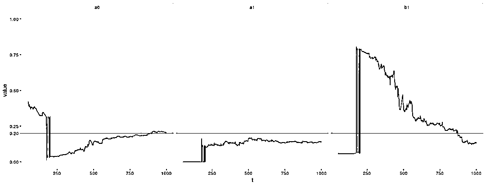</nobr>

<nobr aria-hidden="true" style="transition: none 0s ease 0s;border-width: 0px;border-style: initial;border-color: initial;max-width: none;max-height: none;min-width: 0px;min-height: 0px;vertical-align: 0px;line-height: normal;">所有这些实验均在固定（但随机选择）的序列上进行。实验显示，对于样本量小于 300（可能更大的数字）的情况，GARCH(1,1)参数估计的分布是可疑的。当我们模拟许多过程并查看参数的分布时会发生什么？</nobr>

<nobr aria-hidden="true" style="transition: none 0s ease 0s;border-width: 0px;border-style: initial;border-color: initial;max-width: none;max-height: none;min-width: 0px;min-height: 0px;vertical-align: 0px;line-height: normal;">我模拟了 10000 个样本大小为 100、500 和 1000 的 GARCH(1,1)过程（使用与之前相同的参数）。以下是参数估计的经验分布。</nobr>

```py
`experiments2 <- foreach(
    n = c(100, 500, 1000)) %do%
    {
        mat <- foreach(
            i = 1:10000,
            .combine = rbind,
            .packages = c("fGarch")) %dopar%
            {
                x <- garchSim(
                    garchSpec(
                        model = list(
                            omega = 0.2, alpha = 0.2, beta = 0.2)),
                    n.start = 1000,
                    n = n)
                getFitData(x)
            }
        rownames(mat) <- NULL
        mat
    }
names(experiments2) <- c(100, 500, 1000)

save(params, x, experiments1,
     xarch, params_arch, params_lbfgsb,
     params_nlminbnm, params_lbfgsbnm,
     params_norm, params_tseries,
     experiments2,
     file = "garchfitexperiments.Rda")

param_sim <- lapply(
    experiments2,
    function(mat)
    {
        df <- as.data.frame(mat)
        df <- df[c("omega", "alpha1", "beta1")]
        return(df)
    }) %>%
    ldply(.id = "n")
param_sim <- param_sim %>%
    melt(id.vars = "n", variable.name = "parameter")
head(param_sim)`
```

```py
`##     n parameter        value
## 1 100     omega 8.015968e-02
## 2 100     omega 2.493595e-01
## 3 100     omega 2.300699e-01
## 4 100     omega 3.674244e-07
## 5 100     omega 2.697577e-03
## 6 100     omega 2.071737e-01`
```

```py
`ggplot(
    param_sim,
    aes(x = value)) +
    geom_density(
        fill = "grey", alpha = 0.7) +
    geom_vline(
        xintercept = 0.2, color = "blue") +
    facet_grid(
        n ~ parameter)`
```

<nobr aria-hidden="true" style="transition: none 0s ease 0s;border-width: 0px;border-style: initial;border-color: initial;max-width: none;max-height: none;min-width: 0px;min-height: 0px;vertical-align: 0px;line-height: normal;">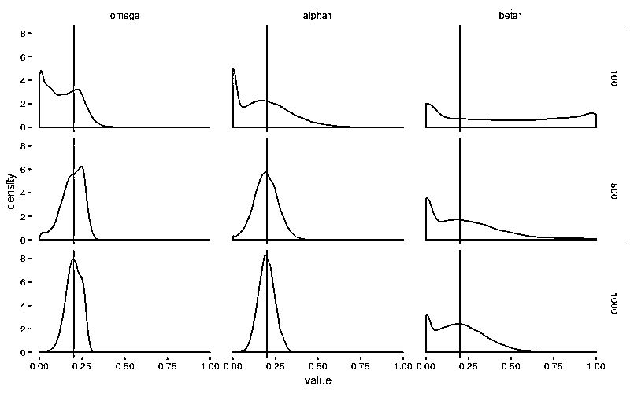</nobr>

<nobr aria-hidden="true" style="transition: none 0s ease 0s;border-width: 0px;border-style: initial;border-color: initial;max-width: none;max-height: none;min-width: 0px;min-height: 0px;vertical-align: 0px;line-height: normal;">当样本量为 100 时，这些估计远非可靠。ω和α以一种令人不安的倾向趋近于 0，而β几乎可以说是任何东西。如上所述，garchFit() 报告的标准差不会捕获这种行为。对于较大的样本量，ω和α表现得更好，但β仍显示出令人不安的行为。它的变化幅度几乎没有变化，并且它仍然有过小的倾向。</nobr>

<nobr aria-hidden="true" style="transition: none 0s ease 0s;border-width: 0px;border-style: initial;border-color: initial;max-width: none;max-height: none;min-width: 0px;min-height: 0px;vertical-align: 0px;line-height: normal;">最让我困扰的是样本量为 1000 让我感觉很大。如果一个人正在查看股票价格的每日数据，那么此样本大小大致相当于 4 年的数据。这告诉我，这种病态行为正在影响人们现在试图估计并在模型中使用的 GARCH 模型。</nobr>

<nobr aria-hidden="true" style="transition: none 0s ease 0s;border-width: 0px;border-style: initial;border-color: initial;max-width: none;max-height: none;min-width: 0px;min-height: 0px;vertical-align: 0px;line-height: normal;">**结论**</nobr>

<nobr aria-hidden="true" style="transition: none 0s ease 0s;border-width: 0px;border-style: initial;border-color: initial;max-width: none;max-height: none;min-width: 0px;min-height: 0px;vertical-align: 0px;line-height: normal;">由 John C. Nash 撰写的题为《On best practice optimization methods in R》的文章，发表于 2014 年 9 月的 Journal of Statistical Software，讨论了 R 需要更好的优化计算实践。特别是，他强调了 garchFit() 使用了过时的方法（或至少它们的 R 实现）。他主张在社区中提高对优化问题的认识，并提高包的灵活性，而不仅仅是使用 optim() 提供的不同算法。</nobr> 

<nobr aria-hidden="true" style="transition: none 0s ease 0s;border-width: 0px;border-style: initial;border-color: initial;max-width: none;max-height: none;min-width: 0px;min-height: 0px;vertical-align: 0px;line-height: normal;">我在本文中强调的问题让我更加意识到选择在优化方法中的重要性。我最初的目标是编写一个函数，用于根据 GARCH 模型中的结构性变化执行统计检验。正如我在此演示的那样，这些检验严重依赖于对模型参数的连续估计。至少我的实验表明，参数的变化没有被标准差充分捕获，同时也存在参数估计中不可接受的高度不稳定性。它们是如此不稳定，它将使检验不拒绝无变化的原假设成为一项奇迹（译注：几乎必然拒绝原假设）。毕竟，只要看一下模拟数据的图片就可以得出结论，结构性变化的备择假设是正确的。因此，每当我尝试对原假设被认为是真的数据进行检验时，检验就明确拒绝它，其中 p-值基本上为 0。</nobr>

<nobr aria-hidden="true" style="transition: none 0s ease 0s;border-width: 0px;border-style: initial;border-color: initial;max-width: none;max-height: none;min-width: 0px;min-height: 0px;vertical-align: 0px;line-height: normal;">我听说有人们正对 GARCH 模型中的结构性变化进行假设检验研究，所以如果我在这里写到的数值不稳定性可以避免，我不会对此感到惊讶。这是一个我自认知之甚少的主题，如果 R 社区中的某个人已经观察到了这种行为并且知道如何解决它，我希望他们会在评论或电子邮件中告诉我。我可以写一个回复并展示如何使用 garchFit() 生成参数的稳定估计。也许关键在于函数 garchFitControl()。</nobr>

<nobr aria-hidden="true" style="transition: none 0s ease 0s;border-width: 0px;border-style: initial;border-color: initial;max-width: none;max-height: none;min-width: 0px;min-height: 0px;vertical-align: 0px;line-height: normal;">我也考虑过根据我的测试编写自己的优化程序。Nash 教授在他的论文中强调了针对特定问题的需求定制优化程序的重要性。我已经写下了要优化的量，我有一个 GARCH(1,1)</nobr>

<nobr aria-hidden="true" style="transition: none 0s ease 0s;border-width: 0px;border-style: initial;border-color: initial;max-width: none;max-height: none;min-width: 0px;min-height: 0px;vertical-align: 0px;line-height: normal;">的梯度和 Hessian 矩阵的公式。也许我们的检验所要求的连续优化可以使用先前迭代中的参数作为初始值，从而有助于防止优化计算找到离群的、局部最优而全局次优的解。</nobr> 

<nobr aria-hidden="true" style="transition: none 0s ease 0s;border-width: 0px;border-style: initial;border-color: initial;max-width: none;max-height: none;min-width: 0px;min-height: 0px;vertical-align: 0px;line-height: normal;">虽然这使得问题比我最初想找一个我们检验的例子更难。我现在正在计划检测 GARCH 模型中的结构性变化，但是仅涉及使用线性回归的示例（一个更易处理的问题）。但我希望听到别人对我在这里写的内容的意见。</nobr>

```py
`sessionInfo()
 ## R version 3.3.3 (2017-03-06)
## Platform: i686-pc-linux-gnu (32-bit)
## Running under: Ubuntu 16.04.2 LTS
##
## locale:
##  [1] LC_CTYPE=en_US.UTF-8       LC_NUMERIC=C
##  [3] LC_TIME=en_US.UTF-8        LC_COLLATE=en_US.UTF-8
##  [5] LC_MONETARY=en_US.UTF-8    LC_MESSAGES=en_US.UTF-8
##  [7] LC_PAPER=en_US.UTF-8       LC_NAME=C
##  [9] LC_ADDRESS=C               LC_TELEPHONE=C
## [11] LC_MEASUREMENT=en_US.UTF-8 LC_IDENTIFICATION=C
##
## attached base packages:
## [1] stats     graphics  grDevices utils     datasets  methods   base
##
## other attached packages:
## [1] dplyr_0.7.2           plyr_1.8.4            reshape2_1.4.2
## [4] fGarch_3010.82.1      fBasics_3011.87       timeSeries_3022.101.2
## [7] timeDate_3012.100     ggplot2_2.2.1
##
## loaded via a namespace (and not attached):
##  [1] Rcpp_0.12.11     bindr_0.1        knitr_1.17       magrittr_1.5
##  [5] munsell_0.4.3    colorspace_1.3-2 R6_2.2.0         rlang_0.1.2
##  [9] stringr_1.2.0    tools_3.3.3      grid_3.3.3       gtable_0.2.0
## [13] htmltools_0.3.6  assertthat_0.1   yaml_2.1.14      lazyeval_0.2.0  
## [17] rprojroot_1.2    digest_0.6.12    tibble_1.3.4     bindrcpp_0.2
## [21] glue_1.1.1       evaluate_0.10    rmarkdown_1.6    labeling_0.3
## [25] stringi_1.1.5    scales_0.4.1     backports_1.0.5  pkgconfig_2.0.1` 
```

<nobr aria-hidden="true" style="transition: none 0s ease 0s;border-width: 0px;border-style: initial;border-color: initial;max-width: none;max-height: none;min-width: 0px;min-height: 0px;vertical-align: 0px;line-height: normal;">**译后记**</nobr>

<nobr aria-hidden="true" style="transition: none 0s ease 0s;border-width: 0px;border-style: initial;border-color: initial;max-width: none;max-height: none;min-width: 0px;min-height: 0px;vertical-align: 0px;line-height: normal;">原作者所指出的 GARCH 模型参数估计的不稳定性不仅使其本人困惑，也同样令我震惊。我之前从未怀疑或质疑过统计软件的计算结果，甚至没有考虑过这个问题。今后在处理其他统计模型的参数估计问题时，务必首先用模拟数据检验一下相关软件的结果稳健性。</nobr> 

<nobr aria-hidden="true" style="transition: none 0s ease 0s;border-width: 0px;border-style: initial;border-color: initial;max-width: none;max-height: none;min-width: 0px;min-height: 0px;vertical-align: 0px;line-height: normal;">回到 GARCH 模型参数估计的话题，我猜测β的不稳定性可能来自以下原因：</nobr>

*   <nobr aria-hidden="true" style="transition: none 0s ease 0s;border-width: 0px;border-style: initial;border-color: initial;max-width: none;max-height: none;min-width: 0px;min-height: 0px;vertical-align: 0px;line-height: normal;">GARCH 序列的统计性质对 α 和 β敏感，特别是 β；</nobr>

*   <nobr aria-hidden="true" style="transition: none 0s ease 0s;border-width: 0px;border-style: initial;border-color: initial;max-width: none;max-height: none;min-width: 0px;min-height: 0px;vertical-align: 0px;line-height: normal;">ω、α、β以及长期方差之间存在一个硬性的等式约束，但是在优化计算中没有体现出这种等式约束。</nobr>

<nobr aria-hidden="true" style="transition: none 0s ease 0s;border-width: 0px;border-style: initial;border-color: initial;max-width: none;max-height: none;min-width: 0px;min-height: 0px;vertical-align: 0px;line-height: normal;">ω、α、β以及长期方差之间存在的硬性等式约束也许提供了技术性的补救手段：先估计 </nobr>

<nobr aria-hidden="true" style="transition: none 0s ease 0s;border-width: 0px;border-style: initial;border-color: initial;max-width: none;max-height: none;min-width: 0px;min-height: 0px;vertical-align: 0px;line-height: normal;">ω和 α，再用等式约束和经验长期方差推算出 β。</nobr>

<nobr aria-hidden="true" style="transition: none 0s ease 0s;border-width: 0px;border-style: initial;border-color: initial;max-width: none;max-height: none;min-width: 0px;min-height: 0px;vertical-align: 0px;line-height: normal;">延续原作者的思路，下面是后续研究工作和博客写作的安排：</nobr>

<nobr aria-hidden="true" style="transition: none 0s ease 0s;border-width: 0px;border-style: initial;border-color: initial;max-width: none;max-height: none;min-width: 0px;min-height: 0px;vertical-align: 0px;line-height: normal;">验证上述补救手段；</nobr>

*   <nobr aria-hidden="true" style="transition: none 0s ease 0s;border-width: 0px;border-style: initial;border-color: initial;max-width: none;max-height: none;min-width: 0px;min-height: 0px;vertical-align: 0px;line-height: normal;">测试 rugarch 的数值稳定性；</nobr>

*   <nobr aria-hidden="true" style="transition: none 0s ease 0s;border-width: 0px;border-style: initial;border-color: initial;max-width: none;max-height: none;min-width: 0px;min-height: 0px;vertical-align: 0px;line-height: normal;">测试 rmgarch 和 MTS 等数值稳定性；</nobr>

*   <nobr aria-hidden="true" style="transition: none 0s ease 0s;border-width: 0px;border-style: initial;border-color: initial;max-width: none;max-height: none;min-width: 0px;min-height: 0px;vertical-align: 0px;line-height: normal;">测试 pyflux、arch 和 statsmodels 等 python 包的数值稳定性。</nobr>

<nobr aria-hidden="true" style="transition: none 0s ease 0s;border-width: 0px;border-style: initial;border-color: initial;max-width: none;max-height: none;min-width: 0px;min-height: 0px;vertical-align: 0px;line-height: normal;">GARCH 模型参数估计的不稳定性也引出了另一个问题，对于不可观测的波动率的建模，参数估计以及校准的结果都是值得怀疑的。所以，某些 SDE 参数的估计和校准的稳定性实验应该提上日程。</nobr>

<nobr aria-hidden="true" style="transition: none 0s ease 0s;border-width: 0px;border-style: initial;border-color: initial;max-width: none;max-height: none;min-width: 0px;min-height: 0px;vertical-align: 0px;line-height: normal;">**参考：**</nobr>

<nobr aria-hidden="true" style="transition: none 0s ease 0s;border-width: 0px;border-style: initial;border-color: initial;max-width: none;max-height: none;min-width: 0px;min-height: 0px;vertical-align: 0px;line-height: normal;">1、Bollerslev 在他 1986 年的文章（《General autoregressive conditional heteroscedasticity》）中介绍了 GARCH 模型。</nobr>

<nobr aria-hidden="true" style="transition: none 0s ease 0s;border-width: 0px;border-style: initial;border-color: initial;max-width: none;max-height: none;min-width: 0px;min-height: 0px;vertical-align: 0px;line-height: normal;">2、《GARCH Models: Structure, Statistical Inference and Financial Applications》，Christian Francq 和 Jean-Michel Zakoian 著。</nobr>

<nobr aria-hidden="true" style="transition: none 0s ease 0s;border-width: 0px;border-style: initial;border-color: initial;max-width: none;max-height: none;min-width: 0px;min-height: 0px;vertical-align: 0px;line-height: normal;">**公众号官方 QQ 群**</nobr>

<nobr aria-hidden="true" style="transition: none 0s ease 0s;border-width: 0px;border-style: initial;border-color: initial;max-width: none;max-height: none;min-width: 0px;min-height: 0px;vertical-align: 0px;line-height: normal;">**群里已经分享了****60 篇****干货**</nobr>

<nobr aria-hidden="true" style="transition: none 0s ease 0s;border-width: 0px;border-style: initial;border-color: initial;max-width: none;max-height: none;min-width: 0px;min-height: 0px;vertical-align: 0px;line-height: normal;">**没有按规则加群者一律忽略**</nobr>

<nobr aria-hidden="true" style="transition: none 0s ease 0s;border-width: 0px;border-style: initial;border-color: initial;max-width: none;max-height: none;min-width: 0px;min-height: 0px;vertical-align: 0px;line-height: normal;"></nobr>