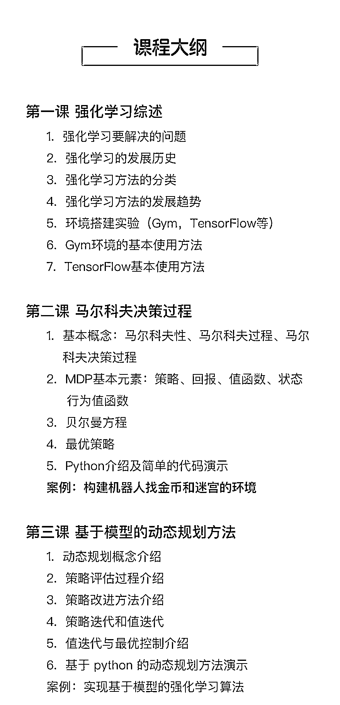

# 特斯拉无人驾驶最核心的人工智能算法，竟是强化学习

> 原文：[`mp.weixin.qq.com/s?__biz=MzAxNTc0Mjg0Mg==&mid=2653289571&idx=1&sn=bb50e5f8f16df6ea031fcc36383a8a67&chksm=802e3e76b759b7602566e381b7090f3bd93dd4f4ef126d9dd5b21681c35284d3812db04f5119&scene=27#wechat_redirect`](http://mp.weixin.qq.com/s?__biz=MzAxNTc0Mjg0Mg==&mid=2653289571&idx=1&sn=bb50e5f8f16df6ea031fcc36383a8a67&chksm=802e3e76b759b7602566e381b7090f3bd93dd4f4ef126d9dd5b21681c35284d3812db04f5119&scene=27#wechat_redirect)

2017 年，谷歌的 AlphaGo 再次卷土重来，完败世界第一棋手柯洁，人工智能一下子成为全球讨论的焦点，而升级版的技术——**强化学习算法更是瞬间成为技术领域讨论的热点**。

风口已至，Google、亚马逊、微软等巨头，开始大力布局人工智能领域。百度，腾讯，阿里巴巴，京东，等互联网巨头甚至都在美国硅谷**大肆高薪挖掘**人工智能人才。

▌互联网巨头抢人大战硝烟四起

就在 Google 第一女神李飞飞离职的 50 天后。2018 年 11 月 15 日，另一位知名的谷歌 AI 华裔高管，也辞别了这家美国科技巨头。

她叫做李佳，谷歌云 AI 研发主管、谷歌 AI 中国中心总裁。

算上之前回归斯坦福大学的李飞飞，卸任百度副总裁的陆奇，还有 2017 年出走的前百度首席科学家吴恩达，接连 4 位重量级人工智能专家离开中国，千万年薪对于他们，早已不再具有吸引力。

除了对梦想的追求，其背后更是**人工智能领域对人才的追逐**，不仅是企业，还包括学术界。

此刻的北京，即便是普通的机器学习算法岗位，少则月薪 20k，甚至 100k 以上……

风口来了，真的是猪要飞起来了，猪肉也开始涨价了。

▌**强化学习是技能升级的必然选择**

进入人工智能，深度学习算法是必须要学习的，再结合未来 5 年的发展，人工智能的算法技术再次细化，强化学习成为人工智能发展的核心技术，让机器学会自我探索，能判断出最优的行为。

> **为什么强化学习将会成为人工智能发展的核心技术，我们就拿最火的无人驾驶来说。**
> 
> 首先，强化学习可以更有效地解决环境特殊情况。比如，针对可能会出现行人和动物乱穿马路的特殊情况，强化学习就可以学习如何做出正确的行为。
> 
> 其次，强化学习具有整体的系统性，对其中的一些模块更加鲁棒。例如，自动驾驶中的感知模块不可能做到完全可靠。有一次无，Tesla 无人驾驶的事故就是因为在强光环境中感知模块失效导致的。
> 
> 
> 
> 最后，强化学习可以比较容易学习到一系列行为。自动驾驶中需要执行一系列正确的行为才能成功的驾驶。而强化学习能够学会自动修正偏移。

讲了这么说，对于非专业的半路出家的我们该如何学习呢？

很简单！那就选择一位好的导师，快速入门。互联网时代，越快学会，损失的时间成本越低。

11 月 30 日，小象学院联合上海交通大学叶梓博士，准备了一场关于强化学习的人工智能盛宴，从**算法角度和技术发展**，带你领略强化学习的重要秘诀，快速了解和认知强化学习，成为一名人工智能工程师。

**长按二维码查看详情**

**长按二维码查看详情**

咨询，报名，查看更多课程，请点击**【阅读原文】**

**↓↓↓**