# 用机器学习来预测股价（代码+文档）——2018 年 iNTUtion 决赛大作！

> 原文：[`mp.weixin.qq.com/s?__biz=MzAxNTc0Mjg0Mg==&mid=2653289561&idx=1&sn=3363dc9c7e6c6facbc61cb414a107f11&chksm=802e3e4cb759b75a0c14cbe023932ca0d2dbb66a1946e38775200a69c3510f3aff75ad6e5219&scene=27#wechat_redirect`](http://mp.weixin.qq.com/s?__biz=MzAxNTc0Mjg0Mg==&mid=2653289561&idx=1&sn=3363dc9c7e6c6facbc61cb414a107f11&chksm=802e3e4cb759b75a0c14cbe023932ca0d2dbb66a1946e38775200a69c3510f3aff75ad6e5219&scene=27#wechat_redirect)


本期作者：Roman Moser

本期翻译：deigozhao

**未经授权，严禁转载**

机器学习和深度学习在时间序列数据的预测上具有很高的准确率，在金融机构中获得了广泛的应用。有大量的研究来进一步提升金融数据相关模型的准确率，本文要介绍的 AlphaAI 项目就是其中之一，AlphaAI 使用栈式神经网络的架构（stacked neural network architecture ）来预测多只股票的价格。

**工作流程**

AlphaAI 的关键流程包括以下 5 步：

**1、获取股票价格数据**

**2、用小波变换(Wavelet Transform)去除数据中的噪声**

**3、用栈式自编码器(stacked autoencoder)来提取特征**

**4、用这些特征来训练 LSTM 模型**

**5、测试模型的准确率**

下面详细介绍以上 5 个步骤的具体细节。

**数据获取**

获取股票价格比较简单，直接用 pandas_datareader 这个 API 从雅虎财经获取数据即可。代码是：

```py
stock_data = pdr.get_data_yahoo(self.ticker, self.start, self.end)
```

**数据去噪和小波变换**

由于股票市场动态的复杂性，股票的价格数据往往充满噪音，可能会影响机器学习的效果。因此很有必要把噪音从股票价格的趋势和结构中剔除出去。

去噪的方法可以是傅里叶变换，也可以是本文中使用的小波变换。

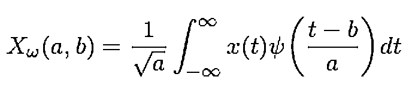

小波变换的公式如上，具体的操作是: 

a. 做小波变换

b. 把落在一个标准差之外的系数剔除掉

c. 只用新的系数，生成新的去噪后的股价数据

下图是一个用小波变换来处理时间序列数据的效果图：

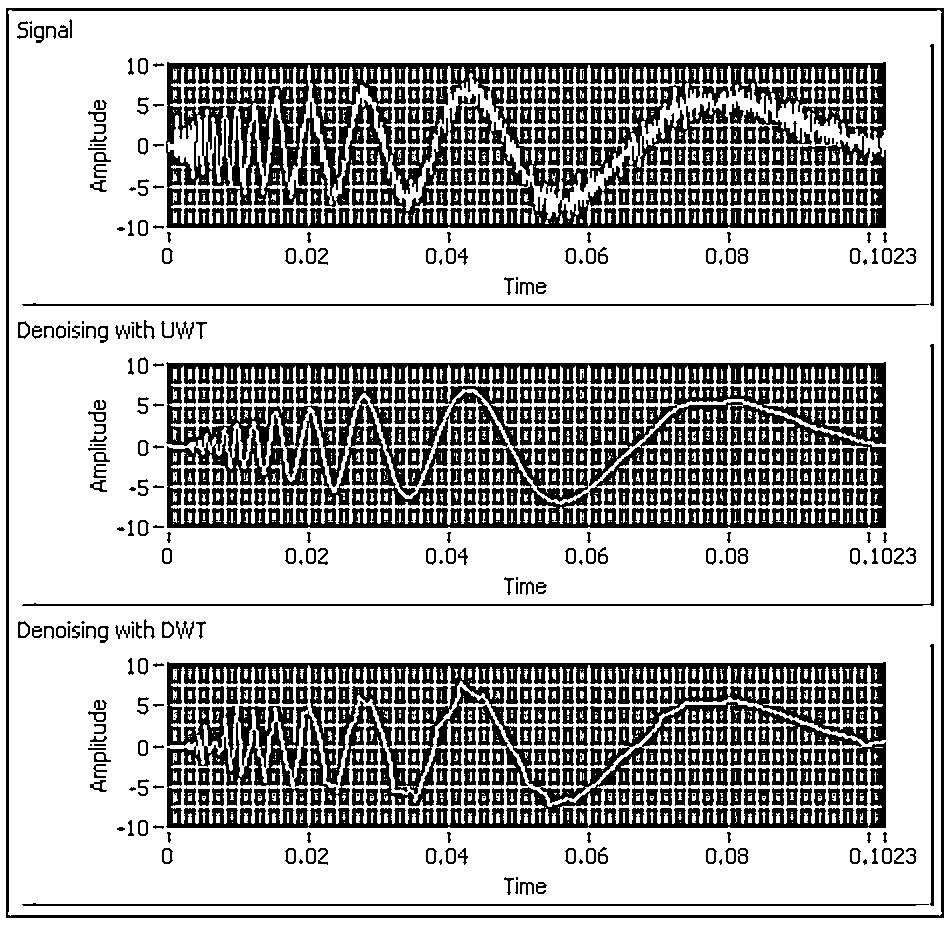

第 1 个图形是原始数据，经过小波变换后得到第 2 和第 3 个图形；可以看出后两个图形中毛刺的噪声数据已经被有效剔除。

Pywt 是一个很好用的 python 库，用这个库来处理上述小波变换的 python 代码如下：

```py
x = np.array(self.stock_data.iloc[i: i + 11, j])                
(ca, cd) = pywt.dwt(x, "haar")                
cat = pywt.threshold(ca, np.std(ca), mode="soft")                
cdt = pywt.threshold(cd, np.std(cd), mode="soft")                
tx = pywt.idwt(cat, cdt, "haar")
```

**提取特征和栈式自编码器**

通常在机器学习中，往往需要利用领域知识来构建特征提取的方法，也可以使用受限玻尔兹曼机(restricted Boltzmann machines )来自动提取特征。本文采用的是栈式自编码器(stacked autoencoders)，主要是考虑到栈式自编码器的可解释性更好。 

栈式自编码器把数据先从高维压缩到低维、然后再扩展到高维，这个过程的压缩部分就是很有效的一种特征提取的方法。栈式自编码器的网络结构图如下：

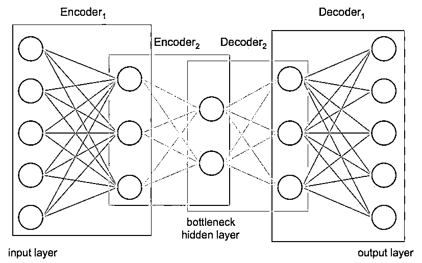

输入数据可以被压缩到任意的维度(网络的一个节点可以看做一维特征)，通过先压缩后扩展的方式，输入数据中有效的特征被提取了出来。另外，栈式自编码器的输入层和输出层是一样的，是一种无监督学习的算法，不需要特定的人工标注数据。

我们用 keras 来生产这样一个模型：

```py
class AutoEncoder:
    def __init__(self, encoding_dim):
        self.encoding_dim = encoding_dim
    def build_train_model(self, input_shape, encoded1_shape, encoded2_shape, decoded1_shape, decoded2_shape):
        input_data = Input(shape=(1, input_shape))
        encoded1 = Dense(encoded1_shape, activation="relu", activity_regularizer=regularizers.l2(0))(input_data)
        encoded2 = Dense(encoded2_shape, activation="relu", activity_regularizer=regularizers.l2(0))(encoded1)
        encoded3 = Dense(self.encoding_dim, activation="relu", activity_regularizer=regularizers.l2(0))(encoded2)
        decoded1 = Dense(decoded1_shape, activation="relu", activity_regularizer=regularizers.l2(0))(encoded3)
        decoded2 = Dense(decoded2_shape, activation="relu", activity_regularizer=regularizers.l2(0))(decoded1)
        decoded = Dense(input_shape, activation="sigmoid", activity_regularizer=regularizers.l2(0))(decoded2)
        autoencoder = Model(inputs=input_data, outputs=decoded)
        encoder = Model(input_data, encoded3)
        # Now train the model using data we already preprocessed
        autoencoder.compile(loss="mean_squared_error", optimizer="adam")
        train = pd.read_csv("preprocessing/rbm_train.csv", index_col=0)
        ntrain = np.array(train)
        train_data = np.reshape(ntrain, (len(ntrain), 1, input_shape))
        # print(train_data)
        # autoencoder.summary()
        autoencoder.fit(train_data, train_data, epochs=1000)
```

****LSTM****模型****

LSTM 由于各种结构的 cell 和 gate 的存在，可以有效的捕捉相隔很远的两个 node 之间的关系，从而在时间序列的预测问题上效果非常好。让我们来详细讨论下细节：

**1、优化方法（Optimizer）**

一个好的优化方法，应该要具有更快的收敛速度、同时也要尽量避免陷入局部最优点从而无法收敛到全局最优值。本文使用的是 Adam optimizer ，该方法兼具 Adagrad 和 RMSprop 的优点。

先来看最基础的 SGD：

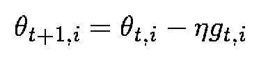

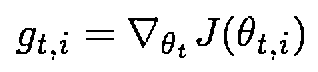

Adagrad 则用的是动态的学习率，根据历史迭代的梯度来计算当前的学习率；基本思想是如果历史梯度比较小、则该特征需要用小的学习率(避免步子卖得太大)，如果历史梯度比较大、则该特征可以用大的学习率(避免收敛的太慢)。 Adagrad 的公式如下

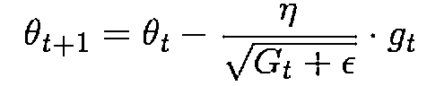

其中 G 是历史该特征历史梯度的平方和。

RMSprop 和 Adagrad 很像，但其在对历史梯度计算移动均值时，最近几轮的梯度影响会更大。其公式如下：

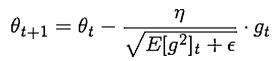

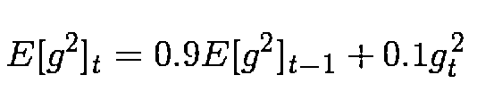

Adam 不仅考虑了动态的学习率，而且还考虑了动态的梯度。其动态学习率的处理和 RMSprop 是类似的。Adam 的公式如下：

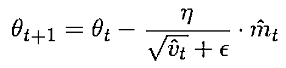

其中学习率的调整方式是： 

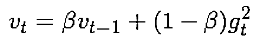

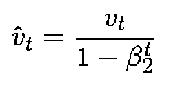

而梯度的动态调整时：

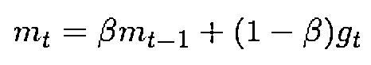

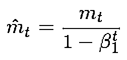

总结一下 Adam 的三个特点：

1、动态调整学习率

2、有效的避免梯度消失

3、梯度和学习率的迭代时，都用了动量的方法

**正则化**

训练深度模型的另外一个需要注意的地方是正则化，避免让模型参数过大、避免让训练过程陷入过拟合状态。文本采用的是 Tikhonov 正则方法，加上正则化之后的优化目标变成了：

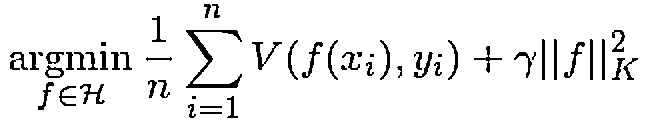

常用的 L2 正则是 Tikhonov 正则的一个特例（K=2）。

**Dropout**

Dropout 也是一种避免过拟合的方法， 方式是在训练的过程中随机的把某些中间节点丢弃掉。这样会迫使网络中某一层的节点不过分依赖上一层节点中的，因而使得这个网络具有更好的鲁棒性。下图是加了 Dropout 层的效果，可以看到加了 Dropout 使得分类错误率明显下降。

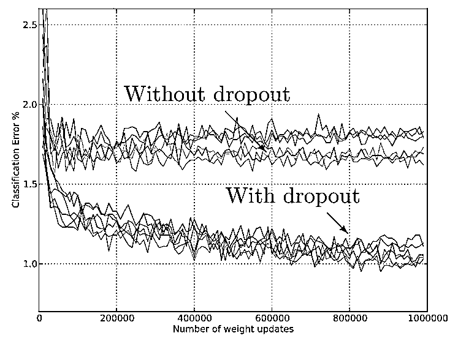

**模型实现**

上面的所有步骤都可以用 keras 来实现，下面是部分代码（全部代码文末查看）：

```py
class NeuralNetwork:
    def __init__(self, input_shape, stock_or_return):
        self.input_shape = input_shape
        self.stock_or_return = stock_or_return
    def make_train_model(self):
        input_data = kl.Input(shape=(1, self.input_shape))
        lstm = kl.LSTM(5, input_shape=(1, self.input_shape), return_sequences=True, activity_regularizer=regularizers.l2(0.003),
                       recurrent_regularizer=regularizers.l2(0), dropout=0.2, recurrent_dropout=0.2)(input_data)
        perc = kl.Dense(5, activation="sigmoid", activity_regularizer=regularizers.l2(0.005))(lstm)
        lstm2 = kl.LSTM(2, activity_regularizer=regularizers.l2(0.01), recurrent_regularizer=regularizers.l2(0.001),
                        dropout=0.2, recurrent_dropout=0.2)(perc)
        out = kl.Dense(1, activation="sigmoid", activity_regularizer=regularizers.l2(0.001))(lstm2)
        model = Model(input_data, out)
        model.compile(optimizer="adam", loss="mean_squared_error", metrics=["mse"])
        # load data
        train = np.reshape(np.array(pd.read_csv("features/autoencoded_train_data.csv", index_col=0)),
                           (len(np.array(pd.read_csv("features/autoencoded_train_data.csv"))), 1, self.input_shape))
        train_y = np.array(pd.read_csv("features/autoencoded_train_y.csv", index_col=0))
        # train_stock = np.array(pd.read_csv("train_stock.csv"))
        # train model
        model.fit(train, train_y, epochs=2000)
```

****实验结果****

下面是几只公司股票的股价预测和实际值的对比情况，可以看出效果不错。

雪佛龙公司的 MSE 是 2.11。

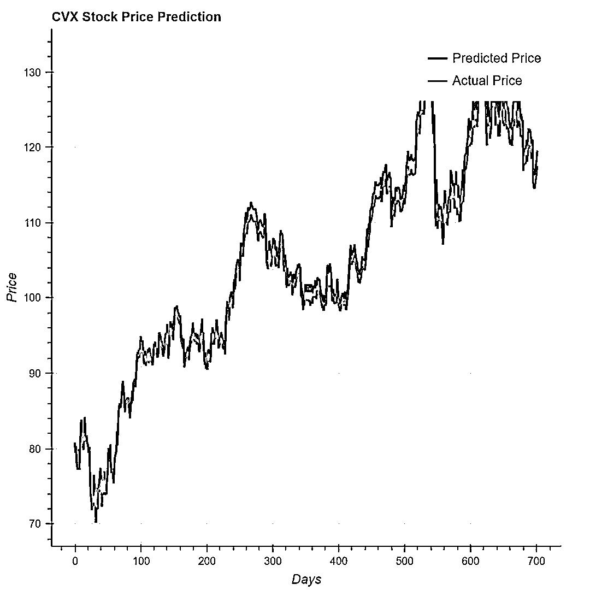

艾森克美孚公司的 MSE 是 0.0945。

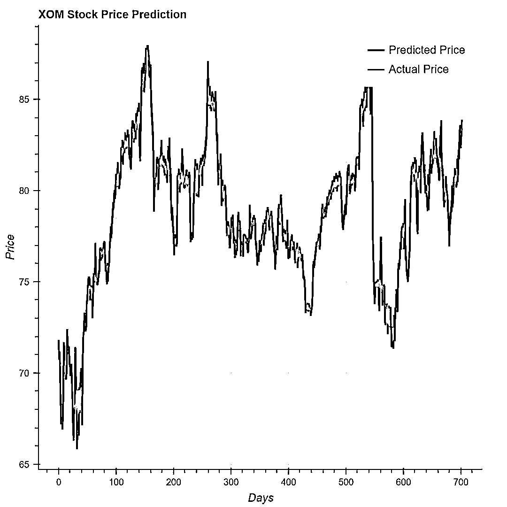

**在线学习（online learning）**

股价预测模型应该具有较好的 online learning 的能力，针对历史数据训练出来的模型训，应该在新的股价数据产生之后做出及时的更新。除了使用真实的股价数据来训练之外，还可以补充一些辅助数据，比如 twitter 中的推文和新闻中文章。推文数据和新闻文章中包含着大量和公司、股票走势相关的信息，针对这些信息可以做 NLP 分析（比如: 情感分析）。

获取全部 Twitter 推文的官方 API 是收费的，但幸运的是可以免费获取最近的 10 天数据。我们利用 TextBlob 这个工具对这些推文数据做情感分析， 这部分数据对在线学习模型是非常有用的。

同样的，获取完整的新闻数据也是比较困难的，想从 Bloomberg 网站上爬取自 2000 年以来的所有文章几乎不可行。因此我们利用 Aylien API 来获取数据，这个工具的爬虫功能很强大。我们只爬取了股票价格和金融新闻领域的数据，只保留了 top150 个站点的文章。所有的数据通过情感分析之后，按时间衰减算出平均值，送到在线学习的模型中去。

有了推文和新闻文章中情感分析数据，我们可以把这些数据加到神经网络的额外层中。不过在写作文本的时候，这部分模型的结果还没有准备完毕。

**结论**

神经网络是处理时间序列数据的非常有用的工具，再加上一些情感分析的数据就可以得到实际可用的模型。尽管目前的实验数据不错，后续我们还将进一步提升效果，希望最终可以变成一个可以完全自动化的模型。

**推荐阅读**

[01、经过多年交易之后你应该学到的东西（深度分享）](https://mp.weixin.qq.com/s?__biz=MzAxNTc0Mjg0Mg==&mid=2653289074&idx=1&sn=e859d363eef9249236244466a1af41b6&chksm=802e3867b759b1717f77e07a51ee5671e8115130c66562577280ba1243cba08218add04f1f00&token=449379994&lang=zh_CN&scene=21#wechat_redirect)

[02、监督学习标签在股市中的应用（代码+书籍）](https://mp.weixin.qq.com/s?__biz=MzAxNTc0Mjg0Mg==&mid=2653289050&idx=1&sn=60043a5c95b877dd329a5fd150ddacc4&chksm=802e384fb759b1598e500087374772059aa21b31ae104b3dca04331cf4b63a233c5e04c1945a&token=449379994&lang=zh_CN&scene=21#wechat_redirect)

[03、全球投行顶尖机器学习团队全面分析](https://mp.weixin.qq.com/s?__biz=MzAxNTc0Mjg0Mg==&mid=2653289018&idx=1&sn=8c411f676c2c0d92b0dd218f041bee4b&chksm=802e382fb759b139ffebf633ac14cdd0f21938e4613fe632d5d9231dab3d2aca95a11628378a&token=449379994&lang=zh_CN&scene=21#wechat_redirect)

[04、使用 Tensorflow 预测股票市场变动](https://mp.weixin.qq.com/s?__biz=MzAxNTc0Mjg0Mg==&mid=2653289014&idx=1&sn=3762d405e332c599a21b48a7dc4df587&chksm=802e3823b759b135928d55044c2729aea9690f86752b680eb973d1a376dc53cfa18287d0060b&token=449379994&lang=zh_CN&scene=21#wechat_redirect)

[05、使用 LSTM 预测股票市场基于 Tensorflow](https://mp.weixin.qq.com/s?__biz=MzAxNTc0Mjg0Mg==&mid=2653289238&idx=1&sn=3144f5792f84455dd53c27a78e8a316c&chksm=802e3903b759b015da88acde4fcbc8547ab3e6acbb5a0897404bbefe1d8a414265d5d5766ee4&token=2020206794&lang=zh_CN&scene=21#wechat_redirect)

[06、美丽的回测——教你定量计算过拟合概率](https://mp.weixin.qq.com/s?__biz=MzAxNTc0Mjg0Mg==&mid=2653289314&idx=1&sn=87c5a12b23a875966db7be50d11f09cd&chksm=802e3977b759b061675d1988168c1fec06c602e8583fbcc9b76f87008e0c10b702acc85467a0&token=1972390229&lang=zh_CN&scene=21#wechat_redirect)

[07、利用动态深度学习预测金融时间序列基于 Python](https://mp.weixin.qq.com/s?__biz=MzAxNTc0Mjg0Mg==&mid=2653289347&idx=1&sn=bf5d7899bc4a854d4ba9046fdc6fe0d6&chksm=802e3996b759b080287213840987bb0a0c02e4e1d4d7aae23f10a225a92ef6dd922d8006123d&token=290397496&lang=zh_CN&scene=21#wechat_redirect)

[08、Facebook 开源神器 Prophet 预测时间序列基于 Python](https://mp.weixin.qq.com/s?__biz=MzAxNTc0Mjg0Mg==&mid=2653289394&idx=1&sn=24a836136d730aa268605628e683d629&chksm=802e39a7b759b0b1dcf7aaa560699130a907716b71fc9c45ff0e5d236c5ae8ef80ebdb09dbb6&token=290397496&lang=zh_CN&scene=21#wechat_redirect)

[09、Facebook 开源神器 Prophet 预测股市行情基于 Python](https://mp.weixin.qq.com/s?__biz=MzAxNTc0Mjg0Mg==&mid=2653289437&idx=1&sn=f0dca7da8e69e7ba736992cb3d034ce7&chksm=802e39c8b759b0de5bce401c580623d0729ecca69d13926479d36e19aff8c9c9e8a20265afff&token=290397496&lang=zh_CN&scene=21#wechat_redirect)

[10、2018 第三季度最受欢迎的券商金工研报前 50（附下载）](https://mp.weixin.qq.com/s?__biz=MzAxNTc0Mjg0Mg==&mid=2653289358&idx=1&sn=db6e8ab85b08f6e67790ec0e401e586e&chksm=802e399bb759b08d6eec855f9901ea856d0da68c7425cba62791b8948da6ad761a3d88543dad&token=290397496&lang=zh_CN&scene=21#wechat_redirect)

[11、实战交易策略的精髓（公众号深度呈现）](https://mp.weixin.qq.com/s?__biz=MzAxNTc0Mjg0Mg==&mid=2653289447&idx=1&sn=f2948715bf82569a6556d518e56c1f9e&chksm=802e39f2b759b0e4502d1aaac562b87789573b55c76b3c85897d8c9d88dbf9a0b7ee34d86a4e&token=290397496&lang=zh_CN&scene=21#wechat_redirect)

[12、Markowitz 有效边界和投资组合优化基于 Python（附代码）](https://mp.weixin.qq.com/s?__biz=MzAxNTc0Mjg0Mg==&mid=2653289478&idx=1&sn=f8e01a641be021993d8ef2d84e94a299&chksm=802e3e13b759b7055cf27a280c672371008a5564c97c658eee89ce8481396a28d254836ff9af&token=290397496&lang=zh_CN&scene=21#wechat_redirect)

[13、使用 LSTM 模型预测股价基于 Keras](https://mp.weixin.qq.com/s?__biz=MzAxNTc0Mjg0Mg==&mid=2653289495&idx=1&sn=c4eeaa2e9f9c10995be9ea0c56d29ba7&chksm=802e3e02b759b7148227675c23c403fb9a543b733e3d27fa237b53840e030bf387a473d83e3c&token=1260956004&lang=zh_CN&scene=21#wechat_redirect)

[14、量化金融导论 1：资产收益的程式化介绍基于 Python](https://mp.weixin.qq.com/s?__biz=MzAxNTc0Mjg0Mg==&mid=2653289507&idx=1&sn=f0ca71aa07531bbbdbd33213f0bab89f&chksm=802e3e36b759b720138b3b17a4dd0e198e054b9de29a038fdd50805f824effa55831111ad026&token=1936245282&lang=zh_CN&scene=21#wechat_redirect)

[15、预测股市崩盘基于统计机器学习与神经网络（Python+文档）](https://mp.weixin.qq.com/s?__biz=MzAxNTc0Mjg0Mg==&mid=2653289533&idx=1&sn=4ef964834e84a9995111bb057b0fc5dd&chksm=802e3e28b759b73e0618eb1262c53aa0601fbf5805525a7c7ff40dc3db62c7704496611bdbf1&token=1950551577&lang=zh_CN&scene=21#wechat_redirect)

**公众号官方 QQ 群**

**群里已经分享了****60 篇****干货**

**没有按规则加群者一律忽略**


**没有代码的量化都是耍流氓**

在**后台**输入

**20181120**

**后台获取方式介绍**

